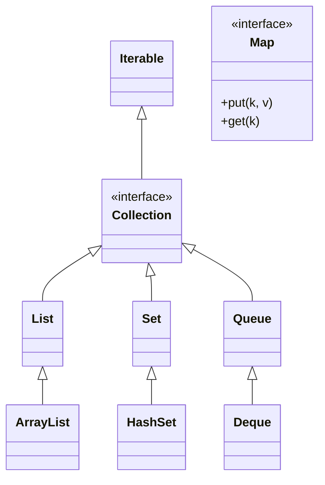

# Generic Collections

Generic (kiểu tổng quát) là phần `<...>` mà bạn thấy ở `ArrayList<String>` hay `HashMap<String, Integer>`, quy định loại dữ liệu mà collection được phép chứa. Nó mang lại type safety, giúp bắt lỗi sai kiểu ngay lúc biên dịch và không phải ép kiểu khi lấy ra. Bài này giới thiệu generic, wildcard, bounded type và cách tự viết phương thức generic; chi tiết nằm bên dưới.

[](pathname:///img/java/generic-collections.webp)

---

:::note[Ghi nhớ nhanh]

- ⭐ **Generics `List<String>`** — tham số hóa kiểu phần tử, bắt lỗi sai kiểu ngay lúc biên dịch (type safety).
- **Không cần cast** — lấy phần tử ra không phải ép kiểu, IDE autocomplete đầy đủ.
- ⭐ **Raw type nguy hiểm** — chứa `Object`, dễ gây `ClassCastException` lúc chạy.
- **Wildcard `?`** — giúp API linh hoạt nhận nhiều kiểu.
- **Bounded type** — giới hạn kiểu (vd `<T extends Number>`); tự viết được phương thức generic.

:::

---

## Mục lục

- [Vì sao collection cần generics?](#vì-sao-collection-cần-generics)
- [Generic là gì?](#generic-là-gì)
- [Vấn đề khi không có generic](#vấn-đề-khi-không-có-generic)
- [Type safety — an toàn kiểu dữ liệu](#type-safety--an-toàn-kiểu-dữ-liệu)
- [Vì sao `List<String>` tốt hơn List thường](#vì-sao-liststring-tốt-hơn-list-thường)
- [Generic trong nhiều collection](#generic-trong-nhiều-collection)
- [Wildcard — dấu hỏi ?](#wildcard--dấu-hỏi-)
- [Bounded type — giới hạn kiểu](#bounded-type--giới-hạn-kiểu)
- [Tự viết phương thức generic](#tự-viết-phương-thức-generic)
- [Lỗi thường gặp](#lỗi-thường-gặp)
- [Tóm tắt](#tóm-tắt)
- [Câu hỏi phỏng vấn](#câu-hỏi-phỏng-vấn)

---

## Vì sao collection cần generics?

**Vấn đề:** Trước Java 5, collection chỉ chứa `Object` nên kiểu phần tử bị lẫn lộn. Lấy phần tử ra phải ép kiểu (cast) thủ công, lỡ bỏ nhầm kiểu khác vào thì lỗi chỉ lộ lúc **chạy** (`ClassCastException`), và IDE không gợi ý (autocomplete) được.

```java
import java.util.ArrayList;
import java.util.List;

List ds = new ArrayList();   // raw type — chứa Object
ds.add("An");
ds.add(123);                 // Java KHÔNG ngăn — kiểu bị lẫn lộn

// Phải ép kiểu thủ công, không autocomplete
String ten = (String) ds.get(1); // ClassCastException lúc CHẠY (vốn là 123)
```

**Giải pháp:** Generics `List<String>` tham số hoá kiểu phần tử. Compiler **đảm bảo** chỉ bỏ đúng kiểu vào (bắt lỗi ngay lúc biên dịch), lấy ra **không cần** ép kiểu, IDE autocomplete đầy đủ. Bounded type và wildcard giúp API linh hoạt hơn. Kết quả: type-safe và gọn gàng.

```java
import java.util.ArrayList;
import java.util.List;

List<String> ds = new ArrayList<>(); // tham số hoá kiểu
ds.add("An");
// ds.add(123);                       // LỖI ngay lúc biên dịch — sửa sớm

String ten = ds.get(0); // lấy ra không cần cast, có autocomplete
```

:::tip[Dùng thực tế]
- `List<User>` lấy ra dùng ngay, không phải `(User) list.get(i)`.
- Compiler chặn lỡ tay bỏ nhầm kiểu khác vào danh sách.
- Viết một method generic `<T>` tái sử dụng cho mọi kiểu mà vẫn an toàn.
- Wildcard `<? extends T>` cho API nhận nhiều loại List linh hoạt (vd cộng tổng mọi `Number`).
:::

---

## Generic là gì?

**Generic** (kiểu tổng quát — cơ chế cho phép một lớp/phương thức làm việc với nhiều loại dữ liệu một cách an toàn) là phần `<...>` mà bạn đã thấy ở `ArrayList<String>` hay `HashMap<String, Integer>`.

Phần trong dấu ngoặc nhọn `< >` cho Java biết: "tập hợp này chỉ chứa loại dữ liệu này thôi". Ví dụ:

```java
import java.util.ArrayList;
import java.util.List;

// List này CHỈ chứa String
List<String> ten = new ArrayList<>();
ten.add("An");      // OK
// ten.add(123);    // LỖI ngay khi biên dịch — không phải String
```

Ký hiệu chữ cái như `<T>`, `<E>` chỉ là **tên đại diện cho một kiểu chưa xác định**:

- `T` = Type (kiểu bất kỳ)
- `E` = Element (phần tử)
- `K`, `V` = Key, Value (khóa, giá trị — dùng cho Map)

---

## Vấn đề khi không có generic

Ngày xưa (trước Java 5), collection **không có** generic. Bạn có thể nhét bất cứ thứ gì vào, dẫn đến lỗi nguy hiểm:

```java
import java.util.ArrayList;
import java.util.List;

// List thường (raw type — kiểu thô, không generic)
List danhSach = new ArrayList();

danhSach.add("An");   // thêm chuỗi
danhSach.add(123);    // thêm số — Java KHÔNG ngăn cản!

// Khi lấy ra phải ép kiểu thủ công, và dễ sai
String ten = (String) danhSach.get(1); // LỖI lúc chạy: ClassCastException
// vì phần tử ở chỉ số 1 thực ra là số 123, không phải String
```

Lỗi này chỉ lộ ra **khi chương trình chạy** (runtime) — rất khó phát hiện và nguy hiểm.

---

## Type safety — an toàn kiểu dữ liệu

**Type safety** (an toàn kiểu — bảo đảm dữ liệu đúng loại ngay từ lúc viết code) là lợi ích lớn nhất của generic. Với generic, Java bắt lỗi **ngay khi biên dịch** (compile time), trước cả khi chương trình chạy:

```java
List<String> ten = new ArrayList<>();
ten.add("An");
// ten.add(123); // Trình biên dịch BÁO LỖI NGAY — bạn sửa được trước khi chạy

// Lấy ra KHÔNG cần ép kiểu, vì Java biết chắc là String
String t = ten.get(0); // an toàn, không cần (String)
```

Phát hiện lỗi sớm = ít bug hơn, code an toàn hơn.

---

## Vì sao List&lt;String&gt; tốt hơn List thường

| Tiêu chí | `List` thường (raw) | `List<String>` (generic) |
|----------|---------------------|--------------------------|
| Loại dữ liệu chứa | Bất kỳ (dễ lẫn lộn) | Chỉ String |
| Phát hiện lỗi | Lúc chạy (muộn, nguy hiểm) | Lúc biên dịch (sớm, an toàn) |
| Ép kiểu khi lấy ra | Phải tự ép `(String)` | Không cần |
| Khả năng đọc code | Khó đoán chứa gì | Rõ ràng chứa String |

> Quy tắc: **luôn luôn dùng generic** cho collection. Đừng bao giờ viết `List` trống không trong code mới.

---

## Generic trong nhiều collection

Generic áp dụng cho mọi collection:

```java
import java.util.*;

// List chứa số nguyên
List<Integer> diem = new ArrayList<>();

// Set chứa chuỗi
Set<String> email = new HashSet<>();

// Map: khóa String, giá trị Integer
Map<String, Integer> tuoi = new HashMap<>();
tuoi.put("An", 20);

// Có thể lồng nhau: Map mà giá trị là một List
Map<String, List<String>> lopHoc = new HashMap<>();
lopHoc.put("Lớp A", new ArrayList<>());
lopHoc.get("Lớp A").add("An");
lopHoc.get("Lớp A").add("Bình");
```

Nhìn tổng thể cây phân cấp Collection Framework (mọi interface đều nhận generic `<E>` hoặc `<K, V>`; lưu ý `Map` là nhánh **riêng**, không thuộc `Collection`):


```mermaid
classDiagram
    Iterable <|-- Collection
    Collection <|-- List
    Collection <|-- Set
    Collection <|-- Queue
    List <|-- ArrayList
    Set <|-- HashSet
    Queue <|-- Deque
    class Collection {
        <<interface>>
    }
    class Map {
        <<interface>>
        +put(k, v)
        +get(k)
    }
```

---

## Wildcard — dấu hỏi ?

**Wildcard** (ký tự đại diện — dấu `?` nghĩa là "kiểu nào cũng được") dùng khi bạn viết phương thức nhận một collection mà **không cần biết chính xác kiểu phần tử**.

```java
import java.util.List;

// Phương thức in mọi List, bất kể chứa kiểu gì
public static void inDanhSach(List<?> ds) {
    for (Object phanTu : ds) { // lấy ra dưới dạng Object
        System.out.println(phanTu);
    }
}

// Dùng được với mọi loại List
inDanhSach(List.of("An", "Bình"));   // List<String>
inDanhSach(List.of(1, 2, 3));        // List<Integer>
```

`List<?>` nghĩa là "một List chứa kiểu nào đó (không xác định)". Bạn chỉ **đọc** được (dưới dạng `Object`), không thêm phần tử mới vào (trừ `null`), vì Java không biết kiểu thật là gì.

---

## Bounded type — giới hạn kiểu

**Bounded type** (kiểu có giới hạn — chỉ cho phép một nhóm kiểu nhất định) dùng từ khóa `extends` để giới hạn. Ví dụ chỉ nhận các kiểu **số** (`Number` và lớp con của nó như `Integer`, `Double`):

```java
import java.util.List;

// <? extends Number> nghĩa là: chứa Number hoặc lớp con của Number
public static double tinhTong(List<? extends Number> ds) {
    double tong = 0;
    for (Number n : ds) {
        tong += n.doubleValue(); // mọi Number đều có doubleValue()
    }
    return tong;
}

// Dùng được với List<Integer> và List<Double>
System.out.println(tinhTong(List.of(1, 2, 3)));       // 6.0
System.out.println(tinhTong(List.of(1.5, 2.5)));      // 4.0
// tinhTong(List.of("a", "b"));  // LỖI: String không phải Number
```

`<? extends Number>` đọc là "kiểu nào đó là Number hoặc con của Number". Nhờ vậy phương thức an toàn và linh hoạt cùng lúc.

---

## Tự viết phương thức generic

Bạn cũng có thể tự định nghĩa phương thức dùng kiểu tổng quát `<T>`:

```java
// <T> khai báo một kiểu tổng quát tên T
// Phương thức nhận và trả về cùng kiểu T, bất kể đó là kiểu gì
public static <T> T layPhanTuDau(java.util.List<T> ds) {
    if (ds.isEmpty()) {
        return null;
    }
    return ds.get(0); // trả về đúng kiểu T
}

// Java tự suy ra T là String hay Integer
String t = layPhanTuDau(java.util.List.of("An", "Bình")); // T = String
Integer n = layPhanTuDau(java.util.List.of(10, 20));       // T = Integer
```

`<T>` đặt ngay trước kiểu trả về giúp phương thức làm việc với **mọi kiểu** mà vẫn giữ type safety.

---

## Lỗi thường gặp

1. **Dùng raw type (`List` không có `<>`):** mất type safety, dễ gặp `ClassCastException` lúc chạy. Luôn ghi rõ kiểu trong `< >`.

2. **Dùng kiểu nguyên thủy trong generic:** `List<int>` là SAI. Phải dùng lớp bọc: `List<Integer>`, `List<Double>`, `List<Boolean>`.

3. **Cố thêm phần tử vào `List<?>`:** không thêm được (trừ `null`) vì Java không biết kiểu thật. Wildcard chủ yếu để **đọc**.

4. **Quên `<>` ở vế phải:** Java 7+ cho phép viết gọn `new ArrayList<>()` (gọi là *diamond operator* — toán tử kim cương). Vẫn cần ghi kiểu ở vế trái: `List<String> x = new ArrayList<>();`.

---

## Tóm tắt

- **Generic** (`<T>`, `<String>`...) quy định loại dữ liệu mà collection được phép chứa.
- Mang lại **type safety**: bắt lỗi sai kiểu **ngay lúc biên dịch**, không cần ép kiểu khi lấy ra.
- `List<String>` tốt hơn `List` thường vì rõ ràng, an toàn và phát hiện lỗi sớm.
- Luôn dùng **lớp bọc** (`Integer`, `Double`) trong generic, không dùng kiểu nguyên thủy.
- **Wildcard `?`** cho phép viết phương thức nhận collection bất kỳ kiểu (chủ yếu để đọc).
- **Bounded type** (`<? extends Number>`) giới hạn chỉ nhận một nhóm kiểu nhất định.
- Có thể tự viết **phương thức generic** với `<T>` để dùng cho mọi kiểu mà vẫn an toàn.

---

## Câu hỏi phỏng vấn

Những câu thường gặp về chủ đề này. Tự trả lời trước, rồi bấm **Xem đáp án** để đối chiếu.

**1. Generics mang lại lợi ích gì so với dùng raw type (kiểu thô)?**

<details className="qa">
<summary>Xem đáp án</summary>

- **Type safety (an toàn kiểu)**: trình biên dịch bắt lỗi sai kiểu **ngay lúc biên dịch**, thay vì để lộ ra thành `ClassCastException` lúc chạy.
- **Không cần ép kiểu (cast)**: lấy phần tử ra từ `List<String>` đã đúng kiểu `String` sẵn, không cần viết `(String) list.get(i)`.
- **Code rõ ràng, dễ đọc**: nhìn `List<User>` là biết ngay collection chứa gì, không cần đoán hay xem tài liệu.
- **IDE hỗ trợ tốt hơn**: autocomplete, gợi ý phương thức đúng theo kiểu phần tử.

</details>

**2. Generics trong Java được cài đặt bằng cơ chế nào? Điều này dẫn tới hệ quả gì lúc runtime?**

<details className="qa">
<summary>Xem đáp án</summary>

Generics được cài đặt bằng **type erasure** (xóa kiểu): trình biên dịch dùng thông tin generic để **kiểm tra kiểu lúc biên dịch**, nhưng sau khi biên dịch xong, mọi thông tin generic bị **xóa bỏ** khỏi bytecode — `List<String>` và `List<Integer>` đều trở thành cùng một `List` (chứa `Object`) khi chạy.

```java
List<String> a = new ArrayList<>();
List<Integer> b = new ArrayList<>();
System.out.println(a.getClass() == b.getClass()); // true — cùng là ArrayList.class lúc runtime
```

Hệ quả: không thể lấy được kiểu generic thực tế lúc runtime bằng reflection (ví dụ không thể viết `if (list instanceof List<String>)` — đây là lỗi biên dịch), và không thể tạo mảng generic trực tiếp (`new T[10]` không hợp lệ).

</details>

**3. Đoạn code sau ném lỗi gì lúc chạy? Vì sao trình biên dịch không bắt được ở lúc biên dịch?**

```java
List raw = new ArrayList();
raw.add("An");
raw.add(123);

List<String> ten = raw; // generic warning, nhưng vẫn biên dịch được
for (String t : ten) {
    System.out.println(t.toUpperCase());
}
```

<details className="qa">
<summary>Xem đáp án</summary>

Ném `ClassCastException` khi vòng lặp `for-each` chạy tới phần tử `123` — vì bên dưới, Java tự động chèn một lệnh ép kiểu ẩn `(String) raw.get(i)`, và `123` (kiểu `Integer`) không thể ép sang `String`.

- Vì `raw` là **raw type** (không có `<>`), trình biên dịch **không kiểm tra được kiểu phần tử thêm vào** (`raw.add(123)` biên dịch bình thường, chỉ mất type safety).
- Khi gán `raw` vào biến `List<String> ten`, trình biên dịch chỉ đưa ra **cảnh báo (unchecked warning)**, không phải lỗi cứng, vì về mặt kỹ thuật (do type erasure) nó không thể chứng minh được điều này sai lúc biên dịch.
- Lỗi chỉ thực sự lộ ra khi chương trình **chạy đến** dòng cố ép kiểu phần tử sai — minh chứng rõ ràng cho việc mất type safety khi trộn raw type với generic.

</details>

**4. `List<?>` (unbounded wildcard) khác gì với `List<Object>`? Vì sao không thể `add()` phần tử vào `List<?>`?**

<details className="qa">
<summary>Xem đáp án</summary>

- `List<Object>` là một List **cụ thể chỉ chứa `Object`** — có thể `add()` bất kỳ object nào vào, vì mọi kiểu đều là subtype của `Object`.
- `List<?>` nghĩa là "một List chứa **một kiểu nào đó, chưa xác định**" — có thể là `List<String>`, `List<Integer>`, hay bất kỳ `List<T>` nào, nhưng compiler **không biết chính xác `T` là gì** tại điểm đó.
- Vì không biết `T` là gì, trình biên dịch **không thể đảm bảo an toàn** nếu cho phép `add()` một giá trị cụ thể (ví dụ `add("abc")` có thể phá vỡ tính đúng đắn nếu List thật sự là `List<Integer>`). Do đó Java **cấm** `add()` vào `List<?>` (trừ `add(null)`, vì `null` hợp lệ với mọi kiểu tham chiếu).
- `List<?>` chủ yếu dùng để **đọc (read-only)** — lấy phần tử ra dưới dạng `Object`.

</details>

**5. Giải thích nguyên tắc PECS (Producer Extends, Consumer Super) khi chọn giữa `<? extends T>` và `<? super T>`.**

<details className="qa">
<summary>Xem đáp án</summary>

**PECS** = **P**roducer **E**xtends, **C**onsumer **S**uper — quy tắc ghi nhớ khi nào dùng wildcard nào:

- Dùng `<? extends T>` khi collection đóng vai trò **producer** (nguồn cung cấp dữ liệu) — bạn chỉ **đọc** phần tử ra từ nó.

```java
public static double tinhTong(List<? extends Number> ds) { // chỉ đọc (produce)
    double tong = 0;
    for (Number n : ds) tong += n.doubleValue();
    return tong;
}
```

- Dùng `<? super T>` khi collection đóng vai trò **consumer** (nơi tiếp nhận dữ liệu) — bạn chỉ **ghi** phần tử vào nó.

```java
public static void themSo(List<? super Integer> ds) { // chỉ ghi (consume)
    ds.add(1);
    ds.add(2);
}
// Dùng được với List<Integer>, List<Number>, List<Object>
```

- Nếu vừa cần đọc vừa cần ghi cùng kiểu cụ thể, không dùng wildcard mà dùng kiểu tham số thông thường (ví dụ `<T>`).

</details>

**6. Vì sao không thể viết `List<int>` mà phải viết `List<Integer>`?**

<details className="qa">
<summary>Xem đáp án</summary>

- Generics trong Java chỉ hoạt động với **kiểu tham chiếu (reference type)**, vì cơ chế type erasure biến mọi tham số kiểu generic (`T`, `E`...) thành `Object` lúc runtime — và kiểu nguyên thủy (`int`, `double`, `boolean`...) không phải là subtype của `Object`, không thể "erasure" về `Object` được.
- Vì vậy phải dùng **lớp bọc (wrapper class)** tương ứng: `Integer` thay `int`, `Double` thay `double`.
- Nhờ **autoboxing/unboxing** (Java 5+), bạn vẫn viết `list.add(5)` tự nhiên — Java tự động bọc `5` thành `Integer.valueOf(5)` phía sau.

</details>

**7. Bounded type `<T extends Comparable<T>>` nghĩa là gì? Cho ví dụ ứng dụng thực tế.**

<details className="qa">
<summary>Xem đáp án</summary>

`<T extends Comparable<T>>` giới hạn `T` phải là một kiểu **có khả năng so sánh với chính nó** — tức là đã cài đặt interface `Comparable<T>` (có phương thức `compareTo(T o)`).

```java
public static <T extends Comparable<T>> T timMax(List<T> ds) {
    T max = ds.get(0);
    for (T x : ds) {
        if (x.compareTo(max) > 0) {
            max = x;
        }
    }
    return max;
}

// Dùng được vì Integer, String đều implement Comparable
System.out.println(timMax(List.of(3, 7, 2)));       // 7
System.out.println(timMax(List.of("cam", "buoi"))); // "cam" (theo thứ tự chữ cái)
```

- Nhờ bounded type, phương thức `timMax` có thể gọi `x.compareTo(max)` một cách an toàn — nếu không giới hạn, trình biên dịch sẽ báo lỗi vì `T` (không giới hạn) không đảm bảo có phương thức `compareTo()`.

</details>

**8. Vì sao Java không cho phép tạo mảng generic trực tiếp, ví dụ `new T[10]` hay `new List<String>[10]`?**

<details className="qa">
<summary>Xem đáp án</summary>

Vì mảng trong Java là **reified (giữ lại thông tin kiểu lúc runtime)** — mảng biết chính xác kiểu phần tử của nó và kiểm tra kiểu khi gán (`ArrayStoreException` nếu sai). Trong khi đó, generics dùng **type erasure**, nghĩa là thông tin kiểu (`T`, `String` trong `List<String>`) **bị xóa lúc runtime**.

- Nếu Java cho phép `new List<String>[10]`, rồi gán một `List<Integer>` vào một phần tử của mảng đó (do mảng chỉ kiểm tra kiểu "thô" là `List`, không phân biệt được `List<String>` hay `List<Integer>` lúc runtime), sẽ phá vỡ tính an toàn kiểu mà mảng vốn đảm bảo — dẫn tới lỗi `ClassCastException` âm thầm ở một chỗ khác không liên quan.
- Vì hai cơ chế (mảng reified và generic type-erased) mâu thuẫn nhau về triết lý, Java chọn **cấm tạo mảng generic** để tránh lỗ hổng an toàn kiểu này.

</details>

**9. Sự khác nhau giữa phương thức generic (`<T> void method(T t)`) và class generic (`class Box<T>`)?**

<details className="qa">
<summary>Xem đáp án</summary>

- **Class generic**: tham số kiểu `<T>` gắn với **toàn bộ instance** của class — một khi tạo `Box<String>`, mọi field/method dùng `T` trong instance đó đều là `String`.

```java
class Box<T> {
    private T value;
    public void set(T value) { this.value = value; }
    public T get() { return value; }
}
Box<String> hop = new Box<>();
```

- **Phương thức generic**: tham số kiểu `<T>` chỉ có phạm vi trong **một lời gọi phương thức**, độc lập với class chứa nó (class có thể không generic). Mỗi lần gọi, Java tự suy luận `T` khác nhau tùy tham số truyền vào.

```java
public static <T> T layPhanTuDau(List<T> ds) { return ds.get(0); }
String a = layPhanTuDau(List.of("x", "y")); // T = String ở lần gọi này
Integer b = layPhanTuDau(List.of(1, 2));    // T = Integer ở lần gọi khác
```

</details>

**10. Diamond operator (`<>`) là gì? Nó khác gì so với việc viết đầy đủ kiểu ở cả hai vế?**

<details className="qa">
<summary>Xem đáp án</summary>

**Diamond operator** (toán tử kim cương, Java 7+) cho phép bỏ trống phần kiểu ở vế phải khi khởi tạo, vì trình biên dịch **tự suy luận (type inference)** kiểu dựa trên khai báo ở vế trái:

```java
// Trước Java 7: phải lặp lại kiểu ở cả hai vế
List<String> ten = new ArrayList<String>();

// Từ Java 7: dùng diamond operator, gọn hơn
List<String> ten = new ArrayList<>();
```

- Hai cách hoàn toàn tương đương về mặt kiểu tại thời điểm biên dịch — diamond operator chỉ là cú pháp rút gọn (syntactic sugar), không thay đổi hành vi runtime.
- Lưu ý: vẫn phải giữ `<>` (không được bỏ hẳn thành `new ArrayList()`) — nếu bỏ hẳn, đó lại là raw type, mất type safety.

</details>

**11. Nêu một ví dụ thực tế cho thấy sự khác nhau giữa `List<Object>` và `List<? extends Object>` khi truyền tham số cho một phương thức.**

<details className="qa">
<summary>Xem đáp án</summary>

```java
public static void inTatCa(List<Object> ds) {
    for (Object o : ds) System.out.println(o);
}

public static void inTatCaLinhHoat(List<? extends Object> ds) {
    for (Object o : ds) System.out.println(o);
}

List<String> ten = List.of("An", "Bình");

// inTatCa(ten);          // LỖI biên dịch! List<String> KHÔNG phải là List<Object>
inTatCaLinhHoat(ten);     // OK — List<String> là một List<? extends Object> hợp lệ
```

- Generics **không có tính hiệp biến (covariance)** như mảng: dù `String` là subtype của `Object`, `List<String>` **không phải** là subtype của `List<Object>`. Đây là quy tắc quan trọng khác biệt hoàn toàn so với mảng (`String[]` là subtype của `Object[]`).
- Muốn phương thức nhận được `List` của **bất kỳ subtype nào của `Object`** (tức là mọi `List` nói chung, vì mọi kiểu đều là subtype của `Object`), phải dùng wildcard `List<? extends Object>` (tương đương `List<?>`).

</details>

**12. Vì sao mảng (`Array`) trong Java được coi là hiệp biến (covariant) trong khi Generic List thì không? Điều này có rủi ro gì?**

<details className="qa">
<summary>Xem đáp án</summary>

- Mảng Java **hiệp biến**: nếu `Sub` là subtype của `Super`, thì `Sub[]` cũng được coi là subtype của `Super[]` — có thể gán `Sub[] s = ...; Super[] sup = s;`.
- Điều này tiềm ẩn rủi ro **runtime error**, vì mảng vẫn "nhớ" kiểu thật của nó:

```java
Object[] arr = new String[3]; // hợp lệ vì mảng hiệp biến
arr[0] = 123; // biên dịch OK (kiểu khai báo là Object[])... nhưng ném ArrayStoreException lúc CHẠY!
// vì mảng thật sự là String[], không chấp nhận phần tử Integer
```

- Generic Collections **cố tình không hiệp biến** (`List<String>` không phải subtype của `List<Object>`) chính là để **tránh lặp lại rủi ro này** — lỗi sai kiểu bị đẩy về phát hiện lúc **biên dịch** thay vì rơi vào bẫy `ArrayStoreException` lúc chạy như mảng.
- Đây là lý do thiết kế Generics ưu tiên an toàn kiểu tĩnh (static type safety) hơn là tính linh hoạt hiệp biến mà mảng cho phép.

</details>
