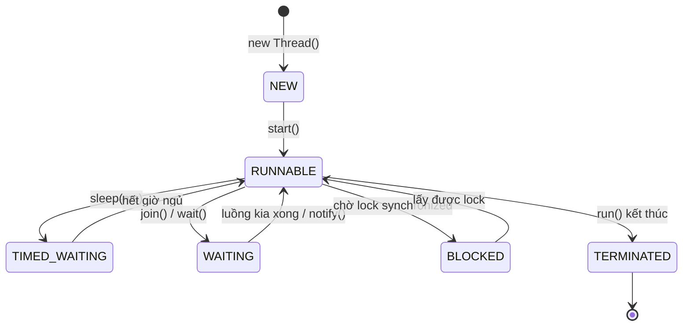

# 1. Luồng (Threads)

Luồng (thread) là một mạch thực thi chạy bên trong chương trình, cho phép máy làm nhiều việc cùng lúc thay vì tuần tự từng việc. Nắm vững luồng là bước đầu tiên để viết được phần mềm tận dụng được CPU nhiều nhân và không bị "đơ" khi chờ việc chậm. Bài này giới thiệu cách tạo và điều khiển luồng trong Java; chi tiết nằm bên dưới.

---

## Mục lục

- [Tiến trình (Process) và Luồng (Thread) là gì?](#tiến-trình-process-và-luồng-thread-là-gì)
- [Vì sao cần luồng?](#vì-sao-cần-luồng)
- [Vì sao cần thread?](#vì-sao-cần-thread)
- [Cách 1: Kế thừa lớp Thread](#cách-1-kế-thừa-lớp-thread)
- [Cách 2: Cài đặt interface Runnable](#cách-2-cài-đặt-interface-runnable)
- [start() khác run() như thế nào?](#start-khác-run-như-thế-nào)
- [sleep() — cho luồng ngủ](#sleep--cho-luồng-ngủ)
- [join() — chờ luồng khác xong](#join--chờ-luồng-khác-xong)
- [Luồng nền (Daemon Thread)](#luồng-nền-daemon-thread)
- [Lỗi thường gặp](#lỗi-thường-gặp)
- [Tóm tắt](#tóm-tắt)

---

## Tiến trình (Process) và Luồng (Thread) là gì?

Hãy tưởng tượng một **nhà hàng**:

- **Tiến trình (Process — một chương trình đang chạy)** giống như **cả nhà hàng**: có bếp riêng, kho riêng, tiền riêng. Hai nhà hàng khác nhau không dùng chung đồ.
- **Luồng (Thread — một mạch thực thi bên trong chương trình)** giống như **từng người đầu bếp** trong cùng nhà hàng đó: họ dùng chung bếp, chung kho, chung nguyên liệu.

Như vậy:

- Mỗi tiến trình có **vùng nhớ riêng**, không chia sẻ với tiến trình khác.
- Các luồng trong **cùng một tiến trình** lại **dùng chung vùng nhớ** (cùng biến, cùng đối tượng).

Khi bạn chạy một chương trình Java, máy ảo Java (JVM — Java Virtual Machine, máy ảo chạy mã Java) tạo ra một tiến trình. Bên trong nó luôn có sẵn ít nhất một luồng tên là **main** (luồng chính) — chính là nơi phương thức `main()` chạy.

---

## Vì sao cần luồng?

Hãy nghĩ về việc bạn vừa nấu cơm, vừa rửa rau cùng lúc. Nếu chỉ có một người (một luồng) thì phải làm xong việc này mới làm việc kia. Nếu có hai người (hai luồng) thì hai việc chạy **song song**, nhanh hơn nhiều.

Trong lập trình, luồng giúp:

- Làm nhiều việc cùng lúc (tải file, xử lý dữ liệu, vẽ giao diện...).
- Tận dụng CPU nhiều nhân (multi-core — bộ xử lý có nhiều lõi).
- Không bị "đơ" khi chờ một việc chậm (ví dụ chờ mạng).

---

## Vì sao cần thread?

**Vấn đề:** Chương trình một luồng làm việc **tuần tự** — phải xong việc này mới sang việc kia. Khi chờ I/O (đọc file, gọi mạng, query DB) thì CPU ngồi không, lãng phí; tác vụ nặng làm "đơ" giao diện; máy nhiều nhân (core) không được tận dụng.

```java
public class MotLuong {
    public static void main(String[] args) {
        // Mỗi việc phải chờ việc trước xong → tổng thời gian cộng dồn
        taiAnh();   // chờ mạng 2s, CPU ngồi không
        taiVideo(); // lại chờ tiếp 2s
        tinhToan(); // chỉ chạy 1 nhân, các nhân khác rảnh rỗi
    }

    static void taiAnh()   { /* chờ I/O... */ }
    static void taiVideo() { /* chờ I/O... */ }
    static void tinhToan() { /* tính nặng... */ }
}
```

**Giải pháp:** Dùng **thread (luồng)** — nhiều mạch thực thi chạy **song song/đồng thời** trong cùng một tiến trình. Trong khi luồng này chờ I/O, luồng khác vẫn làm việc; đồng thời tận dụng được nhiều nhân CPU và giữ giao diện mượt. Tạo luồng qua `Thread`/`Runnable`, quản lý bằng `ExecutorService` (thread pool — bể luồng dùng lại).

```java
public class NhieuLuong {
    public static void main(String[] args) {
        // Ba việc chạy đồng thời, không phải chờ nhau
        Thread t1 = new Thread(NhieuLuong::taiAnh);
        Thread t2 = new Thread(NhieuLuong::taiVideo);
        Thread t3 = new Thread(NhieuLuong::tinhToan);

        t1.start();
        t2.start();
        t3.start();
    }

    static void taiAnh()   { /* chờ I/O ở luồng riêng */ }
    static void taiVideo() { /* chờ I/O ở luồng riêng */ }
    static void tinhToan() { /* chạy trên nhân CPU khác */ }
}
```

:::tip[Dùng thực tế]

- **Server xử lý nhiều request đồng thời**: mỗi yêu cầu của người dùng được phục vụ bởi một luồng riêng.
- **Tải/ghi I/O song song**: tải nhiều file hoặc gọi nhiều API cùng lúc thay vì lần lượt.
- **Giữ UI không treo**: chạy việc nặng dưới luồng nền để màn hình vẫn phản hồi mượt.
- **Chia việc tính toán ra nhiều core**: tách bài toán lớn thành nhiều phần chạy song song trên các nhân CPU.

:::

---

## Cách 1: Kế thừa lớp Thread

Cách đầu tiên là tạo một lớp con kế thừa (extends) lớp `Thread` có sẵn, rồi ghi đè (override — viết lại) phương thức `run()`.

```java
// Lớp con kế thừa Thread
class XinChaoThread extends Thread {
    // run() chứa công việc mà luồng sẽ làm
    @Override
    public void run() {
        for (int i = 1; i <= 3; i++) {
            // getName() trả về tên của luồng đang chạy
            System.out.println(getName() + " - lần " + i);
        }
    }
}

public class ViDuThread {
    public static void main(String[] args) {
        // Tạo đối tượng luồng
        XinChaoThread t = new XinChaoThread();
        // start() KHỞI ĐỘNG luồng mới
        t.start();

        // Luồng main vẫn chạy song song dòng này
        System.out.println("Luồng main vẫn chạy");
    }
}
```

---

## Cách 2: Cài đặt interface Runnable

Cách thứ hai (được **khuyến khích hơn**) là tạo một lớp cài đặt (implements) interface `Runnable`, rồi truyền nó vào `Thread`.

```java
// Lớp công việc, cài đặt Runnable
class CongViec implements Runnable {
    @Override
    public void run() {
        System.out.println("Đang chạy trong luồng: "
                + Thread.currentThread().getName());
    }
}

public class ViDuRunnable {
    public static void main(String[] args) {
        // Đưa công việc vào một Thread
        Thread t = new Thread(new CongViec());
        t.start(); // Khởi động luồng

        // Cách viết ngắn gọn bằng biểu thức lambda
        Thread t2 = new Thread(() -> System.out.println("Luồng lambda chạy"));
        t2.start();
    }
}
```

**Vì sao nên dùng `Runnable` hơn?** Vì Java chỉ cho phép kế thừa **một** lớp. Nếu bạn đã `extends Thread` thì không thể kế thừa lớp khác nữa. Còn `Runnable` là interface nên linh hoạt hơn.

---

## start() khác run() như thế nào?

Đây là chỗ người mới hay nhầm nhất:

- `start()` — **tạo một luồng mới** và chạy `run()` trong luồng mới đó. Việc xảy ra **song song**.
- `run()` — chỉ là gọi một phương thức bình thường, chạy **ngay trong luồng hiện tại**, KHÔNG tạo luồng mới.

```java
public class StartVsRun {
    public static void main(String[] args) {
        Thread t = new Thread(() ->
            System.out.println("Chạy trong: " + Thread.currentThread().getName())
        );

        t.run();   // SAI nếu muốn đa luồng: in ra "main" (chạy trong luồng main)
        t.start(); // ĐÚNG: in ra "Thread-0" (luồng mới)
    }
}
```

Quy tắc nhớ: **Muốn có luồng mới, luôn gọi `start()`.**

Sau khi `start()`, một luồng đi qua các trạng thái sau trong vòng đời của nó — `sleep()` và `join()` ở hai mục kế tiếp cũng nằm trong sơ đồ này:



---

## sleep() — cho luồng ngủ

`Thread.sleep(milli)` cho luồng **tạm dừng** trong một khoảng thời gian (tính bằng mili-giây, 1000 mili-giây = 1 giây). Giống như bạn bảo người đầu bếp "nghỉ 2 giây rồi làm tiếp".

```java
public class ViDuSleep {
    public static void main(String[] args) throws InterruptedException {
        for (int i = 1; i <= 3; i++) {
            System.out.println("Đếm: " + i);
            // Ngủ 1 giây giữa mỗi lần đếm
            Thread.sleep(1000);
        }
    }
}
```

Lưu ý: `sleep()` ném ra ngoại lệ `InterruptedException`, nên phải `throws` hoặc bọc trong `try-catch`.

---

## join() — chờ luồng khác xong

`join()` bảo luồng hiện tại **đứng chờ** cho đến khi luồng kia chạy xong mới đi tiếp. Giống như bạn nói "đợi cậu kia nấu xong cơm rồi mình mới dọn bàn".

```java
public class ViDuJoin {
    public static void main(String[] args) throws InterruptedException {
        Thread worker = new Thread(() -> {
            for (int i = 1; i <= 3; i++) {
                System.out.println("Đang làm việc... " + i);
            }
        });

        worker.start();
        worker.join(); // Luồng main CHỜ worker xong mới chạy tiếp

        // Dòng này chỉ in SAU khi worker đã xong
        System.out.println("Worker đã xong, main tiếp tục");
    }
}
```

---

## Luồng nền (Daemon Thread)

Có hai loại luồng:

- **Luồng người dùng (user thread)**: luồng bình thường. JVM chỉ thoát khi tất cả luồng người dùng đã xong.
- **Luồng nền (daemon thread)**: luồng phục vụ phía sau (ví dụ dọn rác, ghi log). JVM sẽ **tắt ngay** khi không còn luồng người dùng nào, kể cả luồng nền chưa làm xong.

Ví dụ đời thường: luồng nền giống như nhân viên lau dọn trong rạp chiếu phim — khi tất cả khán giả (luồng người dùng) đã về hết, rạp đóng cửa luôn, nhân viên lau dọn cũng dừng việc.

```java
public class ViDuDaemon {
    public static void main(String[] args) throws InterruptedException {
        Thread bg = new Thread(() -> {
            while (true) {
                System.out.println("Luồng nền đang chạy...");
            }
        });

        bg.setDaemon(true); // Đánh dấu là luồng nền (PHẢI gọi TRƯỚC start)
        bg.start();

        Thread.sleep(10); // main chỉ sống 10 mili-giây
        System.out.println("Main kết thúc → JVM tắt luôn luồng nền");
    }
}
```

Lưu ý quan trọng: phải gọi `setDaemon(true)` **trước** `start()`, nếu không sẽ bị lỗi.

---

## Lỗi thường gặp

1. **Gọi `run()` thay vì `start()`**: tưởng có luồng mới nhưng thực ra vẫn chạy tuần tự trong luồng cũ.
2. **Quên bắt `InterruptedException`** khi dùng `sleep()` hoặc `join()`: code không biên dịch được.
3. **Gọi `setDaemon(true)` sau `start()`**: ném `IllegalThreadStateException`.
4. **Gọi `start()` hai lần** trên cùng một đối tượng `Thread`: ném `IllegalThreadStateException`. Mỗi `Thread` chỉ chạy được một lần.
5. **Cho rằng thứ tự in ra luôn cố định**: các luồng chạy song song nên thứ tự kết quả có thể **khác nhau mỗi lần chạy**.

---

## Tóm tắt

- **Tiến trình** là cả chương trình có vùng nhớ riêng; **luồng** là mạch chạy bên trong, dùng chung vùng nhớ.
- Tạo luồng bằng cách `extends Thread` hoặc (tốt hơn) `implements Runnable`.
- Luôn dùng `start()` để tạo luồng mới; `run()` chỉ là gọi hàm thường.
- `sleep()` cho luồng ngủ tạm; `join()` để chờ luồng khác xong.
- **Luồng nền (daemon)** bị tắt ngay khi không còn luồng người dùng; nhớ `setDaemon(true)` trước `start()`.
