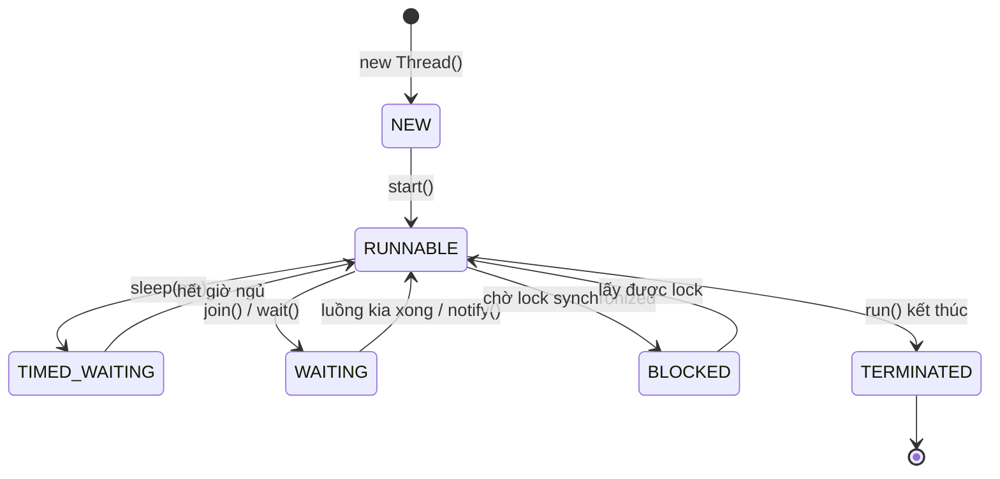

# 1. Luồng (Threads)

Luồng (thread) là một mạch thực thi chạy bên trong chương trình, cho phép máy làm nhiều việc cùng lúc thay vì tuần tự từng việc. Nắm vững luồng là bước đầu tiên để viết được phần mềm tận dụng được CPU nhiều nhân và không bị "đơ" khi chờ việc chậm. Bài này giới thiệu cách tạo và điều khiển luồng trong Java; chi tiết nằm bên dưới.

[](pathname:///img/java/threads.webp)

---

:::note[Ghi nhớ nhanh]

- ⭐ **Luôn gọi `start()` để tạo luồng mới** — `run()` chỉ chạy tuần tự ngay trong luồng hiện tại, không sinh luồng mới.
- ⭐ **Tiến trình vs luồng** — tiến trình có vùng nhớ riêng; các luồng cùng một tiến trình dùng chung vùng nhớ (cùng biến, cùng đối tượng).
- **Cách tạo luồng** — `extends Thread` hoặc (khuyến khích) `implements Runnable`, vì Java chỉ kế thừa được một lớp.
- **`sleep()` và `join()`** — `sleep(ms)` cho luồng ngủ tạm, `join()` chờ luồng khác chạy xong; cả hai đều ném `InterruptedException`.
- **Luồng nền (`daemon`)** — bị JVM tắt ngay khi không còn luồng người dùng; phải gọi `setDaemon(true)` trước `start()`.

:::

---

## Mục lục

- [Tiến trình (Process) và Luồng (Thread) là gì?](#tiến-trình-process-và-luồng-thread-là-gì)
- [Vì sao cần luồng?](#vì-sao-cần-luồng)
- [Vì sao cần thread?](#vì-sao-cần-thread)
- [Cách 1: Kế thừa lớp Thread](#cách-1-kế-thừa-lớp-thread)
- [Cách 2: Cài đặt interface Runnable](#cách-2-cài-đặt-interface-runnable)
- [start() khác run() như thế nào?](#start-khác-run-như-thế-nào)
- [sleep() — cho luồng ngủ](#sleep--cho-luồng-ngủ)
- [join() — chờ luồng khác xong](#join--chờ-luồng-khác-xong)
- [Luồng nền (Daemon Thread)](#luồng-nền-daemon-thread)
- [Lỗi thường gặp](#lỗi-thường-gặp)
- [Tóm tắt](#tóm-tắt)
- [Câu hỏi phỏng vấn](#câu-hỏi-phỏng-vấn)

---

## Tiến trình (Process) và Luồng (Thread) là gì?

Hãy tưởng tượng một **nhà hàng**:

- **Tiến trình (Process — một chương trình đang chạy)** giống như **cả nhà hàng**: có bếp riêng, kho riêng, tiền riêng. Hai nhà hàng khác nhau không dùng chung đồ.
- **Luồng (Thread — một mạch thực thi bên trong chương trình)** giống như **từng người đầu bếp** trong cùng nhà hàng đó: họ dùng chung bếp, chung kho, chung nguyên liệu.

Như vậy:

- Mỗi tiến trình có **vùng nhớ riêng**, không chia sẻ với tiến trình khác.
- Các luồng trong **cùng một tiến trình** lại **dùng chung vùng nhớ** (cùng biến, cùng đối tượng).

Khi bạn chạy một chương trình Java, máy ảo Java (JVM — Java Virtual Machine, máy ảo chạy mã Java) tạo ra một tiến trình. Bên trong nó luôn có sẵn ít nhất một luồng tên là **main** (luồng chính) — chính là nơi phương thức `main()` chạy.

---

## Vì sao cần luồng?

Hãy nghĩ về việc bạn vừa nấu cơm, vừa rửa rau cùng lúc. Nếu chỉ có một người (một luồng) thì phải làm xong việc này mới làm việc kia. Nếu có hai người (hai luồng) thì hai việc chạy **song song**, nhanh hơn nhiều.

Trong lập trình, luồng giúp:

- Làm nhiều việc cùng lúc (tải file, xử lý dữ liệu, vẽ giao diện...).
- Tận dụng CPU nhiều nhân (multi-core — bộ xử lý có nhiều lõi).
- Không bị "đơ" khi chờ một việc chậm (ví dụ chờ mạng).

---

## Vì sao cần thread?

**Vấn đề:** Chương trình một luồng làm việc **tuần tự** — phải xong việc này mới sang việc kia. Khi chờ I/O (đọc file, gọi mạng, query DB) thì CPU ngồi không, lãng phí; tác vụ nặng làm "đơ" giao diện; máy nhiều nhân (core) không được tận dụng.

```java
public class MotLuong {
    public static void main(String[] args) {
        // Mỗi việc phải chờ việc trước xong → tổng thời gian cộng dồn
        taiAnh();   // chờ mạng 2s, CPU ngồi không
        taiVideo(); // lại chờ tiếp 2s
        tinhToan(); // chỉ chạy 1 nhân, các nhân khác rảnh rỗi
    }

    static void taiAnh()   { /* chờ I/O... */ }
    static void taiVideo() { /* chờ I/O... */ }
    static void tinhToan() { /* tính nặng... */ }
}
```

**Giải pháp:** Dùng **thread (luồng)** — nhiều mạch thực thi chạy **song song/đồng thời** trong cùng một tiến trình. Trong khi luồng này chờ I/O, luồng khác vẫn làm việc; đồng thời tận dụng được nhiều nhân CPU và giữ giao diện mượt. Tạo luồng qua `Thread`/`Runnable`, quản lý bằng `ExecutorService` (thread pool — bể luồng dùng lại).

```java
public class NhieuLuong {
    public static void main(String[] args) {
        // Ba việc chạy đồng thời, không phải chờ nhau
        Thread t1 = new Thread(NhieuLuong::taiAnh);
        Thread t2 = new Thread(NhieuLuong::taiVideo);
        Thread t3 = new Thread(NhieuLuong::tinhToan);

        t1.start();
        t2.start();
        t3.start();
    }

    static void taiAnh()   { /* chờ I/O ở luồng riêng */ }
    static void taiVideo() { /* chờ I/O ở luồng riêng */ }
    static void tinhToan() { /* chạy trên nhân CPU khác */ }
}
```

:::tip[Dùng thực tế]

- **Server xử lý nhiều request đồng thời**: mỗi yêu cầu của người dùng được phục vụ bởi một luồng riêng.
- **Tải/ghi I/O song song**: tải nhiều file hoặc gọi nhiều API cùng lúc thay vì lần lượt.
- **Giữ UI không treo**: chạy việc nặng dưới luồng nền để màn hình vẫn phản hồi mượt.
- **Chia việc tính toán ra nhiều core**: tách bài toán lớn thành nhiều phần chạy song song trên các nhân CPU.

:::

---

## Cách 1: Kế thừa lớp Thread

Cách đầu tiên là tạo một lớp con kế thừa (extends) lớp `Thread` có sẵn, rồi ghi đè (override — viết lại) phương thức `run()`.

```java
// Lớp con kế thừa Thread
class XinChaoThread extends Thread {
    // run() chứa công việc mà luồng sẽ làm
    @Override
    public void run() {
        for (int i = 1; i <= 3; i++) {
            // getName() trả về tên của luồng đang chạy
            System.out.println(getName() + " - lần " + i);
        }
    }
}

public class ViDuThread {
    public static void main(String[] args) {
        // Tạo đối tượng luồng
        XinChaoThread t = new XinChaoThread();
        // start() KHỞI ĐỘNG luồng mới
        t.start();

        // Luồng main vẫn chạy song song dòng này
        System.out.println("Luồng main vẫn chạy");
    }
}
```

---

## Cách 2: Cài đặt interface Runnable

Cách thứ hai (được **khuyến khích hơn**) là tạo một lớp cài đặt (implements) interface `Runnable`, rồi truyền nó vào `Thread`.

```java
// Lớp công việc, cài đặt Runnable
class CongViec implements Runnable {
    @Override
    public void run() {
        System.out.println("Đang chạy trong luồng: "
                + Thread.currentThread().getName());
    }
}

public class ViDuRunnable {
    public static void main(String[] args) {
        // Đưa công việc vào một Thread
        Thread t = new Thread(new CongViec());
        t.start(); // Khởi động luồng

        // Cách viết ngắn gọn bằng biểu thức lambda
        Thread t2 = new Thread(() -> System.out.println("Luồng lambda chạy"));
        t2.start();
    }
}
```

**Vì sao nên dùng `Runnable` hơn?** Vì Java chỉ cho phép kế thừa **một** lớp. Nếu bạn đã `extends Thread` thì không thể kế thừa lớp khác nữa. Còn `Runnable` là interface nên linh hoạt hơn.

---

## start() khác run() như thế nào?

Đây là chỗ người mới hay nhầm nhất:

- `start()` — **tạo một luồng mới** và chạy `run()` trong luồng mới đó. Việc xảy ra **song song**.
- `run()` — chỉ là gọi một phương thức bình thường, chạy **ngay trong luồng hiện tại**, KHÔNG tạo luồng mới.

```java
public class StartVsRun {
    public static void main(String[] args) {
        Thread t = new Thread(() ->
            System.out.println("Chạy trong: " + Thread.currentThread().getName())
        );

        t.run();   // SAI nếu muốn đa luồng: in ra "main" (chạy trong luồng main)
        t.start(); // ĐÚNG: in ra "Thread-0" (luồng mới)
    }
}
```

Quy tắc nhớ: **Muốn có luồng mới, luôn gọi `start()`.**

Sau khi `start()`, một luồng đi qua các trạng thái sau trong vòng đời của nó — `sleep()` và `join()` ở hai mục kế tiếp cũng nằm trong sơ đồ này:


```mermaid
stateDiagram-v2
    [*] --> NEW: new Thread()
    NEW --> RUNNABLE: start()
    RUNNABLE --> TIMED_WAITING: sleep(ms)
    TIMED_WAITING --> RUNNABLE: hết giờ ngủ
    RUNNABLE --> WAITING: join() / wait()
    WAITING --> RUNNABLE: luồng kia xong / notify()
    RUNNABLE --> BLOCKED: chờ lock synchronized
    BLOCKED --> RUNNABLE: lấy được lock
    RUNNABLE --> TERMINATED: run() kết thúc
    TERMINATED --> [*]
```

---

## sleep() — cho luồng ngủ

`Thread.sleep(milli)` cho luồng **tạm dừng** trong một khoảng thời gian (tính bằng mili-giây, 1000 mili-giây = 1 giây). Giống như bạn bảo người đầu bếp "nghỉ 2 giây rồi làm tiếp".

```java
public class ViDuSleep {
    public static void main(String[] args) throws InterruptedException {
        for (int i = 1; i <= 3; i++) {
            System.out.println("Đếm: " + i);
            // Ngủ 1 giây giữa mỗi lần đếm
            Thread.sleep(1000);
        }
    }
}
```

Lưu ý: `sleep()` ném ra ngoại lệ `InterruptedException`, nên phải `throws` hoặc bọc trong `try-catch`.

---

## join() — chờ luồng khác xong

`join()` bảo luồng hiện tại **đứng chờ** cho đến khi luồng kia chạy xong mới đi tiếp. Giống như bạn nói "đợi cậu kia nấu xong cơm rồi mình mới dọn bàn".

```java
public class ViDuJoin {
    public static void main(String[] args) throws InterruptedException {
        Thread worker = new Thread(() -> {
            for (int i = 1; i <= 3; i++) {
                System.out.println("Đang làm việc... " + i);
            }
        });

        worker.start();
        worker.join(); // Luồng main CHỜ worker xong mới chạy tiếp

        // Dòng này chỉ in SAU khi worker đã xong
        System.out.println("Worker đã xong, main tiếp tục");
    }
}
```

---

## Luồng nền (Daemon Thread)

Có hai loại luồng:

- **Luồng người dùng (user thread)**: luồng bình thường. JVM chỉ thoát khi tất cả luồng người dùng đã xong.
- **Luồng nền (daemon thread)**: luồng phục vụ phía sau (ví dụ dọn rác, ghi log). JVM sẽ **tắt ngay** khi không còn luồng người dùng nào, kể cả luồng nền chưa làm xong.

Ví dụ đời thường: luồng nền giống như nhân viên lau dọn trong rạp chiếu phim — khi tất cả khán giả (luồng người dùng) đã về hết, rạp đóng cửa luôn, nhân viên lau dọn cũng dừng việc.

```java
public class ViDuDaemon {
    public static void main(String[] args) throws InterruptedException {
        Thread bg = new Thread(() -> {
            while (true) {
                System.out.println("Luồng nền đang chạy...");
            }
        });

        bg.setDaemon(true); // Đánh dấu là luồng nền (PHẢI gọi TRƯỚC start)
        bg.start();

        Thread.sleep(10); // main chỉ sống 10 mili-giây
        System.out.println("Main kết thúc → JVM tắt luôn luồng nền");
    }
}
```

Lưu ý quan trọng: phải gọi `setDaemon(true)` **trước** `start()`, nếu không sẽ bị lỗi.

---

## Lỗi thường gặp

1. **Gọi `run()` thay vì `start()`**: tưởng có luồng mới nhưng thực ra vẫn chạy tuần tự trong luồng cũ.
2. **Quên bắt `InterruptedException`** khi dùng `sleep()` hoặc `join()`: code không biên dịch được.
3. **Gọi `setDaemon(true)` sau `start()`**: ném `IllegalThreadStateException`.
4. **Gọi `start()` hai lần** trên cùng một đối tượng `Thread`: ném `IllegalThreadStateException`. Mỗi `Thread` chỉ chạy được một lần.
5. **Cho rằng thứ tự in ra luôn cố định**: các luồng chạy song song nên thứ tự kết quả có thể **khác nhau mỗi lần chạy**.

---

## Tóm tắt

- **Tiến trình** là cả chương trình có vùng nhớ riêng; **luồng** là mạch chạy bên trong, dùng chung vùng nhớ.
- Tạo luồng bằng cách `extends Thread` hoặc (tốt hơn) `implements Runnable`.
- Luôn dùng `start()` để tạo luồng mới; `run()` chỉ là gọi hàm thường.
- `sleep()` cho luồng ngủ tạm; `join()` để chờ luồng khác xong.
- **Luồng nền (daemon)** bị tắt ngay khi không còn luồng người dùng; nhớ `setDaemon(true)` trước `start()`.

---

## Câu hỏi phỏng vấn

Những câu thường gặp về chủ đề này. Tự trả lời trước, rồi bấm **Xem đáp án** để đối chiếu.

**1. Phân biệt Process (tiến trình) và Thread (luồng). Khi JVM chạy một chương trình Java, luồng đầu tiên tên là gì?**

<details className="qa">
<summary>Xem đáp án</summary>

- **Process (tiến trình)**: một chương trình đang chạy, có **vùng nhớ riêng**, không chia sẻ với tiến trình khác.
- **Thread (luồng)**: một mạch thực thi bên trong một tiến trình; nhiều luồng trong **cùng một tiến trình** thì **dùng chung vùng nhớ** (cùng biến static, cùng đối tượng heap).
- Khi JVM chạy chương trình Java, nó tạo một tiến trình và luôn có sẵn ít nhất một luồng tên **`main`** — đây là nơi phương thức `main()` thực thi.

</details>

**2. So sánh hai cách tạo luồng: kế thừa `Thread` và cài đặt `Runnable`. Vì sao `Runnable` được khuyến khích hơn?**

<details className="qa">
<summary>Xem đáp án</summary>

| | `extends Thread` | `implements Runnable` |
|---|---|---|
| Kế thừa | Chiếm mất suất kế thừa duy nhất của Java | Không chiếm — vẫn có thể `extends` lớp khác |
| Tách biệt "công việc" và "cơ chế chạy" | Trộn lẫn — lớp vừa là công việc vừa là luồng | Tách bạch — `Runnable` chỉ là công việc, `Thread` là cơ chế thực thi |
| Tái sử dụng | Khó tái sử dụng công việc cho `ExecutorService` | Dễ — cùng một `Runnable` truyền được vào `Thread` hoặc `ExecutorService` |

`Runnable` được khuyến khích vì Java chỉ cho kế thừa **một** lớp — nếu đã `extends Thread`, lớp đó không thể kế thừa thêm lớp nào khác. `Runnable` là interface nên linh hoạt hơn nhiều, đồng thời tách bạch rõ ràng "việc cần làm" khỏi "cơ chế chạy việc đó".

</details>

**3. Đoạn code sau in ra gì? Vì sao?**

```java
public class Test {
    public static void main(String[] args) {
        Thread t = new Thread(() ->
            System.out.println("Chạy trong: " + Thread.currentThread().getName()));

        t.run();
        t.start();
    }
}
```

<details className="qa">
<summary>Xem đáp án</summary>

In ra hai dòng: `Chạy trong: main` rồi `Chạy trong: Thread-0`.

- `t.run()` chỉ là một **lời gọi phương thức bình thường**, chạy ngay trong luồng gọi nó — ở đây là luồng `main` — nên `Thread.currentThread().getName()` trả về `"main"`. **Không có luồng mới nào được tạo.**
- `t.start()` mới thực sự **tạo một luồng mới** (`"Thread-0"`) và chạy `run()` bên trong luồng mới đó, song song với luồng gọi.
- Đây là lỗi kinh điển của người mới: gọi nhầm `run()` khi tưởng đang tạo đa luồng, nhưng thực chất code vẫn chạy tuần tự.

</details>

**4. Phân biệt `Thread.sleep()` và `Object.wait()`. Vì sao chúng không thể dùng thay thế cho nhau?**

<details className="qa">
<summary>Xem đáp án</summary>

| | `Thread.sleep(ms)` | `object.wait()` |
|---|---|---|
| Thuộc về | Static method của lớp `Thread` | Instance method của `Object` (mọi object đều có) |
| Có cần giữ lock không | Không cần — có thể gọi ở bất cứ đâu | **Bắt buộc** gọi trong khối `synchronized` giữ lock của chính object đó, nếu không ném `IllegalMonitorStateException` |
| Có nhả lock khi chờ không | **Không** — nếu đang giữ lock, vẫn giữ nguyên trong lúc ngủ | **Có** — nhả lock ra cho luồng khác dùng trong lúc chờ |
| Cách đánh thức | Tự dậy sau đúng thời gian chỉ định | Cần luồng khác gọi `notify()`/`notifyAll()` trên cùng object (hoặc hết `timeout` nếu dùng `wait(ms)`) |
| Mục đích | Tạm dừng vô điều kiện một khoảng thời gian | Chờ một **điều kiện/tín hiệu** cụ thể từ luồng khác (mô hình producer-consumer) |

`sleep()` là "ngủ theo đồng hồ", còn `wait()` là "chờ tín hiệu và sẵn sàng nhường chỗ cho người khác trong lúc chờ" — hai cơ chế phục vụ hai mục đích khác nhau, không thay thế được cho nhau.

</details>

**5. Đoạn code sau in ra dòng cuối cùng trước hay sau khi `worker` chạy xong? Giải thích.**

```java
public class Test {
    public static void main(String[] args) throws InterruptedException {
        Thread worker = new Thread(() -> {
            for (int i = 1; i <= 3; i++) System.out.println("Việc " + i);
        });

        worker.start();
        worker.join();

        System.out.println("Main kết thúc");
    }
}
```

<details className="qa">
<summary>Xem đáp án</summary>

`"Main kết thúc"` **luôn** in ra **sau** khi cả ba dòng `"Việc 1"`, `"Việc 2"`, `"Việc 3"` đã in xong.

- `worker.join()` khiến luồng gọi nó (ở đây là `main`) **đứng chờ** cho đến khi luồng `worker` chạy xong hoàn toàn mới được đi tiếp.
- Nếu bỏ dòng `worker.join();`, thứ tự giữa `"Việc ..."` và `"Main kết thúc"` sẽ **không xác định** (có thể xen kẽ hoặc "Main kết thúc" in trước), vì hai luồng chạy song song không đồng bộ với nhau.

</details>

**6. Mô tả các trạng thái chính trong vòng đời của một `Thread` trong Java.**

<details className="qa">
<summary>Xem đáp án</summary>

Một luồng đi qua các trạng thái (`Thread.State`) sau:

- **`NEW`**: vừa `new Thread()`, chưa gọi `start()`.
- **`RUNNABLE`**: đã `start()`, đang chạy hoặc sẵn sàng chạy (chờ CPU cấp phát).
- **`BLOCKED`**: đang chờ để lấy được một khóa `synchronized` mà luồng khác đang giữ.
- **`WAITING`**: đang chờ vô thời hạn tín hiệu từ luồng khác (ví dụ gọi `join()` không tham số, hoặc `wait()` không tham số).
- **`TIMED_WAITING`**: đang chờ có giới hạn thời gian (ví dụ `sleep(ms)`, `join(ms)`, `wait(ms)`).
- **`TERMINATED`**: `run()` đã kết thúc (bình thường hoặc do exception không bắt được).

Hiểu đúng các trạng thái này giúp đọc được thread dump khi debug ứng dụng bị treo hoặc chạy chậm bất thường.

</details>

**7. Đoạn code sau xảy ra chuyện gì?**

```java
Thread t = new Thread(() -> System.out.println("Chạy"));
t.start();
t.start(); // Gọi start() lần thứ hai
```

<details className="qa">
<summary>Xem đáp án</summary>

Ném ra **`IllegalThreadStateException`** ở lần gọi `start()` thứ hai.

- Mỗi đối tượng `Thread` chỉ có thể `start()` **đúng một lần duy nhất** trong toàn bộ vòng đời của nó — một khi đã rời khỏi trạng thái `NEW` (dù đang chạy hay đã `TERMINATED`), gọi `start()` lại là bất hợp lệ.
- Muốn chạy lại cùng một công việc, phải tạo một đối tượng `Thread` **mới** (ví dụ bọc cùng một `Runnable` vào `new Thread(runnable)` khác), chứ không thể tái sử dụng object `Thread` cũ.

</details>

**8. Cơ chế `interrupt()` hoạt động thế nào? Nó có ép buộc dừng ngay lập tức một luồng đang chạy không?**

<details className="qa">
<summary>Xem đáp án</summary>

`interrupt()` **không** ép buộc dừng luồng ngay lập tức — nó chỉ đặt một **cờ interrupted** bên trong luồng đích, coi như một **tín hiệu yêu cầu hợp tác dừng lại (cooperative cancellation)**.

```java
Thread worker = new Thread(() -> {
    while (!Thread.currentThread().isInterrupted()) {
        // Công việc phải TỰ kiểm tra cờ interrupted định kỳ
    }
    System.out.println("Đã dừng do bị interrupt");
});
worker.start();
worker.interrupt(); // Chỉ đặt cờ, không ép dừng ngay
```

- Nếu luồng đang ở trạng thái chờ (`sleep()`, `wait()`, `join()`), việc gọi `interrupt()` sẽ khiến các phương thức đó **ném ngay `InterruptedException`**, đánh thức luồng dậy sớm.
- Nếu luồng đang chạy một vòng lặp tính toán bình thường (không gọi các phương thức chờ ở trên), nó sẽ **không tự dừng** trừ khi code bên trong **chủ động kiểm tra** `Thread.currentThread().isInterrupted()` và tự thoát vòng lặp.
- Đây là lý do việc thiết kế các tác vụ dài cần chủ động kiểm tra cờ interrupt định kỳ để có thể dừng "sạch sẽ" khi được yêu cầu.

</details>

**9. `ThreadLocal` là gì? Nêu một tình huống thực tế nên dùng, và một rủi ro cần lưu ý khi dùng chung với thread pool.**

<details className="qa">
<summary>Xem đáp án</summary>

`ThreadLocal<T>` cho phép mỗi luồng giữ **một bản sao giá trị riêng** của cùng một biến — luồng này đọc/ghi giá trị của nó, hoàn toàn không ảnh hưởng tới giá trị mà luồng khác thấy.

```java
private static final ThreadLocal<SimpleDateFormat> DINH_DANG =
    ThreadLocal.withInitial(() -> new SimpleDateFormat("dd/MM/yyyy"));
// Mỗi luồng có một SimpleDateFormat riêng, tránh chia sẻ đối tượng không thread-safe này
```

- **Tình huống thực tế**: lưu thông tin theo từng request trong web server (ví dụ userId đang đăng nhập, transaction hiện tại) mà không cần truyền tham số qua hàng chục lớp gọi nhau; hoặc giữ các đối tượng không thread-safe như `SimpleDateFormat` riêng cho mỗi luồng.
- **Rủi ro với thread pool**: các luồng trong `ExecutorService` được **tái sử dụng** cho nhiều tác vụ khác nhau. Nếu quên gọi `remove()` sau khi dùng xong, giá trị `ThreadLocal` cũ có thể **rò rỉ sang tác vụ tiếp theo** chạy trên cùng luồng đó (dữ liệu "lẫn" giữa các request), đồng thời gây rò rỉ bộ nhớ (memory leak) vì giá trị không bao giờ được giải phóng.

</details>

**10. Tình huống: server cần xử lý 1.000 kết nối đồng thời, mỗi kết nối chỉ thực hiện vài thao tác I/O ngắn. Có nên tạo `new Thread()` riêng cho mỗi kết nối không? Vì sao?**

<details className="qa">
<summary>Xem đáp án</summary>

**Không nên** tạo `new Thread()` trực tiếp cho từng kết nối trong trường hợp số lượng lớn và lặp lại liên tục, vì:

- Mỗi platform thread tốn khá nhiều bộ nhớ (khoảng 1MB stack) và chi phí tạo/hủy luồng không hề rẻ — tạo hàng nghìn luồng riêng lẻ liên tục có thể khiến máy quá tải hoặc cạn tài nguyên hệ điều hành.
- Giải pháp thực tế phổ biến trước Java 21: dùng **`ExecutorService`/thread pool** (bài tiếp theo) để **tái sử dụng** một số lượng luồng cố định, xếp hàng các tác vụ dư ra.
- Giải pháp hiện đại hơn (Java 21+): dùng **virtual thread** (bài cuối chương) — cho phép tạo rất nhiều luồng "ảo" siêu nhẹ mà không lo quá tải, đặc biệt phù hợp với khối lượng lớn tác vụ chờ I/O như mô tả ở đây.

</details>

**11. `Runnable` không cho phép trả về giá trị hay ném checked exception ra ngoài. Interface nào trong `java.util.concurrent` khắc phục hạn chế này, và dùng kèm với gì để lấy kết quả?**

<details className="qa">
<summary>Xem đáp án</summary>

Interface **`Callable<V>`** (trong `java.util.concurrent`) khắc phục hai hạn chế của `Runnable`:

```java
import java.util.concurrent.Callable;

Callable<Integer> tinhToan = () -> {
    Thread.sleep(1000);
    return 42; // Callable CÓ THỂ trả về giá trị
    // và có thể throws checked exception (ví dụ InterruptedException) mà không cần try-catch trong lambda
};
```

- Khác với `Runnable.run()` (trả về `void`, không khai báo `throws` được checked exception), `Callable<V>.call()` **trả về một giá trị kiểu `V`** và **được phép khai báo `throws Exception`**.
- Để lấy được kết quả, `Callable` thường được nộp (`submit`) cho một `ExecutorService`, trả về một **`Future<V>`** — gọi `future.get()` sẽ **chờ** cho đến khi tác vụ hoàn tất và lấy kết quả (hoặc ném lại exception nếu tác vụ đó gặp lỗi, bọc trong `ExecutionException`).

</details>
