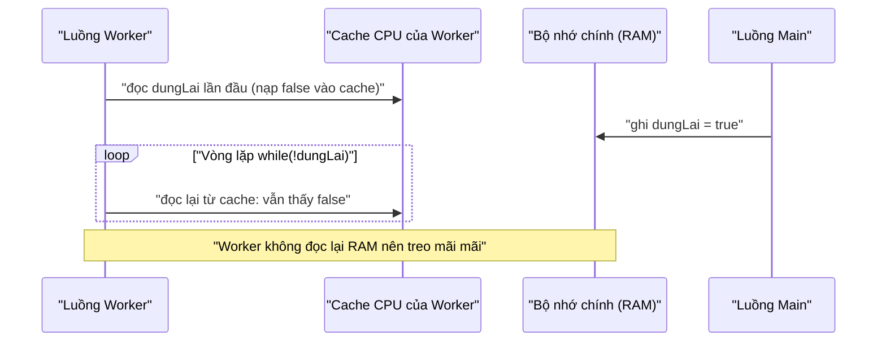

# 3. Mô hình bộ nhớ Java (Java Memory Model)

Mô hình bộ nhớ Java (JMM) là bộ quy tắc cho biết khi nào một luồng nhìn thấy thay đổi mà luồng khác vừa ghi. Đây là lý do nhiều lỗi đa luồng "kỳ lạ" xảy ra: mỗi luồng có thể giữ bản sao biến trong cache riêng nên đọc phải giá trị cũ. Hiểu JMM giúp bạn biết vì sao cần `volatile`, `synchronized` hay lớp atomic để code chạy đúng; chi tiết nằm bên dưới.

[](pathname:///img/java/java-memory-model.webp)

---

:::note[Ghi nhớ nhanh]

- ⭐ **JMM là quy tắc về visibility** — quy định khi nào một luồng chắc chắn thấy thay đổi mà luồng khác vừa ghi.
- ⭐ **Gốc rễ lỗi** — mỗi luồng giữ bản sao biến trong **cache CPU** nên có thể đọc phải giá trị cũ (ví dụ vòng lặp `while(!dungLai)` treo mãi mãi).
- **Happens-before** — quan hệ "xảy ra trước" bảo đảm luồng sau thấy được thay đổi; thiết lập qua `volatile`, `synchronized`, `start()`/`join()`.
- **Cách bảo đảm an toàn** — dùng `volatile`, `synchronized`, hoặc lớp `Atomic` (như `AtomicBoolean`).
- **Cạm bẫy** — code chạy đúng trên máy mình không có nghĩa là đúng; lỗi hiển thị phụ thuộc phần cứng, rất khó tái hiện.

:::

---

## Mục lục

- [Vì sao cần Java Memory Model?](#vì-sao-cần-java-memory-model)
- [Mô hình bộ nhớ Java là gì?](#mô-hình-bộ-nhớ-java-là-gì)
- [Bộ nhớ chính và bộ nhớ đệm của CPU](#bộ-nhớ-chính-và-bộ-nhớ-đệm-của-cpu)
- [Vấn đề hiển thị (Visibility)](#vấn-đề-hiển-thị-visibility)
- [Ví dụ biến chia sẻ gây lỗi](#ví-dụ-biến-chia-sẻ-gây-lỗi)
- [Quan hệ "xảy ra trước" (Happens-before)](#quan-hệ-xảy-ra-trước-happens-before)
- [Cách bảo đảm an toàn](#cách-bảo-đảm-an-toàn)
- [Lỗi thường gặp](#lỗi-thường-gặp)
- [Tóm tắt](#tóm-tắt)
- [Câu hỏi phỏng vấn](#câu-hỏi-phỏng-vấn)

---

## Vì sao cần Java Memory Model?

**Vấn đề:** Để chạy nhanh, CPU **cache** biến trong thanh ghi/cache của nhân, và trình biên dịch/CPU có thể **sắp xếp lại** thứ tự lệnh. Hậu quả: một luồng ghi biến nhưng luồng khác **không thấy** giá trị mới (visibility), hoặc thấy thứ tự bất ngờ → lỗi đa luồng cực khó tái hiện và khác nhau giữa các máy.

```java
class CauHinh {
    private boolean sanSang = false; // không đồng bộ
    private int giaTri = 0;

    void chuanBi() {
        giaTri = 42;        // (1)
        sanSang = true;     // (2) có thể bị reorder lên trước (1)
    }

    int doc() {
        if (sanSang) {
            // có thể thấy sanSang = true nhưng giaTri vẫn = 0!
            return giaTri;
        }
        return -1;
    }
}
```

**Giải pháp:** **Java Memory Model (JMM)** định nghĩa **quy tắc** khi nào một luồng chắc chắn thấy ghi của luồng khác qua quan hệ **happens-before**. Các từ khóa `volatile`, `synchronized`, `final` và các lớp `Atomic` thiết lập happens-before để bảo đảm visibility và cấm những lần reorder nguy hiểm.

```java
class CauHinh {
    private volatile boolean sanSang = false; // volatile thiết lập happens-before
    private int giaTri = 0;

    void chuanBi() {
        giaTri = 42;        // (1)
        sanSang = true;     // (2) ghi volatile: (1) chắc chắn xảy ra trước
    }

    int doc() {
        if (sanSang) {      // đọc volatile: thấy true thì giaTri chắc chắn = 42
            return giaTri;
        }
        return -1;
    }
}
```

:::tip[Dùng thực tế]

- **Cờ dừng luồng:** dùng `volatile boolean dungLai` để luồng worker thấy ngay tín hiệu dừng, không bị treo vô hạn.
- **Hiểu lỗi giá trị cũ:** khi thiếu đồng bộ, biết ngay vì sao một luồng đọc phải giá trị cũ từ cache.
- **An toàn xuất bản object (safe publication):** bảo đảm luồng khác thấy object đã khởi tạo đầy đủ, không thấy trạng thái "nửa vời".
- **Suy luận đúng về visibility:** biết khi nào cần `volatile`/`synchronized`/`Atomic` thay vì đoán mò khi gỡ lỗi đa luồng.

:::

---

## Mô hình bộ nhớ Java là gì?

**Mô hình bộ nhớ Java (Java Memory Model — viết tắt JMM)** là bộ quy tắc mô tả: khi nhiều luồng cùng đọc/ghi biến, **lúc nào** một luồng sẽ nhìn thấy thay đổi do luồng khác tạo ra.

Nghe có vẻ khó, nhưng ý chính rất đơn giản: **mỗi luồng có thể giữ một "bản sao" giá trị biến trong vùng nhớ riêng, nên không phải lúc nào nó cũng thấy giá trị mới nhất.**

---

## Bộ nhớ chính và bộ nhớ đệm của CPU

Máy tính có hai loại bộ nhớ liên quan ở đây:

- **Bộ nhớ chính (main memory — RAM)**: nơi lưu trữ chung, tất cả luồng đều thấy.
- **Bộ nhớ đệm CPU (CPU cache)**: vùng nhớ siêu nhanh nằm gần mỗi nhân CPU, lưu bản sao tạm để truy cập cho nhanh.

Ví dụ đời thường: bộ nhớ chính giống như **kho hàng trung tâm**, còn cache giống như **tủ đồ nhỏ tại bàn làm việc** của mỗi người. Khi cần dùng, người ta lấy đồ từ kho về tủ riêng cho tiện. Vấn đề là: nếu một người sửa đồ trong tủ riêng mà chưa trả về kho, người khác lấy từ kho sẽ thấy **bản cũ**.

```
   Luồng 1               Luồng 2
  [cache riêng]         [cache riêng]
        \                   /
         \                 /
        Bộ nhớ chính (RAM)
```

Đây chính là gốc rễ của các lỗi đa luồng "kỳ lạ".

---

## Vấn đề hiển thị (Visibility)

**Hiển thị (visibility)** là việc một luồng có **nhìn thấy** thay đổi mà luồng khác vừa ghi hay không.

Vì mỗi luồng có cache riêng, một luồng có thể ghi giá trị mới vào cache của nó, nhưng luồng khác vẫn đọc giá trị cũ từ cache của mình. Kết quả: thay đổi "vô hình" với luồng kia.

Ví dụ: bạn nhắn tin báo "đổi giờ hẹn sang 8h" nhưng bạn của bạn chưa đọc tin, vẫn đến lúc 7h như cũ. Tin nhắn (thay đổi) đã có, nhưng chưa "hiển thị" với người kia.

---

## Ví dụ biến chia sẻ gây lỗi

Đoạn code sau **có thể chạy mãi không dừng**, dù trông như nó phải dừng:

```java
public class ViDuVisibility {
    // Biến chung, không được đánh dấu đặc biệt
    static boolean dungLai = false;

    public static void main(String[] args) throws InterruptedException {
        Thread worker = new Thread(() -> {
            // Luồng này đọc dungLai liên tục
            while (!dungLai) {
                // Vòng lặp rỗng, chờ tín hiệu dừng
            }
            System.out.println("Worker đã dừng");
        });
        worker.start();

        Thread.sleep(1000);
        // Luồng main đổi cờ thành true
        dungLai = true;
        System.out.println("Main đã đặt dungLai = true");
    }
}
```

**Vì sao có thể bị treo?** Luồng `worker` có thể đã giữ bản sao `dungLai = false` trong cache của nó và không bao giờ đọc lại từ bộ nhớ chính. Dù `main` đã đổi thành `true`, `worker` vẫn thấy `false` → vòng lặp chạy mãi.

Đây là lỗi **rất nguy hiểm** vì máy này chạy đúng, máy khác lại treo, rất khó tìm ra.

Sơ đồ dưới cho thấy vì sao `worker` không bao giờ thấy thay đổi từ `main`:



---

## Quan hệ "xảy ra trước" (Happens-before)

Để xử lý các lỗi trên, JMM định nghĩa quan hệ **happens-before (xảy ra trước)**. Nói đơn giản: nếu hành động A "happens-before" hành động B, thì **mọi thay đổi A tạo ra chắc chắn được B nhìn thấy**.

Một số quy tắc happens-before quan trọng (chỉ cần hiểu ý):

- Các lệnh trong **cùng một luồng** chạy theo đúng thứ tự bạn viết.
- Việc **mở khóa** (`synchronized`/`unlock`) happens-before việc **khóa** sau đó của cùng khóa đó.
- Việc ghi vào biến **`volatile`** happens-before việc đọc nó sau đó.
- `start()` của một luồng happens-before mọi việc trong luồng đó.
- Mọi việc trong một luồng happens-before khi luồng khác `join()` xong nó.

Tóm lại: muốn một luồng chắc chắn thấy thay đổi của luồng khác, ta phải tạo ra một mối quan hệ happens-before giữa chúng (bằng `synchronized`, `volatile`, `join()`...).

---

## Cách bảo đảm an toàn

Để tránh lỗi hiển thị, dùng một trong các cách sau:

```java
// Cách 1: dùng volatile — đảm bảo luôn đọc/ghi từ bộ nhớ chính
static volatile boolean dungLai = false;
```

```java
// Cách 2: dùng synchronized — vừa khóa, vừa bảo đảm hiển thị
class CoDung {
    private boolean dungLai = false;

    synchronized void dat()        { dungLai = true; }
    synchronized boolean kiemTra() { return dungLai; }
}
```

```java
// Cách 3: dùng lớp atomic có sẵn (an toàn cho đa luồng)
import java.util.concurrent.atomic.AtomicBoolean;

AtomicBoolean dungLai = new AtomicBoolean(false);
dungLai.set(true);        // ghi an toàn
boolean v = dungLai.get(); // đọc an toàn
```

Phần `volatile` sẽ được nói chi tiết ở bài tiếp theo.

---

## Lỗi thường gặp

1. **Tưởng rằng cứ ghi biến là luồng khác thấy ngay**: sai, vì cache CPU có thể giữ bản cũ.
2. **Dùng vòng lặp chờ một biến `boolean` thường** để báo dừng → có thể treo mãi mãi (cần `volatile`).
3. **Nghĩ rằng test trên máy mình chạy đúng là code đúng**: lỗi hiển thị phụ thuộc phần cứng và thời điểm, rất khó tái hiện.
4. **Quên rằng `synchronized` không chỉ để khóa** mà còn bảo đảm hiển thị (đẩy dữ liệu về bộ nhớ chính).

---

## Tóm tắt

- **JMM** là quy tắc về việc khi nào một luồng thấy thay đổi của luồng khác.
- Mỗi luồng có thể giữ **bản sao biến trong cache CPU**, gây ra vấn đề **hiển thị (visibility)**.
- Biến chia sẻ thường có thể khiến luồng đọc **giá trị cũ**, gây lỗi treo hoặc sai kết quả.
- **Happens-before** là quan hệ bảo đảm một luồng thấy thay đổi của luồng khác.
- Dùng `volatile`, `synchronized`, hoặc các lớp `Atomic` để bảo đảm an toàn.

---

## Câu hỏi phỏng vấn

Những câu thường gặp về chủ đề này. Tự trả lời trước, rồi bấm **Xem đáp án** để đối chiếu.

**1. Java Memory Model (JMM) là gì? Gốc rễ vật lý nào khiến các lỗi "hiển thị" (visibility) xảy ra?**

<details className="qa">
<summary>Xem đáp án</summary>

**JMM** là bộ quy tắc định nghĩa **khi nào** một luồng chắc chắn nhìn thấy thay đổi mà luồng khác vừa ghi lên một biến chia sẻ.

Gốc rễ nằm ở phần cứng: để chạy nhanh, mỗi nhân CPU giữ một **cache riêng** gần nó, và có thể giữ bản sao của biến trong cache đó thay vì luôn đọc/ghi trực tiếp bộ nhớ chính (RAM). Nếu luồng A ghi một biến nhưng giá trị mới chỉ nằm trong cache của A, luồng B (chạy trên nhân khác) đọc từ cache riêng của B có thể vẫn thấy **giá trị cũ** — đây gọi là vấn đề **visibility (hiển thị)**.

</details>

**2. "Happens-before" là gì? Nêu ít nhất ba quy tắc happens-before quan trọng.**

<details className="qa">
<summary>Xem đáp án</summary>

**Happens-before** là quan hệ: nếu hành động A "happens-before" hành động B, thì **mọi thay đổi bộ nhớ do A tạo ra chắc chắn được B nhìn thấy** (và thứ tự đó được đảm bảo, không bị JIT/CPU đảo lộn theo cách phá vỡ quan hệ này).

Một số quy tắc quan trọng:

- Các lệnh **trong cùng một luồng** luôn "happens-before" nhau theo đúng thứ tự viết trong code (program order).
- Việc **mở khóa** (`unlock`) một `synchronized` happens-before lần **khóa** (`lock`) tiếp theo trên cùng khóa đó (của luồng khác).
- Việc **ghi** một biến `volatile` happens-before lần **đọc** biến đó sau này.
- `thread.start()` happens-before mọi hành động bên trong luồng `thread` đó.
- Mọi hành động bên trong một luồng happens-before thời điểm luồng khác `join()` xong nó thành công.

</details>

**3. Đoạn code sau có thể chạy mãi mãi không dừng dù trông như phải dừng. Giải thích vì sao, và cách sửa.**

```java
public class Test {
    static boolean dungLai = false;

    public static void main(String[] args) throws InterruptedException {
        Thread worker = new Thread(() -> {
            while (!dungLai) {
                // vòng lặp rỗng
            }
            System.out.println("Đã dừng");
        });
        worker.start();

        Thread.sleep(1000);
        dungLai = true;
    }
}
```

<details className="qa">
<summary>Xem đáp án</summary>

Có thể **treo mãi mãi**, vì `dungLai` không có `volatile`.

- Luồng `worker` có thể đọc `dungLai` **một lần** vào thanh ghi/cache của nó (thấy `false`), và JIT compiler hoàn toàn có quyền tối ưu hóa vòng lặp để **không đọc lại** biến này từ bộ nhớ chính trong các lần lặp sau — vì theo góc nhìn của trình biên dịch, không có gì (mà nó biết) thay đổi giá trị đó ở giữa vòng lặp.
- Dù luồng `main` đã ghi `dungLai = true` vào bộ nhớ chính, không có **quan hệ happens-before** nào được thiết lập giữa lần ghi đó và các lần đọc của `worker`, nên JMM **không đảm bảo** `worker` sẽ thấy giá trị mới — có thể thấy ngay, có thể không bao giờ thấy, tùy JVM/phần cứng.
- **Cách sửa**: thêm `volatile` cho `dungLai` (`static volatile boolean dungLai`), thiết lập quan hệ happens-before giữa ghi và đọc, đảm bảo `worker` luôn thấy giá trị mới nhất.

</details>

**4. "Reordering" (sắp xếp lại lệnh) là gì? Vì sao nó có thể gây lỗi trong đoạn code sau nếu thiếu đồng bộ hóa?**

```java
class CauHinh {
    private boolean sanSang = false;
    private int giaTri = 0;

    void chuanBi() {
        giaTri = 42;      // (1)
        sanSang = true;   // (2)
    }

    int doc() {
        if (sanSang) {
            return giaTri; // Có thể đọc phải 0!
        }
        return -1;
    }
}
```

<details className="qa">
<summary>Xem đáp án</summary>

**Reordering** là việc trình biên dịch (compiler) hoặc CPU **thay đổi thứ tự thực thi thực tế** của các lệnh so với thứ tự viết trong code nguồn, miễn là điều đó không làm thay đổi kết quả **trong phạm vi một luồng đơn lẻ** — một tối ưu hóa hợp lệ và phổ biến để tăng hiệu năng.

- Trong ví dụ trên, lệnh `(2) sanSang = true` **về lý thuyết có thể bị đẩy lên chạy trước** lệnh `(1) giaTri = 42` (từ góc nhìn của luồng khác quan sát), vì trong một luồng đơn, thứ tự này không ảnh hưởng gì tới hành vi của chính luồng đó.
- Hệ quả: một luồng khác gọi `doc()` có thể thấy `sanSang == true` **nhưng `giaTri` vẫn là `0`** — đọc phải trạng thái "nửa vời" chưa từng tồn tại theo ý người viết code.
- **Cách sửa**: đặt `volatile` cho `sanSang`. Việc ghi biến `volatile` thiết lập một "rào chắn bộ nhớ" (memory barrier) cấm reorder các lệnh ghi thường **trước** nó bị đẩy ra sau nó — đảm bảo `giaTri = 42` chắc chắn hoàn tất trước khi `sanSang = true` được thấy bởi luồng khác.

</details>

**5. So sánh ba cách bảo đảm an toàn khi chia sẻ biến giữa các luồng: `volatile`, `synchronized`, và các lớp `Atomic`.**

<details className="qa">
<summary>Xem đáp án</summary>

| | `volatile` | `synchronized` | `Atomic` (`AtomicInteger`...) |
|---|---|---|---|
| Bảo đảm visibility | Có | Có | Có |
| Bảo đảm atomicity (thao tác nhiều bước) | Không | Có | Chỉ cho đúng thao tác nó cung cấp (increment, CAS...) |
| Có khóa/chặn luồng khác | Không | Có | Không (dùng CAS, lock-free) |
| Phù hợp nhất cho | Cờ trạng thái đơn giản, một luồng ghi nhiều luồng đọc | Vùng tới hạn (critical section) nhiều bước, nhiều biến liên quan | Bộ đếm, cập nhật nguyên tử trên một biến số |

Cả ba đều giải quyết vấn đề **visibility**, nhưng khác nhau về mức độ hỗ trợ **atomicity** và chi phí hiệu năng.

</details>

**6. Vì sao một chương trình đa luồng chạy đúng trên máy của lập trình viên chưa chắc đã đúng khi triển khai ở môi trường khác?**

<details className="qa">
<summary>Xem đáp án</summary>

Các lỗi liên quan tới JMM (visibility, reordering) **phụ thuộc vào**:

- **Kiến trúc CPU và số nhân**: máy nhiều nhân, nhiều cấp cache dễ bộc lộ lỗi visibility hơn máy một nhân (nơi mọi luồng thực chất chia sẻ cùng cache).
- **Phiên bản JVM và mức tối ưu hóa của JIT compiler**: các bản JVM khác nhau có thể áp dụng reordering khác nhau ở các mức tối ưu khác nhau.
- **Thời điểm và tải hệ thống**: lỗi race condition/reordering thường chỉ bộc lộ khi có đủ áp lực tải hoặc đúng thời điểm "xui rủi" trùng khớp giữa các luồng.

Vì vậy, "chạy đúng trên máy mình" **không phải bằng chứng** rằng code thread-safe — phải dựa vào việc tuân thủ đúng các quy tắc JMM (happens-before) khi thiết kế, chứ không dựa vào quan sát thực nghiệm trên một môi trường cụ thể.

</details>

**7. "Safe publication" (xuất bản an toàn) là gì? Vì sao khai báo field là `final` giúp ích cho việc này?**

<details className="qa">
<summary>Xem đáp án</summary>

**Safe publication** là việc đảm bảo khi một luồng khác lần đầu nhìn thấy một object, nó nhìn thấy object đó ở trạng thái **đã khởi tạo đầy đủ**, không phải trạng thái "nửa vời" (ví dụ field đã có tên class nhưng field khác vẫn `null` dù constructor đã gán).

- JMM có một đảm bảo đặc biệt: nếu một field được khai báo **`final`**, giá trị của nó được gán xong **trong constructor** sẽ chắc chắn "hiển thị" đúng cho mọi luồng khác nhìn thấy object đó **sau khi constructor kết thúc** — kể cả khi object được truyền qua các luồng khác **mà không cần thêm `synchronized`/`volatile`**.
- Đây là lý do các lớp bất biến (immutable, toàn field `final`, không có setter) được coi là **an toàn tuyệt đối để chia sẻ giữa nhiều luồng** mà không cần thêm bất kỳ cơ chế đồng bộ hóa nào — miễn là tham chiếu tới object đó được truyền đi **sau khi** constructor đã chạy xong hoàn toàn (không để lộ `this` ra ngoài khi constructor còn đang chạy dở).

</details>

**8. Quan hệ happens-before của `start()` và `join()` có ý nghĩa thực tế gì khi thiết kế chương trình đa luồng?**

<details className="qa">
<summary>Xem đáp án</summary>

- **`thread.start()` happens-before mọi hành động bên trong `thread`**: nghĩa là mọi thứ luồng cha chuẩn bị (gán field, khởi tạo dữ liệu) **trước khi gọi `start()`** chắc chắn được luồng con nhìn thấy đầy đủ, không cần thêm `volatile`/`synchronized` cho riêng việc này.
- **Mọi hành động trong `thread` happens-before khi luồng khác `join()` xong nó**: nghĩa là sau khi `worker.join()` trả về, luồng gọi `join()` chắc chắn nhìn thấy **mọi thay đổi** mà `worker` đã thực hiện, không có rủi ro đọc phải dữ liệu "nửa vời" của `worker`.
- Ý nghĩa thực tế: đây là lý do mẫu "chuẩn bị dữ liệu → `start()` luồng xử lý → `join()` chờ xong → đọc kết quả" luôn **an toàn về mặt visibility** mà không cần thêm cơ chế đồng bộ nào khác — `start()`/`join()` tự thân đã tạo ra đủ quan hệ happens-before cần thiết.

</details>

**9. Trong mẫu Singleton "double-checked locking" dưới đây, vì sao field `instance` phải khai báo `volatile`?**

```java
class Singleton {
    private static volatile Singleton instance;

    static Singleton getInstance() {
        if (instance == null) {              // Kiểm tra lần 1 (không khóa, cho nhanh)
            synchronized (Singleton.class) {
                if (instance == null) {       // Kiểm tra lần 2 (có khóa, tránh tạo trùng)
                    instance = new Singleton();
                }
            }
        }
        return instance;
    }
}
```

<details className="qa">
<summary>Xem đáp án</summary>

Nếu bỏ `volatile`, dòng `instance = new Singleton();` có thể bị **reorder**: việc gán tham chiếu `instance` trỏ tới vùng nhớ mới có thể xảy ra **trước khi** constructor của `Singleton` chạy xong hoàn toàn (do JIT/CPU tối ưu hóa nội bộ việc cấp phát và khởi tạo object).

- Hậu quả: một luồng khác gọi `getInstance()`, thấy `instance != null` ở "Kiểm tra lần 1" (vì tham chiếu đã được gán), và **trả về ngay** một object **chưa được khởi tạo đầy đủ** — dùng nó có thể gây lỗi khó hiểu (field bên trong vẫn là giá trị mặc định).
- `volatile` trên `instance` **cấm việc reorder này**: đảm bảo mọi ghi vào field của object mới (bên trong constructor) chắc chắn hoàn tất **trước** khi tham chiếu `instance` được gán và "hiển thị" cho luồng khác — nhờ đó double-checked locking mới thực sự an toàn (đây là kỹ thuật được chính thức công nhận đúng đắn kể từ JMM được sửa lại ở Java 5).

</details>

**10. Tình huống: bạn cần chia sẻ một object cấu hình (`CauHinh`) được đọc bởi nhiều luồng, nhưng chỉ được ghi (cập nhật) một lần lúc khởi động ứng dụng. Thiết kế nào giúp việc chia sẻ này an toàn mà không cần `synchronized` ở mọi nơi đọc?**

<details className="qa">
<summary>Xem đáp án</summary>

Cách tiếp cận tốt nhất: làm cho `CauHinh` **bất biến (immutable)** và tận dụng **safe publication qua `final`**, kết hợp `volatile` cho biến tham chiếu tới nó:

```java
final class CauHinh {
    private final String url;      // Mọi field đều final -> bất biến
    private final int timeout;

    CauHinh(String url, int timeout) {
        this.url = url;
        this.timeout = timeout;
    } // Sau constructor, nhờ final, object luôn ở trạng thái đầy đủ khi được thấy

    String getUrl() { return url; }
    int getTimeout() { return timeout; }
}

class AppConfig {
    // volatile đảm bảo mọi luồng đọc thấy NGAY tham chiếu mới khi được gán lại
    static volatile CauHinh cauHinhHienTai;
}
```

- Nhờ mọi field của `CauHinh` là `final`, mọi luồng đọc được tham chiếu tới object này (kể cả không qua `synchronized`) đều thấy nó ở trạng thái **hoàn chỉnh**, không bao giờ "nửa vời" (safe publication).
- `volatile` trên biến tham chiếu `cauHinhHienTai` đảm bảo khi có bản cấu hình mới được gán (`AppConfig.cauHinhHienTai = new CauHinh(...)`), mọi luồng đọc **thấy ngay** tham chiếu mới, không bị kẹt với bản cache cũ.
- Cách này **không cần `synchronized`** ở từng nơi đọc, vì bản thân dữ liệu bất biến không có gì để tranh chấp (đọc bao nhiêu luồng cùng lúc cũng an toàn) — chỉ riêng bước "thay tham chiếu" mới cần `volatile` để đảm bảo hiển thị.

</details>
