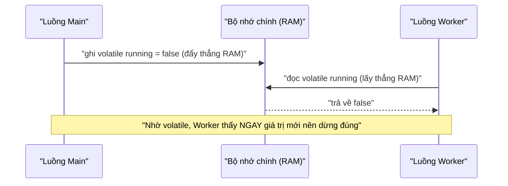

# 4. Từ khóa volatile

`volatile` là từ khóa đặt trước biến để buộc biến đó luôn được đọc/ghi trực tiếp tại bộ nhớ chính, không dùng bản sao trong cache CPU. Nhờ vậy thay đổi của một luồng luôn hiển thị ngay với các luồng khác, rất hợp cho các "cờ" báo dừng luồng. Bài này giải thích `volatile` làm được gì và không làm được gì so với `synchronized`; chi tiết nằm bên dưới.

---

## Mục lục

- [Vì sao có từ khóa volatile?](#vì-sao-có-từ-khóa-volatile)
- [volatile là gì?](#volatile-là-gì)
- [volatile bảo đảm hiển thị (Visibility)](#volatile-bảo-đảm-hiển-thị-visibility)
- [Ví dụ: cờ dừng luồng](#ví-dụ-cờ-dừng-luồng)
- [volatile khác synchronized như thế nào?](#volatile-khác-synchronized-như-thế-nào)
- [volatile KHÔNG bảo đảm tính nguyên tử (Atomicity)](#volatile-không-bảo-đảm-tính-nguyên-tử-atomicity)
- [Khi nào nên dùng volatile?](#khi-nào-nên-dùng-volatile)
- [Lỗi thường gặp](#lỗi-thường-gặp)
- [Tóm tắt](#tóm-tắt)

---

## Vì sao có từ khóa volatile?

**Vấn đề:** Một luồng hạ cờ `running = false` để báo luồng khác dừng, nhưng luồng kia đã **cache** biến trong cache CPU và không bao giờ thấy giá trị mới → vòng lặp chạy mãi (vấn đề **visibility/hiển thị**). Dùng `synchronized` cho việc nhỏ này thì **nặng** vì phải khóa.

```java
public class ViDuKhongVolatile {
    // Không volatile: luồng worker đọc bản sao "true" trong cache → treo mãi
    private static boolean running = true;

    public static void main(String[] args) throws InterruptedException {
        new Thread(() -> {
            while (running) {
                // Bận xử lý... worker không bao giờ thấy running = false
            }
            System.out.println("Worker dừng");
        }).start();

        Thread.sleep(1000);
        running = false; // Hạ cờ, nhưng worker không thấy → KẸT
    }
}
```

**Giải pháp:** Đặt `volatile` lên biến cờ. Mọi lần đọc/ghi đi **thẳng tới bộ nhớ chính** (mọi luồng thấy giá trị mới nhất) và cấm reorder quanh nó → bảo đảm **visibility** một cách **nhẹ nhàng, không cần khóa**.

```java
public class ViDuCoVolatile {
    // Có volatile: ghi đẩy thẳng RAM, đọc lấy thẳng RAM → worker thấy NGAY
    private static volatile boolean running = true;

    public static void main(String[] args) throws InterruptedException {
        new Thread(() -> {
            while (running) {
                // Bận xử lý...
            }
            System.out.println("Worker dừng");
        }).start();

        Thread.sleep(1000);
        running = false; // Worker thấy ngay → dừng đúng
    }
}
```

:::tip[Dùng thực tế]
- **Cờ dừng/trạng thái `boolean`** chia sẻ giữa các luồng (như `running`, `shutdown`).
- **Cờ cấu hình** kiểu đọc nhiều, ghi ít (một luồng cập nhật, nhiều luồng đọc).
- **Double-checked locking** cho singleton (kết hợp với `final` hoặc lớp `Atomic`).
- **KHÔNG dùng** `volatile` cho biến đếm như `count++` — đó là thao tác phức hợp, vẫn cần `Atomic`/`synchronized`.
:::

:::caution
`volatile` **không** bảo đảm tính nguyên tử của thao tác phức hợp như `count++`. Phần dưới giải thích kỹ giới hạn này.
:::

---

## volatile là gì?

`volatile` là một từ khóa đặt trước biến, có nghĩa: **"biến này luôn được đọc và ghi trực tiếp tại bộ nhớ chính (RAM), không dùng bản sao trong cache của CPU".**

Như đã học ở bài Mô hình bộ nhớ, mỗi luồng có thể giữ bản sao biến trong cache riêng, dẫn đến luồng khác không thấy thay đổi. `volatile` giải quyết đúng vấn đề này.

```java
// Đặt volatile trước kiểu dữ liệu của biến
private volatile boolean sanSang = false;
```

Ví dụ đời thường: thay vì mỗi người ghi vào sổ tay riêng (cache), `volatile` bắt mọi người **luôn ghi và đọc trên một bảng thông báo chung** giữa văn phòng. Ai sửa gì, người khác thấy ngay.

---

## volatile bảo đảm hiển thị (Visibility)

Khi một biến là `volatile`:

- Mỗi lần **ghi** → đẩy ngay xuống bộ nhớ chính.
- Mỗi lần **đọc** → lấy thẳng từ bộ nhớ chính.

Nhờ vậy, thay đổi của một luồng **luôn hiển thị** với các luồng khác ngay lập tức. Đây gọi là bảo đảm **visibility (hiển thị)**.

Sơ đồ dưới minh hoạ luồng đọc/ghi biến `volatile` đi thẳng tới bộ nhớ chính, không qua cache riêng:



---

## Ví dụ: cờ dừng luồng

Đây là tình huống dùng `volatile` kinh điển nhất: một biến `boolean` làm "cờ" báo cho luồng khác dừng lại.

```java
public class ViDuCoDung {
    // KHÔNG có volatile: worker có thể chạy mãi không dừng
    // CÓ volatile: worker thấy thay đổi ngay → dừng đúng
    private static volatile boolean dangChay = true;

    public static void main(String[] args) throws InterruptedException {
        Thread worker = new Thread(() -> {
            long dem = 0;
            // Liên tục kiểm tra cờ
            while (dangChay) {
                dem++;
            }
            System.out.println("Worker dừng sau khi đếm " + dem);
        });

        worker.start();
        Thread.sleep(1000); // để worker chạy 1 giây

        // main hạ cờ → nhờ volatile, worker thấy NGAY và dừng
        dangChay = false;
        System.out.println("Main đã hạ cờ dừng");
    }
}
```

Nếu bỏ `volatile`, đoạn code này có thể **treo vĩnh viễn** vì `worker` đọc giá trị `true` cũ từ cache.

---

## volatile khác synchronized như thế nào?

Đây là bảng so sánh dễ nhớ:

| Đặc điểm | `volatile` | `synchronized` |
|---|---|---|
| Bảo đảm hiển thị (visibility) | Có | Có |
| Bảo đảm nguyên tử (atomicity) | **Không** | Có |
| Có khóa, chặn luồng khác chờ | Không | Có (chỉ 1 luồng vào) |
| Tốc độ | Nhanh (nhẹ) | Chậm hơn (có khóa) |
| Dùng cho | Biến đơn được đọc/ghi độc lập | Khối lệnh phức tạp, nhiều bước |

Tóm gọn: `volatile` **nhẹ** nhưng chỉ lo phần "hiển thị". `synchronized` **nặng hơn** nhưng lo cả "hiển thị" lẫn "không bị tranh chấp".

---

## volatile KHÔNG bảo đảm tính nguyên tử (Atomicity)

**Atomicity (tính nguyên tử)** nghĩa là một thao tác chạy "trọn vẹn một mạch", không bị luồng khác xen vào giữa chừng.

`volatile` **không** bảo đảm điều này. Ví dụ kinh điển là phép `count++`:

```java
public class ViDuVolatileSai {
    // volatile chỉ lo hiển thị, KHÔNG ngăn được tranh chấp khi tăng
    private static volatile int count = 0;

    public static void main(String[] args) throws InterruptedException {
        Runnable job = () -> {
            for (int i = 0; i < 100000; i++) {
                count++; // Gồm 3 bước: đọc, +1, ghi → vẫn bị mất khi đua nhau
            }
        };
        Thread t1 = new Thread(job);
        Thread t2 = new Thread(job);
        t1.start(); t2.start();
        t1.join(); t2.join();

        // Vẫn KHÔNG ra đúng 200000, vì volatile không lo atomicity
        System.out.println("Kết quả: " + count);
    }
}
```

Muốn tăng biến an toàn, dùng `synchronized` hoặc lớp `AtomicInteger`:

```java
import java.util.concurrent.atomic.AtomicInteger;

// AtomicInteger: vừa hiển thị, vừa tăng an toàn (nguyên tử)
AtomicInteger count = new AtomicInteger(0);
count.incrementAndGet(); // tương đương count++ nhưng AN TOÀN
```

---

## Khi nào nên dùng volatile?

Dùng `volatile` khi **cả hai** điều sau đúng:

1. Biến chỉ được **một luồng ghi**, các luồng khác chỉ **đọc** (hoặc việc ghi không phụ thuộc giá trị cũ).
2. Bạn chỉ cần bảo đảm các luồng thấy giá trị mới nhất, **không** cần khóa nhiều bước.

Trường hợp điển hình:

- **Cờ trạng thái** (`boolean dangChay`, `boolean daSanSang`).
- Biến cấu hình chỉ ghi một lần rồi nhiều luồng đọc.

**KHÔNG dùng `volatile`** khi thao tác gồm nhiều bước phụ thuộc nhau (như `count++`, kiểm tra rồi mới gán). Khi đó dùng `synchronized` hoặc `Atomic`.

---

## Lỗi thường gặp

1. **Dùng `volatile` cho biến đếm** (`count++`) và tưởng đã an toàn → vẫn bị race condition.
2. **Quên `volatile` cho cờ dừng luồng** → luồng treo mãi không dừng được.
3. **Nghĩ `volatile` thay được `synchronized` trong mọi trường hợp** → sai, nó không có khóa và không lo atomicity.
4. **Đặt `volatile` cho mọi biến cho "chắc"** → thừa thãi, làm chậm và che giấu thiết kế sai.

---

## Tóm tắt

- `volatile` buộc biến luôn đọc/ghi trực tiếp ở **bộ nhớ chính**, bảo đảm **hiển thị (visibility)**.
- Ứng dụng kinh điển: **cờ `boolean` báo dừng luồng**.
- `volatile` **nhẹ hơn** `synchronized` nhưng **không** bảo đảm **nguyên tử (atomicity)**.
- Không dùng `volatile` cho `count++`; hãy dùng `synchronized` hoặc `AtomicInteger`.
- Dùng `volatile` khi một luồng ghi - nhiều luồng đọc, và chỉ cần thấy giá trị mới nhất.
