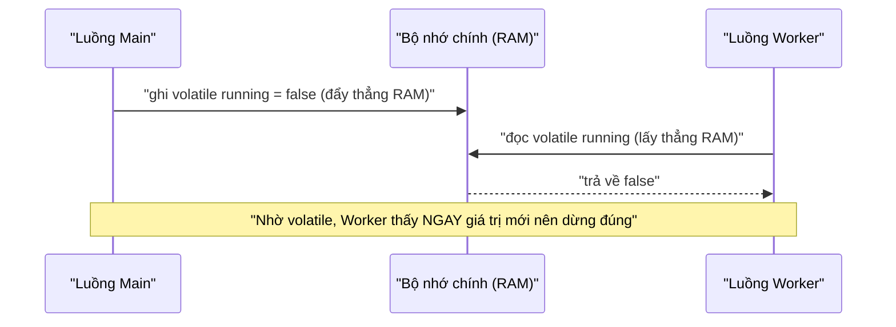

# 4. Từ khóa volatile

`volatile` là từ khóa đặt trước biến để buộc biến đó luôn được đọc/ghi trực tiếp tại bộ nhớ chính, không dùng bản sao trong cache CPU. Nhờ vậy thay đổi của một luồng luôn hiển thị ngay với các luồng khác, rất hợp cho các "cờ" báo dừng luồng. Bài này giải thích `volatile` làm được gì và không làm được gì so với `synchronized`; chi tiết nằm bên dưới.

[](pathname:///img/java/volatile-keyword.webp)

---

:::note[Ghi nhớ nhanh]

- ⭐ **`volatile` bảo đảm visibility** — buộc biến luôn đọc/ghi trực tiếp ở bộ nhớ chính, mọi luồng thấy ngay giá trị mới nhất.
- ⭐ **`volatile` KHÔNG bảo đảm atomicity** — thao tác nhiều bước như `count++` vẫn bị race; hãy dùng `synchronized` hoặc `AtomicInteger`.
- **Ứng dụng kinh điển** — cờ `boolean` báo dừng luồng (`running`, `dangChay`); thiếu `volatile` luồng có thể treo mãi.
- **So với `synchronized`** — `volatile` nhẹ, không khóa; `synchronized` nặng hơn nhưng lo cả visibility lẫn atomicity.
- **Điều kiện dùng** — chỉ khi một luồng ghi (hoặc ghi không phụ thuộc giá trị cũ) và nhiều luồng đọc.

:::

---

## Mục lục

- [Vì sao có từ khóa volatile?](#vì-sao-có-từ-khóa-volatile)
- [volatile là gì?](#volatile-là-gì)
- [volatile bảo đảm hiển thị (Visibility)](#volatile-bảo-đảm-hiển-thị-visibility)
- [Ví dụ: cờ dừng luồng](#ví-dụ-cờ-dừng-luồng)
- [volatile khác synchronized như thế nào?](#volatile-khác-synchronized-như-thế-nào)
- [volatile KHÔNG bảo đảm tính nguyên tử (Atomicity)](#volatile-không-bảo-đảm-tính-nguyên-tử-atomicity)
- [Khi nào nên dùng volatile?](#khi-nào-nên-dùng-volatile)
- [Lỗi thường gặp](#lỗi-thường-gặp)
- [Tóm tắt](#tóm-tắt)
- [Câu hỏi phỏng vấn](#câu-hỏi-phỏng-vấn)

---

## Vì sao có từ khóa volatile?

**Vấn đề:** Một luồng hạ cờ `running = false` để báo luồng khác dừng, nhưng luồng kia đã **cache** biến trong cache CPU và không bao giờ thấy giá trị mới → vòng lặp chạy mãi (vấn đề **visibility/hiển thị**). Dùng `synchronized` cho việc nhỏ này thì **nặng** vì phải khóa.

```java
public class ViDuKhongVolatile {
    // Không volatile: luồng worker đọc bản sao "true" trong cache → treo mãi
    private static boolean running = true;

    public static void main(String[] args) throws InterruptedException {
        new Thread(() -> {
            while (running) {
                // Bận xử lý... worker không bao giờ thấy running = false
            }
            System.out.println("Worker dừng");
        }).start();

        Thread.sleep(1000);
        running = false; // Hạ cờ, nhưng worker không thấy → KẸT
    }
}
```

**Giải pháp:** Đặt `volatile` lên biến cờ. Mọi lần đọc/ghi đi **thẳng tới bộ nhớ chính** (mọi luồng thấy giá trị mới nhất) và cấm reorder quanh nó → bảo đảm **visibility** một cách **nhẹ nhàng, không cần khóa**.

```java
public class ViDuCoVolatile {
    // Có volatile: ghi đẩy thẳng RAM, đọc lấy thẳng RAM → worker thấy NGAY
    private static volatile boolean running = true;

    public static void main(String[] args) throws InterruptedException {
        new Thread(() -> {
            while (running) {
                // Bận xử lý...
            }
            System.out.println("Worker dừng");
        }).start();

        Thread.sleep(1000);
        running = false; // Worker thấy ngay → dừng đúng
    }
}
```

:::tip[Dùng thực tế]
- **Cờ dừng/trạng thái `boolean`** chia sẻ giữa các luồng (như `running`, `shutdown`).
- **Cờ cấu hình** kiểu đọc nhiều, ghi ít (một luồng cập nhật, nhiều luồng đọc).
- **Double-checked locking** cho singleton (kết hợp với `final` hoặc lớp `Atomic`).
- **KHÔNG dùng** `volatile` cho biến đếm như `count++` — đó là thao tác phức hợp, vẫn cần `Atomic`/`synchronized`.
:::

:::caution
`volatile` **không** bảo đảm tính nguyên tử của thao tác phức hợp như `count++`. Phần dưới giải thích kỹ giới hạn này.
:::

---

## volatile là gì?

`volatile` là một từ khóa đặt trước biến, có nghĩa: **"biến này luôn được đọc và ghi trực tiếp tại bộ nhớ chính (RAM), không dùng bản sao trong cache của CPU".**

Như đã học ở bài Mô hình bộ nhớ, mỗi luồng có thể giữ bản sao biến trong cache riêng, dẫn đến luồng khác không thấy thay đổi. `volatile` giải quyết đúng vấn đề này.

```java
// Đặt volatile trước kiểu dữ liệu của biến
private volatile boolean sanSang = false;
```

Ví dụ đời thường: thay vì mỗi người ghi vào sổ tay riêng (cache), `volatile` bắt mọi người **luôn ghi và đọc trên một bảng thông báo chung** giữa văn phòng. Ai sửa gì, người khác thấy ngay.

---

## volatile bảo đảm hiển thị (Visibility)

Khi một biến là `volatile`:

- Mỗi lần **ghi** → đẩy ngay xuống bộ nhớ chính.
- Mỗi lần **đọc** → lấy thẳng từ bộ nhớ chính.

Nhờ vậy, thay đổi của một luồng **luôn hiển thị** với các luồng khác ngay lập tức. Đây gọi là bảo đảm **visibility (hiển thị)**.

Sơ đồ dưới minh hoạ luồng đọc/ghi biến `volatile` đi thẳng tới bộ nhớ chính, không qua cache riêng:


```mermaid
sequenceDiagram
    participant Main as "Luồng Main"
    participant M as "Bộ nhớ chính (RAM)"
    participant W as "Luồng Worker"
    Main->>M: "ghi volatile running = false (đẩy thẳng RAM)"
    W->>M: "đọc volatile running (lấy thẳng RAM)"
    M-->>W: "trả về false"
    Note over Main,W: "Nhờ volatile, Worker thấy NGAY giá trị mới nên dừng đúng"
```

---

## Ví dụ: cờ dừng luồng

Đây là tình huống dùng `volatile` kinh điển nhất: một biến `boolean` làm "cờ" báo cho luồng khác dừng lại.

```java
public class ViDuCoDung {
    // KHÔNG có volatile: worker có thể chạy mãi không dừng
    // CÓ volatile: worker thấy thay đổi ngay → dừng đúng
    private static volatile boolean dangChay = true;

    public static void main(String[] args) throws InterruptedException {
        Thread worker = new Thread(() -> {
            long dem = 0;
            // Liên tục kiểm tra cờ
            while (dangChay) {
                dem++;
            }
            System.out.println("Worker dừng sau khi đếm " + dem);
        });

        worker.start();
        Thread.sleep(1000); // để worker chạy 1 giây

        // main hạ cờ → nhờ volatile, worker thấy NGAY và dừng
        dangChay = false;
        System.out.println("Main đã hạ cờ dừng");
    }
}
```

Nếu bỏ `volatile`, đoạn code này có thể **treo vĩnh viễn** vì `worker` đọc giá trị `true` cũ từ cache.

---

## volatile khác synchronized như thế nào?

Đây là bảng so sánh dễ nhớ:

| Đặc điểm | `volatile` | `synchronized` |
|---|---|---|
| Bảo đảm hiển thị (visibility) | Có | Có |
| Bảo đảm nguyên tử (atomicity) | **Không** | Có |
| Có khóa, chặn luồng khác chờ | Không | Có (chỉ 1 luồng vào) |
| Tốc độ | Nhanh (nhẹ) | Chậm hơn (có khóa) |
| Dùng cho | Biến đơn được đọc/ghi độc lập | Khối lệnh phức tạp, nhiều bước |

Tóm gọn: `volatile` **nhẹ** nhưng chỉ lo phần "hiển thị". `synchronized` **nặng hơn** nhưng lo cả "hiển thị" lẫn "không bị tranh chấp".

---

## volatile KHÔNG bảo đảm tính nguyên tử (Atomicity)

**Atomicity (tính nguyên tử)** nghĩa là một thao tác chạy "trọn vẹn một mạch", không bị luồng khác xen vào giữa chừng.

`volatile` **không** bảo đảm điều này. Ví dụ kinh điển là phép `count++`:

```java
public class ViDuVolatileSai {
    // volatile chỉ lo hiển thị, KHÔNG ngăn được tranh chấp khi tăng
    private static volatile int count = 0;

    public static void main(String[] args) throws InterruptedException {
        Runnable job = () -> {
            for (int i = 0; i < 100000; i++) {
                count++; // Gồm 3 bước: đọc, +1, ghi → vẫn bị mất khi đua nhau
            }
        };
        Thread t1 = new Thread(job);
        Thread t2 = new Thread(job);
        t1.start(); t2.start();
        t1.join(); t2.join();

        // Vẫn KHÔNG ra đúng 200000, vì volatile không lo atomicity
        System.out.println("Kết quả: " + count);
    }
}
```

Muốn tăng biến an toàn, dùng `synchronized` hoặc lớp `AtomicInteger`:

```java
import java.util.concurrent.atomic.AtomicInteger;

// AtomicInteger: vừa hiển thị, vừa tăng an toàn (nguyên tử)
AtomicInteger count = new AtomicInteger(0);
count.incrementAndGet(); // tương đương count++ nhưng AN TOÀN
```

---

## Khi nào nên dùng volatile?

Dùng `volatile` khi **cả hai** điều sau đúng:

1. Biến chỉ được **một luồng ghi**, các luồng khác chỉ **đọc** (hoặc việc ghi không phụ thuộc giá trị cũ).
2. Bạn chỉ cần bảo đảm các luồng thấy giá trị mới nhất, **không** cần khóa nhiều bước.

Trường hợp điển hình:

- **Cờ trạng thái** (`boolean dangChay`, `boolean daSanSang`).
- Biến cấu hình chỉ ghi một lần rồi nhiều luồng đọc.

**KHÔNG dùng `volatile`** khi thao tác gồm nhiều bước phụ thuộc nhau (như `count++`, kiểm tra rồi mới gán). Khi đó dùng `synchronized` hoặc `Atomic`.

---

## Lỗi thường gặp

1. **Dùng `volatile` cho biến đếm** (`count++`) và tưởng đã an toàn → vẫn bị race condition.
2. **Quên `volatile` cho cờ dừng luồng** → luồng treo mãi không dừng được.
3. **Nghĩ `volatile` thay được `synchronized` trong mọi trường hợp** → sai, nó không có khóa và không lo atomicity.
4. **Đặt `volatile` cho mọi biến cho "chắc"** → thừa thãi, làm chậm và che giấu thiết kế sai.

---

## Tóm tắt

- `volatile` buộc biến luôn đọc/ghi trực tiếp ở **bộ nhớ chính**, bảo đảm **hiển thị (visibility)**.
- Ứng dụng kinh điển: **cờ `boolean` báo dừng luồng**.
- `volatile` **nhẹ hơn** `synchronized` nhưng **không** bảo đảm **nguyên tử (atomicity)**.
- Không dùng `volatile` cho `count++`; hãy dùng `synchronized` hoặc `AtomicInteger`.
- Dùng `volatile` khi một luồng ghi - nhiều luồng đọc, và chỉ cần thấy giá trị mới nhất.

---

## Câu hỏi phỏng vấn

Những câu thường gặp về chủ đề này. Tự trả lời trước, rồi bấm **Xem đáp án** để đối chiếu.

**1. Từ khóa `volatile` làm gì? Đặt nó ở đâu trong khai báo biến?**

<details className="qa">
<summary>Xem đáp án</summary>

`volatile` là một từ khóa đặt **trước kiểu dữ liệu** của biến, buộc biến đó luôn được **đọc và ghi trực tiếp tại bộ nhớ chính (RAM)**, không dùng bản sao trong cache riêng của CPU.

```java
private volatile boolean sanSang = false;
```

Nhờ vậy, thay đổi mà một luồng ghi vào biến này **luôn hiển thị ngay** với các luồng khác đọc sau đó — giải quyết đúng vấn đề **visibility** đã học ở bài Java Memory Model.

</details>

**2. `volatile` bảo đảm điều gì và KHÔNG bảo đảm điều gì?**

<details className="qa">
<summary>Xem đáp án</summary>

- **Bảo đảm visibility (hiển thị)**: mọi lần ghi đẩy thẳng xuống bộ nhớ chính, mọi lần đọc lấy thẳng từ bộ nhớ chính — luồng khác luôn thấy giá trị mới nhất.
- **KHÔNG bảo đảm atomicity (tính nguyên tử)**: với các thao tác gồm nhiều bước phụ thuộc lẫn nhau (đọc rồi ghi dựa trên giá trị vừa đọc, ví dụ `count++`), `volatile` **không** ngăn được việc hai luồng xen kẽ nhau giữa các bước đó — vẫn có thể xảy ra race condition.

</details>

**3. So sánh `volatile` và `synchronized` theo các tiêu chí: visibility, atomicity, và có khóa (lock) hay không.**

<details className="qa">
<summary>Xem đáp án</summary>

| Tiêu chí | `volatile` | `synchronized` |
|---|---|---|
| Bảo đảm visibility | Có | Có |
| Bảo đảm atomicity | Không | Có |
| Có khóa, chặn luồng khác chờ | Không | Có (chỉ một luồng vào vùng tới hạn) |
| Tốc độ | Nhanh, nhẹ | Chậm hơn vì có khóa |
| Phù hợp cho | Biến đơn, đọc/ghi độc lập (cờ trạng thái) | Khối lệnh phức tạp, nhiều bước, nhiều biến liên quan |

Ghi nhớ ngắn gọn: `volatile` chỉ lo "nhìn thấy đúng giá trị mới nhất", còn `synchronized` lo cả "nhìn thấy đúng" lẫn "không ai được xen vào giữa chừng".

</details>

**4. Đoạn code sau có luôn in ra đúng `200000` không, dù `count` đã được khai báo `volatile`? Vì sao?**

```java
public class Test {
    private static volatile int count = 0;

    public static void main(String[] args) throws InterruptedException {
        Runnable job = () -> { for (int i = 0; i < 100000; i++) count++; };
        Thread t1 = new Thread(job), t2 = new Thread(job);
        t1.start(); t2.start();
        t1.join(); t2.join();
        System.out.println(count);
    }
}
```

<details className="qa">
<summary>Xem đáp án</summary>

**Không luôn đúng `200000`** — kết quả thường **nhỏ hơn**, dù `count` là `volatile`.

- `count++` vẫn là một thao tác **ba bước** (đọc, cộng 1, ghi lại). `volatile` chỉ đảm bảo mỗi bước đọc/ghi riêng lẻ đó thấy đúng giá trị mới nhất tại đúng thời điểm nó xảy ra — nhưng **không ngăn** hai luồng cùng đọc một giá trị **trước khi** một trong hai kịp ghi giá trị mới, dẫn tới mất một lần tăng (race condition y hệt trường hợp không có `volatile`).
- **Cách sửa đúng**: dùng `synchronized` bọc quanh thao tác tăng, hoặc thay `count` bằng `AtomicInteger` với `incrementAndGet()` — cả hai đều đảm bảo tính **nguyên tử (atomicity)** cho trọn vẹn thao tác đọc-cộng-ghi, điều mà riêng `volatile` không làm được.

</details>

**5. Đoạn code sau nếu bỏ từ khóa `volatile` khỏi `dangChay` thì có gì thay đổi?**

```java
public class Test {
    private static /* volatile */ boolean dangChay = true;

    public static void main(String[] args) throws InterruptedException {
        Thread worker = new Thread(() -> {
            while (dangChay) { /* bận xử lý */ }
            System.out.println("Worker dừng");
        });
        worker.start();
        Thread.sleep(1000);
        dangChay = false;
    }
}
```

<details className="qa">
<summary>Xem đáp án</summary>

Nếu bỏ `volatile`, chương trình **có nguy cơ treo vĩnh viễn** — luồng `worker` không bao giờ in ra `"Worker dừng"`.

- Luồng `worker` có thể chỉ đọc `dangChay` **một lần** rồi giữ giá trị `true` đó trong thanh ghi/cache riêng, không đọc lại từ bộ nhớ chính ở các vòng lặp sau (JIT compiler có thể tối ưu hóa theo hướng này vì không thấy dấu hiệu gì bắt nó phải đọc lại).
- Luồng `main` ghi `dangChay = false` vào bộ nhớ chính, nhưng **không có gì đảm bảo** (không có quan hệ happens-before) rằng `worker` sẽ thấy thay đổi này.
- Có `volatile`: mỗi lần kiểm tra điều kiện vòng lặp, `worker` **buộc phải đọc lại từ bộ nhớ chính**, nên sẽ thấy `false` ngay khi `main` ghi vào, và dừng đúng.

</details>

**6. Nếu một biến `volatile` là một **tham chiếu** tới object hoặc mảng (ví dụ `private volatile int[] mang`), `volatile` có bảo đảm visibility cho các phần tử/field **bên trong** object đó khi bị sửa qua tham chiếu không?**

<details className="qa">
<summary>Xem đáp án</summary>

**Không.** `volatile` chỉ bảo đảm visibility cho **chính bản thân biến tham chiếu** (nghĩa là: gán lại `mang = mangMoi;` thì luồng khác thấy tham chiếu mới ngay) — nó **không** lan tỏa bảo đảm đó vào việc **sửa đổi trực tiếp phần tử/field bên trong** object mà tham chiếu đang trỏ tới.

```java
private static volatile int[] mang = new int[]{1, 2, 3};

// Gán lại toàn bộ tham chiếu -> volatile ĐẢM BẢO luồng khác thấy mảng mới ngay
mang = new int[]{4, 5, 6};

// Sửa MỘT PHẦN TỬ bên trong mảng hiện tại -> volatile KHÔNG đảm bảo visibility cho thay đổi này!
mang[0] = 99;
```

- Đây là một cạm bẫy dễ bị bỏ qua: nhiều người nghĩ đánh dấu `volatile` cho một mảng/object là "an toàn toàn bộ", nhưng thực chất chỉ an toàn cho **thao tác gán lại tham chiếu**. Muốn an toàn cho việc sửa nội dung bên trong, cần `synchronized`, dùng cấu trúc dữ liệu concurrent chuyên dụng (ví dụ `AtomicIntegerArray`), hoặc luôn tạo object/mảng **mới** rồi gán lại tham chiếu thay vì sửa tại chỗ.

</details>

**7. `volatile` có thiết lập quan hệ happens-before không? Nếu có, đó là quan hệ gì?**

<details className="qa">
<summary>Xem đáp án</summary>

**Có.** Đây là một trong các quy tắc happens-before quan trọng của JMM: **việc ghi vào một biến `volatile` happens-before mọi lần đọc biến đó sau này** (bởi bất kỳ luồng nào).

- Hệ quả thực tế: không chỉ chính biến `volatile` được đảm bảo hiển thị đúng, mà **mọi thay đổi khác** mà luồng ghi thực hiện **trước** khi ghi biến `volatile` đó cũng "đi kèm" và được luồng đọc nhìn thấy đầy đủ sau khi đọc được giá trị `volatile` mới — đây chính là kỹ thuật đứng sau ví dụ ở bài Java Memory Model (`giaTri = 42;` rồi mới `sanSang = true;` với `sanSang` là `volatile`).
- Nói cách khác, `volatile` không chỉ bảo vệ riêng nó, mà còn đóng vai trò như một "cột mốc đồng bộ" giúp các thay đổi khác xung quanh nó cũng được truyền tải đúng thứ tự.

</details>

**8. Nêu hai điều kiện để một biến phù hợp dùng `volatile` thay vì `synchronized`/`Atomic`.**

<details className="qa">
<summary>Xem đáp án</summary>

Dùng `volatile` khi **đồng thời** thỏa hai điều kiện:

1. Biến chỉ được **một luồng ghi** (các luồng khác chỉ đọc), hoặc nếu nhiều luồng cùng ghi thì việc ghi đó **không phụ thuộc vào giá trị cũ** của biến (ví dụ luôn gán một giá trị cố định/mới hoàn toàn, không phải "giá trị mới = giá trị cũ + 1").
2. Chỉ cần đảm bảo các luồng thấy **giá trị mới nhất**, không cần khóa hay đảm bảo tính nguyên tử cho một chuỗi nhiều thao tác.

Trường hợp điển hình đáp ứng cả hai: cờ trạng thái `boolean` (`dangChay`, `daKhoiTao`), hoặc một tham chiếu cấu hình được gán lại toàn bộ mỗi khi cập nhật.

</details>

**9. Tình huống: bạn cần chia sẻ một object cấu hình được **một luồng cập nhật** (thay hẳn bằng object mới) và **nhiều luồng đọc** liên tục. Nên dùng biến tham chiếu `volatile` hay `AtomicReference`? Có khác biệt thực chất không?**

<details className="qa">
<summary>Xem đáp án</summary>

Với đúng kịch bản "một luồng ghi, nhiều luồng đọc, mỗi lần ghi là thay hẳn toàn bộ tham chiếu", **cả hai đều đảm bảo visibility tương đương** — thực chất `AtomicReference` được cài đặt dựa trên một field `volatile` bên trong.

```java
private static volatile CauHinh cauHinh = CauHinh.macDinh();
// hoặc
private static final AtomicReference<CauHinh> cauHinhRef =
    new AtomicReference<>(CauHinh.macDinh());
```

Khác biệt thực sự chỉ xuất hiện nếu bạn cần thêm các thao tác **nguyên tử phức hợp**:

- Chỉ cần **gán/đọc đơn giản** → `volatile` là đủ, gọn hơn.
- Cần **so sánh-và-đổi (compare-and-set)**, ví dụ "chỉ cập nhật cấu hình mới nếu cấu hình hiện tại đúng là bản mà tôi mong đợi" (tránh ghi đè lẫn nhau khi nhiều luồng cùng cố cập nhật) → dùng `AtomicReference.compareAndSet(cu, moi)`, vì `volatile` đơn thuần không cung cấp thao tác nguyên tử kiểu "kiểm tra rồi mới gán" này.

</details>
