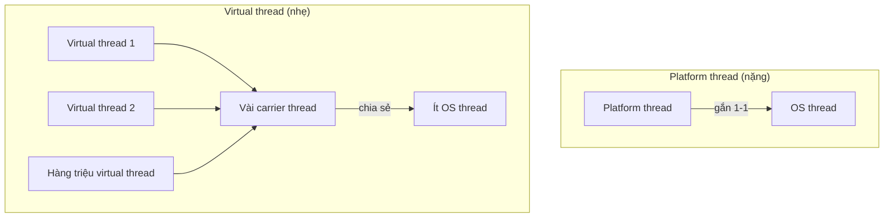

# 5. Virtual Threads (Luồng ảo)

Virtual thread (luồng ảo) là loại luồng siêu nhẹ ra mắt chính thức từ Java 21, cho phép tạo tới hàng triệu luồng mà không làm quá tải máy. Chúng đặc biệt hữu ích cho các ứng dụng nhiều I/O (web server, gọi API, truy vấn cơ sở dữ liệu) vì biết nhả tài nguyên trong lúc chờ. Bài này giới thiệu luồng ảo là gì, vì sao nhẹ và khi nào nên dùng; chi tiết nằm bên dưới.

---

## Mục lục

- [Vì sao có virtual threads?](#vì-sao-có-virtual-threads)
- [Virtual Thread là gì?](#virtual-thread-là-gì)
- [Platform Thread và Virtual Thread](#platform-thread-và-virtual-thread)
- [Vì sao virtual thread nhẹ?](#vì-sao-virtual-thread-nhẹ)
- [Cách tạo virtual thread](#cách-tạo-virtual-thread)
- [Lợi ích cho ứng dụng nhiều I/O](#lợi-ích-cho-ứng-dụng-nhiều-io)
- [Khi nào nên và không nên dùng?](#khi-nào-nên-và-không-nên-dùng)
- [Lỗi thường gặp](#lỗi-thường-gặp)
- [Tóm tắt](#tóm-tắt)

---

## Vì sao có virtual threads?

**Vấn đề:** Luồng truyền thống của Java (platform thread) **ánh xạ 1-1** tới luồng của **hệ điều hành (OS thread)**. Mỗi luồng tốn nhiều bộ nhớ (~1MB stack) và việc chuyển ngữ cảnh khá đắt, nên máy chỉ tạo được vài nghìn luồng. Với server xử lý nhiều kết nối phải **chờ I/O**, ta hoặc phải giới hạn thread pool (gây nghẽn khi quá tải), hoặc viết code bất đồng bộ phức tạp (callback/reactive) để scale.

```java
// Mỗi yêu cầu một platform thread → cạn luồng rất nhanh
ExecutorService pool = Executors.newFixedThreadPool(200);
for (int i = 0; i < 100_000; i++) {
    pool.submit(() -> {
        goiApiCham();   // chờ I/O, nhưng vẫn GIỮ CHẶT 1 OS thread
        return null;
    });
}
// 100.000 yêu cầu nhưng chỉ 200 luồng → phần lớn phải xếp hàng chờ (nghẽn)
```

**Giải pháp:** **Virtual threads (Java 21)** là luồng **siêu nhẹ** do JVM quản lý (không phải OS thread 1-1), có thể tạo tới **hàng triệu**. Khi luồng ảo chờ I/O, nó tự **nhường** carrier thread cho luồng khác dùng. Nhờ vậy bạn viết code **blocking tuần tự** đơn giản mà vẫn scale rất cao.

```java
// Mỗi yêu cầu một virtual thread → tạo hàng triệu vẫn ổn
try (ExecutorService pool = Executors.newVirtualThreadPerTaskExecutor()) {
    for (int i = 0; i < 100_000; i++) {
        pool.submit(() -> {
            goiApiCham();   // chờ I/O → tự NHẢ carrier thread cho việc khác
            return null;
        });
    }
}
// Code đọc tuần tự, dễ hiểu, mà vẫn xử lý đồng thời cả trăm nghìn yêu cầu
```

:::tip[Dùng thực tế]

- **Server I/O-bound số lượng lớn**: xử lý hàng triệu kết nối chủ yếu ngồi chờ mạng/DB mà không cạn luồng.
- **Thay reactive phức tạp**: bỏ chuỗi callback/reactive khó đọc, quay về code blocking tuần tự nhưng vẫn scale.
- **Một virtual thread mỗi request**: mỗi yêu cầu web có luồng riêng, code rõ ràng, không lo giới hạn pool.
- **Gọi nhiều API/DB song song**: phát nhiều lời gọi cùng lúc rồi chờ kết quả mà không phải lo về số luồng.

:::

---

## Virtual Thread là gì?

**Virtual thread (luồng ảo)** là một loại luồng **siêu nhẹ** được Java giới thiệu chính thức từ **Java 21**. Bạn vẫn lập trình như luồng bình thường, nhưng máy ảo Java có thể tạo ra **hàng triệu** luồng ảo mà không bị quá tải.

Ví dụ đời thường: luồng truyền thống giống như **thuê một nhân viên cố định** cho mỗi việc — tốn lương, tốn chỗ ngồi, không thuê được nhiều. Luồng ảo giống như **giao việc theo phiếu**: ai rảnh thì cầm phiếu làm; có hàng triệu phiếu cũng không sao vì không cần hàng triệu nhân viên thật.

---

## Platform Thread và Virtual Thread

Java có hai loại luồng:

- **Platform thread (luồng nền tảng)**: luồng truyền thống mà bạn học từ bài 1. Mỗi platform thread gắn 1-1 với một **luồng của hệ điều hành (OS thread)**. Chúng **nặng**: mỗi luồng tốn khoảng vài MB bộ nhớ, nên máy chỉ chịu được vài nghìn luồng.

- **Virtual thread (luồng ảo)**: luồng do JVM quản lý, **không** gắn cố định với OS thread. Nhiều luồng ảo dùng chung một số ít platform thread. Chúng **rất nhẹ**: chỉ tốn vài KB, máy chịu được hàng triệu luồng.

```
Truyền thống:  1 platform thread  ── gắn ──  1 OS thread (nặng)

Luồng ảo:      nhiều virtual thread ── chia sẻ ── ít platform thread → ít OS thread
```

Sơ đồ dưới so sánh trực quan hai mô hình ánh xạ luồng:



---

## Vì sao virtual thread nhẹ?

Mấu chốt nằm ở chỗ: khi một luồng ảo **chờ** một việc chậm (ví dụ chờ dữ liệu từ mạng, chờ đọc file, chờ cơ sở dữ liệu trả lời), nó **không giữ chặt** OS thread. Thay vào đó, JVM **tháo** luồng ảo ra, trả OS thread cho luồng ảo khác dùng, rồi gắn lại khi dữ liệu về.

Ví dụ đời thường: trong khi bạn chờ nước sôi (việc chậm), bạn không đứng yên giữ bếp mà đi làm việc khác. Khi nước sôi mới quay lại. Một người (OS thread) phục vụ được rất nhiều nồi (luồng ảo) nhờ tận dụng lúc chờ.

Vì việc "chờ" rất phổ biến trong ứng dụng thực tế, virtual thread giúp một số ít OS thread phục vụ cực nhiều công việc.

---

## Cách tạo virtual thread

Có nhiều cách. Dưới đây là các cách phổ biến (cần **Java 21 trở lên**):

```java
public class ViDuVirtualThread {
    public static void main(String[] args) throws InterruptedException {
        // Cách 1: tạo và khởi động ngay một luồng ảo
        Thread t = Thread.ofVirtual().start(() ->
            System.out.println("Xin chào từ luồng ảo: "
                + Thread.currentThread())
        );
        t.join(); // chờ luồng ảo xong

        // Cách 2: tạo trước, start sau
        Thread t2 = Thread.ofVirtual()
                          .name("luong-ao-2")
                          .unstarted(() -> System.out.println("Luồng ảo 2 chạy"));
        t2.start();
        t2.join();
    }
}
```

Dùng `ExecutorService` chuyên cho luồng ảo — mỗi việc một luồng ảo riêng:

```java
import java.util.concurrent.ExecutorService;
import java.util.concurrent.Executors;

public class ViDuVirtualExecutor {
    public static void main(String[] args) {
        // Mỗi tác vụ submit sẽ chạy trên MỘT luồng ảo mới
        try (ExecutorService pool = Executors.newVirtualThreadPerTaskExecutor()) {
            for (int i = 1; i <= 10000; i++) {
                int viec = i;
                pool.submit(() -> {
                    // Giả lập một việc chờ (như gọi mạng)
                    Thread.sleep(100);
                    System.out.println("Xong việc " + viec);
                    return null;
                });
            }
            // try-with-resources tự gọi shutdown và chờ mọi việc xong
        }
    }
}
```

Tạo 10.000 luồng ảo như trên hoàn toàn bình thường; nếu dùng platform thread thật thì máy đã quá tải.

---

## Lợi ích cho ứng dụng nhiều I/O

**I/O (Input/Output — nhập/xuất)** là các việc liên quan đến chờ đợi bên ngoài: gọi API mạng, đọc/ghi file, truy vấn cơ sở dữ liệu. Các việc này phần lớn thời gian là **ngồi chờ**, không dùng CPU.

Ứng dụng web điển hình (xử lý nhiều yêu cầu, mỗi yêu cầu gọi vài API/DB) là loại "nhiều I/O". Với virtual thread:

- Mỗi yêu cầu có thể dùng **một luồng ảo riêng** mà không lo cạn luồng.
- Code viết theo kiểu **tuần tự, dễ đọc** (không cần callback rối rắm), mà vẫn xử lý được hàng chục nghìn yêu cầu cùng lúc.
- Tận dụng tối đa thời gian chờ I/O.

Đây là lý do virtual thread được xem là bước tiến lớn cho lập trình máy chủ trong Java.

---

## Khi nào nên và không nên dùng?

**Nên dùng virtual thread** khi:

- Ứng dụng có **nhiều việc chờ I/O** (mạng, file, DB).
- Cần xử lý **rất nhiều tác vụ đồng thời** (hàng nghìn, hàng vạn).

**Không cần / không nên** khi:

- Tác vụ **nặng về tính toán CPU** (ví dụ tính toán số học liên tục, mã hóa, xử lý ảnh): lúc này việc tốn CPU chứ không phải chờ, nên luồng ảo không có lợi thế — dùng platform thread theo số nhân CPU là đủ.
- Số lượng tác vụ rất ít: dùng luồng thường cũng ổn.

Lưu ý: **không nên** gom virtual thread vào thread pool cố định kiểu `newFixedThreadPool`. Virtual thread vốn rẻ, hãy tạo mới mỗi việc (dùng `newVirtualThreadPerTaskExecutor`).

---

## Lỗi thường gặp

1. **Dùng trên Java cũ hơn 21**: virtual thread chưa có hoặc còn ở dạng thử nghiệm; code sẽ không biên dịch/chạy được.
2. **Gom virtual thread vào pool cố định**: làm mất ý nghĩa "nhẹ và nhiều" của luồng ảo.
3. **Kỳ vọng virtual thread làm tác vụ CPU nhanh hơn**: không đúng — nó chỉ lợi cho tác vụ **chờ I/O**.
4. **Dùng `synchronized` quanh đoạn chờ I/O dài**: có thể "ghim" (pin) luồng ảo vào OS thread, làm mất lợi ích; nên ưu tiên dùng `Lock` cho các đoạn này.
5. **Quên `join()` hoặc đóng `ExecutorService`**: chương trình kết thúc trước khi luồng ảo làm xong việc.

---

## Tóm tắt

- **Virtual thread (luồng ảo)** là luồng siêu nhẹ từ **Java 21**, có thể tạo hàng triệu cái.
- Khác **platform thread** (gắn 1-1 với OS thread, nặng), virtual thread chia sẻ ít OS thread.
- Chúng nhẹ vì khi **chờ I/O**, chúng nhả OS thread cho luồng khác dùng.
- Tạo bằng `Thread.ofVirtual()` hoặc `Executors.newVirtualThreadPerTaskExecutor()`.
- Lợi ích lớn nhất là cho ứng dụng **nhiều I/O** (web server, gọi API/DB), không phải tác vụ nặng CPU.
