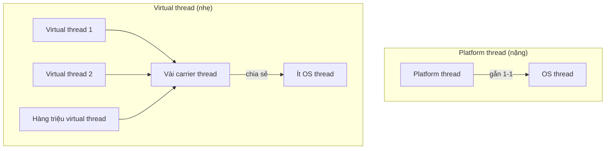

# 5. Virtual Threads (Luồng ảo)

Virtual thread (luồng ảo) là loại luồng siêu nhẹ ra mắt chính thức từ Java 21, cho phép tạo tới hàng triệu luồng mà không làm quá tải máy. Chúng đặc biệt hữu ích cho các ứng dụng nhiều I/O (web server, gọi API, truy vấn cơ sở dữ liệu) vì biết nhả tài nguyên trong lúc chờ. Bài này giới thiệu luồng ảo là gì, vì sao nhẹ và khi nào nên dùng; chi tiết nằm bên dưới.

[](pathname:///img/java/virtual-threads.webp)

---

:::note[Ghi nhớ nhanh]

- ⭐ **Virtual thread (Java 21)** — luồng siêu nhẹ do JVM quản lý, tạo được hàng triệu cái mà không quá tải máy.
- ⭐ **Nhẹ vì biết nhả tài nguyên** — khi chờ I/O, luồng ảo tự nhường carrier/OS thread cho luồng khác, khác `platform thread` gắn 1-1 với OS thread (nặng).
- **Lợi ích lớn nhất cho ứng dụng nhiều I/O** — web server, gọi API/DB; code viết blocking tuần tự dễ đọc mà vẫn scale cao. Không hợp tác vụ nặng CPU.
- **Cách tạo** — `Thread.ofVirtual()` hoặc `Executors.newVirtualThreadPerTaskExecutor()` (mỗi việc một luồng ảo).
- **Cạm bẫy** — đừng gom vào pool cố định `newFixedThreadPool`; tránh `synchronized` quanh đoạn chờ I/O dài (bị "pin"), nên dùng `Lock`.

:::

---

## Mục lục

- [Vì sao có virtual threads?](#vì-sao-có-virtual-threads)
- [Virtual Thread là gì?](#virtual-thread-là-gì)
- [Platform Thread và Virtual Thread](#platform-thread-và-virtual-thread)
- [Vì sao virtual thread nhẹ?](#vì-sao-virtual-thread-nhẹ)
- [Cách tạo virtual thread](#cách-tạo-virtual-thread)
- [Lợi ích cho ứng dụng nhiều I/O](#lợi-ích-cho-ứng-dụng-nhiều-io)
- [Khi nào nên và không nên dùng?](#khi-nào-nên-và-không-nên-dùng)
- [Lỗi thường gặp](#lỗi-thường-gặp)
- [Tóm tắt](#tóm-tắt)
- [Câu hỏi phỏng vấn](#câu-hỏi-phỏng-vấn)

---

## Vì sao có virtual threads?

**Vấn đề:** Luồng truyền thống của Java (platform thread) **ánh xạ 1-1** tới luồng của **hệ điều hành (OS thread)**. Mỗi luồng tốn nhiều bộ nhớ (~1MB stack) và việc chuyển ngữ cảnh khá đắt, nên máy chỉ tạo được vài nghìn luồng. Với server xử lý nhiều kết nối phải **chờ I/O**, ta hoặc phải giới hạn thread pool (gây nghẽn khi quá tải), hoặc viết code bất đồng bộ phức tạp (callback/reactive) để scale.

```java
// Mỗi yêu cầu một platform thread → cạn luồng rất nhanh
ExecutorService pool = Executors.newFixedThreadPool(200);
for (int i = 0; i < 100_000; i++) {
    pool.submit(() -> {
        goiApiCham();   // chờ I/O, nhưng vẫn GIỮ CHẶT 1 OS thread
        return null;
    });
}
// 100.000 yêu cầu nhưng chỉ 200 luồng → phần lớn phải xếp hàng chờ (nghẽn)
```

**Giải pháp:** **Virtual threads (Java 21)** là luồng **siêu nhẹ** do JVM quản lý (không phải OS thread 1-1), có thể tạo tới **hàng triệu**. Khi luồng ảo chờ I/O, nó tự **nhường** carrier thread cho luồng khác dùng. Nhờ vậy bạn viết code **blocking tuần tự** đơn giản mà vẫn scale rất cao.

```java
// Mỗi yêu cầu một virtual thread → tạo hàng triệu vẫn ổn
try (ExecutorService pool = Executors.newVirtualThreadPerTaskExecutor()) {
    for (int i = 0; i < 100_000; i++) {
        pool.submit(() -> {
            goiApiCham();   // chờ I/O → tự NHẢ carrier thread cho việc khác
            return null;
        });
    }
}
// Code đọc tuần tự, dễ hiểu, mà vẫn xử lý đồng thời cả trăm nghìn yêu cầu
```

:::tip[Dùng thực tế]

- **Server I/O-bound số lượng lớn**: xử lý hàng triệu kết nối chủ yếu ngồi chờ mạng/DB mà không cạn luồng.
- **Thay reactive phức tạp**: bỏ chuỗi callback/reactive khó đọc, quay về code blocking tuần tự nhưng vẫn scale.
- **Một virtual thread mỗi request**: mỗi yêu cầu web có luồng riêng, code rõ ràng, không lo giới hạn pool.
- **Gọi nhiều API/DB song song**: phát nhiều lời gọi cùng lúc rồi chờ kết quả mà không phải lo về số luồng.

:::

---

## Virtual Thread là gì?

**Virtual thread (luồng ảo)** là một loại luồng **siêu nhẹ** được Java giới thiệu chính thức từ **Java 21**. Bạn vẫn lập trình như luồng bình thường, nhưng máy ảo Java có thể tạo ra **hàng triệu** luồng ảo mà không bị quá tải.

Ví dụ đời thường: luồng truyền thống giống như **thuê một nhân viên cố định** cho mỗi việc — tốn lương, tốn chỗ ngồi, không thuê được nhiều. Luồng ảo giống như **giao việc theo phiếu**: ai rảnh thì cầm phiếu làm; có hàng triệu phiếu cũng không sao vì không cần hàng triệu nhân viên thật.

---

## Platform Thread và Virtual Thread

Java có hai loại luồng:

- **Platform thread (luồng nền tảng)**: luồng truyền thống mà bạn học từ bài 1. Mỗi platform thread gắn 1-1 với một **luồng của hệ điều hành (OS thread)**. Chúng **nặng**: mỗi luồng tốn khoảng vài MB bộ nhớ, nên máy chỉ chịu được vài nghìn luồng.

- **Virtual thread (luồng ảo)**: luồng do JVM quản lý, **không** gắn cố định với OS thread. Nhiều luồng ảo dùng chung một số ít platform thread. Chúng **rất nhẹ**: chỉ tốn vài KB, máy chịu được hàng triệu luồng.

```
Truyền thống:  1 platform thread  ── gắn ──  1 OS thread (nặng)

Luồng ảo:      nhiều virtual thread ── chia sẻ ── ít platform thread → ít OS thread
```

Sơ đồ dưới so sánh trực quan hai mô hình ánh xạ luồng:


```mermaid
flowchart TB
    subgraph PT["Platform thread (nặng)"]
        P1["Platform thread"] -->|"gắn 1-1"| OS1["OS thread"]
    end
    subgraph VT["Virtual thread (nhẹ)"]
        V1["Virtual thread 1"] --> Carrier["Vài carrier thread"]
        V2["Virtual thread 2"] --> Carrier
        V3["Hàng triệu virtual thread"] --> Carrier
        Carrier -->|"chia sẻ"| OS2["Ít OS thread"]
    end
```

---

## Vì sao virtual thread nhẹ?

Mấu chốt nằm ở chỗ: khi một luồng ảo **chờ** một việc chậm (ví dụ chờ dữ liệu từ mạng, chờ đọc file, chờ cơ sở dữ liệu trả lời), nó **không giữ chặt** OS thread. Thay vào đó, JVM **tháo** luồng ảo ra, trả OS thread cho luồng ảo khác dùng, rồi gắn lại khi dữ liệu về.

Ví dụ đời thường: trong khi bạn chờ nước sôi (việc chậm), bạn không đứng yên giữ bếp mà đi làm việc khác. Khi nước sôi mới quay lại. Một người (OS thread) phục vụ được rất nhiều nồi (luồng ảo) nhờ tận dụng lúc chờ.

Vì việc "chờ" rất phổ biến trong ứng dụng thực tế, virtual thread giúp một số ít OS thread phục vụ cực nhiều công việc.

---

## Cách tạo virtual thread

Có nhiều cách. Dưới đây là các cách phổ biến (cần **Java 21 trở lên**):

```java
public class ViDuVirtualThread {
    public static void main(String[] args) throws InterruptedException {
        // Cách 1: tạo và khởi động ngay một luồng ảo
        Thread t = Thread.ofVirtual().start(() ->
            System.out.println("Xin chào từ luồng ảo: "
                + Thread.currentThread())
        );
        t.join(); // chờ luồng ảo xong

        // Cách 2: tạo trước, start sau
        Thread t2 = Thread.ofVirtual()
                          .name("luong-ao-2")
                          .unstarted(() -> System.out.println("Luồng ảo 2 chạy"));
        t2.start();
        t2.join();
    }
}
```

Dùng `ExecutorService` chuyên cho luồng ảo — mỗi việc một luồng ảo riêng:

```java
import java.util.concurrent.ExecutorService;
import java.util.concurrent.Executors;

public class ViDuVirtualExecutor {
    public static void main(String[] args) {
        // Mỗi tác vụ submit sẽ chạy trên MỘT luồng ảo mới
        try (ExecutorService pool = Executors.newVirtualThreadPerTaskExecutor()) {
            for (int i = 1; i <= 10000; i++) {
                int viec = i;
                pool.submit(() -> {
                    // Giả lập một việc chờ (như gọi mạng)
                    Thread.sleep(100);
                    System.out.println("Xong việc " + viec);
                    return null;
                });
            }
            // try-with-resources tự gọi shutdown và chờ mọi việc xong
        }
    }
}
```

Tạo 10.000 luồng ảo như trên hoàn toàn bình thường; nếu dùng platform thread thật thì máy đã quá tải.

---

## Lợi ích cho ứng dụng nhiều I/O

**I/O (Input/Output — nhập/xuất)** là các việc liên quan đến chờ đợi bên ngoài: gọi API mạng, đọc/ghi file, truy vấn cơ sở dữ liệu. Các việc này phần lớn thời gian là **ngồi chờ**, không dùng CPU.

Ứng dụng web điển hình (xử lý nhiều yêu cầu, mỗi yêu cầu gọi vài API/DB) là loại "nhiều I/O". Với virtual thread:

- Mỗi yêu cầu có thể dùng **một luồng ảo riêng** mà không lo cạn luồng.
- Code viết theo kiểu **tuần tự, dễ đọc** (không cần callback rối rắm), mà vẫn xử lý được hàng chục nghìn yêu cầu cùng lúc.
- Tận dụng tối đa thời gian chờ I/O.

Đây là lý do virtual thread được xem là bước tiến lớn cho lập trình máy chủ trong Java.

---

## Khi nào nên và không nên dùng?

**Nên dùng virtual thread** khi:

- Ứng dụng có **nhiều việc chờ I/O** (mạng, file, DB).
- Cần xử lý **rất nhiều tác vụ đồng thời** (hàng nghìn, hàng vạn).

**Không cần / không nên** khi:

- Tác vụ **nặng về tính toán CPU** (ví dụ tính toán số học liên tục, mã hóa, xử lý ảnh): lúc này việc tốn CPU chứ không phải chờ, nên luồng ảo không có lợi thế — dùng platform thread theo số nhân CPU là đủ.
- Số lượng tác vụ rất ít: dùng luồng thường cũng ổn.

Lưu ý: **không nên** gom virtual thread vào thread pool cố định kiểu `newFixedThreadPool`. Virtual thread vốn rẻ, hãy tạo mới mỗi việc (dùng `newVirtualThreadPerTaskExecutor`).

---

## Lỗi thường gặp

1. **Dùng trên Java cũ hơn 21**: virtual thread chưa có hoặc còn ở dạng thử nghiệm; code sẽ không biên dịch/chạy được.
2. **Gom virtual thread vào pool cố định**: làm mất ý nghĩa "nhẹ và nhiều" của luồng ảo.
3. **Kỳ vọng virtual thread làm tác vụ CPU nhanh hơn**: không đúng — nó chỉ lợi cho tác vụ **chờ I/O**.
4. **Dùng `synchronized` quanh đoạn chờ I/O dài**: có thể "ghim" (pin) luồng ảo vào OS thread, làm mất lợi ích; nên ưu tiên dùng `Lock` cho các đoạn này.
5. **Quên `join()` hoặc đóng `ExecutorService`**: chương trình kết thúc trước khi luồng ảo làm xong việc.

---

## Tóm tắt

- **Virtual thread (luồng ảo)** là luồng siêu nhẹ từ **Java 21**, có thể tạo hàng triệu cái.
- Khác **platform thread** (gắn 1-1 với OS thread, nặng), virtual thread chia sẻ ít OS thread.
- Chúng nhẹ vì khi **chờ I/O**, chúng nhả OS thread cho luồng khác dùng.
- Tạo bằng `Thread.ofVirtual()` hoặc `Executors.newVirtualThreadPerTaskExecutor()`.
- Lợi ích lớn nhất là cho ứng dụng **nhiều I/O** (web server, gọi API/DB), không phải tác vụ nặng CPU.

---

## Câu hỏi phỏng vấn

Những câu thường gặp về chủ đề này. Tự trả lời trước, rồi bấm **Xem đáp án** để đối chiếu.

**1. Virtual thread là gì? Ra mắt chính thức từ phiên bản Java nào?**

<details className="qa">
<summary>Xem đáp án</summary>

**Virtual thread (luồng ảo)** là một loại luồng **siêu nhẹ** do JVM quản lý (không gắn 1-1 với luồng hệ điều hành), ra mắt **chính thức** từ **Java 21** (từng là tính năng preview ở Java 19 và 20). Nó cho phép tạo tới **hàng triệu** luồng mà không làm quá tải máy, đặc biệt hữu ích cho ứng dụng nhiều I/O.

</details>

**2. So sánh platform thread và virtual thread về cách ánh xạ tới OS thread và mức tiêu tốn tài nguyên.**

<details className="qa">
<summary>Xem đáp án</summary>

| | Platform thread | Virtual thread |
|---|---|---|
| Ánh xạ tới OS thread | **1-1 cố định** | Nhiều virtual thread **chia sẻ** một số ít **carrier thread** (là platform thread) |
| Bộ nhớ mỗi luồng | Khoảng vài MB stack | Chỉ vài KB |
| Số lượng tạo được | Vài nghìn trước khi quá tải | Hàng triệu |
| Do ai quản lý | Hệ điều hành | JVM |

</details>

**3. Vì sao virtual thread lại nhẹ đến vậy? Điều gì xảy ra khi một virtual thread gặp thao tác chờ I/O?**

<details className="qa">
<summary>Xem đáp án</summary>

Mấu chốt: khi một virtual thread **chờ I/O** (đọc file, gọi mạng, truy vấn DB), JVM sẽ **"tháo" (unmount)** nó ra khỏi carrier thread (platform thread) đang chạy nó, và **trả carrier thread đó** cho một virtual thread khác đang sẵn sàng chạy sử dụng. Khi dữ liệu I/O đã sẵn sàng, virtual thread được **gắn lại (mount)** vào một carrier thread rảnh (không nhất thiết là carrier thread ban đầu) để tiếp tục chạy.

Nhờ cơ chế này, **một số ít carrier thread có thể phục vụ luân phiên cho hàng chục nghìn virtual thread** đang ở trạng thái chờ cùng lúc — vì phần lớn thời gian của một ứng dụng I/O-bound là ngồi chờ, không thực sự chiếm CPU.

</details>

**4. Kể hai cách tạo virtual thread trong Java 21+.**

<details className="qa">
<summary>Xem đáp án</summary>

```java
// Cách 1: tạo trực tiếp một virtual thread và khởi động ngay
Thread t = Thread.ofVirtual().start(() -> System.out.println("Xin chào"));

// Cách 2: dùng ExecutorService chuyên cho virtual thread — mỗi tác vụ một luồng ảo riêng
try (ExecutorService pool = Executors.newVirtualThreadPerTaskExecutor()) {
    pool.submit(() -> System.out.println("Việc chạy trên virtual thread"));
}
```

`newVirtualThreadPerTaskExecutor()` là cách phổ biến hơn trong thực tế vì nó tích hợp tốt với mô hình `ExecutorService`/`Future` sẵn có, dễ thay thế cho thread pool cũ mà ít phải sửa code xung quanh.

</details>

**5. Vì sao KHÔNG nên gom virtual thread vào một thread pool cố định như `Executors.newFixedThreadPool(n)`?**

<details className="qa">
<summary>Xem đáp án</summary>

Ý nghĩa cốt lõi của virtual thread là: chúng **cực rẻ**, nên triết lý sử dụng đúng là **"mỗi tác vụ một virtual thread mới"**, không cần tái sử dụng như platform thread.

- `newFixedThreadPool(n)` giới hạn số luồng đồng thời ở mức `n` — nếu áp dụng cho virtual thread, bạn **vô tình giới hạn ngược lại** đúng điểm mạnh của nó (khả năng tạo hàng triệu luồng đồng thời), biến virtual thread thành một platform thread "đội lốt" mà không có lợi ích gì thêm.
- Cách dùng đúng: `newVirtualThreadPerTaskExecutor()` — không giới hạn số luồng tùy ý, để JVM tự quản lý việc mount/unmount vào carrier thread bên dưới.

</details>

**6. "Pinning" (ghim luồng ảo) là gì? Vì sao dùng `synchronized` quanh một đoạn chờ I/O dài có thể gây ra hiện tượng này, và cách khắc phục?**

<details className="qa">
<summary>Xem đáp án</summary>

**Pinning** là hiện tượng một virtual thread bị **"ghim chặt"** vào carrier thread của nó trong lúc chờ I/O, thay vì được tháo ra (unmount) để nhường carrier thread cho virtual thread khác — làm mất đi lợi ích chính của mô hình luồng ảo.

- Nguyên nhân phổ biến: khi virtual thread đang ở **bên trong một khối `synchronized`** mà gặp thao tác chờ I/O, JVM (tùy phiên bản) không thể an toàn tháo nó ra (vì phải đảm bảo khóa monitor gắn với đúng carrier thread), nên đành giữ nguyên — carrier thread bị "kẹt" chờ cùng, không phục vụ được virtual thread nào khác trong lúc đó.
- **Cách khắc phục**: thay `synchronized` bằng `java.util.concurrent.locks.Lock` (ví dụ `ReentrantLock`) cho các đoạn code có gọi I/O chờ lâu bên trong vùng khóa — `Lock` không gây pinning theo cách `synchronized` làm.
- **Lưu ý phiên bản**: từ **Java 24** (JEP 491), `synchronized` **không còn gây pinning** nữa. Pinning vẫn xảy ra khi virtual thread đang chạy native method/JNI. Vấn đề trên chủ yếu áp dụng cho Java 21–23.

</details>

**7. Virtual thread có giúp ích cho các tác vụ nặng về tính toán CPU (ví dụ mã hóa, xử lý ảnh, tính toán số học liên tục) không? Vì sao?**

<details className="qa">
<summary>Xem đáp án</summary>

**Không giúp ích đáng kể**, thậm chí không cần thiết.

- Lợi thế của virtual thread nằm ở việc **nhường carrier thread trong lúc chờ I/O** — khi một tác vụ liên tục dùng CPU mà không hề "chờ" gì, nó **không bao giờ nhường chỗ**, nên hàng triệu virtual thread cùng chạy tính toán CPU-bound sẽ tranh nhau đúng số lượng carrier thread giới hạn (thường bằng số nhân CPU) y hệt như platform thread.
- Với tác vụ CPU-bound, cách hợp lý vẫn là dùng **platform thread theo đúng số nhân CPU** (ví dụ `ForkJoinPool` hoặc `newFixedThreadPool` với kích thước gần số core), vì tạo thêm luồng (dù ảo hay thật) không giúp tính toán nhanh hơn khi CPU đã bận rộn hết công suất.

</details>

**8. So sánh cách tiếp cận "virtual thread + code blocking tuần tự" với mô hình lập trình bất đồng bộ/reactive (callback, `CompletableFuture` xâu chuỗi, reactive streams) cho bài toán server nhiều I/O.**

<details className="qa">
<summary>Xem đáp án</summary>

| | Virtual thread (blocking tuần tự) | Reactive/Async (callback, `CompletableFuture`, reactive streams) |
|---|---|---|
| Cách viết code | Tuần tự, dễ đọc như code thông thường (`goiApi(); xuLy();`) | Xâu chuỗi callback/operator (`.thenApply().thenCompose()...`), khó đọc hơn với logic phức tạp |
| Debug / stack trace | Dễ — stack trace phản ánh đúng luồng gọi tuần tự | Khó hơn — stack trace bị "cắt khúc" qua nhiều callback bất đồng bộ |
| Khả năng scale với nhiều tác vụ chờ I/O | Rất cao, tương đương reactive nhờ cơ chế mount/unmount | Rất cao — đây vốn là thế mạnh truyền thống của reactive |
| Độ phức tạp khi triển khai | Thấp — gần như không đổi code logic so với dùng platform thread | Cao hơn — cần học mô hình lập trình khác, xử lý lỗi/context truyền qua callback phức tạp hơn |

**Kết luận thực tế**: virtual thread mang lại phần lớn lợi ích scale của reactive nhưng vẫn giữ được sự đơn giản, dễ đọc, dễ debug của code blocking truyền thống — đây là lý do nó được xem là bước tiến lớn, giúp nhiều dự án **không còn bắt buộc** phải chuyển sang reactive chỉ vì lý do hiệu năng I/O.

</details>

**9. Tình huống: bạn thiết kế một web server cần xử lý 200.000 kết nối đồng thời, mỗi request gọi trung bình 3 API/DB bên ngoài (I/O-bound). Virtual thread giúp gì ở đây, và điểm giới hạn còn lại là gì?**

<details className="qa">
<summary>Xem đáp án</summary>

**Virtual thread giúp**: mỗi request có thể được xử lý bởi **một virtual thread riêng**, viết code tuần tự tự nhiên (`goiApi1(); goiApi2(); goiApi3();`) mà không cần callback/reactive, và JVM tự động mount/unmount các virtual thread này quanh một số ít carrier thread trong lúc chờ các lệnh gọi I/O trả về — cho phép scale tới hàng trăm nghìn request đồng thời mà không cần hàng trăm nghìn OS thread thật.

**Giới hạn vẫn còn tồn tại**:

- Nếu logic xử lý request có đoạn **tính toán CPU nặng** xen giữa các lệnh gọi I/O, phần đó vẫn tranh chấp đúng số carrier thread giới hạn (mặc định thường bằng số nhân CPU) — virtual thread không tạo thêm năng lực tính toán CPU.
- Tài nguyên **khác** ngoài luồng (kết nối DB pool, file descriptor, bộ nhớ heap cho dữ liệu mỗi request) vẫn có thể trở thành nút thắt cổ chai dù số luồng không còn là vấn đề — cần cấu hình connection pool và giới hạn tài nguyên phù hợp riêng.
- Cẩn trọng với **pinning** (câu 6) nếu code cũ còn dùng nhiều `synchronized` quanh các đoạn gọi I/O, có thể vô tình làm giảm hiệu quả của virtual thread.

</details>
