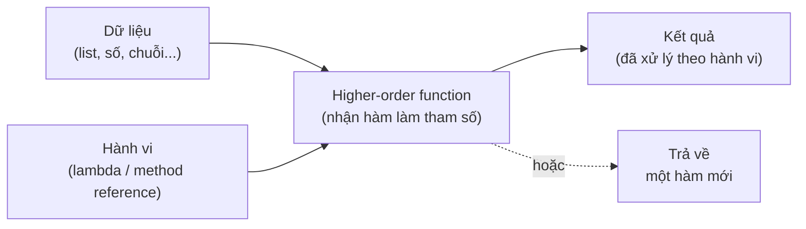

# 1. Hàm bậc cao (High Order Functions)

Hàm bậc cao (high order function) là hàm nhận một hàm khác làm tham số hoặc trả về một hàm. Nhờ đó ta truyền được "hành vi" (việc cần làm) chứ không chỉ dữ liệu, giúp code linh hoạt và tái sử dụng tốt hơn. Bài này giới thiệu cách dùng lambda và method reference để làm việc với hàm bậc cao trong Java; chi tiết nằm bên dưới.

---

:::note[Ghi nhớ nhanh]

- ⭐ **Hàm bậc cao** — hàm **nhận hàm khác làm tham số** hoặc **trả về một hàm**, giúp truyền "hành vi" chứ không chỉ dữ liệu.
- ⭐ **Trong Java hàm được biểu diễn qua lambda / functional interface** — luôn gắn với một interface như `Predicate`, `Function`, `Consumer`, `Supplier`.
- **Truyền hành vi để tách logic** — giữ phần khung cố định (vòng lặp), chỉ truyền phần thay đổi (điều kiện) vào; nền tảng của `filter`/`map`/`reduce`.
- **Method reference (`::`)** — viết tắt của lambda chỉ gọi một phương thức; 4 loại: static, đối tượng cụ thể, đối tượng bất kỳ, và constructor (`Lớp::new`).
- **Phân biệt** — `method()` là **gọi hàm** ngay; `Lớp::method` là **truyền hành vi** để gọi sau (không có `()`).

:::

---

## Mục lục

- [Vì sao có higher-order function?](#vì-sao-có-higher-order-function)
- [Hàm bậc cao là gì?](#hàm-bậc-cao-là-gì)
- [Ví dụ đời thường dễ hiểu](#ví-dụ-đời-thường-dễ-hiểu)
- [Truyền hành vi vào một phương thức](#truyền-hành-vi-vào-một-phương-thức)
- [Phương thức trả về một hàm](#phương-thức-trả-về-một-hàm)
- [Method Reference (toán tử ::)](#method-reference-toán-tử-)
- [Lỗi thường gặp](#lỗi-thường-gặp)
- [Tóm tắt](#tóm-tắt)

---

## Vì sao có higher-order function?

**Vấn đề:** Ta có nhiều đoạn code gần như giống hệt nhau, chỉ **khác đúng một hành vi ở giữa**. Ví dụ lọc danh sách: cùng một vòng lặp, chỉ khác điều kiện lọc. Mỗi lần cần lọc theo tiêu chí mới, ta lại copy-paste vòng lặp rồi sửa điều kiện, gây trùng lặp khó bảo trì.

```java
import java.util.ArrayList;
import java.util.List;

public class WithoutHof {

    // Lọc số chẵn
    static List<Integer> filterEven(List<Integer> numbers) {
        List<Integer> result = new ArrayList<>();
        for (int n : numbers) {
            if (n % 2 == 0) { // chỉ phần điều kiện này thay đổi
                result.add(n);
            }
        }
        return result;
    }

    // Lọc số dương - GẦN NHƯ GIỐNG HỆT, chỉ khác điều kiện
    static List<Integer> filterPositive(List<Integer> numbers) {
        List<Integer> result = new ArrayList<>();
        for (int n : numbers) {
            if (n > 0) { // chỉ phần điều kiện này thay đổi
                result.add(n);
            }
        }
        return result;
    }
    // Cần lọc kiểu mới? Lại copy-paste vòng lặp rồi sửa điều kiện...
}
```

**Giải pháp:** Dùng **higher-order function** — hàm **nhận hàm khác làm tham số** (hoặc **trả về một hàm**), nhờ lambda và functional interface. Ta tách phần "khung" cố định (vòng lặp) khỏi phần "hành vi" thay đổi (điều kiện lọc), rồi **truyền hành vi vào** để tái sử dụng tối đa. Đây cũng là nền tảng của Stream (`filter`/`map` đều nhận hàm).

```java
import java.util.ArrayList;
import java.util.List;
import java.util.function.Predicate;

public class WithHof {

    // MỘT hàm bậc cao duy nhất: "condition" là hành vi lọc được truyền vào
    // Predicate<Integer>: nhận 1 số, trả về true/false
    static List<Integer> filter(List<Integer> numbers, Predicate<Integer> condition) {
        List<Integer> result = new ArrayList<>();
        for (int n : numbers) {
            if (condition.test(n)) { // hành vi do người gọi quyết định
                result.add(n);
            }
        }
        return result;
    }

    public static void main(String[] args) {
        List<Integer> nums = List.of(-2, -1, 0, 1, 2, 3);

        System.out.println(filter(nums, n -> n % 2 == 0)); // [-2, 0, 2]
        System.out.println(filter(nums, n -> n > 0));      // [1, 2, 3]
        // Tiêu chí mới chỉ là một lambda, không cần copy-paste vòng lặp nữa
    }
}
```

:::tip[Dùng thực tế]

- **`filter`/`map`/`reduce` của Stream** nhận lambda để quyết định cách lọc, biến đổi, gộp dữ liệu.
- **Truyền callback/strategy:** đưa "việc cần làm sau khi xong" hoặc thuật toán cụ thể vào một phương thức chung.
- **Tạo hàm cấu hình sẵn:** hàm trả về một hàm khác đã "nhớ" tham số (vd hàm nhân với hệ số cho trước).
- **Tách logic chung khỏi hành vi riêng:** giữ phần khung cố định một chỗ, chỉ truyền phần thay đổi vào.

:::

---

## Hàm bậc cao là gì?

**Hàm bậc cao (High Order Function - hàm nhận hoặc trả về hàm khác)** là một hàm thỏa mãn ít nhất một trong hai điều kiện sau:

1. **Nhận một hàm khác làm tham số** (truyền hành vi vào).
2. **Trả về một hàm** làm kết quả.

Trong Java, vì "hàm" không phải là một thứ độc lập như trong JavaScript, ta biểu diễn hàm bằng các **đối tượng lambda (biểu thức hàm ngắn gọn)** hoặc **functional interface (giao diện hàm - interface có đúng 1 phương thức trừu tượng)**.

Hãy nhớ ý chính: thay vì truyền **dữ liệu** (số, chuỗi), hàm bậc cao cho phép ta truyền **hành vi** (việc cần làm).

Sơ đồ dưới đây minh hoạ luồng dữ liệu và hành vi đi qua một hàm bậc cao:



---

## Ví dụ đời thường dễ hiểu

Hãy tưởng tượng bạn thuê một người giúp việc và đưa cho họ một **tờ ghi chú công việc**:

- Tờ ghi chú "hãy lau nhà" → một hành vi.
- Tờ ghi chú "hãy rửa bát" → một hành vi khác.

Người giúp việc (phương thức bậc cao) không cần biết trước phải làm gì. Bạn **đưa hành vi vào** qua tờ ghi chú. Cùng một người giúp việc, đưa tờ khác là làm việc khác.

Trong lập trình, "tờ ghi chú" chính là **lambda** hoặc **method reference** mà ta truyền vào.

---

## Truyền hành vi vào một phương thức

Ví dụ: ta muốn xử lý từng phần tử trong danh sách, nhưng **cách xử lý** sẽ do người gọi quyết định.

```java
import java.util.List;
import java.util.function.Consumer;

public class HighOrderDemo {

    // Đây là HÀM BẬC CAO: tham số "action" chính là một HÀNH VI được truyền vào
    // Consumer<String> nghĩa là: nhận 1 chuỗi, không trả về gì
    static void forEachItem(List<String> items, Consumer<String> action) {
        for (String item : items) {
            action.accept(item); // Thực thi hành vi được truyền vào với từng phần tử
        }
    }

    public static void main(String[] args) {
        List<String> names = List.of("An", "Bình", "Cường");

        // Lần 1: truyền hành vi "in hoa rồi in ra"
        forEachItem(names, name -> System.out.println(name.toUpperCase()));

        // Lần 2: truyền hành vi khác "in độ dài tên"
        forEachItem(names, name -> System.out.println(name + " có " + name.length() + " ký tự"));
    }
}
```

Cùng một phương thức `forEachItem`, nhưng ta đưa hai "tờ ghi chú" khác nhau nên kết quả khác nhau. Đó là sức mạnh của việc truyền hành vi.

Một ví dụ khác: viết hàm tính toán mà phép tính do người gọi quyết định.

```java
import java.util.function.IntBinaryOperator;

public class Calculator {

    // Hàm bậc cao: "operation" là hành vi tính toán giữa hai số
    // IntBinaryOperator: nhận 2 số int, trả về 1 số int
    static int compute(int a, int b, IntBinaryOperator operation) {
        return operation.applyAsInt(a, b);
    }

    public static void main(String[] args) {
        // Truyền hành vi cộng
        System.out.println(compute(5, 3, (x, y) -> x + y)); // In ra 8

        // Truyền hành vi nhân
        System.out.println(compute(5, 3, (x, y) -> x * y)); // In ra 15

        // Truyền hành vi lấy số lớn hơn
        System.out.println(compute(5, 3, Math::max)); // In ra 5
    }
}
```

---

## Phương thức trả về một hàm

Hàm bậc cao cũng có thể **tạo ra và trả về một hàm mới**. Hãy nghĩ đó như một "nhà máy sản xuất hành vi".

```java
import java.util.function.Function;

public class FunctionFactory {

    // Hàm bậc cao: trả về MỘT HÀM nhân với "factor"
    // Function<Integer, Integer>: nhận 1 số nguyên, trả về 1 số nguyên
    static Function<Integer, Integer> multiplier(int factor) {
        // Trả về một lambda "nhớ" giá trị factor
        return number -> number * factor;
    }

    public static void main(String[] args) {
        // Tạo hàm nhân đôi
        Function<Integer, Integer> doubleIt = multiplier(2);
        // Tạo hàm nhân ba
        Function<Integer, Integer> tripleIt = multiplier(3);

        System.out.println(doubleIt.apply(10)); // In ra 20
        System.out.println(tripleIt.apply(10)); // In ra 30
    }
}
```

Ở đây `multiplier(2)` trả về một hàm "biết cách nhân đôi". Ta lưu hàm đó vào biến `doubleIt` rồi gọi lại bất cứ lúc nào.

---

## Method Reference (toán tử ::)

**Method Reference (tham chiếu phương thức)** là cách viết tắt của lambda khi lambda đó **chỉ gọi đúng một phương thức có sẵn**. Cú pháp dùng dấu hai chấm đôi `::`.

So sánh hai cách viết tương đương:

```java
import java.util.List;

public class MethodRefDemo {
    public static void main(String[] args) {
        List<String> names = List.of("An", "Bình", "Cường");

        // Cách 1: dùng lambda
        names.forEach(name -> System.out.println(name));

        // Cách 2: dùng method reference - ngắn gọn hơn, ý nghĩa giống hệt
        names.forEach(System.out::println);
    }
}
```

Có 4 loại method reference chính:

```java
import java.util.function.Function;
import java.util.function.Supplier;

public class FourKindsOfMethodRef {

    static int squareIt(int x) {
        return x * x;
    }

    public static void main(String[] args) {
        // 1. Tham chiếu phương thức TĨNH (static):  Lớp::tênPhươngThức
        Function<Integer, Integer> square = FourKindsOfMethodRef::squareIt;
        System.out.println(square.apply(4)); // In ra 16

        // 2. Tham chiếu phương thức trên 1 ĐỐI TƯỢNG cụ thể: đốiTượng::tênPhươngThức
        String greeting = "Xin chào";
        Supplier<Integer> lengthGetter = greeting::length;
        System.out.println(lengthGetter.get()); // In ra 8

        // 3. Tham chiếu phương thức trên ĐỐI TƯỢNG BẤT KỲ của 1 lớp: Lớp::tênPhươngThức
        Function<String, String> upper = String::toUpperCase;
        System.out.println(upper.apply("hello")); // In ra HELLO

        // 4. Tham chiếu HÀM TẠO (constructor): Lớp::new
        Supplier<StringBuilder> builderFactory = StringBuilder::new;
        StringBuilder sb = builderFactory.get();
        sb.append("Tạo mới bằng constructor reference");
        System.out.println(sb); // In ra dòng trên
    }
}
```

Mẹo nhớ: nếu lambda của bạn có dạng `x -> someMethod(x)` thì gần như chắc chắn có thể đổi thành method reference cho gọn.

---

## Lỗi thường gặp

1. **Nhầm lẫn giữa "gọi hàm" và "truyền hàm".** `System.out.println(name)` là **gọi** ngay lập tức. `System.out::println` là **truyền** hành vi để gọi sau. Khi truyền vào hàm bậc cao, ta cần dạng "truyền", không thêm dấu ngoặc `()`.

2. **Quên rằng lambda chỉ dùng được với functional interface.** Nếu interface có nhiều hơn 1 phương thức trừu tượng thì không thể dùng lambda/method reference.

3. **Dùng method reference khi chữ ký không khớp.** Số lượng và kiểu tham số của phương thức phải khớp với functional interface đích, nếu không sẽ báo lỗi biên dịch.

```java
// SAI: thêm () biến nó thành lời gọi ngay, trả về void chứ không phải hành vi
// names.forEach(System.out.println()); // Lỗi biên dịch

// ĐÚNG: truyền hành vi
// names.forEach(System.out::println);
```

4. **Tưởng Java có "hàm tự do" như JavaScript.** Trong Java, mọi hàm truyền đi đều phải "đội lốt" một functional interface. Hãy luôn xác định interface phù hợp (`Function`, `Consumer`, `Supplier`, `Predicate`...).

---

## Tóm tắt

- **Hàm bậc cao** là hàm **nhận hàm khác làm tham số** hoặc **trả về một hàm**.
- Nhờ đó ta truyền được **hành vi** (việc cần làm) chứ không chỉ dữ liệu, giúp code linh hoạt và tái sử dụng tốt.
- Trong Java, hàm được biểu diễn bằng **lambda** hoặc **method reference**, luôn gắn với một **functional interface**.
- **Method reference** (`::`) là cách viết tắt của lambda khi chỉ gọi đúng một phương thức có sẵn, gồm 4 loại: static, đối tượng cụ thể, đối tượng bất kỳ, và constructor.
- Phân biệt rõ: **gọi hàm** (`method()`) khác **truyền hành vi** (`Class::method`).
