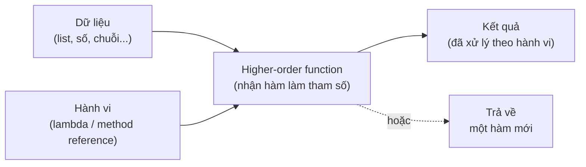

# 1. Hàm bậc cao (High Order Functions)

Hàm bậc cao (high order function) là hàm nhận một hàm khác làm tham số hoặc trả về một hàm. Nhờ đó ta truyền được "hành vi" (việc cần làm) chứ không chỉ dữ liệu, giúp code linh hoạt và tái sử dụng tốt hơn. Bài này giới thiệu cách dùng lambda và method reference để làm việc với hàm bậc cao trong Java; chi tiết nằm bên dưới.

[](pathname:///img/java/high-order-functions.webp)

---

:::note[Ghi nhớ nhanh]

- ⭐ **Hàm bậc cao** — hàm **nhận hàm khác làm tham số** hoặc **trả về một hàm**, giúp truyền "hành vi" chứ không chỉ dữ liệu.
- ⭐ **Trong Java hàm được biểu diễn qua lambda / functional interface** — luôn gắn với một interface như `Predicate`, `Function`, `Consumer`, `Supplier`.
- **Truyền hành vi để tách logic** — giữ phần khung cố định (vòng lặp), chỉ truyền phần thay đổi (điều kiện) vào; nền tảng của `filter`/`map`/`reduce`.
- **Method reference (`::`)** — viết tắt của lambda chỉ gọi một phương thức; 4 loại: static, đối tượng cụ thể, đối tượng bất kỳ, và constructor (`Lớp::new`).
- **Phân biệt** — `method()` là **gọi hàm** ngay; `Lớp::method` là **truyền hành vi** để gọi sau (không có `()`).

:::

---

## Mục lục

- [Vì sao có higher-order function?](#vì-sao-có-higher-order-function)
- [Hàm bậc cao là gì?](#hàm-bậc-cao-là-gì)
- [Ví dụ đời thường dễ hiểu](#ví-dụ-đời-thường-dễ-hiểu)
- [Truyền hành vi vào một phương thức](#truyền-hành-vi-vào-một-phương-thức)
- [Phương thức trả về một hàm](#phương-thức-trả-về-một-hàm)
- [Method Reference (toán tử ::)](#method-reference-toán-tử-)
- [Lỗi thường gặp](#lỗi-thường-gặp)
- [Tóm tắt](#tóm-tắt)
- [Câu hỏi phỏng vấn](#câu-hỏi-phỏng-vấn)

---

## Vì sao có higher-order function?

**Vấn đề:** Ta có nhiều đoạn code gần như giống hệt nhau, chỉ **khác đúng một hành vi ở giữa**. Ví dụ lọc danh sách: cùng một vòng lặp, chỉ khác điều kiện lọc. Mỗi lần cần lọc theo tiêu chí mới, ta lại copy-paste vòng lặp rồi sửa điều kiện, gây trùng lặp khó bảo trì.

```java
import java.util.ArrayList;
import java.util.List;

public class WithoutHof {

    // Lọc số chẵn
    static List<Integer> filterEven(List<Integer> numbers) {
        List<Integer> result = new ArrayList<>();
        for (int n : numbers) {
            if (n % 2 == 0) { // chỉ phần điều kiện này thay đổi
                result.add(n);
            }
        }
        return result;
    }

    // Lọc số dương - GẦN NHƯ GIỐNG HỆT, chỉ khác điều kiện
    static List<Integer> filterPositive(List<Integer> numbers) {
        List<Integer> result = new ArrayList<>();
        for (int n : numbers) {
            if (n > 0) { // chỉ phần điều kiện này thay đổi
                result.add(n);
            }
        }
        return result;
    }
    // Cần lọc kiểu mới? Lại copy-paste vòng lặp rồi sửa điều kiện...
}
```

**Giải pháp:** Dùng **higher-order function** — hàm **nhận hàm khác làm tham số** (hoặc **trả về một hàm**), nhờ lambda và functional interface. Ta tách phần "khung" cố định (vòng lặp) khỏi phần "hành vi" thay đổi (điều kiện lọc), rồi **truyền hành vi vào** để tái sử dụng tối đa. Đây cũng là nền tảng của Stream (`filter`/`map` đều nhận hàm).

```java
import java.util.ArrayList;
import java.util.List;
import java.util.function.Predicate;

public class WithHof {

    // MỘT hàm bậc cao duy nhất: "condition" là hành vi lọc được truyền vào
    // Predicate<Integer>: nhận 1 số, trả về true/false
    static List<Integer> filter(List<Integer> numbers, Predicate<Integer> condition) {
        List<Integer> result = new ArrayList<>();
        for (int n : numbers) {
            if (condition.test(n)) { // hành vi do người gọi quyết định
                result.add(n);
            }
        }
        return result;
    }

    public static void main(String[] args) {
        List<Integer> nums = List.of(-2, -1, 0, 1, 2, 3);

        System.out.println(filter(nums, n -> n % 2 == 0)); // [-2, 0, 2]
        System.out.println(filter(nums, n -> n > 0));      // [1, 2, 3]
        // Tiêu chí mới chỉ là một lambda, không cần copy-paste vòng lặp nữa
    }
}
```

:::tip[Dùng thực tế]

- **`filter`/`map`/`reduce` của Stream** nhận lambda để quyết định cách lọc, biến đổi, gộp dữ liệu.
- **Truyền callback/strategy:** đưa "việc cần làm sau khi xong" hoặc thuật toán cụ thể vào một phương thức chung.
- **Tạo hàm cấu hình sẵn:** hàm trả về một hàm khác đã "nhớ" tham số (vd hàm nhân với hệ số cho trước).
- **Tách logic chung khỏi hành vi riêng:** giữ phần khung cố định một chỗ, chỉ truyền phần thay đổi vào.

:::

---

## Hàm bậc cao là gì?

**Hàm bậc cao (High Order Function - hàm nhận hoặc trả về hàm khác)** là một hàm thỏa mãn ít nhất một trong hai điều kiện sau:

1. **Nhận một hàm khác làm tham số** (truyền hành vi vào).
2. **Trả về một hàm** làm kết quả.

Trong Java, vì "hàm" không phải là một thứ độc lập như trong JavaScript, ta biểu diễn hàm bằng các **đối tượng lambda (biểu thức hàm ngắn gọn)** hoặc **functional interface (giao diện hàm - interface có đúng 1 phương thức trừu tượng)**.

Hãy nhớ ý chính: thay vì truyền **dữ liệu** (số, chuỗi), hàm bậc cao cho phép ta truyền **hành vi** (việc cần làm).

Sơ đồ dưới đây minh hoạ luồng dữ liệu và hành vi đi qua một hàm bậc cao:


```mermaid
flowchart LR
    A["Dữ liệu<br/>(list, số, chuỗi...)"] --> C
    B["Hành vi<br/>(lambda / method reference)"] --> C
    C["Higher-order function<br/>(nhận hàm làm tham số)"] --> D["Kết quả<br/>(đã xử lý theo hành vi)"]
    C -. hoặc .-> E["Trả về<br/>một hàm mới"]
```

---

## Ví dụ đời thường dễ hiểu

Hãy tưởng tượng bạn thuê một người giúp việc và đưa cho họ một **tờ ghi chú công việc**:

- Tờ ghi chú "hãy lau nhà" → một hành vi.
- Tờ ghi chú "hãy rửa bát" → một hành vi khác.

Người giúp việc (phương thức bậc cao) không cần biết trước phải làm gì. Bạn **đưa hành vi vào** qua tờ ghi chú. Cùng một người giúp việc, đưa tờ khác là làm việc khác.

Trong lập trình, "tờ ghi chú" chính là **lambda** hoặc **method reference** mà ta truyền vào.

---

## Truyền hành vi vào một phương thức

Ví dụ: ta muốn xử lý từng phần tử trong danh sách, nhưng **cách xử lý** sẽ do người gọi quyết định.

```java
import java.util.List;
import java.util.function.Consumer;

public class HighOrderDemo {

    // Đây là HÀM BẬC CAO: tham số "action" chính là một HÀNH VI được truyền vào
    // Consumer<String> nghĩa là: nhận 1 chuỗi, không trả về gì
    static void forEachItem(List<String> items, Consumer<String> action) {
        for (String item : items) {
            action.accept(item); // Thực thi hành vi được truyền vào với từng phần tử
        }
    }

    public static void main(String[] args) {
        List<String> names = List.of("An", "Bình", "Cường");

        // Lần 1: truyền hành vi "in hoa rồi in ra"
        forEachItem(names, name -> System.out.println(name.toUpperCase()));

        // Lần 2: truyền hành vi khác "in độ dài tên"
        forEachItem(names, name -> System.out.println(name + " có " + name.length() + " ký tự"));
    }
}
```

Cùng một phương thức `forEachItem`, nhưng ta đưa hai "tờ ghi chú" khác nhau nên kết quả khác nhau. Đó là sức mạnh của việc truyền hành vi.

Một ví dụ khác: viết hàm tính toán mà phép tính do người gọi quyết định.

```java
import java.util.function.IntBinaryOperator;

public class Calculator {

    // Hàm bậc cao: "operation" là hành vi tính toán giữa hai số
    // IntBinaryOperator: nhận 2 số int, trả về 1 số int
    static int compute(int a, int b, IntBinaryOperator operation) {
        return operation.applyAsInt(a, b);
    }

    public static void main(String[] args) {
        // Truyền hành vi cộng
        System.out.println(compute(5, 3, (x, y) -> x + y)); // In ra 8

        // Truyền hành vi nhân
        System.out.println(compute(5, 3, (x, y) -> x * y)); // In ra 15

        // Truyền hành vi lấy số lớn hơn
        System.out.println(compute(5, 3, Math::max)); // In ra 5
    }
}
```

---

## Phương thức trả về một hàm

Hàm bậc cao cũng có thể **tạo ra và trả về một hàm mới**. Hãy nghĩ đó như một "nhà máy sản xuất hành vi".

```java
import java.util.function.Function;

public class FunctionFactory {

    // Hàm bậc cao: trả về MỘT HÀM nhân với "factor"
    // Function<Integer, Integer>: nhận 1 số nguyên, trả về 1 số nguyên
    static Function<Integer, Integer> multiplier(int factor) {
        // Trả về một lambda "nhớ" giá trị factor
        return number -> number * factor;
    }

    public static void main(String[] args) {
        // Tạo hàm nhân đôi
        Function<Integer, Integer> doubleIt = multiplier(2);
        // Tạo hàm nhân ba
        Function<Integer, Integer> tripleIt = multiplier(3);

        System.out.println(doubleIt.apply(10)); // In ra 20
        System.out.println(tripleIt.apply(10)); // In ra 30
    }
}
```

Ở đây `multiplier(2)` trả về một hàm "biết cách nhân đôi". Ta lưu hàm đó vào biến `doubleIt` rồi gọi lại bất cứ lúc nào.

---

## Method Reference (toán tử ::)

**Method Reference (tham chiếu phương thức)** là cách viết tắt của lambda khi lambda đó **chỉ gọi đúng một phương thức có sẵn**. Cú pháp dùng dấu hai chấm đôi `::`.

So sánh hai cách viết tương đương:

```java
import java.util.List;

public class MethodRefDemo {
    public static void main(String[] args) {
        List<String> names = List.of("An", "Bình", "Cường");

        // Cách 1: dùng lambda
        names.forEach(name -> System.out.println(name));

        // Cách 2: dùng method reference - ngắn gọn hơn, ý nghĩa giống hệt
        names.forEach(System.out::println);
    }
}
```

Có 4 loại method reference chính:

```java
import java.util.function.Function;
import java.util.function.Supplier;

public class FourKindsOfMethodRef {

    static int squareIt(int x) {
        return x * x;
    }

    public static void main(String[] args) {
        // 1. Tham chiếu phương thức TĨNH (static):  Lớp::tênPhươngThức
        Function<Integer, Integer> square = FourKindsOfMethodRef::squareIt;
        System.out.println(square.apply(4)); // In ra 16

        // 2. Tham chiếu phương thức trên 1 ĐỐI TƯỢNG cụ thể: đốiTượng::tênPhươngThức
        String greeting = "Xin chào";
        Supplier<Integer> lengthGetter = greeting::length;
        System.out.println(lengthGetter.get()); // In ra 8

        // 3. Tham chiếu phương thức trên ĐỐI TƯỢNG BẤT KỲ của 1 lớp: Lớp::tênPhươngThức
        Function<String, String> upper = String::toUpperCase;
        System.out.println(upper.apply("hello")); // In ra HELLO

        // 4. Tham chiếu HÀM TẠO (constructor): Lớp::new
        Supplier<StringBuilder> builderFactory = StringBuilder::new;
        StringBuilder sb = builderFactory.get();
        sb.append("Tạo mới bằng constructor reference");
        System.out.println(sb); // In ra dòng trên
    }
}
```

Mẹo nhớ: nếu lambda của bạn có dạng `x -> someMethod(x)` thì gần như chắc chắn có thể đổi thành method reference cho gọn.

---

## Lỗi thường gặp

1. **Nhầm lẫn giữa "gọi hàm" và "truyền hàm".** `System.out.println(name)` là **gọi** ngay lập tức. `System.out::println` là **truyền** hành vi để gọi sau. Khi truyền vào hàm bậc cao, ta cần dạng "truyền", không thêm dấu ngoặc `()`.

2. **Quên rằng lambda chỉ dùng được với functional interface.** Nếu interface có nhiều hơn 1 phương thức trừu tượng thì không thể dùng lambda/method reference.

3. **Dùng method reference khi chữ ký không khớp.** Số lượng và kiểu tham số của phương thức phải khớp với functional interface đích, nếu không sẽ báo lỗi biên dịch.

```java
// SAI: thêm () biến nó thành lời gọi ngay, trả về void chứ không phải hành vi
// names.forEach(System.out.println()); // Lỗi biên dịch

// ĐÚNG: truyền hành vi
// names.forEach(System.out::println);
```

4. **Tưởng Java có "hàm tự do" như JavaScript.** Trong Java, mọi hàm truyền đi đều phải "đội lốt" một functional interface. Hãy luôn xác định interface phù hợp (`Function`, `Consumer`, `Supplier`, `Predicate`...).

---

## Tóm tắt

- **Hàm bậc cao** là hàm **nhận hàm khác làm tham số** hoặc **trả về một hàm**.
- Nhờ đó ta truyền được **hành vi** (việc cần làm) chứ không chỉ dữ liệu, giúp code linh hoạt và tái sử dụng tốt.
- Trong Java, hàm được biểu diễn bằng **lambda** hoặc **method reference**, luôn gắn với một **functional interface**.
- **Method reference** (`::`) là cách viết tắt của lambda khi chỉ gọi đúng một phương thức có sẵn, gồm 4 loại: static, đối tượng cụ thể, đối tượng bất kỳ, và constructor.
- Phân biệt rõ: **gọi hàm** (`method()`) khác **truyền hành vi** (`Class::method`).

---

## Câu hỏi phỏng vấn

Những câu thường gặp về chủ đề này. Tự trả lời trước, rồi bấm **Xem đáp án** để đối chiếu.

**1. Hàm bậc cao (higher-order function) là gì? Cho ví dụ trong Java Standard Library.**

<details className="qa">
<summary>Xem đáp án</summary>

Hàm bậc cao là hàm thỏa mãn ít nhất một trong hai điều kiện:

1. **Nhận một hàm khác làm tham số**.
2. **Trả về một hàm** làm kết quả.

Ví dụ tiêu biểu trong Java: `list.stream().filter(predicate)`, `stream.map(function)`, `list.forEach(consumer)` — tất cả đều nhận một hàm (dưới dạng lambda hoặc method reference) làm tham số. Đây chính là nền tảng của toàn bộ Stream API.

</details>

**2. Vì sao Java không có khái niệm "hàm tự do" (hàm độc lập không thuộc class nào) như JavaScript hay Python?**

<details className="qa">
<summary>Xem đáp án</summary>

Java là ngôn ngữ **hướng đối tượng thuần túy (pure OOP)** ở cấp độ tổ chức code — mọi đoạn code thực thi phải nằm trong một phương thức của một class. Không có khái niệm hàm đứng độc lập ngoài class.

Để mô phỏng "truyền hàm như dữ liệu" (first-class function), Java dùng cơ chế:

- **Functional interface**: một interface chỉ có đúng một phương thức trừu tượng (abstract method), đóng vai trò làm "khuôn" (khai báo chữ ký) cho hàm.
- **Lambda expression** hoặc **method reference**: là cách viết ngắn gọn để tạo ra một **object ẩn danh implement functional interface đó** ngay tại chỗ.

Vậy về bản chất, một "hàm" truyền đi trong Java vẫn luôn là một **object**, chỉ là được viết bằng cú pháp gọn hơn so với việc viết hẳn một anonymous class.

</details>

**3. `Predicate`, `Function`, `Consumer`, `Supplier` khác nhau thế nào về số lượng tham số và giá trị trả về?**

<details className="qa">
<summary>Xem đáp án</summary>

| Interface | Phương thức trừu tượng | Nhận vào | Trả về |
|-----------|--------------------------|----------|--------|
| `Predicate<T>` | `boolean test(T t)` | 1 giá trị | `boolean` |
| `Function<T, R>` | `R apply(T t)` | 1 giá trị | 1 giá trị (kiểu khác) |
| `Consumer<T>` | `void accept(T t)` | 1 giá trị | không trả gì (`void`) |
| `Supplier<T>` | `T get()` | không nhận gì | 1 giá trị |

- Mẹo nhớ theo tên tiếng Anh: `Predicate` (mệnh đề đúng/sai), `Function` (hàm biến đổi), `Consumer` (tiêu thụ — chỉ nhận vào để xử lý, không trả ra), `Supplier` (nhà cung cấp — chỉ tạo ra giá trị, không cần đầu vào).

</details>

**4. Method reference (`::`) là gì? Vì sao `System.out::println` khác với `System.out.println()`?**

<details className="qa">
<summary>Xem đáp án</summary>

**Method reference** là cách viết tắt của một lambda khi lambda đó **chỉ đơn thuần gọi lại đúng một phương thức có sẵn**, không có logic gì thêm.

```java
names.forEach(System.out::println); // ĐÚNG: truyền hành vi, gọi sau
// names.forEach(System.out.println()); // SAI: gọi ngay, biên dịch lỗi vì println() trả về void
```

- `System.out::println` không gọi phương thức ngay — nó tạo ra một **object implement `Consumer<String>`** mà bên trong, khi `accept(x)` được gọi, sẽ thực thi `System.out.println(x)`.
- `System.out.println()` là **gọi hàm ngay lập tức**, trả về `void` — không có ý nghĩa "hành vi để truyền đi", nên không thể dùng làm tham số cho `forEach`.

</details>

**5. Liệt kê 4 loại method reference và cho ví dụ mỗi loại.**

<details className="qa">
<summary>Xem đáp án</summary>

```java
// 1. Static method reference: Lớp::phươngThứcTĩnh
Function<Integer, Integer> square = Test::squareIt;

// 2. Bound instance method reference: đốiTượngCụThể::phươngThức
String s = "Xin chào";
Supplier<Integer> lengthGetter = s::length;

// 3. Unbound instance method reference: Lớp::phươngThức (đối tượng bất kỳ)
Function<String, String> upper = String::toUpperCase;
// tương đương lambda: (str) -> str.toUpperCase()

// 4. Constructor reference: Lớp::new
Supplier<StringBuilder> factory = StringBuilder::new;
```

- Điểm khác biệt then chốt giữa loại 2 và loại 3: loại 2 lambda tương đương `() -> s.length()` (đối tượng đã cố định), còn loại 3 lambda tương đương `(str) -> str.toUpperCase()` (đối tượng là tham số truyền vào lúc gọi).

</details>

**6. Vì sao lambda chỉ dùng được với functional interface (interface có đúng một phương thức trừu tượng)?**

<details className="qa">
<summary>Xem đáp án</summary>

Một biểu thức lambda về bản chất chỉ cung cấp **một khối code duy nhất** (thân hàm), không có tên phương thức đi kèm. Để trình biên dịch biết lambda đó đang cài đặt (implement) **phương thức trừu tượng nào**, interface đích phải có **chính xác một phương thức trừu tượng** — không thừa, không thiếu — để không bị mơ hồ (ambiguous) về việc lambda đang định nghĩa hành vi cho phương thức nào.

- Interface có 2+ phương thức trừu tượng: không thể dùng lambda (phải viết hẳn class hoặc anonymous class implement đầy đủ).
- Interface chỉ có 1 phương thức trừu tượng nhưng có thêm `default`/`static` method: **vẫn dùng được lambda bình thường**, vì các phương thức `default`/`static` đã có sẵn cài đặt, không cần lambda cung cấp.
- Annotation `@FunctionalInterface` (tùy chọn) giúp trình biên dịch **kiểm tra và báo lỗi sớm** nếu ai đó vô tình thêm phương thức trừu tượng thứ hai vào interface, phá vỡ tính "functional".

</details>

**7. Đoạn code sau có biên dịch được không? Giải thích.**

```java
interface KhongPhaiFunctional {
    void a();
    void b();
}

// ...
KhongPhaiFunctional x = () -> System.out.println("test");
```

<details className="qa">
<summary>Xem đáp án</summary>

**Không biên dịch được.** Lỗi: "target type of a lambda conversion must be an interface".

- `KhongPhaiFunctional` có **hai** phương thức trừu tượng (`a()` và `b()`), không phải là functional interface.
- Lambda `() -> System.out.println("test")` chỉ cung cấp **một** khối thân hàm, nhưng trình biên dịch không biết nó nên gán cho `a()` hay `b()` — mơ hồ, nên bị từ chối ngay lúc biên dịch.
- Cách sửa: nếu thật sự cần cài đặt cả hai phương thức, phải dùng anonymous class (`new KhongPhaiFunctional() { ... }`) thay vì lambda.

</details>

**8. Vì sao "trả về một hàm" (như ví dụ `multiplier(int factor)`) lại hữu ích? Nêu khái niệm closure liên quan.**

<details className="qa">
<summary>Xem đáp án</summary>

```java
static Function<Integer, Integer> multiplier(int factor) {
    return number -> number * factor; // lambda "nhớ" factor
}

Function<Integer, Integer> doubleIt = multiplier(2);
System.out.println(doubleIt.apply(10)); // 20
```

- Đây là ví dụ của **closure** (bao đóng): lambda trả về "ghi nhớ" giá trị của biến `factor` tại thời điểm nó được tạo ra, dù `multiplier()` đã kết thúc thực thi từ lâu.
- Hữu ích để tạo ra các **hàm đã cấu hình sẵn (pre-configured/curried function)** — thay vì phải truyền `factor` mỗi lần gọi, bạn tạo sẵn một hàm `doubleIt` đã "khóa cứng" `factor = 2`, dùng lại nhiều lần mà không cần lặp lại tham số.
- Lưu ý ràng buộc trong Java: biến ngoài (`factor`) mà lambda tham chiếu tới phải là **effectively final** (không bị gán lại giá trị sau khi khai báo) — nếu không sẽ bị lỗi biên dịch.

</details>

**9. `IntBinaryOperator` khác `BiFunction<Integer, Integer, Integer>` ở điểm nào? Vì sao Java cung cấp thêm các interface chuyên biệt cho kiểu nguyên thủy?**

<details className="qa">
<summary>Xem đáp án</summary>

- Cả hai đều nhận 2 tham số `int`/`Integer` và trả về `int`/`Integer`, về mặt logic tương đương nhau.
- `BiFunction<Integer, Integer, Integer>` dùng **generic**, nên tham số/kết quả thực chất là `Integer` (kiểu tham chiếu) — mỗi lần gọi phải **autobox** `int` thành `Integer` và **unbox** ngược lại, tốn chi phí tạo object thừa.
- `IntBinaryOperator` (và các interface chuyên biệt khác như `IntPredicate`, `ToIntFunction`, `IntConsumer`...) làm việc **trực tiếp với kiểu nguyên thủy `int`**, tránh hoàn toàn chi phí autoboxing/unboxing — hiệu năng tốt hơn đáng kể khi xử lý số lượng lớn phần tử (ví dụ trong `IntStream`).
- Đây là lý do `java.util.function` cung cấp cả phiên bản generic lẫn phiên bản chuyên biệt hóa cho từng kiểu nguyên thủy phổ biến (`int`, `long`, `double`).

</details>

**10. Nêu một ví dụ thực tế trong thiết kế phần mềm mà "truyền hành vi" (Strategy Pattern) qua hàm bậc cao thay thế cho việc viết nhiều class con.**

<details className="qa">
<summary>Xem đáp án</summary>

Trước Java 8, để có nhiều "chiến lược" (strategy) khác nhau, người ta thường phải định nghĩa một interface rồi viết **nhiều class implement** nó (ví dụ `SapXepTangDan`, `SapXepGiamDan`), rồi truyền instance của class tương ứng vào.

```java
// Trước Java 8: phải viết hẳn class hoặc anonymous class
list.sort(new Comparator<Integer>() {
    @Override
    public int compare(Integer a, Integer b) {
        return b - a; // giảm dần
    }
});

// Từ Java 8: chỉ cần một lambda, không cần viết class riêng
list.sort((a, b) -> b - a);
```

- Hàm bậc cao cho phép thay thế **nhiều class chỉ khác nhau một hành vi nhỏ** bằng **một lambda truyền trực tiếp tại chỗ gọi**, giảm đáng kể số lượng class boilerplate (thừa thãi, lặp khuôn mẫu) trong codebase, đồng thời code đọc gần với ý định nghiệp vụ hơn (đọc `(a, b) -> b - a` hiểu ngay là "so sánh giảm dần").
- Đây chính là bản chất của **Strategy Design Pattern** được đơn giản hóa nhờ lambda: thay vì đóng gói hành vi trong một class riêng, ta truyền thẳng hành vi dưới dạng hàm.

</details>
