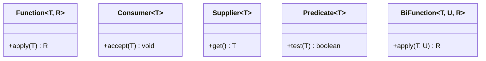

# 2. Functional Interfaces

Functional interface (giao diện hàm) là interface có đúng một phương thức trừu tượng, và đây chính là nền tảng để ta dùng được lambda cùng method reference. Java cung cấp sẵn nhiều functional interface hữu ích như `Function`, `Consumer`, `Supplier`, `Predicate`. Bài này giới thiệu functional interface là gì và các loại quan trọng nhất nên biết; chi tiết nằm bên dưới.

---

:::note[Ghi nhớ nhanh]

- ⭐ **Functional interface** — interface có **đúng một phương thức trừu tượng**, làm "kiểu" cho lambda và method reference.
- ⭐ **Năm loại có sẵn trong `java.util.function`** — `Function<T,R>` (biến đổi, `apply`), `Consumer<T>` (làm việc, `accept`), `Supplier<T>` (cung cấp, `get`), `Predicate<T>` (kiểm tra, `test`), `BiFunction<T,U,R>` (nhận 2).
- **`@FunctionalInterface`** — annotation không bắt buộc nhưng nên dùng; báo lỗi nếu lỡ thêm phương thức trừu tượng thứ hai.
- **Vẫn cho phép `default`/`static`** — chỉ tính phương thức **trừu tượng** khi xét functional interface.
- **Ưu tiên dùng lại bộ chuẩn** thay vì tự viết; nhớ ghi rõ generic (`Function<String, Integer>`) để giữ an toàn kiểu.

:::

---

## Mục lục

- [Vì sao có functional interface?](#vì-sao-có-functional-interface)
- [Functional Interface là gì?](#functional-interface-là-gì)
- [Ví dụ đời thường](#ví-dụ-đời-thường)
- [Annotation @FunctionalInterface](#annotation-functionalinterface)
- [Tự viết một Functional Interface](#tự-viết-một-functional-interface)
- [Các Functional Interface có sẵn quan trọng](#các-functional-interface-có-sẵn-quan-trọng)
  - [Function — nhận 1, trả về 1](#function--nhận-1-trả-về-1)
  - [Consumer — nhận 1, không trả về](#consumer--nhận-1-không-trả-về)
  - [Supplier — không nhận, trả về 1](#supplier--không-nhận-trả-về-1)
  - [Predicate — nhận 1, trả về true/false](#predicate--nhận-1-trả-về-truefalse)
  - [BiFunction — nhận 2, trả về 1](#bifunction--nhận-2-trả-về-1)
- [Lỗi thường gặp](#lỗi-thường-gặp)
- [Tóm tắt](#tóm-tắt)

---

## Vì sao có functional interface?

**Vấn đề:** Java là ngôn ngữ kiểu tĩnh — mọi thứ phải có **kiểu** để trình biên dịch kiểm tra và để truyền đi được. Nhưng lambda "chỉ là một hàm", vậy kiểu của nó là gì? Nếu mỗi nơi tự định nghĩa một interface callback riêng thì code trùng lặp khắp nơi.

```java
// Mỗi nơi tự định nghĩa một interface callback riêng -> trùng lặp
interface MyTransformer { String run(String s); }
interface MyChecker    { boolean check(Integer n); }
interface MyMaker      { String make(); }

// Lambda gán cho cái gì? Trình biên dịch cần một "kiểu" để kiểm tra:
MyTransformer t = s -> s.toUpperCase(); // kiểu phải khớp đúng 1 phương thức
```

**Giải pháp:** **Functional interface** — interface có **đúng một phương thức trừu tượng** (đánh dấu `@FunctionalInterface`) làm "kiểu" cho lambda. Lambda chính là cách cài đặt gọn của interface đó. Java cung cấp sẵn bộ chuẩn trong `java.util.function` (`Function`, `Predicate`, `Consumer`, `Supplier`...) để dùng lại khắp nơi, khỏi tự viết.

```java
import java.util.function.*;

// Dùng bộ chuẩn có sẵn, không cần tự định nghĩa interface
Function<String, String>  toUpper = s -> s.toUpperCase(); // biến đổi
Predicate<Integer>        isEven  = n -> n % 2 == 0;       // kiểm tra điều kiện
Supplier<String>          maker   = () -> "giá trị mới";   // cung cấp giá trị
```

:::tip[Dùng thực tế]
- **`Predicate`** cho điều kiện lọc: `list.stream().filter(n -> n > 0)`.
- **`Function`** cho biến đổi dữ liệu: `list.stream().map(s -> s.length())`.
- **`Consumer`** cho `forEach`: `list.forEach(x -> System.out.println(x))`.
- **`Supplier`** cho khởi tạo lười (chỉ tạo giá trị khi thật sự cần): `Optional.orElseGet(() -> taoMacDinh())`.
:::

---

## Functional Interface là gì?

**Functional Interface (giao diện hàm)** là một interface có **đúng một phương thức trừu tượng (abstract method - phương thức chỉ khai báo, chưa có thân hàm)**.

Vì chỉ có một phương thức trừu tượng duy nhất, Java biết chắc lambda bạn viết sẽ "lấp" vào phương thức nào. Đó là lý do functional interface là **nền tảng để dùng lambda và method reference**.

Lưu ý: interface vẫn có thể có thêm các phương thức `default` (mặc định, đã có thân hàm) và `static` mà **không** ảnh hưởng tới việc nó là functional interface — chỉ tính phương thức **trừu tượng**.

---

## Ví dụ đời thường

Hãy nghĩ functional interface như một **ổ cắm điện chuẩn**: ổ cắm chỉ có đúng một "hình dạng" để cắm vào. Bất kỳ thiết bị nào (lambda) có "chân cắm" khớp đều dùng được.

Vì ổ cắm chỉ có một hình dạng duy nhất, bạn không bao giờ bị nhầm cắm sai chỗ. Nếu ổ có nhiều hình dạng (nhiều phương thức trừu tượng), Java sẽ không biết bạn muốn cắm vào đâu.

---

## Annotation @FunctionalInterface

**Annotation (chú thích) `@FunctionalInterface`** là một lời nhắc cho trình biên dịch: "interface này phải có đúng một phương thức trừu tượng".

Nếu bạn lỡ thêm phương thức trừu tượng thứ hai, trình biên dịch sẽ **báo lỗi ngay**, giúp bạn tránh sai sót. Annotation này **không bắt buộc** nhưng được khuyến khích dùng.

```java
@FunctionalInterface
interface Greeting {
    String sayHello(String name); // Một phương thức trừu tượng duy nhất - HỢP LỆ
}

// Nếu thêm dòng dưới đây sẽ bị LỖI BIÊN DỊCH vì có 2 phương thức trừu tượng:
// String sayBye(String name);
```

---

## Tự viết một Functional Interface

```java
@FunctionalInterface
interface StringTransformer {
    // Phương thức trừu tượng duy nhất: biến đổi một chuỗi thành chuỗi khác
    String transform(String input);
}

public class CustomFunctionalDemo {
    public static void main(String[] args) {
        // Dùng lambda để "lấp" vào phương thức transform
        StringTransformer toUpper = input -> input.toUpperCase();
        StringTransformer addExclaim = input -> input + "!!!";

        System.out.println(toUpper.transform("xin chào"));   // In ra: XIN CHÀO
        System.out.println(addExclaim.transform("Tuyệt"));   // In ra: Tuyệt!!!
    }
}
```

Lambda `input -> input.toUpperCase()` được xem như phần thân của phương thức `transform`. Đơn giản vậy thôi.

---

## Các Functional Interface có sẵn quan trọng

Java cung cấp sẵn nhiều functional interface trong gói `java.util.function`. Bạn nên dùng lại chúng thay vì tự viết. Năm cái quan trọng nhất:

| Tên | Nhận vào | Trả về | Phương thức gọi |
| --- | --- | --- | --- |
| `Function<T, R>` | 1 giá trị kiểu T | 1 giá trị kiểu R | `apply` |
| `Consumer<T>` | 1 giá trị kiểu T | không (void) | `accept` |
| `Supplier<T>` | không | 1 giá trị kiểu T | `get` |
| `Predicate<T>` | 1 giá trị kiểu T | `boolean` | `test` |
| `BiFunction<T, U, R>` | 2 giá trị kiểu T và U | 1 giá trị kiểu R | `apply` |

Sơ đồ dưới đây tóm tắt năm functional interface và phương thức trừu tượng duy nhất của mỗi loại:



### Function — nhận 1, trả về 1

Dùng khi bạn cần **biến đổi** một giá trị thành giá trị khác.

```java
import java.util.function.Function;

public class FunctionDemo {
    public static void main(String[] args) {
        // Nhận chuỗi, trả về độ dài (số nguyên)
        Function<String, Integer> getLength = s -> s.length();
        System.out.println(getLength.apply("Docusaurus")); // In ra 10

        // Nhận số, trả về bình phương
        Function<Integer, Integer> square = n -> n * n;
        System.out.println(square.apply(6)); // In ra 36
    }
}
```

### Consumer — nhận 1, không trả về

Dùng khi bạn cần **làm một việc gì đó** với giá trị (in ra, lưu vào đâu đó) mà không cần trả kết quả.

```java
import java.util.function.Consumer;
import java.util.List;

public class ConsumerDemo {
    public static void main(String[] args) {
        // Nhận chuỗi, in ra màn hình, không trả về gì
        Consumer<String> printer = message -> System.out.println("Thông báo: " + message);
        printer.accept("Đã lưu thành công"); // In ra: Thông báo: Đã lưu thành công

        // forEach nhận một Consumer
        List.of("A", "B", "C").forEach(printer);
    }
}
```

### Supplier — không nhận, trả về 1

Dùng khi bạn cần **tạo ra hoặc cung cấp** một giá trị, không cần đầu vào. Giống như "vòi nước" chỉ việc mở ra là có nước.

```java
import java.util.function.Supplier;

public class SupplierDemo {
    public static void main(String[] args) {
        // Không nhận gì, trả về một câu chào mới mỗi lần gọi
        Supplier<String> greetingSupplier = () -> "Xin chào lúc " + System.currentTimeMillis();

        System.out.println(greetingSupplier.get()); // In ra câu chào kèm thời gian
        System.out.println(greetingSupplier.get()); // Gọi lại, thời gian khác
    }
}
```

### Predicate — nhận 1, trả về true/false

Dùng khi bạn cần **kiểm tra điều kiện** (đúng hay sai). Rất hay dùng để lọc dữ liệu.

```java
import java.util.function.Predicate;

public class PredicateDemo {
    public static void main(String[] args) {
        // Kiểm tra một số có phải số chẵn không
        Predicate<Integer> isEven = n -> n % 2 == 0;

        System.out.println(isEven.test(4)); // In ra true
        System.out.println(isEven.test(7)); // In ra false

        // Kiểm tra chuỗi có rỗng không
        Predicate<String> isEmpty = s -> s.isEmpty();
        System.out.println(isEmpty.test(""));     // In ra true
        System.out.println(isEmpty.test("abc"));  // In ra false
    }
}
```

### BiFunction — nhận 2, trả về 1

Giống `Function` nhưng nhận **hai** đầu vào. Dùng khi cần kết hợp hai giá trị.

```java
import java.util.function.BiFunction;

public class BiFunctionDemo {
    public static void main(String[] args) {
        // Nhận 2 số nguyên, trả về tổng
        BiFunction<Integer, Integer, Integer> add = (a, b) -> a + b;
        System.out.println(add.apply(3, 5)); // In ra 8

        // Nhận tên và tuổi, trả về một câu mô tả
        BiFunction<String, Integer, String> describe =
            (name, age) -> name + " năm nay " + age + " tuổi";
        System.out.println(describe.apply("Lan", 20)); // In ra: Lan năm nay 20 tuổi
    }
}
```

---

## Lỗi thường gặp

1. **Thêm phương thức trừu tượng thứ hai vào functional interface.** Nếu có `@FunctionalInterface` sẽ báo lỗi ngay. Nếu không có annotation, bạn vẫn không dùng được lambda và có thể bối rối không hiểu vì sao.

2. **Nhầm `Function` với `Consumer`.** `Function` **trả về** giá trị (`apply`), còn `Consumer` **không trả về** gì (`accept`). Chọn sai loại sẽ không biên dịch được.

3. **Quên kiểu generic.** Viết `Function f = ...` (thiếu `<T, R>`) sẽ mất an toàn kiểu (type safety) và dễ gây lỗi runtime. Luôn ghi rõ kiểu: `Function<String, Integer>`.

4. **Dùng kiểu nguyên thủy gây đóng/mở hộp (boxing) không cần thiết.** Với số nguyên thủy nên cân nhắc các biến thể như `IntFunction`, `IntPredicate`, `ToIntFunction`... để hiệu năng tốt hơn (sẽ tìm hiểu sâu hơn sau).

---

## Tóm tắt

- **Functional interface** là interface có **đúng một phương thức trừu tượng** — nền tảng để dùng lambda.
- Annotation **`@FunctionalInterface`** giúp trình biên dịch kiểm tra ràng buộc này (không bắt buộc nhưng nên dùng).
- Java cung cấp sẵn nhiều functional interface trong `java.util.function`. Năm cái quan trọng nhất:
  - **`Function<T,R>`**: nhận 1, trả về 1 — để biến đổi.
  - **`Consumer<T>`**: nhận 1, không trả về — để làm việc gì đó.
  - **`Supplier<T>`**: không nhận, trả về 1 — để cung cấp giá trị.
  - **`Predicate<T>`**: nhận 1, trả về `boolean` — để kiểm tra điều kiện.
  - **`BiFunction<T,U,R>`**: nhận 2, trả về 1.
- Hãy ưu tiên dùng lại các interface có sẵn thay vì tự viết.
