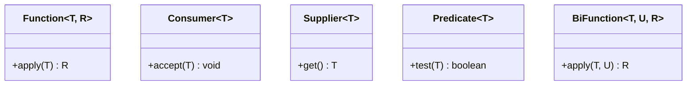

# 2. Functional Interfaces

Functional interface (giao diện hàm) là interface có đúng một phương thức trừu tượng, và đây chính là nền tảng để ta dùng được lambda cùng method reference. Java cung cấp sẵn nhiều functional interface hữu ích như `Function`, `Consumer`, `Supplier`, `Predicate`. Bài này giới thiệu functional interface là gì và các loại quan trọng nhất nên biết; chi tiết nằm bên dưới.

[](pathname:///img/java/functional-interfaces.webp)

---

:::note[Ghi nhớ nhanh]

- ⭐ **Functional interface** — interface có **đúng một phương thức trừu tượng**, làm "kiểu" cho lambda và method reference.
- ⭐ **Năm loại có sẵn trong `java.util.function`** — `Function<T,R>` (biến đổi, `apply`), `Consumer<T>` (làm việc, `accept`), `Supplier<T>` (cung cấp, `get`), `Predicate<T>` (kiểm tra, `test`), `BiFunction<T,U,R>` (nhận 2).
- **`@FunctionalInterface`** — annotation không bắt buộc nhưng nên dùng; báo lỗi nếu lỡ thêm phương thức trừu tượng thứ hai.
- **Vẫn cho phép `default`/`static`** — chỉ tính phương thức **trừu tượng** khi xét functional interface.
- **Ưu tiên dùng lại bộ chuẩn** thay vì tự viết; nhớ ghi rõ generic (`Function<String, Integer>`) để giữ an toàn kiểu.

:::

---

## Mục lục

- [Vì sao có functional interface?](#vì-sao-có-functional-interface)
- [Functional Interface là gì?](#functional-interface-là-gì)
- [Ví dụ đời thường](#ví-dụ-đời-thường)
- [Annotation @FunctionalInterface](#annotation-functionalinterface)
- [Tự viết một Functional Interface](#tự-viết-một-functional-interface)
- [Các Functional Interface có sẵn quan trọng](#các-functional-interface-có-sẵn-quan-trọng)
  - [Function — nhận 1, trả về 1](#function--nhận-1-trả-về-1)
  - [Consumer — nhận 1, không trả về](#consumer--nhận-1-không-trả-về)
  - [Supplier — không nhận, trả về 1](#supplier--không-nhận-trả-về-1)
  - [Predicate — nhận 1, trả về true/false](#predicate--nhận-1-trả-về-truefalse)
  - [BiFunction — nhận 2, trả về 1](#bifunction--nhận-2-trả-về-1)
- [Lỗi thường gặp](#lỗi-thường-gặp)
- [Tóm tắt](#tóm-tắt)
- [Câu hỏi phỏng vấn](#câu-hỏi-phỏng-vấn)

---

## Vì sao có functional interface?

**Vấn đề:** Java là ngôn ngữ kiểu tĩnh — mọi thứ phải có **kiểu** để trình biên dịch kiểm tra và để truyền đi được. Nhưng lambda "chỉ là một hàm", vậy kiểu của nó là gì? Nếu mỗi nơi tự định nghĩa một interface callback riêng thì code trùng lặp khắp nơi.

```java
// Mỗi nơi tự định nghĩa một interface callback riêng -> trùng lặp
interface MyTransformer { String run(String s); }
interface MyChecker    { boolean check(Integer n); }
interface MyMaker      { String make(); }

// Lambda gán cho cái gì? Trình biên dịch cần một "kiểu" để kiểm tra:
MyTransformer t = s -> s.toUpperCase(); // kiểu phải khớp đúng 1 phương thức
```

**Giải pháp:** **Functional interface** — interface có **đúng một phương thức trừu tượng** (đánh dấu `@FunctionalInterface`) làm "kiểu" cho lambda. Lambda chính là cách cài đặt gọn của interface đó. Java cung cấp sẵn bộ chuẩn trong `java.util.function` (`Function`, `Predicate`, `Consumer`, `Supplier`...) để dùng lại khắp nơi, khỏi tự viết.

```java
import java.util.function.*;

// Dùng bộ chuẩn có sẵn, không cần tự định nghĩa interface
Function<String, String>  toUpper = s -> s.toUpperCase(); // biến đổi
Predicate<Integer>        isEven  = n -> n % 2 == 0;       // kiểm tra điều kiện
Supplier<String>          maker   = () -> "giá trị mới";   // cung cấp giá trị
```

:::tip[Dùng thực tế]
- **`Predicate`** cho điều kiện lọc: `list.stream().filter(n -> n > 0)`.
- **`Function`** cho biến đổi dữ liệu: `list.stream().map(s -> s.length())`.
- **`Consumer`** cho `forEach`: `list.forEach(x -> System.out.println(x))`.
- **`Supplier`** cho khởi tạo lười (chỉ tạo giá trị khi thật sự cần): `Optional.orElseGet(() -> taoMacDinh())`.
:::

---

## Functional Interface là gì?

**Functional Interface (giao diện hàm)** là một interface có **đúng một phương thức trừu tượng (abstract method - phương thức chỉ khai báo, chưa có thân hàm)**.

Vì chỉ có một phương thức trừu tượng duy nhất, Java biết chắc lambda bạn viết sẽ "lấp" vào phương thức nào. Đó là lý do functional interface là **nền tảng để dùng lambda và method reference**.

Lưu ý: interface vẫn có thể có thêm các phương thức `default` (mặc định, đã có thân hàm) và `static` mà **không** ảnh hưởng tới việc nó là functional interface — chỉ tính phương thức **trừu tượng**.

---

## Ví dụ đời thường

Hãy nghĩ functional interface như một **ổ cắm điện chuẩn**: ổ cắm chỉ có đúng một "hình dạng" để cắm vào. Bất kỳ thiết bị nào (lambda) có "chân cắm" khớp đều dùng được.

Vì ổ cắm chỉ có một hình dạng duy nhất, bạn không bao giờ bị nhầm cắm sai chỗ. Nếu ổ có nhiều hình dạng (nhiều phương thức trừu tượng), Java sẽ không biết bạn muốn cắm vào đâu.

---

## Annotation @FunctionalInterface

**Annotation (chú thích) `@FunctionalInterface`** là một lời nhắc cho trình biên dịch: "interface này phải có đúng một phương thức trừu tượng".

Nếu bạn lỡ thêm phương thức trừu tượng thứ hai, trình biên dịch sẽ **báo lỗi ngay**, giúp bạn tránh sai sót. Annotation này **không bắt buộc** nhưng được khuyến khích dùng.

```java
@FunctionalInterface
interface Greeting {
    String sayHello(String name); // Một phương thức trừu tượng duy nhất - HỢP LỆ
}

// Nếu thêm dòng dưới đây sẽ bị LỖI BIÊN DỊCH vì có 2 phương thức trừu tượng:
// String sayBye(String name);
```

---

## Tự viết một Functional Interface

```java
@FunctionalInterface
interface StringTransformer {
    // Phương thức trừu tượng duy nhất: biến đổi một chuỗi thành chuỗi khác
    String transform(String input);
}

public class CustomFunctionalDemo {
    public static void main(String[] args) {
        // Dùng lambda để "lấp" vào phương thức transform
        StringTransformer toUpper = input -> input.toUpperCase();
        StringTransformer addExclaim = input -> input + "!!!";

        System.out.println(toUpper.transform("xin chào"));   // In ra: XIN CHÀO
        System.out.println(addExclaim.transform("Tuyệt"));   // In ra: Tuyệt!!!
    }
}
```

Lambda `input -> input.toUpperCase()` được xem như phần thân của phương thức `transform`. Đơn giản vậy thôi.

---

## Các Functional Interface có sẵn quan trọng

Java cung cấp sẵn nhiều functional interface trong gói `java.util.function`. Bạn nên dùng lại chúng thay vì tự viết. Năm cái quan trọng nhất:

| Tên | Nhận vào | Trả về | Phương thức gọi |
| --- | --- | --- | --- |
| `Function<T, R>` | 1 giá trị kiểu T | 1 giá trị kiểu R | `apply` |
| `Consumer<T>` | 1 giá trị kiểu T | không (void) | `accept` |
| `Supplier<T>` | không | 1 giá trị kiểu T | `get` |
| `Predicate<T>` | 1 giá trị kiểu T | `boolean` | `test` |
| `BiFunction<T, U, R>` | 2 giá trị kiểu T và U | 1 giá trị kiểu R | `apply` |

Sơ đồ dưới đây tóm tắt năm functional interface và phương thức trừu tượng duy nhất của mỗi loại:


```mermaid
classDiagram
    class Function~T, R~ {
        +apply(T) R
    }
    class Consumer~T~ {
        +accept(T) void
    }
    class Supplier~T~ {
        +get() T
    }
    class Predicate~T~ {
        +test(T) boolean
    }
    class BiFunction~T, U, R~ {
        +apply(T, U) R
    }
```

### Function — nhận 1, trả về 1

Dùng khi bạn cần **biến đổi** một giá trị thành giá trị khác.

```java
import java.util.function.Function;

public class FunctionDemo {
    public static void main(String[] args) {
        // Nhận chuỗi, trả về độ dài (số nguyên)
        Function<String, Integer> getLength = s -> s.length();
        System.out.println(getLength.apply("Docusaurus")); // In ra 10

        // Nhận số, trả về bình phương
        Function<Integer, Integer> square = n -> n * n;
        System.out.println(square.apply(6)); // In ra 36
    }
}
```

### Consumer — nhận 1, không trả về

Dùng khi bạn cần **làm một việc gì đó** với giá trị (in ra, lưu vào đâu đó) mà không cần trả kết quả.

```java
import java.util.function.Consumer;
import java.util.List;

public class ConsumerDemo {
    public static void main(String[] args) {
        // Nhận chuỗi, in ra màn hình, không trả về gì
        Consumer<String> printer = message -> System.out.println("Thông báo: " + message);
        printer.accept("Đã lưu thành công"); // In ra: Thông báo: Đã lưu thành công

        // forEach nhận một Consumer
        List.of("A", "B", "C").forEach(printer);
    }
}
```

### Supplier — không nhận, trả về 1

Dùng khi bạn cần **tạo ra hoặc cung cấp** một giá trị, không cần đầu vào. Giống như "vòi nước" chỉ việc mở ra là có nước.

```java
import java.util.function.Supplier;

public class SupplierDemo {
    public static void main(String[] args) {
        // Không nhận gì, trả về một câu chào mới mỗi lần gọi
        Supplier<String> greetingSupplier = () -> "Xin chào lúc " + System.currentTimeMillis();

        System.out.println(greetingSupplier.get()); // In ra câu chào kèm thời gian
        System.out.println(greetingSupplier.get()); // Gọi lại, thời gian khác
    }
}
```

### Predicate — nhận 1, trả về true/false

Dùng khi bạn cần **kiểm tra điều kiện** (đúng hay sai). Rất hay dùng để lọc dữ liệu.

```java
import java.util.function.Predicate;

public class PredicateDemo {
    public static void main(String[] args) {
        // Kiểm tra một số có phải số chẵn không
        Predicate<Integer> isEven = n -> n % 2 == 0;

        System.out.println(isEven.test(4)); // In ra true
        System.out.println(isEven.test(7)); // In ra false

        // Kiểm tra chuỗi có rỗng không
        Predicate<String> isEmpty = s -> s.isEmpty();
        System.out.println(isEmpty.test(""));     // In ra true
        System.out.println(isEmpty.test("abc"));  // In ra false
    }
}
```

### BiFunction — nhận 2, trả về 1

Giống `Function` nhưng nhận **hai** đầu vào. Dùng khi cần kết hợp hai giá trị.

```java
import java.util.function.BiFunction;

public class BiFunctionDemo {
    public static void main(String[] args) {
        // Nhận 2 số nguyên, trả về tổng
        BiFunction<Integer, Integer, Integer> add = (a, b) -> a + b;
        System.out.println(add.apply(3, 5)); // In ra 8

        // Nhận tên và tuổi, trả về một câu mô tả
        BiFunction<String, Integer, String> describe =
            (name, age) -> name + " năm nay " + age + " tuổi";
        System.out.println(describe.apply("Lan", 20)); // In ra: Lan năm nay 20 tuổi
    }
}
```

---

## Lỗi thường gặp

1. **Thêm phương thức trừu tượng thứ hai vào functional interface.** Nếu có `@FunctionalInterface` sẽ báo lỗi ngay. Nếu không có annotation, bạn vẫn không dùng được lambda và có thể bối rối không hiểu vì sao.

2. **Nhầm `Function` với `Consumer`.** `Function` **trả về** giá trị (`apply`), còn `Consumer` **không trả về** gì (`accept`). Chọn sai loại sẽ không biên dịch được.

3. **Quên kiểu generic.** Viết `Function f = ...` (thiếu `<T, R>`) sẽ mất an toàn kiểu (type safety) và dễ gây lỗi runtime. Luôn ghi rõ kiểu: `Function<String, Integer>`.

4. **Dùng kiểu nguyên thủy gây đóng/mở hộp (boxing) không cần thiết.** Với số nguyên thủy nên cân nhắc các biến thể như `IntFunction`, `IntPredicate`, `ToIntFunction`... để hiệu năng tốt hơn (sẽ tìm hiểu sâu hơn sau).

---

## Tóm tắt

- **Functional interface** là interface có **đúng một phương thức trừu tượng** — nền tảng để dùng lambda.
- Annotation **`@FunctionalInterface`** giúp trình biên dịch kiểm tra ràng buộc này (không bắt buộc nhưng nên dùng).
- Java cung cấp sẵn nhiều functional interface trong `java.util.function`. Năm cái quan trọng nhất:
  - **`Function<T,R>`**: nhận 1, trả về 1 — để biến đổi.
  - **`Consumer<T>`**: nhận 1, không trả về — để làm việc gì đó.
  - **`Supplier<T>`**: không nhận, trả về 1 — để cung cấp giá trị.
  - **`Predicate<T>`**: nhận 1, trả về `boolean` — để kiểm tra điều kiện.
  - **`BiFunction<T,U,R>`**: nhận 2, trả về 1.
- Hãy ưu tiên dùng lại các interface có sẵn thay vì tự viết.

---

## Câu hỏi phỏng vấn

Những câu thường gặp về chủ đề này. Tự trả lời trước, rồi bấm **Xem đáp án** để đối chiếu.

**1. Functional interface là gì? Vì sao interface phải có đúng một phương thức trừu tượng?**

<details className="qa">
<summary>Xem đáp án</summary>

Functional interface là một interface có **đúng một phương thức trừu tượng (abstract method)**.

- Lambda expression chỉ cung cấp một khối thân hàm duy nhất, không kèm tên phương thức. Để trình biên dịch biết lambda đó "lấp" vào phương thức nào của interface, interface đích phải có **chính xác một** phương thức chưa cài đặt — nếu có hai trở lên, sẽ mơ hồ (ambiguous), không biết lambda ứng với phương thức nào.
- Interface vẫn có thể có thêm các phương thức `default` và `static` (đã có sẵn thân hàm) mà không ảnh hưởng — chỉ tính phương thức **trừu tượng** khi xét điều kiện functional interface.

</details>

**2. `@FunctionalInterface` có bắt buộc không? Nó có tác dụng gì?**

<details className="qa">
<summary>Xem đáp án</summary>

**Không bắt buộc**, nhưng được khuyến khích dùng.

- Đây là một annotation dùng để **kiểm tra ràng buộc lúc biên dịch**: nếu interface được đánh dấu `@FunctionalInterface` mà có từ hai phương thức trừu tượng trở lên (hoặc không có phương thức trừu tượng nào), trình biên dịch sẽ **báo lỗi ngay**.
- Nếu không đánh dấu annotation này, interface vẫn hoạt động như functional interface bình thường (miễn là chỉ có 1 phương thức trừu tượng) — nhưng nếu sau này ai đó vô tình thêm phương thức trừu tượng thứ hai, lỗi chỉ lộ ra ở chỗ dùng lambda (khó hiểu hơn), thay vì báo lỗi ngay tại nơi khai báo interface.
- Vì vậy, `@FunctionalInterface` đóng vai trò như một "tài liệu sống" (self-documenting) kết hợp kiểm tra an toàn — nên dùng cho mọi interface tự viết mà dự định dùng với lambda.

</details>

**3. So sánh `Function<T, R>`, `Consumer<T>`, `Supplier<T>`, `Predicate<T>` về số tham số nhận vào và giá trị trả về.**

<details className="qa">
<summary>Xem đáp án</summary>

| Interface | Phương thức | Nhận vào | Trả về |
|-----------|-------------|----------|--------|
| `Function<T, R>` | `apply(T t)` | 1 | `R` |
| `Consumer<T>` | `accept(T t)` | 1 | không (`void`) |
| `Supplier<T>` | `get()` | không | `T` |
| `Predicate<T>` | `test(T t)` | 1 | `boolean` |

- Cách nhớ nhanh: `Function` = biến đổi (1 vào, 1 ra khác kiểu); `Consumer` = tiêu thụ (1 vào, không ra); `Supplier` = cung cấp (không vào, 1 ra); `Predicate` = kiểm tra điều kiện (1 vào, `boolean` ra).

</details>

**4. Đoạn code sau có biên dịch được không? Vì sao?**

```java
@FunctionalInterface
interface Validator {
    boolean isValid(String s);
    default boolean isInvalid(String s) {
        return !isValid(s);
    }
    static Validator alwaysTrue() {
        return s -> true;
    }
}
```

<details className="qa">
<summary>Xem đáp án</summary>

**Biên dịch được bình thường**, và `Validator` vẫn là một functional interface hợp lệ.

- `isValid(String s)` là phương thức trừu tượng **duy nhất** — điều kiện functional interface được thỏa mãn.
- `isInvalid()` là phương thức `default` (đã có thân hàm sẵn), `alwaysTrue()` là phương thức `static` — cả hai đều **không tính vào** số lượng phương thức trừu tượng khi Java kiểm tra `@FunctionalInterface`.
- Vì vậy interface này vẫn dùng lambda được bình thường: `Validator v = s -> s.length() > 0;`.

</details>

**5. `Runnable` và `Callable<V>` (trong `java.util.concurrent`) có phải là functional interface không? So sánh sự khác biệt giữa hai interface này.**

<details className="qa">
<summary>Xem đáp án</summary>

**Cả hai đều là functional interface** (mỗi cái chỉ có đúng một phương thức trừu tượng).

| Interface | Phương thức | Trả về | Có thể ném checked exception? |
|-----------|-------------|--------|-------------------------------|
| `Runnable` | `void run()` | không (`void`) | Không |
| `Callable<V>` | `V call() throws Exception` | `V` | Có |

- `Runnable` thường dùng cho tác vụ không cần kết quả (ví dụ truyền vào `Thread` hoặc `ExecutorService.execute()`).
- `Callable<V>` dùng khi tác vụ **cần trả về kết quả** và/hoặc có thể ném ra checked exception, thường dùng với `ExecutorService.submit()` để lấy về `Future<V>`.

</details>

**6. Nếu viết `Function f = s -> s.length();` (không ghi generic), điều gì xảy ra? Rủi ro là gì?**

<details className="qa">
<summary>Xem đáp án</summary>

- Đây là dùng **raw type** cho functional interface — vẫn biên dịch được (có cảnh báo unchecked), nhưng mất hoàn toàn **type safety**.
- Với raw type, tham số của `apply()` và giá trị trả về đều bị coi như `Object`, nên trình biên dịch **không kiểm tra được kiểu** lúc gọi:

```java
Function f = s -> ((String) s).length(); // phải tự ép kiểu bên trong lambda
Object result = f.apply(123); // biên dịch OK nhưng ném ClassCastException lúc CHẠY
```

- Rủi ro: lỗi sai kiểu chỉ lộ ra lúc **runtime** thay vì được bắt sớm lúc biên dịch — y hệt vấn đề dùng raw type với Collections đã học ở bài Generic Collections. Luôn ghi rõ generic: `Function<String, Integer>`.

</details>

**7. `IntPredicate`, `ToIntFunction<T>`, `IntUnaryOperator` khác nhau thế nào? Vì sao Java cần nhiều biến thể cho kiểu nguyên thủy như vậy?**

<details className="qa">
<summary>Xem đáp án</summary>

| Interface | Phương thức | Ý nghĩa |
|-----------|-------------|---------|
| `IntPredicate` | `boolean test(int value)` | Kiểm tra điều kiện trên `int`, không cần boxing |
| `ToIntFunction<T>` | `int applyAsInt(T value)` | Nhận một object kiểu `T`, trả về `int` nguyên thủy |
| `IntUnaryOperator` | `int applyAsInt(int operand)` | Nhận `int`, trả về `int` (cùng kiểu) |

- Nếu dùng `Predicate<Integer>`, `Function<T, Integer>`, `Function<Integer, Integer>` thay thế, mỗi lần gọi Java phải **autobox** giá trị `int` thành `Integer` (tạo object) rồi **unbox** ngược lại khi cần dùng như nguyên thủy — tốn chi phí tạo object và garbage collection không cần thiết.
- Các biến thể chuyên biệt hóa cho `int`/`long`/`double` giúp **tránh hoàn toàn autoboxing/unboxing**, quan trọng nhất khi xử lý số lượng lớn phần tử, ví dụ trong `IntStream` của Stream API.

</details>

**8. Vì sao `Comparator<T>` được coi là functional interface dù có nhiều phương thức được khai báo trong source code của nó (`reversed()`, `thenComparing()`, `naturalOrder()`...)?**

<details className="qa">
<summary>Xem đáp án</summary>

- `Comparator<T>` chỉ có **một** phương thức trừu tượng thực sự: `int compare(T o1, T o2)`.
- Các phương thức còn lại như `reversed()`, `thenComparing()` là **`default` method**, còn `naturalOrder()`, `comparing()` là **`static` method** — tất cả đều đã có sẵn cài đặt (thân hàm cụ thể) ngay trong interface, không phải phương thức trừu tượng.
- Vì chỉ tính phương thức trừu tượng khi xét điều kiện functional interface, `Comparator<T>` vẫn hợp lệ để dùng với lambda: `Comparator<Integer> c = (a, b) -> a - b;`, đồng thời vẫn tận dụng được các `default`/`static` method tiện lợi có sẵn như một API phong phú.

</details>

**9. Có thể tự viết một functional interface generic có nhiều tham số kiểu không? Cho ví dụ.**

<details className="qa">
<summary>Xem đáp án</summary>

**Có.** Functional interface hoàn toàn có thể khai báo nhiều tham số kiểu generic, miễn là vẫn chỉ có một phương thức trừu tượng.

```java
@FunctionalInterface
interface TriFunction<A, B, C, R> {
    R apply(A a, B b, C c);
}

TriFunction<String, Integer, Boolean, String> moTa =
    (ten, tuoi, laSinhVien) -> ten + ", " + tuoi + " tuổi, "
        + (laSinhVien ? "là sinh viên" : "không phải sinh viên");

System.out.println(moTa.apply("An", 20, true));
```

- Đây là một ví dụ thực tế cho thấy tự viết functional interface vẫn cần thiết khi bộ chuẩn `java.util.function` không có sẵn interface phù hợp (ví dụ Java không có sẵn interface nhận 3 tham số kiểu `TriFunction`).

</details>

**10. Vì sao nên ưu tiên dùng lại các functional interface trong `java.util.function` thay vì tự định nghĩa interface riêng cho mỗi trường hợp?**

<details className="qa">
<summary>Xem đáp án</summary>

- **Tính nhất quán và khả năng tương thích (interoperability)**: các API chuẩn của Java (Stream, Optional, CompletableFuture...) đều được thiết kế để nhận `Function`, `Predicate`, `Consumer`, `Supplier` — nếu bạn tự định nghĩa interface riêng có cùng chữ ký, nó **không thể** truyền trực tiếp vào các API này (dù về logic giống hệt, Java không coi hai functional interface khác tên là tương thích).
- **Giảm số lượng type thừa thãi**: mỗi interface tự định nghĩa thêm là một khái niệm mới người đọc code phải học, trong khi bộ chuẩn đã được cộng đồng Java quen thuộc.
- Chỉ nên tự viết functional interface riêng khi: (1) cần chữ ký đặc biệt mà bộ chuẩn không có (ví dụ nhận 3+ tham số), hoặc (2) muốn đặt tên có ý nghĩa nghiệp vụ rõ ràng hơn (ví dụ `PriceCalculator` thay vì `Function<Order, BigDecimal>`) để code dễ đọc hơn.

</details>

**11. Interface `Comparator<T>` và `Comparable<T>` khác nhau thế nào? Cái nào là functional interface?**

<details className="qa">
<summary>Xem đáp án</summary>

| | `Comparable<T>` | `Comparator<T>` |
|---|------------------|-------------------|
| Phương thức | `int compareTo(T o)` | `int compare(T o1, T o2)` |
| Cài đặt ở đâu | Bên trong chính class cần so sánh (so sánh với "chính nó") | Một class/lambda **riêng biệt**, so sánh hai đối tượng bất kỳ |
| Số cách so sánh | Chỉ một cách "tự nhiên" (natural ordering) cho mỗi class | Có thể tạo nhiều `Comparator` khác nhau cho cùng một class |
| Là functional interface? | Có (1 phương thức trừu tượng) nhưng thường được implement trực tiếp bởi class, ít dùng lambda | Có, và rất hay dùng với lambda: `(a, b) -> a.getTuoi() - b.getTuoi()` |

- Trong thực tế, `Comparator` được dùng với lambda phổ biến hơn nhiều vì nó cho phép định nghĩa **nhiều tiêu chí sắp xếp khác nhau** cho cùng một class mà không cần sửa class đó (ví dụ sắp theo tên, theo tuổi, theo điểm — mỗi tiêu chí một `Comparator` riêng), trong khi `Comparable` chỉ gắn được **một** thứ tự "mặc định" duy nhất vào class.

</details>
