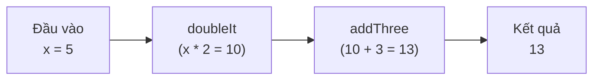

# 3. Kết hợp hàm (Functional Composition)

Kết hợp hàm (functional composition) là việc ghép nhiều hàm nhỏ lại thành một hàm lớn hơn, trong đó đầu ra của hàm này là đầu vào của hàm kia. Cách làm này giúp ta viết nhiều hàm nhỏ gọn, dễ đọc và dễ tái sử dụng thay vì một hàm khổng lồ. Bài này giới thiệu các công cụ ghép hàm như `andThen`, `compose` và cách kết hợp `Predicate`, `Consumer`; chi tiết nằm bên dưới.

---

## Mục lục

- [Vì sao có function composition?](#vì-sao-có-function-composition)
- [Kết hợp hàm là gì?](#kết-hợp-hàm-là-gì)
- [Ví dụ đời thường: dây chuyền sản xuất](#ví-dụ-đời-thường-dây-chuyền-sản-xuất)
- [andThen — chạy hàm này rồi tới hàm kia](#andthen--chạy-hàm-này-rồi-tới-hàm-kia)
- [compose — thứ tự ngược lại với andThen](#compose--thứ-tự-ngược-lại-với-andthen)
- [So sánh andThen và compose](#so-sánh-andthen-và-compose)
- [Kết hợp Predicate: and, or, negate](#kết-hợp-predicate-and-or-negate)
- [Kết hợp Consumer với andThen](#kết-hợp-consumer-với-andthen)
- [Lỗi thường gặp](#lỗi-thường-gặp)
- [Tóm tắt](#tóm-tắt)

---

## Vì sao có function composition?

**Vấn đề:** Một phép biến đổi phức tạp thường gồm nhiều bước nối tiếp. Nếu nhét tất cả vào một hàm to thì khó đọc, khó test từng phần và khó tái sử dụng từng bước. Còn nếu lồng lời gọi `f(g(h(x)))` thì phải đọc ngược từ trong ra ngoài, rất khó theo dõi.

```java
import java.util.function.Function;

public class WithoutComposition {
    public static void main(String[] args) {
        Function<String, String> trim = s -> s.trim();
        Function<String, String> lower = s -> s.toLowerCase();
        Function<String, String> noSpace = s -> s.replace(" ", "-");

        // Lồng nhiều lời gọi: đọc NGƯỢC từ trong ra ngoài, khó theo dõi
        String result = noSpace.apply(lower.apply(trim.apply("  Hello World  ")));
        System.out.println(result); // hello-world

        // Muốn dùng lại đúng chuỗi 3 bước này ở chỗ khác? Phải chép lại y nguyên.
    }
}
```

**Giải pháp:** **Function composition** — ghép nhiều hàm **nhỏ** (mỗi hàm làm một việc, dễ test riêng) thành một hàm lớn bằng `andThen` (chạy lần lượt) hoặc `compose` (thứ tự ngược lại), và kết hợp `Predicate` bằng `and`/`or`/`negate`. Ta tạo được một pipeline biến đổi rõ ràng, đọc xuôi từ trái sang phải, và tái sử dụng được từng khối nhỏ.

```java
import java.util.function.Function;

public class WithComposition {
    public static void main(String[] args) {
        Function<String, String> trim = s -> s.trim();
        Function<String, String> lower = s -> s.toLowerCase();
        Function<String, String> noSpace = s -> s.replace(" ", "-");

        // Ghép thành một pipeline, đọc xuôi đúng thứ tự thực thi
        Function<String, String> slugify = trim.andThen(lower).andThen(noSpace);

        System.out.println(slugify.apply("  Hello World  ")); // hello-world

        // slugify dùng lại được ở bất cứ đâu, từng bước test riêng được
    }
}
```

:::tip[Dùng thực tế]

- **Pipeline xử lý dữ liệu:** chuẩn hoá → validate → biến đổi, ghép thành một chuỗi rõ ràng.
- **Ghép Predicate điều kiện lọc:** kết hợp nhiều điều kiện nhỏ bằng `and`/`or`/`negate` để lọc dữ liệu.
- **Tái sử dụng hàm con:** mỗi bước là một hàm nhỏ độc lập, dùng lại được ở nhiều pipeline khác nhau.
- **Dựng phép biến đổi linh hoạt lúc chạy:** chọn và nối các hàm con tuỳ tình huống ngay trong runtime.

:::

---

## Kết hợp hàm là gì?

**Kết hợp hàm (Functional Composition)** là việc **ghép nhiều hàm nhỏ lại thành một hàm lớn hơn**. Đầu ra của hàm này trở thành đầu vào của hàm tiếp theo.

Ý tưởng cốt lõi: thay vì viết một hàm khổng lồ làm mọi thứ, ta viết nhiều **hàm nhỏ, mỗi hàm làm tốt một việc**, rồi nối chúng lại. Code dễ đọc, dễ kiểm thử và dễ tái sử dụng hơn.

---

## Ví dụ đời thường: dây chuyền sản xuất

Hãy hình dung một **dây chuyền làm bánh**:

1. Trạm 1: nhào bột.
2. Trạm 2: nướng bánh.
3. Trạm 3: rắc đường.

Mỗi trạm là một hàm nhỏ. Bột đi qua lần lượt từng trạm, đầu ra trạm này là đầu vào trạm sau. Cuối cùng ta có chiếc bánh hoàn chỉnh. Kết hợp hàm chính là cách "nối các trạm" thành một dây chuyền.

---

## andThen — chạy hàm này rồi tới hàm kia

Phương thức **`andThen`** của `Function` tạo ra một hàm mới: **chạy hàm hiện tại trước, rồi lấy kết quả đưa vào hàm tiếp theo**.

Đọc theo thứ tự từ trái sang phải: `a.andThen(b)` nghĩa là "làm `a` trước, rồi làm `b`".

```java
import java.util.function.Function;

public class AndThenDemo {
    public static void main(String[] args) {
        // Hàm nhỏ 1: nhân đôi
        Function<Integer, Integer> doubleIt = x -> x * 2;
        // Hàm nhỏ 2: cộng thêm 3
        Function<Integer, Integer> addThree = x -> x + 3;

        // Ghép lại: nhân đôi TRƯỚC, rồi cộng 3 SAU
        Function<Integer, Integer> combined = doubleIt.andThen(addThree);

        // Với đầu vào 5: (5 * 2) = 10, rồi (10 + 3) = 13
        System.out.println(combined.apply(5)); // In ra 13
    }
}
```

Sơ đồ dưới đây minh hoạ pipeline `andThen`: đầu ra hàm này là đầu vào hàm kia, chạy lần lượt từ trái sang phải:



---

## compose — thứ tự ngược lại với andThen

Phương thức **`compose`** cũng ghép hai hàm, nhưng **chạy hàm trong tham số TRƯỚC, rồi mới chạy hàm hiện tại**.

`a.compose(b)` nghĩa là "làm `b` trước, rồi làm `a`". Đây là thứ tự ngược với `andThen`.

```java
import java.util.function.Function;

public class ComposeDemo {
    public static void main(String[] args) {
        Function<Integer, Integer> doubleIt = x -> x * 2;
        Function<Integer, Integer> addThree = x -> x + 3;

        // compose: chạy addThree TRƯỚC, rồi doubleIt SAU
        Function<Integer, Integer> combined = doubleIt.compose(addThree);

        // Với đầu vào 5: (5 + 3) = 8, rồi (8 * 2) = 16
        System.out.println(combined.apply(5)); // In ra 16
    }
}
```

---

## So sánh andThen và compose

Cùng hai hàm `doubleIt` và `addThree`, đầu vào `5`, nhưng kết quả khác nhau vì thứ tự khác nhau:

```java
import java.util.function.Function;

public class CompareDemo {
    public static void main(String[] args) {
        Function<Integer, Integer> doubleIt = x -> x * 2;
        Function<Integer, Integer> addThree = x -> x + 3;

        // andThen: doubleIt -> addThree  => (5*2)+3 = 13
        System.out.println(doubleIt.andThen(addThree).apply(5)); // 13

        // compose: addThree -> doubleIt  => (5+3)*2 = 16
        System.out.println(doubleIt.compose(addThree).apply(5)); // 16
    }
}
```

Mẹo nhớ:
- **`andThen`** đọc xuôi: hàm gọi trước, "rồi sau đó" (and then) tới hàm trong ngoặc.
- **`compose`** ngược: hàm trong ngoặc chạy trước (giống cách toán học viết `f(g(x))` — `g` chạy trước).

---

## Kết hợp Predicate: and, or, negate

`Predicate` (hàm trả về true/false) cũng ghép được bằng **`and`**, **`or`**, **`negate`** — giống các phép logic VÀ, HOẶC, PHỦ ĐỊNH.

```java
import java.util.function.Predicate;

public class PredicateCompositionDemo {
    public static void main(String[] args) {
        Predicate<Integer> isPositive = n -> n > 0;   // số dương
        Predicate<Integer> isEven = n -> n % 2 == 0;  // số chẵn

        // and: PHẢI vừa dương VỪA chẵn
        Predicate<Integer> positiveAndEven = isPositive.and(isEven);
        System.out.println(positiveAndEven.test(4));  // true  (dương và chẵn)
        System.out.println(positiveAndEven.test(-4)); // false (chẵn nhưng không dương)
        System.out.println(positiveAndEven.test(3));  // false (dương nhưng lẻ)

        // or: chỉ cần dương HOẶC chẵn
        Predicate<Integer> positiveOrEven = isPositive.or(isEven);
        System.out.println(positiveOrEven.test(-4)); // true (chẵn)
        System.out.println(positiveOrEven.test(3));  // true (dương)
        System.out.println(positiveOrEven.test(-3)); // false (không dương, không chẵn)

        // negate: PHỦ ĐỊNH - đảo ngược kết quả
        Predicate<Integer> isOdd = isEven.negate();
        System.out.println(isOdd.test(3)); // true  (3 không chẵn nên là lẻ)
        System.out.println(isOdd.test(4)); // false
    }
}
```

Cách viết này giúp diễn đạt điều kiện phức tạp một cách rõ ràng, đọc gần như tiếng Anh tự nhiên: "dương và chẵn", "dương hoặc chẵn".

---

## Kết hợp Consumer với andThen

`Consumer` cũng có `andThen`: chạy hành vi này xong rồi chạy hành vi kia, **cùng trên một giá trị**.

```java
import java.util.function.Consumer;

public class ConsumerCompositionDemo {
    public static void main(String[] args) {
        Consumer<String> printUpper = s -> System.out.println("HOA: " + s.toUpperCase());
        Consumer<String> printLength = s -> System.out.println("Độ dài: " + s.length());

        // Ghép: in chữ hoa TRƯỚC, rồi in độ dài SAU
        Consumer<String> both = printUpper.andThen(printLength);

        both.accept("Docusaurus");
        // In ra:
        // HOA: DOCUSAURUS
        // Độ dài: 10
    }
}
```

---

## Lỗi thường gặp

1. **Nhầm thứ tự `andThen` và `compose`.** Đây là lỗi phổ biến nhất. Nhớ: `andThen` = hàm gọi trước chạy trước; `compose` = hàm trong ngoặc chạy trước.

2. **Kiểu dữ liệu không khớp khi nối.** Đầu ra của hàm trước phải khớp đầu vào của hàm sau. Ví dụ nối một `Function<String, Integer>` với `Function<Integer, String>` thì hợp lệ, nhưng nối với `Function<Boolean, ...>` sẽ lỗi.

3. **Quên rằng kết hợp tạo ra hàm MỚI.** `a.andThen(b)` không thay đổi `a` hay `b`; nó trả về một hàm mới. Bạn phải gán kết quả vào biến hoặc gọi `.apply()` ngay.

```java
// SAI: tưởng đã đổi doubleIt nhưng thực ra không
// doubleIt.andThen(addThree); // kết quả bị bỏ đi, doubleIt vẫn như cũ

// ĐÚNG: lưu lại hàm mới
// Function<Integer, Integer> combined = doubleIt.andThen(addThree);
```

4. **Lạm dụng ghép quá nhiều hàm.** Ghép 2-3 hàm thì rõ ràng, nhưng ghép cả chục hàm trên một dòng sẽ khó đọc. Hãy đặt tên cho các bước trung gian khi cần.

---

## Tóm tắt

- **Kết hợp hàm** là ghép nhiều hàm nhỏ thành một hàm lớn, đầu ra hàm này là đầu vào hàm kia.
- **`andThen`**: chạy hàm hiện tại **trước**, rồi tới hàm trong tham số. Đọc xuôi trái sang phải.
- **`compose`**: chạy hàm trong tham số **trước**, rồi tới hàm hiện tại. Thứ tự ngược với `andThen`.
- **`Predicate`** ghép bằng **`and`** (và), **`or`** (hoặc), **`negate`** (phủ định) để tạo điều kiện phức tạp rõ ràng.
- **`Consumer`** ghép bằng **`andThen`** để chạy nhiều hành vi liên tiếp trên cùng một giá trị.
- Mọi phép kết hợp đều tạo ra **hàm mới**, không làm thay đổi hàm gốc.
