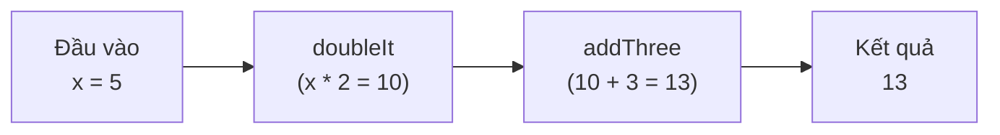

# 3. Kết hợp hàm (Functional Composition)

Kết hợp hàm (functional composition) là việc ghép nhiều hàm nhỏ lại thành một hàm lớn hơn, trong đó đầu ra của hàm này là đầu vào của hàm kia. Cách làm này giúp ta viết nhiều hàm nhỏ gọn, dễ đọc và dễ tái sử dụng thay vì một hàm khổng lồ. Bài này giới thiệu các công cụ ghép hàm như `andThen`, `compose` và cách kết hợp `Predicate`, `Consumer`; chi tiết nằm bên dưới.

[](pathname:///img/java/functional-composition.webp)

---

:::note[Ghi nhớ nhanh]

- ⭐ **Kết hợp hàm** — ghép nhiều hàm nhỏ thành một pipeline, đầu ra hàm này là đầu vào hàm kia; dễ đọc, test và tái sử dụng.
- ⭐ **`andThen` vs `compose`** — `a.andThen(b)` chạy `a` trước rồi `b` (đọc xuôi); `a.compose(b)` chạy `b` trước rồi `a` (ngược, giống `f(g(x))`).
- **Ghép `Predicate`** — dùng `and`, `or`, `negate` để diễn đạt điều kiện phức tạp rõ ràng.
- **Ghép `Consumer`** — `andThen` chạy nhiều hành vi liên tiếp trên **cùng một giá trị**.
- **Luôn tạo hàm mới** — phép kết hợp không thay đổi hàm gốc; phải gán lại kết quả hoặc gọi `.apply()` ngay.

:::

---

## Mục lục

- [Vì sao có function composition?](#vì-sao-có-function-composition)
- [Kết hợp hàm là gì?](#kết-hợp-hàm-là-gì)
- [Ví dụ đời thường: dây chuyền sản xuất](#ví-dụ-đời-thường-dây-chuyền-sản-xuất)
- [andThen — chạy hàm này rồi tới hàm kia](#andthen--chạy-hàm-này-rồi-tới-hàm-kia)
- [compose — thứ tự ngược lại với andThen](#compose--thứ-tự-ngược-lại-với-andthen)
- [So sánh andThen và compose](#so-sánh-andthen-và-compose)
- [Kết hợp Predicate: and, or, negate](#kết-hợp-predicate-and-or-negate)
- [Kết hợp Consumer với andThen](#kết-hợp-consumer-với-andthen)
- [Lỗi thường gặp](#lỗi-thường-gặp)
- [Tóm tắt](#tóm-tắt)
- [Câu hỏi phỏng vấn](#câu-hỏi-phỏng-vấn)

---

## Vì sao có function composition?

**Vấn đề:** Một phép biến đổi phức tạp thường gồm nhiều bước nối tiếp. Nếu nhét tất cả vào một hàm to thì khó đọc, khó test từng phần và khó tái sử dụng từng bước. Còn nếu lồng lời gọi `f(g(h(x)))` thì phải đọc ngược từ trong ra ngoài, rất khó theo dõi.

```java
import java.util.function.Function;

public class WithoutComposition {
    public static void main(String[] args) {
        Function<String, String> trim = s -> s.trim();
        Function<String, String> lower = s -> s.toLowerCase();
        Function<String, String> noSpace = s -> s.replace(" ", "-");

        // Lồng nhiều lời gọi: đọc NGƯỢC từ trong ra ngoài, khó theo dõi
        String result = noSpace.apply(lower.apply(trim.apply("  Hello World  ")));
        System.out.println(result); // hello-world

        // Muốn dùng lại đúng chuỗi 3 bước này ở chỗ khác? Phải chép lại y nguyên.
    }
}
```

**Giải pháp:** **Function composition** — ghép nhiều hàm **nhỏ** (mỗi hàm làm một việc, dễ test riêng) thành một hàm lớn bằng `andThen` (chạy lần lượt) hoặc `compose` (thứ tự ngược lại), và kết hợp `Predicate` bằng `and`/`or`/`negate`. Ta tạo được một pipeline biến đổi rõ ràng, đọc xuôi từ trái sang phải, và tái sử dụng được từng khối nhỏ.

```java
import java.util.function.Function;

public class WithComposition {
    public static void main(String[] args) {
        Function<String, String> trim = s -> s.trim();
        Function<String, String> lower = s -> s.toLowerCase();
        Function<String, String> noSpace = s -> s.replace(" ", "-");

        // Ghép thành một pipeline, đọc xuôi đúng thứ tự thực thi
        Function<String, String> slugify = trim.andThen(lower).andThen(noSpace);

        System.out.println(slugify.apply("  Hello World  ")); // hello-world

        // slugify dùng lại được ở bất cứ đâu, từng bước test riêng được
    }
}
```

:::tip[Dùng thực tế]

- **Pipeline xử lý dữ liệu:** chuẩn hoá → validate → biến đổi, ghép thành một chuỗi rõ ràng.
- **Ghép Predicate điều kiện lọc:** kết hợp nhiều điều kiện nhỏ bằng `and`/`or`/`negate` để lọc dữ liệu.
- **Tái sử dụng hàm con:** mỗi bước là một hàm nhỏ độc lập, dùng lại được ở nhiều pipeline khác nhau.
- **Dựng phép biến đổi linh hoạt lúc chạy:** chọn và nối các hàm con tuỳ tình huống ngay trong runtime.

:::

---

## Kết hợp hàm là gì?

**Kết hợp hàm (Functional Composition)** là việc **ghép nhiều hàm nhỏ lại thành một hàm lớn hơn**. Đầu ra của hàm này trở thành đầu vào của hàm tiếp theo.

Ý tưởng cốt lõi: thay vì viết một hàm khổng lồ làm mọi thứ, ta viết nhiều **hàm nhỏ, mỗi hàm làm tốt một việc**, rồi nối chúng lại. Code dễ đọc, dễ kiểm thử và dễ tái sử dụng hơn.

---

## Ví dụ đời thường: dây chuyền sản xuất

Hãy hình dung một **dây chuyền làm bánh**:

1. Trạm 1: nhào bột.
2. Trạm 2: nướng bánh.
3. Trạm 3: rắc đường.

Mỗi trạm là một hàm nhỏ. Bột đi qua lần lượt từng trạm, đầu ra trạm này là đầu vào trạm sau. Cuối cùng ta có chiếc bánh hoàn chỉnh. Kết hợp hàm chính là cách "nối các trạm" thành một dây chuyền.

---

## andThen — chạy hàm này rồi tới hàm kia

Phương thức **`andThen`** của `Function` tạo ra một hàm mới: **chạy hàm hiện tại trước, rồi lấy kết quả đưa vào hàm tiếp theo**.

Đọc theo thứ tự từ trái sang phải: `a.andThen(b)` nghĩa là "làm `a` trước, rồi làm `b`".

```java
import java.util.function.Function;

public class AndThenDemo {
    public static void main(String[] args) {
        // Hàm nhỏ 1: nhân đôi
        Function<Integer, Integer> doubleIt = x -> x * 2;
        // Hàm nhỏ 2: cộng thêm 3
        Function<Integer, Integer> addThree = x -> x + 3;

        // Ghép lại: nhân đôi TRƯỚC, rồi cộng 3 SAU
        Function<Integer, Integer> combined = doubleIt.andThen(addThree);

        // Với đầu vào 5: (5 * 2) = 10, rồi (10 + 3) = 13
        System.out.println(combined.apply(5)); // In ra 13
    }
}
```

Sơ đồ dưới đây minh hoạ pipeline `andThen`: đầu ra hàm này là đầu vào hàm kia, chạy lần lượt từ trái sang phải:


```mermaid
flowchart LR
    A["Đầu vào<br/>x = 5"] --> B["doubleIt<br/>(x * 2 = 10)"]
    B --> C["addThree<br/>(10 + 3 = 13)"]
    C --> D["Kết quả<br/>13"]
```

---

## compose — thứ tự ngược lại với andThen

Phương thức **`compose`** cũng ghép hai hàm, nhưng **chạy hàm trong tham số TRƯỚC, rồi mới chạy hàm hiện tại**.

`a.compose(b)` nghĩa là "làm `b` trước, rồi làm `a`". Đây là thứ tự ngược với `andThen`.

```java
import java.util.function.Function;

public class ComposeDemo {
    public static void main(String[] args) {
        Function<Integer, Integer> doubleIt = x -> x * 2;
        Function<Integer, Integer> addThree = x -> x + 3;

        // compose: chạy addThree TRƯỚC, rồi doubleIt SAU
        Function<Integer, Integer> combined = doubleIt.compose(addThree);

        // Với đầu vào 5: (5 + 3) = 8, rồi (8 * 2) = 16
        System.out.println(combined.apply(5)); // In ra 16
    }
}
```

---

## So sánh andThen và compose

Cùng hai hàm `doubleIt` và `addThree`, đầu vào `5`, nhưng kết quả khác nhau vì thứ tự khác nhau:

```java
import java.util.function.Function;

public class CompareDemo {
    public static void main(String[] args) {
        Function<Integer, Integer> doubleIt = x -> x * 2;
        Function<Integer, Integer> addThree = x -> x + 3;

        // andThen: doubleIt -> addThree  => (5*2)+3 = 13
        System.out.println(doubleIt.andThen(addThree).apply(5)); // 13

        // compose: addThree -> doubleIt  => (5+3)*2 = 16
        System.out.println(doubleIt.compose(addThree).apply(5)); // 16
    }
}
```

Mẹo nhớ:
- **`andThen`** đọc xuôi: hàm gọi trước, "rồi sau đó" (and then) tới hàm trong ngoặc.
- **`compose`** ngược: hàm trong ngoặc chạy trước (giống cách toán học viết `f(g(x))` — `g` chạy trước).

---

## Kết hợp Predicate: and, or, negate

`Predicate` (hàm trả về true/false) cũng ghép được bằng **`and`**, **`or`**, **`negate`** — giống các phép logic VÀ, HOẶC, PHỦ ĐỊNH.

```java
import java.util.function.Predicate;

public class PredicateCompositionDemo {
    public static void main(String[] args) {
        Predicate<Integer> isPositive = n -> n > 0;   // số dương
        Predicate<Integer> isEven = n -> n % 2 == 0;  // số chẵn

        // and: PHẢI vừa dương VỪA chẵn
        Predicate<Integer> positiveAndEven = isPositive.and(isEven);
        System.out.println(positiveAndEven.test(4));  // true  (dương và chẵn)
        System.out.println(positiveAndEven.test(-4)); // false (chẵn nhưng không dương)
        System.out.println(positiveAndEven.test(3));  // false (dương nhưng lẻ)

        // or: chỉ cần dương HOẶC chẵn
        Predicate<Integer> positiveOrEven = isPositive.or(isEven);
        System.out.println(positiveOrEven.test(-4)); // true (chẵn)
        System.out.println(positiveOrEven.test(3));  // true (dương)
        System.out.println(positiveOrEven.test(-3)); // false (không dương, không chẵn)

        // negate: PHỦ ĐỊNH - đảo ngược kết quả
        Predicate<Integer> isOdd = isEven.negate();
        System.out.println(isOdd.test(3)); // true  (3 không chẵn nên là lẻ)
        System.out.println(isOdd.test(4)); // false
    }
}
```

Cách viết này giúp diễn đạt điều kiện phức tạp một cách rõ ràng, đọc gần như tiếng Anh tự nhiên: "dương và chẵn", "dương hoặc chẵn".

---

## Kết hợp Consumer với andThen

`Consumer` cũng có `andThen`: chạy hành vi này xong rồi chạy hành vi kia, **cùng trên một giá trị**.

```java
import java.util.function.Consumer;

public class ConsumerCompositionDemo {
    public static void main(String[] args) {
        Consumer<String> printUpper = s -> System.out.println("HOA: " + s.toUpperCase());
        Consumer<String> printLength = s -> System.out.println("Độ dài: " + s.length());

        // Ghép: in chữ hoa TRƯỚC, rồi in độ dài SAU
        Consumer<String> both = printUpper.andThen(printLength);

        both.accept("Docusaurus");
        // In ra:
        // HOA: DOCUSAURUS
        // Độ dài: 10
    }
}
```

---

## Lỗi thường gặp

1. **Nhầm thứ tự `andThen` và `compose`.** Đây là lỗi phổ biến nhất. Nhớ: `andThen` = hàm gọi trước chạy trước; `compose` = hàm trong ngoặc chạy trước.

2. **Kiểu dữ liệu không khớp khi nối.** Đầu ra của hàm trước phải khớp đầu vào của hàm sau. Ví dụ nối một `Function<String, Integer>` với `Function<Integer, String>` thì hợp lệ, nhưng nối với `Function<Boolean, ...>` sẽ lỗi.

3. **Quên rằng kết hợp tạo ra hàm MỚI.** `a.andThen(b)` không thay đổi `a` hay `b`; nó trả về một hàm mới. Bạn phải gán kết quả vào biến hoặc gọi `.apply()` ngay.

```java
// SAI: tưởng đã đổi doubleIt nhưng thực ra không
// doubleIt.andThen(addThree); // kết quả bị bỏ đi, doubleIt vẫn như cũ

// ĐÚNG: lưu lại hàm mới
// Function<Integer, Integer> combined = doubleIt.andThen(addThree);
```

4. **Lạm dụng ghép quá nhiều hàm.** Ghép 2-3 hàm thì rõ ràng, nhưng ghép cả chục hàm trên một dòng sẽ khó đọc. Hãy đặt tên cho các bước trung gian khi cần.

---

## Tóm tắt

- **Kết hợp hàm** là ghép nhiều hàm nhỏ thành một hàm lớn, đầu ra hàm này là đầu vào hàm kia.
- **`andThen`**: chạy hàm hiện tại **trước**, rồi tới hàm trong tham số. Đọc xuôi trái sang phải.
- **`compose`**: chạy hàm trong tham số **trước**, rồi tới hàm hiện tại. Thứ tự ngược với `andThen`.
- **`Predicate`** ghép bằng **`and`** (và), **`or`** (hoặc), **`negate`** (phủ định) để tạo điều kiện phức tạp rõ ràng.
- **`Consumer`** ghép bằng **`andThen`** để chạy nhiều hành vi liên tiếp trên cùng một giá trị.
- Mọi phép kết hợp đều tạo ra **hàm mới**, không làm thay đổi hàm gốc.

---

## Câu hỏi phỏng vấn

Những câu thường gặp về chủ đề này. Tự trả lời trước, rồi bấm **Xem đáp án** để đối chiếu.

**1. `andThen` và `compose` của `Function` khác nhau ở điểm nào? Cho ví dụ minh họa bằng số cụ thể.**

<details className="qa">
<summary>Xem đáp án</summary>

- `a.andThen(b)`: chạy `a` **trước**, lấy kết quả làm đầu vào cho `b` — đọc xuôi trái sang phải.
- `a.compose(b)`: chạy `b` **trước**, lấy kết quả làm đầu vào cho `a` — giống cách toán học viết `f(g(x))`, hàm trong ngoặc chạy trước.

```java
Function<Integer, Integer> doubleIt = x -> x * 2;
Function<Integer, Integer> addThree = x -> x + 3;

doubleIt.andThen(addThree).apply(5); // (5*2)+3 = 13
doubleIt.compose(addThree).apply(5); // (5+3)*2 = 16
```

</details>

**2. Đoạn code sau in ra gì? Giải thích từng bước.**

```java
Function<String, String> trim = String::trim;
Function<String, Integer> length = String::length;
Function<String, Integer> pipeline = trim.andThen(length);
System.out.println(pipeline.apply("  hello  "));
```

<details className="qa">
<summary>Xem đáp án</summary>

In ra `5`.

- `trim.andThen(length)` tạo ra một `Function<String, Integer>` mới: đầu vào chạy qua `trim` trước, kết quả của `trim` lại chạy tiếp qua `length`.
- `"  hello  "` → `trim()` → `"hello"` → `length()` → `5`.
- Đây là ví dụ cho thấy `andThen` có thể ghép hai hàm có **kiểu trả về khác nhau** (`Function<String, String>` nối với `Function<String, Integer>`), miễn là kiểu đầu ra của hàm trước khớp với kiểu đầu vào của hàm sau.

</details>

**3. Vì sao `a.andThen(b)` không làm thay đổi `a` hay `b`? Đoạn code sau có lỗi logic gì?**

```java
Function<Integer, Integer> doubleIt = x -> x * 2;
Function<Integer, Integer> addThree = x -> x + 3;
doubleIt.andThen(addThree);
System.out.println(doubleIt.apply(5));
```

<details className="qa">
<summary>Xem đáp án</summary>

In ra `10`, không phải `13` như người viết code có thể kỳ vọng nhầm.

- `andThen()` (và `compose()`) là các phương thức **thuần túy (pure)** theo tinh thần lập trình hàm — chúng không sửa đổi (mutate) đối tượng `doubleIt` hay `addThree` gốc, mà **luôn tạo ra và trả về một `Function` hoàn toàn mới**.
- Dòng `doubleIt.andThen(addThree);` tạo ra một hàm mới nhưng **không gán vào đâu cả** — kết quả bị bỏ đi ngay lập tức, không có tác dụng gì.
- `doubleIt` vẫn là hàm gốc `x -> x * 2`, nên `doubleIt.apply(5)` vẫn trả về `10`.
- Cách sửa đúng: `Function<Integer, Integer> combined = doubleIt.andThen(addThree);` rồi gọi `combined.apply(5)`.

</details>

**4. `Predicate.and()`, `or()`, `negate()` hoạt động thế nào? Đoạn code sau in ra gì?**

```java
Predicate<Integer> isPositive = n -> n > 0;
Predicate<Integer> isEven = n -> n % 2 == 0;
Predicate<Integer> ketQua = isPositive.and(isEven).negate();
System.out.println(ketQua.test(4));
System.out.println(ketQua.test(-3));
```

<details className="qa">
<summary>Xem đáp án</summary>

In ra `false` rồi `true`.

- `isPositive.and(isEven)` tạo ra một `Predicate` mới: chỉ `true` khi **cả hai** điều kiện đều đúng (dương VÀ chẵn).
- `.negate()` đảo ngược kết quả của toàn bộ biểu thức `and` đó: `true` thành `false` và ngược lại.
- Với `4`: `isPositive.and(isEven)` là `true` (dương và chẵn) → `negate()` → `false`.
- Với `-3`: `isPositive.and(isEven)` là `false` (không dương, không chẵn) → `negate()` → `true`.
- Lưu ý thứ tự áp dụng: `and()` được tính trước, `negate()` áp dụng lên **kết quả cuối cùng** của toàn biểu thức `and`, không phải chỉ lên `isEven`.

</details>

**5. `Consumer.andThen()` khác `Function.andThen()` ở điểm nào về cách xử lý dữ liệu?**

<details className="qa">
<summary>Xem đáp án</summary>

- `Function.andThen()`: đầu ra của hàm trước **trở thành đầu vào** của hàm sau — dữ liệu được biến đổi qua từng bước (khác kiểu hoặc khác giá trị ở mỗi bước).
- `Consumer.andThen()`: cả hai `Consumer` đều nhận **cùng một giá trị đầu vào gốc**, chạy tuần tự lần lượt (không có khái niệm "kết quả" để truyền tiếp, vì `Consumer` không trả về gì).

```java
Consumer<String> inHoa = s -> System.out.println(s.toUpperCase());
Consumer<String> inDoDai = s -> System.out.println(s.length());

Consumer<String> ca_hai = inHoa.andThen(inDoDai);
ca_hai.accept("hello"); // cả inHoa và inDoDai đều nhận "hello" làm đầu vào, không phải kết quả của nhau
```

</details>

**6. Vì sao nói `Function.compose()` và `Function.andThen()` đều dựa trên nguyên lý toán học của "hàm hợp" (function composition)? Viết `f.compose(g)` tương đương biểu thức toán học nào?**

<details className="qa">
<summary>Xem đáp án</summary>

Trong toán học, "hàm hợp" của `f` và `g`, ký hiệu `(f ∘ g)(x)`, được định nghĩa là `f(g(x))` — tức là áp dụng `g` trước, rồi lấy kết quả đưa vào `f`.

- `f.compose(g)` trong Java tương ứng chính xác với `(f ∘ g)(x) = f(g(x))`: `g` chạy trước, `f` chạy sau.
- `f.andThen(g)` tương đương `(g ∘ f)(x) = g(f(x))`: `f` chạy trước, `g` chạy sau — tức là hàm hợp theo chiều **ngược lại** so với `compose`.
- Việc Java cung cấp cả hai (`andThen` đọc xuôi tự nhiên theo code, `compose` đúng quy ước toán học) là để lập trình viên chọn cách viết dễ đọc nhất theo ngữ cảnh, mà không mất đi ý nghĩa toán học chuẩn.

</details>

**7. Vì sao nên chia một phép biến đổi phức tạp thành nhiều hàm nhỏ rồi ghép lại bằng composition, thay vì viết trực tiếp một hàm lớn làm hết mọi việc?**

<details className="qa">
<summary>Xem đáp án</summary>

- **Dễ test từng phần (unit test độc lập)**: mỗi hàm nhỏ chỉ làm một việc, có thể viết test riêng cho từng bước, dễ xác định lỗi nằm ở bước nào khi có sai sót.
- **Dễ tái sử dụng**: một hàm nhỏ như `trim` hay `toLowerCase` có thể dùng lại trong nhiều pipeline khác nhau, không phải copy-paste logic.
- **Dễ đọc, đúng nguyên tắc Single Responsibility**: đọc `trim.andThen(lower).andThen(noSpace)` gần như đọc một câu tiếng Anh mô tả các bước xử lý, thay vì phải đọc và hiểu toàn bộ logic lồng nhau trong một hàm khổng lồ.
- Đánh đổi: ghép quá nhiều hàm nhỏ trên cùng một dòng dài cũng có thể khó đọc — nên đặt tên rõ ràng cho các bước trung gian khi pipeline dài.

</details>

**8. `UnaryOperator<T>` khác `Function<T, T>` ở điểm nào? Vì sao nó tồn tại như một interface riêng?**

<details className="qa">
<summary>Xem đáp án</summary>

- Về mặt chữ ký, `UnaryOperator<T>` (kế thừa `Function<T, T>`) có cùng ý nghĩa với `Function<T, T>`: nhận vào và trả về **cùng một kiểu** `T`.
- Sự khác biệt chủ yếu là **ngữ nghĩa (semantic) và tính rõ ràng khi đọc code**: `UnaryOperator<T>` nói rõ ngay từ khai báo rằng "đây là một phép biến đổi giữ nguyên kiểu" (ví dụ `String -> String`, dùng cho các thao tác như chuẩn hóa chuỗi), thay vì phải nhìn cả hai tham số generic của `Function<T, T>` để nhận ra điều đó.
- Trong thực tế, `List.replaceAll(UnaryOperator<E> operator)` là một ví dụ dùng `UnaryOperator` thay vì `Function` chung chung, vì ngữ nghĩa "thay thế phần tử bằng giá trị cùng kiểu" khớp chính xác với `UnaryOperator`.

</details>

**9. Trong Stream API, phương thức nào thể hiện rõ nhất tinh thần function composition? Cho ví dụ.**

<details className="qa">
<summary>Xem đáp án</summary>

```java
List<String> ketQua = danhSach.stream()
    .map(String::trim)
    .map(String::toLowerCase)
    .filter(s -> !s.isEmpty())
    .toList();
```

- Mỗi lời gọi `.map()`/`.filter()` liên tiếp trong Stream pipeline chính là một dạng **function composition tường minh**: đầu ra của bước trước (sau `map(String::trim)`) trở thành đầu vào của bước sau (`map(String::toLowerCase)`), tương tự cách `andThen()` nối các `Function` lại với nhau.
- Về bản chất, Stream API được xây dựng hoàn toàn trên nền tảng functional composition — đây là lý do bài học về `andThen`/`compose`/`and`/`or`/`negate` là kiến thức nền tảng bắt buộc trước khi học sâu Stream API.

</details>

**10. Nêu một rủi ro khi ghép quá nhiều hàm liên tiếp trong một pipeline dài (ví dụ 8-10 bước andThen). Cách khắc phục?**

<details className="qa">
<summary>Xem đáp án</summary>

Rủi ro chính:

- **Khó đọc và khó debug**: khi pipeline dài, nếu kết quả sai, khó xác định ngay bước nào trong chuỗi gây ra lỗi, vì tất cả nằm trên một biểu thức liên tiếp không có điểm dừng trung gian để kiểm tra (inspect).
- **Stack trace khó theo dõi**: nếu một bước ném exception, stack trace chỉ ra lỗi nằm "đâu đó trong lambda", không rõ ràng bằng việc có tên hàm cụ thể.

Cách khắc phục:

- **Đặt tên có ý nghĩa cho các bước trung gian**: thay vì ghép hết trên một dòng, gán từng cụm nhỏ vào biến có tên rõ ràng (`Function<String, String> chuanHoaVanBan = trim.andThen(lower);`), rồi ghép các biến đã đặt tên đó lại.
- **Giới hạn độ dài pipeline hợp lý** (ví dụ 3-5 bước), tách thành nhiều pipeline con có tên nghiệp vụ rõ ràng nếu logic quá phức tạp.

</details>
