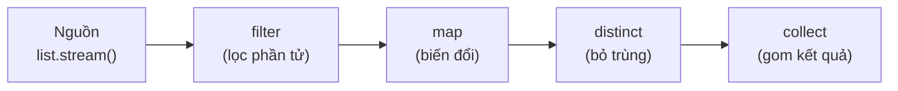

# 4. Stream API

Stream API là công cụ xử lý một chuỗi phần tử theo kiểu dây chuyền: lọc, biến đổi, sắp xếp rồi gom kết quả. Đây là vũ khí chủ lực của lập trình hàm trong Java, giúp viết code xử lý dữ liệu ngắn gọn và rõ ràng mà không làm thay đổi dữ liệu gốc. Bài này giới thiệu các thao tác trung gian, thao tác kết thúc và những điểm cần lưu ý khi dùng Stream; chi tiết nằm bên dưới.

[](pathname:///img/java/stream-api.webp)

---

:::note[Ghi nhớ nhanh]

- ⭐ **Stream xử lý dữ liệu theo dây chuyền khai báo** — không lưu trữ dữ liệu, không đổi dữ liệu gốc, và **chỉ dùng được một lần**.
- ⭐ **Pipeline gồm 3 phần** — nguồn → thao tác trung gian (`filter`, `map`, `sorted`, `distinct`, `limit`/`skip`) → thao tác kết thúc (`collect`, `reduce`, `forEach`, `count`, `anyMatch`, `findFirst`).
- **Lazy evaluation** — thao tác trung gian chỉ chạy khi gặp thao tác kết thúc; cho phép dừng sớm (như `findFirst`). Thiếu thao tác kết thúc thì không có gì chạy.
- **`Collectors`** — công cụ gom mạnh: `toList`, `toSet`, `joining`, `groupingBy`, `counting`, `summingInt`.
- **`parallel()`** — xử lý song song nhiều nhân CPU; chỉ dùng cho dữ liệu lớn, thao tác độc lập và bất biến (tránh sửa biến dùng chung).

:::

---

## Mục lục

- [Vì sao có Stream API?](#vì-sao-có-stream-api)
- [Stream là gì?](#stream-là-gì)
- [Ví dụ đời thường: dây chuyền xử lý](#ví-dụ-đời-thường-dây-chuyền-xử-lý)
- [Ba phần của một pipeline Stream](#ba-phần-của-một-pipeline-stream)
- [Cách tạo Stream](#cách-tạo-stream)
- [Thao tác trung gian (Intermediate Operations)](#thao-tác-trung-gian-intermediate-operations)
  - [filter — lọc phần tử](#filter--lọc-phần-tử)
  - [map — biến đổi phần tử](#map--biến-đổi-phần-tử)
  - [sorted — sắp xếp](#sorted--sắp-xếp)
  - [distinct — loại bỏ trùng lặp](#distinct--loại-bỏ-trùng-lặp)
  - [limit và skip](#limit-và-skip)
- [Thao tác kết thúc (Terminal Operations)](#thao-tác-kết-thúc-terminal-operations)
  - [forEach — duyệt từng phần tử](#foreach--duyệt-từng-phần-tử)
  - [collect — gom thành danh sách](#collect--gom-thành-danh-sách)
  - [reduce — gộp về một giá trị](#reduce--gộp-về-một-giá-trị)
  - [count, anyMatch, findFirst](#count-anymatch-findfirst)
- [Collectors — công cụ gom kết quả mạnh mẽ](#collectors--công-cụ-gom-kết-quả-mạnh-mẽ)
- [Lazy Evaluation — chạy lười](#lazy-evaluation--chạy-lười)
- [Parallel Stream — xử lý song song](#parallel-stream--xử-lý-song-song)
- [Ví dụ tổng hợp thực tế](#ví-dụ-tổng-hợp-thực-tế)
- [Lỗi thường gặp](#lỗi-thường-gặp)
- [Tóm tắt](#tóm-tắt)
- [Câu hỏi phỏng vấn](#câu-hỏi-phỏng-vấn)

---

## Vì sao có Stream API?

**Vấn đề:** Xử lý collection bằng vòng `for` thủ công rất dài dòng. Để lọc → biến đổi → gom kết quả, ta phải viết nhiều dòng và tạo các list trung gian. Code lộ rõ "LÀM THẾ NÀO" (cách lặp, cách thêm vào list) làm che mất "LÀM GÌ" (ý định thật sự). Muốn chạy song song lại càng khó vì phải tự quản lý thread.

```java
import java.util.ArrayList;
import java.util.List;

public class WithoutStream {
    public static void main(String[] args) {
        List<String> names = List.of("an", "bình", "cường", "an");

        // Lọc tên dài hơn 2 ký tự, viết hoa, bỏ trùng — phải làm thủ công
        List<String> temp = new ArrayList<>();      // list trung gian
        for (String n : names) {
            if (n.length() > 2) {                   // lọc
                String upper = n.toUpperCase();      // biến đổi
                if (!temp.contains(upper)) {         // bỏ trùng
                    temp.add(upper);                 // gom kết quả
                }
            }
        }
        System.out.println(temp); // [BÌNH, CƯỜNG]
    }
}
```

**Giải pháp:** **Stream API** (Java 8) xử lý theo phong cách **khai báo** bằng một chuỗi thao tác (`filter` / `map` / `reduce` / `collect`). Code gọn, đọc đúng như mô tả ý định. Stream **lazy** (chỉ tính khi cần, dừng sớm được) và chỉ cần đổi sang `parallelStream()` là chạy song song dễ dàng.

```java
import java.util.List;
import java.util.stream.Collectors;

public class WithStream {
    public static void main(String[] args) {
        List<String> names = List.of("an", "bình", "cường", "an");

        // Cùng logic trên — viết như mô tả ý định
        List<String> result = names.stream()
            .filter(n -> n.length() > 2)     // lọc
            .map(String::toUpperCase)        // biến đổi
            .distinct()                      // bỏ trùng
            .collect(Collectors.toList());   // gom kết quả

        System.out.println(result); // [BÌNH, CƯỜNG]
    }
}
```

:::tip[Dùng thực tế]

- **Lọc + biến đổi + thu thập**: lấy danh sách đã lọc và biến đổi chỉ trong vài dòng (`filter` → `map` → `collect`).
- **Nhóm và thống kê**: gom phần tử theo nhóm với `groupingBy` (ví dụ nhóm đơn hàng theo trạng thái).
- **Tính tổng/trung bình**: cộng dồn nhanh với `mapToInt(...).sum()` hoặc `average()`.
- **Xử lý song song dữ liệu lớn**: đổi sang `parallelStream()` để tận dụng nhiều nhân CPU.

:::

---

## Stream là gì?

**Stream (luồng dữ liệu)** là một **chuỗi các phần tử** mà ta có thể xử lý theo kiểu **dây chuyền**: lọc, biến đổi, sắp xếp, gom kết quả... Stream được giới thiệu từ Java 8 và là công cụ chủ lực của lập trình hàm trong Java.

Điểm quan trọng cần hiểu ngay:

- Stream **không phải là cấu trúc lưu trữ** dữ liệu. Nó không "chứa" phần tử như `List`, mà chỉ **chảy qua** dữ liệu để xử lý.
- Stream **không làm thay đổi dữ liệu gốc**. Nó tạo ra kết quả mới (phù hợp với tư duy immutability - bất biến).
- Một stream **chỉ dùng được một lần**. Sau khi chạy xong thao tác kết thúc, không dùng lại được.

---

## Ví dụ đời thường: dây chuyền xử lý

Hãy hình dung một **dây chuyền lọc và đóng gói trái cây**:

1. Đổ cả rổ táo lên băng chuyền (nguồn dữ liệu).
2. Loại bỏ quả hỏng (lọc - `filter`).
3. Dán nhãn cho từng quả (biến đổi - `map`).
4. Xếp vào hộp (gom kết quả - `collect`).

Mỗi quả táo đi qua từng trạm, và cuối cùng ta có một hộp táo đã xử lý. Stream API hoạt động đúng như vậy.

---

## Ba phần của một pipeline Stream

Một **pipeline (chuỗi xử lý) Stream** luôn gồm ba phần:

```java
import java.util.List;
import java.util.stream.Collectors;

public class PipelineStructure {
    public static void main(String[] args) {
        List<String> names = List.of("An", "Bình", "Cường", "An");

        List<String> result = names.stream()        // 1. NGUỒN: tạo stream
            .filter(n -> n.length() > 2)             // 2. TRUNG GIAN: lọc
            .distinct()                              // 2. TRUNG GIAN: bỏ trùng
            .collect(Collectors.toList());           // 3. KẾT THÚC: gom kết quả

        System.out.println(result); // In ra: [Bình, Cường]
    }
}
```

1. **Nguồn (Source)**: nơi tạo ra stream (từ list, mảng, số...).
2. **Thao tác trung gian (Intermediate)**: biến đổi stream, trả về stream khác → có thể nối nhiều cái.
3. **Thao tác kết thúc (Terminal)**: tạo ra kết quả cuối (list, số, in ra...) → kết thúc pipeline.

Sơ đồ dưới đây minh hoạ dữ liệu chảy qua một pipeline Stream điển hình từ nguồn tới kết quả:



---

## Cách tạo Stream

```java
import java.util.Arrays;
import java.util.List;
import java.util.stream.IntStream;
import java.util.stream.Stream;

public class CreateStreamDemo {
    public static void main(String[] args) {
        // 1. Từ một Collection (List, Set...)
        List<String> list = List.of("a", "b", "c");
        Stream<String> s1 = list.stream();

        // 2. Từ các giá trị rời rạc
        Stream<Integer> s2 = Stream.of(1, 2, 3, 4);

        // 3. Từ một mảng
        int[] numbers = {10, 20, 30};
        IntStream s3 = Arrays.stream(numbers);

        // 4. Stream số nguyên trong khoảng (rất hay dùng để lặp)
        // range: từ 1 đến 5 (KHÔNG bao gồm 6)
        IntStream s4 = IntStream.range(1, 6);
        s4.forEach(System.out::println); // In 1 2 3 4 5

        // rangeClosed: từ 1 đến 5 (BAO GỒM 5)
        IntStream.rangeClosed(1, 5).forEach(System.out::print); // In 12345
    }
}
```

---

## Thao tác trung gian (Intermediate Operations)

Thao tác trung gian **trả về một stream mới**, nên ta nối tiếp được nhiều thao tác. Chúng **chưa thực sự chạy** cho tới khi gặp thao tác kết thúc (xem mục Lazy Evaluation).

### filter — lọc phần tử

`filter` nhận một **`Predicate`** (điều kiện true/false), **giữ lại** những phần tử thỏa điều kiện.

```java
import java.util.List;
import java.util.stream.Collectors;

public class FilterDemo {
    public static void main(String[] args) {
        List<Integer> numbers = List.of(1, 2, 3, 4, 5, 6);

        // Giữ lại số chẵn
        List<Integer> evens = numbers.stream()
            .filter(n -> n % 2 == 0) // điều kiện: chia hết cho 2
            .collect(Collectors.toList());

        System.out.println(evens); // In ra: [2, 4, 6]
    }
}
```

### map — biến đổi phần tử

`map` nhận một **`Function`**, biến đổi **mỗi phần tử** thành một giá trị mới (có thể khác kiểu).

```java
import java.util.List;
import java.util.stream.Collectors;

public class MapDemo {
    public static void main(String[] args) {
        List<String> names = List.of("an", "bình", "cường");

        // Biến đổi mỗi tên thành chữ hoa
        List<String> upper = names.stream()
            .map(String::toUpperCase)
            .collect(Collectors.toList());
        System.out.println(upper); // In ra: [AN, BÌNH, CƯỜNG]

        // Biến đổi mỗi tên thành độ dài của nó (đổi kiểu String -> Integer)
        List<Integer> lengths = names.stream()
            .map(String::length)
            .collect(Collectors.toList());
        System.out.println(lengths); // In ra: [2, 4, 5]
    }
}
```

Phân biệt nhanh: **`filter`** quyết định "giữ hay bỏ", **`map`** quyết định "biến nó thành gì".

### sorted — sắp xếp

`sorted` sắp xếp các phần tử. Không tham số thì sắp theo thứ tự tự nhiên; có `Comparator` thì sắp theo quy tắc tùy ý.

```java
import java.util.Comparator;
import java.util.List;
import java.util.stream.Collectors;

public class SortedDemo {
    public static void main(String[] args) {
        List<Integer> numbers = List.of(5, 2, 8, 1, 9);

        // Sắp tăng dần (thứ tự tự nhiên)
        System.out.println(numbers.stream().sorted().collect(Collectors.toList())); // [1, 2, 5, 8, 9]

        // Sắp giảm dần
        List<Integer> desc = numbers.stream()
            .sorted(Comparator.reverseOrder())
            .collect(Collectors.toList());
        System.out.println(desc); // [9, 8, 5, 2, 1]

        // Sắp chuỗi theo độ dài
        List<String> words = List.of("banana", "kiwi", "apple");
        List<String> byLength = words.stream()
            .sorted(Comparator.comparingInt(String::length))
            .collect(Collectors.toList());
        System.out.println(byLength); // [kiwi, apple, banana]
    }
}
```

### distinct — loại bỏ trùng lặp

`distinct` giữ lại mỗi phần tử **chỉ một lần** (dựa trên `equals`).

```java
import java.util.List;
import java.util.stream.Collectors;

public class DistinctDemo {
    public static void main(String[] args) {
        List<Integer> numbers = List.of(1, 2, 2, 3, 3, 3, 4);
        List<Integer> unique = numbers.stream()
            .distinct()
            .collect(Collectors.toList());
        System.out.println(unique); // In ra: [1, 2, 3, 4]
    }
}
```

### limit và skip

`limit(n)` lấy **n phần tử đầu**, `skip(n)` **bỏ qua n phần tử đầu**.

```java
import java.util.stream.Collectors;
import java.util.stream.IntStream;

public class LimitSkipDemo {
    public static void main(String[] args) {
        // Lấy 3 số đầu từ 1..10
        System.out.println(
            IntStream.rangeClosed(1, 10).limit(3).boxed().collect(Collectors.toList())
        ); // [1, 2, 3]

        // Bỏ 7 số đầu, lấy phần còn lại
        System.out.println(
            IntStream.rangeClosed(1, 10).skip(7).boxed().collect(Collectors.toList())
        ); // [8, 9, 10]
    }
}
```

---

## Thao tác kết thúc (Terminal Operations)

Thao tác kết thúc **tạo ra kết quả cuối cùng** và **đóng** stream. Sau bước này stream không dùng lại được.

### forEach — duyệt từng phần tử

Dùng để **làm việc gì đó** với từng phần tử (thường là in ra). Không trả về giá trị.

```java
import java.util.List;

public class ForEachDemo {
    public static void main(String[] args) {
        List.of("A", "B", "C").stream()
            .forEach(item -> System.out.println("Phần tử: " + item));
        // In ra: Phần tử: A / Phần tử: B / Phần tử: C
    }
}
```

### collect — gom thành danh sách

`collect` là thao tác kết thúc hay dùng nhất, dùng kèm `Collectors` để gom kết quả thành `List`, `Set`, `Map`...

```java
import java.util.List;
import java.util.stream.Collectors;

public class CollectDemo {
    public static void main(String[] args) {
        List<Integer> result = List.of(1, 2, 3, 4).stream()
            .map(n -> n * 10)
            .collect(Collectors.toList()); // gom thành List
        System.out.println(result); // [10, 20, 30, 40]
    }
}
```

### reduce — gộp về một giá trị

`reduce` **gộp toàn bộ stream về một giá trị duy nhất** (tính tổng, tích, nối chuỗi...).

```java
import java.util.List;

public class ReduceDemo {
    public static void main(String[] args) {
        List<Integer> numbers = List.of(1, 2, 3, 4, 5);

        // Tính tổng: bắt đầu từ 0, lần lượt cộng từng phần tử
        // (tổng tạm, phần tử kế tiếp) -> tổng tạm + phần tử
        int sum = numbers.stream().reduce(0, (acc, n) -> acc + n);
        System.out.println("Tổng = " + sum); // Tổng = 15

        // Tìm số lớn nhất (không có giá trị khởi đầu nên trả về Optional)
        numbers.stream()
            .reduce((a, b) -> a > b ? a : b)
            .ifPresent(max -> System.out.println("Lớn nhất = " + max)); // Lớn nhất = 5
    }
}
```

Hình dung `reduce` như cầm từng đồng tiền cho vào heo đất: `acc` là số tiền đang có trong heo, mỗi phần tử là một đồng mới bỏ vào.

### count, anyMatch, findFirst

```java
import java.util.List;

public class OtherTerminalDemo {
    public static void main(String[] args) {
        List<Integer> numbers = List.of(1, 2, 3, 4, 5, 6);

        // count: đếm số phần tử (sau khi lọc)
        long countEven = numbers.stream().filter(n -> n % 2 == 0).count();
        System.out.println("Số phần tử chẵn: " + countEven); // 3

        // anyMatch: có phần tử nào thỏa điều kiện không? trả về boolean
        boolean hasBig = numbers.stream().anyMatch(n -> n > 5);
        System.out.println("Có số > 5? " + hasBig); // true

        // allMatch: TẤT CẢ có thỏa không?
        boolean allPositive = numbers.stream().allMatch(n -> n > 0);
        System.out.println("Tất cả dương? " + allPositive); // true

        // findFirst: lấy phần tử đầu tiên (trả về Optional vì có thể rỗng)
        numbers.stream()
            .filter(n -> n > 3)
            .findFirst()
            .ifPresent(first -> System.out.println("Số đầu tiên > 3: " + first)); // 4
    }
}
```

---

## Collectors — công cụ gom kết quả mạnh mẽ

**`Collectors`** là lớp tiện ích cung cấp nhiều cách gom kết quả linh hoạt.

```java
import java.util.List;
import java.util.Map;
import java.util.stream.Collectors;

public class CollectorsDemo {
    public static void main(String[] args) {
        List<String> names = List.of("An", "Bình", "Cường", "Dũng");

        // 1. Gom thành Set (loại trùng tự động)
        var nameSet = names.stream().collect(Collectors.toSet());
        System.out.println(nameSet);

        // 2. Nối các chuỗi lại, ngăn cách bằng dấu phẩy
        String joined = names.stream().collect(Collectors.joining(", "));
        System.out.println(joined); // An, Bình, Cường, Dũng

        // 3. Nhóm theo độ dài tên (groupingBy)
        Map<Integer, List<String>> byLength = names.stream()
            .collect(Collectors.groupingBy(String::length));
        System.out.println(byLength); // {2=[An], 4=[Bình, Dũng], 5=[Cường]}

        // 4. Đếm số phần tử trong mỗi nhóm
        Map<Integer, Long> countByLength = names.stream()
            .collect(Collectors.groupingBy(String::length, Collectors.counting()));
        System.out.println(countByLength); // {2=1, 4=2, 5=1}

        // 5. Tính tổng độ dài tất cả tên
        int total = names.stream().collect(Collectors.summingInt(String::length));
        System.out.println("Tổng độ dài: " + total); // 15
    }
}
```

---

## Lazy Evaluation — chạy lười

**Lazy Evaluation (đánh giá lười)** nghĩa là các thao tác trung gian **chưa chạy ngay**. Chúng chỉ là "kế hoạch". Toàn bộ pipeline **chỉ thực sự chạy khi gặp thao tác kết thúc**.

```java
import java.util.List;
import java.util.stream.Collectors;

public class LazyDemo {
    public static void main(String[] args) {
        List<Integer> numbers = List.of(1, 2, 3, 4, 5);

        // Đoạn này KHÔNG in gì, vì chưa có thao tác kết thúc
        var planned = numbers.stream()
            .filter(n -> {
                System.out.println("Đang lọc: " + n); // sẽ KHÔNG chạy ở đây
                return n % 2 == 0;
            });
        System.out.println("Đã định nghĩa pipeline nhưng chưa chạy...");

        // Chỉ khi gọi collect (thao tác kết thúc) thì filter mới thật sự chạy
        var result = planned.collect(Collectors.toList());
        System.out.println("Kết quả: " + result);
    }
}
```

Lợi ích của lazy: Java có thể **tối ưu**. Ví dụ với `findFirst`, stream dừng ngay khi tìm thấy phần tử đầu tiên thỏa điều kiện, không cần duyệt hết.

```java
import java.util.stream.IntStream;

public class ShortCircuitDemo {
    public static void main(String[] args) {
        // Dù khoảng rất lớn, stream dừng ngay khi tìm thấy số đầu tiên > 100
        IntStream.rangeClosed(1, 1_000_000)
            .filter(n -> n > 100)
            .findFirst()
            .ifPresent(System.out::println); // In ra 101, không duyệt tới 1 triệu
    }
}
```

---

## Parallel Stream — xử lý song song

**Parallel Stream (luồng song song)** chia dữ liệu ra nhiều phần và xử lý **đồng thời trên nhiều nhân CPU**, có thể nhanh hơn với dữ liệu lớn.

```java
import java.util.stream.IntStream;

public class ParallelDemo {
    public static void main(String[] args) {
        // Tính tổng từ 1 đến 1 triệu, xử lý song song
        long sum = IntStream.rangeClosed(1, 1_000_000)
            .parallel() // bật chế độ song song
            .sum();
        System.out.println("Tổng = " + sum);
    }
}
```

Lưu ý quan trọng dành cho người mới:

- Chỉ nên dùng parallel khi **dữ liệu thật sự lớn** và phép tính độc lập. Với dữ liệu nhỏ, song song có thể **chậm hơn** vì chi phí chia/gộp.
- Tuyệt đối **không thay đổi biến dùng chung** trong parallel stream (gây lỗi khó lường do nhiều luồng cùng ghi). Hãy giữ tư duy bất biến.
- Thứ tự xử lý không còn đảm bảo như stream thường (trừ khi dùng các thao tác giữ thứ tự).

---

## Ví dụ tổng hợp thực tế

Cho danh sách sản phẩm, lọc sản phẩm còn hàng, lấy tên viết hoa, sắp xếp và gom lại:

```java
import java.util.List;
import java.util.stream.Collectors;

record Product(String name, double price, boolean inStock) {}

public class RealWorldDemo {
    public static void main(String[] args) {
        List<Product> products = List.of(
            new Product("Bàn phím", 350_000, true),
            new Product("Chuột", 150_000, false),
            new Product("Màn hình", 2_500_000, true),
            new Product("Tai nghe", 500_000, true)
        );

        // Lấy tên các sản phẩm còn hàng, giá < 1 triệu, viết hoa, sắp xếp A-Z
        List<String> result = products.stream()
            .filter(Product::inStock)              // chỉ lấy còn hàng
            .filter(p -> p.price() < 1_000_000)    // giá dưới 1 triệu
            .map(p -> p.name().toUpperCase())      // tên viết hoa
            .sorted()                              // sắp xếp
            .collect(Collectors.toList());         // gom thành list

        System.out.println(result); // [BÀN PHÍM, TAI NGHE]

        // Tính tổng giá trị các sản phẩm còn hàng
        double totalInStock = products.stream()
            .filter(Product::inStock)
            .mapToDouble(Product::price)
            .sum();
        System.out.println("Tổng giá còn hàng: " + totalInStock); // 3350000.0
    }
}
```

---

## Lỗi thường gặp

1. **Dùng lại stream sau khi đã kết thúc.** Một stream chỉ chạy được một lần. Gọi thao tác lần hai sẽ ném `IllegalStateException`. Hãy tạo stream mới từ nguồn nếu cần dùng lại.

```java
// SAI:
// var s = list.stream();
// s.forEach(System.out::println);
// long c = s.count(); // LỖI: stream đã đóng
```

2. **Quên thao tác kết thúc.** Nếu chỉ có thao tác trung gian (filter, map...) mà không có thao tác kết thúc, **không có gì chạy cả** (do lazy evaluation).

3. **Nhầm `map` với `forEach`.** `map` biến đổi và trả về stream mới (trung gian); `forEach` chỉ làm việc với từng phần tử và kết thúc stream. Đừng dùng `forEach` để "biến đổi rồi gom" — hãy dùng `map` + `collect`.

4. **Thay đổi dữ liệu gốc bên trong stream.** Stream nên xử lý theo kiểu bất biến. Việc thêm/xóa phần tử trên collection nguồn khi stream đang chạy gây `ConcurrentModificationException`.

5. **Lạm dụng `parallel()`.** Với dữ liệu nhỏ hoặc thao tác có trạng thái dùng chung, parallel thường gây chậm hoặc sai. Mặc định hãy dùng stream thường.

---

## Tóm tắt

- **Stream** là chuỗi phần tử xử lý theo dây chuyền; **không lưu trữ dữ liệu**, **không đổi dữ liệu gốc**, **chỉ dùng một lần**.
- Một pipeline gồm 3 phần: **nguồn** → **thao tác trung gian** → **thao tác kết thúc**.
- Thao tác trung gian (trả về stream): **`filter`** (lọc), **`map`** (biến đổi), **`sorted`** (sắp xếp), **`distinct`** (bỏ trùng), **`limit`/`skip`**.
- Thao tác kết thúc (tạo kết quả): **`forEach`**, **`collect`**, **`reduce`** (gộp về 1 giá trị), **`count`**, **`anyMatch`/`allMatch`**, **`findFirst`**.
- **`Collectors`** cung cấp công cụ gom mạnh mẽ: `toList`, `toSet`, `joining`, `groupingBy`, `counting`, `summingInt`...
- **Lazy evaluation**: thao tác trung gian chỉ chạy khi có thao tác kết thúc, cho phép tối ưu (dừng sớm).
- **Parallel stream** xử lý song song nhiều nhân CPU — chỉ dùng cho dữ liệu lớn, thao tác độc lập và bất biến.

---

## Câu hỏi phỏng vấn

Những câu thường gặp về chủ đề này. Tự trả lời trước, rồi bấm **Xem đáp án** để đối chiếu.

**1. Stream khác Collection (như `List`, `Set`) cốt lõi ở điểm nào?**

<details className="qa">
<summary>Xem đáp án</summary>

| Tiêu chí | Collection | Stream |
|----------|-----------|--------|
| Lưu trữ dữ liệu | Có (chứa phần tử thật sự trong bộ nhớ) | Không — chỉ "chảy qua" dữ liệu từ nguồn |
| Số lần dùng | Duyệt được nhiều lần | Chỉ dùng được **một lần** |
| Thời điểm tính toán | Ngay khi gọi phương thức | **Lazy** — chỉ chạy khi gặp thao tác kết thúc |
| Thay đổi dữ liệu gốc | Có thể `add`/`remove` trực tiếp | Không sửa đổi nguồn, luôn tạo kết quả mới |
| Phong cách lập trình | Mệnh lệnh (imperative — mô tả "làm thế nào") | Khai báo (declarative — mô tả "làm gì") |

</details>

**2. Vì sao chỉ có thao tác trung gian mà không có thao tác kết thúc thì "không có gì chạy cả"? Giải thích cơ chế lazy evaluation.**

<details className="qa">
<summary>Xem đáp án</summary>

```java
List<Integer> numbers = List.of(1, 2, 3);
numbers.stream()
    .filter(n -> {
        System.out.println("Đang lọc: " + n); // KHÔNG in ra dòng nào
        return n % 2 == 0;
    });
// Không có collect/forEach/count... nên không có gì thực thi
```

- Mỗi thao tác trung gian (`filter`, `map`, `sorted`...) khi được gọi **chỉ tạo ra một "kế hoạch xử lý"** (một stream mới bọc quanh stream cũ), chưa thực sự duyệt qua phần tử nào.
- Toàn bộ pipeline chỉ **thực sự chạy** khi gặp một **thao tác kết thúc** (`collect`, `forEach`, `count`, `reduce`...) — lúc đó Java mới bắt đầu kéo từng phần tử từ nguồn, đẩy qua toàn bộ chuỗi thao tác trung gian, rồi đưa vào thao tác kết thúc.
- Thiết kế lazy này cho phép Java **tối ưu hóa**: gộp nhiều thao tác trung gian thành một lượt duyệt duy nhất, và **dừng sớm (short-circuit)** khi không cần xử lý hết toàn bộ dữ liệu.

</details>

**3. Đoạn code sau ném lỗi gì? Vì sao?**

```java
Stream<Integer> s = List.of(1, 2, 3).stream();
s.forEach(System.out::println);
long count = s.count();
```

<details className="qa">
<summary>Xem đáp án</summary>

Ném `IllegalStateException` với thông báo dạng "stream has already been operated upon or closed".

- Một `Stream` **chỉ dùng được đúng một lần** — sau khi gọi bất kỳ thao tác kết thúc nào (`forEach` ở đây), stream đó coi như đã "đóng" và không thể gọi thêm bất kỳ thao tác nào khác lên nó nữa, kể cả một thao tác kết thúc khác như `count()`.
- Đây là khác biệt lớn so với `Collection` — bạn có thể duyệt một `List` bao nhiêu lần tùy thích, nhưng phải tạo **stream mới** từ nguồn (`list.stream()`) mỗi lần cần một pipeline xử lý khác.

</details>

**4. `findFirst()` có thể dừng sớm (short-circuit) mà không cần duyệt hết toàn bộ dữ liệu. Giải thích cơ chế này bằng ví dụ với `IntStream.rangeClosed(1, 1_000_000)`.**

<details className="qa">
<summary>Xem đáp án</summary>

```java
IntStream.rangeClosed(1, 1_000_000)
    .filter(n -> n > 100)
    .findFirst()
    .ifPresent(System.out::println); // in ra 101, gần như tức thì
```

- Nhờ **lazy evaluation**, Java không xử lý toàn bộ 1 triệu phần tử qua `filter` trước rồi mới tìm phần tử đầu tiên. Thay vào đó, nó xử lý **từng phần tử một, theo chiều dọc qua toàn bộ pipeline**: lấy `1` → qua `filter` (fail) → lấy `2` → qua `filter` (fail) → ... → lấy `101` → qua `filter` (pass) → `findFirst` tìm thấy kết quả và **dừng ngay lập tức**, không cần sinh ra hay kiểm tra các số từ 102 đến 1 triệu.
- Đây gọi là thao tác **short-circuiting** — bên cạnh `findFirst`, các thao tác `anyMatch`, `limit`, `findAny` cũng có khả năng dừng sớm tương tự khi điều kiện đã được thỏa mãn.

</details>

**5. `map` và `flatMap` khác nhau ở điểm nào? Cho ví dụ tình huống bắt buộc phải dùng `flatMap`.**

<details className="qa">
<summary>Xem đáp án</summary>

- `map(Function<T, R>)`: biến đổi **mỗi phần tử thành đúng một phần tử khác**, kết quả vẫn là `Stream<R>` với số lượng phần tử **giữ nguyên**.
- `flatMap(Function<T, Stream<R>>)`: biến đổi mỗi phần tử thành **một stream con**, rồi "làm phẳng" (flatten) tất cả các stream con đó thành **một stream duy nhất** — số lượng phần tử kết quả có thể khác với số lượng ban đầu.

```java
List<List<Integer>> nested = List.of(
    List.of(1, 2, 3),
    List.of(4, 5),
    List.of(6)
);

// Sai: dùng map sẽ ra Stream<List<Integer>>, vẫn còn lồng nhau
List<List<Integer>> viMap = nested.stream()
    .map(list -> list)
    .toList();

// Đúng: flatMap làm phẳng thành Stream<Integer>
List<Integer> phang = nested.stream()
    .flatMap(List::stream)
    .toList();
System.out.println(phang); // [1, 2, 3, 4, 5, 6]
```

- Ứng dụng thực tế phổ biến: xử lý dữ liệu lồng nhau (`List<List<T>>`), hoặc tách một chuỗi thành các từ rồi gộp tất cả từ của nhiều câu vào một stream chung (`sentences.stream().flatMap(s -> Arrays.stream(s.split(" ")))`).

</details>

**6. `reduce()` có mấy overload phổ biến? Giải thích ý nghĩa từng tham số của phiên bản 3 tham số `reduce(identity, accumulator, combiner)`.**

<details className="qa">
<summary>Xem đáp án</summary>

Ba overload phổ biến của `reduce`:

```java
Optional<T> reduce(BinaryOperator<T> accumulator);           // không giá trị khởi đầu
T reduce(T identity, BinaryOperator<T> accumulator);          // có giá trị khởi đầu
<U> U reduce(U identity, BiFunction<U,T,U> accumulator, BinaryOperator<U> combiner); // dùng cho parallel stream
```

- **`identity`**: giá trị khởi đầu, đồng thời cũng là "giá trị trung tính" khi gộp với chính nó không đổi kết quả (ví dụ `0` cho phép cộng, `1` cho phép nhân).
- **`accumulator`**: hàm gộp giá trị hiện tại (`U`) với một phần tử mới (`T`) thành giá trị `U` mới — dùng khi xử lý **tuần tự (sequential)**.
- **`combiner`**: hàm gộp **hai kết quả riêng phần** (`U` với `U`) lại thành một — chỉ được dùng khi chạy **parallel stream**, vì lúc đó dữ liệu bị chia nhỏ ra xử lý ở nhiều luồng khác nhau, mỗi luồng cho ra một kết quả riêng phần cần `combiner` để gộp lại thành kết quả cuối cùng.
- Với stream tuần tự (không `parallel()`), `combiner` gần như không bao giờ được gọi tới.

</details>

**7. `Collectors.groupingBy()` hoạt động thế nào? Viết code nhóm danh sách sinh viên theo điểm đạt/không đạt và đếm số lượng mỗi nhóm.**

<details className="qa">
<summary>Xem đáp án</summary>

```java
record SinhVien(String ten, int diem) {}

List<SinhVien> ds = List.of(
    new SinhVien("An", 8),
    new SinhVien("Bình", 3),
    new SinhVien("Cường", 6)
);

Map<Boolean, Long> thongKe = ds.stream()
    .collect(Collectors.groupingBy(
        sv -> sv.diem() >= 5,      // hàm phân loại (classifier)
        Collectors.counting()      // collector áp dụng cho từng nhóm
    ));

System.out.println(thongKe); // {false=1, true=2}
```

- `groupingBy(classifier)` mặc định gom mỗi nhóm thành `List<T>`.
- `groupingBy(classifier, downstreamCollector)` cho phép áp dụng thêm một collector khác **lên từng nhóm**, ví dụ `Collectors.counting()` (đếm), `Collectors.summingInt(...)` (tính tổng), hay thậm chí một `groupingBy` khác để nhóm nhiều cấp (multi-level grouping).

</details>

**8. `Collectors.toMap()` có thể ném lỗi gì nếu dữ liệu nguồn có key trùng nhau? Cách khắc phục?**

<details className="qa">
<summary>Xem đáp án</summary>

```java
List<String> ten = List.of("An", "Anh", "Bình"); // "An" và "Anh" cùng bắt đầu bằng chữ 'A'

// Có thể ném IllegalStateException: Duplicate key
Map<Character, String> loi = ten.stream()
    .collect(Collectors.toMap(s -> s.charAt(0), s -> s));
```

- Mặc định, `Collectors.toMap(keyMapper, valueMapper)` ném `IllegalStateException` ("Duplicate key") nếu có hai phần tử cho ra **cùng một key**, vì nó không biết nên giữ giá trị nào.
- Cách khắc phục: truyền thêm tham số thứ ba là **hàm giải quyết xung đột (merge function)**:

```java
Map<Character, String> ok = ten.stream()
    .collect(Collectors.toMap(
        s -> s.charAt(0),
        s -> s,
        (giaTriCu, giaTriMoi) -> giaTriCu + ", " + giaTriMoi // gộp lại khi trùng key
    ));
System.out.println(ok); // {A=An, Anh, B=Bình}
```

</details>

**9. Vì sao dùng `IntStream`/`LongStream`/`DoubleStream` thay vì `Stream<Integer>`/`Stream<Long>`/`Stream<Double>` khi xử lý số lượng lớn phần tử số?**

<details className="qa">
<summary>Xem đáp án</summary>

- `Stream<Integer>` lưu trữ mỗi phần tử dưới dạng **object `Integer`** — mỗi lần tạo ra một số phải **autobox** từ `int` (kiểu nguyên thủy), tốn chi phí tạo object và tăng áp lực lên garbage collector.
- `IntStream` (và tương tự `LongStream`, `DoubleStream`) làm việc **trực tiếp với kiểu nguyên thủy**, tránh hoàn toàn chi phí autoboxing/unboxing, đồng thời cung cấp sẵn các phương thức tiện lợi chuyên biệt như `sum()`, `average()`, `max()`, `min()` mà `Stream<Integer>` không có sẵn (phải tự viết bằng `reduce`).
- Chuyển đổi qua lại: `stream.mapToInt(...)` (từ `Stream<T>` sang `IntStream`) và `intStream.boxed()` (từ `IntStream` ngược lại thành `Stream<Integer>`).

</details>

**10. `Optional` liên quan gì tới Stream API? Vì sao `findFirst()`, `max()`, `reduce()` (bản không identity) trả về `Optional` thay vì giá trị trực tiếp?**

<details className="qa">
<summary>Xem đáp án</summary>

- Các thao tác này có thể **không tìm thấy kết quả** — ví dụ `findFirst()` trên một stream rỗng (do bị `filter` lọc hết), hoặc `reduce()` không có `identity` trên stream rỗng thì không có giá trị nào để trả về.
- Thay vì trả về `null` (dễ gây `NullPointerException` nếu người gọi quên kiểm tra), Java 8 giới thiệu `Optional<T>` — một **wrapper tường minh** buộc người gọi phải chủ động xử lý trường hợp "không có giá trị" bằng các phương thức như `isPresent()`, `ifPresent()`, `orElse()`, `orElseGet()`, `orElseThrow()`.
- Đây là cách Java khuyến khích thiết kế API an toàn hơn: kiểu trả về (`Optional<T>`) tự nó đã "nói" cho người gọi biết rằng kết quả có thể vắng mặt, thay vì để lộ ra thành lỗi runtime khi quên kiểm tra `null`.

</details>

**11. Vì sao không nên thay đổi biến bên ngoài (biến ngoài phạm vi lambda) bên trong lambda của Stream, đặc biệt với `parallelStream()`?**

<details className="qa">
<summary>Xem đáp án</summary>

```java
// SAI: mutate một biến dùng chung từ nhiều luồng
int[] total = {0};
List.of(1, 2, 3, 4, 5).parallelStream()
    .forEach(n -> total[0] += n); // race condition — kết quả có thể sai lệch, không ổn định
System.out.println(total[0]); // kết quả không đáng tin cậy
```

- Với `parallelStream()`, nhiều luồng có thể cùng lúc đọc-sửa-ghi vào cùng một biến chia sẻ (`total[0] += n` không phải thao tác atomic — nó gồm đọc, cộng, rồi ghi lại), gây ra **race condition** (tranh chấp dữ liệu) và kết quả sai lệch không thể đoán trước, thậm chí khác nhau giữa các lần chạy.
- Ngay cả với stream tuần tự (không parallel), việc mutate biến ngoài cũng đi ngược lại tinh thần **lập trình hàm** (functional programming) mà Stream API hướng tới — các thao tác nên là **thuần túy (pure)**, không có side effect.
- Cách làm đúng: dùng `reduce()`, `collect()`, hoặc `Collectors.summingInt()` để Java tự quản lý việc gộp kết quả an toàn, thay vì tự tay mutate biến chia sẻ.

</details>

**12. Khi nào nên dùng `parallelStream()` và khi nào không nên? Vì sao dữ liệu nhỏ dùng `parallel()` có thể chậm hơn stream thường?**

<details className="qa">
<summary>Xem đáp án</summary>

Nên dùng `parallelStream()` khi:

- **Dữ liệu đủ lớn** (thường từ hàng chục nghìn phần tử trở lên) để lợi ích chia nhỏ xử lý song song vượt qua chi phí quản lý luồng.
- **Thao tác trên mỗi phần tử độc lập, không có trạng thái chia sẻ (stateless)** và không mutate biến ngoài.
- Máy chạy có **nhiều nhân CPU** thực sự để tận dụng.

Không nên dùng khi:

- Dữ liệu nhỏ: chi phí **tạo, phân chia (split), và gộp (merge) kết quả** giữa các luồng (thường dùng chung `ForkJoinPool.commonPool()`) có thể **lớn hơn** thời gian tiết kiệm được từ việc chạy song song — khiến `parallelStream()` chậm hơn stream tuần tự thông thường.
- Thao tác có I/O (đọc file, gọi mạng) hoặc cần giữ đúng thứ tự xử lý.
- Có thao tác mutate trạng thái chia sẻ, dễ gây race condition như đã nêu ở câu trên.

</details>
