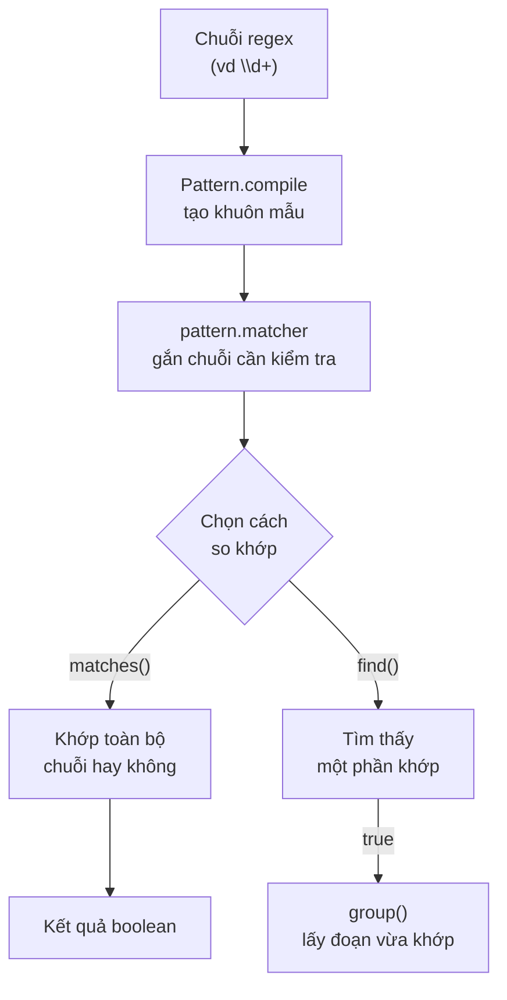

# 1. Biểu thức chính quy (Regular Expressions)

Biểu thức chính quy (regex) là một chuỗi ký tự đặc biệt dùng để mô tả khuôn mẫu của văn bản, từ đó kiểm tra hoặc tìm kiếm chuỗi. Đây là công cụ rất hay dùng để xác thực dữ liệu nhập như email, số điện thoại hay định dạng ngày tháng. Bài này giới thiệu các ký tự cơ bản, hai lớp `Pattern` và `Matcher`, kèm ví dụ thực tế; chi tiết nằm bên dưới.

[](pathname:///img/java/regular-expressions.webp)

---

:::note[Ghi nhớ nhanh]

- ⭐ **Regex là khuôn mẫu mô tả văn bản** — dùng để kiểm tra/tìm/thay chuỗi, thay cho hàng chục dòng so khớp thủ công.
- ⭐ **`Pattern` và `Matcher`** — `Pattern.compile()` biên dịch khuôn mẫu, `pattern.matcher()` tạo bộ so khớp cho chuỗi cụ thể (gói `java.util.regex`).
- **`matches()` vs `find()` vs `group()`** — `matches()` khớp **toàn bộ** chuỗi, `find()` khớp **một phần**, `group()` lấy đoạn vừa khớp (phải gọi sau `find()`).
- **Ký tự cơ bản** — `\d` (số), `\w` (chữ/số/`_`), `\s` (khoảng trắng), `.` (bất kỳ), `*` `+` `?` (lặp), `{n}`, `[]`, `()`, `^`/`$`.
- **Cạm bẫy Java** — phải viết `\\d` thay vì `\d`; muốn khớp dấu chấm thật phải escape `\\.`.

:::

---

## Mục lục

- [Vì sao có regex?](#vì-sao-có-regex)
- [Regex là gì?](#regex-là-gì)
- [Hai lớp quan trọng: Pattern và Matcher](#hai-lớp-quan-trọng-pattern-và-matcher)
- [Các ký tự đặc biệt cơ bản](#các-ký-tự-đặc-biệt-cơ-bản)
- [Các phương thức matches, find, group](#các-phương-thức-matches-find-group)
- [Ví dụ thực tế: kiểm tra email](#ví-dụ-thực-tế-kiểm-tra-email)
- [Ví dụ thực tế: kiểm tra số điện thoại](#ví-dụ-thực-tế-kiểm-tra-số-điện-thoại)
- [Lỗi thường gặp](#lỗi-thường-gặp)
- [Tóm tắt](#tóm-tắt)
- [Câu hỏi phỏng vấn](#câu-hỏi-phỏng-vấn)

---

## Vì sao có regex?

**Vấn đề:** Khi cần kiểm tra, tìm hoặc thay chuỗi theo một **mẫu** (email hợp lệ, số điện thoại, tách dòng log), nếu viết bằng vòng lặp và so từng ký tự thủ công thì code rất dài, khó đọc và dễ sai.

```java
// Kiểm tra "đúng 10 chữ số" bằng vòng lặp thủ công
public static boolean laSoDienThoai(String s) {
    if (s.length() != 10) return false;
    for (int i = 0; i < s.length(); i++) {
        char c = s.charAt(i);
        if (c < '0' || c > '9') return false; // không phải chữ số
    }
    return true;
}
// Mỗi quy tắc mới (bắt đầu bằng 0, có dấu +, dấu cách...) lại thêm một đống if
```

**Giải pháp:** Dùng **Regular Expression** (`Pattern`/`Matcher` trong `java.util.regex`) — một **ngôn ngữ mô tả mẫu** ngắn gọn để match/find/replace. Một biểu thức thay cho hàng chục dòng so khớp tay.

```java
// Cùng yêu cầu trên, viết bằng regex
public static boolean laSoDienThoai(String s) {
    return s.matches("\\d{10}"); // đúng 10 chữ số
}
```

:::tip[Dùng thực tế]

- **Validate dữ liệu nhập**: kiểm tra email, số điện thoại đúng định dạng trước khi lưu.
- **Trích xuất thông tin**: lấy mã lỗi, IP, thời gian từ một dòng log.
- **Tách chuỗi theo mẫu**: dùng `split` để cắt chuỗi theo dấu phẩy, khoảng trắng, hay nhiều dấu phân cách.
- **Tìm – thay thế nâng cao**: dùng `replaceAll` để chuẩn hóa văn bản (gộp nhiều khoảng trắng, xóa ký tự thừa).

:::

---

## Regex là gì?

**Regex** (Regular Expression — biểu thức chính quy) là một chuỗi ký tự đặc biệt dùng để **mô tả một khuôn mẫu (pattern) của văn bản**.

Hãy tưởng tượng bạn đang tìm một người trong đám đông qua đặc điểm: "mặc áo đỏ, đội mũ trắng". Câu mô tả đó chính là một "khuôn mẫu". Regex cũng vậy, nhưng dùng để mô tả khuôn mẫu của **chữ và số**.

Ví dụ đời thường:
- "Một dãy gồm đúng 10 chữ số" → dùng kiểm tra số điện thoại.
- "Có ký tự @ ở giữa và có dấu chấm phía sau" → dùng kiểm tra email.

Trong Java, regex nằm trong gói (package) `java.util.regex`.

---

## Hai lớp quan trọng: Pattern và Matcher

Để làm việc với regex, Java cung cấp hai lớp chính:

- **`Pattern`** (khuôn mẫu): đại diện cho chính cái khuôn mẫu regex đã được "biên dịch" (compile) sẵn để dùng nhanh.
- **`Matcher`** (bộ so khớp): dùng khuôn mẫu đó để kiểm tra một chuỗi cụ thể có khớp hay không.

```java
import java.util.regex.Pattern;
import java.util.regex.Matcher;

public class RegexBasic {
    public static void main(String[] args) {
        // Bước 1: Tạo khuôn mẫu — ở đây là "một hoặc nhiều chữ số"
        Pattern pattern = Pattern.compile("\\d+");

        // Bước 2: Tạo bộ so khớp với chuỗi cần kiểm tra
        Matcher matcher = pattern.matcher("Tôi 25 tuổi");

        // Bước 3: Tìm xem có đoạn nào khớp không
        if (matcher.find()) {
            // group() trả về đoạn văn bản đã khớp
            System.out.println("Tìm thấy số: " + matcher.group()); // In ra: 25
        }
    }
}
```

> **Lưu ý dấu `\\`**: Trong Java, ký tự `\` phải viết thành `\\` trong chuỗi. Vì vậy regex `\d` (chữ số) phải viết là `"\\d"` trong code Java.

Sơ đồ dưới đây tóm tắt luồng xử lý regex từ khuôn mẫu tới kết quả:



---

## Các ký tự đặc biệt cơ bản

Đây là những "viên gạch" để xây regex. Bạn nên thuộc lòng các ký tự này:

| Ký hiệu | Ý nghĩa | Ví dụ khớp |
|---------|---------|------------|
| `\d` | Một chữ số (digit) 0–9 | `5`, `0` |
| `\w` | Một ký tự "từ" (word): chữ cái, số, gạch dưới | `a`, `9`, `_` |
| `\s` | Một khoảng trắng (space, tab...) | dấu cách |
| `.` | Một ký tự bất kỳ (trừ xuống dòng) | `a`, `7`, `@` |
| `*` | Lặp 0 lần trở lên | `\d*` khớp `""`, `12` |
| `+` | Lặp 1 lần trở lên | `\d+` khớp `1`, `123` |
| `?` | Lặp 0 hoặc 1 lần (tùy chọn) | `colou?r` khớp `color` |
| `[]` | Tập hợp ký tự cho phép | `[abc]` khớp `a` hoặc `b` |
| `()` | Nhóm (group) các ký tự lại | `(ab)+` khớp `abab` |

Vài ký hiệu mở rộng hữu ích:

| Ký hiệu | Ý nghĩa |
|---------|---------|
| `{n}` | Lặp đúng `n` lần (ví dụ `\d{4}` = đúng 4 chữ số) |
| `{n,m}` | Lặp từ `n` đến `m` lần |
| `^` | Bắt đầu chuỗi |
| `$` | Kết thúc chuỗi |
| `[a-z]` | Một chữ cái thường từ a đến z |

```java
// Ví dụ minh họa các ký tự
Pattern p1 = Pattern.compile("[a-z]+");   // Một hoặc nhiều chữ thường
Pattern p2 = Pattern.compile("\\d{3}");   // Đúng 3 chữ số
Pattern p3 = Pattern.compile("a.c");      // a, một ký tự bất kỳ, rồi c
// "abc", "axc", "a9c" đều khớp p3
```

---

## Các phương thức matches, find, group

Ba phương thức bạn dùng nhiều nhất:

- **`matches()`**: kiểm tra **toàn bộ** chuỗi có khớp khuôn mẫu hay không. Phải khớp từ đầu đến cuối.
- **`find()`**: tìm xem **có một phần** nào trong chuỗi khớp không (không cần khớp hết).
- **`group()`**: lấy ra đoạn văn bản vừa khớp sau khi gọi `find()`.

```java
public class RegexMethods {
    public static void main(String[] args) {
        Pattern pattern = Pattern.compile("\\d+");

        // matches(): toàn bộ chuỗi phải là số
        Matcher m1 = pattern.matcher("12345");
        System.out.println(m1.matches()); // true — cả chuỗi là số

        Matcher m2 = pattern.matcher("abc123");
        System.out.println(m2.matches()); // false — có chữ "abc"

        // find(): chỉ cần một phần khớp
        Matcher m3 = pattern.matcher("abc123");
        System.out.println(m3.find());    // true — tìm thấy "123"
        System.out.println(m3.group());   // 123 — đoạn vừa khớp
    }
}
```

Cách viết nhanh: dùng `String.matches()` cho trường hợp đơn giản:

```java
// Kiểm tra nhanh chuỗi có phải toàn chữ số không
boolean ketQua = "12345".matches("\\d+"); // true
```

---

## Ví dụ thực tế: kiểm tra email

Một email cơ bản gồm: phần tên + `@` + tên miền + `.` + đuôi (như `.com`).

```java
public class EmailValidator {

    // Khuôn mẫu email đơn giản, dễ hiểu cho người mới
    private static final String EMAIL_REGEX =
            "^[\\w.+-]+@[\\w-]+\\.[a-z]{2,}$";
    // Giải thích:
    // ^                bắt đầu chuỗi
    // [\w.+-]+         một hoặc nhiều ký tự chữ/số/. /+ /- (phần tên)
    // @                bắt buộc có dấu @
    // [\w-]+           tên miền (chữ, số, gạch ngang)
    // \.               dấu chấm (phải escape vì . là ký tự đặc biệt)
    // [a-z]{2,}        đuôi tối thiểu 2 chữ cái (com, net, org...)
    // $                kết thúc chuỗi

    public static boolean isValid(String email) {
        // Pattern.CASE_INSENSITIVE: không phân biệt hoa/thường
        Pattern pattern = Pattern.compile(EMAIL_REGEX, Pattern.CASE_INSENSITIVE);
        return pattern.matcher(email).matches();
    }

    public static void main(String[] args) {
        System.out.println(isValid("nam@gmail.com"));   // true
        System.out.println(isValid("an.le@cong-ty.vn")); // true
        System.out.println(isValid("sai@@gmail.com"));   // false
        System.out.println(isValid("khong-co-at.com"));  // false (thiếu @)
    }
}
```

---

## Ví dụ thực tế: kiểm tra số điện thoại

Số điện thoại Việt Nam thường bắt đầu bằng `0` và có 10 chữ số.

```java
public class PhoneValidator {

    // Bắt đầu bằng 0, theo sau là đúng 9 chữ số => tổng 10 số
    private static final String PHONE_REGEX = "^0\\d{9}$";
    // ^0       bắt đầu bằng số 0
    // \d{9}    đúng 9 chữ số tiếp theo
    // $        kết thúc

    public static boolean isValidPhone(String phone) {
        return phone.matches(PHONE_REGEX);
    }

    public static void main(String[] args) {
        System.out.println(isValidPhone("0901234567")); // true (10 số)
        System.out.println(isValidPhone("123456"));      // false (không bắt đầu bằng 0)
        System.out.println(isValidPhone("09012345"));    // false (thiếu số)
        System.out.println(isValidPhone("0901234abc"));  // false (có chữ)
    }
}
```

---

## Lỗi thường gặp

1. **Quên `\\` trong Java**: Viết `"\d"` sẽ báo lỗi biên dịch. Phải viết `"\\d"`.
2. **Nhầm `matches()` và `find()`**: `matches()` yêu cầu khớp toàn bộ chuỗi; nhiều người mong nó tìm "một phần" giống `find()`.
3. **Quên escape dấu `.`**: Trong regex `.` nghĩa là "ký tự bất kỳ". Muốn khớp dấu chấm thật phải viết `\\.`.
4. **Gọi `group()` trước `find()`**: Sẽ ném ngoại lệ `IllegalStateException`. Luôn gọi `find()` (và kiểm tra `true`) trước.
5. **Regex quá phức tạp**: Người mới nên giữ regex đơn giản, dễ đọc thay vì cố nhồi mọi quy tắc vào một dòng.

---

## Tóm tắt

- **Regex** là khuôn mẫu mô tả văn bản, dùng để kiểm tra và tìm kiếm chuỗi.
- Dùng **`Pattern.compile()`** tạo khuôn mẫu, rồi **`pattern.matcher()`** tạo bộ so khớp.
- Ký tự cơ bản cần nhớ: `\d` (số), `\w` (chữ/số), `.` (bất kỳ), `*` `+` `?` (lặp), `[]` (tập hợp), `()` (nhóm).
- **`matches()`** khớp toàn bộ, **`find()`** khớp một phần, **`group()`** lấy đoạn vừa khớp.
- Ứng dụng phổ biến: kiểm tra email, số điện thoại, định dạng dữ liệu nhập.

---

## Câu hỏi phỏng vấn

Những câu thường gặp về chủ đề này. Tự trả lời trước, rồi bấm **Xem đáp án** để đối chiếu.

**1. `Pattern` và `Matcher` mỗi lớp đảm nhận vai trò gì? Vì sao Java tách thành hai lớp riêng thay vì gộp chung?**

<details className="qa">
<summary>Xem đáp án</summary>

- **`Pattern`**: đại diện cho khuôn mẫu regex đã được **biên dịch (compile)** — quá trình phân tích cú pháp regex thành cấu trúc nội bộ tối ưu để so khớp nhanh. Tạo bằng `Pattern.compile(regex)`.
- **`Matcher`**: gắn một `Pattern` đã biên dịch với một chuỗi **cụ thể** cần kiểm tra, cung cấp các thao tác `matches()`, `find()`, `group()`.
- Tách riêng để **tái sử dụng** `Pattern` (chi phí compile chỉ trả một lần) cho nhiều chuỗi khác nhau, mà không phải biên dịch lại regex mỗi lần so khớp — quan trọng khi so khớp hàng nghìn chuỗi với cùng một mẫu (ví dụ lọc log).

```java
Pattern pattern = Pattern.compile("\\d+"); // compile 1 lần
for (String dong : danhSachDong) {
    Matcher matcher = pattern.matcher(dong); // tái sử dụng pattern
    if (matcher.find()) { /* ... */ }
}
```

</details>

**2. So sánh `matches()`, `find()` và `lookingAt()` của `Matcher`.**

<details className="qa">
<summary>Xem đáp án</summary>

| Phương thức | Yêu cầu khớp |
|---|---|
| `matches()` | Toàn bộ chuỗi phải khớp từ đầu đến cuối |
| `lookingAt()` | Chỉ cần khớp từ **đầu chuỗi** trở đi (không cần hết chuỗi) |
| `find()` | Khớp **bất kỳ đoạn nào** trong chuỗi, có thể gọi lặp lại để tìm các lần khớp tiếp theo |

```java
Matcher m = Pattern.compile("\\d+").matcher("123abc");
System.out.println(m.matches());    // false — "abc" phía sau không phải số
System.out.println(m.lookingAt());  // true  — "123" ở đầu khớp, không cần hết chuỗi
System.out.println(m.find());       // true  — tìm thấy "123" ở đâu đó trong chuỗi
```

`lookingAt()` ít gặp hơn hai phương thức còn lại nhưng vẫn hay bị hỏi để kiểm tra hiểu rõ khác biệt với `matches()`.

</details>

**3. Vì sao nên `Pattern.compile()` một lần rồi tái sử dụng, thay vì gọi `String.matches(regex)` lặp lại trong vòng lặp lớn?**

<details className="qa">
<summary>Xem đáp án</summary>

`String.matches(regex)` thực chất gọi `Pattern.compile(regex).matcher(this).matches()` bên trong — nghĩa là **biên dịch lại regex từ đầu mỗi lần gọi**. Việc biên dịch (phân tích cú pháp regex, dựng máy trạng thái so khớp) tốn chi phí đáng kể so với việc so khớp thực tế.

```java
// CHẬM: compile lại regex ở MỖI vòng lặp
for (String dong : trieuDong) {
    if (dong.matches("\\d{3}-\\d{4}")) { /* ... */ }
}

// NHANH: compile một lần, tái sử dụng Pattern cho mọi vòng lặp
Pattern pattern = Pattern.compile("\\d{3}-\\d{4}");
for (String dong : trieuDong) {
    if (pattern.matcher(dong).matches()) { /* ... */ }
}
```

Với vòng lặp nhỏ vài chục lần thì khác biệt không đáng kể, nhưng với hàng nghìn/triệu lần lặp (xử lý log, validate dữ liệu hàng loạt) thì việc tái sử dụng `Pattern` giúp tiết kiệm đáng kể thời gian.

</details>

**4. Output của đoạn code sau là gì? Giải thích khác biệt giữa quantifier "tham lam" (greedy) và "lười" (reluctant).**

```java
String html = "<b>Java</b> va <i>Kotlin</i>";
Matcher greedy = Pattern.compile("<.+>").matcher(html);
Matcher lazy = Pattern.compile("<.+?>").matcher(html);

greedy.find();
System.out.println(greedy.group());

lazy.find();
System.out.println(lazy.group());
```

<details className="qa">
<summary>Xem đáp án</summary>

Output:
```text
<b>Java</b> va <i>Kotlin</i>
<b>
```

- `<.+>` là quantifier **tham lam (greedy)** — mặc định `+` cố gắng khớp **nhiều nhất có thể**, rồi chỉ lùi lại (backtrack) khi cần để toàn bộ pattern khớp được. Vì vậy nó "nuốt" từ `<` đầu tiên cho tới `>` **cuối cùng** trong cả chuỗi.
- `<.+?>` thêm dấu `?` sau `+` biến nó thành **lười (reluctant/lazy)** — khớp **ít nhất có thể**, chỉ mở rộng thêm khi bắt buộc. Vì vậy nó dừng lại ở `>` **gần nhất**, cho ra `<b>`.
- Cạm bẫy kinh điển khi parse thẻ HTML/XML bằng regex: quên `?` sẽ vô tình khớp tham lam qua nhiều thẻ, cắt sai vị trí.

</details>

**5. Capturing group là gì? `group()` (hay `group(0)`) khác gì `group(1)`?**

<details className="qa">
<summary>Xem đáp án</summary>

**Capturing group** (nhóm bắt) là phần regex đặt trong dấu ngoặc đơn `()`, dùng để **tách riêng** một phần của chuỗi vừa khớp ra để lấy lại sau này.

```java
Pattern pattern = Pattern.compile("(\\d{4})-(\\d{2})-(\\d{2})"); // yyyy-MM-dd
Matcher matcher = pattern.matcher("Ngày sinh: 2026-09-28");

if (matcher.find()) {
    System.out.println(matcher.group());  // "2026-09-28" — toàn bộ đoạn khớp (= group(0))
    System.out.println(matcher.group(1)); // "2026" — nhóm thứ 1 (năm)
    System.out.println(matcher.group(2)); // "09"   — nhóm thứ 2 (tháng)
    System.out.println(matcher.group(3)); // "28"   — nhóm thứ 3 (ngày)
}
```

- `group()` không tham số (tương đương `group(0)`) luôn trả về **toàn bộ đoạn văn bản** mà pattern vừa khớp được, kể cả phần nằm ngoài mọi nhóm con.
- `group(n)` với `n >= 1` trả về đúng nội dung của nhóm bắt thứ `n` (đếm từ 1, theo thứ tự dấu `(` mở đầu xuất hiện).

</details>

**6. Named capturing group (Java 7+) là gì? Viết ví dụ dùng nó để parse ngày tháng.**

<details className="qa">
<summary>Xem đáp án</summary>

**Named capturing group** cho phép đặt **tên** cho một nhóm thay vì chỉ nhớ chỉ số, giúp code dễ đọc hơn khi có nhiều nhóm. Cú pháp: `(?<tenNhom>...)`, lấy giá trị bằng `matcher.group("tenNhom")`.

```java
Pattern pattern = Pattern.compile("(?<nam>\\d{4})-(?<thang>\\d{2})-(?<ngay>\\d{2})");
Matcher matcher = pattern.matcher("2026-09-28");

if (matcher.matches()) {
    System.out.println("Năm: " + matcher.group("nam"));
    System.out.println("Tháng: " + matcher.group("thang"));
    System.out.println("Ngày: " + matcher.group("ngay"));
}
```

Ưu điểm: nếu sau này thêm/bớt nhóm ở giữa pattern, code lấy giá trị theo tên vẫn đúng, không bị lệch chỉ số như `group(1)`, `group(2)`.

</details>

**7. Output của đoạn code sau là gì? Vì sao?**

```java
String[] parts = "a,,b,".split(",");
System.out.println(parts.length);
for (String p : parts) {
    System.out.println("[" + p + "]");
}
```

<details className="qa">
<summary>Xem đáp án</summary>

Output:
```text
3
[a]
[]
[b]
```

- `split(regex)` mặc định (giới hạn `limit = 0`) **loại bỏ mọi chuỗi rỗng ở cuối** kết quả, nhưng vẫn **giữ lại chuỗi rỗng ở giữa**.
- Chuỗi `"a,,b,"` bị tách bởi dấu phẩy thành `["a", "", "b", ""]` về mặt logic, nhưng phần tử rỗng cuối cùng (do dấu phẩy cuối chuỗi) bị cắt bỏ, còn lại `["a", "", "b"]` — độ dài 3.
- Muốn **giữ nguyên** cả chuỗi rỗng ở cuối, phải truyền `limit` âm: `"a,,b,".split(",", -1)` sẽ cho `["a", "", "b", ""]` (độ dài 4). Đây là cạm bẫy hay bị hỏi vì nhiều người tưởng `split` luôn giữ nguyên số phần tử tương ứng số dấu phân cách.

</details>

**8. `replaceAll()` với backreference (`$1`, `$2`...) dùng để làm gì? Viết ví dụ đổi định dạng ngày `"2026-09-28"` thành `"28/09/2026"`.**

<details className="qa">
<summary>Xem đáp án</summary>

**Backreference** trong chuỗi thay thế của `replaceAll()` cho phép **chèn lại nội dung của capturing group** đã khớp được, thay vì chỉ thay bằng một chuỗi cố định.

```java
String ngay = "2026-09-28";
String ketQua = ngay.replaceAll("(\\d{4})-(\\d{2})-(\\d{2})", "$3/$2/$1");
System.out.println(ketQua); // "28/09/2026"
```

- `$1`, `$2`, `$3` tương ứng nội dung của nhóm 1 (năm), nhóm 2 (tháng), nhóm 3 (ngày) đã khớp.
- Ứng dụng thực tế: chuẩn hoá định dạng ngày tháng, đổi thứ tự tham số trong log, ẩn một phần thông tin nhạy cảm (ví dụ giữ lại 4 số cuối số thẻ, thay phần đầu bằng `*`).

</details>

**9. "Catastrophic backtracking" trong regex là gì? Cho ví dụ một pattern nguy hiểm.**

<details className="qa">
<summary>Xem đáp án</summary>

**Catastrophic backtracking** (bùng nổ quay lui) xảy ra khi regex có các nhóm lặp **lồng nhau và chồng lấn khả năng khớp** (ví dụ `(a+)+`), khiến bộ máy so khớp phải thử **số lượng tổ hợp tăng theo cấp số mũ** khi chuỗi đầu vào **không khớp** — làm chương trình bị treo (trông giống vô hạn vòng lặp), dù CPU thực ra đang chạy full nhưng cực kỳ chậm.

```java
// Pattern nguy hiểm: (a+)+ có thể khớp "aaaa" theo rất nhiều cách khác nhau
Pattern nguyHiem = Pattern.compile("(a+)+b");

// Chuỗi càng dài mà KHÔNG kết thúc bằng "b" thì thời gian chạy tăng theo cấp số mũ
String input = "aaaaaaaaaaaaaaaaaaaaaaaaaaaaaaaaaaaaaaaaaaaaaaaaaaaaaaaaaaaaaaaaaaac";
nguyHiem.matcher(input).matches(); // có thể treo chương trình nhiều giây/phút
```

Đây còn gọi là lỗ hổng bảo mật **ReDoS (Regular Expression Denial of Service)** nếu regex nhận input trực tiếp từ người dùng. Cách phòng tránh: tránh nhóm lặp lồng nhau không cần thiết, đặt giới hạn thời gian chạy (timeout) khi validate input từ bên ngoài, hoặc dùng thư viện regex có bảo vệ khỏi backtracking bùng nổ.

</details>

**10. Regex đơn giản như `EMAIL_REGEX` trong bài có đủ để validate email trong ứng dụng thực tế không? Nêu hướng xử lý tốt hơn.**

<details className="qa">
<summary>Xem đáp án</summary>

**Không hoàn toàn đủ.** Chuẩn địa chỉ email đầy đủ (RFC 5322) phức tạp hơn rất nhiều so với một regex ngắn gọn — có những email hợp lệ theo RFC nhưng bị regex đơn giản từ chối, và ngược lại một chuỗi khớp regex chưa chắc là địa chỉ email **thực sự tồn tại và nhận được thư**.

Hướng xử lý thực tế trong ứng dụng:
- Dùng regex đơn giản (như trong bài) chỉ để **lọc lỗi rõ ràng** ở tầng giao diện (thiếu `@`, thiếu đuôi domain...), không cố "bắt đúng 100%" theo RFC.
- **Xác thực thật sự** bằng cách gửi email chứa liên kết/mã xác nhận (confirmation link/OTP) — chỉ khi người dùng bấm vào hoặc nhập đúng mã mới coi là email hợp lệ và thuộc quyền sở hữu của họ.
- Với dự án Spring Boot, có thể dùng `@Email` của Bean Validation cho việc kiểm tra định dạng cơ bản, kết hợp với bước xác nhận qua email ở trên cho việc xác thực thực sự.

Đây là câu hỏi hay dùng để kiểm tra tư duy thực tế: biết regex có giới hạn, không tin tưởng mù quáng vào một pattern để giải quyết trọn vẹn bài toán validate.

</details>
