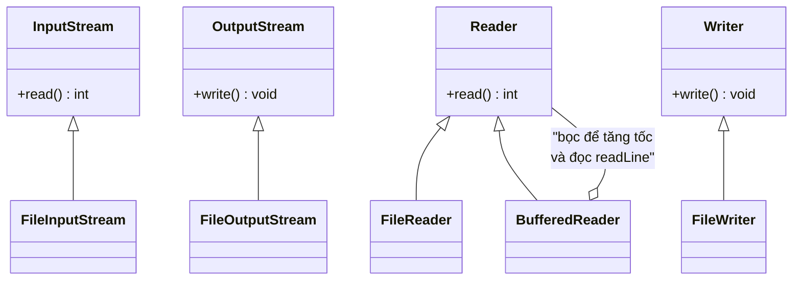

# 2. Thao tác I/O (Input/Output)

I/O (Input/Output) là cách chương trình đọc dữ liệu vào và ghi dữ liệu ra, ví dụ đọc file, ghi file hay nhận dữ liệu gõ từ bàn phím. Trong Java, dữ liệu di chuyển qua các luồng (stream), chia thành luồng byte cho file nhị phân và luồng ký tự cho văn bản. Bài này giới thiệu các lớp I/O cốt lõi như `InputStream`, `Reader`, `BufferedReader` và `Scanner`; chi tiết nằm bên dưới.

---

:::note[Ghi nhớ nhanh]

- ⭐ **I/O chảy qua luồng (stream)** — đọc/ghi tuần tự theo "dòng chảy" nên xử lý được dữ liệu lớn mà không cần nạp hết vào RAM (gói `java.io`).
- ⭐ **Byte stream vs character stream** — `InputStream`/`OutputStream` cho file nhị phân (ảnh, video); `Reader`/`Writer` cho văn bản (hiểu encoding, tránh lỗi font tiếng Việt).
- **`BufferedReader`** — bọc ngoài `FileReader` để đọc nhanh và dùng `readLine()` đọc theo từng dòng.
- **`Scanner`** — cách dễ nhất đọc dữ liệu bàn phím (`nextLine`, `nextInt`...); lưu ý cạm bẫy trộn `nextInt()` với `nextLine()`.
- **Luôn `try-with-resources`** — tự động đóng luồng kể cả khi lỗi, và nhớ xử lý `IOException`.

:::

---

## Mục lục

- [Vì sao Java dùng mô hình Stream cho I/O?](#vì-sao-java-dùng-mô-hình-stream-cho-io)
- [I/O là gì?](#io-là-gì)
- [Luồng byte và luồng ký tự](#luồng-byte-và-luồng-ký-tự)
- [InputStream và OutputStream (luồng byte)](#inputstream-và-outputstream-luồng-byte)
- [Reader và Writer (luồng ký tự)](#reader-và-writer-luồng-ký-tự)
- [BufferedReader — đọc hiệu quả theo dòng](#bufferedreader--đọc-hiệu-quả-theo-dòng)
- [Đọc dữ liệu từ bàn phím với Scanner](#đọc-dữ-liệu-từ-bàn-phím-với-scanner)
- [Lỗi thường gặp](#lỗi-thường-gặp)
- [Tóm tắt](#tóm-tắt)

---

## Vì sao Java dùng mô hình Stream cho I/O?

**Vấn đề:** Dữ liệu vào/ra đến từ **nhiều nguồn khác nhau** (file, mạng, console, bộ nhớ) và có thể **rất lớn**. Nếu mỗi nguồn xử lý theo một kiểu riêng, hoặc nạp toàn bộ vào RAM, thì vừa trùng lặp code vừa dễ tràn bộ nhớ.

```java
// File 1GB: nạp hết vào RAM -> OutOfMemoryError
byte[] tatCa = Files.readAllBytes(Path.of("video-1gb.mp4"));

// Mỗi nguồn một kiểu API riêng -> trùng lặp, khó tái sử dụng
String tuFile = docTuFile("data.txt");
String tuMang = docTuSocket(socket);
String tuConsole = docTuBanPhim();
```

**Giải pháp:** Java trừu tượng hóa I/O thành **Stream** (luồng dữ liệu tuần tự): đọc/ghi theo "dòng chảy" nên xử lý được dữ liệu lớn mà **không cần nạp hết**. Java tách **luồng byte** (`InputStream` / `OutputStream` — dữ liệu nhị phân) khỏi **luồng ký tự** (`Reader` / `Writer` — văn bản, hiểu encoding); thêm lớp **Buffered** để tăng tốc; và dùng **chung một API** cho mọi nguồn.

```java
// Đọc theo buffer: chỉ giữ một phần nhỏ trong RAM tại mỗi thời điểm
try (FileInputStream in = new FileInputStream("video-1gb.mp4")) {
    byte[] buffer = new byte[8192]; // 8KB mỗi lần
    int n;
    while ((n = in.read(buffer)) != -1) {
        xuLy(buffer, 0, n); // xử lý dần, không nạp hết
    }
}

// Cùng một API Reader cho mọi nguồn văn bản
BufferedReader fromFile = new BufferedReader(new FileReader("data.txt"));
BufferedReader fromNet  = new BufferedReader(new InputStreamReader(socket.getInputStream()));
```

:::tip[Dùng thực tế]
- **Đọc file lớn theo buffer**: xử lý log/video hàng GB mà RAM vẫn ổn định.
- **Copy dữ liệu giữa các nguồn**: đọc từ `InputStream` rồi ghi sang `OutputStream` (file → file, mạng → file).
- **Đọc văn bản đúng encoding**: dùng `Reader` (vd `InputStreamReader` với UTF-8) để tránh lỗi font tiếng Việt.
- **Đóng luồng an toàn**: dùng `try-with-resources` để stream luôn được đóng kể cả khi có lỗi.
:::

---

## I/O là gì?

**I/O** (Input/Output — nhập/xuất) là cách chương trình **đọc dữ liệu vào** (input) và **ghi dữ liệu ra** (output).

Ví dụ đời thường:
- **Input**: bạn gõ tên vào bàn phím, đọc nội dung từ một file.
- **Output**: chương trình in kết quả ra màn hình, ghi dữ liệu vào file.

Trong Java, dữ liệu di chuyển qua các **luồng (stream)**. Hãy tưởng tượng luồng như một **đường ống nước**: dữ liệu chảy từ nguồn (file, bàn phím, mạng) tới chương trình, hoặc ngược lại.

Các lớp I/O nằm trong gói `java.io`.

---

## Luồng byte và luồng ký tự

Java chia luồng làm hai loại chính:

- **Luồng byte (byte stream)**: xử lý dữ liệu dạng **byte thô** (số nhị phân). Phù hợp cho mọi loại file: ảnh, video, nhạc, file nén... Lớp gốc: `InputStream` và `OutputStream`.
- **Luồng ký tự (character stream)**: xử lý dữ liệu dạng **chữ (text)**. Phù hợp khi đọc/ghi văn bản, vì nó hiểu bảng mã (encoding) như UTF-8. Lớp gốc: `Reader` và `Writer`.

Quy tắc đơn giản cho người mới:
- Làm việc với **văn bản** → dùng `Reader` / `Writer`.
- Làm việc với **file nhị phân** (ảnh, nhạc...) → dùng `InputStream` / `OutputStream`.

Sơ đồ dưới đây minh họa phân cấp các lớp I/O cốt lõi trong `java.io`:



---

## InputStream và OutputStream (luồng byte)

`FileInputStream` đọc từng byte từ file; `FileOutputStream` ghi từng byte ra file.

```java
import java.io.FileInputStream;
import java.io.FileOutputStream;
import java.io.IOException;

public class CopyFileByte {
    public static void main(String[] args) {
        // try-with-resources: tự động đóng luồng khi xong
        try (FileInputStream in = new FileInputStream("anh-goc.jpg");
             FileOutputStream out = new FileOutputStream("anh-copy.jpg")) {

            byte[] buffer = new byte[1024]; // Vùng đệm 1KB để đọc nhiều byte một lúc
            int soByteDocDuoc;

            // read() trả về số byte đọc được, hoặc -1 khi hết file
            while ((soByteDocDuoc = in.read(buffer)) != -1) {
                // Ghi đúng số byte vừa đọc ra file đích
                out.write(buffer, 0, soByteDocDuoc);
            }
            System.out.println("Sao chép file thành công!");

        } catch (IOException e) {
            // IOException: lỗi liên quan tới đọc/ghi (file không tồn tại, đầy ổ cứng...)
            System.err.println("Lỗi khi sao chép file: " + e.getMessage());
        }
    }
}
```

---

## Reader và Writer (luồng ký tự)

Khi làm việc với **văn bản**, dùng `FileReader` và `FileWriter` để hiểu đúng chữ cái.

```java
import java.io.FileReader;
import java.io.FileWriter;
import java.io.IOException;

public class WriteText {
    public static void main(String[] args) {
        // Ghi văn bản ra file
        try (FileWriter writer = new FileWriter("ghichu.txt")) {
            writer.write("Xin chào Java I/O!\n");
            writer.write("Đây là dòng thứ hai.\n");
            System.out.println("Ghi file thành công!");
        } catch (IOException e) {
            System.err.println("Lỗi khi ghi: " + e.getMessage());
        }

        // Đọc văn bản từ file (đọc từng ký tự — chưa tối ưu)
        try (FileReader reader = new FileReader("ghichu.txt")) {
            int kyTu;
            while ((kyTu = reader.read()) != -1) {
                // read() trả về mã ký tự dạng int, ép kiểu (char) để hiển thị
                System.out.print((char) kyTu);
            }
        } catch (IOException e) {
            System.err.println("Lỗi khi đọc: " + e.getMessage());
        }
    }
}
```

---

## BufferedReader — đọc hiệu quả theo dòng

Đọc từng ký tự rất chậm. **`BufferedReader`** (bộ đọc có vùng đệm) gom nhiều ký tự vào bộ nhớ rồi xử lý một lần, nhanh hơn nhiều. Nó còn có phương thức tiện lợi `readLine()` để đọc **từng dòng**.

```java
import java.io.BufferedReader;
import java.io.FileReader;
import java.io.IOException;

public class ReadByLine {
    public static void main(String[] args) {
        // Bọc FileReader bằng BufferedReader để đọc nhanh và theo dòng
        try (BufferedReader reader = new BufferedReader(new FileReader("ghichu.txt"))) {
            String dong;
            int soThuTu = 1;

            // readLine() trả về một dòng, hoặc null khi hết file
            while ((dong = reader.readLine()) != null) {
                System.out.println("Dòng " + soThuTu + ": " + dong);
                soThuTu++;
            }
        } catch (IOException e) {
            System.err.println("Lỗi khi đọc file: " + e.getMessage());
        }
    }
}
```

> **Mẹo**: Hầu như lúc nào đọc văn bản bạn cũng nên bọc `BufferedReader` ra ngoài `FileReader` để có tốc độ tốt và dùng được `readLine()`.

---

## Đọc dữ liệu từ bàn phím với Scanner

**`Scanner`** là cách đơn giản nhất để đọc dữ liệu người dùng gõ từ bàn phím. Nó nằm trong gói `java.util`.

```java
import java.util.Scanner;

public class KeyboardInput {
    public static void main(String[] args) {
        // System.in là luồng nhập từ bàn phím
        Scanner scanner = new Scanner(System.in);

        System.out.print("Nhập tên của bạn: ");
        String ten = scanner.nextLine(); // Đọc cả dòng (gồm khoảng trắng)

        System.out.print("Nhập tuổi của bạn: ");
        int tuoi = scanner.nextInt();     // Đọc một số nguyên

        System.out.println("Chào " + ten + ", bạn " + tuoi + " tuổi!");

        // Đóng scanner khi không dùng nữa để giải phóng tài nguyên
        scanner.close();
    }
}
```

Các phương thức `Scanner` thường dùng:

| Phương thức | Đọc gì |
|-------------|--------|
| `nextLine()` | Cả một dòng (kể cả khoảng trắng) |
| `next()` | Một "từ" (đến khoảng trắng đầu tiên) |
| `nextInt()` | Một số nguyên |
| `nextDouble()` | Một số thực |

---

## Lỗi thường gặp

1. **Quên đóng luồng**: Nếu không đóng, file có thể bị khóa hoặc rò rỉ tài nguyên. Hãy dùng **try-with-resources** (`try (...) {}`) để Java tự đóng.
2. **Dùng luồng byte cho văn bản tiếng Việt**: Dễ bị lỗi font/dấu. Hãy dùng `Reader`/`Writer` cho text.
3. **Trộn `nextInt()` và `nextLine()`**: Sau `nextInt()`, ký tự xuống dòng còn sót lại khiến `nextLine()` đọc rỗng. Cần đọc thêm một `nextLine()` để "dọn" hoặc đọc tất cả bằng `nextLine()` rồi tự chuyển kiểu.
4. **Không bắt `IOException`**: Các thao tác I/O luôn có thể lỗi (file không tồn tại, hết dung lượng). Phải xử lý ngoại lệ.
5. **Đọc từng ký tự không có vùng đệm**: Rất chậm với file lớn. Luôn dùng `BufferedReader`.

---

## Tóm tắt

- **I/O** là việc nhập dữ liệu vào và xuất dữ liệu ra qua các **luồng (stream)**.
- **Luồng byte** (`InputStream`/`OutputStream`) cho file nhị phân; **luồng ký tự** (`Reader`/`Writer`) cho văn bản.
- **`BufferedReader`** giúp đọc nhanh và đọc theo từng dòng với `readLine()`.
- **`Scanner`** là cách dễ nhất để đọc dữ liệu từ bàn phím.
- Luôn dùng **try-with-resources** để tự động đóng luồng và xử lý `IOException` cẩn thận.
