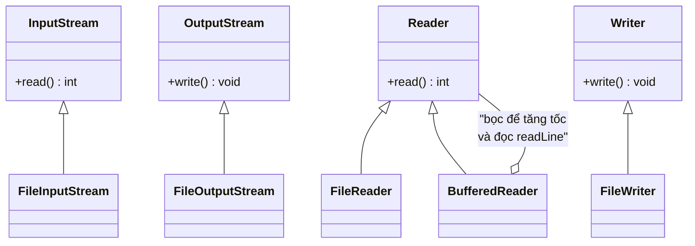

# 2. Thao tác I/O (Input/Output)

I/O (Input/Output) là cách chương trình đọc dữ liệu vào và ghi dữ liệu ra, ví dụ đọc file, ghi file hay nhận dữ liệu gõ từ bàn phím. Trong Java, dữ liệu di chuyển qua các luồng (stream), chia thành luồng byte cho file nhị phân và luồng ký tự cho văn bản. Bài này giới thiệu các lớp I/O cốt lõi như `InputStream`, `Reader`, `BufferedReader` và `Scanner`; chi tiết nằm bên dưới.

[](pathname:///img/java/io-operations.webp)

---

:::note[Ghi nhớ nhanh]

- ⭐ **I/O chảy qua luồng (stream)** — đọc/ghi tuần tự theo "dòng chảy" nên xử lý được dữ liệu lớn mà không cần nạp hết vào RAM (gói `java.io`).
- ⭐ **Byte stream vs character stream** — `InputStream`/`OutputStream` cho file nhị phân (ảnh, video); `Reader`/`Writer` cho văn bản (hiểu encoding, tránh lỗi font tiếng Việt).
- **`BufferedReader`** — bọc ngoài `FileReader` để đọc nhanh và dùng `readLine()` đọc theo từng dòng.
- **`Scanner`** — cách dễ nhất đọc dữ liệu bàn phím (`nextLine`, `nextInt`...); lưu ý cạm bẫy trộn `nextInt()` với `nextLine()`.
- **Luôn `try-with-resources`** — tự động đóng luồng kể cả khi lỗi, và nhớ xử lý `IOException`.

:::

---

## Mục lục

- [Vì sao Java dùng mô hình Stream cho I/O?](#vì-sao-java-dùng-mô-hình-stream-cho-io)
- [I/O là gì?](#io-là-gì)
- [Luồng byte và luồng ký tự](#luồng-byte-và-luồng-ký-tự)
- [InputStream và OutputStream (luồng byte)](#inputstream-và-outputstream-luồng-byte)
- [Reader và Writer (luồng ký tự)](#reader-và-writer-luồng-ký-tự)
- [BufferedReader — đọc hiệu quả theo dòng](#bufferedreader--đọc-hiệu-quả-theo-dòng)
- [Đọc dữ liệu từ bàn phím với Scanner](#đọc-dữ-liệu-từ-bàn-phím-với-scanner)
- [Lỗi thường gặp](#lỗi-thường-gặp)
- [Tóm tắt](#tóm-tắt)
- [Câu hỏi phỏng vấn](#câu-hỏi-phỏng-vấn)

---

## Vì sao Java dùng mô hình Stream cho I/O?

**Vấn đề:** Dữ liệu vào/ra đến từ **nhiều nguồn khác nhau** (file, mạng, console, bộ nhớ) và có thể **rất lớn**. Nếu mỗi nguồn xử lý theo một kiểu riêng, hoặc nạp toàn bộ vào RAM, thì vừa trùng lặp code vừa dễ tràn bộ nhớ.

```java
// File 1GB: nạp hết vào RAM -> OutOfMemoryError
byte[] tatCa = Files.readAllBytes(Path.of("video-1gb.mp4"));

// Mỗi nguồn một kiểu API riêng -> trùng lặp, khó tái sử dụng
String tuFile = docTuFile("data.txt");
String tuMang = docTuSocket(socket);
String tuConsole = docTuBanPhim();
```

**Giải pháp:** Java trừu tượng hóa I/O thành **Stream** (luồng dữ liệu tuần tự): đọc/ghi theo "dòng chảy" nên xử lý được dữ liệu lớn mà **không cần nạp hết**. Java tách **luồng byte** (`InputStream` / `OutputStream` — dữ liệu nhị phân) khỏi **luồng ký tự** (`Reader` / `Writer` — văn bản, hiểu encoding); thêm lớp **Buffered** để tăng tốc; và dùng **chung một API** cho mọi nguồn.

```java
// Đọc theo buffer: chỉ giữ một phần nhỏ trong RAM tại mỗi thời điểm
try (FileInputStream in = new FileInputStream("video-1gb.mp4")) {
    byte[] buffer = new byte[8192]; // 8KB mỗi lần
    int n;
    while ((n = in.read(buffer)) != -1) {
        xuLy(buffer, 0, n); // xử lý dần, không nạp hết
    }
}

// Cùng một API Reader cho mọi nguồn văn bản
BufferedReader fromFile = new BufferedReader(new FileReader("data.txt"));
BufferedReader fromNet  = new BufferedReader(new InputStreamReader(socket.getInputStream()));
```

:::tip[Dùng thực tế]
- **Đọc file lớn theo buffer**: xử lý log/video hàng GB mà RAM vẫn ổn định.
- **Copy dữ liệu giữa các nguồn**: đọc từ `InputStream` rồi ghi sang `OutputStream` (file → file, mạng → file).
- **Đọc văn bản đúng encoding**: dùng `Reader` (vd `InputStreamReader` với UTF-8) để tránh lỗi font tiếng Việt.
- **Đóng luồng an toàn**: dùng `try-with-resources` để stream luôn được đóng kể cả khi có lỗi.
:::

---

## I/O là gì?

**I/O** (Input/Output — nhập/xuất) là cách chương trình **đọc dữ liệu vào** (input) và **ghi dữ liệu ra** (output).

Ví dụ đời thường:
- **Input**: bạn gõ tên vào bàn phím, đọc nội dung từ một file.
- **Output**: chương trình in kết quả ra màn hình, ghi dữ liệu vào file.

Trong Java, dữ liệu di chuyển qua các **luồng (stream)**. Hãy tưởng tượng luồng như một **đường ống nước**: dữ liệu chảy từ nguồn (file, bàn phím, mạng) tới chương trình, hoặc ngược lại.

Các lớp I/O nằm trong gói `java.io`.

---

## Luồng byte và luồng ký tự

Java chia luồng làm hai loại chính:

- **Luồng byte (byte stream)**: xử lý dữ liệu dạng **byte thô** (số nhị phân). Phù hợp cho mọi loại file: ảnh, video, nhạc, file nén... Lớp gốc: `InputStream` và `OutputStream`.
- **Luồng ký tự (character stream)**: xử lý dữ liệu dạng **chữ (text)**. Phù hợp khi đọc/ghi văn bản, vì nó hiểu bảng mã (encoding) như UTF-8. Lớp gốc: `Reader` và `Writer`.

Quy tắc đơn giản cho người mới:
- Làm việc với **văn bản** → dùng `Reader` / `Writer`.
- Làm việc với **file nhị phân** (ảnh, nhạc...) → dùng `InputStream` / `OutputStream`.

Sơ đồ dưới đây minh họa phân cấp các lớp I/O cốt lõi trong `java.io`:


```mermaid
classDiagram
    class InputStream {
        +read() int
    }
    class OutputStream {
        +write() void
    }
    class Reader {
        +read() int
    }
    class Writer {
        +write() void
    }

    InputStream <|-- FileInputStream
    OutputStream <|-- FileOutputStream
    Reader <|-- FileReader
    Writer <|-- FileWriter
    Reader <|-- BufferedReader
    BufferedReader o-- Reader : "bọc để tăng tốc<br/>và đọc readLine"
```

---

## InputStream và OutputStream (luồng byte)

`FileInputStream` đọc từng byte từ file; `FileOutputStream` ghi từng byte ra file.

```java
import java.io.FileInputStream;
import java.io.FileOutputStream;
import java.io.IOException;

public class CopyFileByte {
    public static void main(String[] args) {
        // try-with-resources: tự động đóng luồng khi xong
        try (FileInputStream in = new FileInputStream("anh-goc.jpg");
             FileOutputStream out = new FileOutputStream("anh-copy.jpg")) {

            byte[] buffer = new byte[1024]; // Vùng đệm 1KB để đọc nhiều byte một lúc
            int soByteDocDuoc;

            // read() trả về số byte đọc được, hoặc -1 khi hết file
            while ((soByteDocDuoc = in.read(buffer)) != -1) {
                // Ghi đúng số byte vừa đọc ra file đích
                out.write(buffer, 0, soByteDocDuoc);
            }
            System.out.println("Sao chép file thành công!");

        } catch (IOException e) {
            // IOException: lỗi liên quan tới đọc/ghi (file không tồn tại, đầy ổ cứng...)
            System.err.println("Lỗi khi sao chép file: " + e.getMessage());
        }
    }
}
```

---

## Reader và Writer (luồng ký tự)

Khi làm việc với **văn bản**, dùng `FileReader` và `FileWriter` để hiểu đúng chữ cái.

```java
import java.io.FileReader;
import java.io.FileWriter;
import java.io.IOException;

public class WriteText {
    public static void main(String[] args) {
        // Ghi văn bản ra file
        try (FileWriter writer = new FileWriter("ghichu.txt")) {
            writer.write("Xin chào Java I/O!\n");
            writer.write("Đây là dòng thứ hai.\n");
            System.out.println("Ghi file thành công!");
        } catch (IOException e) {
            System.err.println("Lỗi khi ghi: " + e.getMessage());
        }

        // Đọc văn bản từ file (đọc từng ký tự — chưa tối ưu)
        try (FileReader reader = new FileReader("ghichu.txt")) {
            int kyTu;
            while ((kyTu = reader.read()) != -1) {
                // read() trả về mã ký tự dạng int, ép kiểu (char) để hiển thị
                System.out.print((char) kyTu);
            }
        } catch (IOException e) {
            System.err.println("Lỗi khi đọc: " + e.getMessage());
        }
    }
}
```

---

## BufferedReader — đọc hiệu quả theo dòng

Đọc từng ký tự rất chậm. **`BufferedReader`** (bộ đọc có vùng đệm) gom nhiều ký tự vào bộ nhớ rồi xử lý một lần, nhanh hơn nhiều. Nó còn có phương thức tiện lợi `readLine()` để đọc **từng dòng**.

```java
import java.io.BufferedReader;
import java.io.FileReader;
import java.io.IOException;

public class ReadByLine {
    public static void main(String[] args) {
        // Bọc FileReader bằng BufferedReader để đọc nhanh và theo dòng
        try (BufferedReader reader = new BufferedReader(new FileReader("ghichu.txt"))) {
            String dong;
            int soThuTu = 1;

            // readLine() trả về một dòng, hoặc null khi hết file
            while ((dong = reader.readLine()) != null) {
                System.out.println("Dòng " + soThuTu + ": " + dong);
                soThuTu++;
            }
        } catch (IOException e) {
            System.err.println("Lỗi khi đọc file: " + e.getMessage());
        }
    }
}
```

> **Mẹo**: Hầu như lúc nào đọc văn bản bạn cũng nên bọc `BufferedReader` ra ngoài `FileReader` để có tốc độ tốt và dùng được `readLine()`.

---

## Đọc dữ liệu từ bàn phím với Scanner

**`Scanner`** là cách đơn giản nhất để đọc dữ liệu người dùng gõ từ bàn phím. Nó nằm trong gói `java.util`.

```java
import java.util.Scanner;

public class KeyboardInput {
    public static void main(String[] args) {
        // System.in là luồng nhập từ bàn phím
        Scanner scanner = new Scanner(System.in);

        System.out.print("Nhập tên của bạn: ");
        String ten = scanner.nextLine(); // Đọc cả dòng (gồm khoảng trắng)

        System.out.print("Nhập tuổi của bạn: ");
        int tuoi = scanner.nextInt();     // Đọc một số nguyên

        System.out.println("Chào " + ten + ", bạn " + tuoi + " tuổi!");

        // Đóng scanner khi không dùng nữa để giải phóng tài nguyên
        scanner.close();
    }
}
```

Các phương thức `Scanner` thường dùng:

| Phương thức | Đọc gì |
|-------------|--------|
| `nextLine()` | Cả một dòng (kể cả khoảng trắng) |
| `next()` | Một "từ" (đến khoảng trắng đầu tiên) |
| `nextInt()` | Một số nguyên |
| `nextDouble()` | Một số thực |

---

## Lỗi thường gặp

1. **Quên đóng luồng**: Nếu không đóng, file có thể bị khóa hoặc rò rỉ tài nguyên. Hãy dùng **try-with-resources** (`try (...) {}`) để Java tự đóng.
2. **Dùng luồng byte cho văn bản tiếng Việt**: Dễ bị lỗi font/dấu. Hãy dùng `Reader`/`Writer` cho text.
3. **Trộn `nextInt()` và `nextLine()`**: Sau `nextInt()`, ký tự xuống dòng còn sót lại khiến `nextLine()` đọc rỗng. Cần đọc thêm một `nextLine()` để "dọn" hoặc đọc tất cả bằng `nextLine()` rồi tự chuyển kiểu.
4. **Không bắt `IOException`**: Các thao tác I/O luôn có thể lỗi (file không tồn tại, hết dung lượng). Phải xử lý ngoại lệ.
5. **Đọc từng ký tự không có vùng đệm**: Rất chậm với file lớn. Luôn dùng `BufferedReader`.

---

## Tóm tắt

- **I/O** là việc nhập dữ liệu vào và xuất dữ liệu ra qua các **luồng (stream)**.
- **Luồng byte** (`InputStream`/`OutputStream`) cho file nhị phân; **luồng ký tự** (`Reader`/`Writer`) cho văn bản.
- **`BufferedReader`** giúp đọc nhanh và đọc theo từng dòng với `readLine()`.
- **`Scanner`** là cách dễ nhất để đọc dữ liệu từ bàn phím.
- Luôn dùng **try-with-resources** để tự động đóng luồng và xử lý `IOException` cẩn thận.

---

## Câu hỏi phỏng vấn

Những câu thường gặp về chủ đề này. Tự trả lời trước, rồi bấm **Xem đáp án** để đối chiếu.

**1. Khi nào dùng `InputStream`/`OutputStream`, khi nào dùng `Reader`/`Writer`? Vì sao Java tách riêng hai nhóm này?**

<details className="qa">
<summary>Xem đáp án</summary>

- **`InputStream`/`OutputStream`** (luồng byte): làm việc với dữ liệu **nhị phân thô** — ảnh, video, file nén, mọi loại file không phải văn bản thuần.
- **`Reader`/`Writer`** (luồng ký tự): làm việc với **văn bản**, hiểu bảng mã (encoding) như UTF-8 để ghép đúng byte thành ký tự — quan trọng với tiếng Việt có dấu.
- Lý do tách riêng: byte thô và ký tự văn bản có bản chất khác nhau. Một ký tự tiếng Việt (ví dụ `"á"`) có thể chiếm nhiều byte tuỳ encoding; nếu xử lý văn bản bằng luồng byte mà không quan tâm encoding, dễ bị lỗi hiển thị sai dấu (hay gặp gọi là lỗi "font chữ").

</details>

**2. Vì sao nên bọc `BufferedReader` ra ngoài `FileReader` thay vì đọc trực tiếp bằng `FileReader.read()`?**

<details className="qa">
<summary>Xem đáp án</summary>

`FileReader.read()` (không qua buffer) đọc **từng ký tự một**, mỗi lần gọi có thể phát sinh một lời gọi hệ thống (system call) xuống ổ đĩa — rất chậm khi đọc file có hàng nghìn/triệu ký tự.

`BufferedReader` (bộ đọc có vùng đệm) đọc một **khối lớn** dữ liệu vào bộ nhớ đệm trong một lần, sau đó phục vụ các lời gọi `read()`/`readLine()` tiếp theo trực tiếp từ bộ nhớ đệm đó — giảm số lần truy cập ổ đĩa xuống rất nhiều. Nó còn cung cấp `readLine()` tiện lợi để đọc theo từng dòng, thứ `FileReader` thuần không có.

```java
// Chậm: mỗi ký tự một lần đọc từ ổ đĩa
FileReader reader = new FileReader("data.txt");

// Nhanh: đọc theo khối lớn, phục vụ từ bộ nhớ đệm
BufferedReader buffered = new BufferedReader(new FileReader("data.txt"));
```

</details>

**3. `try-with-resources` khai báo nhiều tài nguyên cùng lúc thì chúng được đóng theo thứ tự nào?**

<details className="qa">
<summary>Xem đáp án</summary>

Các tài nguyên được đóng theo thứ tự **ngược lại** với thứ tự khai báo — tài nguyên khai báo **sau cùng** sẽ được đóng **trước tiên**.

```java
try (FileInputStream in = new FileInputStream("a.txt");
     BufferedInputStream buffered = new BufferedInputStream(in)) {
    // ...
}
// Thứ tự đóng: buffered.close() chạy TRƯỚC, rồi mới tới in.close()
```

Điều này hợp lý vì tài nguyên khai báo sau thường **bọc quanh** hoặc **phụ thuộc vào** tài nguyên khai báo trước (ví dụ `buffered` bọc `in`), nên phải đóng lớp ngoài trước khi đóng lớp trong.

</details>

**4. Output/hành vi của đoạn code sau có gì bất thường? Vì sao?**

```java
Scanner scanner = new Scanner(System.in);
System.out.print("Nhập tuổi: ");
int tuoi = scanner.nextInt();

System.out.print("Nhập tên: ");
String ten = scanner.nextLine();

System.out.println("Tên: [" + ten + "], tuổi: " + tuoi);
```

<details className="qa">
<summary>Xem đáp án</summary>

Nếu người dùng gõ `25` rồi Enter, sau đó gõ `Nam` rồi Enter, kết quả in ra sẽ là **`Tên: [], tuổi: 25`** — biến `ten` bị **rỗng**, dòng nhập tên bị "nuốt mất".

- `nextInt()` chỉ đọc phần **số**, không đọc luôn ký tự **xuống dòng** (`\n`) mà người dùng gõ sau số đó — ký tự xuống dòng này vẫn còn nằm trong bộ đệm nhập.
- `nextLine()` gọi ngay sau đó sẽ đọc luôn **phần còn sót lại** (chỉ có `\n`), coi như "dòng rỗng", rồi trả về ngay lập tức mà không chờ người dùng gõ tiếp.
- Cách khắc phục phổ biến: gọi thêm một `scanner.nextLine()` "dọn rác" ngay sau `nextInt()`, hoặc đọc mọi thứ bằng `nextLine()` rồi tự `Integer.parseInt(...)` khi cần số.

</details>

**5. Vì sao `Reader.read()`/`InputStream.read()` trả về kiểu `int` thay vì `char`/`byte`?**

<details className="qa">
<summary>Xem đáp án</summary>

Vì cần một giá trị đặc biệt để báo hiệu **đã hết dữ liệu (end-of-file)**, và giá trị đó là `-1`.

- `byte` có phạm vi `-128` đến `127` (256 giá trị), `char` có phạm vi `0` đến `65535` — cả hai đều **đã dùng hết dải giá trị hợp lệ** để biểu diễn dữ liệu thật, không còn chỗ trống để làm tín hiệu "hết file" mà không gây nhập nhằng.
- `int` có phạm vi lớn hơn nhiều, nên `-1` là một giá trị **không thể nhầm lẫn** với bất kỳ byte hay ký tự hợp lệ nào (0–255 cho byte không dấu, 0–65535 cho char).

```java
int kyTu;
while ((kyTu = reader.read()) != -1) { // -1 nghĩa là hết file, không phải một ký tự thật
    System.out.print((char) kyTu); // ép về char khi biết chắc không phải -1
}
```

</details>

**6. Điều gì xảy ra nếu phương thức `close()` của một tài nguyên trong `try-with-resources` tự nó ném ngoại lệ, trong khi thân khối `try` cũng đã ném một ngoại lệ khác trước đó?**

<details className="qa">
<summary>Xem đáp án</summary>

Java sẽ **ưu tiên ném ra ngoại lệ gốc** (xảy ra trong thân `try`), còn ngoại lệ do `close()` ném ra sẽ bị gắn vào ngoại lệ gốc dưới dạng **suppressed exception** (ngoại lệ bị ẩn), có thể xem lại bằng `getSuppressed()`.

```java
try (AutoCloseable r = () -> { throw new RuntimeException("Lỗi khi đóng"); }) {
    throw new IllegalStateException("Lỗi chính trong try");
} catch (Exception e) {
    System.out.println(e.getMessage());           // "Lỗi chính trong try"
    for (Throwable suppressed : e.getSuppressed()) {
        System.out.println("Bị ẩn: " + suppressed.getMessage()); // "Lỗi khi đóng"
    }
}
```

Đây là cải tiến so với `try-finally` viết tay thời trước Java 7, nơi ngoại lệ trong `finally` sẽ **ghi đè hoàn toàn** và làm mất dấu vết ngoại lệ gốc quan trọng hơn.

</details>

**7. So sánh `java.io` (I/O truyền thống) và `java.nio`/`java.nio.file` (NIO). Nêu ít nhất hai khác biệt chính.**

<details className="qa">
<summary>Xem đáp án</summary>

| | `java.io` | `java.nio` / `java.nio.file` |
|---|---|---|
| Mô hình | **Stream-based**, blocking (chờ) theo từng byte/ký tự | **Buffer & Channel**, có thể non-blocking |
| API file | `File` (thao tác yếu, trả `false` khi lỗi) | `Path`/`Files` (Java 7+, ném exception rõ ràng, nhiều tiện ích hơn) |
| Hiệu năng I/O lớn | Đọc/ghi tuần tự qua stream | `Channel` + `ByteBuffer` cho phép đọc/ghi khối lớn hiệu quả hơn, hỗ trợ memory-mapped file |
| Selector | Không có | `Selector` (Java NIO) cho phép một luồng theo dõi nhiều kênh mạng cùng lúc — nền tảng cho server hiệu năng cao |

Trong thực tế: bài **"Thao tác với File"** trong series này khuyên dùng `Path`/`Files` (thuộc `java.nio.file`) thay cho `File` cũ — đó chính là một phần của NIO, dù không nhất thiết dùng tới `Channel`/`Selector` cấp thấp.

</details>

**8. `BufferedWriter` và `PrintWriter` khác nhau ở điểm nào? Khi nào dùng `PrintWriter`?**

<details className="qa">
<summary>Xem đáp án</summary>

- **`BufferedWriter`**: chỉ có các phương thức ghi cơ bản (`write(String)`, `newLine()`), tập trung vào việc ghi hiệu quả nhờ vùng đệm.
- **`PrintWriter`**: cung cấp các phương thức **tiện lợi và quen thuộc hơn** như `println()`, `printf()`, tự động chuyển đổi nhiều kiểu dữ liệu (số, boolean, object) thành chuỗi, và quan trọng là **không ném checked exception** cho từng thao tác ghi — thay vào đó ghi lỗi vào cờ nội bộ, kiểm tra bằng `checkError()`.
- Trong ví dụ server/client TCP, `PrintWriter` thường được tạo với tham số `autoFlush = true` (`new PrintWriter(out, true)`) để mỗi lần gọi `println()` sẽ **đẩy dữ liệu đi ngay**, không bị giữ lại trong vùng đệm chờ đầy mới gửi — quan trọng khi giao tiếp qua mạng theo từng dòng lệnh.

`PrintWriter` thường được dùng khi cần ghi log ra file hoặc gửi dữ liệu dạng dòng qua socket một cách tiện lợi hơn `BufferedWriter` thuần.

</details>

**9. Tình huống: cần đọc một file log 5GB và đếm số dòng chứa từ `"ERROR"`. Viết cách đọc an toàn về bộ nhớ và giải thích vì sao không nên dùng cách khác.**

<details className="qa">
<summary>Xem đáp án</summary>

```java
long soDongLoi = 0;
try (BufferedReader reader = new BufferedReader(new FileReader("app.log"))) {
    String dong;
    while ((dong = reader.readLine()) != null) {
        if (dong.contains("ERROR")) {
            soDongLoi++;
        }
    }
}
System.out.println("Số dòng lỗi: " + soDongLoi);
```

- Dùng `BufferedReader.readLine()` trong vòng lặp: mỗi thời điểm chỉ giữ **một dòng** trong bộ nhớ, xử lý xong thì dòng đó bị bỏ, không tích luỹ RAM theo kích thước file.
- **Không nên** dùng cách nạp toàn bộ file vào bộ nhớ trước (ví dụ đọc hết thành một `String` hay `List<String>` khổng lồ) — với file 5GB gần như chắc chắn gây `OutOfMemoryError` vì RAM của JVM (mặc định) nhỏ hơn nhiều so với kích thước file.
- `try-with-resources` đảm bảo `reader` luôn được đóng, kể cả khi có lỗi giữa chừng khi đọc.

</details>

**10. `System.in`, `System.out`, `System.err` là gì? Vì sao `System.err` thường được dùng riêng cho thông báo lỗi thay vì dùng chung `System.out`?**

<details className="qa">
<summary>Xem đáp án</summary>

Cả ba đều là các luồng I/O chuẩn được JVM khởi tạo sẵn khi chương trình chạy:

- **`System.in`**: luồng **nhập chuẩn** (`InputStream`), mặc định gắn với bàn phím — là nguồn dữ liệu cho `Scanner` khi đọc từ console.
- **`System.out`**: luồng **xuất chuẩn** (`PrintStream`), in ra màn hình console.
- **`System.err`**: luồng **xuất lỗi chuẩn** (`PrintStream`), cũng in ra console nhưng là một luồng **tách biệt** với `System.out`.

Tách riêng `System.err` giúp:
- Có thể **chuyển hướng (redirect)** output bình thường và thông báo lỗi ra hai nơi khác nhau ở dòng lệnh hệ điều hành (ví dụ `java App > out.log 2> err.log`), giúp lọc lỗi dễ dàng khi debug mà không lẫn với log thông thường.
- `System.err` thường **không có buffer** (hoặc tự động flush), nên thông báo lỗi hiện ra ngay lập tức, đúng thứ tự thời gian xảy ra — quan trọng khi cần thấy lỗi trước khi chương trình crash.

</details>

**11. Từ Java 11, có cách nào đọc/ghi cả nội dung một file văn bản chỉ trong một dòng mà không cần tự quản lý `Reader`/`Writer`?**

<details className="qa">
<summary>Xem đáp án</summary>

Có — dùng các phương thức tiện ích tĩnh của lớp `Files` (thuộc `java.nio.file`, không phải `java.io` thuần), phù hợp cho file **nhỏ đến vừa**:

```java
import java.nio.file.Files;
import java.nio.file.Path;

// Ghi một chuỗi ra file (Java 11+)
Files.writeString(Path.of("hello.txt"), "Xin chào Java!");

// Đọc toàn bộ nội dung file thành một chuỗi (Java 11+)
String noiDung = Files.readString(Path.of("hello.txt"));
```

Đây là cách gọn nhất cho các thao tác đọc/ghi đơn giản, không cần tự mở/đóng `Reader`/`Writer`. Tuy nhiên với file lớn (hàng trăm MB trở lên), vẫn nên quay lại dùng `BufferedReader`/`Files.newBufferedReader()` để đọc theo dòng, tránh nạp hết vào RAM như đã nêu ở lỗi thường gặp.

</details>
