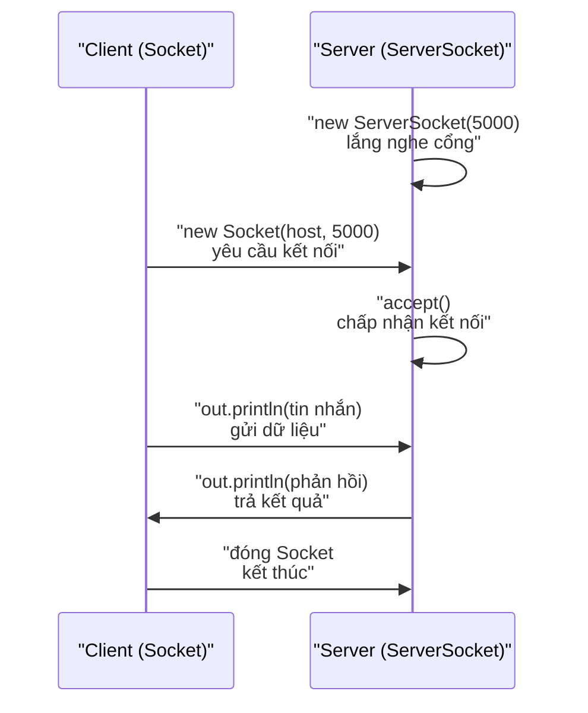

# 4. Lập trình mạng (Networking)

Lập trình mạng là viết chương trình để các máy tính trao đổi dữ liệu với nhau qua Internet hoặc mạng nội bộ. Bài này giới thiệu hai vai trò client và server, khái niệm socket, cách dùng `ServerSocket`/`Socket` với TCP và cách gọi API web bằng `HttpClient`. Đây là kiến thức cần thiết khi bạn muốn xây ứng dụng chat, server hay gọi dịch vụ trên mạng.

[](pathname:///img/java/networking.webp)

---

:::note[Ghi nhớ nhanh]

- ⭐ **Hai vai trò client và server** — client gửi yêu cầu, server nhận và trả lời; kết nối qua **socket** (xác định bởi IP + cổng/port).
- ⭐ **TCP với `ServerSocket` và `Socket`** — server `accept()` chờ kết nối, client tạo `Socket(host, port)`; TCP đảm bảo dữ liệu tới đầy đủ, đúng thứ tự (gói `java.net`).
- **Gọi API web dùng `HttpClient` (Java 11+)** — gửi GET/POST gọn gàng, không cần socket thủ công; đọc `statusCode()` và `body()`.
- **`URL`** — phân tích địa chỉ tài nguyên (protocol, host, port, path, query).
- **Lưu ý** — `accept()`/`readLine()` là blocking (chờ); chạy server trước client; luôn dùng `try-with-resources` để đóng socket.

:::

---

## Mục lục

- [Vì sao cần API mạng?](#vì-sao-cần-api-mạng)
- [Lập trình mạng là gì?](#lập-trình-mạng-là-gì)
- [Socket là gì?](#socket-là-gì)
- [TCP Server với ServerSocket](#tcp-server-với-serversocket)
- [TCP Client với Socket](#tcp-client-với-socket)
- [Gọi HTTP với HttpClient (Java 11+)](#gọi-http-với-httpclient-java-11)
- [Làm việc với URL](#làm-việc-với-url)
- [Lỗi thường gặp](#lỗi-thường-gặp)
- [Tóm tắt](#tóm-tắt)
- [Câu hỏi phỏng vấn](#câu-hỏi-phỏng-vấn)

---

## Vì sao cần API mạng?

**Vấn đề:** Một ứng dụng hiếm khi đứng một mình — nó cần **giao tiếp với máy khác** qua mạng: gọi API lấy dữ liệu, tải nội dung từ một địa chỉ web, hay dựng server nhận kết nối từ nhiều client. Nếu tự làm việc trực tiếp với giao thức TCP/IP ở mức thấp, bạn phải tự lo bắt tay kết nối, đóng gói/giải gói byte, quản lý cổng... cực kỳ phức tạp và dễ sai.

```java
// Không có API mạng: phải tự thao tác TCP/IP cấp thấp
// - Tự mở kết nối, bắt tay 3 bước (SYN/SYN-ACK/ACK)
// - Tự chia nhỏ dữ liệu thành gói, đánh số, chờ xác nhận
// - Tự xử lý mất gói, sai thứ tự, đóng kết nối
// => Hàng trăm dòng code rối rắm chỉ để gửi một tin nhắn
```

**Giải pháp:** Java cung cấp API mạng ở **nhiều mức trừu tượng** trong gói `java.net` và `java.net.http`, giấu đi sự phức tạp của TCP/IP:

```java
// Mức thấp (TCP): Socket / ServerSocket cho client-server
ServerSocket serverSocket = new ServerSocket(5000); // server lắng nghe
Socket socket = new Socket("localhost", 5000);      // client kết nối

// Mức cao (HTTP): HttpClient (Java 11+) gọi API web gọn gàng
HttpClient client = HttpClient.newHttpClient();
HttpRequest request = HttpRequest.newBuilder()
        .uri(URI.create("https://api.github.com"))
        .GET()
        .build();
HttpResponse<String> response =
        client.send(request, HttpResponse.BodyHandlers.ofString());

// Phân tích địa chỉ: URL
URL url = new URL("https://example.com/page.html?id=10");
```

:::tip[Dùng thực tế]
- **Gọi REST API**: dùng `HttpClient` gửi GET/POST tới dịch vụ web, nhận JSON về xử lý (Java 11+ còn hỗ trợ bất đồng bộ và HTTP/2).
- **Dựng server TCP**: dùng `ServerSocket` mở cổng, `accept()` chờ và phục vụ các kết nối client tới.
- **Chat client-server**: hai bên dùng `Socket` để gửi/nhận tin nhắn qua TCP theo thời gian thực.
- **Tải dữ liệu từ URL**: dùng `URL` để phân tích địa chỉ tài nguyên trên mạng trước khi truy cập.
:::

---

## Lập trình mạng là gì?

**Lập trình mạng (networking)** là viết chương trình để các máy tính **trao đổi dữ liệu với nhau** qua mạng (Internet hoặc mạng nội bộ).

Ví dụ đời thường:
- Trình duyệt gửi yêu cầu tới máy chủ Google và nhận về trang web.
- Ứng dụng chat gửi tin nhắn từ điện thoại bạn tới điện thoại bạn bè.

Có hai vai trò chính:
- **Client (máy khách)**: bên gửi yêu cầu (như trình duyệt).
- **Server (máy chủ)**: bên nhận yêu cầu và trả lời (như máy chủ web).

Các lớp mạng nằm trong gói `java.net`.

---

## Socket là gì?

**Socket** (ổ cắm) là "điểm kết nối" hai đầu của một đường truyền giữa hai máy. Hãy tưởng tượng như **cuộc gọi điện thoại**: mỗi bên cầm một ống nghe (socket), khi nối máy thì hai bên nói chuyện qua đường dây đó.

Một socket được xác định bởi:
- **Địa chỉ IP** (IP address): "địa chỉ nhà" của máy trên mạng, ví dụ `192.168.1.5`.
- **Cổng (port)**: "số phòng" trên máy đó, ví dụ `8080`. Một máy có nhiều cổng để chạy nhiều dịch vụ cùng lúc.

Java dùng giao thức **TCP** (Transmission Control Protocol) cho socket — đảm bảo dữ liệu tới nơi đầy đủ và đúng thứ tự.
- `ServerSocket`: dùng cho **server**, lắng nghe kết nối tới.
- `Socket`: dùng cho **client** (và cũng đại diện kết nối phía server sau khi chấp nhận).

---

## TCP Server với ServerSocket

Server mở một cổng, **chờ** client kết nối, rồi đọc/ghi dữ liệu.

```java
import java.io.BufferedReader;
import java.io.InputStreamReader;
import java.io.PrintWriter;
import java.net.ServerSocket;
import java.net.Socket;
import java.io.IOException;

public class SimpleServer {
    public static void main(String[] args) {
        int port = 5000; // Cổng server lắng nghe

        // try-with-resources để tự đóng ServerSocket
        try (ServerSocket serverSocket = new ServerSocket(port)) {
            System.out.println("Server đang chờ ở cổng " + port + "...");

            // accept() bị "đứng" lại cho đến khi có client kết nối
            try (Socket clientSocket = serverSocket.accept();
                 BufferedReader in = new BufferedReader(
                         new InputStreamReader(clientSocket.getInputStream()));
                 PrintWriter out = new PrintWriter(clientSocket.getOutputStream(), true)) {

                System.out.println("Có client kết nối!");

                // Đọc một dòng client gửi tới
                String tinNhan = in.readLine();
                System.out.println("Client nói: " + tinNhan);

                // Gửi câu trả lời về cho client (autoFlush = true nên gửi ngay)
                out.println("Server đã nhận: " + tinNhan);
            }
        } catch (IOException e) {
            System.err.println("Lỗi server: " + e.getMessage());
        }
    }
}
```

---

## TCP Client với Socket

Client tạo `Socket` trỏ tới địa chỉ và cổng của server, rồi gửi/nhận dữ liệu.

```java
import java.io.BufferedReader;
import java.io.InputStreamReader;
import java.io.PrintWriter;
import java.net.Socket;
import java.io.IOException;

public class SimpleClient {
    public static void main(String[] args) {
        String host = "localhost"; // Cùng máy; nếu khác máy thì dùng IP của server
        int port = 5000;

        try (Socket socket = new Socket(host, port);
             PrintWriter out = new PrintWriter(socket.getOutputStream(), true);
             BufferedReader in = new BufferedReader(
                     new InputStreamReader(socket.getInputStream()))) {

            // Gửi một tin nhắn tới server
            out.println("Xin chào server!");

            // Đọc câu trả lời từ server
            String phanHoi = in.readLine();
            System.out.println("Server trả lời: " + phanHoi);

        } catch (IOException e) {
            System.err.println("Lỗi client: " + e.getMessage());
        }
    }
}
```

> **Cách chạy thử**: Chạy `SimpleServer` trước (nó sẽ đứng chờ), sau đó chạy `SimpleClient` ở một cửa sổ khác.

Sơ đồ tuần tự dưới đây mô tả một lượt trao đổi giữa client và server qua TCP:



---

## Gọi HTTP với HttpClient (Java 11+)

Phần lớn lập trình mạng ngày nay là gọi **API qua HTTP** (giao thức web). Từ Java 11, lớp **`HttpClient`** giúp việc này rất gọn, không cần dùng socket thủ công.

```java
import java.net.URI;
import java.net.http.HttpClient;
import java.net.http.HttpRequest;
import java.net.http.HttpResponse;
import java.io.IOException;

public class HttpGetDemo {
    public static void main(String[] args) {
        // Tạo một HttpClient dùng chung
        HttpClient client = HttpClient.newHttpClient();

        // Xây dựng yêu cầu GET tới một địa chỉ
        HttpRequest request = HttpRequest.newBuilder()
                .uri(URI.create("https://api.github.com"))
                .GET() // Phương thức GET (lấy dữ liệu)
                .build();

        try {
            // Gửi yêu cầu và nhận phản hồi dưới dạng chuỗi
            HttpResponse<String> response =
                    client.send(request, HttpResponse.BodyHandlers.ofString());

            // Mã trạng thái: 200 = thành công, 404 = không tìm thấy...
            System.out.println("Mã trạng thái: " + response.statusCode());
            System.out.println("Nội dung: " + response.body());

        } catch (IOException | InterruptedException e) {
            // InterruptedException: luồng bị ngắt khi đang chờ phản hồi
            System.err.println("Lỗi khi gọi HTTP: " + e.getMessage());
            // Khôi phục cờ ngắt theo thông lệ tốt
            Thread.currentThread().interrupt();
        }
    }
}
```

Gửi dữ liệu lên server bằng POST:

```java
HttpRequest postRequest = HttpRequest.newBuilder()
        .uri(URI.create("https://example.com/api/users"))
        .header("Content-Type", "application/json") // Báo kiểu dữ liệu gửi đi
        .POST(HttpRequest.BodyPublishers.ofString("{\"ten\":\"Nam\"}"))
        .build();
```

---

## Làm việc với URL

**`URL`** (Uniform Resource Locator) là một địa chỉ tài nguyên trên mạng, ví dụ `https://example.com/index.html`. Lớp `URL` giúp bạn phân tích các thành phần của địa chỉ.

```java
import java.net.URL;
import java.net.MalformedURLException;

public class UrlDemo {
    public static void main(String[] args) {
        try {
            URL url = new URL("https://example.com:443/path/page.html?id=10");

            System.out.println("Giao thức: " + url.getProtocol()); // https
            System.out.println("Tên miền: " + url.getHost());      // example.com
            System.out.println("Cổng: " + url.getPort());          // 443
            System.out.println("Đường dẫn: " + url.getPath());     // /path/page.html
            System.out.println("Tham số: " + url.getQuery());      // id=10

        } catch (MalformedURLException e) {
            // MalformedURLException: địa chỉ sai định dạng
            System.err.println("URL không hợp lệ: " + e.getMessage());
        }
    }
}
```

---

## Lỗi thường gặp

1. **Cổng đã bị dùng**: Khởi động server trên cổng đang được chiếm sẽ ném `BindException`. Đổi cổng hoặc tắt chương trình đang dùng.
2. **Chạy client trước server**: Client sẽ báo `ConnectionRefused` vì chưa ai lắng nghe. Chạy server trước.
3. **Quên đóng socket/luồng**: Gây rò rỉ kết nối. Dùng try-with-resources.
4. **Treo chương trình ở `accept()` hoặc `readLine()`**: Đây là hành vi bình thường — chúng **chờ (blocking)** cho đến khi có dữ liệu/kết nối.
5. **Dùng socket thủ công cho API web**: Không cần thiết. Hãy dùng `HttpClient` cho HTTP, đơn giản và an toàn hơn.

---

## Tóm tắt

- **Lập trình mạng** giúp các máy trao đổi dữ liệu; có hai vai: **client** (gửi) và **server** (trả lời).
- **Socket** là điểm kết nối, xác định bởi **địa chỉ IP** và **cổng (port)**.
- Dùng **`ServerSocket`** cho server và **`Socket`** cho client với giao thức TCP.
- Từ Java 11, dùng **`HttpClient`** để gọi API web qua HTTP một cách gọn gàng.
- Lớp **`URL`** giúp phân tích địa chỉ tài nguyên trên mạng.

---

## Câu hỏi phỏng vấn

Những câu thường gặp về chủ đề này. Tự trả lời trước, rồi bấm **Xem đáp án** để đối chiếu.

**1. Một `Socket` được xác định (định danh duy nhất) bởi những thông tin nào? Vai trò của `ServerSocket` khác `Socket` ra sao?**

<details className="qa">
<summary>Xem đáp án</summary>

Một kết nối socket được xác định bởi cặp **địa chỉ IP + cổng (port)** ở cả hai đầu (client và server) — cụ thể là bốn giá trị: IP nguồn, port nguồn, IP đích, port đích.

- **`ServerSocket`**: dùng ở phía **server**, chỉ để **lắng nghe** (`accept()`) kết nối tới trên một cổng cố định; bản thân nó không dùng để gửi/nhận dữ liệu.
- **`Socket`**: đại diện cho **một kết nối cụ thể** đã thiết lập — dùng ở phía client để chủ động kết nối tới server, và cũng chính là đối tượng server nhận được sau khi `ServerSocket.accept()` thành công để giao tiếp với client đó.

</details>

**2. Java `Socket`/`ServerSocket` mặc định dùng giao thức TCP. So sánh TCP với UDP (`DatagramSocket`) — khi nào nên chọn giao thức nào?**

<details className="qa">
<summary>Xem đáp án</summary>

| | TCP (`Socket`/`ServerSocket`) | UDP (`DatagramSocket`) |
|---|---|---|
| Đảm bảo thứ tự & đầy đủ | Có — dữ liệu tới đúng thứ tự, không mất gói (tự động gửi lại nếu thất lạc) | Không — gói có thể mất, tới sai thứ tự, không tự gửi lại |
| Kết nối | Hướng kết nối (connection-oriented) — bắt tay trước khi truyền | Không kết nối (connectionless) — gửi thẳng, không cần bắt tay |
| Tốc độ/overhead | Chậm hơn do phải đảm bảo tin cậy | Nhanh hơn, overhead thấp |
| Ví dụ dùng | Chat, truyền file, gọi API — cần dữ liệu chính xác tuyệt đối | Video call, game online, streaming — chấp nhận mất một ít gói để đổi lấy độ trễ thấp |

Chọn TCP khi tính **đúng và đủ** của dữ liệu quan trọng hơn tốc độ; chọn UDP khi **độ trễ thấp** quan trọng hơn, và ứng dụng có thể tự chịu được việc mất một phần dữ liệu.

</details>

**3. Vì sao `SimpleServer` trong bài chỉ phục vụ được đúng **một** client rồi kết thúc chương trình? Làm sao sửa để nó phục vụ được nhiều client liên tục?**

<details className="qa">
<summary>Xem đáp án</summary>

Vì `accept()` chỉ được gọi **một lần**, bên ngoài mọi vòng lặp — sau khi xử lý xong client đầu tiên, phương thức `main` kết thúc, `try-with-resources` đóng `ServerSocket` lại, chương trình dừng.

Muốn phục vụ **nhiều client liên tục**, cần bọc `accept()` trong một vòng lặp vô hạn, và (để phục vụ nhiều client **cùng lúc** thay vì lần lượt) giao mỗi kết nối cho một luồng riêng xử lý:

```java
try (ServerSocket serverSocket = new ServerSocket(port)) {
    while (true) { // luôn sẵn sàng nhận kết nối mới
        Socket clientSocket = serverSocket.accept(); // chờ client tiếp theo
        // Giao cho một luồng riêng xử lý để không chặn việc accept() client khác
        new Thread(() -> xuLyClient(clientSocket)).start();
    }
}
```

Đây là mô hình "thread-per-connection" đơn giản — với số lượng client rất lớn, thực tế thường dùng virtual thread (Java 21+) hoặc NIO `Selector` để xử lý hiệu quả hơn.

</details>

**4. `accept()` và `readLine()` là các thao tác "blocking". Điều này có nghĩa là gì, và nó ảnh hưởng thế nào tới thiết kế chương trình?**

<details className="qa">
<summary>Xem đáp án</summary>

**Blocking** (chặn) nghĩa là luồng gọi phương thức đó sẽ **dừng lại chờ** cho đến khi có kết quả, không làm gì khác được trong lúc chờ:

- `serverSocket.accept()`: luồng gọi bị "đứng" cho tới khi có client nào đó kết nối tới.
- `in.readLine()`: luồng gọi bị "đứng" cho tới khi phía bên kia gửi xong một dòng dữ liệu (hoặc kết nối bị đóng).

Ảnh hưởng tới thiết kế: nếu server chỉ có **một luồng duy nhất** vừa `accept()` vừa xử lý dữ liệu, nó sẽ **không thể** đồng thời chờ client mới và phục vụ client hiện tại — đây chính là lý do cần mô hình đa luồng (mỗi kết nối một luồng riêng) hoặc I/O bất đồng bộ/non-blocking (NIO) khi cần phục vụ nhiều client đồng thời.

</details>

**5. `HttpClient.send()` và `HttpClient.sendAsync()` khác nhau thế nào? Cho ví dụ dùng `sendAsync()`.**

<details className="qa">
<summary>Xem đáp án</summary>

- **`send(request, bodyHandler)`**: gửi yêu cầu **đồng bộ (synchronous)** — luồng gọi bị **chặn**, đứng chờ cho tới khi có phản hồi mới chạy tiếp dòng code kế tiếp.
- **`sendAsync(request, bodyHandler)`**: gửi yêu cầu **bất đồng bộ (asynchronous)** — trả về ngay một `CompletableFuture<HttpResponse<T>>`, luồng gọi **không bị chặn**, có thể làm việc khác trong lúc chờ; xử lý kết quả thông qua callback khi future hoàn tất.

```java
HttpClient client = HttpClient.newHttpClient();
HttpRequest request = HttpRequest.newBuilder()
        .uri(URI.create("https://api.github.com"))
        .GET()
        .build();

// Không chặn luồng hiện tại; xử lý kết quả khi có phản hồi
client.sendAsync(request, HttpResponse.BodyHandlers.ofString())
      .thenApply(HttpResponse::body)
      .thenAccept(System.out::println);

System.out.println("Dòng này chạy NGAY, không chờ HTTP trả về");
```

`sendAsync()` phù hợp khi cần gọi nhiều API song song hoặc không muốn chặn luồng chính (ví dụ trong ứng dụng có giao diện người dùng).

</details>

**6. Có nên tạo mới một `HttpClient` cho mỗi lần gọi API không? Vì sao?**

<details className="qa">
<summary>Xem đáp án</summary>

**Không nên.** `HttpClient` được thiết kế để **tái sử dụng** — nó quản lý bên trong một **connection pool** (bể kết nối tái sử dụng), cấu hình timeout, cookie handler... Tạo lại `HttpClient` mới cho mỗi request sẽ mất đi lợi ích tái sử dụng kết nối (phải bắt tay TCP/TLS lại từ đầu mỗi lần), tương tự như việc biên dịch lại `Pattern` mỗi lần thay vì tái sử dụng.

```java
// ĐÚNG: tạo một lần, dùng lại cho nhiều request
private static final HttpClient CLIENT = HttpClient.newHttpClient();

public String goiApi(String url) throws IOException, InterruptedException {
    HttpRequest request = HttpRequest.newBuilder().uri(URI.create(url)).GET().build();
    return CLIENT.send(request, HttpResponse.BodyHandlers.ofString()).body();
}
```

</details>

**7. Đoạn code sau ném ngoại lệ gì, trong hai tình huống: (a) chạy `SimpleClient` trước khi `SimpleServer` đang chạy; (b) chạy `SimpleServer` hai lần liên tiếp cùng một cổng?**

```java
Socket socket = new Socket("localhost", 5000);
```

```java
ServerSocket serverSocket = new ServerSocket(5000);
```

<details className="qa">
<summary>Xem đáp án</summary>

- **(a) Client chạy trước khi server lắng nghe**: ném **`ConnectException`** (thường kèm thông điệp "Connection refused") — vì chưa có ai lắng nghe ở cổng 5000 để chấp nhận kết nối.
- **(b) Chạy `ServerSocket` hai lần trên cùng một cổng** (khi tiến trình đầu vẫn đang giữ cổng đó): ném **`BindException`** ("Address already in use") — hệ điều hành không cho hai tiến trình cùng lắng nghe một cổng TCP giống nhau tại cùng thời điểm.
- Cả hai đều là `IOException`, nên có thể bắt gộp bằng `catch (IOException e)`, nhưng biết phân biệt hai loại lỗi cụ thể giúp debug nhanh hơn: "chưa ai lắng nghe" khác với "cổng đã bị chiếm".

</details>

**8. `URL` và `URI` (Uniform Resource Identifier) khác nhau thế nào? Vì sao nên dùng `URI` để phân tích cú pháp thay vì tạo `URL` trực tiếp?**

<details className="qa">
<summary>Xem đáp án</summary>

- **`URI`**: chỉ là một chuỗi định danh tài nguyên theo cú pháp chuẩn (RFC 3986) — thuần về **phân tích cú pháp (parsing)**, không thực hiện bất kỳ hành động mạng nào.
- **`URL`**: là một `URI` cụ thể hơn, biết cách **định vị (locate)** tài nguyên đó, và có thể **mở kết nối thực sự** tới nó (`openStream()`, `openConnection()`).

Java khuyến khích: dùng `URI` để phân tích cú pháp địa chỉ (an toàn, không gây side-effect), chỉ chuyển sang `URL` (qua `uri.toURL()`) khi thực sự cần **mở kết nối**. Lý do: một số phương thức cũ của `URL` như `equals()`/`hashCode()` có thể thực hiện **tra cứu DNS** (network call) ngầm để so sánh hai URL — gây độ trễ bất ngờ và hành vi khó đoán nếu dùng `URL` làm key trong `HashMap`/`HashSet`. Đây cũng là lý do các constructor `URL` cũ dần bị khuyến nghị thay bằng `URI` trong các phiên bản Java hiện đại.

</details>

**9. Tình huống: bạn cần nâng cấp `SimpleServer` trong bài để phục vụ **hàng nghìn** client kết nối đồng thời. Mô hình "mỗi client một `Thread`" có còn phù hợp không? Nêu hướng cải thiện.**

<details className="qa">
<summary>Xem đáp án</summary>

Mô hình "thread-per-connection" (mỗi kết nối một luồng hệ điều hành riêng) sẽ **khó scale** tới hàng nghìn kết nối đồng thời với luồng nền tảng (platform thread) truyền thống, vì mỗi luồng chiếm bộ nhớ stack đáng kể và việc chuyển đổi ngữ cảnh (context switch) giữa hàng nghìn luồng gây tốn kém.

Hai hướng cải thiện phổ biến:
- **Virtual thread (Java 21+)**: vẫn giữ mô hình lập trình đơn giản "mỗi kết nối một luồng", nhưng virtual thread rất nhẹ (có thể tạo hàng triệu luồng), do JVM quản lý việc ánh xạ xuống một số ít luồng hệ điều hành thực khi luồng bị block (như lúc `accept()`/`readLine()` đang chờ).
- **NIO non-blocking với `Selector`**: dùng một (hoặc vài) luồng để theo dõi **nhiều kênh (channel)** cùng lúc, chỉ xử lý khi kênh nào đó thực sự sẵn sàng đọc/ghi — phức tạp hơn để lập trình nhưng hiệu quả cao với kiến trúc truyền thống trước khi có virtual thread.

Với dự án mới trên Java 21+, virtual thread thường là lựa chọn đơn giản và hiệu quả nhất để scale mô hình thread-per-connection sẵn có mà không cần viết lại theo NIO phức tạp.

</details>

**10. Vì sao khi bắt được `InterruptedException` từ `HttpClient.send()`, nên gọi `Thread.currentThread().interrupt()` ngay trong khối `catch` thay vì chỉ log lỗi rồi bỏ qua?**

<details className="qa">
<summary>Xem đáp án</summary>

Khi một luồng đang bị **block** (chờ) trong một thao tác như `send()` bị ngắt (interrupt) từ bên ngoài, JVM ném `InterruptedException` và đồng thời **xóa (clear) cờ ngắt (interrupt status)** của luồng đó — coi như tín hiệu ngắt đã được "tiêu thụ" xong.

Nếu chỉ bắt ngoại lệ rồi log và bỏ qua, **thông tin "luồng này đã được yêu cầu dừng"** sẽ bị mất hoàn toàn — các đoạn code gọi ở tầng cao hơn (ví dụ vòng lặp kiểm tra `Thread.currentThread().isInterrupted()` để biết khi nào nên dừng công việc) sẽ không còn biết rằng đã có yêu cầu ngắt.

```java
} catch (IOException | InterruptedException e) {
    System.err.println("Lỗi khi gọi HTTP: " + e.getMessage());
    Thread.currentThread().interrupt(); // khôi phục lại cờ ngắt cho tầng gọi cao hơn biết
}
```

Gọi `Thread.currentThread().interrupt()` giúp **"khôi phục" lại tín hiệu ngắt**, đảm bảo hành vi ngắt luồng vẫn được tôn trọng đúng đắn xuyên suốt toàn bộ call stack, thay vì bị "nuốt mất" ở một tầng xử lý ngoại lệ nào đó.

</details>
