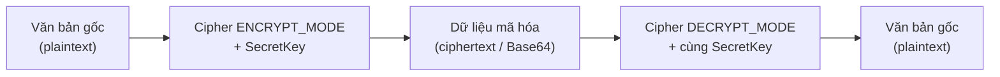

# 5. Mã hóa (Cryptography)

Mã hóa là cách bảo vệ thông tin, làm cho dữ liệu khó đọc với người không có quyền và chống giả mạo. Bài này giới thiệu hai khái niệm cốt lõi cho người mới: băm (hashing) một chiều với `MessageDigest` và mã hóa đối xứng AES với `Cipher`, cùng cách lưu mật khẩu an toàn. Đây là kiến thức quan trọng để giữ an toàn cho mật khẩu và dữ liệu nhạy cảm trong ứng dụng.

---

:::note[Ghi nhớ nhanh]

- ⭐ **Băm vs mã hóa** — băm (`MessageDigest`, SHA-256) là **một chiều** không đảo ngược được; mã hóa (`Cipher`, AES) là **hai chiều** giải mã lại được nếu có khóa.
- ⭐ **KHÔNG bao giờ tự chế thuật toán** — luôn dùng chuẩn đã kiểm chứng (AES, SHA-256) qua thư viện uy tín; "trông lộn xộn" không có nghĩa là an toàn.
- **Lưu mật khẩu** — băm kèm **salt** ngẫu nhiên, không lưu dạng thô; tốt nhất dùng bcrypt/scrypt/Argon2 (SHA-256 thuần quá nhanh, dễ bị đoán hàng loạt).
- **AES đối xứng** — cùng một khóa để mã hóa (`ENCRYPT_MODE`) và giải mã (`DECRYPT_MODE`); thực tế nên dùng `AES/GCM/NoPadding` kèm IV.
- **Cạm bẫy** — tránh MD5/SHA-1 (đã yếu), dùng `SecureRandom` (không phải `Random`) cho salt/khóa, không hardcode khóa trong mã nguồn.

:::

---

## Mục lục

- [Mã hóa là gì?](#mã-hóa-là-gì)
- [Vì sao cần cryptography?](#vì-sao-cần-cryptography)
- [Băm (hashing) với MessageDigest](#băm-hashing-với-messagedigest)
- [Mã hóa đối xứng AES với Cipher](#mã-hóa-đối-xứng-aes-với-cipher)
- [Vì sao KHÔNG nên tự chế thuật toán](#vì-sao-không-nên-tự-chế-thuật-toán)
- [Lưu mật khẩu: băm cộng salt](#lưu-mật-khẩu-băm-cộng-salt)
- [Lỗi thường gặp](#lỗi-thường-gặp)
- [Tóm tắt](#tóm-tắt)

---

## Mã hóa là gì?

**Cryptography (mật mã học)** là khoa học bảo vệ thông tin: làm cho dữ liệu trở nên **khó đọc** với người không có quyền, và đảm bảo dữ liệu **không bị giả mạo**.

Hai khái niệm cốt lõi cho người mới:

- **Băm (hashing)**: biến dữ liệu thành một "dấu vân tay" (chuỗi cố định) **một chiều** — không thể đảo ngược lại dữ liệu gốc. Dùng để lưu mật khẩu, kiểm tra tính toàn vẹn.
- **Mã hóa (encryption)**: biến dữ liệu thành dạng "lộn xộn" nhưng **có thể giải mã lại** nếu có chìa khóa (key). Dùng để giữ bí mật nội dung.

Ví dụ đời thường:
- Băm giống như **xay sinh tố**: xay táo thành nước thì không thể ghép lại quả táo.
- Mã hóa giống như **két sắt có khóa**: cất đồ vào, có chìa thì lấy ra được.

Các lớp này nằm trong gói `java.security` và `javax.crypto`.

---

## Vì sao cần cryptography?

**Vấn đề:** Dữ liệu lưu trong database hay truyền qua mạng có thể bị **đọc trộm** hoặc **sửa đổi** mà ta không hề hay biết. Tệ nhất là lưu mật khẩu dạng thô — chỉ cần lộ database là kẻ xấu có ngay toàn bộ tài khoản. Và khi nhận dữ liệu từ bên ngoài, ta không có cách nào biết nó có bị giả mạo hay không.

```java
public class KhongAnToan {
    public static void main(String[] args) {
        // Lưu mật khẩu dạng thô vào database
        String matKhau = "matkhau123";
        luuVaoDB("user1", matKhau); // Lộ DB là lộ hết mật khẩu!

        // "Tự chế" cách giấu dữ liệu bằng đảo ngược chuỗi
        String biMat = "So the the la 1234";
        String giauDi = new StringBuilder(biMat).reverse().toString();
        // Trông lộn xộn nhưng KHÔNG hề an toàn, ai cũng đảo lại được
        System.out.println(giauDi);
    }

    static void luuVaoDB(String user, String matKhau) { /* ... */ }
}
```

**Giải pháp:** Dùng cryptography **chuẩn** qua JCA (Java Cryptography Architecture) thay vì tự nghĩ thuật toán — tự chế mã hóa gần như chắc chắn có lỗ hổng.

```java
import java.security.MessageDigest;
import java.nio.charset.StandardCharsets;

public class AnToan {
    public static void main(String[] args) throws Exception {
        // Băm (hashing) một chiều với MessageDigest -> kiểm tra toàn vẹn,
        // lưu mật khẩu (thực tế dùng bcrypt/PBKDF2 kèm salt)
        MessageDigest digest = MessageDigest.getInstance("SHA-256");
        byte[] hash = digest.digest("matkhau123".getBytes(StandardCharsets.UTF_8));
        // Mã hóa đối xứng AES (Cipher): nhanh, dùng một khóa chung
        // Mã hóa bất đối xứng RSA: cặp khóa công khai/riêng tư
        // Chữ ký số: vừa xác thực nguồn gốc vừa bảo đảm toàn vẹn
        System.out.println("Đã băm an toàn, không lưu mật khẩu thô");
    }
}
```

:::tip[Dùng thực tế]
- **Lưu mật khẩu**: băm kèm **salt** ngẫu nhiên (tốt nhất bcrypt/PBKDF2/Argon2), không bao giờ lưu dạng thô.
- **Dữ liệu nhạy cảm** (số thẻ, thông tin cá nhân): mã hóa **đối xứng AES** trước khi lưu/truyền.
- **Trao đổi khóa và chữ ký**: dùng **bất đối xứng RSA** để bên kia xác thực được nguồn gốc.
- **Kiểm tra toàn vẹn**: so sánh **hash** của file/dữ liệu tải về để biết có bị sửa đổi không.
:::

---

## Băm (hashing) với MessageDigest

**`MessageDigest`** thực hiện băm. Thuật toán được khuyên dùng là **SHA-256** (tạo dấu vân tay dài 256 bit).

```java
import java.security.MessageDigest;
import java.security.NoSuchAlgorithmException;
import java.nio.charset.StandardCharsets;

public class HashDemo {

    // Băm một chuỗi thành dạng SHA-256 (hex)
    public static String sha256(String input) throws NoSuchAlgorithmException {
        // Lấy bộ băm theo thuật toán SHA-256
        MessageDigest digest = MessageDigest.getInstance("SHA-256");

        // Băm chuỗi (chuyển sang byte với bảng mã UTF-8)
        byte[] hashBytes = digest.digest(input.getBytes(StandardCharsets.UTF_8));

        // Chuyển mảng byte thành chuỗi hex cho dễ đọc/lưu
        StringBuilder sb = new StringBuilder();
        for (byte b : hashBytes) {
            // %02x: in mỗi byte thành 2 ký tự hex
            sb.append(String.format("%02x", b));
        }
        return sb.toString();
    }

    public static void main(String[] args) throws NoSuchAlgorithmException {
        System.out.println(sha256("matkhau123"));
        // Cùng đầu vào luôn cho cùng kết quả băm
        System.out.println(sha256("matkhau123"));
        // Đổi 1 ký tự thì kết quả khác hoàn toàn
        System.out.println(sha256("matkhau124"));
    }
}
```

Đặc điểm của băm:
- Cùng đầu vào → cùng kết quả.
- Đổi một chút đầu vào → kết quả khác hẳn.
- **Một chiều**: không thể từ kết quả băm suy ngược ra đầu vào.

---

## Mã hóa đối xứng AES với Cipher

**Mã hóa đối xứng (symmetric encryption)**: dùng **cùng một chìa khóa** để mã hóa và giải mã. Thuật toán phổ biến là **AES** (Advanced Encryption Standard). Lớp thực hiện là **`Cipher`**.

```java
import javax.crypto.Cipher;
import javax.crypto.KeyGenerator;
import javax.crypto.SecretKey;
import java.util.Base64;
import java.nio.charset.StandardCharsets;

public class AesDemo {
    public static void main(String[] args) throws Exception {
        // Bước 1: Tạo chìa khóa AES 256 bit
        KeyGenerator keyGen = KeyGenerator.getInstance("AES");
        keyGen.init(256); // độ dài khóa
        SecretKey key = keyGen.generateKey();

        String vanBanGoc = "Thông tin bí mật";

        // Bước 2: Mã hóa
        Cipher cipher = Cipher.getInstance("AES");
        cipher.init(Cipher.ENCRYPT_MODE, key); // chế độ mã hóa, dùng khóa
        byte[] maHoa = cipher.doFinal(vanBanGoc.getBytes(StandardCharsets.UTF_8));

        // Đổi sang Base64 để in/lưu dưới dạng text
        String chuoiMaHoa = Base64.getEncoder().encodeToString(maHoa);
        System.out.println("Đã mã hóa: " + chuoiMaHoa);

        // Bước 3: Giải mã (dùng cùng khóa)
        cipher.init(Cipher.DECRYPT_MODE, key); // chuyển sang chế độ giải mã
        byte[] giaiMa = cipher.doFinal(Base64.getDecoder().decode(chuoiMaHoa));
        String vanBanGiaiMa = new String(giaiMa, StandardCharsets.UTF_8);

        System.out.println("Sau giải mã: " + vanBanGiaiMa); // Thông tin bí mật
    }
}
```

> **Lưu ý**: Ví dụ dùng `"AES"` cho đơn giản. Trong thực tế nên dùng chế độ an toàn hơn như `AES/GCM/NoPadding` kèm IV (vector khởi tạo). Người mới nên dùng thư viện có sẵn cấu hình an toàn thay vì tự chọn.

Sơ đồ dưới đây minh họa luồng mã hóa và giải mã đối xứng với cùng một khóa:



---

## Vì sao KHÔNG nên tự chế thuật toán

Nguyên tắc vàng trong bảo mật: **đừng tự sáng chế thuật toán mã hóa của riêng bạn.**

Lý do:
- Thuật toán chuẩn như AES, SHA-256 đã được **hàng nghìn chuyên gia** trên thế giới kiểm tra suốt nhiều năm.
- Thuật toán tự chế thường có lỗ hổng mà bạn không nhận ra, dễ bị kẻ xấu phá.
- "Trông có vẻ lộn xộn" **không** đồng nghĩa với "an toàn".

Hãy luôn:
- Dùng thuật toán chuẩn đã được công nhận.
- Dùng thư viện uy tín (JDK, Bouncy Castle...).
- Không tự "xáo trộn chữ cái" rồi gọi đó là mã hóa.

---

## Lưu mật khẩu: băm cộng salt

**Tuyệt đối không lưu mật khẩu dưới dạng văn bản thường** trong cơ sở dữ liệu. Nếu bị lộ, kẻ xấu đọc được hết.

Cách đúng: **băm mật khẩu** rồi lưu kết quả băm. Khi đăng nhập, băm mật khẩu người dùng nhập rồi so sánh với giá trị đã lưu.

Nhưng băm thường vẫn yếu trước "bảng tra sẵn" (rainbow table). Giải pháp: thêm **salt** (muối) — một chuỗi ngẫu nhiên ghép vào mật khẩu trước khi băm, làm mỗi mật khẩu băm ra khác nhau.

```java
import java.security.MessageDigest;
import java.security.SecureRandom;
import java.nio.charset.StandardCharsets;
import java.util.Base64;

public class PasswordHash {

    // Tạo salt ngẫu nhiên (16 byte)
    public static byte[] taoSalt() {
        byte[] salt = new byte[16];
        // SecureRandom: bộ sinh số ngẫu nhiên an toàn cho mật mã
        new SecureRandom().nextBytes(salt);
        return salt;
    }

    // Băm mật khẩu kèm salt
    public static String bamMatKhau(String matKhau, byte[] salt) throws Exception {
        MessageDigest digest = MessageDigest.getInstance("SHA-256");
        digest.update(salt); // trộn salt vào trước
        byte[] hash = digest.digest(matKhau.getBytes(StandardCharsets.UTF_8));
        return Base64.getEncoder().encodeToString(hash);
    }

    public static void main(String[] args) throws Exception {
        String matKhau = "matkhau123";

        byte[] salt = taoSalt();
        String giaTriLuu = bamMatKhau(matKhau, salt);

        // Trong thực tế: lưu cả salt và giá trị băm vào database
        System.out.println("Giá trị băm lưu trữ: " + giaTriLuu);
    }
}
```

> **Khuyến nghị thực tế**: SHA-256 thuần vẫn quá nhanh, dễ bị tấn công đoán mật khẩu hàng loạt. Cho mật khẩu thật, hãy dùng thuật toán chuyên dụng **chậm** như **bcrypt**, **scrypt** hoặc **Argon2** (qua thư viện như Spring Security). Ví dụ trên chỉ để minh họa ý tưởng salt + băm.

---

## Lỗi thường gặp

1. **Lưu mật khẩu dạng văn bản thường**: Lỗi bảo mật nghiêm trọng. Luôn băm trước khi lưu.
2. **Băm mật khẩu không có salt**: Dễ bị tấn công bằng bảng tra sẵn. Luôn thêm salt ngẫu nhiên.
3. **Dùng MD5 hoặc SHA-1**: Đã bị coi là yếu, không nên dùng. Hãy dùng SHA-256 trở lên (và bcrypt/Argon2 cho mật khẩu).
4. **Tự chế thuật toán mã hóa**: Gần như chắc chắn không an toàn. Dùng chuẩn có sẵn.
5. **Dùng `Random` thay vì `SecureRandom`**: `Random` đoán được, không an toàn cho mật mã. Luôn dùng `SecureRandom` cho salt và khóa.
6. **Hardcode khóa trong mã nguồn**: Khóa lộ là mất an toàn. Lưu khóa ở biến môi trường hoặc kho khóa (key store).

---

## Tóm tắt

- **Băm (hashing)** là một chiều — dùng `MessageDigest` với **SHA-256** để tạo "dấu vân tay" dữ liệu.
- **Mã hóa đối xứng AES** với lớp `Cipher` dùng cùng một khóa để mã hóa và giải mã.
- **Không bao giờ tự chế** thuật toán mã hóa; luôn dùng chuẩn đã được kiểm chứng.
- **Lưu mật khẩu** bằng cách băm kèm **salt** ngẫu nhiên; tốt nhất dùng bcrypt/scrypt/Argon2.
- Dùng **`SecureRandom`** để sinh salt và khóa, và không bao giờ hardcode khóa trong mã nguồn.
