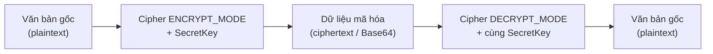

# 5. Mã hóa (Cryptography)

Mã hóa là cách bảo vệ thông tin, làm cho dữ liệu khó đọc với người không có quyền và chống giả mạo. Bài này giới thiệu hai khái niệm cốt lõi cho người mới: băm (hashing) một chiều với `MessageDigest` và mã hóa đối xứng AES với `Cipher`, cùng cách lưu mật khẩu an toàn. Đây là kiến thức quan trọng để giữ an toàn cho mật khẩu và dữ liệu nhạy cảm trong ứng dụng.

[](pathname:///img/java/cryptography.webp)

---

:::note[Ghi nhớ nhanh]

- ⭐ **Băm vs mã hóa** — băm (`MessageDigest`, SHA-256) là **một chiều** không đảo ngược được; mã hóa (`Cipher`, AES) là **hai chiều** giải mã lại được nếu có khóa.
- ⭐ **KHÔNG bao giờ tự chế thuật toán** — luôn dùng chuẩn đã kiểm chứng (AES, SHA-256) qua thư viện uy tín; "trông lộn xộn" không có nghĩa là an toàn.
- **Lưu mật khẩu** — băm kèm **salt** ngẫu nhiên, không lưu dạng thô; tốt nhất dùng bcrypt/scrypt/Argon2 (SHA-256 thuần quá nhanh, dễ bị đoán hàng loạt).
- **AES đối xứng** — cùng một khóa để mã hóa (`ENCRYPT_MODE`) và giải mã (`DECRYPT_MODE`); thực tế nên dùng `AES/GCM/NoPadding` kèm IV.
- **Cạm bẫy** — tránh MD5/SHA-1 (đã yếu), dùng `SecureRandom` (không phải `Random`) cho salt/khóa, không hardcode khóa trong mã nguồn.

:::

---

## Mục lục

- [Mã hóa là gì?](#mã-hóa-là-gì)
- [Vì sao cần cryptography?](#vì-sao-cần-cryptography)
- [Băm (hashing) với MessageDigest](#băm-hashing-với-messagedigest)
- [Mã hóa đối xứng AES với Cipher](#mã-hóa-đối-xứng-aes-với-cipher)
- [Vì sao KHÔNG nên tự chế thuật toán](#vì-sao-không-nên-tự-chế-thuật-toán)
- [Lưu mật khẩu: băm cộng salt](#lưu-mật-khẩu-băm-cộng-salt)
- [Lỗi thường gặp](#lỗi-thường-gặp)
- [Tóm tắt](#tóm-tắt)
- [Câu hỏi phỏng vấn](#câu-hỏi-phỏng-vấn)

---

## Mã hóa là gì?

**Cryptography (mật mã học)** là khoa học bảo vệ thông tin: làm cho dữ liệu trở nên **khó đọc** với người không có quyền, và đảm bảo dữ liệu **không bị giả mạo**.

Hai khái niệm cốt lõi cho người mới:

- **Băm (hashing)**: biến dữ liệu thành một "dấu vân tay" (chuỗi cố định) **một chiều** — không thể đảo ngược lại dữ liệu gốc. Dùng để lưu mật khẩu, kiểm tra tính toàn vẹn.
- **Mã hóa (encryption)**: biến dữ liệu thành dạng "lộn xộn" nhưng **có thể giải mã lại** nếu có chìa khóa (key). Dùng để giữ bí mật nội dung.

Ví dụ đời thường:
- Băm giống như **xay sinh tố**: xay táo thành nước thì không thể ghép lại quả táo.
- Mã hóa giống như **két sắt có khóa**: cất đồ vào, có chìa thì lấy ra được.

Các lớp này nằm trong gói `java.security` và `javax.crypto`.

---

## Vì sao cần cryptography?

**Vấn đề:** Dữ liệu lưu trong database hay truyền qua mạng có thể bị **đọc trộm** hoặc **sửa đổi** mà ta không hề hay biết. Tệ nhất là lưu mật khẩu dạng thô — chỉ cần lộ database là kẻ xấu có ngay toàn bộ tài khoản. Và khi nhận dữ liệu từ bên ngoài, ta không có cách nào biết nó có bị giả mạo hay không.

```java
public class KhongAnToan {
    public static void main(String[] args) {
        // Lưu mật khẩu dạng thô vào database
        String matKhau = "matkhau123";
        luuVaoDB("user1", matKhau); // Lộ DB là lộ hết mật khẩu!

        // "Tự chế" cách giấu dữ liệu bằng đảo ngược chuỗi
        String biMat = "So the the la 1234";
        String giauDi = new StringBuilder(biMat).reverse().toString();
        // Trông lộn xộn nhưng KHÔNG hề an toàn, ai cũng đảo lại được
        System.out.println(giauDi);
    }

    static void luuVaoDB(String user, String matKhau) { /* ... */ }
}
```

**Giải pháp:** Dùng cryptography **chuẩn** qua JCA (Java Cryptography Architecture) thay vì tự nghĩ thuật toán — tự chế mã hóa gần như chắc chắn có lỗ hổng.

```java
import java.security.MessageDigest;
import java.nio.charset.StandardCharsets;

public class AnToan {
    public static void main(String[] args) throws Exception {
        // Băm (hashing) một chiều với MessageDigest -> kiểm tra toàn vẹn,
        // lưu mật khẩu (thực tế dùng bcrypt/PBKDF2 kèm salt)
        MessageDigest digest = MessageDigest.getInstance("SHA-256");
        byte[] hash = digest.digest("matkhau123".getBytes(StandardCharsets.UTF_8));
        // Mã hóa đối xứng AES (Cipher): nhanh, dùng một khóa chung
        // Mã hóa bất đối xứng RSA: cặp khóa công khai/riêng tư
        // Chữ ký số: vừa xác thực nguồn gốc vừa bảo đảm toàn vẹn
        System.out.println("Đã băm an toàn, không lưu mật khẩu thô");
    }
}
```

:::tip[Dùng thực tế]
- **Lưu mật khẩu**: băm kèm **salt** ngẫu nhiên (tốt nhất bcrypt/PBKDF2/Argon2), không bao giờ lưu dạng thô.
- **Dữ liệu nhạy cảm** (số thẻ, thông tin cá nhân): mã hóa **đối xứng AES** trước khi lưu/truyền.
- **Trao đổi khóa và chữ ký**: dùng **bất đối xứng RSA** để bên kia xác thực được nguồn gốc.
- **Kiểm tra toàn vẹn**: so sánh **hash** của file/dữ liệu tải về để biết có bị sửa đổi không.
:::

---

## Băm (hashing) với MessageDigest

**`MessageDigest`** thực hiện băm. Thuật toán được khuyên dùng là **SHA-256** (tạo dấu vân tay dài 256 bit).

```java
import java.security.MessageDigest;
import java.security.NoSuchAlgorithmException;
import java.nio.charset.StandardCharsets;

public class HashDemo {

    // Băm một chuỗi thành dạng SHA-256 (hex)
    public static String sha256(String input) throws NoSuchAlgorithmException {
        // Lấy bộ băm theo thuật toán SHA-256
        MessageDigest digest = MessageDigest.getInstance("SHA-256");

        // Băm chuỗi (chuyển sang byte với bảng mã UTF-8)
        byte[] hashBytes = digest.digest(input.getBytes(StandardCharsets.UTF_8));

        // Chuyển mảng byte thành chuỗi hex cho dễ đọc/lưu
        StringBuilder sb = new StringBuilder();
        for (byte b : hashBytes) {
            // %02x: in mỗi byte thành 2 ký tự hex
            sb.append(String.format("%02x", b));
        }
        return sb.toString();
    }

    public static void main(String[] args) throws NoSuchAlgorithmException {
        System.out.println(sha256("matkhau123"));
        // Cùng đầu vào luôn cho cùng kết quả băm
        System.out.println(sha256("matkhau123"));
        // Đổi 1 ký tự thì kết quả khác hoàn toàn
        System.out.println(sha256("matkhau124"));
    }
}
```

Đặc điểm của băm:
- Cùng đầu vào → cùng kết quả.
- Đổi một chút đầu vào → kết quả khác hẳn.
- **Một chiều**: không thể từ kết quả băm suy ngược ra đầu vào.

---

## Mã hóa đối xứng AES với Cipher

**Mã hóa đối xứng (symmetric encryption)**: dùng **cùng một chìa khóa** để mã hóa và giải mã. Thuật toán phổ biến là **AES** (Advanced Encryption Standard). Lớp thực hiện là **`Cipher`**.

```java
import javax.crypto.Cipher;
import javax.crypto.KeyGenerator;
import javax.crypto.SecretKey;
import java.util.Base64;
import java.nio.charset.StandardCharsets;

public class AesDemo {
    public static void main(String[] args) throws Exception {
        // Bước 1: Tạo chìa khóa AES 256 bit
        KeyGenerator keyGen = KeyGenerator.getInstance("AES");
        keyGen.init(256); // độ dài khóa
        SecretKey key = keyGen.generateKey();

        String vanBanGoc = "Thông tin bí mật";

        // Bước 2: Mã hóa
        Cipher cipher = Cipher.getInstance("AES");
        cipher.init(Cipher.ENCRYPT_MODE, key); // chế độ mã hóa, dùng khóa
        byte[] maHoa = cipher.doFinal(vanBanGoc.getBytes(StandardCharsets.UTF_8));

        // Đổi sang Base64 để in/lưu dưới dạng text
        String chuoiMaHoa = Base64.getEncoder().encodeToString(maHoa);
        System.out.println("Đã mã hóa: " + chuoiMaHoa);

        // Bước 3: Giải mã (dùng cùng khóa)
        cipher.init(Cipher.DECRYPT_MODE, key); // chuyển sang chế độ giải mã
        byte[] giaiMa = cipher.doFinal(Base64.getDecoder().decode(chuoiMaHoa));
        String vanBanGiaiMa = new String(giaiMa, StandardCharsets.UTF_8);

        System.out.println("Sau giải mã: " + vanBanGiaiMa); // Thông tin bí mật
    }
}
```

> **Lưu ý**: Ví dụ dùng `"AES"` cho đơn giản. Trong thực tế nên dùng chế độ an toàn hơn như `AES/GCM/NoPadding` kèm IV (vector khởi tạo). Người mới nên dùng thư viện có sẵn cấu hình an toàn thay vì tự chọn.

Sơ đồ dưới đây minh họa luồng mã hóa và giải mã đối xứng với cùng một khóa:


```mermaid
flowchart LR
    A["Văn bản gốc<br/>(plaintext)"] --> B["Cipher ENCRYPT_MODE<br/>+ SecretKey"]
    B --> C["Dữ liệu mã hóa<br/>(ciphertext / Base64)"]
    C --> D["Cipher DECRYPT_MODE<br/>+ cùng SecretKey"]
    D --> E["Văn bản gốc<br/>(plaintext)"]
```

---

## Vì sao KHÔNG nên tự chế thuật toán

Nguyên tắc vàng trong bảo mật: **đừng tự sáng chế thuật toán mã hóa của riêng bạn.**

Lý do:
- Thuật toán chuẩn như AES, SHA-256 đã được **hàng nghìn chuyên gia** trên thế giới kiểm tra suốt nhiều năm.
- Thuật toán tự chế thường có lỗ hổng mà bạn không nhận ra, dễ bị kẻ xấu phá.
- "Trông có vẻ lộn xộn" **không** đồng nghĩa với "an toàn".

Hãy luôn:
- Dùng thuật toán chuẩn đã được công nhận.
- Dùng thư viện uy tín (JDK, Bouncy Castle...).
- Không tự "xáo trộn chữ cái" rồi gọi đó là mã hóa.

---

## Lưu mật khẩu: băm cộng salt

**Tuyệt đối không lưu mật khẩu dưới dạng văn bản thường** trong cơ sở dữ liệu. Nếu bị lộ, kẻ xấu đọc được hết.

Cách đúng: **băm mật khẩu** rồi lưu kết quả băm. Khi đăng nhập, băm mật khẩu người dùng nhập rồi so sánh với giá trị đã lưu.

Nhưng băm thường vẫn yếu trước "bảng tra sẵn" (rainbow table). Giải pháp: thêm **salt** (muối) — một chuỗi ngẫu nhiên ghép vào mật khẩu trước khi băm, làm mỗi mật khẩu băm ra khác nhau.

```java
import java.security.MessageDigest;
import java.security.SecureRandom;
import java.nio.charset.StandardCharsets;
import java.util.Base64;

public class PasswordHash {

    // Tạo salt ngẫu nhiên (16 byte)
    public static byte[] taoSalt() {
        byte[] salt = new byte[16];
        // SecureRandom: bộ sinh số ngẫu nhiên an toàn cho mật mã
        new SecureRandom().nextBytes(salt);
        return salt;
    }

    // Băm mật khẩu kèm salt
    public static String bamMatKhau(String matKhau, byte[] salt) throws Exception {
        MessageDigest digest = MessageDigest.getInstance("SHA-256");
        digest.update(salt); // trộn salt vào trước
        byte[] hash = digest.digest(matKhau.getBytes(StandardCharsets.UTF_8));
        return Base64.getEncoder().encodeToString(hash);
    }

    public static void main(String[] args) throws Exception {
        String matKhau = "matkhau123";

        byte[] salt = taoSalt();
        String giaTriLuu = bamMatKhau(matKhau, salt);

        // Trong thực tế: lưu cả salt và giá trị băm vào database
        System.out.println("Giá trị băm lưu trữ: " + giaTriLuu);
    }
}
```

> **Khuyến nghị thực tế**: SHA-256 thuần vẫn quá nhanh, dễ bị tấn công đoán mật khẩu hàng loạt. Cho mật khẩu thật, hãy dùng thuật toán chuyên dụng **chậm** như **bcrypt**, **scrypt** hoặc **Argon2** (qua thư viện như Spring Security). Ví dụ trên chỉ để minh họa ý tưởng salt + băm.

---

## Lỗi thường gặp

1. **Lưu mật khẩu dạng văn bản thường**: Lỗi bảo mật nghiêm trọng. Luôn băm trước khi lưu.
2. **Băm mật khẩu không có salt**: Dễ bị tấn công bằng bảng tra sẵn. Luôn thêm salt ngẫu nhiên.
3. **Dùng MD5 hoặc SHA-1**: Đã bị coi là yếu, không nên dùng. Hãy dùng SHA-256 trở lên (và bcrypt/Argon2 cho mật khẩu).
4. **Tự chế thuật toán mã hóa**: Gần như chắc chắn không an toàn. Dùng chuẩn có sẵn.
5. **Dùng `Random` thay vì `SecureRandom`**: `Random` đoán được, không an toàn cho mật mã. Luôn dùng `SecureRandom` cho salt và khóa.
6. **Hardcode khóa trong mã nguồn**: Khóa lộ là mất an toàn. Lưu khóa ở biến môi trường hoặc kho khóa (key store).

---

## Tóm tắt

- **Băm (hashing)** là một chiều — dùng `MessageDigest` với **SHA-256** để tạo "dấu vân tay" dữ liệu.
- **Mã hóa đối xứng AES** với lớp `Cipher` dùng cùng một khóa để mã hóa và giải mã.
- **Không bao giờ tự chế** thuật toán mã hóa; luôn dùng chuẩn đã được kiểm chứng.
- **Lưu mật khẩu** bằng cách băm kèm **salt** ngẫu nhiên; tốt nhất dùng bcrypt/scrypt/Argon2.
- Dùng **`SecureRandom`** để sinh salt và khóa, và không bao giờ hardcode khóa trong mã nguồn.

---

## Câu hỏi phỏng vấn

Những câu thường gặp về chủ đề này. Tự trả lời trước, rồi bấm **Xem đáp án** để đối chiếu.

**1. Phân biệt băm (hashing) và mã hóa (encryption). Khi nào dùng cái nào?**

<details className="qa">
<summary>Xem đáp án</summary>

| | Băm (hashing) | Mã hóa (encryption) |
|---|---|---|
| Chiều | Một chiều — không thể đảo ngược lại dữ liệu gốc | Hai chiều — giải mã lại được nếu có khóa |
| Khóa | Không cần khóa (hoặc HMAC thì cần key nhưng vẫn một chiều) | Cần khóa (đối xứng hoặc bất đối xứng) |
| Mục đích | Kiểm tra toàn vẹn, lưu mật khẩu (không cần lấy lại bản gốc) | Giữ bí mật nội dung, cần lấy lại được bản gốc sau này |
| Ví dụ lớp Java | `MessageDigest` (SHA-256) | `Cipher` (AES, RSA) |

Dùng **băm** khi không bao giờ cần khôi phục dữ liệu gốc (lưu mật khẩu, checksum file tải về). Dùng **mã hóa** khi cần truyền/lưu dữ liệu bí mật nhưng **phải đọc lại được** sau này (số thẻ, nội dung tin nhắn).

</details>

**2. Vì sao SHA-256 — vốn là thuật toán băm được coi là an toàn — vẫn KHÔNG phải lựa chọn tốt để băm mật khẩu trực tiếp?**

<details className="qa">
<summary>Xem đáp án</summary>

SHA-256 được thiết kế để **rất nhanh** — mục tiêu ban đầu là kiểm tra toàn vẹn dữ liệu (checksum), càng nhanh càng tốt. Nhưng với mật khẩu, tốc độ nhanh lại là **điểm yếu**: kẻ tấn công có phần cứng chuyên dụng (GPU/ASIC) có thể thử **hàng tỷ mật khẩu mỗi giây** để dò ngược qua một bảng SHA-256 bị lộ (brute-force hoặc rainbow table).

Các thuật toán chuyên dụng cho mật khẩu như **bcrypt, scrypt, Argon2** cố tình được thiết kế **chậm và tốn tài nguyên** (kỹ thuật gọi là "key stretching"/"work factor" — có thể cấu hình độ khó tăng dần theo thời gian phần cứng mạnh lên), khiến việc dò hàng loạt trở nên cực kỳ tốn kém về thời gian/chi phí, dù vẫn nhanh với việc xác minh một mật khẩu đơn lẻ khi người dùng đăng nhập bình thường.

</details>

**3. Salt giải quyết vấn đề gì? Salt có cần giữ bí mật như khóa mã hóa không?**

<details className="qa">
<summary>Xem đáp án</summary>

**Salt** giải quyết vấn đề **rainbow table** — bảng tra sẵn ánh xạ hàng loạt mật khẩu phổ biến sang giá trị băm tương ứng của chúng, giúp kẻ tấn công tra ngược cực nhanh nếu không có salt (vì cùng một mật khẩu luôn cho cùng một hash).

Khi thêm salt (một chuỗi ngẫu nhiên, **khác nhau cho mỗi người dùng**) vào trước khi băm, cùng một mật khẩu ở hai người dùng khác nhau sẽ cho ra **hai giá trị băm khác nhau hoàn toàn** — kẻ tấn công không thể dùng chung một rainbow table cho toàn bộ database, mà phải tính riêng cho từng salt, gần như vô hiệu hóa kiểu tấn công này.

**Salt KHÔNG cần giữ bí mật** — nó thường được **lưu công khai cùng với giá trị băm** trong database. Mục đích của salt là đảm bảo **tính duy nhất (uniqueness)** cho mỗi lần băm, không phải để giấu diếm. Cái cần giữ bí mật là **khóa mã hóa** (secret key), khác hoàn toàn với salt.

</details>

**4. Đoạn code sau minh họa điều gì về đặc tính của hàm băm?**

```java
String hash1 = sha256("matkhau123");
String hash2 = sha256("matkhau123");
String hash3 = sha256("Matkhau123"); // chỉ đổi chữ M thành hoa

System.out.println(hash1.equals(hash2));
System.out.println(hash1.equals(hash3));
```

<details className="qa">
<summary>Xem đáp án</summary>

Output: `true` rồi `false`.

- `hash1.equals(hash2)` → `true`: hàm băm là **hàm thuần túy, xác định (deterministic)** — cùng một đầu vào luôn cho ra đúng một kết quả, ở bất kỳ lần gọi nào, trên bất kỳ máy nào.
- `hash1.equals(hash3)` → `false`: đặc tính **hiệu ứng lan truyền (avalanche effect)** — chỉ cần đổi **một ký tự** trong đầu vào (viết hoa chữ `M`), toàn bộ kết quả băm thay đổi hoàn toàn, không có điểm chung nào có thể nhận ra bằng mắt thường với hash gốc. Đặc tính này giúp không thể "đoán mò dần dần" đầu vào dựa vào việc quan sát hash thay đổi ra sao.

</details>

**5. Vì sao phải dùng `SecureRandom` thay vì `Random` thông thường để sinh salt hoặc khóa mã hóa?**

<details className="qa">
<summary>Xem đáp án</summary>

`java.util.Random` là một bộ sinh số giả ngẫu nhiên (PRNG) **có thể đoán trước được**: nó dùng một công thức toán học xác định, và nếu biết được **seed** (giá trị khởi tạo — thường được sinh dựa trên thời gian hệ thống nếu không truyền tay) hoặc quan sát đủ số các giá trị đã sinh ra trước đó, kẻ tấn công có thể **tính ngược lại toàn bộ chuỗi số** tiếp theo mà `Random` sẽ sinh ra.

`SecureRandom` là bộ sinh số ngẫu nhiên **an toàn cho mật mã (CSPRNG)** — lấy entropy (tính ngẫu nhiên thực) từ các nguồn khó đoán của hệ điều hành (nhiễu phần cứng, thời gian ngắt, hoạt động I/O...), khiến việc dự đoán giá trị tiếp theo trở nên **không khả thi về mặt tính toán**.

Dùng `Random` cho salt/khóa là lỗ hổng nghiêm trọng: nếu kẻ tấn công đoán được salt hoặc khóa, toàn bộ lớp bảo vệ coi như vô nghĩa.

</details>

**6. Chế độ (mode) `AES/ECB/...` khác gì `AES/GCM/...`? Vì sao ECB bị coi là không an toàn dù cùng dùng thuật toán AES?**

<details className="qa">
<summary>Xem đáp án</summary>

- **ECB (Electronic Codebook)**: chia dữ liệu thành từng khối cố định rồi **mã hóa độc lập từng khối** với cùng một khóa — nghĩa là **hai khối dữ liệu gốc giống nhau sẽ luôn cho ra hai khối mã hóa giống hệt nhau**. Điều này làm lộ **cấu trúc/họa tiết (pattern)** của dữ liệu gốc dù không biết nội dung cụ thể — ví dụ mã hóa một tấm ảnh bằng ECB, người xem vẫn có thể nhận ra hình dạng trong ảnh gốc qua bản mã hóa.
- **GCM (Galois/Counter Mode)**: mỗi khối được kết hợp thêm với một **IV (Initialization Vector — vector khởi tạo, giá trị ngẫu nhiên/không lặp lại cho mỗi lần mã hóa)**, khiến cùng một dữ liệu gốc mã hóa nhiều lần cho ra kết quả **khác nhau mỗi lần**, đồng thời còn cung cấp khả năng **xác thực (authentication)** — phát hiện được nếu dữ liệu mã hóa bị ai đó chỉnh sửa.

Vì lý do này, `AES/GCM/NoPadding` (hoặc `CBC` với IV ngẫu nhiên) được khuyến nghị thay cho chế độ `ECB` mặc định đơn giản trong thực tế.

</details>

**7. So sánh mã hóa đối xứng (AES) và bất đối xứng (RSA). Vì sao HTTPS/TLS lại dùng kết hợp cả hai thay vì chỉ dùng một loại?**

<details className="qa">
<summary>Xem đáp án</summary>

| | Đối xứng (AES) | Bất đối xứng (RSA) |
|---|---|---|
| Khóa | Một khóa chung để mã hóa và giải mã | Cặp khóa: public key (mã hóa/xác minh) và private key (giải mã/ký) |
| Tốc độ | Rất nhanh | Chậm hơn nhiều (tính toán phức tạp hơn) |
| Vấn đề | Cần **trao đổi khóa an toàn** trước — nếu khóa bị lộ khi truyền là mất an toàn | Không cần trao đổi bí mật trước (public key công khai được) nhưng chậm |

**TLS/HTTPS dùng kết hợp cả hai** để tận dụng ưu điểm của từng loại: dùng RSA (hoặc trao đổi khóa Diffie-Hellman) chỉ để **trao đổi an toàn một khóa phiên (session key) AES** ngay lúc bắt tay (handshake) ban đầu — bước này chậm nhưng chỉ chạy một lần; sau đó **toàn bộ dữ liệu thực tế** trong phiên làm việc được mã hóa bằng **AES** vì tốc độ nhanh hơn nhiều so với RSA. Đây là mô hình "mã hóa lai" (hybrid encryption) rất phổ biến trong thực tế.

</details>

**8. Chữ ký số (digital signature) là gì? Nó khác gì so với việc chỉ mã hóa dữ liệu?**

<details className="qa">
<summary>Xem đáp án</summary>

**Chữ ký số** dùng cặp khóa bất đối xứng nhưng theo **chiều ngược lại** với mã hóa thông thường: người gửi dùng **private key** (khóa riêng, chỉ mình họ có) để "ký" lên dữ liệu (thực chất là mã hóa giá trị băm của dữ liệu); bất kỳ ai có **public key** tương ứng đều có thể **xác minh (verify)** chữ ký đó có đúng do người sở hữu private key tạo ra hay không.

Khác biệt so với mã hóa thông thường:
- **Mã hóa** nhằm giữ **bí mật** nội dung (chỉ người có khóa đúng mới đọc được).
- **Chữ ký số** nhằm đảm bảo **tính toàn vẹn** (dữ liệu không bị sửa đổi sau khi ký) và **xác thực nguồn gốc/chống chối bỏ (non-repudiation)** — chứng minh chính người giữ private key đó đã tạo ra dữ liệu, họ không thể sau này phủ nhận.

Ứng dụng thực tế: ký các gói phần mềm/certificate để người dùng biết chắc phần mềm đến từ đúng nhà phát triển, không bị ai chèn mã độc vào giữa đường.

</details>

**9. Base64 encoding có phải là một hình thức mã hóa (encryption) không? Vì sao nhiều người mới hay nhầm lẫn?**

<details className="qa">
<summary>Xem đáp án</summary>

**Hoàn toàn KHÔNG.** Base64 chỉ là một cách **biểu diễn (encoding)** dữ liệu nhị phân dưới dạng chuỗi ký tự an toàn để in ấn/truyền qua các kênh chỉ hỗ trợ văn bản (ví dụ nhúng vào JSON, URL, email) — nó **không có khóa**, và bất kỳ ai cũng có thể **giải mã ngược (decode) ngay lập tức** mà không cần bất kỳ bí mật nào, chỉ cần biết đó là chuỗi Base64.

```java
String maHoa = Base64.getEncoder().encodeToString("Mat khau bi mat".getBytes());
System.out.println(maHoa); // "TWF0IGtoYXUgYmkgbWF0"

// Bất kỳ ai cũng giải mã lại được ngay, không cần "khóa" nào cả
String goc = new String(Base64.getDecoder().decode(maHoa));
System.out.println(goc); // "Mat khau bi mat"
```

Nhầm lẫn phổ biến: thấy chuỗi Base64 "trông như bị mã hóa, khó đọc" nên tưởng nó bảo vệ được dữ liệu — trong khi thực chất nó chỉ là một phép biến đổi công khai, tương đương "viết bằng chữ khác nhưng ai cũng đọc được", hoàn toàn không mang tính bảo mật.

</details>

**10. HMAC là gì? Nó khác gì so với việc chỉ dùng `MessageDigest` băm thông thường?**

<details className="qa">
<summary>Xem đáp án</summary>

**HMAC (Hash-based Message Authentication Code)** là một cơ chế kết hợp một hàm băm (như SHA-256) với một **khóa bí mật (secret key)** để vừa kiểm tra **tính toàn vẹn** vừa **xác thực nguồn gốc** của dữ liệu — chỉ ai sở hữu đúng secret key mới tạo ra được HMAC hợp lệ cho một thông điệp.

Khác biệt so với `MessageDigest` băm thông thường:
- **Băm thường** (`digest.digest(data)`): **bất kỳ ai** cũng tính được hash của dữ liệu, vì không cần khóa gì — chỉ chứng minh dữ liệu chưa bị đổi so với một hash đã biết trước, không chứng minh được **ai** đã tạo ra dữ liệu đó.
- **HMAC**: chỉ người có secret key mới tạo và xác minh được đúng mã HMAC — nếu kẻ tấn công sửa dữ liệu, họ không thể tính lại HMAC hợp lệ vì không biết khóa, nên bên nhận phát hiện ngay dữ liệu đã bị can thiệp.
- HMAC còn được thiết kế đặc biệt để chống lại kiểu tấn công "length extension attack" (kẻ tấn công nối thêm dữ liệu vào cuối rồi tính ra hash hợp lệ mới mà không cần biết dữ liệu gốc) — một điểm yếu tồn tại ở một số hàm băm dùng trực tiếp mà không qua HMAC.

Trong Java, HMAC được thực hiện qua lớp `javax.crypto.Mac` (ví dụ thuật toán `"HmacSHA256"`), không phải qua `MessageDigest`.

</details>
