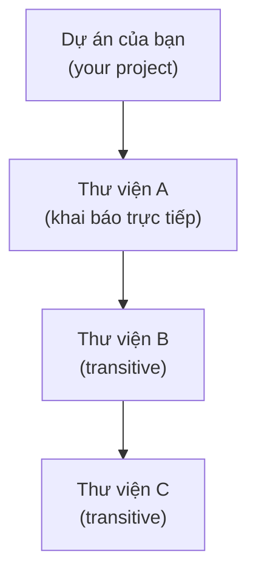
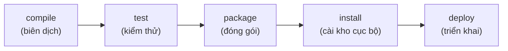
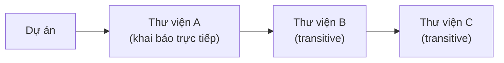
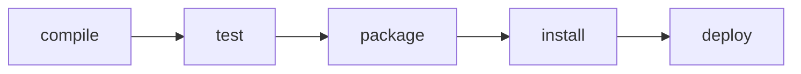

# 1. Tổng quan công cụ Build (Build Tools)

Công cụ build là phần mềm tự động hóa quá trình biến mã nguồn thành sản phẩm chạy được: biên dịch, tải thư viện, chạy test rồi đóng gói. Bài này giới thiệu vì sao cần công cụ build, khái niệm dependency, vòng đời build và so sánh ba công cụ phổ biến Maven, Gradle, Bazel. Đây là kiến thức nền giúp bạn quản lý dự án Java thực tế thay vì biên dịch tay từng file.

[](pathname:///img/java/tong-quan-build-tools.webp)

---

:::note[Ghi nhớ nhanh]

- ⭐ **Công cụ build tự động hóa** — biên dịch, tải thư viện, chạy test và đóng gói chỉ bằng một lệnh, thay cho `javac` tay.
- ⭐ **Quản lý phụ thuộc** — tự tải cả cây `transitive dependencies` và xử lý xung đột phiên bản; mỗi lib định danh bằng `groupId:artifactId:version`.
- **Vòng đời build tuần tự** — compile → test → package → install → deploy; gọi bước sau tự chạy các bước trước.
- **Ba công cụ chính** — `Maven` (dễ học), `Gradle` (linh hoạt, nhanh), `Bazel` (dự án cực lớn, đa ngôn ngữ).
- **Người mới nên bắt đầu với Maven**.

:::

---

## Mục lục

- [Vì sao cần công cụ Build?](#vì-sao-cần-công-cụ-build)
- [Dependency là gì?](#dependency-là-gì)
- [Quản lý phụ thuộc (Dependency Management)](#quản-lý-phụ-thuộc-dependency-management)
- [Vòng đời build (Build Lifecycle)](#vòng-đời-build-build-lifecycle)
- [So sánh Maven, Gradle và Bazel](#so-sánh-maven-gradle-và-bazel)
- [Chọn công cụ nào?](#chọn-công-cụ-nào)
- [Lỗi thường gặp](#lỗi-thường-gặp)
- [Tóm tắt](#tóm-tắt)
- [Câu hỏi phỏng vấn](#câu-hỏi-phỏng-vấn)

---

## Vì sao cần công cụ Build?

Khi mới học Java, bạn thường biên dịch (compile) tay bằng lệnh:

```bash
# Biên dịch một file Java đơn giản
javac HelloWorld.java

# Chạy chương trình
java HelloWorld
```

Việc này ổn khi chỉ có 1-2 file. Nhưng dự án thật có thể có **hàng trăm file**, dùng **hàng chục thư viện** bên ngoài, cần chạy test, đóng gói thành file `.jar`, rồi triển khai (deploy). Làm tay tất cả những việc đó sẽ vừa chậm vừa dễ sai.

**Công cụ build (Build Tool)** là phần mềm tự động hóa toàn bộ quy trình biến mã nguồn (source code) thành sản phẩm chạy được.

> **Ví dụ đời thường:** Hãy tưởng tượng bạn nấu một bữa tiệc cho 50 người. Nếu tự đi chợ, sơ chế, nấu, dọn bàn một mình thì rất mệt. Công cụ build giống như một "đầu bếp trưởng kiêm quản lý": tự đi mua nguyên liệu (tải thư viện), nấu theo công thức (biên dịch), nếm thử (chạy test), và bày ra đĩa (đóng gói) — tất cả theo một quy trình chuẩn.

Công cụ build giúp bạn:

- **Biên dịch (compile)** toàn bộ mã nguồn chỉ bằng một lệnh.
- **Tải tự động** các thư viện cần thiết từ Internet.
- **Chạy test** để kiểm tra code có đúng không.
- **Đóng gói (package)** thành file `.jar` hoặc `.war`.
- **Tái lập (reproducible)**: máy nào chạy cũng cho kết quả giống nhau.

---

## Dependency là gì?

**Dependency (thư viện phụ thuộc)** là một đoạn code do người khác viết sẵn mà dự án của bạn cần dùng tới.

> **Ví dụ đời thường:** Bạn muốn làm bánh mà không tự xay bột. Bạn mua bột làm sẵn ở siêu thị. "Gói bột" đó chính là một dependency — bạn phụ thuộc vào nó để làm ra cái bánh.

Ví dụ trong Java, thay vì tự viết code đọc file JSON, bạn dùng thư viện **Jackson** hoặc **Gson**. Thay vì tự viết code kết nối cơ sở dữ liệu, bạn dùng **JDBC driver**.

Mỗi dependency thường được xác định bằng 3 thông tin:

- **groupId**: tổ chức/công ty tạo ra thư viện (ví dụ `com.google.code.gson`).
- **artifactId**: tên của thư viện (ví dụ `gson`).
- **version**: phiên bản (ví dụ `2.10.1`).

```text
com.google.code.gson : gson : 2.10.1
   groupId           : artifactId : version
```

---

## Quản lý phụ thuộc (Dependency Management)

Vấn đề lớn nhất khi dùng thư viện là **phụ thuộc lồng nhau (transitive dependencies)**.

> **Ví dụ đời thường:** Bạn mua gói bột làm bánh (thư viện A). Nhưng gói bột đó lại cần thêm men nở (thư viện B), và men nở lại cần chất bảo quản (thư viện C). Nếu phải tự đi tìm từng thứ thì rất rối.

Công cụ build sẽ **tự động tải cả "cây" phụ thuộc** đó cho bạn. Bạn chỉ cần khai báo thư viện A, nó sẽ tự kéo về B và C.

Sơ đồ dưới minh hoạ cách một khai báo duy nhất kéo theo cả cây phụ thuộc lồng nhau:



Nó cũng giải quyết **xung đột phiên bản (version conflict)**: nếu thư viện X cần `gson 2.8` còn thư viện Y cần `gson 2.10`, công cụ build sẽ chọn một phiên bản phù hợp thay vì để chương trình lỗi.

---

## Vòng đời build (Build Lifecycle)

**Vòng đời build (Build Lifecycle)** là chuỗi các bước theo thứ tự để biến mã nguồn thành sản phẩm. Các bước phổ biến nhất:

| Bước | Tên tiếng Anh | Ý nghĩa |
|------|---------------|---------|
| 1 | **compile** | Biên dịch mã nguồn `.java` thành `.class` (mã máy ảo). |
| 2 | **test** | Chạy các bài kiểm thử (unit test) để xác nhận code đúng. |
| 3 | **package** | Đóng gói thành file `.jar` / `.war`. |
| 4 | **install** | Cài file đã đóng gói vào kho cục bộ trên máy bạn. |
| 5 | **deploy** | Đưa sản phẩm lên kho chung hoặc máy chủ. |

> **Ví dụ đời thường:** Giống quy trình làm bánh: nhào bột (compile) → nướng thử một cái để nếm (test) → đóng hộp (package) → cất vào tủ nhà mình (install) → giao ra cửa hàng (deploy). Các bước này có thứ tự: không thể đóng hộp khi chưa nướng xong.

Một đặc điểm quan trọng: các bước này **chạy tuần tự**. Khi bạn gọi bước `package`, công cụ build sẽ tự động chạy luôn các bước trước đó (`compile`, `test`).

Sơ đồ dưới minh hoạ thứ tự các bước trong vòng đời build:



---

## So sánh Maven, Gradle và Bazel

Có ba công cụ build phổ biến trong thế giới Java/JVM:

| Tiêu chí | **Maven** | **Gradle** | **Bazel** |
|----------|-----------|------------|-----------|
| File cấu hình | `pom.xml` (XML) | `build.gradle` (Groovy/Kotlin) | `BUILD` (Starlark) |
| Phong cách | Khai báo cố định | Linh hoạt, viết script được | Tập trung tốc độ & quy mô lớn |
| Tốc độ | Trung bình | Nhanh (có cache) | Rất nhanh (incremental) |
| Độ dễ học | Dễ cho người mới | Trung bình | Khó |
| Đa ngôn ngữ | Chủ yếu JVM | Chủ yếu JVM | Nhiều ngôn ngữ (Java, C++, Go...) |
| Phổ biến nhất với | Dự án Java truyền thống | Android, dự án hiện đại | Công ty lớn (Google) |

- **Maven**: ra đời sớm, cấu hình bằng XML rõ ràng nhưng dài dòng. Rất phù hợp người mới vì có quy tắc cố định ("convention over configuration" — quy ước hơn cấu hình).
- **Gradle**: linh hoạt hơn, viết bằng ngôn ngữ script nên ngắn gọn và mạnh mẽ. Là chuẩn của lập trình Android.
- **Bazel**: do Google tạo ra cho dự án **cực lớn, đa ngôn ngữ**. Mạnh về tốc độ build tăng tiến và tái lập, nhưng phức tạp cho người mới.

---

## Chọn công cụ nào?

Lời khuyên cho người mới học:

- **Học Maven trước** — đơn giản, dễ hiểu, tài liệu nhiều, đa số dự án doanh nghiệp dùng.
- Học **Gradle** khi làm Android hoặc dự án hiện đại cần tốc độ.
- Chỉ cần **biết tới Bazel** là gì, dùng khi vào công ty rất lớn yêu cầu.

---

## Lỗi thường gặp

- **Cài tay từng thư viện thay vì dùng công cụ build.** Rất dễ thiếu phụ thuộc lồng nhau, dẫn đến lỗi `ClassNotFoundException`. Hãy luôn khai báo dependency cho công cụ build.
- **Quên rằng bước sau tự chạy bước trước.** Nhiều người chạy `compile` rồi mới chạy `test` riêng lẻ — thực ra chỉ cần gọi bước sau cùng là đủ.
- **Nhầm lẫn giữa version của công cụ build và version của Java.** Đây là hai thứ khác nhau hoàn toàn.
- **Không hiểu transitive dependency.** Tưởng chỉ cần thư viện mình khai báo, không biết nó còn kéo theo nhiều thư viện khác — nên ngạc nhiên khi thấy thư mục thư viện rất nặng.

---

## Tóm tắt

- **Công cụ build** tự động hóa việc biên dịch, test, đóng gói và quản lý thư viện.
- **Dependency (thư viện phụ thuộc)** là code người khác viết mà dự án bạn dùng tới, xác định bằng `groupId : artifactId : version`.
- **Quản lý phụ thuộc** tự động tải cả cây phụ thuộc lồng nhau và xử lý xung đột phiên bản.
- **Vòng đời build** gồm các bước tuần tự: compile → test → package → install → deploy.
- Ba công cụ phổ biến: **Maven** (dễ học), **Gradle** (linh hoạt, nhanh), **Bazel** (dự án lớn, đa ngôn ngữ).
- Người mới nên bắt đầu với **Maven**.

---

## Câu hỏi phỏng vấn

Những câu thường gặp về chủ đề này. Tự trả lời trước, rồi bấm **Xem đáp án** để đối chiếu.

**1. Công cụ build tự động hóa những công việc gì? Nếu không có nó, những vấn đề gì sẽ xảy ra với dự án nhiều file?**

<details className="qa">
<summary>Xem đáp án</summary>

Công cụ build tự động hóa toàn bộ quy trình biến mã nguồn thành sản phẩm chạy được: **biên dịch** (compile) mã nguồn, **tải thư viện** cần thiết, **chạy test**, **đóng gói** (package) thành `.jar`/`.war`, và **triển khai** (deploy).

Không có nó, dự án nhiều file sẽ gặp:
- Phải gõ tay lệnh `javac` cho hàng trăm file, dễ sót hoặc sai thứ tự biên dịch.
- Phải tự tải và quản lý hàng chục thư viện `.jar` cùng các phụ thuộc lồng nhau của chúng.
- Mỗi thành viên trong nhóm có thể build ra kết quả khác nhau (không tái lập được), gây lỗi "chạy máy tôi được mà máy bạn không được".

</details>

**2. Một dependency được xác định duy nhất bằng những thông tin nào? Cho ví dụ.**

<details className="qa">
<summary>Xem đáp án</summary>

Bằng ba thành phần gọi là **GAV**: **`groupId`** (tổ chức/công ty tạo ra thư viện), **`artifactId`** (tên thư viện), **`version`** (phiên bản cụ thể).

```text
com.google.code.gson : gson : 2.10.1
   groupId           : artifactId : version
```

Ba giá trị này kết hợp lại xác định **chính xác một phiên bản** của một thư viện trên toàn thế giới, tránh nhầm lẫn giữa các thư viện trùng tên hoặc các phiên bản khác nhau của cùng một thư viện.

</details>

**3. Transitive dependency (phụ thuộc chuyền tiếp/bắc cầu) là gì? Vì sao nắm được khái niệm này giúp tránh bất ngờ khi làm việc thực tế?**

<details className="qa">
<summary>Xem đáp án</summary>

**Transitive dependency** là các thư viện mà **chính thư viện bạn khai báo lại cần dùng tới**, dù bạn không khai báo trực tiếp. Ví dụ: dự án khai báo thư viện A, A lại cần thư viện B, B lại cần thư viện C — bạn chỉ khai báo A, nhưng công cụ build sẽ tự tải cả A, B, C.



Hiểu khái niệm này giúp không bất ngờ khi thấy thư mục thư viện (`~/.m2` hay cache Gradle) chứa nhiều thư viện hơn hẳn số dòng bạn khai báo, và giúp debug đúng nguyên nhân khi gặp lỗi xung đột phiên bản giữa các thư viện chuyền tiếp.

</details>

**4. Xung đột phiên bản (version conflict) xảy ra khi nào? Công cụ build xử lý tình huống này ra sao?**

<details className="qa">
<summary>Xem đáp án</summary>

Xảy ra khi **hai thư viện khác nhau trong cùng dự án đòi hỏi hai phiên bản khác nhau** của cùng một thư viện thứ ba. Ví dụ: thư viện X cần `gson 2.8`, còn thư viện Y cần `gson 2.10` — nhưng dự án chỉ có thể có **một** phiên bản `gson` duy nhất trên classpath.

Thay vì để chương trình lỗi ngay lập tức, công cụ build áp dụng một **quy tắc chọn phiên bản (dependency resolution/mediation)** để tự động chọn ra một phiên bản duy nhất dùng chung cho toàn dự án (mỗi công cụ có chiến lược chọn riêng — ví dụ Maven ưu tiên phiên bản "gần" khai báo trực tiếp hơn). Nếu phiên bản được chọn không tương thích với một trong hai thư viện, lỗi runtime khó hiểu như `NoSuchMethodError` có thể xảy ra dù build vẫn thành công.

</details>

**5. Vòng đời build (build lifecycle) gồm những bước nào và theo thứ tự ra sao? Điều gì xảy ra khi bạn chỉ gọi bước `package`?**

<details className="qa">
<summary>Xem đáp án</summary>

Các bước phổ biến theo thứ tự: **compile → test → package → install → deploy**.



Đặc điểm quan trọng: các bước **chạy tuần tự và phụ thuộc lẫn nhau** — khi bạn gọi một bước, công cụ build sẽ **tự động chạy tất cả các bước đứng trước nó**. Vì vậy chỉ cần gọi `package`, công cụ build sẽ tự chạy `compile` rồi `test` trước, bạn không cần (và không nên) gọi từng bước riêng lẻ.

</details>

**6. Tình huống: bạn dẫn dắt một dự án Java doanh nghiệp truyền thống, không cần đa ngôn ngữ, đội ngũ đa số mới vào nghề. Nên chọn Maven, Gradle hay Bazel? Còn nếu đó là dự án Android?**

<details className="qa">
<summary>Xem đáp án</summary>

- **Dự án Java doanh nghiệp truyền thống, đội mới**: nên chọn **Maven** — cấu hình XML tường minh theo quy ước cố định, dễ học, tài liệu phong phú, phù hợp khi không cần logic build tùy biến phức tạp.
- **Dự án Android**: bắt buộc thực tế phải dùng **Gradle** — đây là công cụ build chính thức của Android, tích hợp sẵn trong Android Studio và hệ sinh thái plugin Android.
- **Bazel** chỉ nên cân nhắc khi dự án đạt quy mô **cực lớn, đa ngôn ngữ** (monorepo hàng nghìn module) và có đội ngũ đủ mạnh để vận hành — không phù hợp với tình huống được mô tả ở trên.

</details>

**7. Vì sao cài thư viện thủ công (tải `.jar` rồi tự thêm vào classpath) dễ dẫn tới lỗi `ClassNotFoundException` hoặc `NoClassDefFoundError` khi chạy chương trình, dù code biên dịch bình thường?**

<details className="qa">
<summary>Xem đáp án</summary>

Vì khi cài thủ công, người lập trình thường chỉ tải **đúng thư viện mình biết tới** mà quên mất (hoặc không biết) rằng thư viện đó còn có các **transitive dependency** riêng cần thiết để nó hoạt động đầy đủ lúc chạy (runtime), dù không phải lúc nào cũng cần lúc biên dịch (compile-time).

- Nếu thiếu một class chỉ được dùng ở **runtime** (ví dụ tải động qua reflection, hay chỉ chạy tới một nhánh code cụ thể mới gọi tới), chương trình vẫn **biên dịch thành công** vì compiler không kiểm tra tới đó — nhưng khi chạy tới đoạn code cần class thiếu đó, JVM sẽ ném `ClassNotFoundException` hoặc `NoClassDefFoundError`.
- Công cụ build tự động kéo **toàn bộ cây transitive dependency** khi bạn khai báo một thư viện, nên loại lỗi thiếu sót do quên tải tay gần như không xảy ra.

</details>

**8. Build "tái lập" (reproducible build) nghĩa là gì? Vì sao đặc tính này quan trọng với CI/CD?**

<details className="qa">
<summary>Xem đáp án</summary>

**Reproducible build** nghĩa là: cùng một mã nguồn và cùng một cấu hình build, chạy ở **bất kỳ máy nào, vào bất kỳ thời điểm nào**, đều cho ra **kết quả giống hệt nhau** — không phụ thuộc vào việc máy đó đã cài sẵn thư viện gì, phiên bản công cụ gì đang có sẵn trên máy.

Quan trọng với CI/CD (Continuous Integration/Continuous Deployment — tích hợp và triển khai liên tục) vì:
- Đảm bảo bản build chạy trên máy chủ CI **giống hệt** bản mà lập trình viên build và test trên máy cá nhân — tránh tình huống "qua được trên máy tôi nhưng CI báo lỗi".
- Cho phép **tái tạo lại chính xác** một bản build cũ (ví dụ để điều tra lỗi sản phẩm ở phiên bản đã phát hành trước đó) mà không lo kết quả bị lệch do môi trường thay đổi theo thời gian.

</details>
