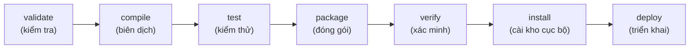

# 2. Maven

Maven là công cụ build phổ biến nhất cho Java, hoạt động theo nguyên tắc "quy ước hơn cấu hình" nên rất dễ học cho người mới. Bài này giới thiệu file `pom.xml`, cách khai báo thư viện, kho Maven Central, các lệnh `mvn` cơ bản và vòng đời build. Nắm vững Maven giúp bạn quản lý dự án Java truyền thống một cách gọn gàng và chuẩn mực.

[](pathname:///img/java/maven.webp)

---

:::note[Ghi nhớ nhanh]

- ⭐ **`pom.xml` là trái tim dự án** — khai báo `groupId`, `artifactId`, `version` (GAV) và dependencies, theo nguyên tắc "quy ước hơn cấu hình".
- ⭐ **Khai báo dependency, Maven tự tải** — kéo cả phụ thuộc chuyền tiếp từ Maven Central, lưu vào kho cục bộ `~/.m2`.
- **`<scope>`** — xác định phạm vi dùng thư viện: `compile`, `test`, `provided`, `runtime`.
- **Lệnh chính** — `mvn clean`, `compile`, `test`, `package`, `install`; gọi một phase tự chạy các phase trước.
- **Plugin** — thứ thực sự thực thi công việc trong từng phase.

:::

---

## Mục lục

- [Vì sao dùng Maven?](#vì-sao-dùng-maven)
- [Maven là gì?](#maven-là-gì)
- [File pom.xml](#file-pomxml)
- [groupId, artifactId, version](#groupid-artifactid-version)
- [Khai báo dependencies](#khai-báo-dependencies)
- [Repository và Maven Central](#repository-và-maven-central)
- [Các lệnh mvn cơ bản](#các-lệnh-mvn-cơ-bản)
- [Vòng đời build của Maven](#vòng-đời-build-của-maven)
- [Plugin](#plugin)
- [Lỗi thường gặp](#lỗi-thường-gặp)
- [Tóm tắt](#tóm-tắt)
- [Câu hỏi phỏng vấn](#câu-hỏi-phỏng-vấn)

---

## Vì sao dùng Maven?

**Vấn đề:** Một dự án Java thực tế cần rất nhiều thư viện. Nếu làm thủ công, bạn phải tự lên mạng tải từng file `.jar`, đặt vào classpath, rồi tự tay giải quyết **phụ thuộc chuyền tiếp (transitive dependencies)** — lib A cần lib B, B lại cần C — và xử lý xung đột phiên bản giữa chúng. Đó là một cơn ác mộng: mỗi người trong nhóm build một kiểu, rất khó tái lập kết quả giống nhau.

```bash
# Tải tay từng JAR rồi nhồi hết vào classpath
javac -cp "libs/gson-2.10.1.jar:libs/junit-5.10.0.jar:libs/..." src/...

# Còn các lib mà những lib trên cần? Phải tự đi tìm và tải tiếp.
# Lib nào cần bản nào? Bản nào xung đột? Tự dò bằng tay.
```

**Giải pháp:** **Maven** giải quyết trọn gói. Bạn chỉ cần **khai báo dependency trong `pom.xml`**, Maven sẽ **tự tải** từ repository (kể cả các phụ thuộc chuyền tiếp) và tự quản lý phiên bản. Maven cũng **chuẩn hoá vòng đời build** (compile → test → package → install) theo nguyên tắc "convention over configuration" và áp một cấu trúc thư mục chuẩn.

```xml
<dependencies>
    <!-- Khai báo 1 dependency, Maven tự lo phần còn lại -->
    <dependency>
        <groupId>com.google.code.gson</groupId>
        <artifactId>gson</artifactId>
        <version>2.10.1</version>
    </dependency>
</dependencies>
```

:::tip[Dùng thực tế]

- **Thêm thư viện trong vài giây:** chỉ cần copy vài dòng `<dependency>` vào `pom.xml`, không phải tải JAR thủ công.
- **Build chuẩn cho mọi người:** cả nhóm dùng chung lệnh `mvn clean package`, ai chạy cũng ra kết quả giống nhau.
- **Quản lý phiên bản tập trung:** đổi version thư viện tại một chỗ trong `pom.xml`, áp dụng cho toàn dự án.
- **Tái lập build trên CI:** máy chủ tích hợp liên tục (CI) chạy cùng `pom.xml` nên build giống hệt máy của bạn.

:::

---

## Maven là gì?

**Maven** (đọc là "mây-vừn") là công cụ build phổ biến nhất cho Java. Nó hoạt động theo nguyên tắc **"convention over configuration" (quy ước hơn cấu hình)**: nếu bạn đặt file đúng vị trí quy ước, Maven tự biết phải làm gì mà không cần khai báo dài dòng.

> **Ví dụ đời thường:** Maven giống một căn bếp mẫu được thiết kế sẵn: dao để ngăn này, gia vị để ngăn kia. Vì mọi căn bếp đều bố trí giống nhau, đầu bếp nào vào cũng làm việc được ngay mà không cần hỏi.

Cấu trúc thư mục quy ước của Maven:

```text
my-project/
├── pom.xml                          # File cấu hình chính
└── src/
    ├── main/
    │   ├── java/                    # Mã nguồn chính (.java)
    │   └── resources/               # File tài nguyên (cấu hình, ảnh...)
    └── test/
        ├── java/                    # Mã nguồn cho test
        └── resources/               # Tài nguyên cho test
```

---

## File pom.xml

**POM** là viết tắt của **Project Object Model (mô hình đối tượng dự án)**. File `pom.xml` là "trái tim" của một dự án Maven — nơi khai báo mọi thứ về dự án.

```xml
<?xml version="1.0" encoding="UTF-8"?>
<project xmlns="http://maven.apache.org/POM/4.0.0"
         xmlns:xsi="http://www.w3.org/2001/XMLSchema-instance"
         xsi:schemaLocation="http://maven.apache.org/POM/4.0.0
                             http://maven.apache.org/xsd/maven-4.0.0.xsd">

    <!-- Phiên bản chuẩn của file POM, hầu như luôn là 4.0.0 -->
    <modelVersion>4.0.0</modelVersion>

    <!-- Định danh của chính dự án này -->
    <groupId>com.example</groupId>
    <artifactId>my-app</artifactId>
    <version>1.0.0</version>

    <!-- Cấu hình chung cho dự án -->
    <properties>
        <!-- Dùng Java 17 để biên dịch -->
        <maven.compiler.source>17</maven.compiler.source>
        <maven.compiler.target>17</maven.compiler.target>
        <!-- Mã hóa file là UTF-8 để hỗ trợ tiếng Việt -->
        <project.build.sourceEncoding>UTF-8</project.build.sourceEncoding>
    </properties>

</project>
```

---

## groupId, artifactId, version

Ba thẻ này (gọi tắt là **GAV**) là "căn cước công dân" của dự án, giúp phân biệt nó với mọi dự án khác trên thế giới.

```xml
<!-- groupId: tên tổ chức/công ty, thường viết ngược tên miền -->
<groupId>com.example</groupId>

<!-- artifactId: tên riêng của dự án/thư viện -->
<artifactId>my-app</artifactId>

<!-- version: phiên bản. SNAPSHOT nghĩa là bản đang phát triển -->
<version>1.0.0</version>
```

> **Ví dụ đời thường:** `groupId` giống họ (Nguyễn, Trần...), `artifactId` giống tên riêng, còn `version` giống "phiên bản tuổi" của bạn năm nay. Kết hợp cả ba thì xác định được duy nhất một người.

> **Lưu ý:** Đuôi `-SNAPSHOT` (ví dụ `1.0.0-SNAPSHOT`) báo cho Maven biết đây là bản đang phát triển, chưa ổn định, có thể thay đổi liên tục.

---

## Khai báo dependencies

Để dùng thư viện ngoài, bạn khai báo trong thẻ `<dependencies>`:

```xml
<dependencies>
    <!-- Thư viện Gson để đọc/ghi JSON -->
    <dependency>
        <groupId>com.google.code.gson</groupId>
        <artifactId>gson</artifactId>
        <version>2.10.1</version>
    </dependency>

    <!-- JUnit 5 để viết unit test -->
    <dependency>
        <groupId>org.junit.jupiter</groupId>
        <artifactId>junit-jupiter</artifactId>
        <version>5.10.0</version>
        <!-- scope = test: chỉ dùng khi chạy test, không đóng gói vào sản phẩm -->
        <scope>test</scope>
    </dependency>
</dependencies>
```

Thẻ `<scope>` cho biết phạm vi sử dụng của thư viện:

- `compile` (mặc định): dùng ở mọi nơi.
- `test`: chỉ dùng khi chạy test.
- `provided`: máy chủ sẽ cung cấp, không đóng gói kèm.
- `runtime`: chỉ cần khi chạy, không cần khi biên dịch.

---

## Repository và Maven Central

**Repository (kho chứa)** là nơi lưu trữ các thư viện. Có hai loại chính:

- **Maven Central**: kho công khai khổng lồ trên Internet, chứa gần như mọi thư viện Java. Đây là nơi Maven tự động tải thư viện về.
- **Local repository (kho cục bộ)**: thư mục `~/.m2/repository` trên máy bạn, nơi Maven lưu lại các thư viện đã tải để lần sau dùng không phải tải lại.

> **Ví dụ đời thường:** Maven Central giống siêu thị lớn ngoài thành phố — có đủ mọi thứ. Local repository giống tủ lạnh nhà bạn — lần đầu phải ra siêu thị mua, nhưng mua rồi thì cất vào tủ, lần sau lấy ra dùng ngay khỏi đi mua nữa.

---

## Các lệnh mvn cơ bản

Bạn chạy Maven bằng lệnh `mvn` trong terminal:

```bash
# Xóa thư mục target/ (sản phẩm build cũ)
mvn clean

# Biên dịch mã nguồn chính
mvn compile

# Chạy toàn bộ unit test
mvn test

# Đóng gói thành file .jar (tự chạy compile + test trước)
mvn package

# Cài file .jar vào kho cục bộ ~/.m2 để dự án khác dùng được
mvn install

# Kết hợp: dọn sạch rồi đóng gói lại từ đầu (rất hay dùng)
mvn clean package
```

---

## Vòng đời build của Maven

Maven có một **vòng đời (lifecycle)** với các giai đoạn (phase) chạy theo thứ tự cố định. Khi bạn gọi một phase, Maven **tự động chạy tất cả phase đứng trước nó**.

```text
validate → compile → test → package → verify → install → deploy
```

Ví dụ: khi bạn gõ `mvn package`, Maven sẽ tự chạy lần lượt `validate`, `compile`, `test` rồi mới `package`.

Sơ đồ dưới minh hoạ chuỗi phase chạy tuần tự trong vòng đời của Maven:



> **Ví dụ đời thường:** Giống thang cuốn đi lên: bạn muốn lên tầng 4 (package) thì bắt buộc phải đi qua tầng 1, 2, 3. Không thể nhảy thẳng lên tầng 4 mà bỏ qua các tầng dưới.

---

## Plugin

**Plugin (phần mở rộng)** là thứ thực sự làm công việc trong Maven. Mỗi phase được thực thi bởi một plugin nào đó. Bạn cũng có thể thêm plugin để làm việc đặc biệt.

```xml
<build>
    <plugins>
        <!-- Plugin tạo file .jar có thể chạy trực tiếp bằng java -jar -->
        <plugin>
            <groupId>org.apache.maven.plugins</groupId>
            <artifactId>maven-jar-plugin</artifactId>
            <version>3.4.1</version>
            <configuration>
                <archive>
                    <manifest>
                        <!-- Chỉ định class chứa hàm main -->
                        <mainClass>com.example.Main</mainClass>
                    </manifest>
                </archive>
            </configuration>
        </plugin>
    </plugins>
</build>
```

> **Ví dụ đời thường:** Maven là một chiếc máy khoan, còn plugin là các đầu khoan khác nhau. Muốn khoan tường thì lắp đầu này, muốn vặn vít thì lắp đầu khác. Bản thân Maven không làm gì cả — plugin mới làm việc.

---

## Lỗi thường gặp

- **`mvn` không phải là lệnh nội bộ.** Bạn chưa cài Maven hoặc chưa thêm vào biến môi trường `PATH`. Kiểm tra bằng `mvn -version`.
- **Sai groupId/artifactId/version của dependency.** Maven sẽ báo `Could not find artifact`. Hãy copy chính xác từ trang [search.maven.org](https://search.maven.org).
- **Đặt file Java sai thư mục.** Maven chỉ tìm code trong `src/main/java`. Để code chỗ khác sẽ không được biên dịch.
- **Quên thẻ `<scope>test</scope>` cho thư viện test.** Khiến thư viện test bị đóng gói nhầm vào sản phẩm cuối, làm file `.jar` nặng hơn cần thiết.
- **Không chạy `mvn clean` trước khi build lại.** Đôi khi file cũ trong `target/` gây kết quả sai. Thói quen tốt là dùng `mvn clean package`.

---

## Tóm tắt

- **Maven** là công cụ build Java phổ biến nhất, theo nguyên tắc "quy ước hơn cấu hình".
- File **`pom.xml`** là trái tim của dự án, khai báo `groupId`, `artifactId`, `version` (GAV).
- **Dependencies** được khai báo trong thẻ `<dependencies>`, với `<scope>` xác định phạm vi dùng.
- **Maven Central** là kho thư viện công khai; **local repository** (`~/.m2`) lưu thư viện đã tải.
- Các lệnh chính: `mvn clean`, `compile`, `test`, `package`, `install`.
- **Vòng đời** chạy tuần tự; gọi một phase sẽ tự chạy các phase trước nó.
- **Plugin** là thứ thực sự thực thi công việc trong từng phase.

---

## Câu hỏi phỏng vấn

Những câu thường gặp về chủ đề này. Tự trả lời trước, rồi bấm **Xem đáp án** để đối chiếu.

**1. `pom.xml` là gì? Nguyên tắc "convention over configuration" thể hiện ở đâu trong Maven?**

<details className="qa">
<summary>Xem đáp án</summary>

`pom.xml` (**Project Object Model**) là file cấu hình trung tâm của một dự án Maven — khai báo định danh dự án (GAV), dependencies, plugin và các thiết lập build khác.

**"Convention over configuration"** (quy ước hơn cấu hình) thể hiện ở cấu trúc thư mục **cố định** mà Maven mặc định hiểu, không cần khai báo lại trong `pom.xml`:

```text
src/main/java/        # mã nguồn chính
src/main/resources/   # tài nguyên đi kèm
src/test/java/        # mã nguồn test
```

Nếu bạn đặt file đúng các vị trí quy ước này, Maven tự biết cách biên dịch/đóng gói mà không cần chỉ định đường dẫn thủ công — khác với việc phải khai báo tường minh từng đường dẫn như một số công cụ khác.

</details>

**2. Liệt kê các `<scope>` phổ biến của dependency trong Maven và cho ví dụ tình huống dùng mỗi loại.**

<details className="qa">
<summary>Xem đáp án</summary>

| Scope | Ý nghĩa | Ví dụ |
|---|---|---|
| `compile` (mặc định) | Dùng ở mọi giai đoạn: biên dịch, test, chạy; được đóng gói vào sản phẩm cuối | Thư viện nghiệp vụ chính như Gson, Jackson |
| `test` | Chỉ dùng khi biên dịch/chạy test, không đóng gói vào sản phẩm cuối | JUnit, Mockito |
| `provided` | Cần lúc biên dịch, nhưng **môi trường chạy đã có sẵn** nên không đóng gói kèm | `servlet-api` khi deploy lên Tomcat (Tomcat đã có sẵn) |
| `runtime` | Không cần lúc biên dịch, chỉ cần khi **chạy chương trình** | JDBC driver cụ thể (code chỉ gọi qua interface JDBC chuẩn lúc compile) |

Chọn sai `scope` — ví dụ quên đặt `provided` cho `servlet-api` — có thể khiến file `.war` bị đóng gói dư thừa thư viện đã có sẵn ở server, hoặc gây xung đột phiên bản với server đích.

</details>

**3. Khi bạn chạy `mvn package`, Maven thực hiện đúng các bước nào? Liệt kê theo đúng thứ tự.**

<details className="qa">
<summary>Xem đáp án</summary>

Maven sẽ tự động chạy **tất cả các phase đứng trước** `package` trong vòng đời, theo thứ tự:

```text
validate → compile → test → package
```

Cụ thể: `validate` (kiểm tra cấu trúc dự án hợp lệ) → `compile` (biên dịch mã nguồn chính) → `test` (chạy unit test) → `package` (đóng gói thành `.jar`/`.war`). Nếu bất kỳ phase nào trước đó thất bại (ví dụ một test fail), Maven sẽ **dừng lại ngay**, không tiếp tục sang `package`.

</details>

**4. Maven Central và local repository (`~/.m2`) khác nhau thế nào? Điều gì xảy ra ở lần build đầu tiên so với các lần build sau?**

<details className="qa">
<summary>Xem đáp án</summary>

- **Maven Central**: kho công khai trên Internet, chứa gần như mọi thư viện Java mã nguồn mở — nơi Maven tải thư viện về lần đầu.
- **Local repository** (`~/.m2/repository`): thư mục cục bộ trên máy bạn, nơi Maven **lưu cache** lại mọi thư viện đã tải.

Lần build **đầu tiên**: Maven phải tải thư viện từ Maven Central về (tốn thời gian, cần mạng). Các lần build **sau**: nếu thư viện với đúng GAV đã có sẵn trong `~/.m2`, Maven **dùng lại luôn** từ cache cục bộ, không tải lại — giúp các lần build sau nhanh hơn nhiều và có thể build offline nếu mọi dependency đã có sẵn trong cache.

</details>

**5. Hậu tố `-SNAPSHOT` trong version (ví dụ `1.0.0-SNAPSHOT`) có ý nghĩa gì? Khác gì so với version release bình thường (`1.0.0`)?**

<details className="qa">
<summary>Xem đáp án</summary>

`-SNAPSHOT` đánh dấu đây là một **bản đang phát triển (development version)**, chưa ổn định và có thể thay đổi liên tục — trái với version release (`1.0.0` không có hậu tố) được coi là **bất biến (immutable)**, một khi đã publish thì nội dung không đổi nữa.

Khác biệt quan trọng về hành vi:
- Với dependency có `-SNAPSHOT`, Maven sẽ **định kỳ kiểm tra và tải lại bản mới nhất** từ repository (vì nội dung có thể đã thay đổi), thay vì chỉ dùng mãi bản đã cache trong `~/.m2`.
- Với version release, một khi đã tải về, Maven **tin tưởng tuyệt đối** cache cục bộ, không bao giờ tải lại — vì theo quy ước, nội dung của một version release đã publish sẽ không bao giờ thay đổi.

Trong thực tế, các bản release **không nên** phụ thuộc vào bất kỳ `-SNAPSHOT` nào của thư viện khác, vì bản SNAPSHOT có thể thay đổi bất cứ lúc nào, làm build không còn tái lập được.

</details>

**6. Plugin trong Maven là gì? Vì sao nói "bản thân Maven không tự làm gì cả"?**

<details className="qa">
<summary>Xem đáp án</summary>

**Plugin** (phần mở rộng) là thành phần thực sự **thực thi công việc** trong mỗi phase của vòng đời build — Maven chỉ đóng vai trò điều phối, gọi đúng plugin tương ứng ở đúng thời điểm.

Ví dụ: phase `compile` được thực thi bởi `maven-compiler-plugin`; phase `test` được thực thi bởi `maven-surefire-plugin`; đóng gói thành `.jar` chạy được (kèm `Main-Class` trong manifest) cần `maven-jar-plugin`.

```xml
<plugin>
    <groupId>org.apache.maven.plugins</groupId>
    <artifactId>maven-jar-plugin</artifactId>
    <configuration>
        <archive>
            <manifest>
                <mainClass>com.example.Main</mainClass>
            </manifest>
        </archive>
    </configuration>
</plugin>
```

Vì mọi hành động cụ thể đều do plugin đảm nhiệm, Maven tự nó chỉ là một "khung điều phối" (framework) — muốn thay đổi hành vi của một phase, bạn cấu hình hoặc thay plugin tương ứng, không sửa "lõi" của Maven.

</details>

**7. Tình huống: dự án của bạn có thư viện X yêu cầu `commons-lang3:3.9`, còn thư viện Y yêu cầu `commons-lang3:3.12`. Maven chọn phiên bản nào? Làm sao ép Maven dùng một version cụ thể nếu cần?**

<details className="qa">
<summary>Xem đáp án</summary>

Mặc định, Maven áp dụng quy tắc **"nearest wins"** (phiên bản khai báo **gần nhất** với dự án gốc trong cây phụ thuộc sẽ được chọn) khi có xung đột phiên bản của cùng một artifact.

Muốn **ép** Maven dùng đúng một version cụ thể bất kể quy tắc mặc định, khai báo **tường minh** dependency đó ngay trong `pom.xml` của dự án — vì dependency khai báo trực tiếp luôn có độ ưu tiên cao nhất (khoảng cách gần nhất = 0):

```xml
<dependency>
    <groupId>org.apache.commons</groupId>
    <artifactId>commons-lang3</artifactId>
    <version>3.12.0</version> <!-- ép dùng đúng version này, ghi đè quy tắc mặc định -->
</dependency>
```

Ngoài ra có thể dùng `<dependencyManagement>` ở mức cha (parent POM) để quản lý version tập trung cho toàn bộ dự án đa module.

</details>

**8. `mvn clean install` khác `mvn clean package` ở điểm nào? Khi nào cần dùng `install`?**

<details className="qa">
<summary>Xem đáp án</summary>

`install` là một phase đứng **sau** `package` trong vòng đời build, nên `mvn clean install` sẽ tự động chạy hết `package` trước, rồi thêm một bước: **sao chép file đã đóng gói vào local repository** (`~/.m2`).

Cần dùng `install` khi bạn có một dự án **khác trên cùng máy** (ví dụ một module khác trong dự án đa module, hay một thư viện nội bộ dùng chung) cần **tham chiếu tới artifact này như một dependency** — chúng chỉ tìm thấy được nó nếu nó đã được `install` vào `~/.m2`. Nếu chỉ cần file `.jar` để chạy độc lập, không có dự án nào khác phụ thuộc vào nó, `mvn clean package` là đủ.

</details>

**9. Dự án Maven đa module (multi-module project) là gì? `<parent>` và thẻ `<modules>` đóng vai trò gì?**

<details className="qa">
<summary>Xem đáp án</summary>

**Dự án đa module** là một dự án lớn được chia thành nhiều dự án con (module) độc lập, mỗi module có `pom.xml` riêng, nhưng dùng chung một **parent POM** ở thư mục gốc để quản lý tập trung.

```xml
<!-- pom.xml gốc (parent) -->
<packaging>pom</packaging>
<modules>
    <module>api</module>
    <module>service</module>
    <module>web</module>
</modules>
```

```xml
<!-- pom.xml của module con, ví dụ api/pom.xml -->
<parent>
    <groupId>com.example</groupId>
    <artifactId>my-app-parent</artifactId>
    <version>1.0.0</version>
</parent>
```

- **`<parent>`**: giúp module con **kế thừa** cấu hình chung (version Java, danh sách plugin, quản lý version dependency qua `<dependencyManagement>`) từ POM cha, tránh lặp lại cấu hình ở từng module.
- **`<modules>`**: khai báo ở POM cha, liệt kê các module con để khi build ở thư mục gốc, Maven biết build **tất cả** các module theo đúng thứ tự phụ thuộc giữa chúng.

</details>

**10. Gặp lỗi `Could not find artifact ... in central` khi chạy `mvn compile`. Liệt kê các nguyên nhân phổ biến và cách kiểm tra.**

<details className="qa">
<summary>Xem đáp án</summary>

Nguyên nhân phổ biến:
- **Sai `groupId`/`artifactId`/`version`**: gõ nhầm hoặc copy sai từ tài liệu — kiểm tra lại chính xác trên [search.maven.org](https://search.maven.org).
- **Thư viện nội bộ chưa được `install`**: nếu dependency là một module nội bộ của công ty/nhóm, cần chạy `mvn install` cho module đó trước để nó có mặt trong `~/.m2`.
- **Thiếu cấu hình repository riêng**: một số thư viện không nằm trên Maven Central mà ở kho riêng (ví dụ Nexus/Artifactory nội bộ công ty) — cần khai báo thêm thẻ `<repositories>` trỏ tới kho đó trong `pom.xml`.
- **Sự cố mạng/proxy**: máy không truy cập được Internet hoặc cần cấu hình proxy trong `settings.xml`.

Cách kiểm tra nhanh: chạy `mvn compile -X` (chế độ debug chi tiết) để xem chính xác Maven đang cố tải từ repository nào và thông điệp lỗi cụ thể.

</details>
