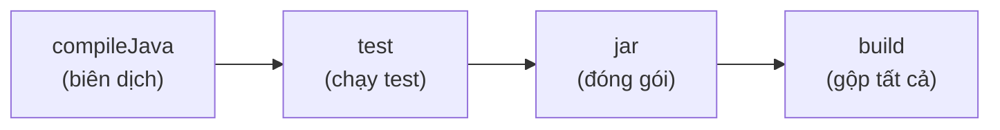

# 3. Gradle

Gradle là công cụ build hiện đại, linh hoạt và nhanh, dùng ngôn ngữ DSL (Groovy hoặc Kotlin) để viết cấu hình ngắn gọn hơn XML của Maven. Bài này giới thiệu file `build.gradle`, cách khai báo thư viện, khái niệm task, Gradle Wrapper và lý do Gradle nhanh hơn Maven. Đây là công cụ build chuẩn của Android và ngày càng phổ biến trong dự án Java/Kotlin hiện đại.

---

:::note[Ghi nhớ nhanh]

- ⭐ **Gradle dùng DSL (Groovy/Kotlin)** — cấu hình ngắn gọn, lập trình được thay cho XML; file `build.gradle` hoặc `build.gradle.kts`.
- ⭐ **Nhanh hơn Maven** — nhờ incremental build, build cache và Gradle Daemon.
- **Khai báo dependency 1 dòng** — `implementation 'groupId:artifactId:version'`; ưu tiên `implementation` hơn `api`.
- **`Task`** — đơn vị công việc cơ bản của Gradle, có thể tự định nghĩa.
- **Gradle Wrapper (`./gradlew`)** — đảm bảo cả nhóm dùng đúng một phiên bản Gradle; là chuẩn build của Android.

:::

---

## Mục lục

- [Vì sao có Gradle?](#vì-sao-có-gradle)
- [Gradle là gì?](#gradle-là-gì)
- [File build.gradle (Groovy và Kotlin DSL)](#file-buildgradle-groovy-và-kotlin-dsl)
- [Khai báo dependencies](#khai-báo-dependencies)
- [Task là gì?](#task-là-gì)
- [Gradle Wrapper](#gradle-wrapper)
- [Vì sao Gradle nhanh hơn Maven?](#vì-sao-gradle-nhanh-hơn-maven)
- [So sánh cú pháp Gradle với Maven](#so-sánh-cú-pháp-gradle-với-maven)
- [Lỗi thường gặp](#lỗi-thường-gặp)
- [Tóm tắt](#tóm-tắt)

---

## Vì sao có Gradle?

**Vấn đề:** Maven khai báo build bằng XML — dài dòng và **kém linh hoạt** khi cần logic build tuỳ biến (muốn thêm logic riêng thường phải viết hẳn một plugin). Với dự án lớn/đa module, build cũng **chậm** vì XML cố định, khó tận dụng tốt incremental build và cache.

```xml
<!-- Maven: chỉ để khai báo một thư viện đã mất nhiều dòng XML, không thể chèn logic -->
<dependency>
    <groupId>com.google.code.gson</groupId>
    <artifactId>gson</artifactId>
    <version>2.10.1</version>
</dependency>
```

**Giải pháp:** **Gradle** dùng **DSL (Groovy/Kotlin)** thay cho XML nên build script gọn, linh hoạt và **lập trình được** (thêm điều kiện, vòng lặp, task tuỳ biến ngay trong file). Gradle còn có **incremental build + build cache + daemon** → chỉ làm lại phần thay đổi, nhanh hơn nhiều cho dự án lớn. Đây cũng là công cụ build chuẩn của Android.

```kotlin
// Gradle (Kotlin DSL): khai báo gọn 1 dòng, lại có thể chèn logic ngay trong build
implementation("com.google.code.gson:gson:2.10.1")

if (project.hasProperty("debug")) {
    implementation("org.slf4j:slf4j-simple:2.0.9")  // Thêm thư viện tuỳ điều kiện
}
```

:::tip[Dùng thực tế]

- **Build Android / dự án đa module lớn** — Gradle là chuẩn của Android và xử lý nhiều module mượt mà.
- **Tuỳ biến quy trình build bằng code** — viết task riêng (sinh mã, copy file, đóng gói) ngay trong build script.
- **Build nhanh nhờ cache/incremental** — sửa một file chỉ build lại phần liên quan, không build lại toàn bộ.
- **Quản lý dependency như Maven nhưng linh hoạt hơn** — vẫn dùng Maven Central, thêm được logic chọn thư viện theo môi trường.

:::

---

## Gradle là gì?

**Gradle** (đọc là "grây-đồ") là công cụ build hiện đại, linh hoạt và nhanh. Khác với Maven dùng XML cố định, Gradle dùng một **DSL (Domain Specific Language — ngôn ngữ chuyên biệt)** để viết cấu hình. Nhờ đó file cấu hình ngắn gọn hơn và có thể chứa logic lập trình.

Gradle là công cụ build **chính thức của Android**, và ngày càng phổ biến trong các dự án Java/Kotlin hiện đại.

> **Ví dụ đời thường:** Nếu Maven là tờ thực đơn cố định (chỉ chọn món có sẵn), thì Gradle là một căn bếp tự do — bạn vừa có công thức sẵn, vừa được tự chế biến thêm theo ý mình.

Cấu trúc thư mục giống Maven (`src/main/java`, `src/test/java`), nhưng file cấu hình là `build.gradle`.

---

## File build.gradle (Groovy và Kotlin DSL)

Gradle hỗ trợ hai ngôn ngữ viết cấu hình:

- **Groovy DSL** — file `build.gradle` (cú pháp truyền thống).
- **Kotlin DSL** — file `build.gradle.kts` (an toàn kiểu hơn, được gợi ý tốt hơn trong IDE).

Ví dụ với **Groovy DSL** (`build.gradle`):

```groovy
// Khai báo các plugin sử dụng
plugins {
    id 'java'             // Plugin biên dịch Java
    id 'application'      // Plugin cho phép chạy ứng dụng bằng gradle run
}

// Định danh dự án (tương đương GAV của Maven)
group = 'com.example'
version = '1.0.0'

// Nơi Gradle tải thư viện về
repositories {
    mavenCentral()        // Dùng kho Maven Central
}

// Cấu hình phiên bản Java
java {
    sourceCompatibility = JavaVersion.VERSION_17
}

// Chỉ định class chứa hàm main
application {
    mainClass = 'com.example.Main'
}
```

Cùng nội dung viết bằng **Kotlin DSL** (`build.gradle.kts`):

```kotlin
plugins {
    java
    application
}

group = "com.example"
version = "1.0.0"

repositories {
    mavenCentral()
}

application {
    mainClass.set("com.example.Main")  // Cú pháp Kotlin dùng .set()
}
```

---

## Khai báo dependencies

Dependencies được khai báo trong khối `dependencies`. Cú pháp ngắn gọn hơn Maven rất nhiều — chỉ một dòng thay vì nhiều thẻ XML.

```groovy
dependencies {
    // Thư viện dùng ở mọi nơi (tương đương scope compile của Maven)
    implementation 'com.google.code.gson:gson:2.10.1'

    // Thư viện chỉ dùng khi chạy test
    testImplementation 'org.junit.jupiter:junit-jupiter:5.10.0'
}
```

Các "cấu hình phụ thuộc" (dependency configuration) hay gặp:

- `implementation`: dùng nội bộ, không lộ ra cho dự án khác (gợi ý nên dùng).
- `api`: dùng và để lộ ra cho dự án phụ thuộc vào mình.
- `testImplementation`: chỉ dùng cho test.
- `runtimeOnly`: chỉ cần khi chạy, không cần khi biên dịch.

Lưu ý định dạng chuỗi: `'groupId:artifactId:version'` — ba phần ngăn cách bằng dấu hai chấm.

---

## Task là gì?

**Task (tác vụ)** là đơn vị công việc cơ bản của Gradle. Mọi việc Gradle làm đều là một task: `compileJava`, `test`, `jar`, `build`... Bạn cũng có thể tự viết task riêng.

```groovy
// Tự định nghĩa một task in lời chào
tasks.register('hello') {
    doLast {
        println 'Xin chào từ Gradle!'  // In ra màn hình khi chạy task
    }
}
```

Chạy task bằng lệnh:

```bash
# Chạy task hello vừa tạo
gradle hello

# Liệt kê tất cả task có sẵn trong dự án
gradle tasks
```

> **Ví dụ đời thường:** Task giống từng "việc nhà" cụ thể: rửa bát, quét nhà, đổ rác. Gradle quản lý danh sách việc và biết việc nào phải làm trước việc nào (ví dụ phải nấu xong mới rửa bát được).

Sơ đồ dưới minh hoạ quan hệ phụ thuộc giữa các task khi chạy `gradle build`:



---

## Gradle Wrapper

**Gradle Wrapper** là một bộ script đi kèm dự án, giúp **mọi người chạy đúng phiên bản Gradle** mà không cần cài Gradle trên máy.

```bash
# Trên macOS / Linux dùng ./gradlew
./gradlew build

# Trên Windows dùng gradlew.bat
gradlew.bat build
```

Khi bạn dùng wrapper, nó tự tải đúng phiên bản Gradle mà dự án yêu cầu (ghi trong file `gradle/wrapper/gradle-wrapper.properties`).

> **Ví dụ đời thường:** Wrapper giống việc bạn gửi kèm cả "bộ dụng cụ đúng loại" khi giao công thức nấu ăn cho người khác, để họ không phải tự đi mua dụng cụ và không lo mua nhầm loại. Nhờ vậy ai làm cũng ra kết quả giống nhau.

**Lời khuyên:** luôn dùng `./gradlew` thay vì `gradle` để đảm bảo cả nhóm dùng chung một phiên bản.

---

## Vì sao Gradle nhanh hơn Maven?

Gradle nhanh hơn nhờ ba cơ chế chính:

1. **Incremental build (build tăng tiến):** chỉ build lại phần đã thay đổi, không build lại toàn bộ.
2. **Build cache (bộ nhớ đệm build):** lưu kết quả các task; nếu đầu vào không đổi thì dùng lại kết quả cũ.
3. **Gradle Daemon (tiến trình nền):** một tiến trình chạy ngầm sẵn sàng để build ngay, không phải khởi động lại từ đầu mỗi lần.

> **Ví dụ đời thường:** Maven giống nấu lại cả nồi canh mỗi khi nếm thấy thiếu muối. Gradle thông minh hơn: chỉ nêm thêm muối vào phần cần sửa, phần đã ngon thì giữ nguyên. Vì vậy nhanh hơn nhiều.

---

## So sánh cú pháp Gradle với Maven

| Việc cần làm | Maven (`pom.xml`) | Gradle (`build.gradle`) |
|--------------|-------------------|--------------------------|
| Khai báo thư viện | 5 dòng XML `<dependency>` | 1 dòng `implementation '...'` |
| Định danh dự án | `<groupId>`, `<artifactId>` | `group`, `version` |
| Kho thư viện | mặc định Maven Central | `repositories { mavenCentral() }` |
| Build sạch + đóng gói | `mvn clean package` | `./gradlew clean build` |
| Ngôn ngữ cấu hình | XML (cố định) | Groovy/Kotlin (lập trình được) |

Ví dụ trực quan, cùng khai báo Gson:

```xml
<!-- Maven: dài dòng -->
<dependency>
    <groupId>com.google.code.gson</groupId>
    <artifactId>gson</artifactId>
    <version>2.10.1</version>
</dependency>
```

```groovy
// Gradle: ngắn gọn
implementation 'com.google.code.gson:gson:2.10.1'
```

---

## Lỗi thường gặp

- **Dùng `gradle` thay vì `./gradlew`.** Có thể chạy nhầm phiên bản Gradle khác trên máy, gây lỗi khó hiểu. Luôn ưu tiên wrapper.
- **Quên `repositories { mavenCentral() }`.** Gradle không biết tải thư viện ở đâu, báo lỗi `Could not resolve dependency`.
- **Nhầm `implementation` với `compile`.** `compile` đã bị loại bỏ trong Gradle mới, hãy dùng `implementation`.
- **Sai dấu phân cách trong chuỗi dependency.** Phải là dấu hai chấm `:`, không phải dấu cách hay dấu phẩy.
- **Lẫn lộn cú pháp Groovy và Kotlin DSL.** Ví dụ `mainClass = '...'` (Groovy) khác `mainClass.set("...")` (Kotlin). Phải đồng nhất theo loại file `.gradle` hoặc `.gradle.kts`.

---

## Tóm tắt

- **Gradle** là công cụ build hiện đại, linh hoạt, viết cấu hình bằng **DSL** (Groovy hoặc Kotlin), là chuẩn của Android.
- File cấu hình là **`build.gradle`** (Groovy) hoặc **`build.gradle.kts`** (Kotlin).
- Khai báo dependency cực ngắn gọn: `implementation 'groupId:artifactId:version'`.
- **Task** là đơn vị công việc cơ bản; bạn có thể tự định nghĩa task riêng.
- **Gradle Wrapper** (`./gradlew`) đảm bảo cả nhóm dùng đúng một phiên bản Gradle.
- Gradle nhanh hơn Maven nhờ **incremental build**, **build cache** và **daemon**.
- Cú pháp Gradle ngắn gọn và mạnh hơn XML của Maven.
