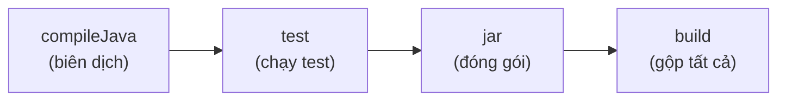

# 3. Gradle

Gradle là công cụ build hiện đại, linh hoạt và nhanh, dùng ngôn ngữ DSL (Groovy hoặc Kotlin) để viết cấu hình ngắn gọn hơn XML của Maven. Bài này giới thiệu file `build.gradle`, cách khai báo thư viện, khái niệm task, Gradle Wrapper và lý do Gradle nhanh hơn Maven. Đây là công cụ build chuẩn của Android và ngày càng phổ biến trong dự án Java/Kotlin hiện đại.

[](pathname:///img/java/gradle.webp)

---

:::note[Ghi nhớ nhanh]

- ⭐ **Gradle dùng DSL (Groovy/Kotlin)** — cấu hình ngắn gọn, lập trình được thay cho XML; file `build.gradle` hoặc `build.gradle.kts`.
- ⭐ **Nhanh hơn Maven** — nhờ incremental build, build cache và Gradle Daemon.
- **Khai báo dependency 1 dòng** — `implementation 'groupId:artifactId:version'`; ưu tiên `implementation` hơn `api`.
- **`Task`** — đơn vị công việc cơ bản của Gradle, có thể tự định nghĩa.
- **Gradle Wrapper (`./gradlew`)** — đảm bảo cả nhóm dùng đúng một phiên bản Gradle; là chuẩn build của Android.

:::

---

## Mục lục

- [Vì sao có Gradle?](#vì-sao-có-gradle)
- [Gradle là gì?](#gradle-là-gì)
- [File build.gradle (Groovy và Kotlin DSL)](#file-buildgradle-groovy-và-kotlin-dsl)
- [Khai báo dependencies](#khai-báo-dependencies)
- [Task là gì?](#task-là-gì)
- [Gradle Wrapper](#gradle-wrapper)
- [Vì sao Gradle nhanh hơn Maven?](#vì-sao-gradle-nhanh-hơn-maven)
- [So sánh cú pháp Gradle với Maven](#so-sánh-cú-pháp-gradle-với-maven)
- [Lỗi thường gặp](#lỗi-thường-gặp)
- [Tóm tắt](#tóm-tắt)
- [Câu hỏi phỏng vấn](#câu-hỏi-phỏng-vấn)

---

## Vì sao có Gradle?

**Vấn đề:** Maven khai báo build bằng XML — dài dòng và **kém linh hoạt** khi cần logic build tuỳ biến (muốn thêm logic riêng thường phải viết hẳn một plugin). Với dự án lớn/đa module, build cũng **chậm** vì XML cố định, khó tận dụng tốt incremental build và cache.

```xml
<!-- Maven: chỉ để khai báo một thư viện đã mất nhiều dòng XML, không thể chèn logic -->
<dependency>
    <groupId>com.google.code.gson</groupId>
    <artifactId>gson</artifactId>
    <version>2.10.1</version>
</dependency>
```

**Giải pháp:** **Gradle** dùng **DSL (Groovy/Kotlin)** thay cho XML nên build script gọn, linh hoạt và **lập trình được** (thêm điều kiện, vòng lặp, task tuỳ biến ngay trong file). Gradle còn có **incremental build + build cache + daemon** → chỉ làm lại phần thay đổi, nhanh hơn nhiều cho dự án lớn. Đây cũng là công cụ build chuẩn của Android.

```kotlin
// Gradle (Kotlin DSL): khai báo gọn 1 dòng, lại có thể chèn logic ngay trong build
implementation("com.google.code.gson:gson:2.10.1")

if (project.hasProperty("debug")) {
    implementation("org.slf4j:slf4j-simple:2.0.9")  // Thêm thư viện tuỳ điều kiện
}
```

:::tip[Dùng thực tế]

- **Build Android / dự án đa module lớn** — Gradle là chuẩn của Android và xử lý nhiều module mượt mà.
- **Tuỳ biến quy trình build bằng code** — viết task riêng (sinh mã, copy file, đóng gói) ngay trong build script.
- **Build nhanh nhờ cache/incremental** — sửa một file chỉ build lại phần liên quan, không build lại toàn bộ.
- **Quản lý dependency như Maven nhưng linh hoạt hơn** — vẫn dùng Maven Central, thêm được logic chọn thư viện theo môi trường.

:::

---

## Gradle là gì?

**Gradle** (đọc là "grây-đồ") là công cụ build hiện đại, linh hoạt và nhanh. Khác với Maven dùng XML cố định, Gradle dùng một **DSL (Domain Specific Language — ngôn ngữ chuyên biệt)** để viết cấu hình. Nhờ đó file cấu hình ngắn gọn hơn và có thể chứa logic lập trình.

Gradle là công cụ build **chính thức của Android**, và ngày càng phổ biến trong các dự án Java/Kotlin hiện đại.

> **Ví dụ đời thường:** Nếu Maven là tờ thực đơn cố định (chỉ chọn món có sẵn), thì Gradle là một căn bếp tự do — bạn vừa có công thức sẵn, vừa được tự chế biến thêm theo ý mình.

Cấu trúc thư mục giống Maven (`src/main/java`, `src/test/java`), nhưng file cấu hình là `build.gradle`.

---

## File build.gradle (Groovy và Kotlin DSL)

Gradle hỗ trợ hai ngôn ngữ viết cấu hình:

- **Groovy DSL** — file `build.gradle` (cú pháp truyền thống).
- **Kotlin DSL** — file `build.gradle.kts` (an toàn kiểu hơn, được gợi ý tốt hơn trong IDE).

Ví dụ với **Groovy DSL** (`build.gradle`):

```groovy
// Khai báo các plugin sử dụng
plugins {
    id 'java'             // Plugin biên dịch Java
    id 'application'      // Plugin cho phép chạy ứng dụng bằng gradle run
}

// Định danh dự án (tương đương GAV của Maven)
group = 'com.example'
version = '1.0.0'

// Nơi Gradle tải thư viện về
repositories {
    mavenCentral()        // Dùng kho Maven Central
}

// Cấu hình phiên bản Java
java {
    sourceCompatibility = JavaVersion.VERSION_17
}

// Chỉ định class chứa hàm main
application {
    mainClass = 'com.example.Main'
}
```

Cùng nội dung viết bằng **Kotlin DSL** (`build.gradle.kts`):

```kotlin
plugins {
    java
    application
}

group = "com.example"
version = "1.0.0"

repositories {
    mavenCentral()
}

application {
    mainClass.set("com.example.Main")  // Cú pháp Kotlin dùng .set()
}
```

---

## Khai báo dependencies

Dependencies được khai báo trong khối `dependencies`. Cú pháp ngắn gọn hơn Maven rất nhiều — chỉ một dòng thay vì nhiều thẻ XML.

```groovy
dependencies {
    // Thư viện dùng ở mọi nơi (tương đương scope compile của Maven)
    implementation 'com.google.code.gson:gson:2.10.1'

    // Thư viện chỉ dùng khi chạy test
    testImplementation 'org.junit.jupiter:junit-jupiter:5.10.0'
}
```

Các "cấu hình phụ thuộc" (dependency configuration) hay gặp:

- `implementation`: dùng nội bộ, không lộ ra cho dự án khác (gợi ý nên dùng).
- `api`: dùng và để lộ ra cho dự án phụ thuộc vào mình.
- `testImplementation`: chỉ dùng cho test.
- `runtimeOnly`: chỉ cần khi chạy, không cần khi biên dịch.

Lưu ý định dạng chuỗi: `'groupId:artifactId:version'` — ba phần ngăn cách bằng dấu hai chấm.

---

## Task là gì?

**Task (tác vụ)** là đơn vị công việc cơ bản của Gradle. Mọi việc Gradle làm đều là một task: `compileJava`, `test`, `jar`, `build`... Bạn cũng có thể tự viết task riêng.

```groovy
// Tự định nghĩa một task in lời chào
tasks.register('hello') {
    doLast {
        println 'Xin chào từ Gradle!'  // In ra màn hình khi chạy task
    }
}
```

Chạy task bằng lệnh:

```bash
# Chạy task hello vừa tạo
gradle hello

# Liệt kê tất cả task có sẵn trong dự án
gradle tasks
```

> **Ví dụ đời thường:** Task giống từng "việc nhà" cụ thể: rửa bát, quét nhà, đổ rác. Gradle quản lý danh sách việc và biết việc nào phải làm trước việc nào (ví dụ phải nấu xong mới rửa bát được).

Sơ đồ dưới minh hoạ quan hệ phụ thuộc giữa các task khi chạy `gradle build`:


```mermaid
flowchart LR
    A["compileJava<br/>(biên dịch)"] --> B["test<br/>(chạy test)"]
    B --> C["jar<br/>(đóng gói)"]
    C --> D["build<br/>(gộp tất cả)"]
```

---

## Gradle Wrapper

**Gradle Wrapper** là một bộ script đi kèm dự án, giúp **mọi người chạy đúng phiên bản Gradle** mà không cần cài Gradle trên máy.

```bash
# Trên macOS / Linux dùng ./gradlew
./gradlew build

# Trên Windows dùng gradlew.bat
gradlew.bat build
```

Khi bạn dùng wrapper, nó tự tải đúng phiên bản Gradle mà dự án yêu cầu (ghi trong file `gradle/wrapper/gradle-wrapper.properties`).

> **Ví dụ đời thường:** Wrapper giống việc bạn gửi kèm cả "bộ dụng cụ đúng loại" khi giao công thức nấu ăn cho người khác, để họ không phải tự đi mua dụng cụ và không lo mua nhầm loại. Nhờ vậy ai làm cũng ra kết quả giống nhau.

**Lời khuyên:** luôn dùng `./gradlew` thay vì `gradle` để đảm bảo cả nhóm dùng chung một phiên bản.

---

## Vì sao Gradle nhanh hơn Maven?

Gradle nhanh hơn nhờ ba cơ chế chính:

1. **Incremental build (build tăng tiến):** chỉ build lại phần đã thay đổi, không build lại toàn bộ.
2. **Build cache (bộ nhớ đệm build):** lưu kết quả các task; nếu đầu vào không đổi thì dùng lại kết quả cũ.
3. **Gradle Daemon (tiến trình nền):** một tiến trình chạy ngầm sẵn sàng để build ngay, không phải khởi động lại từ đầu mỗi lần.

> **Ví dụ đời thường:** Maven giống nấu lại cả nồi canh mỗi khi nếm thấy thiếu muối. Gradle thông minh hơn: chỉ nêm thêm muối vào phần cần sửa, phần đã ngon thì giữ nguyên. Vì vậy nhanh hơn nhiều.

---

## So sánh cú pháp Gradle với Maven

| Việc cần làm | Maven (`pom.xml`) | Gradle (`build.gradle`) |
|--------------|-------------------|--------------------------|
| Khai báo thư viện | 5 dòng XML `<dependency>` | 1 dòng `implementation '...'` |
| Định danh dự án | `<groupId>`, `<artifactId>` | `group`, `version` |
| Kho thư viện | mặc định Maven Central | `repositories { mavenCentral() }` |
| Build sạch + đóng gói | `mvn clean package` | `./gradlew clean build` |
| Ngôn ngữ cấu hình | XML (cố định) | Groovy/Kotlin (lập trình được) |

Ví dụ trực quan, cùng khai báo Gson:

```xml
<!-- Maven: dài dòng -->
<dependency>
    <groupId>com.google.code.gson</groupId>
    <artifactId>gson</artifactId>
    <version>2.10.1</version>
</dependency>
```

```groovy
// Gradle: ngắn gọn
implementation 'com.google.code.gson:gson:2.10.1'
```

---

## Lỗi thường gặp

- **Dùng `gradle` thay vì `./gradlew`.** Có thể chạy nhầm phiên bản Gradle khác trên máy, gây lỗi khó hiểu. Luôn ưu tiên wrapper.
- **Quên `repositories { mavenCentral() }`.** Gradle không biết tải thư viện ở đâu, báo lỗi `Could not resolve dependency`.
- **Nhầm `implementation` với `compile`.** `compile` đã bị loại bỏ trong Gradle mới, hãy dùng `implementation`.
- **Sai dấu phân cách trong chuỗi dependency.** Phải là dấu hai chấm `:`, không phải dấu cách hay dấu phẩy.
- **Lẫn lộn cú pháp Groovy và Kotlin DSL.** Ví dụ `mainClass = '...'` (Groovy) khác `mainClass.set("...")` (Kotlin). Phải đồng nhất theo loại file `.gradle` hoặc `.gradle.kts`.

---

## Tóm tắt

- **Gradle** là công cụ build hiện đại, linh hoạt, viết cấu hình bằng **DSL** (Groovy hoặc Kotlin), là chuẩn của Android.
- File cấu hình là **`build.gradle`** (Groovy) hoặc **`build.gradle.kts`** (Kotlin).
- Khai báo dependency cực ngắn gọn: `implementation 'groupId:artifactId:version'`.
- **Task** là đơn vị công việc cơ bản; bạn có thể tự định nghĩa task riêng.
- **Gradle Wrapper** (`./gradlew`) đảm bảo cả nhóm dùng đúng một phiên bản Gradle.
- Gradle nhanh hơn Maven nhờ **incremental build**, **build cache** và **daemon**.
- Cú pháp Gradle ngắn gọn và mạnh hơn XML của Maven.

---

## Câu hỏi phỏng vấn

Những câu thường gặp về chủ đề này. Tự trả lời trước, rồi bấm **Xem đáp án** để đối chiếu.

**1. Gradle hỗ trợ hai loại DSL nào để viết file cấu hình? Khác biệt chính giữa chúng là gì?**

<details className="qa">
<summary>Xem đáp án</summary>

- **Groovy DSL** — file `build.gradle`: cú pháp truyền thống, ngắn gọn, linh hoạt nhưng ít được IDE hỗ trợ gợi ý/kiểm tra kiểu chặt chẽ.
- **Kotlin DSL** — file `build.gradle.kts`: an toàn kiểu (type-safe) hơn, IDE gợi ý và tự động hoàn thành (autocomplete) tốt hơn nhờ Kotlin có kiểm tra kiểu tĩnh.

```groovy
// Groovy: gán trực tiếp bằng dấu =, hoặc gọi hàm không cần ngoặc
mainClass = 'com.example.Main'
```

```kotlin
// Kotlin: gọi phương thức .set(...) một cách tường minh
mainClass.set("com.example.Main")
```

Cả hai đều biên dịch xuống cùng một mô hình Gradle bên dưới, khác biệt chủ yếu ở cú pháp và trải nghiệm IDE, không phải ở khả năng của Gradle.

</details>

**2. `implementation` và `api` khác nhau thế nào khi khai báo dependency? Vì sao Gradle khuyến nghị ưu tiên `implementation`?**

<details className="qa">
<summary>Xem đáp án</summary>

- **`api`**: dependency được khai báo bằng `api` sẽ **lộ ra (expose)** cho bất kỳ dự án nào phụ thuộc vào module hiện tại — họ có thể truy cập trực tiếp các class của dependency đó thông qua module của bạn.
- **`implementation`**: dependency chỉ dùng **nội bộ** trong module hiện tại, **không lộ ra** classpath biên dịch của module phụ thuộc vào nó.

```groovy
dependencies {
    api 'com.example:public-api:1.0'          // lộ ra cho module khác
    implementation 'com.example:internal:1.0'  // chỉ dùng nội bộ
}
```

Gradle khuyến nghị ưu tiên `implementation` vì nó giúp **giảm phạm vi rò rỉ chi tiết cài đặt nội bộ** ra bên ngoài, và quan trọng hơn về hiệu năng build: khi một dependency khai báo bằng `implementation` thay đổi, Gradle chỉ cần **build lại module hiện tại**; nếu khai báo bằng `api`, mọi module phụ thuộc "xuôi dòng" (downstream) cũng phải **build lại theo**, vì chúng có thể đang dùng trực tiếp dependency đó.

</details>

**3. Task trong Gradle là gì? Viết một task tùy chỉnh in ra một dòng chữ khi chạy.**

<details className="qa">
<summary>Xem đáp án</summary>

**Task (tác vụ)** là đơn vị công việc cơ bản mà Gradle thực thi — mọi hành động Gradle làm (biên dịch, test, đóng gói) đều được mô hình hóa thành một task, và bạn có thể định nghĩa thêm task riêng.

```groovy
tasks.register('hello') {
    doLast {
        println 'Xin chào từ Gradle!' // chạy khi task được thực thi
    }
}
```

```bash
gradle hello
# In ra: Xin chào từ Gradle!
```

`doLast` chỉ định hành động chạy **sau cùng** khi task được thực thi (còn có `doFirst` để chạy hành động ngay khi task bắt đầu, trước các hành động khác).

</details>

**4. Gradle Wrapper (`./gradlew`) giải quyết vấn đề gì? Vì sao nên luôn dùng nó thay vì lệnh `gradle` cài trực tiếp trên máy?**

<details className="qa">
<summary>Xem đáp án</summary>

Vấn đề: nếu mỗi thành viên trong nhóm tự cài Gradle trên máy riêng, họ có thể đang dùng **các phiên bản Gradle khác nhau** — dẫn tới build không nhất quán, có thể chạy được ở máy này nhưng lỗi ở máy khác do khác biệt hành vi giữa các phiên bản Gradle.

**Gradle Wrapper** là một bộ script (`gradlew`, `gradlew.bat`) đi kèm ngay trong mã nguồn dự án, tự động **tải đúng phiên bản Gradle** mà dự án yêu cầu (ghi trong `gradle/wrapper/gradle-wrapper.properties`) nếu máy chưa có sẵn — đảm bảo **mọi người, mọi máy CI** đều build bằng chính xác cùng một phiên bản Gradle, loại bỏ hoàn toàn rủi ro lệch phiên bản.

</details>

**5. Vì sao Gradle thường nhanh hơn Maven ở các lần build sau (không phải lần đầu tiên)? Nêu ba cơ chế chính.**

<details className="qa">
<summary>Xem đáp án</summary>

1. **Incremental build (build tăng tiến)**: Gradle theo dõi input/output của từng task; nếu input không đổi so với lần build trước, task đó được **bỏ qua** (đánh dấu "UP-TO-DATE"), không chạy lại.
2. **Build cache**: lưu lại **kết quả** của các task đã chạy (kể cả từ máy khác/CI nếu dùng cache chia sẻ); nếu một task có cùng input y hệt đã từng chạy ở đâu đó, Gradle **lấy lại kết quả cũ** thay vì thực thi lại từ đầu.
3. **Gradle Daemon**: một tiến trình JVM chạy **ngầm, sẵn sàng** giữa các lần build, giữ lại các thông tin đã "làm nóng" (như class đã load, cache trong bộ nhớ) — tránh việc phải khởi động lại toàn bộ JVM và nạp lại mọi thứ từ đầu ở mỗi lần gọi `gradle`/`./gradlew`.

Maven theo mặc định không có ba cơ chế này ở mức tương đương, nên với dự án lớn, các lần build lặp lại của Gradle thường nhanh hơn đáng kể.

</details>

**6. `testImplementation` và `runtimeOnly` khác nhau thế nào? Cho ví dụ tình huống dùng `runtimeOnly`.**

<details className="qa">
<summary>Xem đáp án</summary>

- **`testImplementation`**: dependency chỉ cần khi biên dịch và chạy **mã test** (thư mục `src/test`), không có mặt trong classpath biên dịch/chạy của mã chính (`src/main`).
- **`runtimeOnly`**: dependency **không cần thiết lúc biên dịch** (code chính không gọi trực tiếp tới class của nó), nhưng **bắt buộc phải có mặt lúc chạy chương trình**.

```groovy
dependencies {
    testImplementation 'org.junit.jupiter:junit-jupiter:5.10.0' // chỉ cho test

    // Code chỉ gọi qua interface JDBC chuẩn (java.sql.*) lúc biên dịch,
    // nhưng cần driver cụ thể của MySQL có mặt lúc CHẠY để kết nối thật
    runtimeOnly 'com.mysql:mysql-connector-j:8.3.0'
}
```

</details>

**7. Tình huống: nhóm bạn đang dùng Maven cho một dự án Java thuần, không có nhu cầu tùy biến logic build phức tạp và không quan tâm tốc độ build (dự án nhỏ). Có nên chuyển sang Gradle không? Vì sao?**

<details className="qa">
<summary>Xem đáp án</summary>

**Không nhất thiết cần chuyển.** Lợi ích chính của Gradle (tốc độ nhờ incremental build/cache, khả năng lập trình linh hoạt trong build script) phát huy rõ rệt nhất ở **dự án lớn** hoặc khi cần **logic build tùy biến** phức tạp — cả hai điều kiện này đều **không xuất hiện** trong tình huống được mô tả.

Với dự án nhỏ, ổn định, không cần tùy biến: chi phí chuyển đổi (học DSL mới, viết lại cấu hình, đào tạo lại nhóm) thường **không tương xứng** với lợi ích thu được. Nguyên tắc chung: chỉ đổi công cụ build khi có **nhu cầu cụ thể** mà công cụ hiện tại không đáp ứng được, không đổi chỉ vì công cụ mới "nghe có vẻ hiện đại hơn".

</details>

**8. `compile` (đã bị loại bỏ) từng dùng để làm gì trong Gradle cũ? Vì sao nó bị thay thế bằng `implementation`?**

<details className="qa">
<summary>Xem đáp án</summary>

Trong các phiên bản Gradle cũ, `compile` từng là cấu hình dependency mặc định phổ biến nhất, có hành vi **tương tự `api` hiện nay** — mọi dependency khai báo bằng `compile` đều tự động **lộ ra** cho các module phụ thuộc.

Vấn đề: hầu hết dependency thực ra chỉ cần dùng **nội bộ**, không cần lộ ra ngoài — nhưng vì `compile` là lựa chọn mặc định "dễ dùng nhất", lập trình viên thường dùng nó cho mọi trường hợp, dẫn tới **rò rỉ dependency nội bộ** ra module khác một cách không cần thiết, và làm chậm build (mọi thay đổi dependency đều kéo theo build lại các module downstream). Gradle giới thiệu `implementation` làm lựa chọn **mặc định nên dùng**, buộc lập trình viên phải cân nhắc rõ ràng khi thực sự cần dùng `api`.

</details>

**9. Gradle biết một task đã "up-to-date" (không cần chạy lại) dựa vào đâu?**

<details className="qa">
<summary>Xem đáp án</summary>

Gradle theo dõi **input** (file mã nguồn, tham số cấu hình, dependency...) và **output** (file/thư mục được task tạo ra) đã khai báo của mỗi task, rồi lưu lại một "dấu vân tay" (checksum/hash) của chúng sau mỗi lần chạy.

Ở lần chạy tiếp theo, trước khi thực thi một task, Gradle **so sánh** dấu vân tay input/output hiện tại với dấu vân tay đã lưu lần trước:
- Nếu **giống hệt** (không file nào trong input thay đổi) → task được đánh dấu **UP-TO-DATE**, bỏ qua không chạy lại, giữ nguyên output cũ.
- Nếu **khác** → task được chạy lại bình thường.

Đây chính là cơ chế nền tảng của **incremental build** — nó chỉ hoạt động chính xác nếu task được khai báo **đầy đủ và đúng** input/output của mình (một task tự viết mà khai báo thiếu input có thể bị Gradle nhầm là "up-to-date" dù thực ra cần chạy lại).

</details>

**10. Viết một task Gradle tùy chỉnh phụ thuộc vào task khác, sao cho task `hello` luôn chạy sau khi `compileJava` hoàn tất.**

<details className="qa">
<summary>Xem đáp án</summary>

```groovy
tasks.register('hello') {
    dependsOn 'compileJava' // khai báo phụ thuộc: compileJava phải chạy XONG trước hello
    doLast {
        println 'Đã biên dịch xong, chào từ task hello!'
    }
}
```

`dependsOn` khai báo **quan hệ phụ thuộc** giữa các task — khi bạn chạy `gradle hello`, Gradle sẽ tự động chạy `compileJava` trước (nếu nó chưa "up-to-date"), tương tự cách một phase trong vòng đời Maven tự chạy các phase đứng trước nó, nhưng ở Gradle quan hệ này có thể được khai báo tường minh, linh hoạt giữa bất kỳ hai task nào, không giới hạn theo một vòng đời cố định.

</details>
