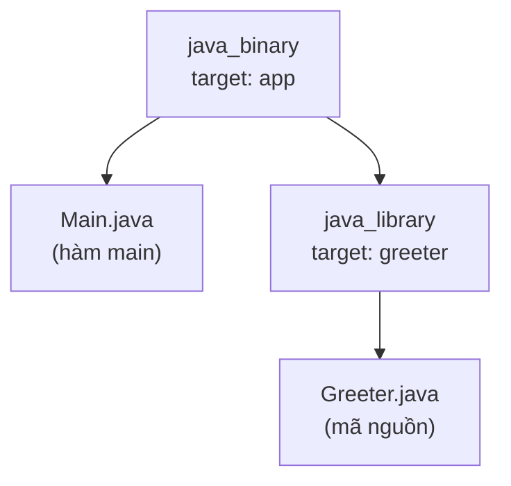

# 4. Bazel

Bazel là công cụ build do Google tạo ra, dành cho các dự án rất lớn và đa ngôn ngữ với điểm mạnh là tốc độ và độ tin cậy. Bài này giới thiệu khái niệm workspace, file `BUILD`, build tăng tiến, build tái lập và khi nào nên dùng Bazel. Với người mới, bạn chỉ cần biết Bazel tồn tại và dùng cho dự án cực lớn; hãy học Maven và Gradle trước.

---

:::note[Ghi nhớ nhanh]

- ⭐ **Bazel dành cho dự án cực lớn, đa ngôn ngữ** — do Google tạo, mạnh về tốc độ và build tái lập trong monorepo.
- ⭐ **Người mới không nên dùng Bazel** — hãy học Maven và Gradle trước, chỉ cần biết Bazel tồn tại.
- **`WORKSPACE` + `BUILD`** — `WORKSPACE` đánh dấu gốc dự án; mỗi `BUILD` khai báo các `target` với `deps` rõ ràng.
- **Build tăng tiến & tái lập** — chỉ build lại phần thay đổi; môi trường hermetic cho kết quả giống hệt trên mọi máy.
- **Dùng ngôn ngữ Starlark** (giống Python), không phải XML.

:::

---

## Mục lục

- [Vì sao có Bazel?](#vì-sao-có-bazel)
- [Bazel là gì?](#bazel-là-gì)
- [Khái niệm WORKSPACE](#khái-niệm-workspace)
- [File BUILD](#file-build)
- [Build tăng tiến (Incremental)](#build-tăng-tiến-incremental)
- [Build tái lập (Reproducible)](#build-tái-lập-reproducible)
- [Các lệnh Bazel cơ bản](#các-lệnh-bazel-cơ-bản)
- [Khi nào nên dùng Bazel?](#khi-nào-nên-dùng-bazel)
- [So sánh nhanh với Maven và Gradle](#so-sánh-nhanh-với-maven-và-gradle)
- [Lỗi thường gặp](#lỗi-thường-gặp)
- [Tóm tắt](#tóm-tắt)

---

## Vì sao có Bazel?

**Vấn đề:** Ở quy mô **rất lớn** (monorepo khổng lồ, nhiều ngôn ngữ, hàng nghìn module như tại Google), Maven/Gradle build lại quá nhiều, **chậm**, và kết quả build có thể **không tái lập được** (phụ thuộc môi trường máy). Hậu quả: CI tốn kém, khó tin cậy.

**Giải pháp:** **Bazel** (mở từ công cụ build nội bộ của Google) build **hermetic** (cô lập, đầu vào xác định → đầu ra tái lập 100%), có **cache + thực thi phân tán** dùng lại kết quả giữa các máy và CI, chỉ build lại đúng phần thay đổi, và hỗ trợ **đa ngôn ngữ** trong cùng một repo. Nhờ vậy nó scale được cho dự án cực lớn.

:::tip[Dùng thực tế]

- Monorepo lớn, đa ngôn ngữ trong một kho mã nguồn.
- Build tái lập cho CI — máy nào cũng ra kết quả giống hệt.
- Chia sẻ cache build cho toàn team, không build lại thứ đã có.
- Tăng tốc build nhờ chỉ làm lại đúng phần thay đổi.

:::

---

## Bazel là gì?

**Bazel** (đọc là "bây-zồ") là công cụ build do **Google** tạo ra, dùng cho các dự án **rất lớn** và **đa ngôn ngữ** (Java, C++, Go, Python... trong cùng một kho mã nguồn).

Điểm mạnh nổi bật của Bazel là **tốc độ** và **độ tin cậy**: nó chỉ build lại đúng phần cần thiết và đảm bảo build ở máy nào cũng cho kết quả y hệt.

> **Ví dụ đời thường:** Maven và Gradle giống bếp ăn của một nhà hàng vừa và nhỏ. Bazel giống nhà máy chế biến thực phẩm khổng lồ phục vụ cả thành phố: rất mạnh và nhanh ở quy mô lớn, nhưng lắp đặt và vận hành thì phức tạp, không phù hợp cho một bữa ăn gia đình.

Bazel dùng ngôn ngữ cấu hình tên là **Starlark** (một biến thể đơn giản của Python).

---

## Khái niệm WORKSPACE

Trong Bazel, toàn bộ kho mã nguồn được gọi là một **workspace (không gian làm việc)**. Gốc của workspace được đánh dấu bằng một file tên `WORKSPACE` (hoặc `MODULE.bazel` ở phiên bản mới).

```python
# File WORKSPACE — đánh dấu gốc của dự án
# Khai báo tên workspace
workspace(name = "my_company_project")

# Tải các quy tắc build cho Java từ bên ngoài (ví dụ)
load("@rules_java//java:repositories.bzl", "rules_java_dependencies")
rules_java_dependencies()
```

> **Ví dụ đời thường:** File `WORKSPACE` giống tấm biển "Cổng chính nhà máy". Mọi thứ bên trong hàng rào (thư mục con) đều thuộc về cùng một dự án, và Bazel quản lý tất cả từ cổng này.

---

## File BUILD

Mỗi thư mục con chứa code thường có một file tên `BUILD` (hoặc `BUILD.bazel`). File này khai báo các **target (mục tiêu)** — tức là những thứ cần build, ví dụ một thư viện hoặc một chương trình chạy được.

```python
# File BUILD trong thư mục chứa code

# Định nghĩa một thư viện Java tên "greeter"
java_library(
    name = "greeter",                    # Tên target
    srcs = ["Greeter.java"],             # Các file mã nguồn
    visibility = ["//visibility:public"], # Cho phép target khác dùng
)

# Định nghĩa một chương trình Java chạy được
java_binary(
    name = "app",                        # Tên target
    srcs = ["Main.java"],                # File chứa hàm main
    main_class = "com.example.Main",     # Class khởi đầu
    deps = [":greeter"],                 # Phụ thuộc vào thư viện greeter ở trên
)
```

Điểm khác biệt lớn so với Maven/Gradle: Bazel yêu cầu bạn **khai báo phụ thuộc rất rõ ràng và chi tiết** ở từng thư mục (`deps = [...]`). Nhờ vậy Bazel biết chính xác phần nào liên quan tới phần nào.

> **Ví dụ đời thường:** Mỗi file `BUILD` giống bản kê khai nguyên liệu cho từng món ăn: món này cần đúng những nguyên liệu nào. Nhờ kê khai chính xác, đầu bếp biết khi nguyên liệu A đổi thì chỉ phải nấu lại đúng những món dùng A.

Sơ đồ dưới minh hoạ quan hệ giữa các target khai báo trong file `BUILD` ở trên:



---

## Build tăng tiến (Incremental)

**Incremental build (build tăng tiến)** nghĩa là Bazel **chỉ build lại đúng phần đã thay đổi** và những phần phụ thuộc vào nó, bỏ qua mọi thứ khác.

Vì các file `BUILD` khai báo phụ thuộc rất rõ ràng, Bazel dựng được một "bản đồ quan hệ" giữa các target. Khi bạn sửa một file, Bazel tra bản đồ và biết chính xác phải build lại những gì.

> **Ví dụ đời thường:** Bạn có một bức tường gồm 10.000 viên gạch. Nếu một viên bị nứt, bạn chỉ cần thay đúng viên đó (và những viên dựa lên nó), chứ không xây lại cả bức tường. Đó chính là build tăng tiến — cực kỳ tiết kiệm thời gian ở dự án lớn.

---

## Build tái lập (Reproducible)

**Reproducible build (build tái lập)** nghĩa là: cùng một mã nguồn, build trên máy nào, lúc nào cũng cho **kết quả giống hệt nhau**.

Bazel đạt được điều này bằng cách **kiểm soát chặt mọi đầu vào**: phiên bản thư viện, công cụ, môi trường... đều được khai báo cố định. Bazel chạy trong môi trường "đóng kín" (hermetic), không cho build phụ thuộc vào những thứ ngẫu nhiên trên máy.

> **Ví dụ đời thường:** Giống một công thức nấu ăn ghi rõ tới từng gram, từng phút, từng độ C. Ai làm theo cũng ra đúng một cái bánh giống hệt, dù ở Hà Nội hay Sài Gòn. Nhờ vậy tránh được câu nói kinh điển "máy tôi chạy được mà máy bạn lại lỗi".

---

## Các lệnh Bazel cơ bản

```bash
# Build một target cụ thể (//đường-dẫn-thư-mục:tên-target)
bazel build //src/main/java/com/example:app

# Chạy một target binary
bazel run //src/main/java/com/example:app

# Chạy test
bazel test //src/test/...

# Xóa toàn bộ kết quả build (giống mvn clean)
bazel clean
```

Cú pháp `//path:target` là cách Bazel chỉ đường tới một target: phần `//` là gốc workspace, phần sau dấu hai chấm là tên target trong file `BUILD`.

---

## Khi nào nên dùng Bazel?

**Nên dùng Bazel khi:**

- Dự án **rất lớn** (hàng triệu dòng code, hàng nghìn module).
- Cần build **nhiều ngôn ngữ** trong cùng một kho (monorepo).
- Cần tốc độ build cao và build tái lập tuyệt đối.
- Có đội ngũ kỹ thuật đủ mạnh để cấu hình và bảo trì.

**KHÔNG nên dùng Bazel khi:**

- Bạn là người mới học Java — hãy dùng Maven hoặc Gradle.
- Dự án nhỏ hoặc vừa — Bazel quá phức tạp, không đáng công sức.
- Dự án Java đơn thuần, không cần đa ngôn ngữ.

> **Lời khuyên cho người mới:** Bạn chỉ cần **biết Bazel tồn tại** và hiểu nó dùng cho dự án lớn. Đừng cố học sâu lúc mới bắt đầu. Hãy thành thạo Maven và Gradle trước.

---

## So sánh nhanh với Maven và Gradle

| Tiêu chí | Maven | Gradle | **Bazel** |
|----------|-------|--------|-----------|
| Quy mô phù hợp | Nhỏ → vừa | Nhỏ → lớn | **Rất lớn** |
| Đa ngôn ngữ | Hạn chế | Hạn chế | **Mạnh** |
| Độ dễ học | Dễ | Trung bình | **Khó** |
| Tốc độ ở dự án lớn | Chậm | Nhanh | **Rất nhanh** |
| Build tái lập | Trung bình | Khá | **Rất tốt** |
| File cấu hình | `pom.xml` | `build.gradle` | `BUILD` + `WORKSPACE` |

---

## Lỗi thường gặp

- **Người mới chọn Bazel ngay.** Sai lầm phổ biến: Bazel quá phức tạp cho dự án nhỏ. Hãy bắt đầu bằng Maven/Gradle.
- **Quên khai báo `deps`.** Bazel rất nghiêm khắc: nếu một target dùng code của target khác mà không khai báo trong `deps`, build sẽ thất bại ngay.
- **Sai cú pháp đường dẫn target.** Phải đúng dạng `//path/to/dir:target_name`. Thiếu `//` hoặc thiếu tên target đều gây lỗi.
- **Nhầm Bazel cần kết nối Internet như Maven.** Bazel thiên về môi trường đóng kín; cấu hình tải thư viện ngoài phức tạp hơn và phải khai báo rõ phiên bản.
- **Kỳ vọng cú pháp giống Maven.** Bazel dùng ngôn ngữ Starlark (giống Python), không phải XML — cần học lại tư duy khác.

---

## Tóm tắt

- **Bazel** là công cụ build của Google cho dự án **rất lớn, đa ngôn ngữ**.
- File **`WORKSPACE`** đánh dấu gốc dự án; file **`BUILD`** ở mỗi thư mục khai báo các **target** cần build.
- **Build tăng tiến (incremental)**: chỉ build lại phần đã thay đổi — rất nhanh ở quy mô lớn.
- **Build tái lập (reproducible)**: cùng mã nguồn cho kết quả giống hệt ở mọi máy.
- Bazel dùng ngôn ngữ **Starlark** (giống Python), không phải XML.
- **Người mới không nên dùng Bazel** — hãy học Maven và Gradle trước; chỉ cần biết Bazel dành cho dự án cực lớn.
