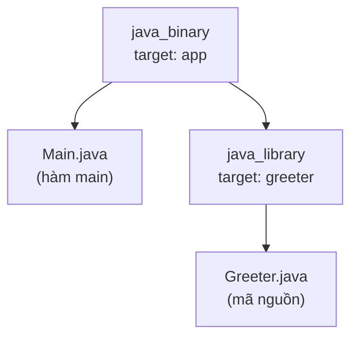

# 4. Bazel

Bazel là công cụ build do Google tạo ra, dành cho các dự án rất lớn và đa ngôn ngữ với điểm mạnh là tốc độ và độ tin cậy. Bài này giới thiệu khái niệm workspace, file `BUILD`, build tăng tiến, build tái lập và khi nào nên dùng Bazel. Với người mới, bạn chỉ cần biết Bazel tồn tại và dùng cho dự án cực lớn; hãy học Maven và Gradle trước.

[](pathname:///img/java/bazel.webp)

---

:::note[Ghi nhớ nhanh]

- ⭐ **Bazel dành cho dự án cực lớn, đa ngôn ngữ** — do Google tạo, mạnh về tốc độ và build tái lập trong monorepo.
- ⭐ **Người mới không nên dùng Bazel** — hãy học Maven và Gradle trước, chỉ cần biết Bazel tồn tại.
- **`WORKSPACE` + `BUILD`** — `WORKSPACE` đánh dấu gốc dự án; mỗi `BUILD` khai báo các `target` với `deps` rõ ràng.
- **Build tăng tiến & tái lập** — chỉ build lại phần thay đổi; môi trường hermetic cho kết quả giống hệt trên mọi máy.
- **Dùng ngôn ngữ Starlark** (giống Python), không phải XML.

:::

---

## Mục lục

- [Vì sao có Bazel?](#vì-sao-có-bazel)
- [Bazel là gì?](#bazel-là-gì)
- [Khái niệm WORKSPACE](#khái-niệm-workspace)
- [File BUILD](#file-build)
- [Build tăng tiến (Incremental)](#build-tăng-tiến-incremental)
- [Build tái lập (Reproducible)](#build-tái-lập-reproducible)
- [Các lệnh Bazel cơ bản](#các-lệnh-bazel-cơ-bản)
- [Khi nào nên dùng Bazel?](#khi-nào-nên-dùng-bazel)
- [So sánh nhanh với Maven và Gradle](#so-sánh-nhanh-với-maven-và-gradle)
- [Lỗi thường gặp](#lỗi-thường-gặp)
- [Tóm tắt](#tóm-tắt)
- [Câu hỏi phỏng vấn](#câu-hỏi-phỏng-vấn)

---

## Vì sao có Bazel?

**Vấn đề:** Ở quy mô **rất lớn** (monorepo khổng lồ, nhiều ngôn ngữ, hàng nghìn module như tại Google), Maven/Gradle build lại quá nhiều, **chậm**, và kết quả build có thể **không tái lập được** (phụ thuộc môi trường máy). Hậu quả: CI tốn kém, khó tin cậy.

**Giải pháp:** **Bazel** (mở từ công cụ build nội bộ của Google) build **hermetic** (cô lập, đầu vào xác định → đầu ra tái lập 100%), có **cache + thực thi phân tán** dùng lại kết quả giữa các máy và CI, chỉ build lại đúng phần thay đổi, và hỗ trợ **đa ngôn ngữ** trong cùng một repo. Nhờ vậy nó scale được cho dự án cực lớn.

:::tip[Dùng thực tế]

- Monorepo lớn, đa ngôn ngữ trong một kho mã nguồn.
- Build tái lập cho CI — máy nào cũng ra kết quả giống hệt.
- Chia sẻ cache build cho toàn team, không build lại thứ đã có.
- Tăng tốc build nhờ chỉ làm lại đúng phần thay đổi.

:::

---

## Bazel là gì?

**Bazel** (đọc là "bây-zồ") là công cụ build do **Google** tạo ra, dùng cho các dự án **rất lớn** và **đa ngôn ngữ** (Java, C++, Go, Python... trong cùng một kho mã nguồn).

Điểm mạnh nổi bật của Bazel là **tốc độ** và **độ tin cậy**: nó chỉ build lại đúng phần cần thiết và đảm bảo build ở máy nào cũng cho kết quả y hệt.

> **Ví dụ đời thường:** Maven và Gradle giống bếp ăn của một nhà hàng vừa và nhỏ. Bazel giống nhà máy chế biến thực phẩm khổng lồ phục vụ cả thành phố: rất mạnh và nhanh ở quy mô lớn, nhưng lắp đặt và vận hành thì phức tạp, không phù hợp cho một bữa ăn gia đình.

Bazel dùng ngôn ngữ cấu hình tên là **Starlark** (một biến thể đơn giản của Python).

---

## Khái niệm WORKSPACE

Trong Bazel, toàn bộ kho mã nguồn được gọi là một **workspace (không gian làm việc)**. Gốc của workspace được đánh dấu bằng một file tên `WORKSPACE` (hoặc `MODULE.bazel` ở phiên bản mới).

```python
# File WORKSPACE — đánh dấu gốc của dự án
# Khai báo tên workspace
workspace(name = "my_company_project")

# Tải các quy tắc build cho Java từ bên ngoài (ví dụ)
load("@rules_java//java:repositories.bzl", "rules_java_dependencies")
rules_java_dependencies()
```

> **Ví dụ đời thường:** File `WORKSPACE` giống tấm biển "Cổng chính nhà máy". Mọi thứ bên trong hàng rào (thư mục con) đều thuộc về cùng một dự án, và Bazel quản lý tất cả từ cổng này.

---

## File BUILD

Mỗi thư mục con chứa code thường có một file tên `BUILD` (hoặc `BUILD.bazel`). File này khai báo các **target (mục tiêu)** — tức là những thứ cần build, ví dụ một thư viện hoặc một chương trình chạy được.

```python
# File BUILD trong thư mục chứa code

# Định nghĩa một thư viện Java tên "greeter"
java_library(
    name = "greeter",                    # Tên target
    srcs = ["Greeter.java"],             # Các file mã nguồn
    visibility = ["//visibility:public"], # Cho phép target khác dùng
)

# Định nghĩa một chương trình Java chạy được
java_binary(
    name = "app",                        # Tên target
    srcs = ["Main.java"],                # File chứa hàm main
    main_class = "com.example.Main",     # Class khởi đầu
    deps = [":greeter"],                 # Phụ thuộc vào thư viện greeter ở trên
)
```

Điểm khác biệt lớn so với Maven/Gradle: Bazel yêu cầu bạn **khai báo phụ thuộc rất rõ ràng và chi tiết** ở từng thư mục (`deps = [...]`). Nhờ vậy Bazel biết chính xác phần nào liên quan tới phần nào.

> **Ví dụ đời thường:** Mỗi file `BUILD` giống bản kê khai nguyên liệu cho từng món ăn: món này cần đúng những nguyên liệu nào. Nhờ kê khai chính xác, đầu bếp biết khi nguyên liệu A đổi thì chỉ phải nấu lại đúng những món dùng A.

Sơ đồ dưới minh hoạ quan hệ giữa các target khai báo trong file `BUILD` ở trên:


```mermaid
flowchart TD
    APP["java_binary<br/>target: app"] --> MAIN["Main.java<br/>(hàm main)"]
    APP --> GRT["java_library<br/>target: greeter"]
    GRT --> SRC["Greeter.java<br/>(mã nguồn)"]
```

---

## Build tăng tiến (Incremental)

**Incremental build (build tăng tiến)** nghĩa là Bazel **chỉ build lại đúng phần đã thay đổi** và những phần phụ thuộc vào nó, bỏ qua mọi thứ khác.

Vì các file `BUILD` khai báo phụ thuộc rất rõ ràng, Bazel dựng được một "bản đồ quan hệ" giữa các target. Khi bạn sửa một file, Bazel tra bản đồ và biết chính xác phải build lại những gì.

> **Ví dụ đời thường:** Bạn có một bức tường gồm 10.000 viên gạch. Nếu một viên bị nứt, bạn chỉ cần thay đúng viên đó (và những viên dựa lên nó), chứ không xây lại cả bức tường. Đó chính là build tăng tiến — cực kỳ tiết kiệm thời gian ở dự án lớn.

---

## Build tái lập (Reproducible)

**Reproducible build (build tái lập)** nghĩa là: cùng một mã nguồn, build trên máy nào, lúc nào cũng cho **kết quả giống hệt nhau**.

Bazel đạt được điều này bằng cách **kiểm soát chặt mọi đầu vào**: phiên bản thư viện, công cụ, môi trường... đều được khai báo cố định. Bazel chạy trong môi trường "đóng kín" (hermetic), không cho build phụ thuộc vào những thứ ngẫu nhiên trên máy.

> **Ví dụ đời thường:** Giống một công thức nấu ăn ghi rõ tới từng gram, từng phút, từng độ C. Ai làm theo cũng ra đúng một cái bánh giống hệt, dù ở Hà Nội hay Sài Gòn. Nhờ vậy tránh được câu nói kinh điển "máy tôi chạy được mà máy bạn lại lỗi".

---

## Các lệnh Bazel cơ bản

```bash
# Build một target cụ thể (//đường-dẫn-thư-mục:tên-target)
bazel build //src/main/java/com/example:app

# Chạy một target binary
bazel run //src/main/java/com/example:app

# Chạy test
bazel test //src/test/...

# Xóa toàn bộ kết quả build (giống mvn clean)
bazel clean
```

Cú pháp `//path:target` là cách Bazel chỉ đường tới một target: phần `//` là gốc workspace, phần sau dấu hai chấm là tên target trong file `BUILD`.

---

## Khi nào nên dùng Bazel?

**Nên dùng Bazel khi:**

- Dự án **rất lớn** (hàng triệu dòng code, hàng nghìn module).
- Cần build **nhiều ngôn ngữ** trong cùng một kho (monorepo).
- Cần tốc độ build cao và build tái lập tuyệt đối.
- Có đội ngũ kỹ thuật đủ mạnh để cấu hình và bảo trì.

**KHÔNG nên dùng Bazel khi:**

- Bạn là người mới học Java — hãy dùng Maven hoặc Gradle.
- Dự án nhỏ hoặc vừa — Bazel quá phức tạp, không đáng công sức.
- Dự án Java đơn thuần, không cần đa ngôn ngữ.

> **Lời khuyên cho người mới:** Bạn chỉ cần **biết Bazel tồn tại** và hiểu nó dùng cho dự án lớn. Đừng cố học sâu lúc mới bắt đầu. Hãy thành thạo Maven và Gradle trước.

---

## So sánh nhanh với Maven và Gradle

| Tiêu chí | Maven | Gradle | **Bazel** |
|----------|-------|--------|-----------|
| Quy mô phù hợp | Nhỏ → vừa | Nhỏ → lớn | **Rất lớn** |
| Đa ngôn ngữ | Hạn chế | Hạn chế | **Mạnh** |
| Độ dễ học | Dễ | Trung bình | **Khó** |
| Tốc độ ở dự án lớn | Chậm | Nhanh | **Rất nhanh** |
| Build tái lập | Trung bình | Khá | **Rất tốt** |
| File cấu hình | `pom.xml` | `build.gradle` | `BUILD` + `WORKSPACE` |

---

## Lỗi thường gặp

- **Người mới chọn Bazel ngay.** Sai lầm phổ biến: Bazel quá phức tạp cho dự án nhỏ. Hãy bắt đầu bằng Maven/Gradle.
- **Quên khai báo `deps`.** Bazel rất nghiêm khắc: nếu một target dùng code của target khác mà không khai báo trong `deps`, build sẽ thất bại ngay.
- **Sai cú pháp đường dẫn target.** Phải đúng dạng `//path/to/dir:target_name`. Thiếu `//` hoặc thiếu tên target đều gây lỗi.
- **Nhầm Bazel cần kết nối Internet như Maven.** Bazel thiên về môi trường đóng kín; cấu hình tải thư viện ngoài phức tạp hơn và phải khai báo rõ phiên bản.
- **Kỳ vọng cú pháp giống Maven.** Bazel dùng ngôn ngữ Starlark (giống Python), không phải XML — cần học lại tư duy khác.

---

## Tóm tắt

- **Bazel** là công cụ build của Google cho dự án **rất lớn, đa ngôn ngữ**.
- File **`WORKSPACE`** đánh dấu gốc dự án; file **`BUILD`** ở mỗi thư mục khai báo các **target** cần build.
- **Build tăng tiến (incremental)**: chỉ build lại phần đã thay đổi — rất nhanh ở quy mô lớn.
- **Build tái lập (reproducible)**: cùng mã nguồn cho kết quả giống hệt ở mọi máy.
- Bazel dùng ngôn ngữ **Starlark** (giống Python), không phải XML.
- **Người mới không nên dùng Bazel** — hãy học Maven và Gradle trước; chỉ cần biết Bazel dành cho dự án cực lớn.

---

## Câu hỏi phỏng vấn

Những câu thường gặp về chủ đề này. Tự trả lời trước, rồi bấm **Xem đáp án** để đối chiếu.

**1. File `WORKSPACE` (hoặc `MODULE.bazel`) và file `BUILD` khác nhau thế nào về vai trò?**

<details className="qa">
<summary>Xem đáp án</summary>

- **`WORKSPACE`** (hoặc `MODULE.bazel` ở phiên bản mới hơn): chỉ có **một file duy nhất** ở gốc dự án, đánh dấu "đây là gốc của một workspace Bazel" và khai báo các phụ thuộc bên ngoài ở mức toàn dự án (ví dụ tải quy tắc build cho một ngôn ngữ).
- **`BUILD`** (hoặc `BUILD.bazel`): có **nhiều file**, mỗi thư mục con chứa mã nguồn thường có một file `BUILD` riêng, khai báo các **target** cụ thể (thư viện, chương trình chạy được) trong thư mục đó cùng `deps` (phụ thuộc) của chúng.

Nói cách khác: `WORKSPACE` trả lời câu hỏi "dự án bắt đầu từ đâu", còn `BUILD` trả lời câu hỏi "trong thư mục này có những gì cần build và chúng phụ thuộc vào đâu".

</details>

**2. Vì sao Bazel đạt được build tái lập (reproducible) tốt hơn hẳn Maven/Gradle theo mặc định?**

<details className="qa">
<summary>Xem đáp án</summary>

Bazel build trong môi trường **hermetic** (đóng kín, cô lập) — mọi đầu vào ảnh hưởng tới kết quả build (phiên bản thư viện, phiên bản công cụ biên dịch, biến môi trường...) đều phải được **khai báo tường minh** trong cấu hình Bazel, thay vì "ngầm định phụ thuộc" vào những gì tình cờ có sẵn trên máy đang chạy build.

Maven/Gradle mặc định có thể vô tình bị ảnh hưởng bởi những thứ có sẵn trên máy (phiên bản JDK hệ thống, biến môi trường, thư viện cached khác nhau) mà không phải lúc nào cũng được kiểm soát chặt như cách Bazel yêu cầu — nên khả năng "máy này build ra khác máy kia" cao hơn.

</details>

**3. Vì sao Bazel yêu cầu khai báo `deps` rất tường minh và chi tiết trong mỗi file `BUILD`? Lợi ích của việc này là gì?**

<details className="qa">
<summary>Xem đáp án</summary>

Vì Bazel dùng chính thông tin `deps` này để dựng một **"bản đồ quan hệ phụ thuộc"** chính xác giữa toàn bộ các target trong dự án — nhờ vậy khi một file thay đổi, Bazel biết **chính xác** những target nào bị ảnh hưởng và cần build lại, mà không cần đoán hay build lại "cho chắc" toàn bộ dự án.

```python
java_binary(
    name = "app",
    srcs = ["Main.java"],
    deps = [":greeter"], # phải khai báo rõ, không được ngầm định
)
```

Lợi ích: **incremental build cực kỳ chính xác** — chỉ build lại đúng phần bị ảnh hưởng thực sự, cực kỳ hiệu quả ở quy mô hàng nghìn module, thứ mà Maven/Gradle khó đạt được ở cùng mức độ chính xác vì chúng không bắt buộc khai báo tường minh tới từng target nhỏ như vậy.

</details>

**4. Cú pháp `//src/main/java/com/example:app` trong lệnh `bazel build` nghĩa là gì?**

<details className="qa">
<summary>Xem đáp án</summary>

Đây là **nhãn (label)** — cách Bazel định danh chính xác một target:

- **`//`**: ký hiệu gốc của workspace (tương đương thư mục chứa file `WORKSPACE`).
- **`src/main/java/com/example`**: đường dẫn thư mục chứa file `BUILD` khai báo target đó.
- **`:app`**: tên target cụ thể, đã được khai báo trong file `BUILD` ở thư mục đó (ví dụ `java_binary(name = "app", ...)`).

Thiếu `//` hoặc thiếu phần `:tên_target` đều khiến Bazel không xác định được target cần build.

</details>

**5. Tình huống: một dự án Java nhỏ, một nhóm 3 người, không có nhu cầu đa ngôn ngữ. Có nên đề xuất chuyển sang Bazel để "tối ưu tốc độ build cho tương lai" không?**

<details className="qa">
<summary>Xem đáp án</summary>

**Không nên.** Bazel được thiết kế cho quy mô **rất lớn** (monorepo hàng nghìn module, nhiều ngôn ngữ) — với dự án nhỏ, chi phí học và vận hành Bazel (viết `BUILD` cho từng thư mục, khai báo `deps` tường minh, hiểu Starlark) **vượt xa lợi ích** mà nó mang lại, vì Maven/Gradle vốn đã đủ nhanh và đơn giản hơn nhiều ở quy mô này.

Nguyên tắc chọn công cụ: chọn dựa trên **nhu cầu thực tế hiện tại**, không phải "phòng xa cho tương lai xa vời" — nếu dự án phát triển tới quy mô thực sự cần Bazel, việc di chuyển (migrate) vẫn khả thi khi đó, và lúc đó quyết định sẽ có cơ sở rõ ràng hơn nhiều.

</details>

**6. Lập bảng so sánh nhanh Maven, Gradle, Bazel theo quy mô phù hợp và độ khó học.**

<details className="qa">
<summary>Xem đáp án</summary>

| Tiêu chí | Maven | Gradle | Bazel |
|---|---|---|---|
| Quy mô phù hợp | Nhỏ → vừa | Nhỏ → lớn | Rất lớn |
| Độ dễ học | Dễ | Trung bình | Khó |
| File cấu hình | `pom.xml` (XML) | `build.gradle`(`.kts`) (DSL) | `BUILD` + `WORKSPACE` (Starlark) |
| Đa ngôn ngữ | Hạn chế | Hạn chế | Mạnh |

Ghi nhớ nhanh: Maven/Gradle phù hợp phần lớn dự án Java/Android thông thường; Bazel chỉ nên cân nhắc khi dự án đạt quy mô monorepo cực lớn và đội ngũ đủ mạnh để duy trì nó.

</details>

**7. Starlark là gì? Nó khác gì so với XML của Maven hay Groovy/Kotlin DSL của Gradle?**

<details className="qa">
<summary>Xem đáp án</summary>

**Starlark** là ngôn ngữ cấu hình của Bazel, được thiết kế như một **biến thể đơn giản hóa của Python** — có cú pháp gần giống Python (thụt lề, hàm, danh sách) nhưng **hạn chế** nhiều tính năng động của Python thật (ví dụ không có vòng lặp `while` không giới hạn, không I/O tùy tiện) nhằm đảm bảo file cấu hình luôn **phân tích được nhanh và dự đoán được** (quan trọng cho việc build hermetic, tái lập).

Khác biệt với hai công cụ kia:
- **XML (Maven)**: hoàn toàn khai báo (declarative), không thể viết logic lập trình (điều kiện, vòng lặp) trực tiếp trong `pom.xml`.
- **Groovy/Kotlin DSL (Gradle)**: là ngôn ngữ lập trình **đầy đủ tính năng**, cho phép viết logic tùy ý, kể cả các đoạn code phức tạp không liên quan trực tiếp tới build.
- **Starlark (Bazel)**: nằm ở giữa — có cấu trúc lập trình cơ bản (biến, hàm, điều kiện) nhưng **cố tình giới hạn** để tránh việc build script trở nên khó dự đoán hoặc phụ thuộc vào trạng thái bên ngoài.

</details>

**8. Vì sao quên khai báo `deps` cho một target trong file `BUILD` sẽ khiến build thất bại NGAY LẬP TỨC ở Bazel, trong khi Maven/Gradle có thể "may mắn" build được nhờ dependency bắc cầu?**

<details className="qa">
<summary>Xem đáp án</summary>

Bazel áp dụng nguyên tắc **"strict dependencies"** (phụ thuộc nghiêm ngặt): mỗi target **chỉ được phép sử dụng** đúng những gì nó khai báo trong `deps`, không được "mượn tạm" một class chỉ vì class đó tình cờ có mặt trên classpath nhờ một dependency khác kéo vào gián tiếp (transitive). Nếu code trong target dùng tới một class mà `deps` không khai báo, Bazel báo lỗi build thất bại ngay, không cho qua.

Ngược lại, ở Maven/Gradle, nếu class đó tình cờ có mặt trên classpath (nhờ một thư viện khác đã kéo nó vào như transitive dependency), code vẫn **biên dịch và chạy được** dù bạn chưa bao giờ khai báo trực tiếp thư viện chứa class đó — đây là hiện tượng gọi là "phụ thuộc ẩn" (implicit/undeclared dependency), tiềm ẩn rủi ro: nếu sau này thư viện trung gian kia đổi version và không còn kéo theo class đó nữa, build sẽ đột ngột lỗi mà không rõ nguyên nhân. Cách tiếp cận nghiêm ngặt của Bazel buộc mọi phụ thuộc phải tường minh ngay từ đầu, tránh được rủi ro "bom hẹn giờ" này.

</details>
