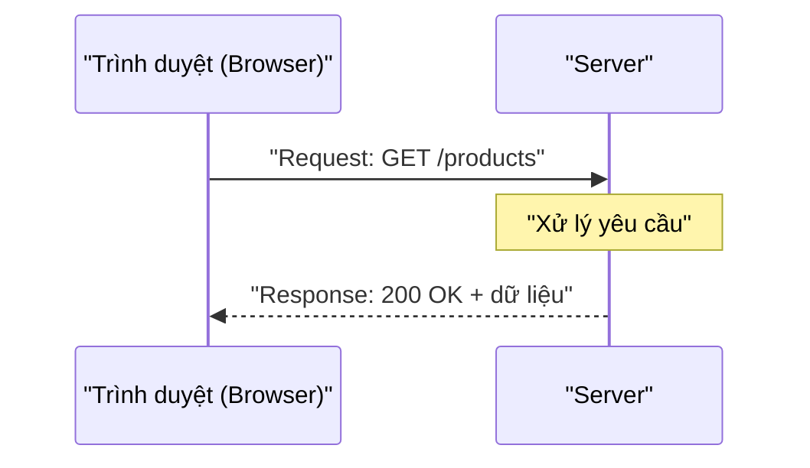

# 1. Tổng quan Web Frameworks

Web framework là bộ thư viện dựng sẵn giúp bạn xây ứng dụng web nhanh hơn, không phải làm lại những việc cơ bản như lắng nghe request hay đọc dữ liệu. Bài này giới thiệu cách HTTP hoạt động, khái niệm REST API, request/response và so sánh nhanh các framework Java phổ biến (Spring Boot, Quarkus, Javalin, Play). Đây là bài mở đầu giúp bạn hiểu nền tảng trước khi học sâu từng framework.

[](pathname:///img/java/tong-quan-web-frameworks.webp)

---

:::note[Ghi nhớ nhanh]

- ⭐ **Web framework làm sẵn việc cơ bản** — lắng nghe request, phân tích URL, đọc dữ liệu, trả response; bạn chỉ lo business logic.
- **HTTP là giao thức hỏi - đáp** — mỗi request có method: `GET` (đọc), `POST` (tạo), `PUT`/`PATCH` (sửa), `DELETE` (xóa).
- **REST API** — mỗi resource một đường dẫn danh từ số nhiều (`/users`), hành động thể hiện qua method.
- **Status code** — `200` OK, `201` Created, `400` Bad Request, `401` Unauthorized, `404` Not Found, `500` lỗi server.
- ⭐ **Bốn framework** — Spring Boot (phổ biến nhất), Quarkus (siêu nhanh), Javalin (siêu nhẹ), Play (reactive); nên học Javalin rồi Spring Boot.

:::

---

## Mục lục

- [Web Framework là gì?](#web-framework-là-gì)
- [Vì sao cần dùng Framework?](#vì-sao-cần-dùng-framework)
- [HTTP hoạt động thế nào?](#http-hoạt-động-thế-nào)
- [REST API là gì?](#rest-api-là-gì)
- [Request và Response](#request-và-response)
- [So sánh nhanh các Framework Java](#so-sánh-nhanh-các-framework-java)
- [Nên học cái nào trước?](#nên-học-cái-nào-trước)
- [Lỗi thường gặp](#lỗi-thường-gặp)
- [Tóm tắt](#tóm-tắt)
- [Câu hỏi phỏng vấn](#câu-hỏi-phỏng-vấn)

---

## Web Framework là gì?

**Web Framework** (khung làm web — bộ thư viện dựng sẵn để xây ứng dụng web) là một tập hợp các công cụ, thư viện và quy tắc giúp bạn viết ứng dụng web nhanh hơn, không phải làm lại những thứ cơ bản từ đầu.

Hãy tưởng tượng bạn muốn xây một ngôi nhà:

- **Không có framework**: bạn phải tự đúc gạch, tự trộn xi măng, tự làm cửa, tự kéo điện nước. Rất lâu và dễ sai.
- **Có framework**: bạn được phát sẵn tường đúc sẵn, cửa lắp ráp, ống nước có sẵn. Bạn chỉ việc ghép lại theo nhu cầu. Nhanh hơn rất nhiều.

Trong lập trình web, "những việc cơ bản" mà framework làm sẵn cho bạn gồm:

- Lắng nghe yêu cầu từ trình duyệt (browser) gửi tới.
- Phân tích đường dẫn URL (địa chỉ web) để biết người dùng muốn gì.
- Đọc dữ liệu người dùng gửi lên (form, JSON...).
- Gửi kết quả trả về cho người dùng.

## Vì sao cần dùng Framework?

Giả sử bạn muốn tự viết một server web bằng Java thuần (không framework). Bạn sẽ phải:

1. Mở một **socket** (cổng kết nối mạng) để lắng nghe.
2. Đọc từng dòng văn bản theo đúng chuẩn giao thức HTTP.
3. Tự tách phương thức (GET, POST...), đường dẫn, các header (thông tin kèm theo).
4. Tự viết code chuyển chuỗi JSON thành đối tượng Java và ngược lại.
5. Tự xử lý nhiều người dùng truy cập cùng lúc (đa luồng — multithreading).

Tất cả những việc trên rất khó, dễ lỗi và mất thời gian. Framework làm sẵn hết. Bạn chỉ cần tập trung vào **logic nghiệp vụ** (business logic — phần xử lý riêng của ứng dụng bạn), ví dụ: "khi người dùng đặt hàng thì lưu vào database".

```java
// KHÔNG dùng framework: phải tự lắng nghe socket, rất phức tạp
ServerSocket server = new ServerSocket(8080); // Mở cổng 8080
Socket client = server.accept();              // Chờ người dùng kết nối
// ... còn phải tự đọc HTTP, tự parse, tự trả lời: rất dài và dễ sai
```

```java
// CÓ framework (ví dụ Javalin): chỉ vài dòng là xong
import io.javalin.Javalin;

Javalin app = Javalin.create().start(8080); // Tạo server ở cổng 8080
app.get("/", ctx -> ctx.result("Xin chào!")); // Trả về chữ khi vào trang chủ
```

## HTTP hoạt động thế nào?

**HTTP** (HyperText Transfer Protocol — giao thức truyền siêu văn bản) là "ngôn ngữ" mà trình duyệt và server dùng để nói chuyện với nhau. Nó hoạt động theo kiểu **hỏi - đáp** (request - response):

1. Trình duyệt gửi một **request** (yêu cầu): "Cho tôi xem trang sản phẩm".
2. Server xử lý rồi gửi lại một **response** (phản hồi): "Đây là danh sách sản phẩm".

Sơ đồ dưới đây minh hoạ luồng hỏi - đáp giữa trình duyệt và server:



Mỗi request có một **method** (phương thức — loại hành động muốn làm). Các method phổ biến:

| Method | Ý nghĩa đời thường | Dùng để |
|--------|-------------------|---------|
| `GET` | "Cho tôi xem" | Lấy dữ liệu (đọc) |
| `POST` | "Tạo cái mới giúp tôi" | Tạo dữ liệu mới |
| `PUT` | "Sửa toàn bộ cái này" | Cập nhật dữ liệu |
| `PATCH` | "Sửa một phần cái này" | Cập nhật một phần |
| `DELETE` | "Xóa cái này đi" | Xóa dữ liệu |

## REST API là gì?

**API** (Application Programming Interface — giao diện lập trình ứng dụng) là cách để hai chương trình nói chuyện với nhau. Ví dụ app điện thoại nói chuyện với server.

**REST** (REpresentational State Transfer — một kiểu thiết kế API phổ biến) là một "quy ước" về cách đặt đường dẫn và dùng method sao cho gọn gàng, dễ hiểu.

Ý tưởng của REST: mỗi "thứ" trong hệ thống (gọi là **resource** — tài nguyên) có một đường dẫn riêng, và bạn dùng method để nói muốn làm gì với nó:

```
GET    /users        -> Lấy danh sách tất cả người dùng
GET    /users/5      -> Lấy thông tin người dùng có id = 5
POST   /users        -> Tạo một người dùng mới
PUT    /users/5      -> Cập nhật người dùng id = 5
DELETE /users/5      -> Xóa người dùng id = 5
```

Lưu ý quy ước: đường dẫn dùng **danh từ số nhiều** (`/users`, không phải `/getUser`), còn hành động thì thể hiện bằng method. Đây là cách viết "đẹp" theo chuẩn REST.

## Request và Response

Một **request** (yêu cầu) thường gồm các phần:

- **Method**: GET, POST...
- **URL**: đường dẫn, ví dụ `/users/5`.
- **Headers** (phần đầu — thông tin kèm theo): ví dụ kiểu dữ liệu, token đăng nhập.
- **Body** (phần thân — dữ liệu chính): thường là JSON khi POST/PUT.

Một **response** (phản hồi) thường gồm:

- **Status code** (mã trạng thái): con số cho biết kết quả.
- **Headers**: thông tin kèm theo.
- **Body**: dữ liệu trả về (thường là JSON).

Các **status code** quan trọng cần nhớ:

| Mã | Ý nghĩa | Khi nào gặp |
|----|---------|-------------|
| `200` | OK — thành công | Lấy dữ liệu thành công |
| `201` | Created — đã tạo | Tạo mới thành công |
| `400` | Bad Request — yêu cầu sai | Dữ liệu gửi lên không hợp lệ |
| `401` | Unauthorized — chưa đăng nhập | Thiếu/sai token đăng nhập |
| `404` | Not Found — không tìm thấy | Đường dẫn không tồn tại |
| `500` | Internal Server Error | Server bị lỗi |

**JSON** (JavaScript Object Notation — định dạng dữ liệu dạng văn bản) là cách phổ biến nhất để gửi dữ liệu qua API. Ví dụ một người dùng dạng JSON:

```json
{
  "id": 5,
  "name": "An",
  "email": "an@example.com"
}
```

## So sánh nhanh các Framework Java

Có rất nhiều framework web cho Java. Dưới đây là 4 cái phổ biến mà bạn sẽ học trong các bài tiếp theo:

| Framework | Đặc điểm chính | Phù hợp với |
|-----------|----------------|-------------|
| **Spring Boot** | Phổ biến nhất, đầy đủ tính năng, cộng đồng lớn | Đa số dự án thực tế, đi làm |
| **Quarkus** | Khởi động siêu nhanh, nhẹ, cloud-native | Microservice, chạy trên cloud |
| **Javalin** | Siêu nhẹ, đơn giản, ít cấu hình | App nhỏ, học nhanh, prototype |
| **Play** | Reactive, full-stack, hỗ trợ Scala | Ứng dụng web lớn, thời gian thực |

Một vài thuật ngữ trong bảng:

- **Cloud-native** (sinh ra cho cloud): thiết kế để chạy tốt trên hạ tầng đám mây như AWS, Google Cloud, thường đóng gói trong container.
- **Microservice** (dịch vụ nhỏ): chia ứng dụng lớn thành nhiều dịch vụ nhỏ độc lập.
- **Reactive** (phản ứng): kiểu lập trình xử lý nhiều việc cùng lúc rất hiệu quả, tốt cho lượng truy cập lớn.
- **Full-stack** (toàn bộ tầng): hỗ trợ cả phần giao diện (frontend) lẫn phần xử lý (backend).

## Nên học cái nào trước?

Lời khuyên cho người mới:

1. **Bắt đầu với Javalin** nếu bạn muốn hiểu nhanh khái niệm request/response mà không bị rối bởi quá nhiều cấu hình.
2. **Học kỹ Spring Boot** vì đây là thứ được dùng nhiều nhất khi đi làm. Hầu hết tin tuyển dụng Java backend đều yêu cầu Spring Boot.
3. Quarkus và Play học sau, khi bạn đã vững Spring Boot và gặp nhu cầu cụ thể.

## Lỗi thường gặp

- **Nhầm GET với POST**: GET chỉ để đọc dữ liệu, không nên dùng GET để thay đổi dữ liệu. Tạo/sửa/xóa phải dùng POST/PUT/DELETE.
- **Đặt đường dẫn không theo chuẩn REST**: ví dụ viết `/getAllUsers` thay vì `GET /users`. Không sai về kỹ thuật nhưng khó bảo trì.
- **Quên status code phù hợp**: tạo mới thành công nên trả `201`, không phải `200`.
- **Tưởng framework là ngôn ngữ mới**: framework chỉ là thư viện viết bằng Java. Bạn vẫn dùng Java như bình thường, chỉ thêm các công cụ có sẵn.
- **Học quá nhiều framework cùng lúc**: nên học vững một cái (Spring Boot) trước, các cái khác chỉ là biến thể của cùng ý tưởng.

## Tóm tắt

- **Web framework** giúp bạn xây ứng dụng web nhanh hơn bằng cách làm sẵn các việc cơ bản như lắng nghe request, đọc dữ liệu, trả response.
- **HTTP** là giao thức hỏi - đáp giữa client và server, mỗi request có một **method** (GET, POST, PUT, DELETE).
- **REST API** là quy ước thiết kế API gọn gàng: dùng danh từ cho resource và method cho hành động.
- **Status code** cho biết kết quả: 200 (OK), 201 (đã tạo), 400 (sai), 404 (không thấy), 500 (lỗi server).
- Bốn framework chính: **Spring Boot** (phổ biến nhất), **Quarkus** (siêu nhanh), **Javalin** (siêu nhẹ), **Play** (reactive).
- Người mới nên học **Javalin** để hiểu khái niệm, rồi tập trung vào **Spring Boot**.

---

## Câu hỏi phỏng vấn

Những câu thường gặp về chủ đề này. Tự trả lời trước, rồi bấm **Xem đáp án** để đối chiếu.

**1. Web framework mang lại lợi ích gì so với viết server bằng Java thuần (không dùng framework)? Nêu ít nhất 3 việc framework làm sẵn cho bạn.**

<details className="qa">
<summary>Xem đáp án</summary>

Framework giúp lập trình viên không phải tự làm lại các việc nền tảng lặp đi lặp lại ở mọi ứng dụng web, ví dụ:

- **Lắng nghe kết nối mạng**: tự mở socket, quản lý luồng (thread) xử lý nhiều request cùng lúc.
- **Phân tích HTTP thô**: tách method, URL, header từ luồng byte theo đúng chuẩn giao thức.
- **Định tuyến (routing)**: ánh xạ URL + method tới đúng đoạn code xử lý (`GET /users` gọi hàm nào).
- **Chuyển đổi dữ liệu (serialization)**: tự động chuyển JSON thành object Java và ngược lại.
- **Xử lý lỗi, validate, bảo mật cơ bản**: nhiều framework có sẵn cơ chế bắt lỗi tập trung, xác thực request.

Nhờ vậy lập trình viên chỉ cần tập trung vào **business logic** (logic nghiệp vụ) riêng của ứng dụng.

</details>

**2. Phân biệt các HTTP method `GET`, `POST`, `PUT`, `PATCH`, `DELETE`. Method nào nên là idempotent (gọi nhiều lần cho cùng kết quả) và tại sao điều này quan trọng?**

<details className="qa">
<summary>Xem đáp án</summary>

| Method | Mục đích | Idempotent? |
|--------|----------|-------------|
| `GET` | Đọc dữ liệu, không thay đổi gì | Có |
| `POST` | Tạo mới một resource | Không |
| `PUT` | Cập nhật/thay thế toàn bộ resource | Có |
| `PATCH` | Cập nhật một phần resource | Thường không (tùy cách hiện thực) |
| `DELETE` | Xóa resource | Có |

- **Idempotent** (bất biến khi lặp lại) nghĩa là gọi cùng một request nhiều lần cho **kết quả cuối cùng giống hệt** như gọi một lần. Ví dụ `DELETE /users/5` gọi 1 lần hay 10 lần thì user 5 vẫn chỉ ở trạng thái "đã xóa" — không lỗi, không xóa "thêm".
- Ngược lại, `POST /users` gọi 2 lần sẽ tạo ra **2 user khác nhau** — không idempotent.
- Điều này quan trọng vì mạng có thể bị mất gói tin, client (hoặc load balancer) có thể **tự động gửi lại request** khi nghi ngờ timeout. Nếu method đó idempotent, việc gửi lại là an toàn; nếu không (như `POST`), gửi lại có thể tạo dữ liệu trùng lặp ngoài ý muốn.

</details>

**3. REST API là gì? Thiết kế endpoint sau đây có tuân theo chuẩn REST không: `GET /getUserById?id=5`? Nếu không, hãy sửa lại cho đúng.**

<details className="qa">
<summary>Xem đáp án</summary>

**REST** (REpresentational State Transfer) là quy ước thiết kế API theo hướng **resource** (tài nguyên): mỗi "thứ" trong hệ thống có một đường dẫn cố định (danh từ số nhiều), còn **hành động** thể hiện qua HTTP method chứ không phải nhét vào tên đường dẫn.

`GET /getUserById?id=5` **không đúng chuẩn REST** vì:

- Tên đường dẫn chứa động từ `getUserById` — REST đã dùng `GET` để nói "lấy dữ liệu" rồi, không cần lặp lại ý đó trong URL.
- `id` truyền qua query string trong khi đây là định danh của một resource cụ thể, nên đưa vào path.

Sửa lại theo chuẩn REST:

```
GET /users/5
```

Đường dẫn `/users` đại diện cho tập hợp user, còn `/5` xác định đúng một user cụ thể trong tập đó.

</details>

**4. Sự khác nhau giữa status code `401 Unauthorized` và `403 Forbidden` là gì?**

<details className="qa">
<summary>Xem đáp án</summary>

Cả hai đều liên quan tới việc từ chối truy cập, nhưng khác nhau ở **nguyên nhân**:

- **`401 Unauthorized`** (chưa xác thực — authentication): server **không biết bạn là ai**, vì request thiếu thông tin đăng nhập (token/credential) hoặc thông tin đó sai/hết hạn. Cách xử lý: đăng nhập lại để lấy token hợp lệ.
- **`403 Forbidden`** (bị cấm — authorization): server **biết chính xác bạn là ai** (đã xác thực thành công), nhưng tài khoản đó **không có quyền** thực hiện hành động này. Đăng nhập lại cũng không giải quyết được, vì vấn đề là phân quyền chứ không phải danh tính.

Ví dụ dễ nhớ: `401` giống như bảo vệ chặn ở cổng vì bạn chưa xuất trình thẻ; `403` giống như bạn đã xuất trình thẻ nhân viên hợp lệ, nhưng thẻ đó không được vào phòng máy chủ.

</details>

**5. Điền status code phù hợp cho từng tình huống sau: (a) tạo user thành công, (b) client gửi JSON sai định dạng, (c) gọi tới một đường dẫn không tồn tại, (d) server bị lỗi ngoại lệ chưa xử lý.**

<details className="qa">
<summary>Xem đáp án</summary>

| Tình huống | Status code |
|---|---|
| (a) Tạo user thành công | `201 Created` |
| (b) Client gửi JSON sai định dạng | `400 Bad Request` |
| (c) Đường dẫn không tồn tại | `404 Not Found` |
| (d) Server bị lỗi ngoại lệ chưa xử lý | `500 Internal Server Error` |

Lưu ý phân biệt nhóm mã: `2xx` là thành công, `4xx` là **lỗi do phía client** (dữ liệu/gọi sai), `5xx` là **lỗi do phía server**. Trả sai nhóm mã (ví dụ trả `200` kèm thông báo lỗi trong body) khiến client khó xử lý tự động và là lỗi thiết kế API phổ biến.

</details>

**6. Đoạn thiết kế API sau có vấn đề gì về mặt REST? Hãy chỉ ra và sửa lại.**

```
POST /deleteUser/5
GET  /updateUserName?id=5&name=An
```

<details className="qa">
<summary>Xem đáp án</summary>

Cả hai đều sai quy ước REST vì **hành động bị nhét vào URL thay vì dùng đúng HTTP method**:

- `POST /deleteUser/5`: dùng `POST` để xóa, trong khi REST đã có `DELETE` dành riêng cho việc này.
- `GET /updateUserName?...`: `GET` chỉ nên dùng để **đọc** dữ liệu, không được dùng để **sửa** dữ liệu — đây còn là lỗi nghiêm trọng hơn vì trình duyệt, proxy hay công cụ crawl có thể tự động gọi `GET` (ví dụ để cache trước), vô tình gây thay đổi dữ liệu ngoài ý muốn.

Sửa lại theo chuẩn REST:

```
DELETE /users/5
PATCH  /users/5   (body: {"name": "An"})
```

</details>

**7. So sánh Spring Boot, Quarkus, Javalin, Play theo tiêu chí: mức độ phổ biến, tốc độ khởi động, độ phức tạp cấu hình, use case phù hợp.**

<details className="qa">
<summary>Xem đáp án</summary>

| | Spring Boot | Quarkus | Javalin | Play |
|---|---|---|---|---|
| Phổ biến | Rất cao, gần như mặc định ở doanh nghiệp | Đang tăng, mạnh ở microservice | Thấp hơn, dùng cho project nhỏ/học tập | Trung bình, phổ biến hơn ở hệ sinh thái Scala |
| Tốc độ khởi động | Chậm hơn (nhiều auto-configuration) | Rất nhanh, tối ưu cho container/serverless | Rất nhanh, ít lớp trung gian | Trung bình, có kiến trúc reactive riêng |
| Độ phức tạp cấu hình | Cao — nhiều annotation, nhiều lớp trừu tượng | Trung bình — vẫn theo phong cách Spring/Jakarta nhưng nhẹ hơn | Thấp — API tối giản, ít "phép màu" ẩn | Cao — có convention và tooling riêng |
| Use case phù hợp | Đa số dự án doanh nghiệp, hệ thống lớn | Microservice chạy trên Kubernetes/cloud, cần khởi động nhanh | App nhỏ, prototype, dạy/học framework | Ứng dụng cần xử lý đồng thời lớn, real-time |

Trong thực tế, phần lớn tin tuyển dụng Java backend yêu cầu Spring Boot, nên đây thường là framework nên đầu tư học sâu nhất.

</details>

**8. Bạn được giao thiết kế REST API cho một hệ thống quản lý đơn hàng (order) có quan hệ với người dùng (user) và sản phẩm (product). Hãy đề xuất các endpoint chính theo chuẩn REST, bao gồm cả trường hợp lấy danh sách đơn hàng của một user cụ thể.**

<details className="qa">
<summary>Xem đáp án</summary>

Áp dụng nguyên tắc "resource là danh từ số nhiều, hành động thể hiện qua method":

```
GET    /orders            -> Lấy danh sách tất cả đơn hàng
GET    /orders/10         -> Lấy chi tiết đơn hàng id = 10
POST   /orders            -> Tạo đơn hàng mới
PUT    /orders/10         -> Cập nhật toàn bộ đơn hàng id = 10
PATCH  /orders/10         -> Cập nhật một phần (vd: đổi trạng thái)
DELETE /orders/10         -> Hủy/xóa đơn hàng id = 10

GET    /users/5/orders    -> Lấy danh sách đơn hàng của user id = 5
```

- Endpoint `GET /users/5/orders` thể hiện quan hệ **user sở hữu nhiều order** bằng cách lồng resource con dưới resource cha — đây là quy ước REST phổ biến cho quan hệ 1-nhiều.
- Với sản phẩm trong đơn hàng (order có nhiều product), thường không lồng path sâu thêm mà thể hiện qua **body** khi tạo/sửa đơn hàng, ví dụ `POST /orders` với body chứa danh sách `productId` và số lượng — tránh path bị lồng quá 2 cấp gây khó bảo trì (`/users/5/orders/10/products/3` là ví dụ nên tránh).

</details>
