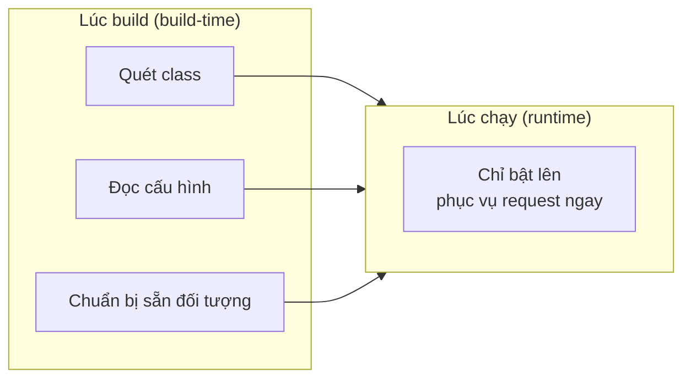

# 3. Quarkus

Quarkus là framework Java hiện đại do Red Hat tạo ra, thiết kế cho cloud và container với điểm mạnh là khởi động cực nhanh và dùng rất ít RAM. Bài này giới thiệu khái niệm cloud-native, native image với GraalVM, cách viết endpoint bằng JAX-RS và so sánh với Spring Boot. Đây là lựa chọn tốt khi bạn xây microservice hoặc ứng dụng serverless chạy trên cloud.

[](pathname:///img/java/quarkus.webp)

---

:::note[Ghi nhớ nhanh]

- ⭐ **Quarkus tối ưu cho cloud-native/microservice** — khởi động cực nhanh (mili-giây) và dùng rất ít RAM.
- ⭐ **Nhanh nhờ dời việc sang lúc build** — làm phần lớn công việc lúc build-time thay vì runtime, giảm tối đa reflection.
- **Native image qua GraalVM** — biến app thành file chạy trực tiếp không cần JVM; đổi lại build lâu hơn.
- **Dùng chuẩn Java** — `JAX-RS` (`@Path`, `@GET`) cho endpoint, `CDI` (`@Inject`, `@ApplicationScoped`) cho DI, không dùng annotation Spring.
- **Chọn Quarkus cho serverless/cloud**; chọn Spring Boot khi cần cộng đồng lớn, dễ học.

:::

---

## Mục lục

- [Quarkus là gì?](#quarkus-là-gì)
- [Vì sao có Quarkus?](#vì-sao-có-quarkus)
- [Cloud-native và Microservice là gì?](#cloud-native-và-microservice-là-gì)
- [Vì sao Quarkus khởi động siêu nhanh?](#vì-sao-quarkus-khởi-động-siêu-nhanh)
- [Native Image với GraalVM](#native-image-với-graalvm)
- [Tạo dự án Quarkus](#tạo-dự-án-quarkus)
- [Viết endpoint với JAX-RS](#viết-endpoint-với-jax-rs)
- [Dependency Injection trong Quarkus](#dependency-injection-trong-quarkus)
- [So sánh Quarkus với Spring Boot](#so-sánh-quarkus-với-spring-boot)
- [Khi nào nên dùng Quarkus?](#khi-nào-nên-dùng-quarkus)
- [Lỗi thường gặp](#lỗi-thường-gặp)
- [Tóm tắt](#tóm-tắt)
- [Câu hỏi phỏng vấn](#câu-hỏi-phỏng-vấn)

---

## Quarkus là gì?

**Quarkus** là một framework Java hiện đại do công ty Red Hat tạo ra, thiết kế đặc biệt cho việc chạy trên **cloud** (đám mây) và **container** (vùng chứa — gói ứng dụng kèm môi trường chạy, ví dụ Docker).

Khẩu hiệu của Quarkus là "Supersonic Subatomic Java" (Java siêu thanh siêu nhỏ), nhấn mạnh hai điểm mạnh:

- **Khởi động cực nhanh** (tính bằng phần nghìn giây thay vì vài giây).
- **Dùng rất ít bộ nhớ** (RAM).

Quarkus dùng các chuẩn quen thuộc của Java như JAX-RS, CDI nên nếu bạn từng học Spring thì sẽ thấy nhiều thứ tương tự.

## Vì sao có Quarkus?

**Vấn đề:** Ứng dụng Java truyền thống (ví dụ Spring chạy trên JVM) **khởi động chậm** (mất vài giây) và **tốn nhiều RAM** vì làm rất nhiều việc lúc chạy: quét class, đọc cấu hình, dùng reflection (đọc/tạo đối tượng lúc chạy). Điều này không hợp với thời cloud-native: microservice và **serverless** cần khởi động tức thì (tránh **cold start** — độ trễ khi bản chạy mới được bật lên), cần **scale-to-zero** (tắt hẳn khi không dùng rồi bật lại khi có request) và cần tiết kiệm RAM vì chạy nhiều container thì RAM tốn tiền.

**Giải pháp:** Quarkus tối ưu theo hướng **"container-first"** — dời phần lớn công việc sang **lúc biên dịch** (build-time) thay vì lúc chạy, giảm tối đa reflection, nhờ vậy khởi động cực nhanh và ăn rất ít RAM. Quarkus còn hỗ trợ biên dịch **native image** (qua GraalVM) cho thời gian khởi động tính bằng mili-giây, trong khi vẫn giữ các chuẩn quen thuộc (CDI, JAX-RS) và có live reload khi phát triển.

```java
import jakarta.ws.rs.GET;
import jakarta.ws.rs.Path;

// Endpoint đơn giản — Quarkus đã xử lý phần lớn cấu hình lúc build,
// nên lúc chạy chỉ "bật lên" là phục vụ request ngay (khởi động mili-giây).
@Path("/ping")
public class PingResource {

    @GET
    public String ping() {
        return "pong";
    }
}
```

:::tip[Dùng thực tế]
- **Microservice cần cold start nhanh**: nhiều dịch vụ nhỏ thường xuyên nhân bản/khởi động lại trên Kubernetes.
- **Hàm serverless** (ví dụ AWS Lambda): mỗi lần gọi có thể khởi động một bản mới, cần bật lên tức thì.
- **Tiết kiệm RAM khi chạy nhiều container**: giảm chi phí hạ tầng khi nhân bản hàng chục, hàng trăm bản chạy.
- **Native image cho startup mili-giây**: ứng dụng yêu cầu khởi động cực nhanh, build sẵn thành file chạy gốc.
:::

## Cloud-native và Microservice là gì?

Trước khi hiểu vì sao Quarkus đặc biệt, cần nắm hai khái niệm:

- **Cloud-native** (sinh ra cho cloud): ứng dụng được thiết kế để chạy tốt trên hạ tầng đám mây. Đặc điểm: đóng gói trong container, có thể nhân bản nhiều bản chạy song song, khởi động/tắt nhanh tùy theo lượng truy cập.
- **Microservice** (dịch vụ nhỏ): thay vì viết một ứng dụng to (gọi là **monolith** — khối liền), người ta chia thành nhiều dịch vụ nhỏ độc lập. Ví dụ: dịch vụ đăng nhập riêng, dịch vụ thanh toán riêng, dịch vụ giỏ hàng riêng.

Trong môi trường này, ứng dụng thường xuyên được khởi động lại và nhân bản. Vì vậy tốc độ khởi động và mức tiêu thụ RAM trở nên cực kỳ quan trọng — đây chính là chỗ Quarkus tỏa sáng.

## Vì sao Quarkus khởi động siêu nhanh?

Các framework truyền thống (như Spring Boot kiểu cũ) làm rất nhiều việc **lúc chạy** (runtime — thời điểm ứng dụng đang chạy): quét class, đọc cấu hình, tạo đối tượng... Những việc này tốn thời gian mỗi lần khởi động.

Quarkus làm khác: nó chuyển phần lớn công việc này sang **lúc build** (build time — thời điểm biên dịch, trước khi chạy). Nghĩa là khi đóng gói ứng dụng, Quarkus đã chuẩn bị sẵn mọi thứ. Đến lúc chạy, nó chỉ việc "bật lên" là xong.

Hãy ví von: nấu cơm.

- **Spring Boot kiểu cũ**: mỗi lần ăn mới đi chợ, sơ chế, rồi nấu (chậm).
- **Quarkus**: chuẩn bị sẵn nguyên liệu từ trước, lúc ăn chỉ việc hâm nóng (nhanh).

Sơ đồ dưới đây minh hoạ cách Quarkus dời phần lớn công việc sang lúc build:



## Native Image với GraalVM

**GraalVM** là một công nghệ (do Oracle phát triển) cho phép biên dịch chương trình Java thành **native image** (ảnh chạy gốc — file chạy trực tiếp trên hệ điều hành mà không cần JVM).

Bình thường Java chạy trên **JVM** (Java Virtual Machine — máy ảo Java), phải khởi động JVM trước rồi mới chạy code. Native image bỏ qua bước đó: ứng dụng trở thành một file thực thi gọn, chạy thẳng.

Lợi ích của native image:

- Khởi động trong vài **mili-giây** (phần nghìn giây).
- Tốn ít RAM hơn nhiều.

Quarkus được tối ưu rất tốt để build native image. Lệnh build (dùng Maven):

```bash
# Build ứng dụng thành native image (cần cài GraalVM)
./mvnw package -Pnative
```

Đánh đổi: build native image **lâu hơn** build thường, và một số thư viện Java cần cấu hình thêm để tương thích. Vì vậy native image chỉ nên dùng khi thực sự cần tốc độ khởi động cực nhanh.

## Tạo dự án Quarkus

Bạn có thể tạo dự án tại trang `code.quarkus.io` (tương tự Spring Initializr), chọn các thư viện cần dùng rồi tải về. Một file cấu hình quan trọng là `application.properties` (giống Spring Boot):

```properties
# Đổi cổng chạy server
quarkus.http.port=8080

# Bật chế độ log chi tiết khi phát triển
quarkus.log.level=INFO
```

Quarkus có chế độ **dev mode** (chế độ phát triển) rất tiện: bạn sửa code thì ứng dụng tự cập nhật ngay, không cần khởi động lại:

```bash
# Chạy ở chế độ phát triển, tự nạp lại khi sửa code
./mvnw quarkus:dev
```

## Viết endpoint với JAX-RS

**JAX-RS** (Java API for RESTful Web Services — chuẩn API của Java để làm REST) là một bộ quy ước chuẩn của Java để viết REST API. Quarkus dùng JAX-RS thay vì các annotation riêng của Spring.

**Endpoint** (điểm cuối) là một đường dẫn API mà người dùng có thể gọi tới, ví dụ `/hello`.

```java
import jakarta.ws.rs.GET;
import jakarta.ws.rs.Path;
import jakarta.ws.rs.Produces;
import jakarta.ws.rs.core.MediaType;

// @Path("/hello"): đặt đường dẫn gốc cho class này là /hello
@Path("/hello")
public class GreetingResource {

    // @GET: xử lý request GET
    @GET
    // @Produces: khai báo kiểu dữ liệu trả về là văn bản thuần
    @Produces(MediaType.TEXT_PLAIN)
    public String hello() {
        // Chuỗi này sẽ là response gửi về cho người dùng
        return "Xin chào từ Quarkus!";
    }
}
```

So sánh với Spring Boot để dễ nhớ:

| Spring Boot | JAX-RS (Quarkus) |
|-------------|------------------|
| `@RestController` | (không cần, class có `@Path` là đủ) |
| `@RequestMapping("/x")` | `@Path("/x")` |
| `@GetMapping` | `@GET` |
| `@PostMapping` | `@POST` |
| `@PathVariable` | `@PathParam` |
| `@RequestParam` | `@QueryParam` |

Ví dụ lấy tham số từ đường dẫn:

```java
import jakarta.ws.rs.GET;
import jakarta.ws.rs.Path;
import jakarta.ws.rs.PathParam;

@Path("/users")
public class UserResource {

    // GET /users/5 -> lấy người dùng id = 5
    // @PathParam("id"): lấy giá trị {id} trong đường dẫn gán vào biến id
    @GET
    @Path("/{id}")
    public String getUser(@PathParam("id") int id) {
        return "Người dùng số " + id;
    }
}
```

## Dependency Injection trong Quarkus

Quarkus dùng **CDI** (Contexts and Dependency Injection — chuẩn tiêm phụ thuộc của Java) để làm dependency injection, tương tự như Spring nhưng dùng annotation khác.

```java
import jakarta.enterprise.context.ApplicationScoped;

// @ApplicationScoped: tạo một đối tượng dùng chung cho toàn ứng dụng
// (tương tự @Service bên Spring)
@ApplicationScoped
public class UserService {

    public String findUserName(int id) {
        return "Người dùng số " + id;
    }
}
```

```java
import jakarta.inject.Inject;
import jakarta.ws.rs.GET;
import jakarta.ws.rs.Path;
import jakarta.ws.rs.PathParam;

@Path("/users")
public class UserResource {

    // @Inject: tiêm UserService vào đây (tương tự @Autowired bên Spring)
    @Inject
    UserService userService;

    @GET
    @Path("/{id}")
    public String getUser(@PathParam("id") int id) {
        return userService.findUserName(id);
    }
}
```

## So sánh Quarkus với Spring Boot

| Tiêu chí | Spring Boot | Quarkus |
|----------|-------------|---------|
| Tốc độ khởi động | Vài giây | Mili-giây (đặc biệt với native) |
| Tiêu thụ RAM | Cao hơn | Thấp hơn nhiều |
| Cộng đồng / tài liệu | Rất lớn, lâu đời | Nhỏ hơn, đang phát triển |
| Độ phổ biến đi làm | Rất cao | Đang tăng |
| Annotation | Riêng của Spring | Chuẩn Java (JAX-RS, CDI) |
| Native image | Hỗ trợ nhưng phức tạp hơn | Hỗ trợ rất tốt |

## Khi nào nên dùng Quarkus?

Nên cân nhắc Quarkus khi:

- Bạn xây **microservice** chạy trên cloud/container (Kubernetes, Docker).
- Bạn cần khởi động siêu nhanh, ví dụ ứng dụng kiểu **serverless** (chạy theo từng lần gọi, khởi động liên tục).
- Bạn muốn tiết kiệm RAM để giảm chi phí hạ tầng.

Nên dùng Spring Boot thay vì Quarkus khi:

- Bạn mới học và muốn nhiều tài liệu, nhiều người hỗ trợ.
- Dự án truyền thống, không quá nhạy cảm với tốc độ khởi động.
- Đội ngũ đã quen Spring.

## Lỗi thường gặp

- **Dùng annotation của Spring trong Quarkus**: ví dụ `@RestController` không hoạt động ở Quarkus. Phải dùng JAX-RS (`@Path`, `@GET`...).
- **Tưởng native image luôn tốt hơn**: build native image lâu và phức tạp hơn. Với ứng dụng nhỏ hoặc giai đoạn học, chạy trên JVM bình thường là đủ.
- **Quên cài GraalVM khi build native**: lệnh `-Pnative` sẽ lỗi nếu chưa có GraalVM.
- **Nhầm @PathParam với @QueryParam**: `@PathParam` lấy từ đường dẫn `/users/5`, `@QueryParam` lấy sau dấu `?` như `/users?id=5`.
- **Không tận dụng dev mode**: nhiều người mới khởi động lại thủ công mỗi lần sửa. Hãy dùng `quarkus:dev` để code nhanh hơn.

## Tóm tắt

- **Quarkus** là framework Java cho **cloud-native** và **microservice**, nổi bật ở khởi động siêu nhanh và dùng ít RAM.
- Quarkus nhanh vì chuyển nhiều việc từ **lúc chạy** sang **lúc build**.
- **Native image** (qua **GraalVM**) biến ứng dụng thành file chạy trực tiếp, khởi động trong mili-giây nhưng build lâu hơn.
- Quarkus dùng chuẩn Java: **JAX-RS** cho endpoint (`@Path`, `@GET`...) và **CDI** cho dependency injection (`@Inject`, `@ApplicationScoped`).
- Chọn Quarkus cho microservice/serverless trên cloud; chọn Spring Boot khi cần cộng đồng lớn và dễ học.

---

## Câu hỏi phỏng vấn

Những câu thường gặp về chủ đề này. Tự trả lời trước, rồi bấm **Xem đáp án** để đối chiếu.

**1. Cloud-native và microservice là gì? Vì sao hai khái niệm này khiến tốc độ khởi động ứng dụng trở nên quan trọng?**

<details className="qa">
<summary>Xem đáp án</summary>

- **Cloud-native**: cách thiết kế ứng dụng để chạy tốt trên hạ tầng đám mây — đóng gói trong container, có thể nhân bản (scale) nhiều bản chạy song song, tự động khởi động/tắt theo lượng truy cập.
- **Microservice**: chia một ứng dụng lớn (monolith) thành nhiều dịch vụ nhỏ độc lập, mỗi dịch vụ triển khai và mở rộng riêng.

Trong môi trường này, các container thường xuyên được **tạo mới, nhân bản, hoặc tắt đi (scale-to-zero)** theo tải thực tế, đặc biệt với kiến trúc **serverless**. Nếu ứng dụng khởi động chậm (vài giây như JVM truyền thống), mỗi lần cần một bản chạy mới (**cold start**) người dùng phải chờ lâu — ảnh hưởng trực tiếp tới trải nghiệm và cả chi phí (trả tiền theo thời gian container chạy).

</details>

**2. Vì sao Quarkus khởi động nhanh hơn nhiều so với một ứng dụng Spring Boot truyền thống chạy trên JVM?**

<details className="qa">
<summary>Xem đáp án</summary>

Khác biệt cốt lõi nằm ở **thời điểm xử lý công việc nặng**:

- **Spring Boot kiểu cũ**: phần lớn công việc như quét class, đọc annotation, tạo bean bằng reflection diễn ra **lúc chạy (runtime)** — mỗi lần khởi động phải làm lại từ đầu.
- **Quarkus**: dời phần lớn công việc đó sang **lúc build (build-time)**. Khi đóng gói ứng dụng, Quarkus đã quét sẵn class, xử lý sẵn annotation, chuẩn bị sẵn cấu trúc cần thiết. Lúc chạy chỉ còn việc "bật lên" và phục vụ request ngay, gần như không cần reflection.

Nhờ vậy thời gian khởi động giảm từ vài giây xuống còn vài chục/vài trăm mili-giây (và có thể xuống thấp hơn nữa với native image).

</details>

**3. Native image là gì? Nó mang lại lợi ích gì và phải đánh đổi điều gì?**

<details className="qa">
<summary>Xem đáp án</summary>

**Native image** là kết quả biên dịch ứng dụng Java (qua công cụ **GraalVM**) thành một **file thực thi chạy trực tiếp trên hệ điều hành**, không cần khởi động JVM (Java Virtual Machine) trước như cách chạy Java thông thường.

- **Lợi ích**: khởi động chỉ trong vài mili-giây, tiêu thụ RAM ít hơn hẳn — rất phù hợp cho serverless và microservice cần scale nhanh.
- **Đánh đổi**:
  - Thời gian **build lâu hơn đáng kể** so với build file `.jar` thông thường.
  - Một số thư viện dùng nhiều reflection lúc runtime cần **cấu hình bổ sung** (reflection config) mới tương thích được với native image, vì GraalVM cần biết trước mọi thứ sẽ dùng reflection ngay lúc build.
  - Vì vậy native image nên dùng khi thực sự cần tốc độ khởi động cực nhanh, không phải lựa chọn mặc định cho mọi dự án.

</details>

**4. Viết lại đoạn endpoint Spring Boot sau đây sang phong cách JAX-RS của Quarkus.**

```java
@RestController
@RequestMapping("/products")
public class ProductController {

    @GetMapping("/{id}")
    public String getProduct(@PathVariable int id) {
        return "Sản phẩm số " + id;
    }
}
```

<details className="qa">
<summary>Xem đáp án</summary>

```java
import jakarta.ws.rs.GET;
import jakarta.ws.rs.Path;
import jakarta.ws.rs.PathParam;

@Path("/products")
public class ProductResource {

    @GET
    @Path("/{id}")
    public String getProduct(@PathParam("id") int id) {
        return "Sản phẩm số " + id;
    }
}
```

Điểm khác biệt chính: không cần annotation tương đương `@RestController` (chỉ cần class có `@Path` là JAX-RS đã nhận diện), `@RequestMapping`/`@GetMapping` gộp thành `@Path` (cấp class) + `@Path` (cấp method) + `@GET`, và `@PathVariable` đổi thành `@PathParam("id")` với tên tham số phải khai báo tường minh trong ngoặc.

</details>

**5. CDI là gì? So sánh `@ApplicationScoped` + `@Inject` của Quarkus với `@Service` + constructor injection của Spring.**

<details className="qa">
<summary>Xem đáp án</summary>

**CDI** (Contexts and Dependency Injection) là chuẩn dependency injection của Java (một phần của Jakarta EE), mà Quarkus dùng thay cho cơ chế DI riêng của Spring.

| Spring | Quarkus (CDI) | Ý nghĩa |
|---|---|---|
| `@Service` / `@Component` | `@ApplicationScoped` | Đánh dấu bean dùng chung (singleton) cho cả ứng dụng |
| `@Autowired` (field injection) | `@Inject` (trên field) | Yêu cầu tiêm dependency vào |
| Constructor injection (khuyến nghị) | Cũng hỗ trợ `@Inject` trên constructor | Cách tiêm được khuyến nghị ở cả hai |

Về bản chất, cả hai đều giải quyết cùng vấn đề (để framework tự tạo và tiêm đối tượng thay vì tự `new`), chỉ khác annotation vì CDI là chuẩn chung của Java còn Spring có annotation riêng của mình.

</details>

**6. Đoạn code sau chạy trên Quarkus có vấn đề gì? Sửa lại cho đúng.**

```java
@RestController
@RequestMapping("/hello")
public class GreetingResource {

    @GetMapping
    public String hello() {
        return "Xin chào từ Quarkus!";
    }
}
```

<details className="qa">
<summary>Xem đáp án</summary>

Vấn đề: dùng nhầm annotation của **Spring** (`@RestController`, `@RequestMapping`, `@GetMapping`) trong một dự án **Quarkus** — Quarkus không hiểu các annotation này vì nó dùng chuẩn **JAX-RS**, không phải Spring MVC. Ứng dụng sẽ không nhận diện được endpoint này.

Sửa lại:

```java
import jakarta.ws.rs.GET;
import jakarta.ws.rs.Path;
import jakarta.ws.rs.Produces;
import jakarta.ws.rs.core.MediaType;

@Path("/hello")
public class GreetingResource {

    @GET
    @Produces(MediaType.TEXT_PLAIN)
    public String hello() {
        return "Xin chào từ Quarkus!";
    }
}
```

</details>

**7. So sánh Quarkus và Spring Boot theo các tiêu chí: tốc độ khởi động, tiêu thụ RAM, hệ sinh thái/cộng đồng, kiểu annotation dùng.**

<details className="qa">
<summary>Xem đáp án</summary>

| Tiêu chí | Spring Boot | Quarkus |
|---|---|---|
| Tốc độ khởi động | Vài giây (JVM thường) | Mili-giây, đặc biệt nhanh với native image |
| Tiêu thụ RAM | Cao hơn | Thấp hơn đáng kể |
| Cộng đồng/tài liệu | Rất lớn, lâu đời, dễ tìm hướng dẫn | Nhỏ hơn, đang phát triển nhanh |
| Annotation | Riêng của Spring (`@RestController`...) | Chuẩn Java: JAX-RS (`@Path`), CDI (`@Inject`) |
| Phù hợp | Đa số dự án doanh nghiệp truyền thống | Microservice, serverless, container cần khởi động nhanh |

Cả hai đều là lựa chọn tốt cho REST API; sự khác biệt chủ yếu nằm ở **triết lý tối ưu** (đầy đủ tính năng, cộng đồng lớn vs. khởi động nhanh, tiết kiệm tài nguyên) hơn là hơn/kém tuyệt đối.

</details>

**8. Bạn cần thiết kế một hệ thống gồm hàng chục microservice chạy trên Kubernetes, trong đó nhiều service có lượng truy cập thấp và muốn tự động scale về 0 (không chạy instance nào) khi không có request để tiết kiệm chi phí, rồi bật lại tức thì khi có request tới. Nên ưu tiên Quarkus hay Spring Boot? Vì sao?**

<details className="qa">
<summary>Xem đáp án</summary>

Nên ưu tiên **Quarkus**, đặc biệt kết hợp build **native image**, vì:

- Kịch bản "scale về 0 rồi bật lại tức thì" chính là mô hình **serverless**, nơi **cold start** (thời gian khởi động bản chạy mới) ảnh hưởng trực tiếp tới độ trễ mà người dùng cảm nhận được — mỗi request đầu tiên sau khi scale-to-zero phải chờ instance khởi động xong mới được phục vụ.
- Native image của Quarkus khởi động trong vài mili-giây, gần như không có độ trễ đáng kể; trong khi Spring Boot chạy trên JVM thường mất vài giây để khởi động — với tần suất scale-to-zero cao, độ trễ này cộng dồn ảnh hưởng lớn tới trải nghiệm.
- Quarkus cũng tiêu thụ ít RAM hơn, giúp chạy được nhiều instance hơn trên cùng tài nguyên Kubernetes, giảm chi phí hạ tầng khi có hàng chục service.

Đánh đổi cần lưu ý: build native image tốn thời gian hơn trong CI/CD, và đội ngũ cần quen với JAX-RS/CDI thay vì Spring quen thuộc.

</details>

**9. Giải thích ý tưởng "container-first" và "build-time processing" của Quarkus qua ví dụ đời thường.**

<details className="qa">
<summary>Xem đáp án</summary>

**Container-first** nghĩa là Quarkus được thiết kế với giả định ứng dụng sẽ chạy trong container, thường xuyên bị tạo mới/nhân bản — nên mọi quyết định thiết kế đều ưu tiên khởi động nhanh, ít tài nguyên.

Ví von nấu ăn: 

- Cách truyền thống (nhiều framework Java khác) giống như **mỗi lần có khách mới đi chợ, sơ chế rồi mới nấu** — tốn thời gian mỗi lần.
- Quarkus giống như **chuẩn bị sẵn nguyên liệu đã sơ chế từ trước** (lúc build), khi có khách chỉ việc **hâm nóng** (lúc chạy) là phục vụ ngay.

Cụ thể hơn, "build-time processing" nghĩa là các bước như quét class tìm annotation, phân tích cấu hình, xác định bean nào cần tạo... được Quarkus thực hiện **một lần duy nhất lúc đóng gói ứng dụng**, kết quả được "đóng băng" sẵn. Lúc chạy thật, ứng dụng không cần lặp lại các bước phân tích tốn thời gian đó nữa.

</details>

**10. `@ApplicationScoped` trong CDI có luôn hoạt động giống hệt bean `singleton` mặc định của Spring không? Nêu thêm ít nhất một scope khác của CDI và ý nghĩa của nó.**

<details className="qa">
<summary>Xem đáp án</summary>

Về hành vi thực tế, **`@ApplicationScoped` tương đương singleton của Spring**: CDI chỉ tạo **một instance duy nhất** cho cả vòng đời ứng dụng, dùng chung cho mọi nơi tiêm vào — giống hệt ý nghĩa "singleton".

Tuy nhiên CDI có **nhiều loại scope** khác nhau tùy vòng đời mong muốn, ví dụ:

- **`@RequestScoped`**: tạo một instance **mới cho mỗi request HTTP**, hủy khi request kết thúc — phù hợp khi cần giữ trạng thái riêng biệt cho từng request (ví dụ thông tin người dùng đang đăng nhập).
- **`@Dependent`**: instance có vòng đời **gắn liền với đối tượng đang tiêm nó vào** (gần giống scope "prototype" của Spring — mỗi lần tiêm là một instance mới).

Vì vậy khi thiết kế bean trong Quarkus, cần chọn đúng scope theo nhu cầu giữ trạng thái, không nên mặc định luôn dùng `@ApplicationScoped` cho mọi trường hợp.

</details>
