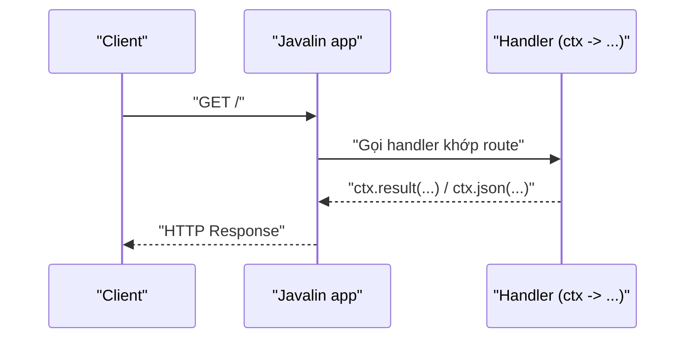

# 4. Javalin

Javalin là framework web Java cực kỳ nhẹ và đơn giản, theo triết lý "đơn giản nhất có thể, ít phép thuật nhất có thể". Bài này giới thiệu cách tạo server chỉ với vài dòng code, định nghĩa route, đọc dữ liệu từ request, trả về JSON và so sánh với Spring Boot. Đây là lựa chọn lý tưởng cho người mới học, app nhỏ hoặc làm prototype nhanh.

[](pathname:///img/java/javalin.webp)

---

:::note[Ghi nhớ nhanh]

- ⭐ **Javalin siêu nhẹ, siêu đơn giản** — vài dòng trong hàm `main` là có server, "ít phép thuật", học rất nhanh.
- **Định nghĩa route bằng hàm** — `app.get(...)`, `app.post(...)` thay vì annotation.
- **Đối tượng `ctx` (context)** — đọc request và trả response: `ctx.pathParam`, `ctx.queryParam`, `ctx.body`, `ctx.json`, `ctx.status`.
- **Ít tính năng sẵn hơn Spring Boot** — tự ghép thêm bảo mật, truy cập database khi cần.
- ⭐ **Dùng cho app nhỏ, prototype và học**; dự án lớn hoặc đi làm vẫn thường cần Spring Boot.

:::

---

## Mục lục

- [Vì sao có Javalin?](#vì-sao-có-javalin)
- [Javalin là gì?](#javalin-là-gì)
- [Vì sao Javalin "siêu nhẹ"?](#vì-sao-javalin-siêu-nhẹ)
- [Tạo ứng dụng Javalin đầu tiên](#tạo-ứng-dụng-javalin-đầu-tiên)
- [Định nghĩa các route](#định-nghĩa-các-route)
- [Đọc dữ liệu từ request](#đọc-dữ-liệu-từ-request)
- [Trả về JSON](#trả-về-json)
- [Ví dụ API quản lý ghi chú](#ví-dụ-api-quản-lý-ghi-chú)
- [So sánh Javalin với Spring Boot](#so-sánh-javalin-với-spring-boot)
- [Khi nào nên dùng Javalin?](#khi-nào-nên-dùng-javalin)
- [Lỗi thường gặp](#lỗi-thường-gặp)
- [Tóm tắt](#tóm-tắt)
- [Câu hỏi phỏng vấn](#câu-hỏi-phỏng-vấn)

---

## Vì sao có Javalin?

**Vấn đề:** Với một API hay dịch vụ **nhỏ**, dùng framework lớn như Spring là **quá mức cần thiết**. Bạn phải học nhiều khái niệm, viết nhiều cấu hình, và đối mặt với "ma thuật" auto-config khó hiểu (mọi thứ tự chạy ngầm, lỗi thì khó dò). Khởi động cũng nặng và chậm. Tốn công học và vận hành cho thứ lẽ ra chỉ cần vài dòng code.

**Giải pháp:** **Javalin** — web framework **siêu nhẹ** với API tường minh, đơn giản:

```java
import io.javalin.Javalin;

public class App {
    public static void main(String[] args) {
        // Vài dòng là có server: API rõ ràng, không "ma thuật", khởi động nhanh
        Javalin app = Javalin.create().start(7070);
        app.get("/path", ctx -> ctx.result("Xin chào!"));
    }
}
```

Mọi thứ đều rõ ràng (`app.get("/path", ctx -> ...)`), rất ít "ma thuật", khởi động nhanh, không ép bạn theo cấu trúc cố định, và chạy được cả Java lẫn Kotlin. Phù hợp khi bạn muốn đơn giản và **tự kiểm soát** mọi thứ.

:::tip[Dùng thực tế]

- **Microservice / API nhỏ**: một dịch vụ chỉ làm vài việc, không cần cả bộ Spring.
- **Prototype nhanh**: dựng bản mẫu thử ý tưởng trong vài phút.
- **Học viết web server cơ bản**: hiểu rõ request/response mà không bị che bởi annotation.
- **Dịch vụ cần nhẹ và rõ ràng**: ít phụ thuộc, khởi động nhanh, dễ bảo trì.

:::

## Javalin là gì?

**Javalin** là một framework web Java cực kỳ nhẹ và đơn giản. Triết lý của nó là: "đơn giản nhất có thể, ít phép thuật nhất có thể". Nghĩa là mọi thứ đều rõ ràng, không có quá nhiều annotation hay cấu hình ẩn sau hậu trường.

Javalin chạy được cho cả Java và Kotlin (một ngôn ngữ khác cũng chạy trên JVM).

Điểm hấp dẫn nhất với người mới: bạn chỉ cần vài dòng code là đã có một server web chạy được, không phải tạo dự án phức tạp, không phải học hàng chục annotation.

## Vì sao Javalin "siêu nhẹ"?

So với Spring Boot — vốn rất to và đầy tính năng — Javalin nhỏ gọn hơn nhiều:

- **Ít phụ thuộc** (dependency — thư viện cần kéo về): dự án nhẹ, khởi động nhanh.
- **Không dùng annotation phức tạp**: bạn định nghĩa route (đường dẫn xử lý) bằng cách gọi hàm trực tiếp, dễ đọc dễ hiểu.
- **Học rất nhanh**: gần như nhìn code là hiểu ngay nó làm gì.

Đổi lại, Javalin không có sẵn nhiều tính năng "đồ sộ" như Spring (bảo mật, truy cập database tích hợp...). Bạn tự ghép thêm khi cần.

## Tạo ứng dụng Javalin đầu tiên

Với Javalin, toàn bộ ứng dụng có thể nằm gọn trong hàm `main`:

```java
import io.javalin.Javalin;

public class App {
    public static void main(String[] args) {
        // Tạo và khởi động server ở cổng 7070
        Javalin app = Javalin.create().start(7070);

        // Khi có request GET tới "/", trả về dòng chữ
        // ctx (context) chứa toàn bộ thông tin request và cách trả response
        app.get("/", ctx -> ctx.result("Xin chào từ Javalin!"));
    }
}
```

Chạy hàm `main`, mở trình duyệt vào `http://localhost:7070`, bạn sẽ thấy "Xin chào từ Javalin!". Cực kỳ đơn giản, không cần class controller riêng.

Giải thích thêm: `ctx ->  ...` là một **lambda** (hàm ẩn danh — viết hàm ngắn gọn không cần đặt tên). Phần `ctx` là tham số tên là **context** (ngữ cảnh — đối tượng chứa thông tin về request hiện tại và công cụ để tạo response).

Sơ đồ dưới đây minh hoạ luồng một request trong Javalin:



## Định nghĩa các route

**Route** (tuyến đường — sự kết hợp giữa một method và một đường dẫn cùng cách xử lý) trong Javalin được định nghĩa bằng cách gọi hàm tương ứng với method:

```java
import io.javalin.Javalin;

public class App {
    public static void main(String[] args) {
        Javalin app = Javalin.create().start(7070);

        // GET: lấy dữ liệu
        app.get("/products", ctx -> ctx.result("Danh sách sản phẩm"));

        // POST: tạo mới
        app.post("/products", ctx -> ctx.result("Đã tạo sản phẩm"));

        // PUT: cập nhật
        app.put("/products/{id}", ctx -> ctx.result("Đã cập nhật"));

        // DELETE: xóa
        app.delete("/products/{id}", ctx -> ctx.result("Đã xóa"));
    }
}
```

Dễ thấy: mỗi route là một dòng, rất rõ ràng method nào ứng với đường dẫn nào.

## Đọc dữ liệu từ request

Đối tượng `ctx` (context) cung cấp nhiều hàm để đọc dữ liệu người dùng gửi lên:

```java
import io.javalin.Javalin;

public class App {
    public static void main(String[] args) {
        Javalin app = Javalin.create().start(7070);

        // Lấy giá trị từ đường dẫn: GET /users/5 -> id = "5"
        app.get("/users/{id}", ctx -> {
            String id = ctx.pathParam("id"); // Lấy phần {id} trong đường dẫn
            ctx.result("Người dùng số " + id);
        });

        // Lấy giá trị sau dấu ?: GET /search?keyword=java
        app.get("/search", ctx -> {
            String keyword = ctx.queryParam("keyword"); // Lấy tham số keyword
            ctx.result("Bạn tìm: " + keyword);
        });
    }
}
```

- `ctx.pathParam("id")`: lấy giá trị từ đường dẫn (chỗ `{id}`).
- `ctx.queryParam("keyword")`: lấy tham số sau dấu `?`.
- `ctx.body()`: lấy toàn bộ phần body (thường là JSON khi POST).

## Trả về JSON

Trong API thực tế, ta thường trả về **JSON** (định dạng dữ liệu dạng văn bản) thay vì chữ thường. Javalin có hàm `ctx.json(...)` tự động chuyển đối tượng Java thành JSON:

```java
import io.javalin.Javalin;

public class App {

    // Một class đơn giản đại diện cho người dùng
    record User(int id, String name) {} // record: kiểu dữ liệu gọn để chứa dữ liệu

    public static void main(String[] args) {
        Javalin app = Javalin.create().start(7070);

        app.get("/users/{id}", ctx -> {
            int id = Integer.parseInt(ctx.pathParam("id")); // Chuyển "5" thành số 5
            User user = new User(id, "An");                  // Tạo đối tượng người dùng
            ctx.json(user); // Tự chuyển thành JSON: {"id":5,"name":"An"}
        });
    }
}
```

## Ví dụ API quản lý ghi chú

Ghép tất cả lại thành một API nhỏ quản lý ghi chú (note), lưu tạm trong bộ nhớ:

```java
import io.javalin.Javalin;
import java.util.ArrayList;
import java.util.List;

public class NoteApp {

    // Một ghi chú gồm id và nội dung
    record Note(int id, String content) {}

    public static void main(String[] args) {
        Javalin app = Javalin.create().start(7070);

        // Danh sách ghi chú lưu tạm trong bộ nhớ (mất khi tắt app)
        List<Note> notes = new ArrayList<>();

        // GET /notes -> lấy tất cả ghi chú
        app.get("/notes", ctx -> ctx.json(notes));

        // POST /notes -> tạo ghi chú mới từ body JSON
        app.post("/notes", ctx -> {
            // Đọc body JSON và chuyển thành đối tượng Note
            Note input = ctx.bodyAsClass(Note.class);
            // Tạo ghi chú mới với id tự tăng
            Note newNote = new Note(notes.size() + 1, input.content());
            notes.add(newNote);
            ctx.status(201);   // 201: đã tạo thành công
            ctx.json(newNote); // Trả về ghi chú vừa tạo
        });
    }
}
```

Với API này:

- `GET /notes` trả về danh sách ghi chú dạng JSON.
- `POST /notes` với body `{"content": "Học Java"}` sẽ tạo ghi chú mới và trả về nó kèm status `201`.

Toàn bộ ứng dụng gọn trong một file, rất dễ hiểu — đó là sức mạnh của Javalin cho việc học.

## So sánh Javalin với Spring Boot

| Tiêu chí | Javalin | Spring Boot |
|----------|---------|-------------|
| Độ phức tạp | Rất đơn giản | Phức tạp hơn |
| Lượng code khởi đầu | Vài dòng | Nhiều file, nhiều annotation |
| Tính năng có sẵn | Ít, tự ghép thêm | Rất nhiều (bảo mật, database...) |
| Tốc độ học | Rất nhanh | Chậm hơn |
| Phù hợp dự án lớn | Hạn chế | Rất tốt |
| Độ phổ biến đi làm | Thấp | Rất cao |

## Khi nào nên dùng Javalin?

Nên dùng Javalin khi:

- Bạn **mới học** và muốn hiểu nhanh khái niệm request/response mà không bị rối.
- Bạn làm **app nhỏ**, công cụ nội bộ, hoặc **prototype** (bản mẫu để thử nghiệm nhanh ý tưởng).
- Bạn muốn một server gọn nhẹ, khởi động nhanh, ít phụ thuộc.

Nên dùng Spring Boot thay vì Javalin khi:

- Dự án lớn, nhiều tính năng, cần bảo mật, kết nối database phức tạp.
- Bạn đi làm và công ty dùng Spring Boot.

## Lỗi thường gặp

- **Quên `.start(port)`**: nếu chỉ `Javalin.create()` mà không `.start()`, server không chạy.
- **Cổng đã bị dùng**: nếu cổng (như 7070) đang bị chiếm, đổi sang cổng khác.
- **Quên chuyển kiểu pathParam**: `ctx.pathParam("id")` luôn trả về chuỗi (String). Muốn dùng làm số phải `Integer.parseInt(...)`.
- **Trả về `ctx.result()` cho dữ liệu phức tạp**: `result` chỉ trả văn bản thuần. Muốn trả đối tượng dạng JSON thì dùng `ctx.json(...)`.
- **Tưởng Javalin thay thế được Spring Boot ở mọi nơi**: Javalin tuyệt cho app nhỏ và học, nhưng dự án lớn vẫn thường cần Spring Boot.

## Tóm tắt

- **Javalin** là framework web Java siêu nhẹ, siêu đơn giản, học rất nhanh — lý tưởng cho người mới.
- Toàn bộ ứng dụng có thể nằm trong hàm `main`; route được định nghĩa bằng các hàm như `app.get(...)`, `app.post(...)`.
- Đối tượng **context (`ctx`)** chứa thông tin request và công cụ trả response: `ctx.pathParam`, `ctx.queryParam`, `ctx.body`, `ctx.json`, `ctx.status`.
- Javalin có ít tính năng sẵn hơn Spring Boot nhưng đổi lại cực kỳ gọn nhẹ.
- Dùng Javalin cho app nhỏ, prototype và học; dùng Spring Boot cho dự án lớn và khi đi làm.

---

## Câu hỏi phỏng vấn

Những câu thường gặp về chủ đề này. Tự trả lời trước, rồi bấm **Xem đáp án** để đối chiếu.

**1. Triết lý "ít phép thuật nhất có thể" (least magic) của Javalin nghĩa là gì? So với cơ chế annotation + auto-configuration của Spring Boot, nó có ưu và nhược điểm gì?**

<details className="qa">
<summary>Xem đáp án</summary>

"Ít phép thuật" nghĩa là mọi hành vi của ứng dụng đều được viết **tường minh, ngay tại chỗ gọi** (ví dụ `app.get("/path", ctx -> ...)`), thay vì dựa vào annotation rồi để framework tự động dò, quét, và quyết định hành vi ngầm phía sau như Spring Boot.

- **Ưu điểm**: đọc code là hiểu ngay luồng chạy, dễ debug vì không có bước "ẩn" nào ở giữa; học rất nhanh vì không cần hiểu cơ chế auto-configuration phức tạp.
- **Nhược điểm**: không có sẵn nhiều tính năng "làm hộ" như Spring (bảo mật, tích hợp database, validation...) — người dùng phải tự ghép thêm thư viện và tự viết nhiều hơn cho các nhu cầu phức tạp.

Đây là sự đánh đổi giữa **tường minh, đơn giản** (Javalin) và **tiện lợi, đầy đủ tính năng nhưng phức tạp hơn** (Spring Boot).

</details>

**2. Phân biệt `ctx.pathParam(...)`, `ctx.queryParam(...)` và `ctx.body()` trong Javalin.**

<details className="qa">
<summary>Xem đáp án</summary>

| Hàm | Lấy dữ liệu từ đâu | Ví dụ |
|---|---|---|
| `ctx.pathParam("id")` | Một đoạn trong đường dẫn URL | `/users/{id}` với request `/users/5` → `"5"` |
| `ctx.queryParam("keyword")` | Tham số sau dấu `?` | `/search?keyword=java` → `"java"` |
| `ctx.body()` | Toàn bộ phần thân request (thường là JSON) | body: `{"content": "..."}` → chuỗi JSON thô |

Lưu ý chung: cả `pathParam` và `queryParam` đều trả về kiểu `String`, phải tự chuyển đổi kiểu (`Integer.parseInt(...)`) nếu cần dùng làm số.

</details>

**3. Đoạn code sau chạy nhưng không có server nào phục vụ request cả. Lỗi ở đâu?**

```java
public class App {
    public static void main(String[] args) {
        Javalin app = Javalin.create();
        app.get("/hello", ctx -> ctx.result("Xin chào!"));
    }
}
```

<details className="qa">
<summary>Xem đáp án</summary>

Thiếu lời gọi **`.start(port)`**. `Javalin.create()` chỉ tạo ra đối tượng cấu hình ứng dụng, chưa thực sự **mở cổng lắng nghe**. Route `app.get(...)` được đăng ký vào đối tượng `app`, nhưng vì server chưa khởi động nên không có gì lắng nghe request cả.

Sửa lại:

```java
public class App {
    public static void main(String[] args) {
        Javalin app = Javalin.create().start(7070); // .start(port) mới thực sự chạy server
        app.get("/hello", ctx -> ctx.result("Xin chào!"));
    }
}
```

</details>

**4. Đoạn code sau có nguy cơ lỗi gì khi client gọi `GET /users/abc`? Nên xử lý thế nào?**

```java
app.get("/users/{id}", ctx -> {
    int id = Integer.parseInt(ctx.pathParam("id"));
    ctx.result("Người dùng số " + id);
});
```

<details className="qa">
<summary>Xem đáp án</summary>

`ctx.pathParam("id")` luôn trả về `String`, nên nếu client gọi `/users/abc` (không phải số), `Integer.parseInt("abc")` sẽ ném ra **`NumberFormatException`** — nếu không được xử lý, request này sẽ trả về lỗi `500 Internal Server Error` thay vì một thông báo lỗi rõ ràng cho client.

Cách xử lý hợp lý hơn: validate trước khi parse, hoặc bắt exception để trả về `400 Bad Request` kèm thông báo dễ hiểu:

```java
app.get("/users/{id}", ctx -> {
    try {
        int id = Integer.parseInt(ctx.pathParam("id"));
        ctx.result("Người dùng số " + id);
    } catch (NumberFormatException e) {
        ctx.status(400).result("id phải là một số nguyên hợp lệ");
    }
});
```

</details>

**5. `ctx.result(...)` và `ctx.json(...)` khác nhau thế nào? Khi nào nên dùng cái nào?**

<details className="qa">
<summary>Xem đáp án</summary>

- **`ctx.result(...)`**: trả về **văn bản thuần** (plain text) — nhận vào một `String` và gửi thẳng làm response body.
- **`ctx.json(...)`**: nhận vào một **object Java bất kỳ** (record, class...) và **tự động serialize thành chuỗi JSON**, đồng thời tự set header `Content-Type: application/json` cho response.

Dùng `ctx.result()` khi chỉ cần trả một thông báo văn bản đơn giản; dùng `ctx.json()` khi trả về dữ liệu có cấu trúc (danh sách, object) — đây là cách phổ biến nhất cho REST API thực tế.

</details>

**6. So sánh Javalin và Spring Boot: khi nào nên chọn Javalin, khi nào nên chọn Spring Boot?**

<details className="qa">
<summary>Xem đáp án</summary>

| Tiêu chí | Javalin | Spring Boot |
|---|---|---|
| Độ phức tạp | Rất đơn giản, ít khái niệm | Nhiều khái niệm (DI, auto-config, annotation) |
| Tính năng có sẵn | Ít, tự ghép thêm khi cần | Rất nhiều (bảo mật, JPA, validation...) |
| Tốc độ học | Rất nhanh | Chậm hơn |
| Phù hợp | App nhỏ, prototype, học request/response | Dự án doanh nghiệp, hệ thống lớn, đi làm |

Chọn Javalin khi cần dựng nhanh một API nhỏ, công cụ nội bộ, hoặc muốn hiểu cặn kẽ luồng request/response mà không bị annotation che khuất. Chọn Spring Boot khi dự án cần nhiều tính năng tích hợp sẵn (bảo mật, database, validation phức tạp) hoặc khi làm việc nhóm lớn cần quy ước thống nhất.

</details>

**7. Vì sao Javalin không có sẵn cơ chế xử lý exception tập trung như `@ControllerAdvice` của Spring? Javalin cung cấp cách nào để bắt lỗi tập trung cho toàn ứng dụng?**

<details className="qa">
<summary>Xem đáp án</summary>

Đúng với triết lý "ít phép thuật", Javalin không tự động bắt exception ngầm cho bạn theo kiểu annotation quét toàn cục như Spring. Thay vào đó, Javalin cung cấp hàm **`app.exception(...)`** để đăng ký handler xử lý một loại exception cụ thể, áp dụng cho mọi route:

```java
app.exception(IllegalArgumentException.class, (e, ctx) -> {
    ctx.status(400).json(Map.of("error", e.getMessage()));
});

app.exception(Exception.class, (e, ctx) -> {
    ctx.status(500).json(Map.of("error", "Đã có lỗi xảy ra"));
});
```

Cách đăng ký này tường minh hơn (bạn thấy rõ ràng handler nào xử lý exception nào ngay trong hàm `main`), nhưng vẫn đạt được mục tiêu tương tự `@ControllerAdvice`: xử lý lỗi tập trung một chỗ thay vì lặp lại `try-catch` trong từng route.

</details>

**8. Bạn cần dựng nhanh một API nội bộ chỉ có 3 endpoint để đội QA test thử trong 1 buổi chiều, sau đó có thể bỏ đi. Nên chọn Javalin hay Spring Boot? Giải thích lựa chọn dựa trên chi phí học và triển khai.**

<details className="qa">
<summary>Xem đáp án</summary>

Nên chọn **Javalin** cho tình huống này:

- Với yêu cầu tạm thời, ít endpoint, không cần các tính năng phức tạp (bảo mật, ORM, validation nâng cao), việc dựng cả một dự án Spring Boot (nhiều file cấu hình, nhiều annotation, thời gian khởi động lâu hơn) là **quá mức cần thiết** so với lợi ích mang lại.
- Javalin cho phép viết toàn bộ 3 endpoint gọn trong một file `main`, chạy ngay lập tức, dễ dàng xóa bỏ khi không cần nữa mà không để lại "di sản" cấu hình phức tạp.
- Nếu sau này API này cần phát triển thành dịch vụ lâu dài, nhiều tính năng, có thể cân nhắc viết lại bằng Spring Boot — nhưng với nhu cầu ngắn hạn, chi phí chuyển đổi ngay từ đầu là không đáng.

Nguyên tắc chung: chọn công cụ theo đúng quy mô và tuổi thọ dự kiến của dự án, không phải lúc nào cũng dùng framework "mạnh nhất".

</details>

**9. Đoạn code sau (API quản lý ghi chú) có vấn đề gì về mặt an toàn dữ liệu khi nhiều request `POST /notes` được gửi đồng thời (concurrent)?**

```java
List<Note> notes = new ArrayList<>();

app.post("/notes", ctx -> {
    Note input = ctx.bodyAsClass(Note.class);
    Note newNote = new Note(notes.size() + 1, input.content());
    notes.add(newNote);
    ctx.status(201);
    ctx.json(newNote);
});
```

<details className="qa">
<summary>Xem đáp án</summary>

Vấn đề: `ArrayList` **không thread-safe** (không an toàn khi nhiều luồng cùng truy cập), trong khi Javalin (giống hầu hết web framework) xử lý mỗi request trên một luồng riêng — nhiều request `POST /notes` gửi gần như đồng thời có thể:

- Cùng đọc `notes.size()` trước khi luồng kia kịp `add(...)`, dẫn đến **hai ghi chú khác nhau bị gán trùng `id`**.
- Trong trường hợp xấu hơn, thao tác `add()` đồng thời trên `ArrayList` từ nhiều luồng có thể làm hỏng cấu trúc dữ liệu nội bộ, gây ra lỗi khó lường (`ConcurrentModificationException` hoặc mất dữ liệu).

Cách khắc phục: dùng một cấu trúc dữ liệu thread-safe (ví dụ `Collections.synchronizedList(...)` hoặc `CopyOnWriteArrayList`), hoặc tốt hơn trong thực tế là **dùng database thật** thay vì lưu tạm trong bộ nhớ — vừa an toàn đa luồng, vừa không mất dữ liệu khi tắt ứng dụng.

</details>
