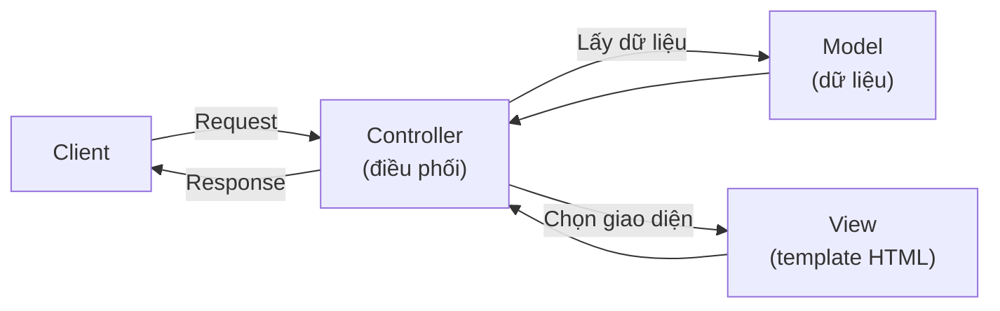

# 5. Play Framework

Play Framework là một framework web full-stack và reactive cho Java và Scala, được thiết kế theo phong cách giống Ruby on Rails hay Django nhằm phát triển nhanh và xử lý lượng truy cập lớn hiệu quả. Bài này giúp bạn hiểu Play là gì, các khái niệm reactive, full-stack, kiến trúc MVC, cách khai báo route và viết Controller, cùng so sánh với Spring Boot để biết khi nào nên dùng.

[](pathname:///img/java/play-framework.webp)

---

:::note[Ghi nhớ nhanh]

- ⭐ **Play là framework full-stack và reactive** — cho Java và Scala, phong cách giống Rails/Django, dựng trên Akka.
- **Reactive (non-blocking)** — không giữ chặt thread khi chờ việc chậm, phục vụ nhiều request với ít tài nguyên.
- **Full-stack** — lo được cả backend lẫn frontend qua template HTML.
- **MVC + route tập trung** — khai báo mọi đường dẫn trong file `conf/routes`; Controller kế thừa lớp `Controller`, dùng `Result`/`ok()`.
- ⭐ **Chọn Play cho app full-stack/reactive lớn**; người mới và đa số dự án vẫn nên dùng Spring Boot. Play dùng build tool `sbt`.

:::

---

## Mục lục

- [Vì sao có Play Framework?](#vì-sao-có-play-framework)
- [Play Framework là gì?](#play-framework-là-gì)
- [Reactive nghĩa là gì?](#reactive-nghĩa-là-gì)
- [Full-stack nghĩa là gì?](#full-stack-nghĩa-là-gì)
- [Kiến trúc MVC](#kiến-trúc-mvc)
- [Play hỗ trợ cả Java và Scala](#play-hỗ-trợ-cả-java-và-scala)
- [Cấu trúc một dự án Play](#cấu-trúc-một-dự-án-play)
- [Định nghĩa route trong Play](#định-nghĩa-route-trong-play)
- [Viết một Controller](#viết-một-controller)
- [So sánh Play với Spring Boot](#so-sánh-play-với-spring-boot)
- [Khi nào nên dùng Play?](#khi-nào-nên-dùng-play)
- [Lỗi thường gặp](#lỗi-thường-gặp)
- [Tóm tắt](#tóm-tắt)
- [Câu hỏi phỏng vấn](#câu-hỏi-phỏng-vấn)

---

## Vì sao có Play Framework?

**Vấn đề:** Các web framework Java/Servlet truyền thống thường chạy theo mô hình **mỗi request một thread** (chặn — blocking): một thread bị giữ chặt từ lúc nhận request đến khi trả response, kể cả trong lúc nó chỉ ngồi chờ database hay API ngoài trả kết quả. Khi có nhiều kết nối I/O đồng thời, số thread phình lên nhanh, tốn rất nhiều tài nguyên (bộ nhớ, CPU chuyển ngữ cảnh). Ngoài ra vòng lặp phát triển chậm: sửa một dòng code thường phải build lại, restart và deploy mới thấy thay đổi.

**Giải pháp:** Play Framework dùng kiến trúc **reactive, không chặn** (non-blocking, dựa trên Akka), **stateless** thân thiện scale ngang, và **hot reload** sửa code thấy ngay không cần restart — hỗ trợ cả Java lẫn Scala:

```java
package controllers;

import play.mvc.Controller;
import play.mvc.Result;
import java.util.concurrent.CompletionStage;
import java.util.concurrent.CompletableFuture;

// Controller reactive: trả về CompletionStage<Result> thay vì Result
// -> thread KHÔNG bị giữ chặt trong lúc chờ việc chậm (gọi DB, API ngoài)
public class HomeController extends Controller {

    public CompletionStage<Result> index() {
        // Việc chậm (vd: gọi API ngoài) chạy bất đồng bộ;
        // thread được trả về để phục vụ request khác trong lúc chờ
        return CompletableFuture
                .supplyAsync(() -> "Xin chào từ Play Framework!")
                .thenApply(noiDung -> ok(noiDung));
    }
}
```

:::tip[Dùng thực tế]

- **Ứng dụng web tải cao, nhiều kết nối đồng thời**: chịu tải tốt với ít thread nhờ mô hình non-blocking.
- **API realtime/streaming** (chat, thông báo trực tiếp, luồng dữ liệu): hợp với nhiều kết nối mở lâu cùng lúc.
- **Phát triển nhanh**: hot reload giúp sửa code thấy ngay, tăng năng suất, không chờ build/restart.
- **Hệ thống cần scale ngang**: thiết kế stateless dễ nhân bản nhiều instance phía sau load balancer.

:::

## Play Framework là gì?

**Play Framework** (gọi tắt là Play) là một framework web **full-stack** (toàn bộ tầng — hỗ trợ cả giao diện lẫn xử lý phía server) và **reactive** (phản ứng — xử lý nhiều việc đồng thời rất hiệu quả) cho Java và Scala.

Play khác biệt so với các framework đã học ở chỗ: nó được thiết kế theo phong cách giống các framework web của ngôn ngữ khác (như Ruby on Rails hay Django của Python), nhấn mạnh việc phát triển nhanh, cấu trúc rõ ràng và hiệu năng cao khi có nhiều người dùng cùng lúc.

## Reactive nghĩa là gì?

**Reactive** (phản ứng) là một kiểu lập trình giúp ứng dụng xử lý nhiều yêu cầu cùng lúc mà không bị "kẹt".

Hãy hình dung một quán cà phê:

- **Cách thường (blocking — chặn)**: một nhân viên pha cà phê cho khách A, đứng chờ máy chạy xong mới quay sang khách B. Trong lúc chờ, nhân viên đứng không, lãng phí.
- **Cách reactive (non-blocking — không chặn)**: nhân viên bấm máy pha cho khách A, rồi quay ngay sang phục vụ khách B trong khi máy đang chạy. Khi cà phê A xong thì quay lại đưa. Một nhân viên phục vụ được nhiều khách hơn.

Lập trình reactive làm điều tương tự: thay vì đứng chờ một việc chậm (như đọc database, gọi API ngoài), chương trình làm việc khác trước, xong việc kia thì quay lại xử lý. Nhờ vậy phục vụ được nhiều người dùng hơn với cùng tài nguyên.

Play được xây trên nền **Akka** (một bộ công cụ xử lý đồng thời rất mạnh), nên hỗ trợ reactive rất tốt — phù hợp cho ứng dụng có lượng truy cập lớn hoặc thời gian thực (real-time) như chat, thông báo trực tiếp.

## Full-stack nghĩa là gì?

**Full-stack** nghĩa là Play lo được cả hai phần:

- **Backend** (phía sau — xử lý logic, dữ liệu): nhận request, xử lý, trả dữ liệu.
- **Frontend** (phía trước — giao diện): Play có thể tạo ra trang HTML hoàn chỉnh để hiển thị cho người dùng, thông qua **template** (khuôn mẫu — file HTML có chèn dữ liệu động).

Trong khi Spring Boot, Quarkus, Javalin thường được dùng chủ yếu để làm API (chỉ trả dữ liệu JSON), thì Play có thể đảm nhận cả việc dựng giao diện trang web hoàn chỉnh.

## Kiến trúc MVC

Play theo **kiến trúc MVC** (Model - View - Controller), một cách tổ chức code rất phổ biến chia ứng dụng thành 3 phần:

- **Model** (mô hình — dữ liệu): đại diện cho dữ liệu và logic nghiệp vụ, ví dụ class `User`, `Product`.
- **View** (khung nhìn — giao diện): phần hiển thị cho người dùng, thường là các template HTML.
- **Controller** (bộ điều khiển): nhận request, lấy dữ liệu từ Model, rồi chọn View để hiển thị (hoặc trả JSON).

Ví von như làm một bộ phim:

- **Model**: kịch bản và diễn viên (nội dung, dữ liệu).
- **View**: cảnh quay người xem thấy trên màn hình (giao diện).
- **Controller**: đạo diễn điều phối mọi thứ (nhận yêu cầu, ghép dữ liệu với giao diện).

Sơ đồ dưới đây minh hoạ cách Controller điều phối giữa Model và View:



## Play hỗ trợ cả Java và Scala

Play là framework đặc biệt vì hỗ trợ tốt cả hai ngôn ngữ:

- **Java**: ngôn ngữ bạn đang học.
- **Scala**: một ngôn ngữ khác chạy trên JVM, mạnh về lập trình hàm (functional).

Bạn có thể viết toàn bộ ứng dụng Play bằng Java mà không cần biết Scala. Tuy nhiên nhiều dự án Play dùng Scala vì Scala và Play hợp nhau về phong cách reactive.

## Cấu trúc một dự án Play

Một dự án Play (dùng Java) thường có cấu trúc thư mục như sau:

```
my-play-app/
├── app/
│   ├── controllers/   -> Chứa các Controller
│   ├── models/        -> Chứa các Model (dữ liệu)
│   └── views/         -> Chứa các template View (giao diện)
├── conf/
│   ├── routes         -> File khai báo tất cả đường dẫn
│   └── application.conf -> File cấu hình chung
└── build.sbt          -> File quản lý thư viện (dùng công cụ sbt)
```

Điểm khác biệt đáng chú ý: Play có một file riêng tên **routes** trong thư mục `conf` để khai báo tất cả đường dẫn ở một chỗ, thay vì rải rác bằng annotation như Spring.

## Định nghĩa route trong Play

File `conf/routes` liệt kê các route theo định dạng: `METHOD  đường-dẫn  hàm-xử-lý`.

```
# File: conf/routes
# Cú pháp: <METHOD>   <đường dẫn>   <controller>.<hàm>

# GET / -> gọi hàm index trong HomeController
GET     /                 controllers.HomeController.index()

# GET /users/5 -> gọi hàm getUser với id = 5
GET     /users/:id        controllers.UserController.getUser(id: Int)
```

Cách khai báo tập trung này giúp bạn nhìn vào một file là thấy toàn bộ đường dẫn của ứng dụng — rất dễ quản lý khi dự án lớn.

## Viết một Controller

Controller trong Play (Java) là một class kế thừa từ lớp `Controller` có sẵn:

```java
package controllers;

import play.mvc.Controller;
import play.mvc.Result;

// Controller xử lý các request liên quan tới trang chủ
public class HomeController extends Controller {

    // Hàm index: xử lý request GET / (đã khai báo trong file routes)
    public Result index() {
        // ok(...) tạo response với status 200 và nội dung kèm theo
        return ok("Xin chào từ Play Framework!");
    }
}
```

Trả về JSON cũng rất gọn:

```java
package controllers;

import com.fasterxml.jackson.databind.JsonNode;
import com.fasterxml.jackson.databind.node.JsonNodeFactory;
import com.fasterxml.jackson.databind.node.ObjectNode;
import play.mvc.Controller;
import play.mvc.Result;

public class UserController extends Controller {

    // Hàm getUser: trả về thông tin người dùng dạng JSON
    public Result getUser(int id) {
        // Tạo một đối tượng JSON: {"id": <id>, "name": "An"}
        ObjectNode json = JsonNodeFactory.instance.objectNode();
        json.put("id", id);
        json.put("name", "An");
        // ok(json) trả response 200 với nội dung JSON
        return ok(json);
    }
}
```

Khái niệm `Result` (kết quả): là đối tượng đại diện cho toàn bộ response trả về. Hàm `ok(...)` tạo `Result` với status 200; tương tự có `notFound()` (404), `badRequest()` (400)...

## So sánh Play với Spring Boot

| Tiêu chí | Play | Spring Boot |
|----------|------|-------------|
| Phong cách | Reactive, giống Rails/Django | Truyền thống, dựa trên annotation |
| Ngôn ngữ | Java và Scala | Chủ yếu Java/Kotlin |
| Khai báo route | Tập trung trong file `routes` | Rải rác qua annotation |
| Full-stack (giao diện) | Mạnh, có template sẵn | Cần thêm thư viện |
| Xử lý lượng truy cập lớn | Rất tốt (reactive) | Tốt (cần cấu hình thêm) |
| Độ phổ biến đi làm | Thấp hơn | Rất cao |
| Cộng đồng / tài liệu | Nhỏ hơn | Rất lớn |

## Khi nào nên dùng Play?

Nên cân nhắc Play khi:

- Bạn xây ứng dụng web **full-stack** cần cả giao diện lẫn API.
- Ứng dụng cần xử lý **lượng truy cập lớn** hoặc tính năng **thời gian thực** (chat, cập nhật trực tiếp).
- Đội ngũ dùng **Scala** hoặc muốn phong cách reactive.

Nên dùng Spring Boot thay vì Play khi:

- Bạn mới học và cần cộng đồng lớn, nhiều tài liệu.
- Dự án backend truyền thống, chủ yếu làm API.
- Công ty đã dùng Spring Boot (đa số trường hợp).

## Lỗi thường gặp

- **Quên khai báo route trong file `routes`**: ở Play, viết Controller thôi chưa đủ; phải khai báo đường dẫn trong `conf/routes` thì route mới hoạt động.
- **Nhầm Play với một thư viện cài qua Maven thông thường**: Play thường dùng công cụ build riêng là **sbt** (Scala Build Tool), khác với Maven/Gradle quen thuộc.
- **Tưởng phải biết Scala mới dùng được Play**: không bắt buộc; bạn có thể viết toàn bộ bằng Java.
- **Lạm dụng reactive khi chưa cần**: reactive mạnh nhưng khó hơn. Với app nhỏ, không nhất thiết phải dùng Play chỉ vì nó reactive.
- **Quên `extends Controller`**: class controller trong Play cần kế thừa lớp `Controller` để dùng các hàm như `ok()`, `notFound()`.

## Tóm tắt

- **Play Framework** là framework web **full-stack** và **reactive** cho cả Java và Scala.
- **Reactive** giúp xử lý nhiều request đồng thời mà không bị "kẹt", phù hợp lượng truy cập lớn và ứng dụng thời gian thực.
- **Full-stack** nghĩa là Play lo được cả backend lẫn frontend (qua template).
- Play theo kiến trúc **MVC** (Model - View - Controller) và khai báo route tập trung trong file `conf/routes`.
- Controller kế thừa lớp `Controller`, dùng `Result` và các hàm như `ok()` để trả response.
- Chọn Play cho ứng dụng full-stack/reactive lớn; với người mới và đa số dự án, Spring Boot vẫn là lựa chọn dễ tiếp cận và phổ biến hơn.

---

## Câu hỏi phỏng vấn

Những câu thường gặp về chủ đề này. Tự trả lời trước, rồi bấm **Xem đáp án** để đối chiếu.

**1. Mô hình "mỗi request một thread" (blocking) của các framework Servlet truyền thống gặp vấn đề gì khi có nhiều kết nối I/O đồng thời (gọi database, gọi API ngoài)?**

<details className="qa">
<summary>Xem đáp án</summary>

Trong mô hình blocking, một **thread bị giữ chặt** từ lúc nhận request đến khi trả response — kể cả trong khoảng thời gian nó **không làm gì** ngoài việc chờ một thao tác I/O chậm (đọc database, gọi API bên ngoài) hoàn tất.

Hệ quả khi lượng kết nối đồng thời lớn:

- Số thread cần thiết tăng theo số request đang xử lý cùng lúc, mà thread là tài nguyên **tốn kém** (mỗi thread hệ điều hành chiếm một lượng bộ nhớ stack riêng, và việc chuyển đổi ngữ cảnh — context switching — giữa nhiều thread cũng tốn CPU).
- Thread pool (nhóm thread có sẵn) có giới hạn kích thước; khi tất cả thread đều đang "ngồi chờ" I/O, các request mới phải xếp hàng dù CPU thực ra đang rảnh — gây nghẽn dù tài nguyên tính toán chưa hết.

</details>

**2. Reactive (non-blocking) giải quyết vấn đề trên như thế nào? Giải thích qua ví dụ đời thường.**

<details className="qa">
<summary>Xem đáp án</summary>

Reactive giải quyết bằng cách: khi một thao tác chậm (I/O) đang chờ kết quả, thread **không đứng im chờ** mà được **trả lại ngay** để phục vụ request khác; khi thao tác chậm hoàn tất, một callback (đoạn code xử lý tiếp theo) được gọi để hoàn thành phần còn lại.

Ví von quán cà phê:

- **Blocking**: nhân viên bấm máy pha cho khách A, đứng chờ máy chạy xong mới quay sang khách B — lãng phí thời gian đứng chờ.
- **Non-blocking**: nhân viên bấm máy pha cho khách A, lập tức quay sang phục vụ khách B trong lúc máy đang chạy; khi cà phê A xong thì quay lại đưa.

Nhờ đó, **một số lượng thread nhỏ có thể phục vụ được rất nhiều kết nối đồng thời**, miễn là phần lớn thời gian xử lý request là chờ I/O chứ không phải tính toán nặng liên tục.

</details>

**3. "Full-stack" trong ngữ cảnh Play Framework nghĩa là gì? Nó khác Spring Boot, Quarkus, Javalin ở điểm nào?**

<details className="qa">
<summary>Xem đáp án</summary>

**Full-stack** nghĩa là Play có thể đảm nhận **cả hai tầng**:

- **Backend**: xử lý logic, dữ liệu, giống mọi framework khác.
- **Frontend**: tự dựng ra **trang HTML hoàn chỉnh** để hiển thị cho người dùng, thông qua **template** (file HTML có chèn dữ liệu động), mà không cần một framework frontend riêng (React, Vue...).

Trong khi đó, Spring Boot, Quarkus, Javalin thường được dùng chủ yếu để làm **API thuần** (chỉ trả JSON), và phần giao diện thường do một ứng dụng frontend riêng biệt đảm nhận. Play phù hợp hơn khi muốn một dự án duy nhất lo cả giao diện lẫn xử lý, theo phong cách gần giống Ruby on Rails hay Django.

</details>

**4. Trong kiến trúc MVC, Model, View và Controller đóng vai trò gì? Cho ví dụ với một ứng dụng quản lý sản phẩm.**

<details className="qa">
<summary>Xem đáp án</summary>

- **Model** (mô hình — dữ liệu): đại diện cho dữ liệu và logic nghiệp vụ. Ví dụ: class `Product` chứa thông tin sản phẩm và các quy tắc liên quan (giá không được âm...).
- **View** (khung nhìn — giao diện): phần hiển thị cho người dùng, ví dụ template HTML hiển thị danh sách sản phẩm dạng bảng.
- **Controller** (bộ điều khiển): nhận request (ví dụ `GET /products`), lấy dữ liệu `Product` từ Model, rồi chọn View phù hợp để render, hoặc trả JSON nếu là API.

Ví von: Model là kịch bản/diễn viên, View là cảnh quay người xem thấy, Controller là đạo diễn điều phối — nhận yêu cầu và ghép dữ liệu với giao diện phù hợp.

</details>

**5. Giải thích sự khác nhau giữa hai chữ ký hàm Controller sau trong Play. Vì sao dùng `CompletionStage<Result>` lại có lợi cho hiệu năng?**

```java
public Result index() { ... }
public CompletionStage<Result> index() { ... }
```

<details className="qa">
<summary>Xem đáp án</summary>

- **`Result index()`**: hàm xử lý **đồng bộ (synchronous)** — thread đang xử lý request này sẽ **bị giữ lại** cho tới khi toàn bộ logic bên trong (kể cả các thao tác I/O chậm) hoàn tất và trả về `Result`.
- **`CompletionStage<Result> index()`**: hàm xử lý **bất đồng bộ (asynchronous)** — trả về ngay một "lời hứa" (promise) sẽ có `Result` trong tương lai. Trong lúc thao tác chậm (ví dụ gọi API ngoài qua `CompletableFuture.supplyAsync(...)`) đang chạy, **thread hiện tại được giải phóng** để phục vụ request khác; khi thao tác chậm xong, Play tự động gọi tiếp phần `.thenApply(...)` để hoàn thiện response.

Lợi ích: với ứng dụng có nhiều request đồng thời mà phần lớn thời gian xử lý là chờ I/O, dùng `CompletionStage<Result>` giúp một số lượng thread nhỏ phục vụ được nhiều request hơn hẳn so với cách đồng bộ, tận dụng đúng tinh thần reactive của Play.

</details>

**6. Viết khai báo route trong file `conf/routes` cho một endpoint `POST /users` gọi hàm `createUser` trong `UserController`, nhận vào tên người dùng là tham số kiểu chuỗi từ query string.**

<details className="qa">
<summary>Xem đáp án</summary>

```
# File: conf/routes
POST    /users    controllers.UserController.createUser(name: String)
```

Trong đó `name: String` khai báo Play sẽ tự lấy tham số `name` từ query string (`/users?name=An`) và truyền vào hàm `createUser(String name)` trong `UserController`. Cú pháp chung của file `routes` là `<METHOD>  <đường-dẫn>  <controller>.<hàm>(<tham-số>)`, khai báo tập trung toàn bộ route của ứng dụng ở một file duy nhất thay vì rải rác qua annotation trong nhiều class như Spring Boot.

</details>

**7. So sánh Play Framework và Spring Boot theo các tiêu chí: mô hình xử lý request, cách khai báo route, khả năng làm full-stack, độ phổ biến khi đi làm.**

<details className="qa">
<summary>Xem đáp án</summary>

| Tiêu chí | Play | Spring Boot |
|---|---|---|
| Mô hình xử lý | Reactive, non-blocking (dựa trên Akka) | Truyền thống, blocking theo mặc định (có hỗ trợ reactive qua WebFlux) |
| Khai báo route | Tập trung trong một file `conf/routes` | Rải rác qua annotation trên từng Controller |
| Full-stack (giao diện) | Mạnh, có template HTML tích hợp sẵn | Cần thêm thư viện (Thymeleaf...) hoặc tách frontend riêng |
| Độ phổ biến đi làm | Thấp hơn, ít vị trí tuyển dụng | Rất cao, gần như mặc định ở Java backend |
| Cộng đồng/tài liệu | Nhỏ hơn | Rất lớn, dễ tìm hướng dẫn |

Kết luận thực tế: Play là lựa chọn tốt cho use case cụ thể (full-stack, reactive, lượng truy cập lớn), nhưng vì độ phổ biến thấp hơn, phần lớn lộ trình học Java backend vẫn nên ưu tiên Spring Boot trước.

</details>

**8. Bạn viết xong một `UserController` trong Play với hàm `getUser(id: Int)`, chạy ứng dụng và gọi `GET /users/5` nhưng nhận về lỗi 404 Not Found dù Controller hoàn toàn không có lỗi cú pháp. Nguyên nhân có khả năng cao nhất là gì?**

<details className="qa">
<summary>Xem đáp án</summary>

Nguyên nhân phổ biến nhất: **quên khai báo route tương ứng trong file `conf/routes`**. Khác với Spring Boot (route được khai báo ngay trong Controller qua annotation như `@GetMapping`), Play tách biệt hoàn toàn việc **viết logic xử lý** (trong Controller) và **khai báo đường dẫn** (trong file `routes`) — viết Controller đúng nhưng chưa thêm dòng route thì Play không biết đường dẫn `/users/5` phải gọi tới hàm nào, nên trả về `404`.

Cách khắc phục: thêm dòng khai báo tương ứng, ví dụ:

```
GET     /users/:id        controllers.UserController.getUser(id: Int)
```

</details>

**9. Java 21 (LTS) đã chính thức đưa vào `virtual thread` (luồng ảo — một cơ chế giúp mô hình "mỗi request một thread" truyền thống trở nên rẻ và mở rộng tốt hơn nhiều). Điều này có làm cho lợi thế reactive của Play trở nên kém quan trọng hơn không? Hãy phân tích.**

<details className="qa">
<summary>Xem đáp án</summary>

Đây là một câu hỏi mở mang tính phân tích, thường gặp trong phỏng vấn senior:

- **Virtual thread** (từ Java 21) cho phép tạo ra **hàng trăm nghìn thread "ảo"** với chi phí bộ nhớ cực thấp, được quản lý bởi JVM thay vì ánh xạ trực tiếp 1-1 với thread hệ điều hành. Nhờ vậy, code viết theo phong cách blocking truyền thống (dễ đọc, dễ debug hơn code reactive) vẫn có thể chịu tải lớn mà không cần đổi sang mô hình reactive phức tạp.
- Điều này khiến áp lực phải "viết reactive" chỉ để đạt hiệu năng cao ở tầng I/O đã **giảm đáng kể** — nhiều framework mới (và cả Spring, qua module hỗ trợ virtual thread) đang tận dụng virtual thread để đạt hiệu năng tương đương reactive mà giữ code đơn giản hơn.
- Tuy nhiên, reactive vẫn có giá trị riêng ở các khía cạnh mà virtual thread không thay thế hoàn toàn: kiểm soát luồng dữ liệu chi tiết (backpressure — cơ chế điều tiết khi bên nhận xử lý chậm hơn bên gửi), xử lý luồng sự kiện phức tạp (streaming, kết hợp nhiều nguồn bất đồng bộ), vốn là thế mạnh của các thư viện reactive (Akka Streams mà Play dùng, Project Reactor...).
- Kết luận hợp lý: virtual thread làm giảm bớt lý do "phải" chọn framework reactive chỉ vì lo hiệu năng I/O, nhưng không xóa bỏ hoàn toàn use case của reactive programming — lựa chọn vẫn nên dựa trên đặc thù bài toán (cần backpressure/streaming phức tạp hay không) chứ không chỉ đơn thuần vì lý do hiệu năng thread.

</details>
