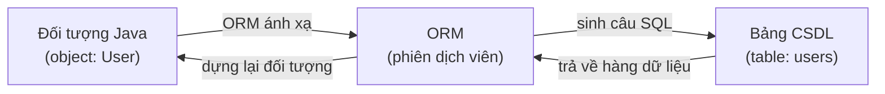
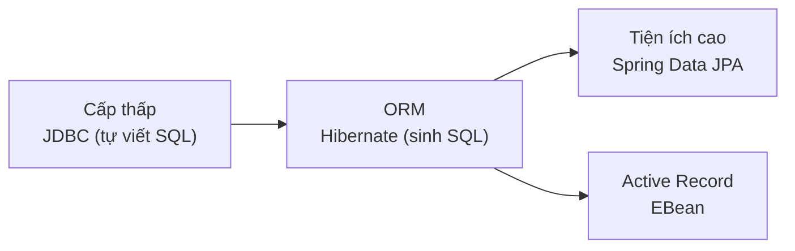

# 1. Tổng quan truy cập Cơ sở dữ liệu

Truy cập cơ sở dữ liệu là cách để chương trình Java lưu dữ liệu lâu dài, không bị mất khi tắt máy. Bài này giải thích vì sao cần cơ sở dữ liệu, SQL và ORM là gì, đồng thời giới thiệu tổng quan bốn công cụ phổ biến trong Java (JDBC, Hibernate, Spring Data JPA, EBean) để bạn biết nên học cái nào trước. Đây là bài mở đầu; chi tiết từng công cụ nằm ở các bài sau.

---

:::note[Ghi nhớ nhanh]

- ⭐ **Muốn dữ liệu bền vững phải lưu vào CSDL** — dữ liệu trong biến/bộ nhớ mất khi tắt chương trình.
- **CSDL quan hệ lưu theo bảng** — hàng = bản ghi, cột = thuộc tính, `id` là khóa chính; thao tác bằng SQL (CRUD).
- **ORM** — tự động ánh xạ đối tượng Java ⟷ bảng CSDL, giúp viết ít SQL hơn.
- **Bốn công cụ** — `JDBC` (cấp thấp), `Hibernate` (ORM), `Spring Data JPA` (phổ biến nhất), `EBean` (Active Record).
- ⭐ **Quy tắc bảo mật vàng** — LUÔN tham số hóa truy vấn, KHÔNG BAO GIỜ nối chuỗi SQL (chống SQL injection).

:::

---

## Mục lục

- [Vì sao cần lưu dữ liệu?](#vì-sao-cần-lưu-dữ-liệu)
- [Cơ sở dữ liệu là gì?](#cơ-sở-dữ-liệu-là-gì)
- [SQL là gì? (rất ngắn)](#sql-là-gì-rất-ngắn)
- [ORM là gì?](#orm-là-gì)
- [So sánh các công cụ truy cập CSDL trong Java](#so-sánh-các-công-cụ-truy-cập-csdl-trong-java)
- [Lỗi thường gặp](#lỗi-thường-gặp)
- [Tóm tắt](#tóm-tắt)

---

## Vì sao cần lưu dữ liệu?

Hãy tưởng tượng bạn viết một ứng dụng quản lý danh sách bạn bè. Bạn lưu tên,
số điện thoại của họ vào một biến trong chương trình. Mọi thứ chạy ngon lành...
cho đến khi bạn **tắt chương trình**. Lúc đó toàn bộ dữ liệu trong bộ nhớ
(memory — nơi lưu tạm thời khi chương trình đang chạy) sẽ **biến mất hoàn toàn**.

Đây gọi là dữ liệu **không bền vững** (volatile — dễ bay hơi). Giống như viết
chữ lên cát ở bãi biển: sóng đánh vào là mất sạch.

Để dữ liệu **tồn tại lâu dài** (persistent — bền vững), kể cả khi tắt máy hay
khởi động lại chương trình, chúng ta cần lưu nó vào nơi ổn định như **ổ cứng**.
Và công cụ chuyên dùng để lưu trữ, tổ chức, tìm kiếm dữ liệu một cách hiệu quả
chính là **cơ sở dữ liệu** (database — viết tắt là CSDL hoặc DB).

> Ví dụ đời thường: CSDL giống như một **tủ hồ sơ khổng lồ** trong văn phòng.
> Mỗi ngăn kéo là một loại dữ liệu (khách hàng, đơn hàng...), mỗi tờ hồ sơ là
> một bản ghi. Bạn có thể tìm, thêm, sửa, xóa hồ sơ bất cứ lúc nào.

---

## Cơ sở dữ liệu là gì?

Loại CSDL phổ biến nhất là **CSDL quan hệ** (relational database — lưu dữ liệu
theo dạng bảng có quan hệ với nhau). Ví dụ một số phần mềm CSDL quan hệ:

- **MySQL** — miễn phí, phổ biến nhất cho web.
- **PostgreSQL** — miễn phí, mạnh mẽ, nhiều tính năng.
- **Oracle**, **SQL Server** — thương mại, dùng trong doanh nghiệp lớn.
- **H2**, **SQLite** — nhỏ gọn, hay dùng để học và test.

Dữ liệu được lưu trong các **bảng** (table). Mỗi bảng giống một bảng tính Excel:

| id | name      | email             |
|----|-----------|-------------------|
| 1  | Nguyen An | an@example.com    |
| 2  | Tran Binh | binh@example.com  |

- Mỗi **hàng** (row) là một bản ghi (record) — ví dụ một người dùng.
- Mỗi **cột** (column) là một thuộc tính — ví dụ `name`, `email`.
- Cột `id` thường là **khóa chính** (primary key — giá trị duy nhất để phân biệt
  từng hàng, không trùng nhau).

---

## SQL là gì? (rất ngắn)

**SQL** (Structured Query Language — ngôn ngữ truy vấn có cấu trúc) là ngôn ngữ
dùng để "nói chuyện" với CSDL quan hệ. Bạn dùng SQL để ra lệnh: lấy dữ liệu,
thêm, sửa, xóa.

```sql
-- Lấy tất cả người dùng có tên là 'Nguyen An'
SELECT * FROM users WHERE name = 'Nguyen An';

-- Thêm một người dùng mới
INSERT INTO users (name, email) VALUES ('Le Cuong', 'cuong@example.com');

-- Cập nhật email của người dùng có id = 1
UPDATE users SET email = 'new@example.com' WHERE id = 1;

-- Xóa người dùng có id = 2
DELETE FROM users WHERE id = 2;
```

Bốn thao tác cơ bản trên gọi tắt là **CRUD**: Create (tạo), Read (đọc),
Update (sửa), Delete (xóa). Bạn sẽ gặp từ "CRUD" rất nhiều khi làm việc với CSDL.

---

## ORM là gì?

Trong Java, mọi thứ là **đối tượng** (object). Ví dụ bạn có một class `User`:

```java
// Lớp User trong Java — một "đối tượng" trong code
public class User {
    private Long id;        // tương ứng cột id trong bảng
    private String name;    // tương ứng cột name
    private String email;   // tương ứng cột email
    // ... getter/setter
}
```

Nhưng CSDL lại lưu dữ liệu dưới dạng **bảng và hàng**, không hiểu "đối tượng"
là gì. Vậy làm sao để chuyển qua chuyển lại giữa hai thế giới này?

**ORM** (Object-Relational Mapping — ánh xạ đối tượng - quan hệ) là kỹ thuật/công
cụ giúp **tự động** chuyển đổi:

- Một **đối tượng Java** ⟷ một **hàng trong bảng CSDL**.
- Một **class Java** ⟷ một **bảng CSDL**.
- Một **thuộc tính** (field) ⟷ một **cột**.

> Ví dụ đời thường: ORM giống như một **phiên dịch viên**. Bạn nói tiếng Java
> ("lưu đối tượng user này"), phiên dịch viên tự dịch sang tiếng SQL
> ("INSERT INTO users..."), rồi gửi cho CSDL. Bạn không cần biết tiếng SQL.

Lợi ích của ORM: viết ít SQL tay hơn, code gọn gàng, ít lỗi vặt. Nhược điểm:
khó kiểm soát truy vấn phức tạp, đôi khi chậm hơn nếu dùng sai cách.

Sơ đồ dưới minh hoạ vai trò "phiên dịch" của ORM giữa thế giới đối tượng Java
và thế giới bảng của CSDL:



---

## So sánh các công cụ truy cập CSDL trong Java

Có nhiều cách để Java nói chuyện với CSDL. Dưới đây là 4 lựa chọn phổ biến, đi
từ "cấp thấp, tự làm hết" đến "cấp cao, làm hộ nhiều":

| Công cụ | Loại | Mức độ tự động | Khi nào dùng |
|---------|------|----------------|--------------|
| **JDBC** | API cấp thấp | Thấp — bạn viết SQL tay | Học nền tảng, cần kiểm soát tối đa |
| **Hibernate** | ORM đầy đủ | Cao — sinh SQL tự động | Dự án lớn, ít muốn viết SQL |
| **Spring Data JPA** | ORM + tiện ích | Rất cao — sinh cả repository | Dùng Spring Boot (phổ biến nhất) |
| **EBean** | ORM kiểu Active Record | Cao — gọi `.save()` trực tiếp | Thích cú pháp gọn, đơn giản |

Diễn giải dễ hiểu:

- **JDBC** (Java Database Connectivity): nền tảng gốc, bạn tự viết câu SQL và tự
  xử lý kết quả. Giống như **tự nấu ăn từ nguyên liệu thô** — mệt nhưng hiểu rõ.
- **Hibernate**: ORM nổi tiếng nhất, tự sinh SQL từ đối tượng. Giống như có một
  **đầu bếp riêng**, bạn chỉ cần đặt món.
- **Spring Data JPA**: dựa trên chuẩn JPA + Hibernate, tự tạo luôn cả "kho truy
  cập dữ liệu" (repository). Bạn chỉ khai báo, không cần viết code. Giống như
  **nhà hàng buffet** — chỉ cần lấy món có sẵn.
- **EBean**: ORM theo phong cách Active Record (đối tượng tự biết cách lưu chính
  nó, ví dụ `user.save()`). Gọn gàng, dễ đọc.

> Lời khuyên cho người mới: học **JDBC trước** để hiểu nền tảng, rồi chuyển sang
> **Spring Data JPA** vì đây là thứ bạn sẽ dùng nhiều nhất trong thực tế.

Sơ đồ dưới xếp các công cụ theo mức độ trừu tượng, từ cấp thấp (tự làm nhiều)
đến cấp cao (framework làm hộ nhiều):



Dù dùng công cụ nào, có một quy tắc **bất di bất dịch**:

> **LUÔN tham số hóa truy vấn (parameterized query), KHÔNG BAO GIỜ nối chuỗi SQL
> với dữ liệu người dùng.** Đây là cách chống lỗ hổng bảo mật SQL injection.
> Chúng ta sẽ nói kỹ ở bài JDBC.

---

## Lỗi thường gặp

- **Nhầm lẫn "lưu vào biến" với "lưu vào CSDL"**: dữ liệu trong biến mất khi tắt
  chương trình; chỉ dữ liệu trong CSDL mới bền vững.
- **Nghĩ ORM thay thế hoàn toàn SQL**: bạn vẫn nên hiểu SQL để debug và viết truy
  vấn phức tạp. ORM chỉ giúp đỡ, không xóa bỏ SQL.
- **Chọn công cụ quá phức tạp cho dự án nhỏ**: với một bài tập nhỏ, JDBC thuần là
  đủ; không cần dựng cả Hibernate.
- **Bỏ qua bảo mật ngay từ đầu**: nhiều người mới nối chuỗi SQL cho "tiện", tạo
  ra lỗ hổng nghiêm trọng. Hãy tập tham số hóa ngay từ ngày đầu.

---

## Tóm tắt

- Dữ liệu trong bộ nhớ là tạm thời; muốn **bền vững** phải lưu vào **CSDL**.
- **CSDL quan hệ** lưu dữ liệu theo **bảng** (hàng = bản ghi, cột = thuộc tính).
- **SQL** là ngôn ngữ để thao tác dữ liệu: CRUD (Create, Read, Update, Delete).
- **ORM** tự động ánh xạ đối tượng Java ⟷ bảng CSDL, giúp viết ít SQL hơn.
- 4 công cụ phổ biến: **JDBC** (cấp thấp), **Hibernate** (ORM), **Spring Data
  JPA** (phổ biến nhất với Spring Boot), **EBean** (Active Record).
- Quy tắc bảo mật vàng: **luôn tham số hóa truy vấn**, không nối chuỗi SQL.
