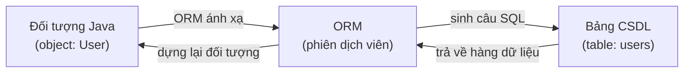
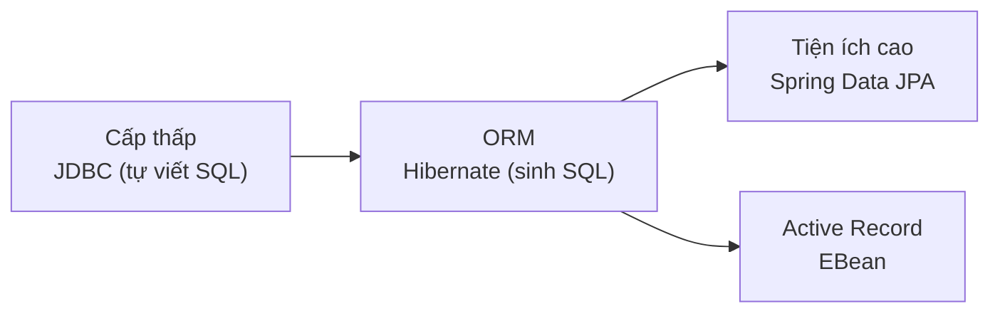

# 1. Tổng quan truy cập Cơ sở dữ liệu

Truy cập cơ sở dữ liệu là cách để chương trình Java lưu dữ liệu lâu dài, không bị mất khi tắt máy. Bài này giải thích vì sao cần cơ sở dữ liệu, SQL và ORM là gì, đồng thời giới thiệu tổng quan bốn công cụ phổ biến trong Java (JDBC, Hibernate, Spring Data JPA, EBean) để bạn biết nên học cái nào trước. Đây là bài mở đầu; chi tiết từng công cụ nằm ở các bài sau.

[](pathname:///img/java/tong-quan-database.webp)

---

:::note[Ghi nhớ nhanh]

- ⭐ **Muốn dữ liệu bền vững phải lưu vào CSDL** — dữ liệu trong biến/bộ nhớ mất khi tắt chương trình.
- **CSDL quan hệ lưu theo bảng** — hàng = bản ghi, cột = thuộc tính, `id` là khóa chính; thao tác bằng SQL (CRUD).
- **ORM** — tự động ánh xạ đối tượng Java ⟷ bảng CSDL, giúp viết ít SQL hơn.
- **Bốn công cụ** — `JDBC` (cấp thấp), `Hibernate` (ORM), `Spring Data JPA` (phổ biến nhất), `EBean` (Active Record).
- ⭐ **Quy tắc bảo mật vàng** — LUÔN tham số hóa truy vấn, KHÔNG BAO GIỜ nối chuỗi SQL (chống SQL injection).

:::

---

## Mục lục

- [Vì sao cần lưu dữ liệu?](#vì-sao-cần-lưu-dữ-liệu)
- [Cơ sở dữ liệu là gì?](#cơ-sở-dữ-liệu-là-gì)
- [SQL là gì? (rất ngắn)](#sql-là-gì-rất-ngắn)
- [ORM là gì?](#orm-là-gì)
- [So sánh các công cụ truy cập CSDL trong Java](#so-sánh-các-công-cụ-truy-cập-csdl-trong-java)
- [Lỗi thường gặp](#lỗi-thường-gặp)
- [Tóm tắt](#tóm-tắt)
- [Câu hỏi phỏng vấn](#câu-hỏi-phỏng-vấn)

---

## Vì sao cần lưu dữ liệu?

Hãy tưởng tượng bạn viết một ứng dụng quản lý danh sách bạn bè. Bạn lưu tên, số điện thoại của họ vào một biến trong chương trình. Mọi thứ chạy ngon lành... cho đến khi bạn **tắt chương trình**. Lúc đó toàn bộ dữ liệu trong bộ nhớ (memory — nơi lưu tạm thời khi chương trình đang chạy) sẽ **biến mất hoàn toàn**.

Đây gọi là dữ liệu **không bền vững** (volatile — dễ bay hơi). Giống như viết chữ lên cát ở bãi biển: sóng đánh vào là mất sạch.

Để dữ liệu **tồn tại lâu dài** (persistent — bền vững), kể cả khi tắt máy hay khởi động lại chương trình, chúng ta cần lưu nó vào nơi ổn định như **ổ cứng**. Và công cụ chuyên dùng để lưu trữ, tổ chức, tìm kiếm dữ liệu một cách hiệu quả chính là **cơ sở dữ liệu** (database — viết tắt là CSDL hoặc DB).

> Ví dụ đời thường: CSDL giống như một **tủ hồ sơ khổng lồ** trong văn phòng. Mỗi ngăn kéo là một loại dữ liệu (khách hàng, đơn hàng...), mỗi tờ hồ sơ là một bản ghi. Bạn có thể tìm, thêm, sửa, xóa hồ sơ bất cứ lúc nào.

---

## Cơ sở dữ liệu là gì?

Loại CSDL phổ biến nhất là **CSDL quan hệ** (relational database — lưu dữ liệu theo dạng bảng có quan hệ với nhau). Ví dụ một số phần mềm CSDL quan hệ:

- **MySQL** — miễn phí, phổ biến nhất cho web.
- **PostgreSQL** — miễn phí, mạnh mẽ, nhiều tính năng.
- **Oracle**, **SQL Server** — thương mại, dùng trong doanh nghiệp lớn.
- **H2**, **SQLite** — nhỏ gọn, hay dùng để học và test.

Dữ liệu được lưu trong các **bảng** (table). Mỗi bảng giống một bảng tính Excel:

| id | name      | email             |
|----|-----------|-------------------|
| 1  | Nguyen An | an@example.com    |
| 2  | Tran Binh | binh@example.com  |

- Mỗi **hàng** (row) là một bản ghi (record) — ví dụ một người dùng.
- Mỗi **cột** (column) là một thuộc tính — ví dụ `name`, `email`.
- Cột `id` thường là **khóa chính** (primary key — giá trị duy nhất để phân biệt từng hàng, không trùng nhau).

---

## SQL là gì? (rất ngắn)

**SQL** (Structured Query Language — ngôn ngữ truy vấn có cấu trúc) là ngôn ngữ dùng để "nói chuyện" với CSDL quan hệ. Bạn dùng SQL để ra lệnh: lấy dữ liệu, thêm, sửa, xóa.

```sql
-- Lấy tất cả người dùng có tên là 'Nguyen An'
SELECT * FROM users WHERE name = 'Nguyen An';

-- Thêm một người dùng mới
INSERT INTO users (name, email) VALUES ('Le Cuong', 'cuong@example.com');

-- Cập nhật email của người dùng có id = 1
UPDATE users SET email = 'new@example.com' WHERE id = 1;

-- Xóa người dùng có id = 2
DELETE FROM users WHERE id = 2;
```

Bốn thao tác cơ bản trên gọi tắt là **CRUD**: Create (tạo), Read (đọc), Update (sửa), Delete (xóa). Bạn sẽ gặp từ "CRUD" rất nhiều khi làm việc với CSDL.

---

## ORM là gì?

Trong Java, mọi thứ là **đối tượng** (object). Ví dụ bạn có một class `User`:

```java
// Lớp User trong Java — một "đối tượng" trong code
public class User {
    private Long id;        // tương ứng cột id trong bảng
    private String name;    // tương ứng cột name
    private String email;   // tương ứng cột email
    // ... getter/setter
}
```

Nhưng CSDL lại lưu dữ liệu dưới dạng **bảng và hàng**, không hiểu "đối tượng" là gì. Vậy làm sao để chuyển qua chuyển lại giữa hai thế giới này?

**ORM** (Object-Relational Mapping — ánh xạ đối tượng - quan hệ) là kỹ thuật/công cụ giúp **tự động** chuyển đổi:

- Một **đối tượng Java** ⟷ một **hàng trong bảng CSDL**.
- Một **class Java** ⟷ một **bảng CSDL**.
- Một **thuộc tính** (field) ⟷ một **cột**.

> Ví dụ đời thường: ORM giống như một **phiên dịch viên**. Bạn nói tiếng Java ("lưu đối tượng user này"), phiên dịch viên tự dịch sang tiếng SQL ("INSERT INTO users..."), rồi gửi cho CSDL. Bạn không cần biết tiếng SQL.

Lợi ích của ORM: viết ít SQL tay hơn, code gọn gàng, ít lỗi vặt. Nhược điểm: khó kiểm soát truy vấn phức tạp, đôi khi chậm hơn nếu dùng sai cách.

Sơ đồ dưới minh hoạ vai trò "phiên dịch" của ORM giữa thế giới đối tượng Java và thế giới bảng của CSDL:


```mermaid
flowchart LR
    A["Đối tượng Java<br/>(object: User)"] -->|"ORM ánh xạ"| B["ORM<br/>(phiên dịch viên)"]
    B -->|"sinh câu SQL"| C["Bảng CSDL<br/>(table: users)"]
    C -->|"trả về hàng dữ liệu"| B
    B -->|"dựng lại đối tượng"| A
```

---

## So sánh các công cụ truy cập CSDL trong Java

Có nhiều cách để Java nói chuyện với CSDL. Dưới đây là 4 lựa chọn phổ biến, đi từ "cấp thấp, tự làm hết" đến "cấp cao, làm hộ nhiều":

| Công cụ | Loại | Mức độ tự động | Khi nào dùng |
|---------|------|----------------|--------------|
| **JDBC** | API cấp thấp | Thấp — bạn viết SQL tay | Học nền tảng, cần kiểm soát tối đa |
| **Hibernate** | ORM đầy đủ | Cao — sinh SQL tự động | Dự án lớn, ít muốn viết SQL |
| **Spring Data JPA** | ORM + tiện ích | Rất cao — sinh cả repository | Dùng Spring Boot (phổ biến nhất) |
| **EBean** | ORM kiểu Active Record | Cao — gọi `.save()` trực tiếp | Thích cú pháp gọn, đơn giản |

Diễn giải dễ hiểu:

- **JDBC** (Java Database Connectivity): nền tảng gốc, bạn tự viết câu SQL và tự xử lý kết quả. Giống như **tự nấu ăn từ nguyên liệu thô** — mệt nhưng hiểu rõ.
- **Hibernate**: ORM nổi tiếng nhất, tự sinh SQL từ đối tượng. Giống như có một **đầu bếp riêng**, bạn chỉ cần đặt món.
- **Spring Data JPA**: dựa trên chuẩn JPA + Hibernate, tự tạo luôn cả "kho truy cập dữ liệu" (repository). Bạn chỉ khai báo, không cần viết code. Giống như **nhà hàng buffet** — chỉ cần lấy món có sẵn.
- **EBean**: ORM theo phong cách Active Record (đối tượng tự biết cách lưu chính nó, ví dụ `user.save()`). Gọn gàng, dễ đọc.

> Lời khuyên cho người mới: học **JDBC trước** để hiểu nền tảng, rồi chuyển sang **Spring Data JPA** vì đây là thứ bạn sẽ dùng nhiều nhất trong thực tế.

Sơ đồ dưới xếp các công cụ theo mức độ trừu tượng, từ cấp thấp (tự làm nhiều) đến cấp cao (framework làm hộ nhiều):


```mermaid
flowchart LR
    A["Cấp thấp<br/>JDBC (tự viết SQL)"] --> B["ORM<br/>Hibernate (sinh SQL)"]
    B --> C["Tiện ích cao<br/>Spring Data JPA"]
    B --> D["Active Record<br/>EBean"]
```

Dù dùng công cụ nào, có một quy tắc **bất di bất dịch**:

> **LUÔN tham số hóa truy vấn (parameterized query), KHÔNG BAO GIỜ nối chuỗi SQL với dữ liệu người dùng.** Đây là cách chống lỗ hổng bảo mật SQL injection. Chúng ta sẽ nói kỹ ở bài JDBC.

---

## Lỗi thường gặp

- **Nhầm lẫn "lưu vào biến" với "lưu vào CSDL"**: dữ liệu trong biến mất khi tắt chương trình; chỉ dữ liệu trong CSDL mới bền vững.
- **Nghĩ ORM thay thế hoàn toàn SQL**: bạn vẫn nên hiểu SQL để debug và viết truy vấn phức tạp. ORM chỉ giúp đỡ, không xóa bỏ SQL.
- **Chọn công cụ quá phức tạp cho dự án nhỏ**: với một bài tập nhỏ, JDBC thuần là đủ; không cần dựng cả Hibernate.
- **Bỏ qua bảo mật ngay từ đầu**: nhiều người mới nối chuỗi SQL cho "tiện", tạo ra lỗ hổng nghiêm trọng. Hãy tập tham số hóa ngay từ ngày đầu.

---

## Tóm tắt

- Dữ liệu trong bộ nhớ là tạm thời; muốn **bền vững** phải lưu vào **CSDL**.
- **CSDL quan hệ** lưu dữ liệu theo **bảng** (hàng = bản ghi, cột = thuộc tính).
- **SQL** là ngôn ngữ để thao tác dữ liệu: CRUD (Create, Read, Update, Delete).
- **ORM** tự động ánh xạ đối tượng Java ⟷ bảng CSDL, giúp viết ít SQL hơn.
- 4 công cụ phổ biến: **JDBC** (cấp thấp), **Hibernate** (ORM), **Spring Data JPA** (phổ biến nhất với Spring Boot), **EBean** (Active Record).
- Quy tắc bảo mật vàng: **luôn tham số hóa truy vấn**, không nối chuỗi SQL.

---

## Câu hỏi phỏng vấn

Những câu thường gặp về chủ đề này. Tự trả lời trước, rồi bấm **Xem đáp án** để đối chiếu.

**1. Vì sao dữ liệu lưu trong một biến (variable) của chương trình Java bị mất khi tắt chương trình, trong khi dữ liệu lưu trong CSDL thì không?**

<details className="qa">
<summary>Xem đáp án</summary>

Biến trong chương trình được lưu trong **bộ nhớ RAM (memory)** — nơi lưu trữ tạm thời, chỉ tồn tại trong lúc chương trình đang chạy trên JVM. Khi tắt chương trình (hoặc tắt máy), JVM kết thúc, toàn bộ vùng nhớ đó bị hệ điều hành thu hồi và **xóa sạch** — đây gọi là dữ liệu **volatile** (dễ bay hơi, không bền vững).

Ngược lại, CSDL ghi dữ liệu xuống **ổ đĩa (disk)** — thiết bị lưu trữ vật lý vẫn giữ nguyên dữ liệu kể cả khi mất điện hay khởi động lại máy. Đây là dữ liệu **persistent** (bền vững). Vì vậy, bất kỳ dữ liệu nào cần tồn tại lâu dài qua nhiều lần chạy chương trình đều phải được ghi vào CSDL (hoặc file), không thể chỉ giữ trong biến.

</details>

**2. Đoạn code sau có lỗ hổng bảo mật gì? Hãy giải thích và sửa lại.**

```java
String name = request.getParameter("name"); // dữ liệu người dùng nhập vào
String sql = "SELECT * FROM users WHERE name = '" + name + "'";
```

<details className="qa">
<summary>Xem đáp án</summary>

Đây là lỗ hổng **SQL injection** (tiêm SQL) — một trong những lỗ hổng bảo mật nghiêm trọng và phổ biến nhất. Vì `name` được **nối chuỗi trực tiếp** vào câu SQL, kẻ tấn công có thể nhập một giá trị đặc biệt để thay đổi ý nghĩa câu truy vấn, ví dụ nhập `name = "' OR '1'='1"` khiến câu SQL thực tế trở thành:

```sql
SELECT * FROM users WHERE name = '' OR '1'='1'
```

Điều kiện `'1'='1'` luôn đúng, nên câu lệnh trả về **toàn bộ** người dùng trong bảng thay vì chỉ người có tên khớp — kẻ tấn công có thể dùng kỹ thuật tương tự để đọc trộm hoặc phá hoại dữ liệu.

Cách sửa: dùng **tham số hóa truy vấn (parameterized query)** thay vì nối chuỗi:

```java
String sql = "SELECT * FROM users WHERE name = ?";
PreparedStatement stmt = connection.prepareStatement(sql);
stmt.setString(1, name); // giá trị được truyền riêng, không thể phá vỡ cấu trúc câu SQL
```

</details>

**3. ORM là gì? Nêu ít nhất một lợi ích và một nhược điểm của việc dùng ORM thay vì viết SQL tay hoàn toàn.**

<details className="qa">
<summary>Xem đáp án</summary>

**ORM** (Object-Relational Mapping — ánh xạ đối tượng-quan hệ) là kỹ thuật/công cụ tự động chuyển đổi qua lại giữa **đối tượng Java** (class, field) và **dữ liệu quan hệ** (bảng, cột, hàng), giúp lập trình viên thao tác với dữ liệu thông qua object thay vì viết SQL thủ công.

- **Lợi ích**: viết ít SQL tay hơn, code gọn gàng và tập trung vào logic nghiệp vụ hơn là cú pháp SQL; giảm lỗi vặt khi ánh xạ thủ công giữa `ResultSet` và object.
- **Nhược điểm**: với các truy vấn phức tạp (join nhiều bảng, thống kê nặng), ORM có thể sinh ra câu SQL **kém tối ưu** hơn so với SQL viết tay; nếu dùng sai cách (ví dụ không hiểu cơ chế lazy loading) có thể gây ra vấn đề hiệu năng khó phát hiện.

</details>

**4. So sánh JDBC, Hibernate, Spring Data JPA và EBean theo mức độ tự động hóa và trường hợp nên dùng.**

<details className="qa">
<summary>Xem đáp án</summary>

| Công cụ | Mức độ tự động | Trường hợp nên dùng |
|---|---|---|
| `JDBC` | Thấp nhất — tự viết SQL, tự map kết quả | Học nền tảng, hoặc cần kiểm soát tối đa câu truy vấn |
| `Hibernate` | Cao — tự sinh SQL từ đối tượng (ORM đầy đủ) | Dự án cần ORM mạnh nhưng không nhất thiết dùng Spring |
| `Spring Data JPA` | Rất cao — tự sinh cả tầng repository | Dự án Spring Boot (phổ biến nhất trong thực tế) |
| `EBean` | Cao, theo phong cách Active Record (`user.save()`) | Thích cú pháp gọn, object tự biết cách lưu chính nó |

Xu hướng chung: càng lên cao trong bảng, bạn viết càng ít code nhưng càng ít kiểm soát chi tiết câu SQL sinh ra — cần đánh đổi giữa tốc độ phát triển và khả năng tối ưu truy vấn thủ công khi cần.

</details>

**5. Tại sao `id` của một bảng thường được thiết kế là khóa chính (primary key)? Điều gì sẽ xảy ra nếu một bảng không có khóa chính?**

<details className="qa">
<summary>Xem đáp án</summary>

**Khóa chính (primary key)** là cột (hoặc tổ hợp cột) có giá trị **duy nhất, không được `NULL`**, dùng để xác định chính xác một hàng cụ thể trong bảng. `id` thường được chọn làm khóa chính vì nó không phụ thuộc vào dữ liệu nghiệp vụ (tên, email... có thể trùng hoặc thay đổi), đảm bảo luôn phân biệt được từng bản ghi.

Nếu bảng không có khóa chính:

- Không có cách nào đảm bảo **không trùng lặp hàng** — hai bản ghi có thể giống hệt nhau về mọi cột mà CSDL vẫn coi là hai hàng khác nhau.
- Việc **cập nhật/xóa một hàng cụ thể** trở nên khó khăn và rủi ro: câu lệnh `UPDATE`/`DELETE` dựa trên điều kiện không định danh duy nhất có thể vô tình ảnh hưởng tới nhiều hàng cùng lúc.
- Các bảng khác không thể **tham chiếu (foreign key)** một cách đáng tin cậy tới bảng này để thiết lập quan hệ.

</details>

**6. Viết câu SQL cho các yêu cầu sau trên bảng `users(id, name, email)`: (a) lấy tất cả user có email chứa domain `@gmail.com`, (b) đếm tổng số user, (c) xóa user có id = 10.**

<details className="qa">
<summary>Xem đáp án</summary>

```sql
-- (a) Lấy user có email domain @gmail.com
SELECT * FROM users WHERE email LIKE '%@gmail.com';

-- (b) Đếm tổng số user
SELECT COUNT(*) FROM users;

-- (c) Xóa user có id = 10
DELETE FROM users WHERE id = 10;
```

Lưu ý: `LIKE '%...'` dùng `%` làm ký tự đại diện (wildcard) khớp mọi chuỗi ở vị trí đó — ở đây khớp mọi email kết thúc bằng `@gmail.com`.

</details>

**7. Trong tình huống nào bạn nên chọn dùng JDBC thuần thay vì một ORM như Hibernate hay Spring Data JPA, dù ORM giúp viết ít code hơn?**

<details className="qa">
<summary>Xem đáp án</summary>

Nên cân nhắc JDBC thuần khi:

- **Cần kiểm soát tuyệt đối câu SQL sinh ra**, ví dụ tối ưu một truy vấn báo cáo phức tạp (nhiều join, subquery, window function) mà ORM sinh SQL không hiệu quả hoặc khó tùy biến.
- **Ứng dụng cực kỳ nhỏ, gọn** (một script xử lý dữ liệu đơn giản, một bài học) — thêm cả Hibernate/Spring Data JPA vào chỉ để chạy vài câu SQL là quá mức cần thiết, làm dự án nặng nề không cần thiết.
- **Cần hiệu năng tối đa và kiểm soát tài nguyên chặt chẽ** ở tầng thấp (ví dụ batch insert hàng triệu bản ghi với cấu hình đặc biệt) mà lớp trừu tượng của ORM có thể gây thêm chi phí không cần thiết.

Trong đa số dự án doanh nghiệp thông thường, lợi ích về tốc độ phát triển và bảo trì của ORM thường lớn hơn chi phí mất kiểm soát chi tiết, nên JDBC thuần thường chỉ được dùng cho các phần đặc biệt cần tối ưu, không phải toàn bộ ứng dụng.

</details>

**8. Một người mới bắt đầu học Java backend hỏi: "Em nên học Spring Data JPA luôn cho nhanh, hay phải học JDBC trước?" Bạn sẽ tư vấn thế nào và vì sao?**

<details className="qa">
<summary>Xem đáp án</summary>

Nên khuyên học **JDBC trước**, dù mất thời gian hơn ban đầu, vì các lý do:

- JDBC giúp hiểu **cơ chế nền tảng** thực sự đang diễn ra: mở kết nối (`Connection`), gửi câu SQL, đọc `ResultSet`, đóng kết nối — đây chính là những gì Hibernate/Spring Data JPA làm **tự động** phía sau. Hiểu nền tảng giúp debug hiệu quả hơn khi ORM sinh ra hành vi bất ngờ (ví dụ vấn đề N+1 query, lazy loading).
- Nếu học thẳng Spring Data JPA mà chưa hiểu JDBC, người học dễ rơi vào tình trạng "code chạy được nhưng không hiểu vì sao", gặp khó khăn lớn khi cần tối ưu hiệu năng hoặc xử lý lỗi liên quan tới transaction, connection pool.
- Sau khi vững JDBC, chuyển sang Spring Data JPA sẽ nhanh và hiểu sâu hơn nhiều, vì người học nhận ra JPA chỉ đang **làm hộ** những việc mình đã từng tự tay làm, không phải một "hộp đen" khó hiểu.

Lộ trình hợp lý: JDBC (hiểu nền tảng) → Hibernate/JPA (hiểu ORM) → Spring Data JPA (dùng thành thạo trong thực tế, vì đây là công cụ phổ biến nhất khi đi làm).

</details>
