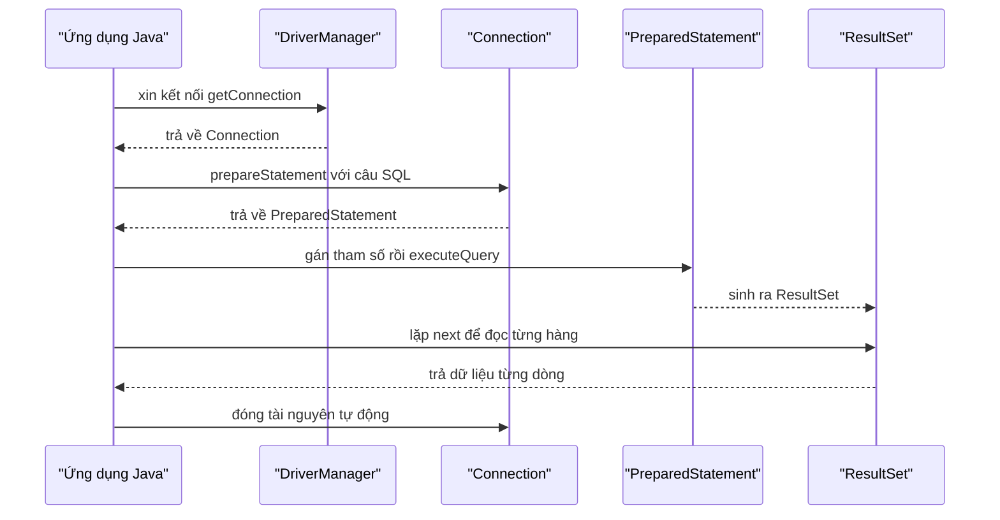
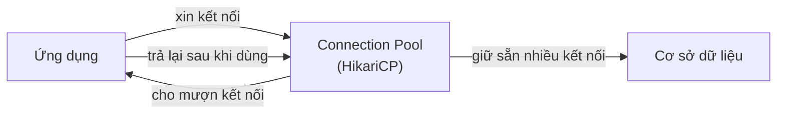

# 2. JDBC — Kết nối CSDL cấp thấp

JDBC là API cấp thấp nền tảng để Java nói chuyện trực tiếp với cơ sở dữ liệu, nơi bạn tự mở kết nối, viết SQL và đọc kết quả. Bài này hướng dẫn các bước cơ bản với JDBC, vì sao phải dùng PreparedStatement để chống SQL injection, cách đọc dữ liệu bằng ResultSet, tự đóng tài nguyên với try-with-resources và tăng tốc bằng connection pool HikariCP. Hiểu JDBC giúp bạn nắm vững nền tảng trước khi dùng các ORM cấp cao hơn.

[](pathname:///img/java/jdbc.webp)

---

:::note[Ghi nhớ nhanh]

- ⭐ **JDBC là API chuẩn, cấp thấp** — tự mở `Connection`, viết SQL, đọc `ResultSet`; đổi DB chỉ cần đổi driver + URL.
- ⭐ **LUÔN dùng `PreparedStatement` với dấu `?`** — tham số hóa để chống SQL injection, KHÔNG nối chuỗi.
- **executeQuery vs executeUpdate** — `executeQuery()` cho SELECT (trả `ResultSet`), `executeUpdate()` cho INSERT/UPDATE/DELETE.
- **try-with-resources** — tự đóng `Connection`/`PreparedStatement`/`ResultSet`, tránh rò rỉ tài nguyên.
- **Connection pool HikariCP** — tái sử dụng kết nối để tăng tốc; là pool mặc định của Spring Boot.

:::

---

## Mục lục

- [Vì sao có JDBC?](#vì-sao-có-jdbc)
- [JDBC là gì?](#jdbc-là-gì)
- [Các bước cơ bản khi dùng JDBC](#các-bước-cơ-bản-khi-dùng-jdbc)
- [Kết nối: DriverManager và Connection](#kết-nối-drivermanager-và-connection)
- [Statement vs PreparedStatement (CỰC KỲ QUAN TRỌNG)](#statement-vs-preparedstatement-cực-kỳ-quan-trọng)
- [executeQuery và executeUpdate](#executequery-và-executeupdate)
- [Đọc kết quả với ResultSet](#đọc-kết-quả-với-resultset)
- [try-with-resources: tự đóng tài nguyên](#try-with-resources-tự-đóng-tài-nguyên)
- [Connection Pool và HikariCP](#connection-pool-và-hikaricp)
- [Lỗi thường gặp](#lỗi-thường-gặp)
- [Tóm tắt](#tóm-tắt)
- [Câu hỏi phỏng vấn](#câu-hỏi-phỏng-vấn)

---

## Vì sao có JDBC?

**Vấn đề:** Mỗi hệ quản trị CSDL (MySQL, PostgreSQL, Oracle...) có **giao thức và thư viện kết nối RIÊNG**. Nếu code Java gọi thẳng API riêng của từng DB, ứng dụng bị **khóa chặt vào một DB**: muốn đổi sang DB khác phải viết lại gần như toàn bộ phần truy cập dữ liệu.

**Giải pháp:** JDBC là **API CHUẨN** của Java để làm việc với mọi CSDL quan hệ. Mỗi DB cung cấp một **driver** cài thêm vào sau, còn code nghiệp vụ chỉ dùng các interface chuẩn (`Connection`, `Statement`, `ResultSet`). Đổi DB chỉ cần đổi **driver + URL**, không phải sửa logic.

```java
// Code chỉ phụ thuộc interface chuẩn của JDBC, không phụ thuộc DB cụ thể
// Đổi DB? Chỉ đổi URL và driver — phần dưới giữ nguyên.
String url = "jdbc:mysql://localhost:3306/mydb";   // MySQL
// String url = "jdbc:postgresql://localhost:5432/mydb"; // đổi sang PostgreSQL

String sql = "SELECT id, name FROM users WHERE email = ?";
try (Connection conn = DriverManager.getConnection(url, USER, PASSWORD);
     PreparedStatement ps = conn.prepareStatement(sql)) { // luôn dùng PreparedStatement
    ps.setString(1, "an@example.com"); // tham số hóa → chống SQL injection
    try (ResultSet rs = ps.executeQuery()) {
        while (rs.next()) {
            System.out.println(rs.getString("name"));
        }
    }
}
```

:::tip[Dùng thực tế]

- **Kết nối và truy vấn DB chuẩn:** mở `Connection`, chạy SELECT/INSERT qua cùng một bộ interface dù backend là MySQL hay PostgreSQL.
- **Chống SQL injection:** luôn dùng `PreparedStatement` với dấu `?` để tham số hóa dữ liệu người dùng, không nối chuỗi.
- **Đổi DB không đổi code nghiệp vụ:** chuyển môi trường (dev dùng MySQL, prod dùng PostgreSQL) chỉ cần đổi driver + URL.
- **Nền tảng cho ORM:** các framework như Hibernate đều dựng trên JDBC — hiểu JDBC giúp bạn debug ORM dễ hơn.

:::

---

## JDBC là gì?

**JDBC** (Java Database Connectivity — kết nối CSDL của Java) là một **API** (Application Programming Interface — bộ giao diện lập trình, tức tập hợp các lớp/phương thức cho sẵn) **cấp thấp** để Java nói chuyện trực tiếp với CSDL.

"Cấp thấp" nghĩa là bạn phải tự làm gần như mọi việc: tự mở kết nối, tự viết câu SQL, tự đọc kết quả, tự đóng kết nối. Đổi lại, bạn kiểm soát được mọi thứ và hiểu rõ điều gì đang diễn ra.

> Ví dụ đời thường: JDBC giống như **lái xe số sàn**. Bạn phải tự đạp côn, vào số. Mệt hơn xe số tự động (ORM), nhưng bạn hiểu rõ máy móc hoạt động ra sao.

JDBC chỉ định nghĩa "giao diện chuẩn". Mỗi loại CSDL (MySQL, PostgreSQL...) cung cấp một **driver** (trình điều khiển — thư viện kết nối riêng) để hiện thực hóa giao diện đó. Bạn chỉ cần thêm driver tương ứng vào dự án.

---

## Các bước cơ bản khi dùng JDBC

1. **Mở kết nối** (Connection) tới CSDL.
2. **Chuẩn bị câu lệnh** (PreparedStatement) với câu SQL.
3. **Thực thi** câu lệnh: truy vấn lấy dữ liệu hoặc cập nhật.
4. **Đọc kết quả** (ResultSet) nếu là truy vấn lấy dữ liệu.
5. **Đóng** mọi tài nguyên đã mở (kết nối, câu lệnh, kết quả).

Sơ đồ tuần tự dưới minh hoạ luồng đi qua các thành phần chính của JDBC khi thực hiện một truy vấn SELECT:



---

## Kết nối: DriverManager và Connection

`DriverManager` là lớp quản lý các driver. Bạn gọi `DriverManager.getConnection()` để xin một `Connection` (kết nối) tới CSDL.

```java
import java.sql.Connection;
import java.sql.DriverManager;
import java.sql.SQLException;

public class DatabaseDemo {
    // Thông tin kết nối — KHÔNG hardcode mật khẩu thật trong code thực tế!
    // Thực tế nên đọc từ biến môi trường hoặc file cấu hình.
    private static final String URL = "jdbc:mysql://localhost:3306/mydb";
    private static final String USER = "root";
    private static final String PASSWORD = "your_password";

    public static void main(String[] args) {
        try {
            // Mở kết nối tới CSDL MySQL
            Connection conn = DriverManager.getConnection(URL, USER, PASSWORD);
            System.out.println("Kết nối thành công!");
            conn.close(); // nhớ đóng kết nối
        } catch (SQLException e) {
            // Luôn xử lý ngoại lệ, ghi log để biết lỗi gì
            System.err.println("Kết nối thất bại: " + e.getMessage());
        }
    }
}
```

Chuỗi `URL` có cấu trúc: `jdbc:<loại-db>://<host>:<cổng>/<tên-database>`. Ví dụ `jdbc:mysql://localhost:3306/mydb` nghĩa là kết nối MySQL ở máy local, cổng 3306, database tên `mydb`.

---

## Statement vs PreparedStatement (CỰC KỲ QUAN TRỌNG)

Đây là phần **quan trọng nhất** của bài này về mặt **bảo mật**.

### Cách SAI: nối chuỗi với Statement (gây SQL injection)

```java
// ⛔ TUYỆT ĐỐI KHÔNG LÀM THẾ NÀY ⛔
String email = userInput; // dữ liệu do người dùng nhập vào
String sql = "SELECT * FROM users WHERE email = '" + email + "'";
Statement stmt = conn.createStatement();
ResultSet rs = stmt.executeQuery(sql); // RẤT NGUY HIỂM!
```

Vấn đề: nếu kẻ xấu nhập email là:

```text
' OR '1'='1
```

Thì câu SQL trở thành:

```sql
SELECT * FROM users WHERE email = '' OR '1'='1'
```

Vì `'1'='1'` luôn đúng, câu lệnh sẽ trả về **TẤT CẢ người dùng**! Tệ hơn, kẻ xấu có thể nhập câu lệnh xóa cả bảng. Đây gọi là **SQL injection** (tiêm nhiễm SQL — lỗ hổng bảo mật nghiêm trọng nhất khi làm việc với CSDL).

> Ví dụ đời thường: nối chuỗi SQL giống như để người lạ tự viết lên tờ giấy lệnh rồi đưa cho ngân hàng làm theo. Họ có thể viết "chuyển hết tiền cho tôi".

### Cách ĐÚNG: dùng PreparedStatement với tham số `?`

```java
// ✅ LUÔN LUÔN LÀM THẾ NÀY ✅
String email = userInput; // dữ liệu người dùng
// Dùng dấu ? làm chỗ trống cho tham số, KHÔNG nối chuỗi
String sql = "SELECT * FROM users WHERE email = ?";
PreparedStatement ps = conn.prepareStatement(sql);
// Gán giá trị vào vị trí ? thứ 1 — driver tự xử lý an toàn
ps.setString(1, email);
ResultSet rs = ps.executeQuery();
```

Với `PreparedStatement` (câu lệnh được chuẩn bị trước), dữ liệu người dùng được gửi **tách biệt** khỏi câu lệnh SQL. Dù người dùng nhập `' OR '1'='1`, nó được coi là **một chuỗi văn bản thường**, không phải lệnh SQL. SQL injection bị chặn đứng hoàn toàn.

> **QUY TẮC VÀNG: LUÔN dùng `PreparedStatement` với dấu `?` cho mọi giá trị động. KHÔNG BAO GIỜ nối chuỗi dữ liệu người dùng vào câu SQL.** Hãy ghi nhớ điều này suốt sự nghiệp lập trình của bạn.

`PreparedStatement` còn nhanh hơn (CSDL biên dịch câu lệnh một lần, dùng nhiều lần) và sạch hơn (không cần lo escape dấu nháy).

---

## executeQuery và executeUpdate

`PreparedStatement` có hai phương thức thực thi chính:

- **`executeQuery()`**: dùng cho **SELECT** (lấy dữ liệu). Trả về `ResultSet`.
- **`executeUpdate()`**: dùng cho **INSERT, UPDATE, DELETE** (thay đổi dữ liệu). Trả về số nguyên = số hàng bị ảnh hưởng.

```java
// Thêm một người dùng mới (INSERT) — dùng executeUpdate
String insertSql = "INSERT INTO users (name, email) VALUES (?, ?)";
PreparedStatement ps = conn.prepareStatement(insertSql);
ps.setString(1, "Nguyen An");            // gán cho ? thứ 1
ps.setString(2, "an@example.com");       // gán cho ? thứ 2
int rowsAffected = ps.executeUpdate();   // trả về số hàng được thêm
System.out.println("Đã thêm " + rowsAffected + " hàng");
```

---

## Đọc kết quả với ResultSet

`ResultSet` (tập kết quả) chứa dữ liệu trả về từ một truy vấn SELECT. Nó giống một con trỏ đọc từng hàng. Bạn dùng vòng lặp `while (rs.next())` để duyệt qua từng hàng kết quả.

```java
String sql = "SELECT id, name, email FROM users WHERE name = ?";
PreparedStatement ps = conn.prepareStatement(sql);
ps.setString(1, "Nguyen An");
ResultSet rs = ps.executeQuery();

// rs.next() chuyển sang hàng tiếp theo, trả về false khi hết hàng
while (rs.next()) {
    // Lấy giá trị theo TÊN cột (rõ ràng, dễ đọc)
    long id = rs.getLong("id");
    String name = rs.getString("name");
    String email = rs.getString("email");
    System.out.println(id + " - " + name + " - " + email);
}
```

Một số phương thức đọc thường dùng: `getLong`, `getInt`, `getString`, `getBoolean`, `getDouble`, `getDate`. Bạn có thể lấy theo **tên cột** (khuyến khích) hoặc theo **số thứ tự cột** (bắt đầu từ 1).

---

## try-with-resources: tự đóng tài nguyên

`Connection`, `PreparedStatement`, `ResultSet` đều là **tài nguyên** cần đóng sau khi dùng. Quên đóng sẽ gây **rò rỉ tài nguyên** (resource leak), làm CSDL hết kết nối và app sập.

Cách an toàn nhất là **try-with-resources** (mở tài nguyên trong dấu ngoặc của `try`). Java sẽ **tự động đóng** mọi tài nguyên khi khối `try` kết thúc, kể cả khi có lỗi xảy ra.

```java
String sql = "SELECT id, name FROM users WHERE email = ?";

// Khai báo tài nguyên trong (...) — Java tự gọi close() khi xong
try (Connection conn = DriverManager.getConnection(URL, USER, PASSWORD);
     PreparedStatement ps = conn.prepareStatement(sql)) {

    ps.setString(1, "an@example.com");

    try (ResultSet rs = ps.executeQuery()) {
        while (rs.next()) {
            System.out.println(rs.getString("name"));
        }
    }
} catch (SQLException e) {
    // Ghi log lỗi đầy đủ để debug
    System.err.println("Lỗi truy vấn: " + e.getMessage());
}
// Đến đây conn, ps, rs đã được đóng TỰ ĐỘNG, không cần gọi close() thủ công
```

> Ví dụ đời thường: try-with-resources giống như cửa tự động đóng. Bạn không cần nhớ "đóng cửa khi ra về" — nó tự đóng giúp bạn, dù bạn vội vàng hay quên.

---

## Connection Pool và HikariCP

Mỗi lần mở một `Connection` mới tới CSDL khá **tốn kém** (mất thời gian bắt tay, xác thực...). Nếu app của bạn xử lý hàng nghìn yêu cầu mỗi giây, việc mở/đóng liên tục sẽ rất chậm.

Giải pháp: **connection pool** (bể kết nối). Thay vì mở mới mỗi lần, ta tạo sẵn một "bể" gồm nhiều kết nối, dùng xong thì **trả lại bể** để tái sử dụng.

> Ví dụ đời thường: connection pool giống như **đội taxi chờ sẵn** ở bến. Khách đến lấy xe đi luôn, đi xong trả xe về bến cho khách khác dùng — không phải sản xuất xe mới mỗi lần.

**HikariCP** là thư viện connection pool nhanh và phổ biến nhất trong Java.

```java
import com.zaxxer.hikari.HikariConfig;
import com.zaxxer.hikari.HikariDataSource;

HikariConfig config = new HikariConfig();
config.setJdbcUrl("jdbc:mysql://localhost:3306/mydb");
config.setUsername("root");
config.setPassword("your_password");
config.setMaximumPoolSize(10); // tối đa 10 kết nối trong bể

HikariDataSource dataSource = new HikariDataSource(config);

// Lấy 1 kết nối từ bể, dùng xong nó tự trả về bể (nhờ try-with-resources)
try (Connection conn = dataSource.getConnection()) {
    // ... dùng conn để truy vấn như bình thường
}
```

Khi dùng Spring Boot, HikariCP là pool **mặc định** — bạn không cần cấu hình thủ công, chỉ cần khai báo thông tin CSDL trong file cấu hình.

Sơ đồ dưới minh hoạ cách ứng dụng mượn và trả kết nối qua connection pool thay vì mở kết nối mới mỗi lần:



---

## Lỗi thường gặp

- **Nối chuỗi SQL** → lỗ hổng SQL injection. Luôn dùng `PreparedStatement` với `?`.
- **Quên đóng tài nguyên** → rò rỉ kết nối, app treo. Dùng try-with-resources.
- **Dùng `executeQuery` cho INSERT/UPDATE** → lỗi. Dùng `executeUpdate` thay thế.
- **Quên `rs.next()`** trước khi đọc → lỗi "no current row". Phải gọi `next()` trước.
- **Hardcode mật khẩu trong code** → rủi ro bảo mật. Đọc từ biến môi trường/cấu hình.
- **Mở kết nối mới cho mỗi yêu cầu** → chậm. Dùng connection pool (HikariCP).

---

## Tóm tắt

- **JDBC** là API cấp thấp để Java nói chuyện trực tiếp với CSDL.
- Quy trình: mở `Connection` → tạo `PreparedStatement` → thực thi → đọc `ResultSet` → đóng tài nguyên.
- **LUÔN dùng `PreparedStatement` với dấu `?`**, không nối chuỗi SQL → chống SQL injection. Đây là quy tắc bảo mật quan trọng nhất.
- `executeQuery()` cho SELECT, `executeUpdate()` cho INSERT/UPDATE/DELETE.
- Dùng **try-with-resources** để tự động đóng tài nguyên, tránh rò rỉ.
- Dùng **connection pool (HikariCP)** để tái sử dụng kết nối, tăng tốc độ.

---

## Câu hỏi phỏng vấn

Những câu thường gặp về chủ đề này. Tự trả lời trước, rồi bấm **Xem đáp án** để đối chiếu.

**1. JDBC là gì? Vì sao nói JDBC là API "cấp thấp"? Vai trò của driver trong kiến trúc JDBC là gì?**

<details className="qa">
<summary>Xem đáp án</summary>

**JDBC** (Java Database Connectivity) là API chuẩn của Java để kết nối và thao tác với CSDL quan hệ, thông qua các interface chung (`Connection`, `Statement`, `ResultSet`).

Gọi là "cấp thấp" vì bạn phải **tự làm gần như mọi bước**: tự mở kết nối, tự viết câu SQL, tự đọc từng dòng kết quả, tự đóng tài nguyên — không có framework nào tự động sinh SQL hay ánh xạ object giúp bạn như ORM.

**Driver** là thư viện do từng hãng CSDL (MySQL, PostgreSQL...) cung cấp, hiện thực hóa các interface chuẩn của JDBC theo đúng giao thức riêng của CSDL đó. Nhờ vậy, code nghiệp vụ chỉ cần lập trình theo interface chuẩn (`Connection`, `PreparedStatement`...), còn việc "nói đúng ngôn ngữ" với từng loại CSDL cụ thể do driver đảm nhiệm — đổi CSDL chỉ cần đổi driver + URL kết nối.

</details>

**2. Đoạn code sau có lỗ hổng bảo mật nghiêm trọng gì? Kẻ tấn công có thể khai thác như thế nào?**

```java
String email = userInput;
String sql = "SELECT * FROM users WHERE email = '" + email + "'";
Statement stmt = conn.createStatement();
ResultSet rs = stmt.executeQuery(sql);
```

<details className="qa">
<summary>Xem đáp án</summary>

Đây là lỗ hổng **SQL injection** do nối chuỗi dữ liệu người dùng trực tiếp vào câu SQL bằng `Statement`. Nếu kẻ tấn công nhập `email` là:

```text
' OR '1'='1
```

Câu SQL thực tế trở thành:

```sql
SELECT * FROM users WHERE email = '' OR '1'='1'
```

Vì `'1'='1'` luôn đúng, câu lệnh trả về **toàn bộ** người dùng trong bảng thay vì đúng một người. Nghiêm trọng hơn, kẻ tấn công có thể lồng thêm các lệnh khác tùy loại CSDL để đọc trộm hoặc phá hoại dữ liệu.

Sửa lại bằng `PreparedStatement` với dấu `?`:

```java
String sql = "SELECT * FROM users WHERE email = ?";
PreparedStatement ps = conn.prepareStatement(sql);
ps.setString(1, email);
ResultSet rs = ps.executeQuery();
```

</details>

**3. Vì sao `PreparedStatement` chống được SQL injection còn `Statement` thì không? Nêu thêm một lợi ích khác của `PreparedStatement` ngoài bảo mật.**

<details className="qa">
<summary>Xem đáp án</summary>

- **Về bảo mật**: với `Statement`, toàn bộ câu lệnh (bao gồm cả dữ liệu người dùng) được gửi tới CSDL dưới dạng **một chuỗi văn bản duy nhất**, nên CSDL không phân biệt được đâu là cấu trúc lệnh, đâu là dữ liệu — dữ liệu độc hại có thể "biến thành" một phần cấu trúc lệnh. Với `PreparedStatement`, câu lệnh SQL (có dấu `?`) được gửi và biên dịch **trước, tách biệt** với dữ liệu; sau đó dữ liệu được gán vào từng vị trí `?` như tham số thuần túy — CSDL luôn hiểu đó là **giá trị**, không thể diễn giải thành cú pháp SQL dù nội dung có chứa ký tự đặc biệt.
- **Lợi ích hiệu năng**: vì câu lệnh được CSDL **biên dịch (compile) một lần**, các lần gọi sau với tham số khác nhau có thể tái sử dụng kế hoạch thực thi đã biên dịch (execution plan) thay vì phân tích lại cú pháp từ đầu mỗi lần — nhanh hơn đáng kể khi chạy cùng một câu lệnh nhiều lần với dữ liệu khác nhau.

</details>

**4. Phân biệt `executeQuery()`, `executeUpdate()` và `execute()` của `PreparedStatement`. Khi nào dùng loại nào?**

<details className="qa">
<summary>Xem đáp án</summary>

| Phương thức | Dùng cho | Giá trị trả về |
|---|---|---|
| `executeQuery()` | `SELECT` (lấy dữ liệu) | `ResultSet` chứa các hàng kết quả |
| `executeUpdate()` | `INSERT`, `UPDATE`, `DELETE` (thay đổi dữ liệu) | `int` — số hàng bị ảnh hưởng |
| `execute()` | Trường hợp không biết trước là truy vấn hay cập nhật (ví dụ chạy SQL động, hoặc gọi stored procedure) | `boolean` — `true` nếu kết quả là `ResultSet`, `false` nếu là số hàng cập nhật |

Trong thực tế, `executeQuery()` và `executeUpdate()` được dùng phần lớn thời gian vì loại câu lệnh thường đã biết trước; `execute()` chỉ cần khi viết code tổng quát xử lý SQL bất kỳ mà không biết trước loại lệnh.

</details>

**5. Đoạn code sau ném ra lỗi khi chạy. Lỗi gì và tại sao?**

```java
String sql = "SELECT id, name FROM users WHERE id = ?";
PreparedStatement ps = conn.prepareStatement(sql);
ps.setLong(1, 5L);
ResultSet rs = ps.executeQuery();

String name = rs.getString("name"); // ném lỗi ở đây
```

<details className="qa">
<summary>Xem đáp án</summary>

Lỗi: **`SQLException: no current row`** (hoặc thông báo tương tự tùy driver).

`ResultSet` hoạt động như một **con trỏ (cursor)**, ban đầu trỏ **trước hàng đầu tiên** — chưa trỏ vào hàng dữ liệu nào cả. Phải gọi **`rs.next()`** để di chuyển con trỏ sang hàng tiếp theo (hàng đầu tiên, nếu có) rồi mới được phép đọc giá trị cột; `rs.next()` trả về `false` nếu không còn hàng nào.

Sửa lại:

```java
ResultSet rs = ps.executeQuery();
if (rs.next()) { // di chuyển con trỏ tới hàng đầu tiên (nếu có)
    String name = rs.getString("name");
}
```

</details>

**6. `try-with-resources` giúp gì khi làm việc với `Connection`, `PreparedStatement`, `ResultSet`? Nếu khai báo nhiều resource lồng nhau trong cùng một `try(...)`, chúng được đóng theo thứ tự nào?**

<details className="qa">
<summary>Xem đáp án</summary>

`try-with-resources` tự động gọi `close()` trên mọi resource được khai báo trong ngoặc của `try`, ngay cả khi có exception xảy ra bên trong khối — giúp tránh **rò rỉ tài nguyên (resource leak)** do lập trình viên quên gọi `close()` thủ công, đặc biệt khi có nhiều đường thoát khỏi hàm (return sớm, exception...).

```java
try (Connection conn = DriverManager.getConnection(URL, USER, PASSWORD);
     PreparedStatement ps = conn.prepareStatement(sql);
     ResultSet rs = ps.executeQuery()) {
    // dùng rs
}
// conn, ps, rs đều đã được đóng tự động
```

Thứ tự đóng: các resource được đóng theo thứ tự **ngược lại** với thứ tự khai báo — resource khai báo **sau cùng** (ở đây là `rs`) được đóng **trước tiên**, rồi tới `ps`, cuối cùng mới tới `conn`. Thứ tự này hợp lý vì resource khai báo sau thường phụ thuộc vào resource khai báo trước (ví dụ `ResultSet` cần `PreparedStatement` còn tồn tại để hoạt động).

</details>

**7. Connection pool giải quyết vấn đề gì? Vì sao không nên mở một `Connection` mới cho mỗi request trong một ứng dụng web có lượng truy cập lớn?**

<details className="qa">
<summary>Xem đáp án</summary>

Mở một kết nối CSDL mới (`DriverManager.getConnection(...)`) là một thao tác **tốn kém**: cần thời gian thiết lập kết nối mạng, bắt tay giao thức (handshake), xác thực (authentication) với CSDL — mỗi lần có thể mất từ vài chục đến vài trăm mili-giây.

Nếu ứng dụng mở một connection mới cho **mỗi request**, với lượng truy cập lớn (hàng trăm/nghìn request mỗi giây), phần lớn thời gian xử lý sẽ bị tiêu tốn vào việc mở/đóng kết nối thay vì xử lý logic thực sự — làm ứng dụng chậm hẳn và có nguy cơ làm CSDL quá tải vì số kết nối đồng thời tăng vọt.

**Connection pool** (bể kết nối, ví dụ HikariCP) giải quyết bằng cách **mở sẵn một số lượng kết nối cố định**, giữ chúng sống, và cho ứng dụng **mượn — dùng xong trả lại bể** để request khác tái sử dụng, thay vì mở/đóng liên tục. Điều này giảm chi phí thiết lập kết nối xuống gần như bằng 0 cho mỗi request.

</details>

**8. Đoạn code sau chạy đúng logic nhưng tiềm ẩn nguy cơ rò rỉ tài nguyên khi ứng dụng chạy lâu dài. Hãy chỉ ra vấn đề và sửa lại.**

```java
public String getUserName(Connection conn, long id) throws SQLException {
    PreparedStatement ps = conn.prepareStatement("SELECT name FROM users WHERE id = ?");
    ps.setLong(1, id);
    ResultSet rs = ps.executeQuery();
    if (rs.next()) {
        return rs.getString("name");
    }
    return null;
}
```

<details className="qa">
<summary>Xem đáp án</summary>

Vấn đề: `PreparedStatement` (`ps`) và `ResultSet` (`rs`) **không bao giờ được đóng** — hàm `return` thoát ngay khi tìm thấy kết quả (hoặc khi không tìm thấy), bỏ qua việc gọi `close()`. Gọi hàm này lặp đi lặp lại (ví dụ hàng nghìn lần trong một ứng dụng chạy lâu dài) sẽ dần **rò rỉ tài nguyên**, cuối cùng CSDL báo lỗi "quá nhiều cursor/statement đang mở" hoặc ứng dụng hết bộ nhớ.

Sửa lại bằng `try-with-resources`:

```java
public String getUserName(Connection conn, long id) throws SQLException {
    String sql = "SELECT name FROM users WHERE id = ?";
    try (PreparedStatement ps = conn.prepareStatement(sql)) {
        ps.setLong(1, id);
        try (ResultSet rs = ps.executeQuery()) {
            if (rs.next()) {
                return rs.getString("name");
            }
            return null;
        }
    }
}
```

Lưu ý: hàm này nhận `Connection` từ bên ngoài truyền vào nên **không đóng `conn`** ở đây — việc đóng `conn` (trả về pool) là trách nhiệm của nơi đã mở/mượn nó.

</details>

**9. Bạn cần chèn 10.000 bản ghi vào bảng `logs` một lúc. Chèn bằng cách gọi `executeUpdate()` 10.000 lần liên tiếp trong vòng lặp rất chậm. Nên tối ưu như thế nào?**

<details className="qa">
<summary>Xem đáp án</summary>

Nên dùng **batch insert** (chèn theo lô) qua `addBatch()` / `executeBatch()` của `PreparedStatement`, thay vì gửi từng câu lệnh riêng lẻ tới CSDL:

```java
String sql = "INSERT INTO logs (message, created_at) VALUES (?, ?)";
try (PreparedStatement ps = conn.prepareStatement(sql)) {
    conn.setAutoCommit(false); // tắt auto-commit để gộp thành một transaction

    for (LogEntry entry : entries) { // entries có 10.000 phần tử
        ps.setString(1, entry.message());
        ps.setTimestamp(2, entry.createdAt());
        ps.addBatch(); // gom vào lô, chưa gửi ngay
    }

    ps.executeBatch();  // gửi toàn bộ lô một lần
    conn.commit();       // xác nhận transaction
}
```

Lợi ích: giảm đáng kể số lần **round-trip mạng** giữa ứng dụng và CSDL (gửi một lô lớn thay vì 10.000 lần gửi/nhận riêng lẻ), đồng thời gộp thành một transaction giúp CSDL tối ưu việc ghi xuống đĩa — nhanh hơn nhiều lần so với gọi `executeUpdate()` lặp lại.

</details>

**10. Đoạn code sau in ra gì? Giải thích lỗi trong cách đánh số tham số của `PreparedStatement`.**

```java
String sql = "UPDATE users SET name = ?, email = ? WHERE id = ?";
PreparedStatement ps = conn.prepareStatement(sql);
ps.setString(0, "An");
ps.setString(1, "an@example.com");
ps.setLong(2, 5L);
ps.executeUpdate();
```

<details className="qa">
<summary>Xem đáp án</summary>

Đoạn code này ném ra **`SQLException`** (thường có thông báo dạng "Parameter index out of range" hoặc tương tự tùy driver), vì **chỉ số tham số của `PreparedStatement` bắt đầu từ 1, không phải 0**.

Câu lệnh có 3 dấu `?`, tương ứng với chỉ số hợp lệ là `1`, `2`, `3`. Đoạn code trên gọi `ps.setString(0, ...)` — chỉ số `0` không tồn tại, gây lỗi ngay tại dòng đó.

Sửa lại cho đúng:

```java
ps.setString(1, "An");             // ? thứ 1: name
ps.setString(2, "an@example.com"); // ? thứ 2: email
ps.setLong(3, 5L);                  // ? thứ 3: id
```

Đây là lỗi rất dễ mắc với người quen tư duy mảng/index bắt đầu từ 0 trong Java.

</details>

**11. Bạn cần INSERT một bản ghi `users` mới và lấy ngay giá trị `id` tự sinh (auto-generated key) của bản ghi đó để dùng tiếp (ví dụ tạo đơn hàng gắn với user vừa tạo). JDBC hỗ trợ việc này như thế nào?**

<details className="qa">
<summary>Xem đáp án</summary>

Dùng cờ **`Statement.RETURN_GENERATED_KEYS`** khi tạo `PreparedStatement`, sau đó gọi `getGeneratedKeys()` để lấy `ResultSet` chứa các khóa tự sinh:

```java
String sql = "INSERT INTO users (name, email) VALUES (?, ?)";
try (PreparedStatement ps = conn.prepareStatement(sql, Statement.RETURN_GENERATED_KEYS)) {
    ps.setString(1, "Nguyen An");
    ps.setString(2, "an@example.com");
    ps.executeUpdate();

    try (ResultSet keys = ps.getGeneratedKeys()) {
        if (keys.next()) {
            long newId = keys.getLong(1); // lấy id vừa được CSDL tự sinh
            System.out.println("User mới có id = " + newId);
        }
    }
}
```

Không có cờ này, sau khi `INSERT` thành công bạn sẽ không có cách trực tiếp nào để biết CSDL vừa sinh ra giá trị `id` (khóa tự tăng) là bao nhiêu, mà phải chạy thêm một câu `SELECT` riêng (kém hiệu quả và có thể không chính xác nếu có insert khác xen vào).

</details>

**12. Ứng dụng web của bạn dùng JDBC thuần, chạy ổn định vài giờ đầu rồi bắt đầu báo lỗi "Too many connections" từ CSDL, dù lượng truy cập không tăng đột biến. Hãy nêu các nguyên nhân khả dĩ và cách chẩn đoán.**

<details className="qa">
<summary>Xem đáp án</summary>

Nguyên nhân khả dĩ nhất: **rò rỉ connection (connection leak)** — code ở đâu đó mở `Connection` nhưng không đóng lại trong mọi nhánh xử lý (ví dụ quên `try-with-resources`, hoặc có nhánh `return`/`throw` sớm bỏ qua việc đóng). Theo thời gian, số connection "treo" (không dùng nhưng cũng chưa được trả về CSDL) tích lũy dần cho tới khi chạm giới hạn tối đa mà CSDL cho phép.

Cách chẩn đoán:

- Rà lại toàn bộ chỗ mở `Connection` thủ công, đảm bảo dùng **try-with-resources** nhất quán, không có nhánh nào bỏ sót việc đóng.
- Nếu đang dùng **connection pool (HikariCP)**, bật log/metric của pool (ví dụ `leakDetectionThreshold`) — HikariCP có thể tự cảnh báo khi một connection bị giữ quá lâu mà không trả về pool, kèm stack trace nơi đã mượn nó, giúp xác định chính xác đoạn code gây leak.
- Kiểm tra các đường code hiếm khi được chạy (nhánh xử lý lỗi, xử lý ngoại lệ đặc biệt) — đây thường là nơi dễ bị bỏ sót việc đóng resource nhất vì ít được test tới.

</details>
