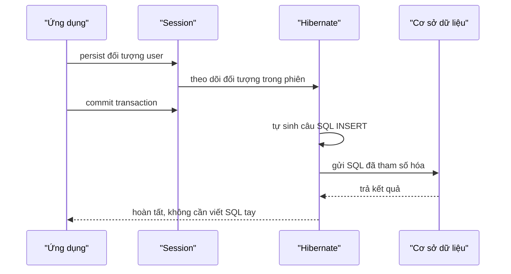
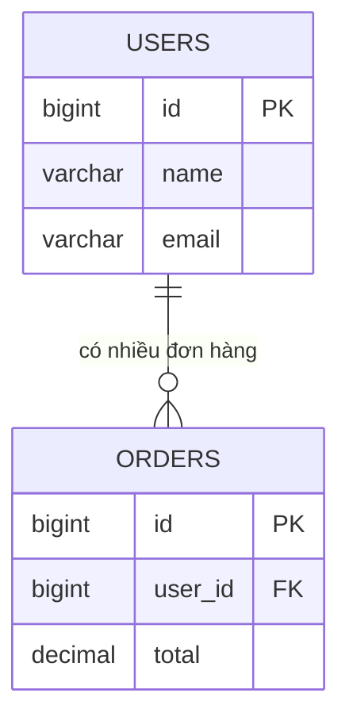

# 3. Hibernate — ORM nổi tiếng nhất

Hibernate là thư viện ORM nổi tiếng nhất trong Java, giúp bạn làm việc với cơ sở dữ liệu bằng đối tượng Java mà không phải tự viết SQL cho các thao tác thông thường. Bài này hướng dẫn cách khai báo Entity bằng annotation, dùng SessionFactory và Session để thực hiện CRUD, truy vấn với HQL, hiểu lazy loading và vì sao Hibernate an toàn trước SQL injection. Đây là nền tảng quan trọng trước khi học Spring Data JPA.

[](pathname:///img/java/hibernate.webp)

---

:::note[Ghi nhớ nhanh]

- ⭐ **Hibernate là ORM ánh xạ class ↔ table tự động** — thao tác DB bằng đối tượng, tự sinh SQL, không viết SQL tay.
- **Khai báo Entity bằng annotation** — `@Entity`, `@Table`, `@Id`, `@GeneratedValue`, `@Column`; bắt buộc có constructor rỗng.
- **`SessionFactory` vs `Session`** — `SessionFactory` tạo một lần; `Session` tạo mới mỗi đơn vị công việc; CRUD (`persist`/`get`/`remove`) trong transaction có `commit()`.
- **HQL** — truy vấn theo tên class/thuộc tính; luôn dùng `setParameter`, không nối chuỗi.
- ⭐ **Lazy loading & N+1** — chỉ tải dữ liệu liên quan khi cần; cẩn thận `LazyInitializationException` và vấn đề N+1 (dùng `JOIN FETCH`). Mặc định tham số hóa nên an toàn SQL injection.

:::

---

## Mục lục

- [Vì sao có Hibernate (ORM)?](#vì-sao-có-hibernate-orm)
- [Vì sao cần Hibernate?](#vì-sao-cần-hibernate)
- [ORM là gì? (nhắc lại nhanh)](#orm-là-gì-nhắc-lại-nhanh)
- [Khai báo Entity: @Entity, @Id, @Column](#khai-báo-entity-entity-id-column)
- [SessionFactory và Session](#sessionfactory-và-session)
- [CRUD với Hibernate: save, get, update, delete](#crud-với-hibernate-save-get-update-delete)
- [HQL — truy vấn theo đối tượng](#hql--truy-vấn-theo-đối-tượng)
- [Lazy loading — tải lười](#lazy-loading--tải-lười)
- [Vì sao không cần viết SQL tay?](#vì-sao-không-cần-viết-sql-tay)
- [Lỗi thường gặp](#lỗi-thường-gặp)
- [Tóm tắt](#tóm-tắt)
- [Câu hỏi phỏng vấn](#câu-hỏi-phỏng-vấn)

---

## Vì sao có Hibernate (ORM)?

**Vấn đề:** Dùng JDBC thuần, bạn phải tự viết SQL bằng tay và **ánh xạ thủ công từng cột** của `ResultSet` sang field của object — lặp đi lặp lại, dễ sai. Khi có quan hệ và khóa ngoại thì còn cực hơn nhiều. Gốc rễ là sự **lệch pha giữa thế giới object (Java) và thế giới table (SQL)** — gọi là *object-relational impedance mismatch*.

```java
// JDBC thuần: viết SQL tay + đọc từng cột ResultSet thủ công
String sql = "SELECT id, name, email FROM users WHERE id = ?";
try (PreparedStatement ps = conn.prepareStatement(sql)) {
    ps.setLong(1, 1L);
    try (ResultSet rs = ps.executeQuery()) {
        if (rs.next()) {
            User user = new User();
            user.setId(rs.getLong("id"));       // gán thủ công cột -> field
            user.setName(rs.getString("name"));  // lặp lại với mọi cột
            user.setEmail(rs.getString("email"));// quên/sai 1 cột là lỗi
            // ... còn quan hệ, khóa ngoại thì phải tự JOIN và ráp object
        }
    }
}
```

**Giải pháp:** **Hibernate** (ORM, là một triển khai của JPA) **ánh xạ class ↔ table tự động** qua annotation `@Entity`, cho bạn thao tác DB **bằng object** (save/find) thay vì SQL tay. Hibernate tự sinh SQL, quản lý quan hệ, lazy loading, cache, và cung cấp HQL/Criteria. Lượng code lặp (boilerplate) giảm rất nhiều.

```java
// Hibernate: thao tác bằng object, không viết SQL, không ráp cột thủ công
User user = session.get(User.class, 1L);  // tự sinh SELECT + ráp object
System.out.println(user.getName());

session.persist(new User("Nguyen An", "an@example.com")); // tự sinh INSERT
```

:::tip[Dùng thực tế]

- **Lưu/đọc entity không viết SQL**: `persist()`, `get()` đủ cho CRUD thường ngày.
- **Ánh xạ quan hệ**: dùng `@OneToMany` để 1 `User` gắn nhiều `Order` mà không tự JOIN.
- **Đổi loại CSDL dễ dàng**: chỉ đổi cấu hình "dialect" (phương ngữ), không sửa code.
- **Giảm code DAO lặp**: bớt hẳn lớp DAO đọc `ResultSet` thủ công cho từng bảng.

:::

---

## Vì sao cần Hibernate?

Ở bài JDBC, bạn thấy để lưu một `User`, bạn phải tự viết SQL `INSERT`, tự gán từng tham số, tự đọc `ResultSet`. Làm với 1 bảng đã mệt, với hàng chục bảng thì cực kỳ lặp đi lặp lại và dễ sai.

**Hibernate** là một thư viện **ORM** (Object-Relational Mapping — ánh xạ đối tượng - quan hệ) giúp bạn **làm việc với CSDL bằng đối tượng Java**, không cần viết SQL tay cho các thao tác thông thường.

> Ví dụ đời thường: nếu JDBC là tự nấu ăn từ nguyên liệu thô, thì Hibernate là **thuê đầu bếp riêng**. Bạn chỉ nói "lưu user này", đầu bếp tự dịch ra SQL, tự nấu, tự dọn. Bạn tập trung vào logic nghiệp vụ, không lo chi tiết SQL.

---

## ORM là gì? (nhắc lại nhanh)

ORM tự động chuyển đổi giữa hai thế giới:

- Một **class Java** ⟷ một **bảng CSDL**.
- Một **đối tượng** ⟷ một **hàng**.
- Một **thuộc tính (field)** ⟷ một **cột**.

Bạn chỉ cần "đánh dấu" class Java bằng vài chú thích (annotation), Hibernate tự biết phải lưu vào bảng nào, cột nào.

---

## Khai báo Entity: @Entity, @Id, @Column

**Entity** (thực thể) là một class Java được ánh xạ tới một bảng CSDL. Bạn dùng các **annotation** (chú thích — ghi chú đặc biệt bắt đầu bằng `@` để cung cấp thông tin cho thư viện) để khai báo.

```java
import jakarta.persistence.*;

@Entity                       // Đánh dấu: đây là một entity (ánh xạ tới bảng)
@Table(name = "users")        // Tên bảng trong CSDL là "users"
public class User {

    @Id                       // Đây là khóa chính (primary key)
    @GeneratedValue(strategy = GenerationType.IDENTITY) // CSDL tự sinh id tăng dần
    private Long id;

    @Column(name = "name", nullable = false) // Ánh xạ tới cột "name", không được null
    private String name;

    @Column(name = "email", unique = true)   // Cột "email", giá trị phải duy nhất
    private String email;

    // Hibernate yêu cầu phải có constructor rỗng (không tham số)
    public User() {
    }

    public User(String name, String email) {
        this.name = name;
        this.email = email;
    }

    // ... getter và setter cho id, name, email
}
```

Giải thích các annotation:

- **`@Entity`**: báo đây là class được ánh xạ tới bảng.
- **`@Table(name = "...")`**: chỉ định tên bảng (nếu bỏ, mặc định lấy tên class).
- **`@Id`**: đánh dấu thuộc tính làm khóa chính.
- **`@GeneratedValue`**: để CSDL tự sinh giá trị khóa chính (id tự tăng).
- **`@Column`**: tùy chỉnh tên cột, ràng buộc như `nullable`, `unique`.

---

## SessionFactory và Session

Để làm việc với Hibernate, bạn cần hai khái niệm:

- **`SessionFactory`** (nhà máy tạo session): đối tượng **nặng**, tạo **một lần duy nhất** khi app khởi động. Nó đọc cấu hình và giữ thông tin kết nối CSDL.
- **`Session`** (phiên làm việc): đối tượng **nhẹ**, tạo mới cho **mỗi đơn vị công việc** (ví dụ mỗi yêu cầu của người dùng). Dùng để lưu, đọc, xóa entity.

> Ví dụ đời thường: `SessionFactory` giống như **một ngân hàng** (mở một lần), còn `Session` giống như **một lượt giao dịch tại quầy** (mở rồi đóng cho từng khách).

```java
import org.hibernate.Session;
import org.hibernate.SessionFactory;
import org.hibernate.cfg.Configuration;

// Tạo SessionFactory MỘT LẦN khi app khởi động (rất tốn tài nguyên)
SessionFactory sessionFactory = new Configuration()
        .configure()              // đọc file cấu hình hibernate.cfg.xml
        .addAnnotatedClass(User.class)
        .buildSessionFactory();

// Mỗi đơn vị công việc mở một Session mới
Session session = sessionFactory.openSession();
```

---

## CRUD với Hibernate: save, get, update, delete

Mọi thao tác thay đổi dữ liệu phải nằm trong một **transaction** (giao dịch — nhóm thao tác hoặc thành công tất cả, hoặc hủy tất cả). Đây là CRUD cơ bản:

```java
// --- CREATE: thêm mới ---
try (Session session = sessionFactory.openSession()) {
    session.beginTransaction();           // bắt đầu giao dịch

    User user = new User("Nguyen An", "an@example.com");
    session.persist(user);                // lưu đối tượng vào CSDL (INSERT)

    session.getTransaction().commit();    // xác nhận, lưu thật vào CSDL
}

// --- READ: đọc theo khóa chính ---
try (Session session = sessionFactory.openSession()) {
    // get() trả về đối tượng có id = 1, hoặc null nếu không tìm thấy
    User user = session.get(User.class, 1L);
    System.out.println(user.getName());
}

// --- UPDATE: cập nhật ---
try (Session session = sessionFactory.openSession()) {
    session.beginTransaction();

    User user = session.get(User.class, 1L);
    user.setEmail("new@example.com");     // chỉ cần đổi thuộc tính
    // Hibernate tự phát hiện thay đổi và sinh câu UPDATE khi commit

    session.getTransaction().commit();
}

// --- DELETE: xóa ---
try (Session session = sessionFactory.openSession()) {
    session.beginTransaction();

    User user = session.get(User.class, 1L);
    session.remove(user);                 // xóa đối tượng khỏi CSDL (DELETE)

    session.getTransaction().commit();
}
```

Lưu ý: bạn **không hề viết một dòng SQL nào**. Hibernate tự sinh `INSERT`, `SELECT`, `UPDATE`, `DELETE` phía sau. Và quan trọng: Hibernate **luôn dùng tham số hóa** (giống `PreparedStatement`), nên **an toàn trước SQL injection** một cách mặc định.

Sơ đồ tuần tự dưới cho thấy Hibernate đứng giữa ứng dụng và CSDL, tự sinh SQL khi bạn thao tác bằng đối tượng:



---

## HQL — truy vấn theo đối tượng

Khi cần truy vấn phức tạp hơn (lọc theo điều kiện, sắp xếp...), Hibernate cung cấp **HQL** (Hibernate Query Language — ngôn ngữ truy vấn của Hibernate). HQL trông giống SQL nhưng thao tác trên **tên class và thuộc tính Java**, không phải tên bảng và cột.

```java
try (Session session = sessionFactory.openSession()) {
    // Lưu ý: "User" là TÊN CLASS, "email" là TÊN THUỘC TÍNH (không phải tên cột)
    // Dùng :email là THAM SỐ — an toàn, KHÔNG nối chuỗi
    String hql = "FROM User WHERE email = :email";

    User user = session.createQuery(hql, User.class)
            .setParameter("email", "an@example.com") // gán tham số an toàn
            .uniqueResult();                          // lấy 1 kết quả duy nhất

    System.out.println(user.getName());
}
```

> **Quy tắc bảo mật vẫn áp dụng**: trong HQL, luôn dùng tham số `:tên` với `setParameter(...)`, **không nối chuỗi** dữ liệu người dùng vào câu HQL.

---

## Lazy loading — tải lười

Giả sử một `User` có nhiều `Order` (đơn hàng). Khi bạn lấy một `User`, Hibernate có nên tải luôn toàn bộ đơn hàng không? Nếu user có 10.000 đơn hàng mà bạn chỉ cần xem tên, thì tải hết là rất lãng phí.

**Lazy loading** (tải lười) nghĩa là: chỉ tải dữ liệu liên quan **khi nào thực sự cần dùng**. Đây là hành vi mặc định của Hibernate cho các quan hệ "một - nhiều".

> Ví dụ đời thường: lazy loading giống như **menu nhà hàng**. Bạn được đưa menu (thông tin user) ngay, nhưng món ăn (đơn hàng) chỉ được nấu khi bạn gọi món.

```java
try (Session session = sessionFactory.openSession()) {
    User user = session.get(User.class, 1L);
    // Tới đây, danh sách orders CHƯA được tải từ CSDL

    // Chỉ khi gọi getOrders() và truy cập, Hibernate mới chạy SELECT đơn hàng
    System.out.println(user.getOrders().size());
}
```

Ngược lại với lazy là **eager loading** (tải háo hức — tải luôn mọi thứ ngay). Lazy thường tiết kiệm hơn, nhưng cẩn thận lỗi ở phần dưới.

Sơ đồ quan hệ dưới minh hoạ cách một `User` ánh xạ tới bảng `users` và gắn với nhiều `Order` (quan hệ một - nhiều) qua khóa ngoại:



---

## Vì sao không cần viết SQL tay?

- Hibernate **tự sinh SQL** từ đối tượng và annotation của bạn.
- Cùng một code Java chạy được trên **nhiều loại CSDL** (MySQL, PostgreSQL, Oracle...) chỉ bằng cách đổi cấu hình "dialect" (phương ngữ — kiểu SQL riêng của từng CSDL). Bạn không phải sửa code.
- Hibernate quản lý cache, theo dõi thay đổi đối tượng, tự tối ưu.
- Bảo mật mặc định: luôn tham số hóa, chống SQL injection.

Tuy vậy, với truy vấn **rất phức tạp** (báo cáo, thống kê), đôi khi viết SQL gốc (native query) vẫn rõ ràng và nhanh hơn. ORM giúp đỡ, không thay thế hoàn toàn.

---

## Lỗi thường gặp

- **Quên constructor rỗng** trong entity → Hibernate báo lỗi khi tạo đối tượng.
- **Quên `@Id`** → Hibernate không biết khóa chính, báo lỗi khi khởi động.
- **Quên `commit()`** giao dịch → dữ liệu không được lưu thật vào CSDL.
- **LazyInitializationException**: truy cập dữ liệu lazy **sau khi `Session` đã đóng**. Cần truy cập trong lúc Session còn mở, hoặc dùng eager khi cần thiết.
- **Nối chuỗi trong HQL** → vẫn dính SQL injection. Luôn dùng `setParameter`.
- **Vấn đề N+1 query**: lặp qua danh sách rồi mỗi lần lại truy vấn lazy → sinh ra cực nhiều câu SELECT. Cần dùng `JOIN FETCH` để gộp lại.

---

## Tóm tắt

- **Hibernate** là thư viện ORM giúp làm việc CSDL bằng **đối tượng Java**.
- Đánh dấu class bằng `@Entity`, `@Id`, `@Column`... để ánh xạ tới bảng.
- **`SessionFactory`** tạo một lần; **`Session`** tạo mới cho mỗi đơn vị công việc.
- CRUD: `persist` (tạo), `get` (đọc), đổi thuộc tính (sửa), `remove` (xóa) — tất cả trong một **transaction** với `commit()`.
- **HQL** truy vấn theo tên class/thuộc tính; **luôn dùng `setParameter`**.
- **Lazy loading**: chỉ tải dữ liệu liên quan khi cần. Cẩn thận `LazyInitializationException` và vấn đề N+1.
- Hibernate **mặc định tham số hóa** → an toàn trước SQL injection.

---

## Câu hỏi phỏng vấn

Những câu thường gặp về chủ đề này. Tự trả lời trước, rồi bấm **Xem đáp án** để đối chiếu.

**1. "Object-relational impedance mismatch" là gì? Hibernate giải quyết vấn đề này như thế nào?**

<details className="qa">
<summary>Xem đáp án</summary>

**Object-relational impedance mismatch** (sự lệch pha giữa đối tượng và quan hệ) là thuật ngữ mô tả sự khác biệt cơ bản giữa hai mô hình:

- Thế giới **object (Java)**: dữ liệu là các đối tượng có thuộc tính, quan hệ (kế thừa, tham chiếu đối tượng khác), và hành vi (method).
- Thế giới **relational (SQL)**: dữ liệu là các bảng phẳng, hàng, cột, liên kết qua khóa ngoại — không có khái niệm kế thừa hay đối tượng lồng nhau.

Việc chuyển đổi qua lại thủ công giữa hai mô hình này (như trong JDBC thuần: tự đọc từng cột `ResultSet` rồi gán vào field) rất lặp đi lặp lại và dễ sai, đặc biệt khi có quan hệ phức tạp.

**Hibernate** giải quyết bằng cách **tự động ánh xạ** class ↔ bảng, đối tượng ↔ hàng, thuộc tính ↔ cột (chỉ cần khai báo qua annotation), và tự sinh SQL cần thiết phía sau — lập trình viên thao tác hoàn toàn bằng object, không cần tự tay chuyển đổi.

</details>

**2. Vì sao Hibernate yêu cầu mọi Entity phải có một constructor không tham số (no-args constructor)?**

<details className="qa">
<summary>Xem đáp án</summary>

Khi đọc dữ liệu từ CSDL, Hibernate cần **tự tạo instance của Entity trước, rồi mới gán giá trị vào từng field sau** (thường bằng reflection — cơ chế đọc/ghi field lúc runtime mà không cần gọi qua constructor có tham số). Để làm được điều này, Hibernate cần một cách tạo object mà **không cần biết trước giá trị của bất kỳ field nào** — đó chính là constructor rỗng.

Nếu Entity chỉ có constructor có tham số (ví dụ `User(String name, String email)`), Hibernate không biết truyền giá trị gì vào lúc khởi tạo (vì lúc đó chưa đọc dữ liệu từ CSDL), dẫn tới lỗi khi Hibernate cố tạo object. Vì vậy quy tắc bắt buộc: **luôn khai báo thêm một constructor không tham số**, dù bạn có thể vẫn giữ thêm các constructor có tham số khác để tiện dùng trong code nghiệp vụ.

</details>

**3. Phân biệt vòng đời của `SessionFactory` và `Session`. Vì sao không nên tạo `SessionFactory` mới cho mỗi request?**

<details className="qa">
<summary>Xem đáp án</summary>

- **`SessionFactory`**: đối tượng **rất nặng** — khi khởi tạo, nó đọc toàn bộ cấu hình, phân tích mọi Entity đã đăng ký, chuẩn bị sẵn các cấu trúc ánh xạ và (thường) cả connection pool bên dưới. Vì chi phí khởi tạo lớn, `SessionFactory` được thiết kế để tạo **đúng một lần** khi ứng dụng khởi động và **dùng chung** cho toàn bộ vòng đời ứng dụng — nó thread-safe (an toàn khi nhiều luồng cùng dùng).
- **`Session`**: đối tượng **nhẹ**, đại diện cho một "đơn vị công việc" (ví dụ xử lý một request), tạo mới và đóng lại sau khi xong việc — **không** thread-safe, không nên chia sẻ giữa nhiều luồng.

Nếu tạo mới `SessionFactory` cho mỗi request, ứng dụng phải trả chi phí khởi tạo nặng nề đó (đọc cấu hình, phân tích mapping...) **lặp lại liên tục**, làm chậm nghiêm trọng và lãng phí tài nguyên — hoàn toàn đi ngược lại mục đích thiết kế của `SessionFactory`.

</details>

**4. Trong đoạn code UPDATE sau, tại sao Hibernate biết cần sinh câu `UPDATE` dù không có lệnh nào gọi `session.update(user)` hay tương tự?**

```java
try (Session session = sessionFactory.openSession()) {
    session.beginTransaction();

    User user = session.get(User.class, 1L);
    user.setEmail("new@example.com");

    session.getTransaction().commit();
}
```

<details className="qa">
<summary>Xem đáp án</summary>

Đây là cơ chế **dirty checking** (kiểm tra thay đổi) của Hibernate: khi một entity được lấy ra thông qua `Session` (gọi là ở trạng thái **managed** — được Hibernate quản lý và theo dõi), Hibernate **ghi nhớ trạng thái ban đầu** của entity đó lúc tải lên.

Khi transaction chuẩn bị `commit()`, Hibernate tự động **so sánh trạng thái hiện tại với trạng thái ban đầu** đã ghi nhớ. Nếu phát hiện field nào đã thay đổi (ở đây là `email`), Hibernate tự sinh câu `UPDATE` tương ứng chỉ cho những cột đã thay đổi — hoàn toàn không cần bạn gọi thêm bất kỳ hàm "save/update" nào một cách tường minh, chỉ cần sửa trực tiếp thuộc tính của object.

</details>

**5. HQL khác gì so với SQL thông thường? Đoạn HQL sau có an toàn trước SQL injection không? Vì sao?**

```java
String hql = "FROM User WHERE email = :email";
session.createQuery(hql, User.class)
        .setParameter("email", userInput)
        .uniqueResult();
```

<details className="qa">
<summary>Xem đáp án</summary>

**HQL** (Hibernate Query Language) có cú pháp gần giống SQL nhưng thao tác trên **tên class và thuộc tính Java** (`User`, `email`) thay vì **tên bảng và cột CSDL** (`users`, `email` cột) — Hibernate tự dịch HQL thành SQL thật tương ứng với CSDL đang dùng.

Đoạn code trên **an toàn** trước SQL injection vì dùng tham số có tên (`:email`) kết hợp `setParameter(...)`, tương tự cơ chế của `PreparedStatement` trong JDBC — dữ liệu `userInput` được truyền tách biệt khỏi cấu trúc câu truy vấn, dù nội dung có chứa ký tự đặc biệt cũng không thể làm thay đổi ý nghĩa câu HQL.

Lưu ý: an toàn này **chỉ đúng khi dùng tham số hóa**. Nếu ai đó lỡ nối chuỗi trực tiếp vào HQL (`"FROM User WHERE email = '" + userInput + "'"`), lỗ hổng SQL injection vẫn xảy ra tương tự như với SQL thuần — Hibernate không tự động bảo vệ khỏi cách viết sai này.

</details>

**6. Lazy loading là gì? Đoạn code sau ném ra `LazyInitializationException`. Giải thích nguyên nhân và nêu hai cách khắc phục.**

```java
User user;
try (Session session = sessionFactory.openSession()) {
    user = session.get(User.class, 1L);
} // Session đã đóng ở đây

System.out.println(user.getOrders().size()); // ném LazyInitializationException
```

<details className="qa">
<summary>Xem đáp án</summary>

**Lazy loading** (tải lười) nghĩa là dữ liệu của quan hệ (ví dụ danh sách `orders` của `user`) **chưa được tải từ CSDL** ngay khi lấy `user` ra — Hibernate chỉ tải khi thuộc tính đó thực sự được truy cập.

Nguyên nhân lỗi: việc "tải khi cần" đòi hỏi Hibernate phải chạy thêm một câu `SELECT` mới, và để làm điều đó cần một **`Session` đang mở, còn kết nối tới CSDL**. Ở đây, `user.getOrders()` được gọi **sau khi `Session` đã đóng** (`try` đã kết thúc) — Hibernate không còn kết nối nào để chạy truy vấn bổ sung, nên ném ra `LazyInitializationException`.

Hai cách khắc phục:

- **Truy cập dữ liệu lazy trong lúc `Session` còn mở**, ví dụ gọi `user.getOrders().size()` ngay bên trong khối `try` trước khi Session đóng.
- **Dùng `JOIN FETCH`** (hoặc chuyển field đó sang `FetchType.EAGER` nếu luôn cần dùng) để Hibernate tải sẵn dữ liệu liên quan ngay trong câu truy vấn ban đầu, không cần Session còn mở về sau.

</details>

**7. Vấn đề "N+1 query" trong Hibernate là gì? Cho ví dụ minh họa và cách khắc phục bằng `JOIN FETCH`.**

<details className="qa">
<summary>Xem đáp án</summary>

**N+1 query** là tình trạng: để hiển thị **N** đối tượng cha kèm dữ liệu quan hệ của chúng, Hibernate chạy **1 câu truy vấn** để lấy N đối tượng cha, rồi chạy thêm **N câu truy vấn riêng lẻ khác** (mỗi đối tượng một câu) để tải dữ liệu lazy liên quan — tổng cộng N+1 câu truy vấn thay vì chỉ cần 1 hoặc 2 câu tối ưu.

```java
List<User> users = session.createQuery("FROM User", User.class).list(); // 1 query

for (User user : users) {
    System.out.println(user.getOrders().size()); // mỗi vòng lặp lại chạy 1 query lazy riêng!
}
// Nếu có 100 user -> tổng cộng 1 + 100 = 101 câu truy vấn!
```

Khắc phục bằng `JOIN FETCH` để gộp việc tải quan hệ vào cùng một câu truy vấn duy nhất:

```java
String hql = "FROM User u JOIN FETCH u.orders"; // tải sẵn orders trong 1 query duy nhất
List<User> users = session.createQuery(hql, User.class).list();

for (User user : users) {
    System.out.println(user.getOrders().size()); // KHÔNG chạy thêm query nào nữa
}
```

</details>

**8. Đoạn code sau chạy xong nhưng dữ liệu không được lưu vào CSDL, dù không có exception nào xảy ra. Lỗi ở đâu?**

```java
try (Session session = sessionFactory.openSession()) {
    session.beginTransaction();

    User user = new User("Nguyen An", "an@example.com");
    session.persist(user);

    // Thiếu một dòng quan trọng ở đây
}
```

<details className="qa">
<summary>Xem đáp án</summary>

Thiếu lời gọi **`session.getTransaction().commit()`**. `persist(user)` chỉ đưa entity vào trạng thái được `Session` **theo dõi (managed)** trong bộ nhớ, chuẩn bị để ghi xuống CSDL — nhưng dữ liệu **chỉ thực sự được ghi xuống CSDL khi transaction được `commit()`**.

Ở đây, khối `try-with-resources` kết thúc và đóng `Session` **mà chưa commit**, khiến giao dịch bị bỏ dở (thường tương đương một rollback ngầm) — dữ liệu không bao giờ được lưu thật, dù code chạy không có lỗi cú pháp hay exception nào.

Sửa lại:

```java
try (Session session = sessionFactory.openSession()) {
    session.beginTransaction();

    User user = new User("Nguyen An", "an@example.com");
    session.persist(user);

    session.getTransaction().commit(); // BẮT BUỘC để lưu thật vào CSDL
}
```

</details>

**9. `@GeneratedValue` có những `GenerationType` (chiến lược sinh khóa) phổ biến nào? Nêu ít nhất hai loại và sự khác biệt giữa chúng.**

<details className="qa">
<summary>Xem đáp án</summary>

- **`GenerationType.IDENTITY`**: dựa vào cột **auto-increment** của chính CSDL (ví dụ `AUTO_INCREMENT` của MySQL) — CSDL tự sinh giá trị mỗi khi `INSERT`. Đơn giản, được hỗ trợ rộng rãi, nhưng Hibernate **không thể tối ưu batch insert** hiệu quả với chiến lược này vì phải insert từng dòng để biết được id ngay lập tức.
- **`GenerationType.SEQUENCE`**: dựa vào **sequence** (đối tượng sinh số riêng biệt của CSDL, ví dụ PostgreSQL/Oracle hỗ trợ tốt) — Hibernate có thể **xin trước một dải số** từ sequence, cho phép tối ưu batch insert tốt hơn nhiều so với `IDENTITY`.
- **`GenerationType.TABLE`**: mô phỏng sequence bằng một **bảng riêng** lưu giá trị đếm — hoạt động được trên mọi CSDL (kể cả loại không hỗ trợ sequence) nhưng chậm hơn vì cần thêm thao tác đọc/ghi bảng đếm.
- **`GenerationType.AUTO`**: để Hibernate **tự chọn** chiến lược phù hợp nhất dựa trên loại CSDL đang dùng.

Trong thực tế với MySQL thường dùng `IDENTITY`, còn với PostgreSQL nhiều dự án ưu tiên `SEQUENCE` để tận dụng khả năng tối ưu batch insert tốt hơn.

</details>

**10. Hibernate và JPA (Jakarta Persistence API) liên quan với nhau như thế nào? Nếu code chỉ dùng annotation `@Entity`, `@Id` chuẩn JPA, có thể đổi từ Hibernate sang một ORM khác mà không sửa code không?**

<details className="qa">
<summary>Xem đáp án</summary>

**JPA** (Jakarta Persistence API, trước đây là Java Persistence API) là một **đặc tả (specification)** — tức tập hợp các interface và annotation chuẩn (`@Entity`, `@Id`, `EntityManager`...) mô tả **"nên có những gì"**, chứ bản thân JPA không phải là một thư viện có thể chạy được.

**Hibernate** là một trong các **triển khai (implementation)** phổ biến nhất của đặc tả JPA — nó hiện thực hóa các interface JPA bằng code thực sự chạy được, đồng thời cũng cung cấp thêm một số API/tính năng riêng ngoài chuẩn JPA (như `Session`, HQL — trong khi JPA có `EntityManager`, JPQL tương ứng).

Nếu code **chỉ dùng đúng annotation và interface chuẩn JPA** (không dùng các API mở rộng riêng của Hibernate như `Session`), về lý thuyết có thể chuyển sang một triển khai JPA khác (ví dụ EclipseLink) mà ít phải sửa code nghiệp vụ — đây chính là lợi ích của việc lập trình theo chuẩn thay vì phụ thuộc trực tiếp vào một implementation cụ thể. Tuy nhiên trong thực tế, Hibernate vẫn là lựa chọn phổ biến áp đảo, nên tình huống đổi triển khai JPA khác khá hiếm gặp.

</details>

**11. Bạn có một API trả về danh sách 1.000 `User`, mỗi user hiển thị kèm số lượng đơn hàng (`orders.size()`). Đo đạc cho thấy API này chạy rất chậm và log ghi nhận hơn 1.000 câu SQL được thực thi cho một request. Chẩn đoán vấn đề và đề xuất cách khắc phục.**

<details className="qa">
<summary>Xem đáp án</summary>

Đây là dấu hiệu kinh điển của **vấn đề N+1 query**: 1 câu truy vấn lấy 1.000 user, cộng thêm khoảng 1.000 câu truy vấn riêng lẻ khác (mỗi user một câu) để tải lazy `orders` khi gọi `.size()` — tổng cộng khoảng 1.001 câu SQL, mỗi câu tốn thêm một round-trip mạng tới CSDL, làm request cực kỳ chậm.

Hướng khắc phục, tùy nhu cầu cụ thể:

- Nếu **luôn cần** số lượng đơn hàng cho mọi user trong danh sách này: dùng **`JOIN FETCH`** để gộp việc tải `orders` vào cùng một câu truy vấn ban đầu, giảm còn 1 (hoặc rất ít) câu SQL.
- Nếu chỉ cần **đếm số lượng** chứ không cần toàn bộ dữ liệu `orders`, cân nhắc viết một câu truy vấn riêng dùng `COUNT` nhóm theo `user_id` thay vì tải cả object `orders` rồi mới đếm trong bộ nhớ — tránh tải dữ liệu thừa không cần thiết.
- Nếu quan hệ được truy cập theo nhiều kiểu khác nhau tùy tình huống, có thể cấu hình **batch fetching** (`@BatchSize` hoặc tương đương) để Hibernate gộp nhiều truy vấn lazy nhỏ thành một số ít câu truy vấn dùng `IN (...)`, giảm đáng kể số round-trip dù không tối ưu tuyệt đối như `JOIN FETCH`.

</details>

**12. Đoạn code sau xóa một `User` nhưng ném ra lỗi vi phạm ràng buộc khóa ngoại (foreign key constraint violation) từ CSDL. Vì sao, và nên xử lý thế nào?**

```java
try (Session session = sessionFactory.openSession()) {
    session.beginTransaction();

    User user = session.get(User.class, 1L); // user này đang có nhiều Order liên kết
    session.remove(user);

    session.getTransaction().commit();
}
```

<details className="qa">
<summary>Xem đáp án</summary>

Nguyên nhân: bảng `orders` có cột khóa ngoại (`user_id`) tham chiếu tới bảng `users`. Khi xóa một `User` mà vẫn còn các `Order` đang tham chiếu tới `id` của nó, CSDL **từ chối xóa** để bảo toàn tính toàn vẹn dữ liệu (referential integrity) — không cho phép tồn tại một `Order` có `user_id` trỏ tới một `User` không còn tồn tại.

Hướng xử lý, tùy nghiệp vụ mong muốn:

- **Xóa theo tầng (cascade delete)**: nếu nghiệp vụ cho phép xóa hết đơn hàng khi xóa user, khai báo `@OneToMany(cascade = CascadeType.REMOVE)` trên quan hệ `orders` trong entity `User`, để Hibernate tự xóa các `Order` liên quan trước khi xóa `User`.
- **Chặn xóa nếu còn dữ liệu liên quan**: nếu nghiệp vụ không cho phép mất dữ liệu đơn hàng, nên kiểm tra trước (`if (!user.getOrders().isEmpty()) { báo lỗi nghiệp vụ }`) và trả về thông báo rõ ràng cho người dùng thay vì để lỗi CSDL cấp thấp lộ ra ngoài.
- **Xóa mềm (soft delete)**: thay vì xóa thật, đánh dấu user là "đã vô hiệu hóa" (thêm cột `deleted` hoặc `active`) — giữ nguyên toàn vẹn dữ liệu lịch sử, phổ biến trong các hệ thống cần lưu vết giao dịch.

</details>
