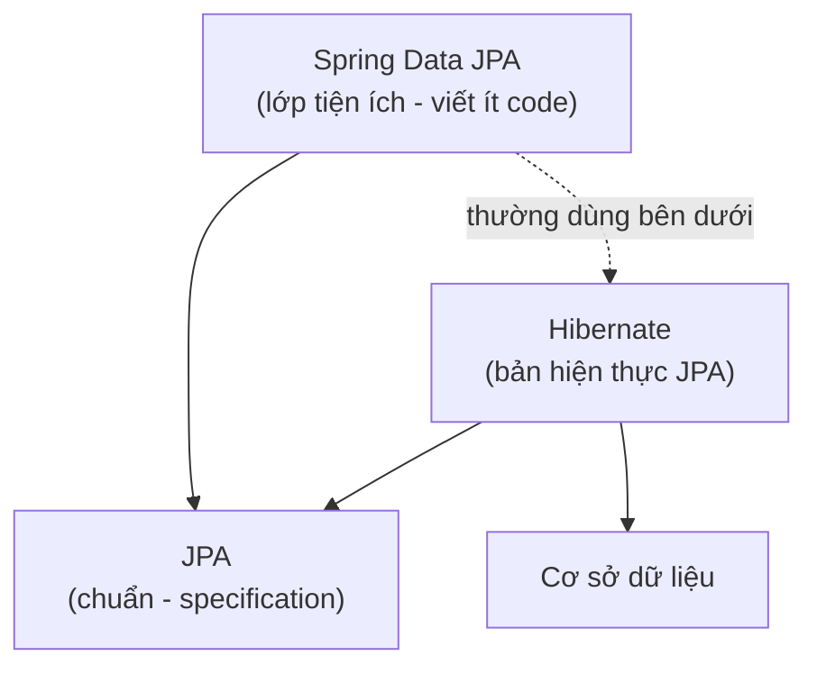
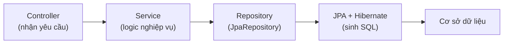

# 4. Spring Data JPA — Cách phổ biến nhất

Spring Data JPA là cách truy cập cơ sở dữ liệu phổ biến nhất khi làm việc với Spring Boot, giúp bạn viết ít code nhất nhờ tự sinh repository. Bài này phân biệt rõ JPA, Hibernate và Spring Data JPA, hướng dẫn khai báo Entity, dùng JpaRepository có sẵn CRUD, tạo truy vấn chỉ bằng cách đặt tên hàm hoặc dùng @Query, cùng cách tổ chức code trong Service và cấu hình kết nối. Đây là kỹ năng bạn sẽ dùng nhiều nhất trong công việc thực tế.

---

## Mục lục

- [Vì sao có Spring Data JPA?](#vì-sao-có-spring-data-jpa)
- [Bối cảnh: JPA, Hibernate, Spring Data JPA](#bối-cảnh-jpa-hibernate-spring-data-jpa)
- [JPA là gì? (chuẩn chung)](#jpa-là-gì-chuẩn-chung)
- [Spring Data JPA tự sinh repository như thế nào?](#spring-data-jpa-tự-sinh-repository-như-thế-nào)
- [Khai báo Entity với JPA](#khai-báo-entity-với-jpa)
- [JpaRepository — kho truy cập dữ liệu có sẵn](#jparepository--kho-truy-cập-dữ-liệu-có-sẵn)
- [Query method — đặt tên hàm là có truy vấn](#query-method--đặt-tên-hàm-là-có-truy-vấn)
- [@Query — viết truy vấn tùy chỉnh (an toàn)](#query--viết-truy-vấn-tùy-chỉnh-an-toàn)
- [Dùng repository trong Service](#dùng-repository-trong-service)
- [Cấu hình kết nối trong Spring Boot](#cấu-hình-kết-nối-trong-spring-boot)
- [Lỗi thường gặp](#lỗi-thường-gặp)
- [Tóm tắt](#tóm-tắt)

---

## Vì sao có Spring Data JPA?

**Vấn đề:** Dù đã có JPA/Hibernate, bạn vẫn phải tự viết lớp DAO/Repository
**lặp đi lặp lại** cho từng entity: mở `EntityManager`, viết CRUD, viết các truy
vấn cơ bản gần như giống nhau. Vừa nhàm chán, vừa dễ sai.

```java
// Tự viết DAO cho mỗi entity — mã lặp lại, nhàm chán, dễ sai
public class UserDao {

    @PersistenceContext
    private EntityManager em;

    public void save(User user) { em.persist(user); }

    public User findById(Long id) { return em.find(User.class, id); }

    public List<User> findAll() {
        return em.createQuery("SELECT u FROM User u", User.class).getResultList();
    }

    public void deleteById(Long id) { em.remove(em.find(User.class, id)); }

    // ...rồi lại viết y hệt cho ProductDao, OrderDao, CategoryDao...
}
```

**Giải pháp:** Spring Data JPA chỉ cần bạn **khai báo một interface** kế thừa
`JpaRepository<Entity, Id>`. Spring **tự sinh** cài đặt CRUD, phân trang, sắp
xếp; tạo truy vấn **chỉ bằng tên method** (`findByEmailAndStatus`), hoặc dùng
`@Query` cho ca phức tạp; tích hợp transaction sẵn. Gần như **không phải viết
code truy cập DB**.

```java
// Chỉ một interface — Spring tự sinh toàn bộ cài đặt lúc chạy
public interface UserRepository extends JpaRepository<User, Long> {

    // Query chỉ bằng tên method — không cần viết SQL/JPQL
    List<User> findByEmailAndStatus(String email, String status);

    // Phân trang + sắp xếp có sẵn nhờ Pageable
    Page<User> findByStatus(String status, Pageable pageable);
}
```

:::tip[Dùng thực tế]

- **CRUD chỉ với interface**: một dòng `extends JpaRepository<User, Long>` là có
  ngay `save`, `findById`, `findAll`, `deleteById`... cho cả entity mới.
- **Query bằng tên method**: cần lọc theo email và trạng thái? Chỉ cần đặt tên
  `findByEmailAndStatus` — Spring tự sinh truy vấn.
- **Phân trang sẵn**: trả `Page<User>` với `Pageable` để làm danh sách có phân
  trang/sắp xếp mà không viết thêm code đếm tổng hay tính offset.
- **Giảm tối đa boilerplate**: bỏ hẳn lớp DAO viết tay cho từng entity, code gọn
  và ít lỗi hơn hẳn.

:::

---

## Bối cảnh: JPA, Hibernate, Spring Data JPA

Ba cái tên này hay gây rối cho người mới. Hãy phân biệt rõ:

- **JPA** (Jakarta/Java Persistence API): một **chuẩn** (specification — bản đặc
  tả quy định "phải làm gì"), không phải code chạy được. Nó định nghĩa các
  annotation như `@Entity`, `@Id` và các giao diện chung.
- **Hibernate**: một **bản hiện thực** (implementation — code thực sự làm việc)
  của chuẩn JPA. Tức Hibernate "làm theo" chuẩn JPA.
- **Spring Data JPA**: một **lớp tiện ích** của Spring, đặt **bên trên** JPA
  (thường dùng Hibernate bên dưới), giúp bạn viết **ít code hơn nữa**.

> Ví dụ đời thường: **JPA** là *luật giao thông* (quy định chung). **Hibernate**
> là *một hãng xe* tuân theo luật đó. **Spring Data JPA** là *tài xế riêng* lái
> hộ bạn — bạn chỉ cần nói điểm đến.

Đây là **cách phổ biến nhất** để truy cập CSDL khi dùng **Spring Boot** (khung
làm việc back-end Java thông dụng nhất hiện nay).

Sơ đồ dưới minh hoạ quan hệ xếp tầng giữa ba khái niệm: Spring Data JPA nằm
trên cùng, tựa vào chuẩn JPA, và thường dùng Hibernate làm bản hiện thực bên dưới:



---

## JPA là gì? (chuẩn chung)

Vì JPA là chuẩn, code dùng annotation JPA có thể chạy với bất kỳ bản hiện thực
nào (Hibernate, EclipseLink...). Các annotation JPA nằm trong gói
`jakarta.persistence.*` — chính là những annotation bạn đã thấy ở bài Hibernate:
`@Entity`, `@Id`, `@GeneratedValue`, `@Column`...

Điểm lợi: bạn học một bộ annotation chuẩn, dùng được ở nhiều nơi.

---

## Spring Data JPA tự sinh repository như thế nào?

Đây là điều "thần kỳ" của Spring Data JPA. Bình thường, để truy cập dữ liệu bạn
phải tự viết một lớp DAO/Repository với đủ phương thức `save`, `findById`,
`findAll`, `delete`... Rất nhiều code lặp lại cho mỗi entity.

Với Spring Data JPA, bạn chỉ cần **khai báo một interface** (giao diện — chỉ
khai báo tên hàm, không viết thân hàm). Spring sẽ **tự động tạo ra lớp hiện
thực** lúc chạy. Bạn **không viết một dòng code thân hàm nào**.

> Ví dụ đời thường: bạn chỉ cần viết **danh sách yêu cầu** ("tôi cần tìm user
> theo email"), Spring tự **thuê người làm** và hoàn thành công việc đó cho bạn.

---

## Khai báo Entity với JPA

Giống hệt bài Hibernate (vì Hibernate hiện thực JPA):

```java
import jakarta.persistence.*;

@Entity                       // Đánh dấu là entity JPA
@Table(name = "users")        // Ánh xạ tới bảng "users"
public class User {

    @Id                                                 // Khóa chính
    @GeneratedValue(strategy = GenerationType.IDENTITY) // id tự tăng
    private Long id;

    @Column(nullable = false)  // Cột name, không được null
    private String name;

    @Column(unique = true)     // Cột email, giá trị duy nhất
    private String email;

    public User() { }          // constructor rỗng bắt buộc

    public User(String name, String email) {
        this.name = name;
        this.email = email;
    }

    // ... getter và setter
    public Long getId() { return id; }
    public String getName() { return name; }
    public void setName(String name) { this.name = name; }
    public String getEmail() { return email; }
    public void setEmail(String email) { this.email = email; }
}
```

---

## JpaRepository — kho truy cập dữ liệu có sẵn

`JpaRepository` là một interface có sẵn của Spring Data JPA, cung cấp **rất nhiều
phương thức CRUD miễn phí**. Bạn chỉ cần tạo interface kế thừa (extends) nó:

```java
import org.springframework.data.jpa.repository.JpaRepository;

// <User, Long>: entity là User, kiểu khóa chính là Long
public interface UserRepository extends JpaRepository<User, Long> {
    // Trống thôi! Đã có sẵn save, findById, findAll, deleteById...
}
```

Chỉ với đoạn trên, bạn đã có ngay các phương thức:

```java
userRepository.save(user);            // thêm mới hoặc cập nhật
userRepository.findById(1L);          // tìm theo id, trả về Optional<User>
userRepository.findAll();             // lấy tất cả
userRepository.deleteById(1L);        // xóa theo id
userRepository.count();               // đếm số bản ghi
userRepository.existsById(1L);        // kiểm tra tồn tại
```

`findById` trả về **`Optional<User>`** (một "hộp" có thể chứa User hoặc rỗng) —
buộc bạn xử lý trường hợp "không tìm thấy", tránh lỗi `NullPointerException`.

---

## Query method — đặt tên hàm là có truy vấn

Đây là tính năng cực hay: bạn chỉ cần **đặt tên phương thức theo quy ước**,
Spring **tự sinh truy vấn** tương ứng. Không cần viết SQL hay HQL.

```java
public interface UserRepository extends JpaRepository<User, Long> {

    // Tìm 1 user theo email → SELECT ... WHERE email = ?
    Optional<User> findByEmail(String email);

    // Tìm tất cả user theo tên → SELECT ... WHERE name = ?
    List<User> findByName(String name);

    // Tìm theo tên VÀ email → WHERE name = ? AND email = ?
    Optional<User> findByNameAndEmail(String name, String email);

    // Tìm tên chứa từ khóa → WHERE name LIKE %?%
    List<User> findByNameContaining(String keyword);

    // Đếm số user theo tên → SELECT COUNT(*) WHERE name = ?
    long countByName(String name);

    // Kiểm tra email đã tồn tại chưa → trả về true/false
    boolean existsByEmail(String email);
}
```

Quy tắc đặt tên: bắt đầu bằng `findBy`, `countBy`, `existsBy`, `deleteBy`... rồi
nối tên thuộc tính và từ khóa (`And`, `Or`, `Containing`, `GreaterThan`,
`OrderBy`...). Spring đọc tên hàm và sinh truy vấn.

> **An toàn bảo mật**: các tham số truyền vào query method được **tham số hóa
> tự động**. Không có chuyện nối chuỗi → không lo SQL injection.

---

## @Query — viết truy vấn tùy chỉnh (an toàn)

Khi truy vấn quá phức tạp để diễn đạt bằng tên hàm, dùng annotation `@Query` để
viết JPQL (Java Persistence Query Language — giống HQL) hoặc SQL gốc.

```java
import org.springframework.data.jpa.repository.Query;
import org.springframework.data.repository.query.Param;

public interface UserRepository extends JpaRepository<User, Long> {

    // JPQL: dùng tên ENTITY (User) và thuộc tính (email)
    // :email là THAM SỐ — an toàn, KHÔNG nối chuỗi
    @Query("SELECT u FROM User u WHERE u.email = :email")
    Optional<User> findByEmailCustom(@Param("email") String email);

    // Truy vấn theo nhiều điều kiện
    @Query("SELECT u FROM User u WHERE u.name = :name AND u.email LIKE %:domain%")
    List<User> searchUsers(@Param("name") String name,
                           @Param("domain") String domain);

    // Nếu thật sự cần SQL gốc (native query), vẫn PHẢI tham số hóa
    @Query(value = "SELECT * FROM users WHERE email = :email",
           nativeQuery = true)
    Optional<User> findByEmailNative(@Param("email") String email);
}
```

> **Quy tắc bảo mật vẫn áp dụng tuyệt đối**: trong `@Query`, luôn dùng tham số
> `:tên` kèm `@Param`. **TUYỆT ĐỐI KHÔNG** nối chuỗi dữ liệu người dùng vào câu
> truy vấn (Spring cũng không cho phép nối chuỗi an toàn trong annotation, nhưng
> đừng tự ý làm điều đó bằng cách khác).

---

## Dùng repository trong Service

Trong Spring, bạn **tiêm** (inject — Spring tự đưa đối tượng vào cho bạn dùng)
repository vào lớp service qua constructor. Đây là cách tổ chức code chuẩn:

```java
import org.springframework.stereotype.Service;
import org.springframework.transaction.annotation.Transactional;

@Service  // Đánh dấu đây là một lớp dịch vụ (chứa logic nghiệp vụ)
public class UserService {

    private final UserRepository userRepository;

    // Spring tự "tiêm" UserRepository vào đây khi tạo UserService
    public UserService(UserRepository userRepository) {
        this.userRepository = userRepository;
    }

    // Tạo user mới
    @Transactional  // chạy trong một giao dịch (commit/rollback tự động)
    public User createUser(String name, String email) {
        // Kiểm tra email trùng trước khi tạo
        if (userRepository.existsByEmail(email)) {
            throw new IllegalArgumentException("Email đã tồn tại: " + email);
        }
        User user = new User(name, email);
        return userRepository.save(user); // Spring tự sinh INSERT
    }

    // Tìm user theo email, ném lỗi rõ ràng nếu không thấy
    public User getByEmail(String email) {
        return userRepository.findByEmail(email)
                .orElseThrow(() ->
                        new IllegalArgumentException("Không tìm thấy: " + email));
    }

    // Lấy tất cả user
    public List<User> getAllUsers() {
        return userRepository.findAll();
    }
}
```

Cách này tách bạch: **Repository** lo truy cập dữ liệu, **Service** lo logic
nghiệp vụ. Code dễ test và dễ bảo trì.

Sơ đồ dưới minh hoạ luồng dữ liệu qua các tầng trong một ứng dụng Spring Boot,
từ Controller xuống tận CSDL:



---

## Cấu hình kết nối trong Spring Boot

Bạn khai báo thông tin CSDL trong file `application.properties` (hoặc
`application.yml`). Spring Boot tự lo phần còn lại — kể cả connection pool
(HikariCP là mặc định).

```properties
# Thông tin kết nối CSDL — thực tế nên đọc từ biến môi trường, không hardcode
spring.datasource.url=jdbc:mysql://localhost:3306/mydb
spring.datasource.username=${DB_USER}
spring.datasource.password=${DB_PASSWORD}

# Hibernate (bản hiện thực JPA): tự cập nhật cấu trúc bảng theo entity
# (chỉ nên dùng "update" khi học/dev; production cần công cụ migration riêng)
spring.jpa.hibernate.ddl-auto=update

# In ra câu SQL Hibernate sinh ra (giúp học và debug)
spring.jpa.show-sql=true
```

> Lưu ý bảo mật: không hardcode mật khẩu trong file cấu hình đưa lên Git. Dùng
> biến môi trường (`${DB_PASSWORD}`) như ví dụ trên.

---

## Lỗi thường gặp

- **Quên `@Entity` hoặc `@Id`** → Spring báo lỗi khi khởi động ứng dụng.
- **Đặt sai tên query method** (sai tên thuộc tính) → lỗi lúc khởi động, ví dụ
  `findByEmial` (gõ nhầm) sẽ báo không tìm thấy thuộc tính `emial`.
- **Không xử lý `Optional`** từ `findById`/`findByEmail` → gọi `.get()` bừa khi
  rỗng sẽ ném `NoSuchElementException`. Hãy dùng `orElseThrow` hoặc `isPresent`.
- **Quên `@Param`** trong `@Query` có tham số tên → lỗi binding tham số.
- **Dùng `ddl-auto=update` trên production** → rủi ro mất/hỏng dữ liệu. Dùng
  công cụ migration (Flyway, Liquibase) cho production.
- **Tự ý nối chuỗi để "lách" `@Query`** → mở cửa cho SQL injection. Đừng làm vậy.

---

## Tóm tắt

- **JPA** là *chuẩn*; **Hibernate** là *bản hiện thực*; **Spring Data JPA** là
  *lớp tiện ích* của Spring đặt trên JPA — **phổ biến nhất với Spring Boot**.
- Khai báo entity bằng annotation JPA giống Hibernate (`@Entity`, `@Id`...).
- Tạo interface kế thừa **`JpaRepository<Entity, IdType>`** là có sẵn CRUD.
- **Query method**: đặt tên hàm như `findByEmail`, Spring tự sinh truy vấn.
- **`@Query`**: viết truy vấn tùy chỉnh (JPQL hoặc native), **luôn dùng `:param`
  + `@Param`**, không nối chuỗi → chống SQL injection.
- Tiêm repository vào **Service** qua constructor; dùng `@Transactional`.
- Cấu hình CSDL trong `application.properties`; Spring Boot tự lo pool (HikariCP).
