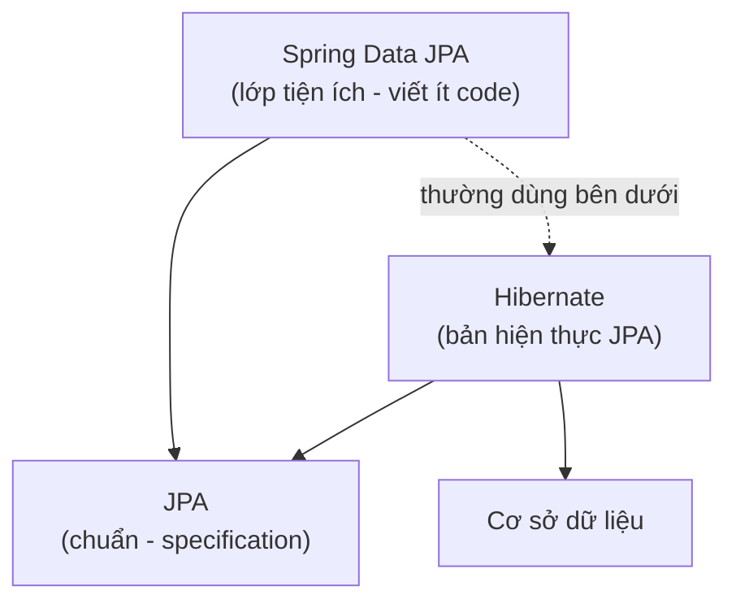
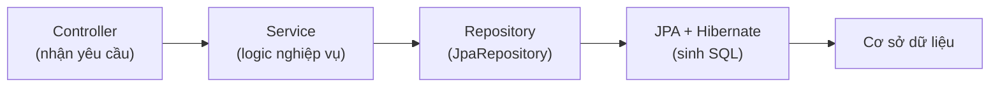

# 4. Spring Data JPA — Cách phổ biến nhất

Spring Data JPA là cách truy cập cơ sở dữ liệu phổ biến nhất khi làm việc với Spring Boot, giúp bạn viết ít code nhất nhờ tự sinh repository. Bài này phân biệt rõ JPA, Hibernate và Spring Data JPA, hướng dẫn khai báo Entity, dùng JpaRepository có sẵn CRUD, tạo truy vấn chỉ bằng cách đặt tên hàm hoặc dùng @Query, cùng cách tổ chức code trong Service và cấu hình kết nối. Đây là kỹ năng bạn sẽ dùng nhiều nhất trong công việc thực tế.

[](pathname:///img/java/spring-data-jpa.webp)

---

:::note[Ghi nhớ nhanh]

- ⭐ **Phân biệt JPA / Hibernate / Spring Data JPA** — JPA là *chuẩn*, Hibernate là *bản hiện thực*, Spring Data JPA là *lớp tiện ích* trên cùng (phổ biến nhất với Spring Boot).
- ⭐ **`JpaRepository<Entity, Id>`** — chỉ khai báo interface là có sẵn `save`, `findById`, `findAll`, `deleteById`, phân trang, sắp xếp.
- **Query method** — đặt tên hàm như `findByEmailAndStatus` là Spring tự sinh truy vấn.
- **`@Query`** — viết JPQL/native tùy chỉnh; luôn dùng `:param` + `@Param`, không nối chuỗi.
- **Tổ chức code** — tiêm repository vào `@Service` qua constructor, dùng `@Transactional`; cấu hình CSDL trong `application.properties`.

:::

---

## Mục lục

- [Vì sao có Spring Data JPA?](#vì-sao-có-spring-data-jpa)
- [Bối cảnh: JPA, Hibernate, Spring Data JPA](#bối-cảnh-jpa-hibernate-spring-data-jpa)
- [JPA là gì? (chuẩn chung)](#jpa-là-gì-chuẩn-chung)
- [Spring Data JPA tự sinh repository như thế nào?](#spring-data-jpa-tự-sinh-repository-như-thế-nào)
- [Khai báo Entity với JPA](#khai-báo-entity-với-jpa)
- [JpaRepository — kho truy cập dữ liệu có sẵn](#jparepository--kho-truy-cập-dữ-liệu-có-sẵn)
- [Query method — đặt tên hàm là có truy vấn](#query-method--đặt-tên-hàm-là-có-truy-vấn)
- [@Query — viết truy vấn tùy chỉnh (an toàn)](#query--viết-truy-vấn-tùy-chỉnh-an-toàn)
- [Dùng repository trong Service](#dùng-repository-trong-service)
- [Cấu hình kết nối trong Spring Boot](#cấu-hình-kết-nối-trong-spring-boot)
- [Lỗi thường gặp](#lỗi-thường-gặp)
- [Tóm tắt](#tóm-tắt)
- [Câu hỏi phỏng vấn](#câu-hỏi-phỏng-vấn)

---

## Vì sao có Spring Data JPA?

**Vấn đề:** Dù đã có JPA/Hibernate, bạn vẫn phải tự viết lớp DAO/Repository **lặp đi lặp lại** cho từng entity: mở `EntityManager`, viết CRUD, viết các truy vấn cơ bản gần như giống nhau. Vừa nhàm chán, vừa dễ sai.

```java
// Tự viết DAO cho mỗi entity — mã lặp lại, nhàm chán, dễ sai
public class UserDao {

    @PersistenceContext
    private EntityManager em;

    public void save(User user) { em.persist(user); }

    public User findById(Long id) { return em.find(User.class, id); }

    public List<User> findAll() {
        return em.createQuery("SELECT u FROM User u", User.class).getResultList();
    }

    public void deleteById(Long id) { em.remove(em.find(User.class, id)); }

    // ...rồi lại viết y hệt cho ProductDao, OrderDao, CategoryDao...
}
```

**Giải pháp:** Spring Data JPA chỉ cần bạn **khai báo một interface** kế thừa `JpaRepository<Entity, Id>`. Spring **tự sinh** cài đặt CRUD, phân trang, sắp xếp; tạo truy vấn **chỉ bằng tên method** (`findByEmailAndStatus`), hoặc dùng `@Query` cho ca phức tạp; tích hợp transaction sẵn. Gần như **không phải viết code truy cập DB**.

```java
// Chỉ một interface — Spring tự sinh toàn bộ cài đặt lúc chạy
public interface UserRepository extends JpaRepository<User, Long> {

    // Query chỉ bằng tên method — không cần viết SQL/JPQL
    List<User> findByEmailAndStatus(String email, String status);

    // Phân trang + sắp xếp có sẵn nhờ Pageable
    Page<User> findByStatus(String status, Pageable pageable);
}
```

:::tip[Dùng thực tế]

- **CRUD chỉ với interface**: một dòng `extends JpaRepository<User, Long>` là có ngay `save`, `findById`, `findAll`, `deleteById`... cho cả entity mới.
- **Query bằng tên method**: cần lọc theo email và trạng thái? Chỉ cần đặt tên `findByEmailAndStatus` — Spring tự sinh truy vấn.
- **Phân trang sẵn**: trả `Page<User>` với `Pageable` để làm danh sách có phân trang/sắp xếp mà không viết thêm code đếm tổng hay tính offset.
- **Giảm tối đa boilerplate**: bỏ hẳn lớp DAO viết tay cho từng entity, code gọn và ít lỗi hơn hẳn.

:::

---

## Bối cảnh: JPA, Hibernate, Spring Data JPA

Ba cái tên này hay gây rối cho người mới. Hãy phân biệt rõ:

- **JPA** (Jakarta/Java Persistence API): một **chuẩn** (specification — bản đặc tả quy định "phải làm gì"), không phải code chạy được. Nó định nghĩa các annotation như `@Entity`, `@Id` và các giao diện chung.
- **Hibernate**: một **bản hiện thực** (implementation — code thực sự làm việc) của chuẩn JPA. Tức Hibernate "làm theo" chuẩn JPA.
- **Spring Data JPA**: một **lớp tiện ích** của Spring, đặt **bên trên** JPA (thường dùng Hibernate bên dưới), giúp bạn viết **ít code hơn nữa**.

> Ví dụ đời thường: **JPA** là *luật giao thông* (quy định chung). **Hibernate** là *một hãng xe* tuân theo luật đó. **Spring Data JPA** là *tài xế riêng* lái hộ bạn — bạn chỉ cần nói điểm đến.

Đây là **cách phổ biến nhất** để truy cập CSDL khi dùng **Spring Boot** (khung làm việc back-end Java thông dụng nhất hiện nay).

Sơ đồ dưới minh hoạ quan hệ xếp tầng giữa ba khái niệm: Spring Data JPA nằm trên cùng, tựa vào chuẩn JPA, và thường dùng Hibernate làm bản hiện thực bên dưới:


```mermaid
flowchart TD
    SDJ["Spring Data JPA<br/>(lớp tiện ích - viết ít code)"] --> JPA["JPA<br/>(chuẩn - specification)"]
    HB["Hibernate<br/>(bản hiện thực JPA)"] --> JPA
    SDJ -.->|"thường dùng bên dưới"| HB
    HB --> DB["Cơ sở dữ liệu"]
```

---

## JPA là gì? (chuẩn chung)

Vì JPA là chuẩn, code dùng annotation JPA có thể chạy với bất kỳ bản hiện thực nào (Hibernate, EclipseLink...). Các annotation JPA nằm trong gói `jakarta.persistence.*` — chính là những annotation bạn đã thấy ở bài Hibernate: `@Entity`, `@Id`, `@GeneratedValue`, `@Column`...

Điểm lợi: bạn học một bộ annotation chuẩn, dùng được ở nhiều nơi.

---

## Spring Data JPA tự sinh repository như thế nào?

Đây là điều "thần kỳ" của Spring Data JPA. Bình thường, để truy cập dữ liệu bạn phải tự viết một lớp DAO/Repository với đủ phương thức `save`, `findById`, `findAll`, `delete`... Rất nhiều code lặp lại cho mỗi entity.

Với Spring Data JPA, bạn chỉ cần **khai báo một interface** (giao diện — chỉ khai báo tên hàm, không viết thân hàm). Spring sẽ **tự động tạo ra lớp hiện thực** lúc chạy. Bạn **không viết một dòng code thân hàm nào**.

> Ví dụ đời thường: bạn chỉ cần viết **danh sách yêu cầu** ("tôi cần tìm user theo email"), Spring tự **thuê người làm** và hoàn thành công việc đó cho bạn.

---

## Khai báo Entity với JPA

Giống hệt bài Hibernate (vì Hibernate hiện thực JPA):

```java
import jakarta.persistence.*;

@Entity                       // Đánh dấu là entity JPA
@Table(name = "users")        // Ánh xạ tới bảng "users"
public class User {

    @Id                                                 // Khóa chính
    @GeneratedValue(strategy = GenerationType.IDENTITY) // id tự tăng
    private Long id;

    @Column(nullable = false)  // Cột name, không được null
    private String name;

    @Column(unique = true)     // Cột email, giá trị duy nhất
    private String email;

    public User() { }          // constructor rỗng bắt buộc

    public User(String name, String email) {
        this.name = name;
        this.email = email;
    }

    // ... getter và setter
    public Long getId() { return id; }
    public String getName() { return name; }
    public void setName(String name) { this.name = name; }
    public String getEmail() { return email; }
    public void setEmail(String email) { this.email = email; }
}
```

---

## JpaRepository — kho truy cập dữ liệu có sẵn

`JpaRepository` là một interface có sẵn của Spring Data JPA, cung cấp **rất nhiều phương thức CRUD miễn phí**. Bạn chỉ cần tạo interface kế thừa (extends) nó:

```java
import org.springframework.data.jpa.repository.JpaRepository;

// <User, Long>: entity là User, kiểu khóa chính là Long
public interface UserRepository extends JpaRepository<User, Long> {
    // Trống thôi! Đã có sẵn save, findById, findAll, deleteById...
}
```

Chỉ với đoạn trên, bạn đã có ngay các phương thức:

```java
userRepository.save(user);            // thêm mới hoặc cập nhật
userRepository.findById(1L);          // tìm theo id, trả về Optional<User>
userRepository.findAll();             // lấy tất cả
userRepository.deleteById(1L);        // xóa theo id
userRepository.count();               // đếm số bản ghi
userRepository.existsById(1L);        // kiểm tra tồn tại
```

`findById` trả về **`Optional<User>`** (một "hộp" có thể chứa User hoặc rỗng) — buộc bạn xử lý trường hợp "không tìm thấy", tránh lỗi `NullPointerException`.

---

## Query method — đặt tên hàm là có truy vấn

Đây là tính năng cực hay: bạn chỉ cần **đặt tên phương thức theo quy ước**, Spring **tự sinh truy vấn** tương ứng. Không cần viết SQL hay HQL.

```java
public interface UserRepository extends JpaRepository<User, Long> {

    // Tìm 1 user theo email → SELECT ... WHERE email = ?
    Optional<User> findByEmail(String email);

    // Tìm tất cả user theo tên → SELECT ... WHERE name = ?
    List<User> findByName(String name);

    // Tìm theo tên VÀ email → WHERE name = ? AND email = ?
    Optional<User> findByNameAndEmail(String name, String email);

    // Tìm tên chứa từ khóa → WHERE name LIKE %?%
    List<User> findByNameContaining(String keyword);

    // Đếm số user theo tên → SELECT COUNT(*) WHERE name = ?
    long countByName(String name);

    // Kiểm tra email đã tồn tại chưa → trả về true/false
    boolean existsByEmail(String email);
}
```

Quy tắc đặt tên: bắt đầu bằng `findBy`, `countBy`, `existsBy`, `deleteBy`... rồi nối tên thuộc tính và từ khóa (`And`, `Or`, `Containing`, `GreaterThan`, `OrderBy`...). Spring đọc tên hàm và sinh truy vấn.

> **An toàn bảo mật**: các tham số truyền vào query method được **tham số hóa tự động**. Không có chuyện nối chuỗi → không lo SQL injection.

---

## @Query — viết truy vấn tùy chỉnh (an toàn)

Khi truy vấn quá phức tạp để diễn đạt bằng tên hàm, dùng annotation `@Query` để viết JPQL (Java Persistence Query Language — giống HQL) hoặc SQL gốc.

```java
import org.springframework.data.jpa.repository.Query;
import org.springframework.data.repository.query.Param;

public interface UserRepository extends JpaRepository<User, Long> {

    // JPQL: dùng tên ENTITY (User) và thuộc tính (email)
    // :email là THAM SỐ — an toàn, KHÔNG nối chuỗi
    @Query("SELECT u FROM User u WHERE u.email = :email")
    Optional<User> findByEmailCustom(@Param("email") String email);

    // Truy vấn theo nhiều điều kiện
    @Query("SELECT u FROM User u WHERE u.name = :name AND u.email LIKE %:domain%")
    List<User> searchUsers(@Param("name") String name,
                           @Param("domain") String domain);

    // Nếu thật sự cần SQL gốc (native query), vẫn PHẢI tham số hóa
    @Query(value = "SELECT * FROM users WHERE email = :email",
           nativeQuery = true)
    Optional<User> findByEmailNative(@Param("email") String email);
}
```

> **Quy tắc bảo mật vẫn áp dụng tuyệt đối**: trong `@Query`, luôn dùng tham số `:tên` kèm `@Param`. **TUYỆT ĐỐI KHÔNG** nối chuỗi dữ liệu người dùng vào câu truy vấn (Spring cũng không cho phép nối chuỗi an toàn trong annotation, nhưng đừng tự ý làm điều đó bằng cách khác).

---

## Dùng repository trong Service

Trong Spring, bạn **tiêm** (inject — Spring tự đưa đối tượng vào cho bạn dùng) repository vào lớp service qua constructor. Đây là cách tổ chức code chuẩn:

```java
import org.springframework.stereotype.Service;
import org.springframework.transaction.annotation.Transactional;

@Service  // Đánh dấu đây là một lớp dịch vụ (chứa logic nghiệp vụ)
public class UserService {

    private final UserRepository userRepository;

    // Spring tự "tiêm" UserRepository vào đây khi tạo UserService
    public UserService(UserRepository userRepository) {
        this.userRepository = userRepository;
    }

    // Tạo user mới
    @Transactional  // chạy trong một giao dịch (commit/rollback tự động)
    public User createUser(String name, String email) {
        // Kiểm tra email trùng trước khi tạo
        if (userRepository.existsByEmail(email)) {
            throw new IllegalArgumentException("Email đã tồn tại: " + email);
        }
        User user = new User(name, email);
        return userRepository.save(user); // Spring tự sinh INSERT
    }

    // Tìm user theo email, ném lỗi rõ ràng nếu không thấy
    public User getByEmail(String email) {
        return userRepository.findByEmail(email)
                .orElseThrow(() ->
                        new IllegalArgumentException("Không tìm thấy: " + email));
    }

    // Lấy tất cả user
    public List<User> getAllUsers() {
        return userRepository.findAll();
    }
}
```

Cách này tách bạch: **Repository** lo truy cập dữ liệu, **Service** lo logic nghiệp vụ. Code dễ test và dễ bảo trì.

Sơ đồ dưới minh hoạ luồng dữ liệu qua các tầng trong một ứng dụng Spring Boot, từ Controller xuống tận CSDL:


```mermaid
flowchart LR
    C["Controller<br/>(nhận yêu cầu)"] --> S["Service<br/>(logic nghiệp vụ)"]
    S --> R["Repository<br/>(JpaRepository)"]
    R --> J["JPA + Hibernate<br/>(sinh SQL)"]
    J --> DB["Cơ sở dữ liệu"]
```

---

## Cấu hình kết nối trong Spring Boot

Bạn khai báo thông tin CSDL trong file `application.properties` (hoặc `application.yml`). Spring Boot tự lo phần còn lại — kể cả connection pool (HikariCP là mặc định).

```properties
# Thông tin kết nối CSDL — thực tế nên đọc từ biến môi trường, không hardcode
spring.datasource.url=jdbc:mysql://localhost:3306/mydb
spring.datasource.username=${DB_USER}
spring.datasource.password=${DB_PASSWORD}

# Hibernate (bản hiện thực JPA): tự cập nhật cấu trúc bảng theo entity
# (chỉ nên dùng "update" khi học/dev; production cần công cụ migration riêng)
spring.jpa.hibernate.ddl-auto=update

# In ra câu SQL Hibernate sinh ra (giúp học và debug)
spring.jpa.show-sql=true
```

> Lưu ý bảo mật: không hardcode mật khẩu trong file cấu hình đưa lên Git. Dùng biến môi trường (`${DB_PASSWORD}`) như ví dụ trên.

---

## Lỗi thường gặp

- **Quên `@Entity` hoặc `@Id`** → Spring báo lỗi khi khởi động ứng dụng.
- **Đặt sai tên query method** (sai tên thuộc tính) → lỗi lúc khởi động, ví dụ `findByEmial` (gõ nhầm) sẽ báo không tìm thấy thuộc tính `emial`.
- **Không xử lý `Optional`** từ `findById`/`findByEmail` → gọi `.get()` bừa khi rỗng sẽ ném `NoSuchElementException`. Hãy dùng `orElseThrow` hoặc `isPresent`.
- **Quên `@Param`** trong `@Query` có tham số tên → lỗi binding tham số.
- **Dùng `ddl-auto=update` trên production** → rủi ro mất/hỏng dữ liệu. Dùng công cụ migration (Flyway, Liquibase) cho production.
- **Tự ý nối chuỗi để "lách" `@Query`** → mở cửa cho SQL injection. Đừng làm vậy.

---

## Tóm tắt

- **JPA** là *chuẩn*; **Hibernate** là *bản hiện thực*; **Spring Data JPA** là *lớp tiện ích* của Spring đặt trên JPA — **phổ biến nhất với Spring Boot**.
- Khai báo entity bằng annotation JPA giống Hibernate (`@Entity`, `@Id`...).
- Tạo interface kế thừa **`JpaRepository<Entity, IdType>`** là có sẵn CRUD.
- **Query method**: đặt tên hàm như `findByEmail`, Spring tự sinh truy vấn.
- **`@Query`**: viết truy vấn tùy chỉnh (JPQL hoặc native), **luôn dùng `:param`
  + `@Param`**, không nối chuỗi → chống SQL injection.
- Tiêm repository vào **Service** qua constructor; dùng `@Transactional`.
- Cấu hình CSDL trong `application.properties`; Spring Boot tự lo pool (HikariCP).

---

## Câu hỏi phỏng vấn

Những câu thường gặp về chủ đề này. Tự trả lời trước, rồi bấm **Xem đáp án** để đối chiếu.

**1. Phân biệt rõ ràng JPA, Hibernate và Spring Data JPA. Vì sao ba khái niệm này thường gây nhầm lẫn cho người mới?**

<details className="qa">
<summary>Xem đáp án</summary>

- **JPA** (Jakarta Persistence API): một **chuẩn (specification)** — quy định các annotation (`@Entity`, `@Id`...) và interface (`EntityManager`...), nhưng bản thân không phải code chạy được.
- **Hibernate**: một **bản hiện thực (implementation)** của chuẩn JPA — là code thực sự thực thi các quy định đó, tự sinh SQL, quản lý entity...
- **Spring Data JPA**: một **lớp tiện ích** đặt **bên trên** JPA (thường dùng Hibernate làm bản hiện thực bên dưới), giúp giảm code hơn nữa bằng cách tự sinh cả tầng repository chỉ từ một interface khai báo.

Nhầm lẫn thường đến từ việc cả ba đều "làm việc với CSDL bằng đối tượng" và dùng chung annotation (`@Entity`...), khiến người mới khó phân biệt ranh giới: JPA là **luật chơi**, Hibernate là **người chơi tuân theo luật**, Spring Data JPA là **trợ lý** giúp bạn chơi nhanh hơn dựa trên luật đó.

</details>

**2. `JpaRepository<User, Long>` chỉ là một interface trống, không có thân hàm nào. Vậy khi gọi `userRepository.save(user)`, ai thực sự thực thi logic lưu vào CSDL?**

<details className="qa">
<summary>Xem đáp án</summary>

Spring Data JPA dùng cơ chế **proxy động (dynamic proxy)**: lúc ứng dụng khởi động, Spring **quét** các interface kế thừa `JpaRepository`, rồi **tự sinh ra một class hiện thực (implementation)** ở runtime cho từng interface đó (thường tên dạng `SimpleJpaRepository`), triển khai sẵn các phương thức chuẩn như `save`, `findById`, `findAll`...

Khi bạn gọi `userRepository.save(user)`, thực chất bạn đang gọi vào **bean proxy** mà Spring đã tạo và đăng ký sẵn (nhờ dependency injection) — proxy này bên trong gọi tới `EntityManager` của JPA (thường do Hibernate hiện thực) để thực sự chạy `persist`/`merge`. Bạn không bao giờ tự viết class implement `UserRepository`, toàn bộ được sinh và tiêm tự động.

</details>

**3. Viết một query method (dùng quy ước đặt tên) cho `ProductRepository` để: tìm tất cả sản phẩm có giá lớn hơn một giá trị cho trước VÀ thuộc một danh mục cụ thể, sắp xếp theo giá tăng dần.**

<details className="qa">
<summary>Xem đáp án</summary>

```java
public interface ProductRepository extends JpaRepository<Product, Long> {

    List<Product> findByPriceGreaterThanAndCategoryOrderByPriceAsc(
            BigDecimal price, String category);
}
```

Giải thích cấu trúc tên: `findBy` (bắt đầu truy vấn) + `PriceGreaterThan` (điều kiện `price > ?`) + `And` (nối điều kiện) + `Category` (điều kiện `category = ?`) + `OrderByPriceAsc` (sắp xếp theo `price` tăng dần). Spring Data JPA đọc đúng tên hàm này và tự sinh câu JPQL tương ứng, không cần viết thêm dòng code nào.

</details>

**4. Khi nào nên dùng query method (đặt tên hàm), khi nào nên chuyển sang `@Query`?**

<details className="qa">
<summary>Xem đáp án</summary>

- **Query method** phù hợp khi điều kiện truy vấn **đơn giản, ít mệnh đề** — tên hàm vẫn còn dễ đọc, ví dụ `findByEmailAndStatus`. Ưu điểm: không cần viết gì thêm, Spring tự sinh.
- **`@Query`** nên dùng khi:
  - Điều kiện phức tạp khiến tên hàm theo quy ước trở nên **quá dài, khó đọc** (ví dụ nhiều `And`/`Or` lồng nhau, điều kiện `JOIN` giữa nhiều entity).
  - Cần viết truy vấn có **phép tính, hàm tổng hợp phức tạp** (subquery, `GROUP BY` nhiều tầng) mà quy ước đặt tên không diễn đạt được.
  - Cần **native query** (SQL gốc) để tận dụng tính năng đặc thù của CSDL mà JPQL không hỗ trợ.

Nguyên tắc chung: ưu tiên query method cho các trường hợp đơn giản để giữ code gọn, chỉ chuyển sang `@Query` khi tên hàm bắt đầu trở nên khó đọc hoặc không đủ biểu đạt.

</details>

**5. Đoạn code sau tiềm ẩn lỗi gì khi user không tồn tại? Sửa lại theo cách an toàn.**

```java
public User getUser(Long id) {
    return userRepository.findById(id).get();
}
```

<details className="qa">
<summary>Xem đáp án</summary>

`findById(id)` trả về **`Optional<User>`** — một "hộp" có thể rỗng nếu không tìm thấy user tương ứng. Gọi thẳng `.get()` mà không kiểm tra trước sẽ ném ra **`NoSuchElementException`** nếu `Optional` đang rỗng, và thông báo lỗi mặc định này **không rõ ràng** cho người dùng API (không nói rõ "user không tồn tại").

Sửa lại theo cách xử lý tường minh, thường dùng `orElseThrow(...)` để ném ra một exception nghiệp vụ rõ ràng hơn:

```java
public User getUser(Long id) {
    return userRepository.findById(id)
            .orElseThrow(() -> new IllegalArgumentException("Không tìm thấy user id = " + id));
}
```

Cách này giúp tầng gọi phía trên (ví dụ `@ExceptionHandler` trong Controller) dễ dàng bắt đúng loại exception và trả về status code phù hợp (ví dụ `404 Not Found`).

</details>

**6. `@Transactional` làm gì? Mặc định, nó tự động rollback khi gặp loại exception nào, và khi nào KHÔNG tự rollback?**

<details className="qa">
<summary>Xem đáp án</summary>

`@Transactional` đánh dấu một phương thức (hoặc class) chạy trong một **giao dịch (transaction)**: mọi thao tác ghi dữ liệu bên trong hoặc **thành công toàn bộ (commit)**, hoặc **hủy toàn bộ (rollback)** nếu có lỗi — đảm bảo dữ liệu không bị ở trạng thái "nửa vời".

Mặc định, Spring chỉ tự động **rollback khi gặp `RuntimeException`** (unchecked exception, bao gồm cả các exception con của nó) hoặc `Error`. Với **checked exception** (ví dụ tự khai báo `throws SomeCheckedException extends Exception`), Spring **KHÔNG tự rollback** trừ khi bạn khai báo rõ ràng:

```java
@Transactional(rollbackFor = SomeCheckedException.class)
public void doSomething() throws SomeCheckedException {
    // nếu SomeCheckedException được ném ra, giao dịch vẫn rollback nhờ khai báo trên
}
```

Đây là điểm dễ gây lỗi tiềm ẩn: nếu code nghiệp vụ ném checked exception mà quên khai báo `rollbackFor`, dữ liệu đã ghi trước đó **vẫn được commit** dù có lỗi xảy ra sau đó — gây ra tình trạng dữ liệu không nhất quán ngoài ý muốn.

</details>

**7. Ứng dụng không khởi động được, log báo lỗi liên quan tới `findByEmial` trong `UserRepository`. Nguyên nhân có khả năng cao nhất là gì?**

```java
public interface UserRepository extends JpaRepository<User, Long> {
    Optional<User> findByEmial(String email); // ???
}
```

<details className="qa">
<summary>Xem đáp án</summary>

Nguyên nhân: gõ sai tên thuộc tính trong tên phương thức — `findByEmial` thay vì `findByEmail`. Spring Data JPA phân tích tên hàm để suy ra tên **thuộc tính (field)** cần lọc trong entity; nó tìm thuộc tính tên `emial` trong class `User` nhưng **không tồn tại** thuộc tính nào tên như vậy (entity chỉ có `email`).

Vì việc phân tích và sinh truy vấn diễn ra **lúc khởi động ứng dụng** (Spring cần xác thực mọi query method hợp lệ trước khi ứng dụng sẵn sàng phục vụ), lỗi này khiến ứng dụng **không khởi động được** ngay từ đầu, thay vì chỉ lỗi khi gọi tới hàm đó lúc chạy — đây thực ra là một điểm tốt: lỗi được phát hiện sớm thay vì âm thầm gây bug lúc runtime.

Sửa lại: đổi tên đúng chính tả `findByEmail`.

</details>

**8. `spring.jpa.hibernate.ddl-auto=update` tiện lợi khi phát triển nhưng vì sao **không nên** dùng trên production? Nên thay thế bằng cách nào?**

<details className="qa">
<summary>Xem đáp án</summary>

`ddl-auto=update` khiến Hibernate **tự động thay đổi cấu trúc bảng** (thêm cột, đổi kiểu dữ liệu...) dựa trên sự khác biệt giữa Entity hiện tại và schema đang có trong CSDL, mỗi khi ứng dụng khởi động.

Rủi ro trên production:

- Hibernate có thể suy luận **sai ý định** của lập trình viên khi cấu trúc entity thay đổi (ví dụ đổi tên field: Hibernate có thể hiểu thành "thêm cột mới" thay vì "đổi tên cột cũ", khiến dữ liệu cột cũ bị bỏ quên hoặc mất).
- Không có **lịch sử thay đổi (migration history)** rõ ràng, khó biết chính xác schema đã thay đổi ra sao qua từng phiên bản, khó rollback khi có sự cố.
- Chạy tự động lúc khởi động nghĩa là một lần deploy sai sót có thể **thay đổi schema production ngay lập tức**, không có bước rà soát/duyệt trước.

Thay thế bằng công cụ **migration chuyên dụng** như **Flyway** hoặc **Liquibase**: mỗi thay đổi schema được viết thành một file migration có đánh số thứ tự, được review trước khi áp dụng, chạy theo đúng trình tự và ghi lại lịch sử đầy đủ — an toàn và có thể kiểm soát hơn nhiều so với để Hibernate tự đoán.

</details>

**9. Bạn có `List<User> findAll()` rồi lặp qua từng user để lấy `user.getOrders().size()`, gây ra vấn đề N+1 giống như ở Hibernate thuần. Trong Spring Data JPA, có cách nào để khai báo tải sẵn quan hệ `orders` mà không cần tự viết JPQL với `JOIN FETCH`?**

<details className="qa">
<summary>Xem đáp án</summary>

Có thể dùng annotation **`@EntityGraph`** để khai báo "khi chạy truy vấn này, tải sẵn kèm quan hệ nào" mà không cần tự viết JPQL:

```java
public interface UserRepository extends JpaRepository<User, Long> {

    @EntityGraph(attributePaths = "orders")
    List<User> findAll(); // ghi đè findAll() mặc định, tải sẵn orders trong 1 câu truy vấn
}
```

Cách khác là vẫn dùng `@Query` với `JOIN FETCH` tường minh:

```java
@Query("SELECT u FROM User u JOIN FETCH u.orders")
List<User> findAllWithOrders();
```

Cả hai cách đều giải quyết được vấn đề N+1 bằng cách gộp việc tải `orders` vào cùng một câu truy vấn ban đầu; `@EntityGraph` thường gọn hơn khi chỉ cần khai báo "tải kèm gì" mà không cần viết lại toàn bộ câu truy vấn.

</details>

**10. Thiết kế một endpoint trả về danh sách sản phẩm có phân trang và sắp xếp, cho phép client tùy chỉnh qua query string (ví dụ `?page=0&size=20&sort=price,desc`). Hãy viết signature của Repository method và Controller tương ứng.**

<details className="qa">
<summary>Xem đáp án</summary>

```java
// Repository: JpaRepository đã có sẵn hàm nhận Pageable
public interface ProductRepository extends JpaRepository<Product, Long> {
    // Không cần viết thêm gì nếu chỉ cần phân trang toàn bộ sản phẩm —
    // findAll(Pageable) đã có sẵn từ JpaRepository (PagingAndSortingRepository)
}

// Controller: Spring tự parse tham số page/size/sort thành Pageable
@RestController
@RequestMapping("/products")
public class ProductController {

    private final ProductRepository productRepository;

    public ProductController(ProductRepository productRepository) {
        this.productRepository = productRepository;
    }

    @GetMapping
    public Page<Product> getProducts(Pageable pageable) {
        // Pageable được Spring tự tạo từ query string ?page=0&size=20&sort=price,desc
        return productRepository.findAll(pageable);
    }
}
```

`Page<Product>` trả về không chỉ danh sách sản phẩm của trang hiện tại mà còn kèm metadata hữu ích (tổng số phần tử, tổng số trang...), giúp client tự dựng giao diện phân trang mà không cần API riêng để đếm tổng.

</details>

**11. Vì sao Controller không nên gọi trực tiếp `Repository` mà nên đi qua tầng `Service`, dù về mặt kỹ thuật Controller hoàn toàn có thể tiêm `UserRepository` thẳng vào và gọi `save()`, `findById()`?**

<details className="qa">
<summary>Xem đáp án</summary>

Về mặt kỹ thuật, Controller có thể tiêm `Repository` trực tiếp và gọi được, nhưng đây là **thực hành không tốt** vì:

- **Trộn lẫn trách nhiệm**: Controller chỉ nên lo tiếp nhận request/trả response; logic nghiệp vụ (validate, kiểm tra trùng lặp, tính toán, gọi nhiều repository phối hợp với nhau, quản lý transaction) nên tập trung ở Service — nếu để lẫn vào Controller, code khó tái sử dụng và khó test.
- **`@Transactional` cần đặt ở đúng tầng**: các thao tác cần đảm bảo tính toàn vẹn giao dịch (ví dụ trừ tiền tài khoản A và cộng tiền tài khoản B phải cùng thành công hoặc cùng thất bại) cần được gộp trong một phương thức `@Transactional` ở Service — Controller gọi trực tiếp nhiều lời gọi Repository rời rạc sẽ **không đảm bảo tính nguyên tử (atomicity)** giữa các thao tác đó.
- **Dễ tái sử dụng logic**: nếu sau này có thêm một nguồn gọi khác (ví dụ một job chạy nền, hoặc một Controller khác) cần logic tương tự, đặt logic ở Service cho phép tái sử dụng, trong khi đặt trong Controller thì logic đó chỉ dùng được ở đúng endpoint đó.

</details>

**12. `@Transactional(readOnly = true)` khác gì `@Transactional` thông thường? Vì sao nên dùng nó cho các phương thức chỉ đọc dữ liệu?**

<details className="qa">
<summary>Xem đáp án</summary>

`@Transactional(readOnly = true)` báo cho Spring (và tầng bên dưới như Hibernate) biết phương thức này **chỉ đọc dữ liệu, không có thao tác ghi nào**. Dựa trên thông tin này:

- **Hibernate có thể bỏ qua cơ chế dirty checking** (theo dõi thay đổi entity để tự sinh `UPDATE`) cho các entity được tải trong giao dịch này, vì biết chắc sẽ không có thay đổi nào cần lưu — giảm chi phí bộ nhớ và CPU khi tải nhiều entity.
- Một số driver CSDL hoặc connection pool có thể **tối ưu riêng cho giao dịch chỉ đọc** (ví dụ định tuyến tới một database replica chỉ đọc trong kiến trúc có read replica).

```java
@Transactional(readOnly = true)
public List<User> getAllUsers() {
    return userRepository.findAll();
}
```

Nguyên tắc thực hành tốt: đánh dấu `readOnly = true` cho mọi phương thức Service chỉ đọc dữ liệu, giữ `@Transactional` thông thường (mặc định `readOnly = false`) cho các phương thức có ghi (tạo, sửa, xóa) — vừa rõ ràng về ý định, vừa tận dụng được tối ưu hiệu năng có sẵn.

</details>
