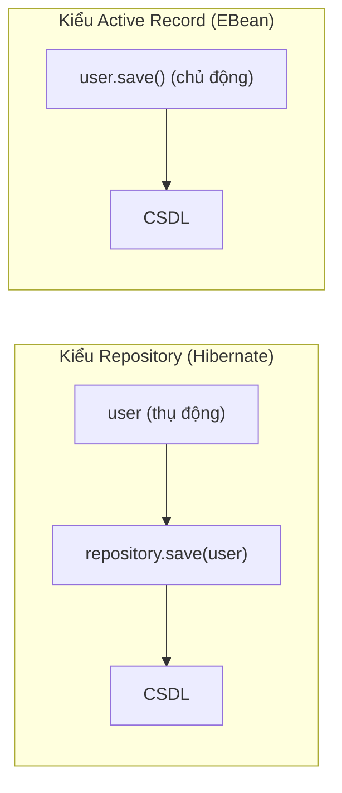

# 5. EBean — ORM kiểu Active Record

EBean là một thư viện ORM cho Java theo phong cách Active Record, nổi bật vì cú pháp gọn gàng khi đối tượng tự biết cách lưu chính nó bằng cách gọi `user.save()`. Bài này giải thích Active Record là gì, cách khai báo Model, thực hiện CRUD và truy vấn với Finder, đồng thời so sánh EBean với Hibernate để bạn biết khi nào nên cân nhắc dùng nó.

[](pathname:///img/java/ebean.webp)

---

:::note[Ghi nhớ nhanh]

- ⭐ **EBean theo phong cách Active Record** — đối tượng tự lưu chính nó bằng `user.save()`/`user.delete()`, không cần `EntityManager`.
- **Khai báo Model** — kế thừa `io.ebean.Model`, dùng annotation JPA quen thuộc (`@Entity`, `@Id`, `@Column`).
- **Truy vấn bằng `Finder`** — `find.byId()`, `find.query().where().eq(...)`, `.findOne()`, `.findList()`.
- **Luôn truyền tham số** — qua `.eq()`, `.like()`; EBean tham số hóa mặc định, chống SQL injection.
- ⭐ **Ít phổ biến hơn Spring Data JPA** — dễ học, hợp dự án nhỏ và Play Framework; thực tế nên ưu tiên Spring Data JPA.

:::

---

## Mục lục

- [Vì sao có EBean?](#vì-sao-có-ebean)
- [EBean là gì?](#ebean-là-gì)
- [Active Record là gì?](#active-record-là-gì)
- [Khai báo Model](#khai-báo-model)
- [Lưu, cập nhật, xóa: model.save()](#lưu-cập-nhật-xóa-modelsave)
- [Tìm kiếm với Finder và query](#tìm-kiếm-với-finder-và-query)
- [So sánh EBean với Hibernate](#so-sánh-ebean-với-hibernate)
- [Lỗi thường gặp](#lỗi-thường-gặp)
- [Tóm tắt](#tóm-tắt)
- [Câu hỏi phỏng vấn](#câu-hỏi-phỏng-vấn)

---

## Vì sao có EBean?

**Vấn đề:** JPA/Hibernate rất mạnh nhưng đi kèm khái niệm nặng: `EntityManager`, `PersistenceContext`, trạng thái `detached`/`attached`, `flush`, `merge`... Một đoạn code đơn giản cũng cần nhiều bước:

```java
// Hibernate / Spring Data JPA
EntityManager em = emf.createEntityManager();
em.getTransaction().begin();

User user = new User("Nguyen An", "an@example.com");
em.persist(user);            // phải gọi qua EntityManager

em.getTransaction().commit();
em.close();                  // phải nhớ đóng session
```

Khi entity bị "detached" khỏi `EntityManager`, cập nhật không được lưu và lỗi `LazyInitializationException` hay `detached entity passed to persist` xuất hiện mà khó đoán nguyên nhân.

**Giải pháp:** EBean bỏ hoàn toàn khái niệm persistence context. Entity tự biết cách lưu chính nó — không cần `EntityManager`, không cần quản lý trạng thái attached/detached:

```java
// EBean — không cần EntityManager, không cần transaction thủ công
User user = new User("Nguyen An", "an@example.com");
user.save();   // xong, EBean lo phần còn lại

user.setEmail("new@example.com");
user.save();   // cập nhật — vẫn cùng một lời gọi đơn giản
```

:::tip[Dùng thực tế]
- Dự án vừa và nhỏ cần CRUD nhanh, không muốn cấu hình nặng như Hibernate.
- Prototype hoặc tool nội bộ cần code gọn, ít boilerplate.
- Backend game hoặc ứng dụng Play Framework (EBean là ORM mặc định của Play).
- Nhóm nhỏ quen phong cách Active Record (Ruby on Rails) chuyển sang Java.
:::

---

## EBean là gì?

**EBean** là một thư viện **ORM** cho Java, nổi bật vì cú pháp **gọn gàng, dễ đọc**. Điểm khác biệt lớn nhất so với Hibernate là EBean theo phong cách **Active Record** (sẽ giải thích ngay dưới), giúp code ngắn và trực quan hơn cho các thao tác đơn giản.

> Ví dụ đời thường: nếu Hibernate là chiếc xe nhiều nút bấm và tính năng, thì EBean là chiếc xe điện đơn giản — ít nút hơn, lái dễ hơn cho nhu cầu thường ngày.

---

## Active Record là gì?

**Active Record** (bản ghi chủ động) là một mẫu thiết kế trong đó **bản thân đối tượng biết cách lưu chính nó** vào CSDL. Tức là đối tượng vừa chứa dữ liệu, vừa có sẵn các phương thức như `save()`, `delete()`.

So sánh nhanh:

- **Kiểu Repository** (Hibernate/Spring Data): bạn gọi `repository.save(user)`. Đối tượng `user` *thụ động* — có một "kho" lo việc lưu.
- **Kiểu Active Record** (EBean): bạn gọi `user.save()`. Đối tượng `user` *chủ động* — tự lo việc lưu chính nó.

> Ví dụ đời thường: Active Record giống như nhân viên **tự nộp báo cáo** lên hệ thống (`báo_cáo.nộp()`), thay vì đưa cho thư ký nộp hộ (`thư_ký.nộp(báo_cáo)`).

Sơ đồ dưới so sánh trực quan hai phong cách: bên trái đối tượng thụ động cần "kho" trung gian, bên phải đối tượng tự lưu chính nó:



---

## Khai báo Model

Trong EBean, entity thường kế thừa `io.ebean.Model` để có sẵn `save()`, `delete()`. Các annotation ánh xạ vẫn dùng chuẩn JPA quen thuộc.

```java
import io.ebean.Model;
import jakarta.persistence.*;

@Entity                       // Ánh xạ tới bảng (chuẩn JPA, giống Hibernate)
@Table(name = "users")        // Tên bảng "users"
public class User extends Model {  // Kế thừa Model để có save()/delete()

    @Id                                                 // Khóa chính
    @GeneratedValue(strategy = GenerationType.IDENTITY) // id tự tăng
    private Long id;

    @Column(nullable = false)  // cột name, không null
    private String name;

    @Column(unique = true)     // cột email, duy nhất
    private String email;

    public User() { }

    public User(String name, String email) {
        this.name = name;
        this.email = email;
    }

    // ... getter và setter
    public Long getId() { return id; }
    public String getName() { return name; }
    public void setName(String name) { this.name = name; }
    public String getEmail() { return email; }
    public void setEmail(String email) { this.email = email; }
}
```

---

## Lưu, cập nhật, xóa: model.save()

Vì `User` kế thừa `Model`, mọi thao tác CRUD gọi **trực tiếp trên đối tượng**:

```java
// --- CREATE: thêm mới ---
User user = new User("Nguyen An", "an@example.com");
user.save();   // đối tượng tự lưu chính nó vào CSDL (INSERT)

// --- UPDATE: cập nhật ---
user.setEmail("new@example.com");
user.save();   // cùng phương thức save() — EBean biết đây là cập nhật (UPDATE)

// --- DELETE: xóa ---
user.delete(); // đối tượng tự xóa chính nó (DELETE)
```

Cú pháp rất ngắn gọn: không cần `SessionFactory`, không cần `repository`, không cần mở/đóng session thủ công cho các thao tác cơ bản. EBean **mặc định tham số hóa** mọi truy vấn nên **an toàn trước SQL injection**.

---

## Tìm kiếm với Finder và query

Để truy vấn, EBean dùng đối tượng **`Finder`** (bộ tìm kiếm) hoặc API query. Cách phổ biến là khai báo một `Finder` tĩnh ngay trong model:

```java
import io.ebean.Finder;

@Entity
@Table(name = "users")
public class User extends Model {
    // ... các thuộc tính như trên

    // Finder<KiểuKhóaChính, KiểuEntity> — công cụ tìm kiếm cho User
    public static final Finder<Long, User> find = new Finder<>(User.class);
}
```

Sau đó dùng `find` để truy vấn. Lưu ý: dùng **`.eq()`, `.like()`** với tham số, EBean **tự tham số hóa** — KHÔNG nối chuỗi:

```java
// Tìm theo khóa chính id = 1
User user = User.find.byId(1L);

// Tìm 1 user theo email — eq() truyền tham số an toàn, KHÔNG nối chuỗi SQL
User byEmail = User.find.query()
        .where().eq("email", "an@example.com")  // điều kiện email = ?
        .findOne();                              // lấy 1 kết quả

// Tìm danh sách user có tên chứa từ khóa, sắp xếp theo tên
List<User> list = User.find.query()
        .where().like("name", "%An%")            // name LIKE ?
        .orderBy("name asc")
        .findList();                             // lấy danh sách

// Đếm số user
int total = User.find.query().findCount();
```

> **Quy tắc bảo mật**: luôn truyền giá trị qua `.eq()`, `.like()`, `.setParameter()`... để EBean tham số hóa. **KHÔNG** tự ghép chuỗi điều kiện với dữ liệu người dùng.

---

## So sánh EBean với Hibernate

| Tiêu chí | Hibernate / Spring Data | EBean |
|----------|-------------------------|-------|
| Phong cách | Repository (đối tượng thụ động) | Active Record (`user.save()`) |
| Cú pháp CRUD | `repository.save(user)` | `user.save()` |
| Độ phổ biến | Rất cao (chuẩn ngành) | Thấp hơn, ngách riêng |
| Đường cong học | Dốc hơn, nhiều khái niệm | Thoải hơn, trực quan |
| Truy vấn | HQL/JPQL, `@Query` | Query builder gọn (`.where().eq()`) |
| Hệ sinh thái | Khổng lồ (Spring Boot...) | Nhỏ hơn |
| Bảo mật | Tham số hóa mặc định | Tham số hóa mặc định |

Tóm lại: EBean **dễ học và viết nhanh** cho dự án vừa và nhỏ nhờ phong cách Active Record. Nhưng trong thực tế công việc (đặc biệt với Spring Boot), **Hibernate + Spring Data JPA vẫn phổ biến hơn rất nhiều** và có cộng đồng, tài liệu lớn hơn. Người mới nên ưu tiên học Spring Data JPA trước, biết EBean như một lựa chọn thay thế.

---

## Lỗi thường gặp

- **Quên kế thừa `Model`** → không có `save()`/`delete()` trên đối tượng.
- **Quên `@Id`** → EBean không biết khóa chính, báo lỗi.
- **Nhầm `findOne()` với `findList()`**: `findOne()` lấy đúng 1 kết quả (ném lỗi nếu có nhiều); `findList()` lấy danh sách. Chọn đúng theo nhu cầu.
- **Tự nối chuỗi trong điều kiện `where`** → dính SQL injection. Luôn dùng `.eq()`, `.like()` với tham số.
- **Quên cấu hình EBean** (file `ebean.properties` hoặc tích hợp build plugin) → app không chạy được.

---

## Tóm tắt

- **EBean** là ORM Java theo phong cách **Active Record**: đối tượng tự biết lưu/xóa chính nó (`user.save()`, `user.delete()`).
- Khai báo model kế thừa `io.ebean.Model`, dùng annotation JPA quen thuộc.
- Truy vấn bằng **`Finder`** và query builder: `find.byId()`, `find.query().where().eq(...)`, `.findOne()`, `.findList()`.
- **Luôn truyền tham số** qua `.eq()`, `.like()`... — EBean tham số hóa mặc định, chống SQL injection. KHÔNG nối chuỗi.
- So với Hibernate/Spring Data JPA: EBean **gọn và dễ học hơn**, nhưng **ít phổ biến hơn**. Thực tế nên ưu tiên Spring Data JPA.

---

## Câu hỏi phỏng vấn

Những câu thường gặp về chủ đề này. Tự trả lời trước, rồi bấm **Xem đáp án** để đối chiếu.

**1. Phân biệt mẫu thiết kế Active Record (EBean) và Repository (Hibernate/Spring Data JPA). Cho ví dụ cú pháp của mỗi kiểu.**

<details className="qa">
<summary>Xem đáp án</summary>

- **Active Record**: bản thân đối tượng **chủ động** biết cách lưu/xóa chính nó — đối tượng vừa chứa dữ liệu vừa chứa hành vi lưu trữ. Ví dụ: `user.save()`, `user.delete()`.
- **Repository**: đối tượng dữ liệu **thụ động**, việc lưu trữ được giao cho một đối tượng "kho" (repository) riêng biệt xử lý. Ví dụ: `userRepository.save(user)`.

Sự khác biệt cốt lõi nằm ở **ai chịu trách nhiệm lưu trữ**: với Active Record, trách nhiệm đó nằm ngay trong entity; với Repository, trách nhiệm đó được tách ra một tầng riêng, giữ entity chỉ tập trung vào dữ liệu.

</details>

**2. Vì sao EBean tránh được các lỗi kiểu "detached entity passed to persist" hay `LazyInitializationException` thường gặp ở Hibernate?**

<details className="qa">
<summary>Xem đáp án</summary>

Các lỗi đó ở Hibernate xuất phát từ khái niệm **persistence context** (`Session`/`EntityManager`) quản lý trạng thái entity (`attached`/`detached`) — một entity chỉ có thể lazy-load hoặc được Hibernate tự động theo dõi thay đổi khi vẫn còn nằm trong một `Session`/`EntityManager` đang mở; thao tác sai thời điểm (ví dụ sau khi Session đã đóng) sẽ gây lỗi.

**EBean bỏ hoàn toàn khái niệm persistence context**: không có `Session`, không có trạng thái attached/detached để quản lý. Mỗi lần gọi `user.save()`, EBean tự xử lý toàn bộ việc kết nối, ghi dữ liệu và đóng lại ngay trong lời gọi đó — không có khái niệm "entity bị tách khỏi ngữ cảnh" vì bản thân không tồn tại "ngữ cảnh" nào cần entity phải gắn vào liên tục. Nhờ đơn giản hóa mô hình này, lớp lỗi liên quan tới persistence context của Hibernate không xuất hiện ở EBean.

</details>

**3. Để một class Java trở thành Model của EBean có `save()`/`delete()`, cần khai báo những gì?**

<details className="qa">
<summary>Xem đáp án</summary>

```java
import io.ebean.Model;
import jakarta.persistence.*;

@Entity                            // Annotation JPA chuẩn, giống Hibernate
@Table(name = "users")
public class User extends Model {  // Bắt buộc: kế thừa io.ebean.Model

    @Id
    @GeneratedValue(strategy = GenerationType.IDENTITY)
    private Long id;

    // ... các field khác với @Column
}
```

Hai điều kiện bắt buộc: (1) đánh dấu `@Entity` như JPA thông thường để EBean biết đây là entity ánh xạ tới bảng, và (2) **kế thừa `io.ebean.Model`** — đây là điểm khác biệt so với Hibernate, vì `Model` chính là nơi cung cấp sẵn các phương thức `save()`, `delete()` cho mọi entity kế thừa nó.

</details>

**4. `find.byId(1L).findOne()`-style và `findList()` khác nhau thế nào? Điều gì xảy ra nếu dùng `findOne()` cho một điều kiện khớp nhiều hơn 1 bản ghi?**

<details className="qa">
<summary>Xem đáp án</summary>

- **`findOne()`**: kỳ vọng kết quả truy vấn **đúng 0 hoặc 1 bản ghi**. Trả về `null` nếu không có kết quả nào.
- **`findList()`**: trả về **danh sách (`List`)** kết quả, dùng cho truy vấn có thể khớp nhiều bản ghi.

Nếu điều kiện truyền cho `findOne()` thực tế khớp **nhiều hơn 1 bản ghi** trong CSDL, EBean sẽ ném ra exception (thường liên quan tới việc kết quả trả về nhiều hơn 1 dòng ngoài mong đợi), vì `findOne()` không được thiết kế để xử lý trường hợp có nhiều kết quả — đây là dấu hiệu cho thấy điều kiện lọc chưa đủ chặt để xác định duy nhất một bản ghi (ví dụ lọc theo một cột không phải khóa duy nhất).

</details>

**5. Đoạn code sau có vấn đề bảo mật gì? Sửa lại cho đúng cách của EBean.**

```java
String keyword = userInput;
List<User> users = User.find.query()
        .where().raw("name LIKE '%" + keyword + "%'")
        .findList();
```

<details className="qa">
<summary>Xem đáp án</summary>

Vấn đề: dùng `.raw(...)` để **tự ghép chuỗi** điều kiện SQL với dữ liệu người dùng (`keyword`) — đây chính là lỗ hổng **SQL injection**, y hệt việc nối chuỗi trong `Statement` của JDBC thuần. Dù EBean có cơ chế tham số hóa mặc định qua các hàm như `.eq()`, `.like()`, việc dùng `.raw()` với chuỗi tự ghép sẽ **vô hiệu hóa hoàn toàn** lớp bảo vệ đó.

Sửa lại bằng `.like()` với tham số được EBean tự động tham số hóa:

```java
String keyword = userInput;
List<User> users = User.find.query()
        .where().like("name", "%" + keyword + "%") // "%...%" chỉ là mẫu, EBean vẫn tham số hóa giá trị
        .findList();
```

Lưu ý: dù `keyword` được ghép với ký tự `%` ngay trong code Java, giá trị cuối cùng vẫn được EBean truyền xuống CSDL như **một tham số duy nhất** (giống `PreparedStatement.setString`), không bị diễn giải thành cú pháp SQL — khác hoàn toàn với việc ghép trực tiếp vào chuỗi câu lệnh như `.raw(...)` ở trên.

</details>

**6. So sánh EBean và Hibernate/Spring Data JPA theo các tiêu chí: phong cách CRUD, độ phổ biến, đường cong học tập.**

<details className="qa">
<summary>Xem đáp án</summary>

| Tiêu chí | Hibernate/Spring Data JPA | EBean |
|---|---|---|
| Phong cách CRUD | Repository — đối tượng thụ động (`repository.save(user)`) | Active Record — đối tượng chủ động (`user.save()`) |
| Độ phổ biến | Rất cao, gần như mặc định khi dùng Spring Boot | Thấp hơn nhiều, dùng trong các ngách cụ thể (Play Framework...) |
| Đường cong học | Dốc hơn — nhiều khái niệm (Session/EntityManager, persistence context) | Thoải hơn — ít khái niệm, cú pháp trực quan |
| Hệ sinh thái | Khổng lồ, tài liệu và cộng đồng rất lớn | Nhỏ hơn, ít tài liệu tiếng Việt/cộng đồng hỗ trợ |

Do độ phổ biến chênh lệch lớn, phần lớn lộ trình học Java backend nên ưu tiên Hibernate/Spring Data JPA; EBean là kiến thức "biết thêm" hữu ích khi làm việc với Play Framework hoặc thích phong cách Active Record.

</details>

**7. Bạn tham gia một dự án nhỏ dùng Play Framework, đội ngũ quen phong cách Ruby on Rails. Vì sao EBean (ORM mặc định của Play) là lựa chọn hợp lý ở đây hơn là cấu hình thêm Hibernate?**

<details className="qa">
<summary>Xem đáp án</summary>

- **EBean là ORM tích hợp sẵn của Play Framework** — không cần thêm cấu hình phức tạp để tích hợp một ORM khác vào; dùng đúng công cụ mặc định giúp giảm rủi ro xung đột cấu hình và tận dụng tài liệu chính thức của Play (vốn đã hướng dẫn theo EBean).
- **Phong cách Active Record của EBean gần gũi với Ruby on Rails** (vốn cũng dùng Active Record) — đội ngũ quen Rails sẽ thấy `user.save()` tự nhiên và nhanh tiếp cận hơn nhiều so với việc phải học thêm khái niệm `Session`/`EntityManager` của Hibernate.
- **Dự án nhỏ, ít nhu cầu truy vấn phức tạp**: lợi thế "kiểm soát chi tiết, hệ sinh thái lớn" của Hibernate/Spring Data JPA phát huy rõ nhất ở dự án lớn, nhiều truy vấn phức tạp — với quy mô nhỏ, chi phí học thêm Hibernate có thể không xứng đáng so với lợi ích.

Tình huống này minh họa nguyên tắc chung: chọn công cụ theo đúng bối cảnh dự án (framework đang dùng, kinh nghiệm đội ngũ, quy mô), không phải luôn chọn công cụ phổ biến nhất một cách máy móc.

</details>

**8. Đoạn code sau gọi `save()` hai lần. Vì sao EBean biết lần gọi thứ hai là `UPDATE` chứ không phải tạo thêm một bản ghi `INSERT` mới?**

```java
User user = new User("Nguyen An", "an@example.com");
user.save();   // (1)

user.setEmail("new@example.com");
user.save();   // (2)
```

<details className="qa">
<summary>Xem đáp án</summary>

EBean phân biệt dựa trên việc **khóa chính (`id`) đã có giá trị hay chưa**:

- Ở lần gọi **(1)**, `user` vừa được tạo bằng `new User(...)`, field `id` đang là `null` (chưa có giá trị) — EBean hiểu đây là một entity **mới**, nên sinh câu `INSERT`. Sau khi `INSERT` thành công, EBean **tự gán giá trị `id`** mới sinh (nhờ `@GeneratedValue`) ngược lại vào field `id` của object `user`.
- Ở lần gọi **(2)**, `user` (vẫn là cùng một object, giờ đã có `id` khác `null` từ bước trên) được sửa `email` rồi gọi lại `save()` — vì `id` **đã có giá trị**, EBean hiểu đây là entity **đã tồn tại** trong CSDL, nên sinh câu `UPDATE` dựa trên `id` đó thay vì `INSERT` thêm một bản ghi mới.

Đây là quy tắc chung của nhiều ORM theo phong cách Active Record: trạng thái "mới hay đã tồn tại" được suy ra từ việc khóa chính có giá trị hay không, chứ không cần bạn tự gọi hai hàm khác nhau cho tạo mới và cập nhật.

</details>

**9. Active Record (như EBean) bị phê bình là vi phạm nguyên tắc "Single Responsibility" (một class chỉ nên có một trách nhiệm). Hãy giải thích lời phê bình này và nêu một hệ quả thực tế khi viết unit test.**

<details className="qa">
<summary>Xem đáp án</summary>

Lời phê bình: một entity theo phong cách Active Record (ví dụ `User extends Model`) đang gánh **hai trách nhiệm khác nhau** cùng lúc:

- **Trách nhiệm 1 — biểu diễn dữ liệu nghiệp vụ**: chứa các field như `name`, `email` và logic nghiệp vụ liên quan tới đối tượng đó.
- **Trách nhiệm 2 — biết cách lưu trữ**: chứa cả logic kết nối, thực thi thao tác với CSDL (thông qua `save()`, `delete()` kế thừa từ `Model`).

Nguyên tắc **Single Responsibility** (một phần của SOLID) cho rằng một class chỉ nên có **một lý do để thay đổi** — nhưng entity Active Record có thể phải thay đổi vì lý do nghiệp vụ (thêm field mới) **hoặc** vì lý do hạ tầng lưu trữ (đổi cách kết nối CSDL), vi phạm nguyên tắc này.

Hệ quả thực tế khi viết unit test: muốn viết **unit test thuần** (không cần CSDL thật) cho logic nghiệp vụ nằm trong entity, bạn khó tách rời được vì entity đã "dính chặt" với hành vi lưu trữ — test dễ trở thành integration test (cần CSDL thật hoặc CSDL giả lập) thay vì unit test độc lập nhanh gọn. Ngược lại, với mẫu Repository (Hibernate/Spring Data), entity (`User`) hoàn toàn tách biệt khỏi logic lưu trữ (`UserRepository`), nên có thể test logic nghiệp vụ của `User` mà không cần đụng tới bất kỳ thứ gì liên quan tới CSDL.

</details>
