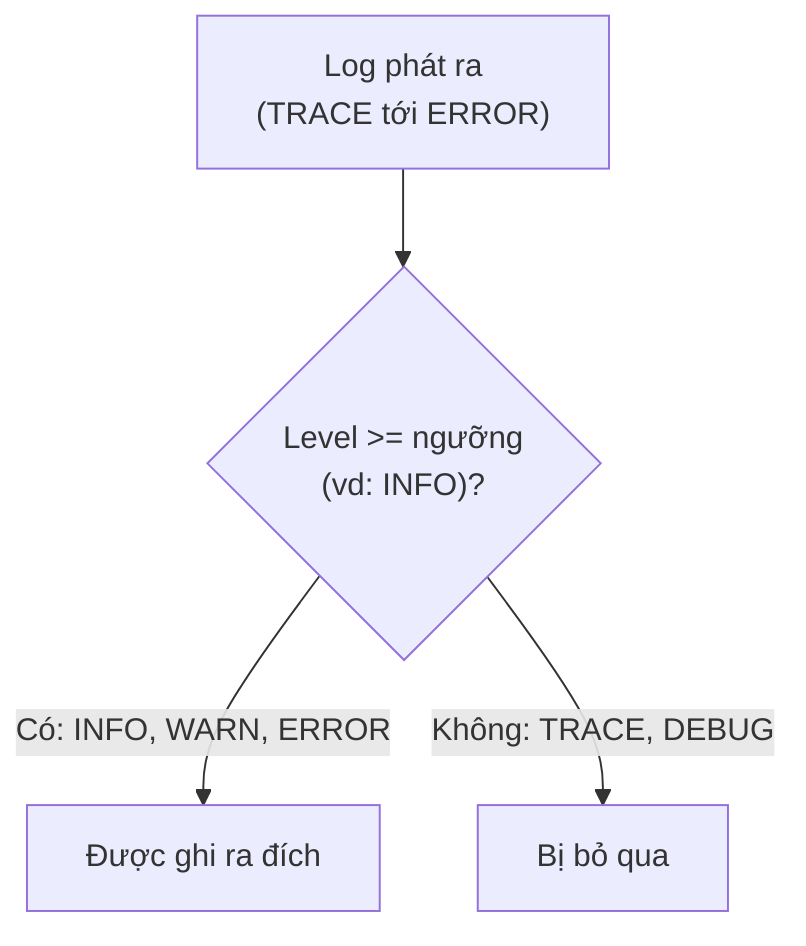
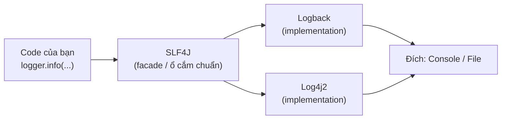

# 1. Tổng quan về Logging

Logging là việc chương trình ghi lại nhật ký hoạt động trong khi chạy, giúp bạn gỡ lỗi, theo dõi và truy vết sự cố ngay cả khi không ngồi trước màn hình. Bài này giải thích logging là gì, vì sao không nên dùng System.out.println trong dự án thật, các mức log từ TRACE tới ERROR, sự khác nhau giữa facade và implementation, cùng tổng quan các thư viện phổ biến. Đây là bài mở đầu; các thư viện cụ thể được nói kỹ ở các bài sau.

---

## Mục lục

- [Logging là gì?](#logging-là-gì)
- [Vì sao KHÔNG nên dùng System.out.println?](#vì-sao-không-nên-dùng-systemoutprintln)
- [Các mức log (Log Levels)](#các-mức-log-log-levels)
- [Facade và Implementation](#facade-và-implementation)
- [So sánh các thư viện logging phổ biến](#so-sánh-các-thư-viện-logging-phổ-biến)
- [Một dòng log gồm những gì?](#một-dòng-log-gồm-những-gì)
- [Lỗi thường gặp](#lỗi-thường-gặp)
- [Tóm tắt](#tóm-tắt)

---

## Logging là gì?

**Logging** (ghi nhật ký) là việc chương trình ghi lại các thông tin về những gì nó đang làm,
trong khi nó chạy. Mỗi thông tin được ghi ra gọi là một **log** (bản ghi nhật ký).

Hãy tưởng tượng bạn là một bác sĩ. Khi khám bệnh, bạn ghi vào **sổ bệnh án** (medical record):
"8h sáng bệnh nhân sốt 39 độ", "9h uống thuốc", "10h hạ sốt". Nếu sau này bệnh nhân
trở nặng, bạn mở sổ ra xem lại để biết chuyện gì đã xảy ra.

Logging trong lập trình cũng y hệt như vậy. Chương trình ghi lại:

- "Người dùng `an@gmail.com` vừa đăng nhập lúc 8h00".
- "Đang gọi tới ngân hàng để thanh toán đơn hàng #1234".
- "LỖI: Không kết nối được tới cơ sở dữ liệu".

Khi ứng dụng gặp sự cố lúc 3h sáng (mà bạn đang ngủ), bạn không thể ngồi nhìn màn hình
để xem nó chạy ra sao. Nhưng nhờ có log đã ghi lại, sáng hôm sau bạn mở file log lên
và biết chính xác chuyện gì đã xảy ra. Đó là lý do logging cực kỳ quan trọng.

### Logging dùng để làm gì?

- **Gỡ lỗi (debugging):** tìm xem chương trình sai ở đâu.
- **Theo dõi (monitoring):** biết hệ thống đang khỏe hay yếu.
- **Kiểm toán (audit):** ghi lại "ai đã làm gì, lúc nào" để truy vết sau này.
- **Phân tích:** đếm xem mỗi ngày có bao nhiêu người dùng, lỗi nào hay xảy ra.

---

## Vì sao KHÔNG nên dùng System.out.println?

Khi mới học Java, ai cũng dùng `System.out.println(...)` để in thông tin ra màn hình:

```java
// CÁCH "NGHIỆP DƯ" - chỉ nên dùng khi học thử
System.out.println("Người dùng đăng nhập: " + email);
```

Cách này chạy được, nhưng KHÔNG dùng trong dự án thật vì những lý do sau:

1. **Không phân loại mức độ quan trọng.** Một thông báo lỗi nghiêm trọng và một dòng
   thông tin bình thường đều in giống hệt nhau, không phân biệt được.

2. **Không tắt/bật được.** Khi ứng dụng chạy thật (production), bạn muốn ẩn các dòng
   debug chi tiết để màn hình gọn gàng. Với `println` thì bạn phải xóa từng dòng code,
   rất mệt và dễ sai.

3. **Không ghi vào file được.** `println` chỉ in ra màn hình rồi biến mất. Tắt máy là
   mất hết. Log thật cần lưu vào file để xem lại.

4. **Không có thông tin bổ sung.** Log "xịn" tự động kèm theo thời gian, tên lớp, tên
   luồng (thread)... còn `println` thì bạn phải tự gõ tất cả.

5. **Chậm và không an toàn đa luồng.** `System.out` ghi đồng bộ, khi nhiều luồng cùng
   in sẽ làm chậm chương trình.

Vì vậy, lập trình viên chuyên nghiệp dùng **thư viện logging** (logging framework).

---

## Các mức log (Log Levels)

**Log level** (mức độ log) cho biết một bản ghi quan trọng tới đâu. Đây là cách phân loại
giống như mức báo động: từ "thông tin vặt" tới "cháy nhà". Từ thấp tới cao:

| Mức | Ý nghĩa | Ví dụ đời thường |
|-----|---------|------------------|
| **TRACE** | Chi tiết nhất, theo dõi từng bước nhỏ | "Vừa bước chân trái, rồi bước chân phải" |
| **DEBUG** | Thông tin để gỡ lỗi | "Giá trị biến `tong = 150`" |
| **INFO** | Thông tin bình thường, hệ thống đang chạy ổn | "Người dùng đăng nhập thành công" |
| **WARN** | Cảnh báo, chưa lỗi nhưng cần để ý | "Ổ đĩa còn 10% dung lượng" |
| **ERROR** | Lỗi, một việc gì đó đã thất bại | "Không gửi được email cho khách" |

Có một quy tắc quan trọng: bạn chọn một mức làm "ngưỡng", thì hệ thống chỉ ghi các log
**từ mức đó trở lên**. Ví dụ nếu chọn ngưỡng là `INFO`, thì:

- TRACE, DEBUG: **bị bỏ qua** (vì thấp hơn INFO).
- INFO, WARN, ERROR: **được ghi** (vì bằng hoặc cao hơn INFO).

Nhờ vậy, khi chạy thật bạn đặt ngưỡng `INFO` để màn hình gọn, còn khi gỡ lỗi bạn hạ
xuống `DEBUG` để xem chi tiết, mà KHÔNG cần sửa một dòng code nào.

```java
// Ví dụ dùng các mức log khác nhau
logger.trace("Bắt đầu vòng lặp lần thứ {}", i);   // chi tiết nhất
logger.debug("Giá trị tổng tạm tính = {}", tong);  // để gỡ lỗi
logger.info("Đơn hàng {} đã được tạo", maDonHang);  // thông tin bình thường
logger.warn("Bộ nhớ đệm gần đầy: {}%", phanTram);   // cảnh báo
logger.error("Thanh toán thất bại cho đơn {}", id); // lỗi
```

Sơ đồ dưới minh hoạ cách một log bị lọc theo ngưỡng level (ví dụ ngưỡng đặt là `INFO`):



---

## Facade và Implementation

Đây là khái niệm quan trọng nhất khi học logging trong Java. Có hai loại thư viện:

- **Facade** (mặt tiền / lớp trừu tượng): chỉ là một bộ "công tắc" tiêu chuẩn để bạn
  gọi `logger.info(...)`. Nó KHÔNG tự ghi log ra đâu cả.
- **Implementation** (bản cài đặt thật): mới là thứ thực sự ghi log ra màn hình hoặc
  file.

Hãy tưởng tượng **ổ cắm điện** trong nhà. Cái ổ cắm (facade) là chuẩn chung: mọi thiết
bị đều cắm vừa. Nhưng điện thực sự đến từ nhà máy điện (implementation). Bạn có thể đổi
nhà máy điện (thủy điện sang điện mặt trời) mà KHÔNG cần đục tường thay ổ cắm.

Trong Java:

- **Facade** phổ biến nhất là **SLF4J** (Simple Logging Facade for Java).
- **Implementation** phổ biến là **Logback**, **Log4j2**.

Lợi ích: code của bạn chỉ "nói chuyện" với SLF4J. Hôm nay bạn dùng Logback để ghi log,
mai muốn đổi sang Log4j2 thì chỉ cần đổi thư viện, KHÔNG phải sửa code nghiệp vụ.

```text
[Code của bạn]  -->  [SLF4J: facade]  -->  [Logback hoặc Log4j2: implementation]
                       (ổ cắm chuẩn)         (nhà máy điện thật)
```

Sơ đồ dưới cho thấy code chỉ nói chuyện với facade SLF4J, còn implementation nào đứng sau có thể thay đổi tự do:



---

## So sánh các thư viện logging phổ biến

| Thư viện | Loại | Đặc điểm chính |
|----------|------|----------------|
| **SLF4J** | Facade | Lớp trừu tượng tiêu chuẩn, code nên viết theo cái này |
| **Logback** | Implementation | Mặc định của Spring Boot, ổn định, dễ cấu hình |
| **Log4j2** | Implementation | Hiệu năng cao, hỗ trợ ghi log bất đồng bộ (async) |
| **TinyLog** | Cả hai (gọn) | Siêu nhẹ, cấu hình tối giản, hợp ứng dụng nhỏ |

Tóm gọn cách chọn:

- Mới học, dùng Spring Boot: cứ dùng **SLF4J + Logback** (đã có sẵn).
- Cần hiệu năng cực cao, log rất nhiều: cân nhắc **Log4j2**.
- Ứng dụng nhỏ, muốn đơn giản tối đa: thử **TinyLog**.

---

## Một dòng log gồm những gì?

Một dòng log thật thường có dạng:

```text
2026-06-04 08:30:15.123  INFO  10240 --- [main] c.example.OrderService : Đơn hàng 1234 đã tạo
```

Giải nghĩa từng phần:

- `2026-06-04 08:30:15.123`: **timestamp** (mốc thời gian) ghi log.
- `INFO`: **level** (mức độ).
- `[main]`: tên **thread** (luồng) đang chạy.
- `c.example.OrderService`: tên **lớp** (class) ghi log.
- `Đơn hàng 1234 đã tạo`: **message** (nội dung thông điệp).

Bạn không cần gõ tay những phần này — thư viện logging tự thêm vào, bạn chỉ cần viết
nội dung thông điệp.

---

## Lỗi thường gặp

- **Vẫn dùng `System.out.println` trong dự án thật.** Hãy thay bằng logger để có level,
  thời gian và ghi file.
- **Ghi log mọi thứ ở mức INFO.** File log sẽ phình to và khó đọc. Hãy dùng đúng level:
  chi tiết thì DEBUG, lỗi thì ERROR.
- **Ghi thông tin nhạy cảm vào log** (mật khẩu, số thẻ tín dụng). Đây là lỗi bảo mật
  nghiêm trọng. Tuyệt đối không log những dữ liệu này.
- **Nhầm facade với implementation.** SLF4J một mình không ghi được log; bắt buộc phải
  có thêm một implementation như Logback đi kèm.

---

## Tóm tắt

- **Logging** là ghi nhật ký hoạt động của chương trình để gỡ lỗi và theo dõi.
- Không dùng `System.out.println` trong dự án thật vì nó thiếu level, không ghi file,
  không bật/tắt được.
- **Log level** từ thấp tới cao: TRACE, DEBUG, INFO, WARN, ERROR. Đặt ngưỡng để lọc.
- **Facade** (SLF4J) là lớp trừu tượng chuẩn; **implementation** (Logback, Log4j2) mới
  ghi log thật. Code theo facade để dễ thay đổi sau này.
- Mới học nên dùng **SLF4J + Logback**, có sẵn trong Spring Boot.
