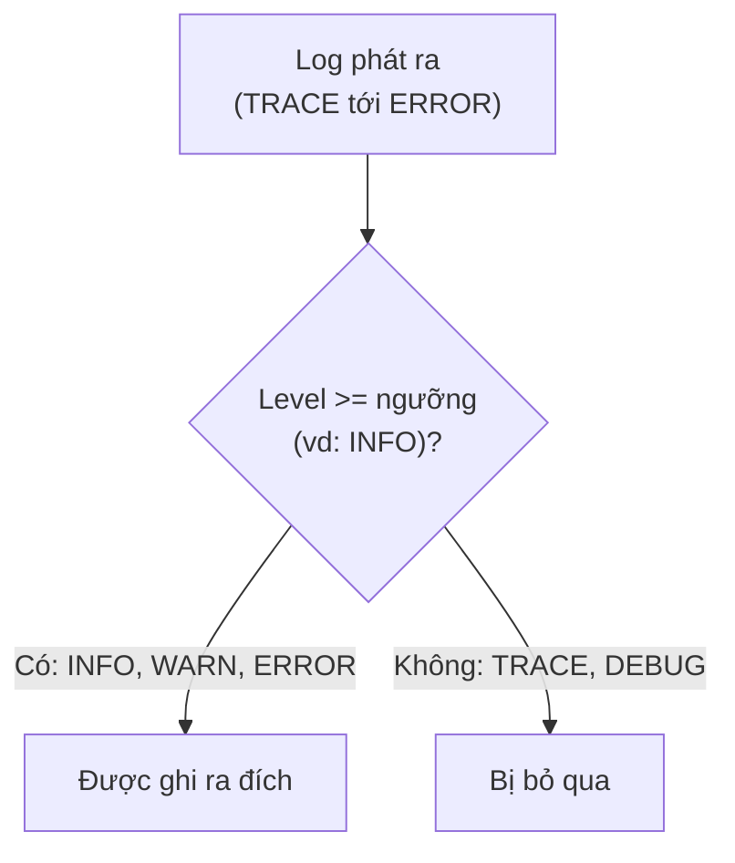
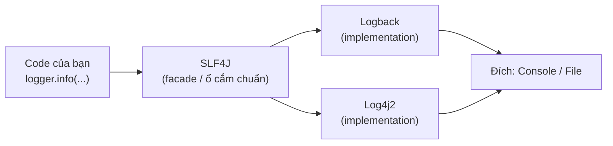

# 1. Tổng quan về Logging

Logging là việc chương trình ghi lại nhật ký hoạt động trong khi chạy, giúp bạn gỡ lỗi, theo dõi và truy vết sự cố ngay cả khi không ngồi trước màn hình. Bài này giải thích logging là gì, vì sao không nên dùng System.out.println trong dự án thật, các mức log từ TRACE tới ERROR, sự khác nhau giữa facade và implementation, cùng tổng quan các thư viện phổ biến. Đây là bài mở đầu; các thư viện cụ thể được nói kỹ ở các bài sau.

[](pathname:///img/java/tong-quan-logging.webp)

---

:::note[Ghi nhớ nhanh]

- ⭐ **Facade vs Implementation** — `SLF4J` là facade (ổ cắm chuẩn) để gọi log; `Logback`/`Log4j2` mới là implementation thật sự ghi log.
- ⭐ **Không dùng `System.out.println` trong dự án thật** — vì thiếu level, không ghi được file và không bật/tắt được.
- **Log level từ thấp tới cao** — `TRACE`, `DEBUG`, `INFO`, `WARN`, `ERROR`; đặt một ngưỡng để lọc log tự động.
- **Mới học + Spring Boot** — cứ dùng `SLF4J + Logback` vì đã có sẵn.
- **Không log dữ liệu nhạy cảm** — mật khẩu, số thẻ tín dụng tuyệt đối không ghi vào log.

:::

---

## Mục lục

- [Logging là gì?](#logging-là-gì)
- [Vì sao KHÔNG nên dùng System.out.println?](#vì-sao-không-nên-dùng-systemoutprintln)
- [Các mức log (Log Levels)](#các-mức-log-log-levels)
- [Facade và Implementation](#facade-và-implementation)
- [So sánh các thư viện logging phổ biến](#so-sánh-các-thư-viện-logging-phổ-biến)
- [Một dòng log gồm những gì?](#một-dòng-log-gồm-những-gì)
- [Lỗi thường gặp](#lỗi-thường-gặp)
- [Tóm tắt](#tóm-tắt)
- [Câu hỏi phỏng vấn](#câu-hỏi-phỏng-vấn)

---

## Logging là gì?

**Logging** (ghi nhật ký) là việc chương trình ghi lại các thông tin về những gì nó đang làm, trong khi nó chạy. Mỗi thông tin được ghi ra gọi là một **log** (bản ghi nhật ký).

Hãy tưởng tượng bạn là một bác sĩ. Khi khám bệnh, bạn ghi vào **sổ bệnh án** (medical record): "8h sáng bệnh nhân sốt 39 độ", "9h uống thuốc", "10h hạ sốt". Nếu sau này bệnh nhân trở nặng, bạn mở sổ ra xem lại để biết chuyện gì đã xảy ra.

Logging trong lập trình cũng y hệt như vậy. Chương trình ghi lại:

- "Người dùng `an@gmail.com` vừa đăng nhập lúc 8h00".
- "Đang gọi tới ngân hàng để thanh toán đơn hàng #1234".
- "LỖI: Không kết nối được tới cơ sở dữ liệu".

Khi ứng dụng gặp sự cố lúc 3h sáng (mà bạn đang ngủ), bạn không thể ngồi nhìn màn hình để xem nó chạy ra sao. Nhưng nhờ có log đã ghi lại, sáng hôm sau bạn mở file log lên và biết chính xác chuyện gì đã xảy ra. Đó là lý do logging cực kỳ quan trọng.

### Logging dùng để làm gì?

- **Gỡ lỗi (debugging):** tìm xem chương trình sai ở đâu.
- **Theo dõi (monitoring):** biết hệ thống đang khỏe hay yếu.
- **Kiểm toán (audit):** ghi lại "ai đã làm gì, lúc nào" để truy vết sau này.
- **Phân tích:** đếm xem mỗi ngày có bao nhiêu người dùng, lỗi nào hay xảy ra.

---

## Vì sao KHÔNG nên dùng System.out.println?

Khi mới học Java, ai cũng dùng `System.out.println(...)` để in thông tin ra màn hình:

```java
// CÁCH "NGHIỆP DƯ" - chỉ nên dùng khi học thử
System.out.println("Người dùng đăng nhập: " + email);
```

Cách này chạy được, nhưng KHÔNG dùng trong dự án thật vì những lý do sau:

1. **Không phân loại mức độ quan trọng.** Một thông báo lỗi nghiêm trọng và một dòng thông tin bình thường đều in giống hệt nhau, không phân biệt được.

2. **Không tắt/bật được.** Khi ứng dụng chạy thật (production), bạn muốn ẩn các dòng debug chi tiết để màn hình gọn gàng. Với `println` thì bạn phải xóa từng dòng code, rất mệt và dễ sai.

3. **Không ghi vào file được.** `println` chỉ in ra màn hình rồi biến mất. Tắt máy là mất hết. Log thật cần lưu vào file để xem lại.

4. **Không có thông tin bổ sung.** Log "xịn" tự động kèm theo thời gian, tên lớp, tên luồng (thread)... còn `println` thì bạn phải tự gõ tất cả.

5. **Chậm và không an toàn đa luồng.** `System.out` ghi đồng bộ, khi nhiều luồng cùng in sẽ làm chậm chương trình.

Vì vậy, lập trình viên chuyên nghiệp dùng **thư viện logging** (logging framework).

---

## Các mức log (Log Levels)

**Log level** (mức độ log) cho biết một bản ghi quan trọng tới đâu. Đây là cách phân loại giống như mức báo động: từ "thông tin vặt" tới "cháy nhà". Từ thấp tới cao:

| Mức | Ý nghĩa | Ví dụ đời thường |
|-----|---------|------------------|
| **TRACE** | Chi tiết nhất, theo dõi từng bước nhỏ | "Vừa bước chân trái, rồi bước chân phải" |
| **DEBUG** | Thông tin để gỡ lỗi | "Giá trị biến `tong = 150`" |
| **INFO** | Thông tin bình thường, hệ thống đang chạy ổn | "Người dùng đăng nhập thành công" |
| **WARN** | Cảnh báo, chưa lỗi nhưng cần để ý | "Ổ đĩa còn 10% dung lượng" |
| **ERROR** | Lỗi, một việc gì đó đã thất bại | "Không gửi được email cho khách" |

Có một quy tắc quan trọng: bạn chọn một mức làm "ngưỡng", thì hệ thống chỉ ghi các log **từ mức đó trở lên**. Ví dụ nếu chọn ngưỡng là `INFO`, thì:

- TRACE, DEBUG: **bị bỏ qua** (vì thấp hơn INFO).
- INFO, WARN, ERROR: **được ghi** (vì bằng hoặc cao hơn INFO).

Nhờ vậy, khi chạy thật bạn đặt ngưỡng `INFO` để màn hình gọn, còn khi gỡ lỗi bạn hạ xuống `DEBUG` để xem chi tiết, mà KHÔNG cần sửa một dòng code nào.

```java
// Ví dụ dùng các mức log khác nhau
logger.trace("Bắt đầu vòng lặp lần thứ {}", i);   // chi tiết nhất
logger.debug("Giá trị tổng tạm tính = {}", tong);  // để gỡ lỗi
logger.info("Đơn hàng {} đã được tạo", maDonHang);  // thông tin bình thường
logger.warn("Bộ nhớ đệm gần đầy: {}%", phanTram);   // cảnh báo
logger.error("Thanh toán thất bại cho đơn {}", id); // lỗi
```

Sơ đồ dưới minh hoạ cách một log bị lọc theo ngưỡng level (ví dụ ngưỡng đặt là `INFO`):


```mermaid
flowchart TD
    A["Log phát ra<br/>(TRACE tới ERROR)"] --> B{"Level >= ngưỡng<br/>(vd: INFO)?"}
    B -->|"Có: INFO, WARN, ERROR"| C["Được ghi ra đích"]
    B -->|"Không: TRACE, DEBUG"| D["Bị bỏ qua"]
```

---

## Facade và Implementation

Đây là khái niệm quan trọng nhất khi học logging trong Java. Có hai loại thư viện:

- **Facade** (mặt tiền / lớp trừu tượng): chỉ là một bộ "công tắc" tiêu chuẩn để bạn gọi `logger.info(...)`. Nó KHÔNG tự ghi log ra đâu cả.
- **Implementation** (bản cài đặt thật): mới là thứ thực sự ghi log ra màn hình hoặc file.

Hãy tưởng tượng **ổ cắm điện** trong nhà. Cái ổ cắm (facade) là chuẩn chung: mọi thiết bị đều cắm vừa. Nhưng điện thực sự đến từ nhà máy điện (implementation). Bạn có thể đổi nhà máy điện (thủy điện sang điện mặt trời) mà KHÔNG cần đục tường thay ổ cắm.

Trong Java:

- **Facade** phổ biến nhất là **SLF4J** (Simple Logging Facade for Java).
- **Implementation** phổ biến là **Logback**, **Log4j2**.

Lợi ích: code của bạn chỉ "nói chuyện" với SLF4J. Hôm nay bạn dùng Logback để ghi log, mai muốn đổi sang Log4j2 thì chỉ cần đổi thư viện, KHÔNG phải sửa code nghiệp vụ.

```text
[Code của bạn]  -->  [SLF4J: facade]  -->  [Logback hoặc Log4j2: implementation]
                       (ổ cắm chuẩn)         (nhà máy điện thật)
```

Sơ đồ dưới cho thấy code chỉ nói chuyện với facade SLF4J, còn implementation nào đứng sau có thể thay đổi tự do:


```mermaid
flowchart LR
    A["Code của bạn<br/>logger.info(...)"] --> B["SLF4J<br/>(facade / ổ cắm chuẩn)"]
    B --> C["Logback<br/>(implementation)"]
    B --> D["Log4j2<br/>(implementation)"]
    C --> E["Đích: Console / File"]
    D --> E
```

---

## So sánh các thư viện logging phổ biến

| Thư viện | Loại | Đặc điểm chính |
|----------|------|----------------|
| **SLF4J** | Facade | Lớp trừu tượng tiêu chuẩn, code nên viết theo cái này |
| **Logback** | Implementation | Mặc định của Spring Boot, ổn định, dễ cấu hình |
| **Log4j2** | Implementation | Hiệu năng cao, hỗ trợ ghi log bất đồng bộ (async) |
| **TinyLog** | Cả hai (gọn) | Siêu nhẹ, cấu hình tối giản, hợp ứng dụng nhỏ |

Tóm gọn cách chọn:

- Mới học, dùng Spring Boot: cứ dùng **SLF4J + Logback** (đã có sẵn).
- Cần hiệu năng cực cao, log rất nhiều: cân nhắc **Log4j2**.
- Ứng dụng nhỏ, muốn đơn giản tối đa: thử **TinyLog**.

---

## Một dòng log gồm những gì?

Một dòng log thật thường có dạng:

```text
2026-06-04 08:30:15.123  INFO  10240 --- [main] c.example.OrderService : Đơn hàng 1234 đã tạo
```

Giải nghĩa từng phần:

- `2026-06-04 08:30:15.123`: **timestamp** (mốc thời gian) ghi log.
- `INFO`: **level** (mức độ).
- `[main]`: tên **thread** (luồng) đang chạy.
- `c.example.OrderService`: tên **lớp** (class) ghi log.
- `Đơn hàng 1234 đã tạo`: **message** (nội dung thông điệp).

Bạn không cần gõ tay những phần này — thư viện logging tự thêm vào, bạn chỉ cần viết nội dung thông điệp.

---

## Lỗi thường gặp

- **Vẫn dùng `System.out.println` trong dự án thật.** Hãy thay bằng logger để có level, thời gian và ghi file.
- **Ghi log mọi thứ ở mức INFO.** File log sẽ phình to và khó đọc. Hãy dùng đúng level: chi tiết thì DEBUG, lỗi thì ERROR.
- **Ghi thông tin nhạy cảm vào log** (mật khẩu, số thẻ tín dụng). Đây là lỗi bảo mật nghiêm trọng. Tuyệt đối không log những dữ liệu này.
- **Nhầm facade với implementation.** SLF4J một mình không ghi được log; bắt buộc phải có thêm một implementation như Logback đi kèm.

---

## Tóm tắt

- **Logging** là ghi nhật ký hoạt động của chương trình để gỡ lỗi và theo dõi.
- Không dùng `System.out.println` trong dự án thật vì nó thiếu level, không ghi file, không bật/tắt được.
- **Log level** từ thấp tới cao: TRACE, DEBUG, INFO, WARN, ERROR. Đặt ngưỡng để lọc.
- **Facade** (SLF4J) là lớp trừu tượng chuẩn; **implementation** (Logback, Log4j2) mới ghi log thật. Code theo facade để dễ thay đổi sau này.
- Mới học nên dùng **SLF4J + Logback**, có sẵn trong Spring Boot.

---

## Câu hỏi phỏng vấn

Những câu thường gặp về chủ đề này. Tự trả lời trước, rồi bấm **Xem đáp án** để đối chiếu.

**1. Logging khác gì với việc dùng `System.out.println` để debug? Nêu ít nhất ba lý do nên dùng logging framework trong dự án thật.**

<details className="qa">
<summary>Xem đáp án</summary>

- **Có level (mức độ)**: phân biệt được log quan trọng (`ERROR`) với log chi tiết (`DEBUG`), trong khi `println` in mọi thứ giống hệt nhau.
- **Bật/tắt được không cần sửa code**: chỉ cần đổi cấu hình ngưỡng level, không phải xóa/thêm dòng `println` bằng tay.
- **Ghi được ra file, xoay vòng (rotate), gửi tới hệ thống giám sát**: `println` chỉ in ra console rồi mất, không lưu lại để tra cứu sau sự cố.
- **Tự động kèm metadata**: timestamp, tên thread, tên class được thêm tự động, không cần tự gõ.
- **Hiệu năng và an toàn đa luồng tốt hơn**: các thư viện logging tối ưu I/O (ví dụ ghi bất đồng bộ), còn `System.out` ghi đồng bộ và có thể là điểm nghẽn khi nhiều luồng cùng in.

</details>

**2. Liệt kê các mức log (log level) trong Java từ thấp tới cao. Nếu đặt ngưỡng là `WARN`, log ở mức `INFO` có được ghi ra không?**

<details className="qa">
<summary>Xem đáp án</summary>

Thứ tự từ thấp tới cao: `TRACE` → `DEBUG` → `INFO` → `WARN` → `ERROR`.

- **Không**, log ở mức `INFO` sẽ **bị bỏ qua** vì `INFO` thấp hơn ngưỡng `WARN` đã đặt.
- Quy tắc chung: chỉ những log có level **bằng hoặc cao hơn** ngưỡng mới được ghi ra đích (console/file). Với ngưỡng `WARN`, chỉ `WARN` và `ERROR` được ghi.

</details>

**3. Facade và implementation trong logging là gì? Vì sao Java lại tách riêng hai khái niệm này thay vì gộp chung một thư viện?**

<details className="qa">
<summary>Xem đáp án</summary>

- **Facade** (`SLF4J`) là lớp trừu tượng chuẩn, chỉ định nghĩa API gọi log (`logger.info(...)`) nhưng không tự ghi log ra đâu cả.
- **Implementation** (`Logback`, `Log4j2`) mới là thư viện thực sự xử lý và ghi log ra console/file/hệ thống tập trung.
- Tách riêng để code nghiệp vụ chỉ phụ thuộc vào facade (`SLF4J`), không phụ thuộc trực tiếp vào một implementation cụ thể. Nhờ vậy có thể **đổi implementation** (ví dụ từ `Logback` sang `Log4j2`) chỉ bằng cách đổi dependency, mà **không cần sửa một dòng code nghiệp vụ nào** — tương tự nguyên lý lập trình theo interface thay vì implementation cụ thể.
- Đây cũng là lý do các thư viện bên thứ ba (ví dụ một thư viện HTTP client) thường chỉ phụ thuộc `SLF4J` API, để ứng dụng dùng thư viện đó có thể tự chọn implementation ghi log của riêng mình.

</details>

**4. So sánh `SLF4J`, `Logback`, `Log4j2` và `TinyLog` — cái nào là facade, cái nào là implementation?**

<details className="qa">
<summary>Xem đáp án</summary>

| Thư viện | Vai trò | Đặc điểm |
|---|---|---|
| `SLF4J` | Facade | Chuẩn API chung, không tự ghi log |
| `Logback` | Implementation | Mặc định của Spring Boot, ổn định, dễ cấu hình XML |
| `Log4j2` | Implementation | Hiệu năng cao, hỗ trợ ghi log bất đồng bộ (async logging) qua LMAX Disruptor |
| `TinyLog` | Cả facade lẫn implementation gộp gọn | Siêu nhẹ, không cần cấu hình phức tạp, hợp ứng dụng nhỏ |

- `SLF4J` không đứng một mình được — luôn cần một implementation (`Logback` hoặc `Log4j2`) đi kèm mới thực sự ghi log.
- `TinyLog` là ngoại lệ: nó tự cung cấp cả hai vai trò trong cùng một thư viện gọn nhẹ.

</details>

**5. Đoạn code sau có vấn đề gì về hiệu năng? Nên viết lại thế nào cho đúng?**

```java
logger.debug("Chi tiết đơn hàng: " + donHang.toChuoiChiTiet());
```

<details className="qa">
<summary>Xem đáp án</summary>

**Vấn đề**: Biểu thức nối chuỗi `"Chi tiết đơn hàng: " + donHang.toChuoiChiTiet()` **luôn được tính toán** trước khi gọi `logger.debug(...)`, bất kể level `DEBUG` có đang bật hay không. Nếu `toChuoiChiTiet()` tốn kém (ví dụ build chuỗi lớn, truy vấn thêm dữ liệu), chi phí này vẫn xảy ra ngay cả khi ngưỡng log đang đặt ở `INFO` trở lên và dòng log này sẽ bị bỏ qua.

**Cách viết đúng** — dùng **parameterized logging** (log có tham số) với placeholder `{}`:

```java
logger.debug("Chi tiết đơn hàng: {}", donHang.toChuoiChiTiet());
```

- Với SLF4J, cách này vẫn phải tính `toChuoiChiTiet()` trước khi truyền vào (Java luôn evaluate tham số của method), nên nếu phần tính toán thực sự nặng, cách an toàn nhất là bọc thêm điều kiện kiểm tra level:

```java
if (logger.isDebugEnabled()) {
    logger.debug("Chi tiết đơn hàng: {}", donHang.toChuoiChiTiet());
}
```

- Với các tham số đơn giản (biến có sẵn, không cần tính toán tốn kém) thì chỉ cần dùng `{}` là đủ, không cần bọc `isDebugEnabled()`.

</details>

**6. Tại sao không nên ghi mật khẩu hay số thẻ tín dụng vào log, kể cả ở môi trường development? Nêu cách xử lý phù hợp khi cần log dữ liệu nhạy cảm.**

<details className="qa">
<summary>Xem đáp án</summary>

- File log thường được lưu lại lâu dài, sao lưu, và có thể được nhiều người (đội vận hành, đội hỗ trợ) truy cập — dữ liệu nhạy cảm ghi vào log coi như bị "rò rỉ" ra ngoài phạm vi kiểm soát ban đầu, kể cả khi hệ thống chính đã mã hóa dữ liệu đó.
- Nhiều tiêu chuẩn bảo mật/tuân thủ (ví dụ PCI-DSS cho dữ liệu thẻ) **cấm tuyệt đối** việc ghi log thông tin thẻ, mật khẩu dạng rõ.
- Cách xử lý phù hợp:
  - **Che bớt (masking)**: chỉ log vài ký tự cuối, ví dụ số thẻ `**** **** **** 1234`.
  - **Không log field nhạy cảm**: loại trừ các field như `password`, `token` khi log toàn bộ object (nhiều framework có annotation để đánh dấu field cần ẩn khi serialize).
  - **Log ID thay vì dữ liệu thật**: ví dụ log `orderId` thay vì toàn bộ thông tin thanh toán.

</details>

**7. Một dòng log thật (ví dụ `2026-06-04 08:30:15.123 INFO 10240 --- [main] c.example.OrderService : Đơn hàng 1234 đã tạo`) gồm những thành phần nào? Vì sao các thành phần này hữu ích khi truy vết sự cố?**

<details className="qa">
<summary>Xem đáp án</summary>

- **Timestamp** (`2026-06-04 08:30:15.123`): xác định chính xác thời điểm sự kiện xảy ra, quan trọng để sắp xếp thứ tự sự kiện và đối chiếu với báo cáo lỗi từ người dùng.
- **Level** (`INFO`): cho biết mức độ nghiêm trọng, giúp lọc nhanh log quan trọng khi hệ thống có hàng triệu dòng log mỗi ngày.
- **Thread** (`[main]`): trong ứng dụng đa luồng, cho biết log này thuộc luồng xử lý nào — cực kỳ quan trọng khi debug race condition hoặc request bị xử lý đồng thời.
- **Tên class** (`c.example.OrderService`): xác định chính xác vị trí trong code phát ra log, giúp nhảy thẳng tới đoạn code liên quan.
- **Message**: nội dung nghiệp vụ cụ thể.
- Nhờ có đầy đủ các thành phần này mà một dòng log có thể tái hiện lại "ai, ở đâu, lúc nào, làm gì" mà không cần đọc lại toàn bộ mã nguồn.

</details>

**8. Trong một hệ thống production xử lý hàng triệu request/ngày, bạn nên chọn ngưỡng log level nào, và tại sao đặt toàn bộ log ở mức `DEBUG` khi chạy thật lại là một sai lầm phổ biến?**

<details className="qa">
<summary>Xem đáp án</summary>

- Thường chọn ngưỡng **`INFO`** cho môi trường production, chỉ hạ xuống `DEBUG` tạm thời khi cần điều tra một sự cố cụ thể rồi trả lại `INFO` ngay sau đó.
- Đặt `DEBUG` (hoặc `TRACE`) làm mặc định ở production gây ra:
  - **File log phình to rất nhanh**, tốn dung lượng đĩa và chi phí lưu trữ (đặc biệt nếu dùng dịch vụ log tập trung tính phí theo dung lượng).
  - **Giảm hiệu năng ứng dụng**: việc build message và ghi I/O cho hàng triệu dòng log dư thừa tiêu tốn CPU và có thể làm chậm luồng xử lý chính.
  - **Khó tìm thông tin quan trọng**: log `ERROR`/`WARN` bị "chìm" giữa hàng nghìn dòng `DEBUG` không cần thiết.
- Giải pháp thực tế: cấu hình ngưỡng theo môi trường (development dùng `DEBUG`, production dùng `INFO`) thông qua file cấu hình, không hard-code trong source.

</details>

**9. `SLF4J` một mình có ghi được log ra file không? Nếu dự án chỉ khai báo dependency `slf4j-api` mà quên thêm implementation, điều gì sẽ xảy ra khi chạy?**

<details className="qa">
<summary>Xem đáp án</summary>

- **Không.** `SLF4J` chỉ là facade — cung cấp API để gọi (`Logger`, `LoggerFactory`), bản thân nó không có logic ghi log ra đích nào.
- Nếu chỉ có `slf4j-api` mà thiếu implementation, khi chạy chương trình `SLF4J` sẽ in ra cảnh báo dạng:

```text
SLF4J: No SLF4J providers were found.
SLF4J: Defaulting to no-operation (NOP) logger implementation
```

- Chương trình vẫn chạy bình thường (không crash), nhưng **mọi lệnh gọi `logger.info(...)`, `logger.error(...)` đều bị "nuốt mất"** — không có gì được ghi ra console hay file, vì SLF4J rơi về "no-operation logger" (logger không làm gì cả).
- Cách khắc phục: thêm dependency implementation phù hợp, ví dụ `logback-classic` (Logback) hoặc `log4j-slf4j2-impl` (Log4j2), vào classpath.

</details>
