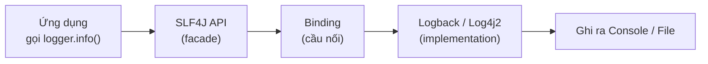

# 2. SLF4J

SLF4J (Simple Logging Facade for Java) là facade ghi log phổ biến nhất trong Java, đóng vai trò "ổ cắm chuẩn" để code của bạn gọi log mà không phụ thuộc vào thư viện ghi log cụ thể. Bài này hướng dẫn cách cài đặt SLF4J, tạo logger, ghi log bằng placeholder `{}`, ghi log kèm exception, và giải thích vì sao luôn nên viết code theo SLF4J để dễ thay đổi implementation sau này.

[](pathname:///img/java/slf4j.webp)

---

:::note[Ghi nhớ nhanh]

- ⭐ **SLF4J chỉ là facade** — tự nó KHÔNG ghi log; phải ghép với một implementation (`Logback`/`Log4j2`) thì log mới xuất hiện.
- **Tạo logger** — dùng `LoggerFactory.getLogger(TenLop.class)`, khai báo `private static final`.
- ⭐ **Dùng placeholder `{}`** — thay vì nối chuỗi `+`, giúp nhanh hơn vì chỉ ghép chuỗi khi thật sự ghi.
- **Ghi lỗi kèm exception** — truyền exception làm tham số cuối để in cả stack trace.
- **Import đúng** — phải là `org.slf4j.Logger`, đừng nhầm `java.util.logging.Logger`.

:::

---

## Mục lục

- [SLF4J là gì?](#slf4j-là-gì)
- [SLF4J chỉ là facade, không ghi log thật](#slf4j-chỉ-là-facade-không-ghi-log-thật)
- [Cài đặt SLF4J](#cài-đặt-slf4j)
- [Tạo logger với LoggerFactory.getLogger](#tạo-logger-với-loggerfactorygetlogger)
- [Ghi log với placeholder dấu ngoặc nhọn](#ghi-log-với-placeholder-dấu-ngoặc-nhọn)
- [Ghi log lỗi kèm exception](#ghi-log-lỗi-kèm-exception)
- [Vì sao nên viết code theo SLF4J?](#vì-sao-nên-viết-code-theo-slf4j)
- [Lỗi thường gặp](#lỗi-thường-gặp)
- [Tóm tắt](#tóm-tắt)
- [Câu hỏi phỏng vấn](#câu-hỏi-phỏng-vấn)

---

## SLF4J là gì?

**SLF4J** viết tắt của **Simple Logging Facade for Java** (mặt tiền ghi log đơn giản cho Java). Nó là **facade** (lớp trừu tượng) phổ biến nhất trong thế giới Java.

Nhớ lại ví dụ ổ cắm điện ở bài trước: SLF4J chính là cái **ổ cắm chuẩn**. Code của bạn "cắm" vào SLF4J, còn việc ghi log thật do một thư viện khác (Logback, Log4j2) đảm nhận.

---

## SLF4J chỉ là facade, không ghi log thật

Đây là điểm khiến người mới hay bối rối. SLF4J **tự nó KHÔNG ghi được log**. Nếu bạn chỉ thêm SLF4J vào dự án mà không có một **implementation** (bản cài đặt thật) nào, bạn sẽ thấy cảnh báo:

```text
SLF4J: No SLF4J providers were found.
SLF4J: Defaulting to no-operation (NOP) logger implementation
```

Dịch ra: "Không tìm thấy bộ ghi log nào, nên mọi lệnh log sẽ KHÔNG làm gì cả".

Để log thật sự xuất hiện, bạn cần cặp đôi:

- **SLF4J** (facade): để gọi `logger.info(...)`.
- **Logback** hoặc **Log4j2** (implementation): để thực sự ghi ra màn hình/file.

May mắn là nếu bạn dùng **Spring Boot**, cặp **SLF4J + Logback** đã được thêm sẵn, bạn không phải làm gì thêm.

Sơ đồ dưới minh hoạ chuỗi mắt xích cần đủ để một dòng log thật sự được ghi ra:



---

## Cài đặt SLF4J

Nếu KHÔNG dùng Spring Boot, bạn cần tự thêm SLF4J và một implementation. Ví dụ dùng Maven, thêm SLF4J kèm Logback (Logback đã tự kéo theo SLF4J):

```xml
<!-- pom.xml: thêm Logback, nó tự kéo theo SLF4J facade -->
<dependency>
    <groupId>ch.qos.logback</groupId>
    <artifactId>logback-classic</artifactId>
    <version>1.5.6</version>
</dependency>
```

Với Spring Boot, chỉ cần `spring-boot-starter` là đã có sẵn, không cần thêm gì.

---

## Tạo logger với LoggerFactory.getLogger

Trong mỗi lớp cần ghi log, bạn tạo một đối tượng **logger** (bộ ghi log). Cách chuẩn:

```java
import org.slf4j.Logger;
import org.slf4j.LoggerFactory;

public class OrderService {

    // Tạo logger riêng cho lớp OrderService.
    // - private: chỉ dùng trong lớp này.
    // - static: chỉ tạo MỘT lần dùng chung, không tạo lại mỗi đối tượng.
    // - final: không thay đổi sau khi gán.
    // Truyền OrderService.class để logger biết log thuộc về lớp nào.
    private static final Logger logger = LoggerFactory.getLogger(OrderService.class);

    public void taoDonHang(String maDon) {
        logger.info("Đang tạo đơn hàng: {}", maDon);
    }
}
```

Vì sao truyền `OrderService.class`? Để mỗi dòng log tự kèm tên lớp, giúp bạn biết log này phát ra từ đâu — giống như mỗi lá thư đều có ghi tên người gửi.

---

## Ghi log với placeholder dấu ngoặc nhọn

SLF4J dùng cặp `{}` làm **placeholder** (chỗ giữ chỗ). Giá trị truyền vào sẽ lần lượt điền vào các `{}`. Đây là cách **đúng** và được khuyến khích:

```java
String email = "an@gmail.com";
int soDon = 5;

// CÁCH ĐÚNG: dùng {} làm placeholder
logger.info("Người dùng {} có {} đơn hàng", email, soDon);
// Kết quả: Người dùng an@gmail.com có 5 đơn hàng
```

So với cách nối chuỗi bằng dấu `+`:

```java
// CÁCH KHÔNG NÊN: nối chuỗi bằng dấu +
logger.debug("Người dùng " + email + " có " + soDon + " đơn hàng");
```

Vì sao nên dùng `{}` thay vì `+`? Vì hiệu năng. Khi dùng `+`, chuỗi được ghép NGAY LẬP TỨC, kể cả khi log đó bị tắt (ví dụ mức DEBUG đang bị ẩn). Với `{}`, SLF4J chỉ ghép chuỗi KHI THẬT SỰ cần ghi — nếu log bị tắt thì không tốn công ghép, giúp chương trình nhanh hơn.

---

## Ghi log lỗi kèm exception

Khi có lỗi (exception), bạn nên ghi cả thông điệp lẫn chi tiết lỗi. Truyền đối tượng exception làm **tham số cuối cùng** (không cần `{}` cho nó):

```java
try {
    thanhToan(maDon);
} catch (Exception e) {
    // Truyền exception ở cuối -> SLF4J in ra cả stack trace (vết gọi hàm dẫn tới lỗi)
    logger.error("Thanh toán thất bại cho đơn hàng {}", maDon, e);
}
```

Stack trace sẽ chỉ cho bạn chính xác dòng code nào gây lỗi — rất quan trọng khi gỡ lỗi.

---

## Vì sao nên viết code theo SLF4J?

1. **Đổi implementation mà không sửa code.** Hôm nay dùng Logback, mai đổi Log4j2 — code gọi `logger.info(...)` giữ nguyên. Chỉ cần thay thư viện.

2. **Là chuẩn chung.** Hầu hết thư viện Java nổi tiếng (Spring, Hibernate...) đều log qua SLF4J. Dùng SLF4J giúp log của bạn và của thư viện thống nhất một định dạng.

3. **Hiệu năng tốt nhờ placeholder `{}`.** Như đã giải thích, tránh ghép chuỗi thừa.

4. **API đơn giản, dễ học.** Chỉ cần nhớ vài hàm: `trace`, `debug`, `info`, `warn`, `error`.

Quy tắc vàng: **luôn viết code log theo SLF4J**, không gọi trực tiếp Logback hay Log4j2.

---

## Lỗi thường gặp

- **Chỉ thêm SLF4J mà quên implementation.** Log không xuất hiện và có cảnh báo "No SLF4J providers were found". Hãy thêm Logback hoặc Log4j2.
- **Thêm nhiều implementation cùng lúc** (cả Logback lẫn Log4j2). Sẽ có cảnh báo "Class path contains multiple SLF4J providers". Chỉ giữ MỘT cái.
- **Nối chuỗi bằng `+` thay vì dùng `{}`.** Gây tốn hiệu năng khi log bị tắt.
- **Gọi sai số lượng tham số.** Số `{}` nên khớp số giá trị truyền vào (trừ exception ở cuối).
- **Import nhầm.** Phải dùng `org.slf4j.Logger`, đừng nhầm với `java.util.logging.Logger`.

---

## Tóm tắt

- **SLF4J** là **facade** ghi log phổ biến nhất cho Java; nó KHÔNG tự ghi log.
- Cần ghép SLF4J với một **implementation** (Logback, Log4j2) thì log mới xuất hiện.
- Tạo logger bằng `LoggerFactory.getLogger(TenLop.class)`, đặt `private static final`.
- Dùng placeholder `{}` để ghi log nhanh và an toàn; truyền exception ở cuối để in stack trace.
- Luôn viết code theo SLF4J để dễ thay đổi implementation sau này.

---

## Câu hỏi phỏng vấn

Những câu thường gặp về chủ đề này. Tự trả lời trước, rồi bấm **Xem đáp án** để đối chiếu.

**1. `SLF4J` là gì? Nó có tự ghi log ra file/console được không?**

<details className="qa">
<summary>Xem đáp án</summary>

`SLF4J` (Simple Logging Facade for Java) là **facade** (lớp trừu tượng chuẩn) cho việc ghi log trong Java, cung cấp API thống nhất (`Logger`, `LoggerFactory`) để gọi log.

- **Không**, `SLF4J` tự nó **không ghi được log** ra bất kỳ đâu. Nó chỉ định nghĩa API gọi log; việc ghi log thật sự do một **implementation** đi kèm (`Logback`, `Log4j2`) đảm nhiệm.
- Nếu chỉ có `SLF4J` mà thiếu implementation, chương trình vẫn chạy nhưng log sẽ rơi vào "no-operation logger" — không in ra gì cả.

</details>

**2. Cách tạo logger đúng chuẩn trong một class Java là gì? Vì sao logger thường được khai báo `private static final`?**

<details className="qa">
<summary>Xem đáp án</summary>

```java
private static final Logger logger = LoggerFactory.getLogger(OrderService.class);
```

- **`private`**: logger chỉ dùng nội bộ trong class, không cần expose ra ngoài.
- **`static`**: chỉ tạo **một instance dùng chung** cho mọi object của class, tránh tạo lại logger mỗi khi khởi tạo object mới — tiết kiệm bộ nhớ và tài nguyên.
- **`final`**: tham chiếu logger không đổi sau khi gán, đúng tinh thần bất biến và tránh vô tình gán lại logger ở nơi khác trong code.
- Truyền `OrderService.class` (chứ không phải class khác) để mỗi dòng log tự động gắn kèm đúng tên class phát ra log, giúp tra vết log về đúng nguồn.

</details>

**3. So sánh hai cách ghi log sau. Cách nào tốt hơn về hiệu năng, và vì sao?**

```java
// Cách A
logger.debug("Người dùng " + email + " có " + soDon + " đơn hàng");

// Cách B
logger.debug("Người dùng {} có {} đơn hàng", email, soDon);
```

<details className="qa">
<summary>Xem đáp án</summary>

**Cách B (dùng placeholder `{}`) tốt hơn.**

- Ở cách A, biểu thức nối chuỗi `"..." + email + "..." + soDon + "..."` được Java **tính toán ngay lập tức** trước khi gọi `logger.debug(...)`, bất kể level `DEBUG` có đang được bật hay không. Nếu `DEBUG` bị tắt (thường gặp ở production), công sức ghép chuỗi này hoàn toàn lãng phí.
- Ở cách B, `SLF4J` chỉ thực hiện ghép chuỗi (thay thế `{}` bằng giá trị tham số) **khi thật sự cần ghi log**, tức là chỉ khi level `DEBUG` đang được bật. Nếu bị tắt, `SLF4J` bỏ qua ngay từ đầu mà không tốn công ghép chuỗi.
- Với ứng dụng log nhiều, sự khác biệt này tích lũy lại có thể ảnh hưởng rõ rệt tới hiệu năng.

</details>

**4. Cách ghi log kèm exception dưới đây có đúng không? Giải thích cách SLF4J xử lý tham số cuối cùng là một exception.**

```java
try {
    thanhToan(maDon);
} catch (Exception e) {
    logger.error("Thanh toán thất bại cho đơn hàng {}", maDon, e);
}
```

<details className="qa">
<summary>Xem đáp án</summary>

**Đúng.** Đây là cách chuẩn để ghi log kèm exception trong `SLF4J`.

- Chuỗi format `"Thanh toán thất bại cho đơn hàng {}"` chỉ có **một** placeholder `{}`, tương ứng với tham số `maDon`.
- Tham số cuối cùng (`e`) là một `Throwable`/`Exception` — `SLF4J` **tự động nhận diện** đây là exception (không phải giá trị điền vào placeholder) và in kèm **toàn bộ stack trace** của nó bên dưới message, thay vì cố gắng thay thế nó vào một `{}` nào.
- Nếu số `{}` khớp đúng với số tham số thường (không tính exception ở cuối), log sẽ hiển thị chính xác; nếu không có exception, các tham số phải khớp đủ số `{}`.

</details>

**5. Vì sao trong dự án Spring Boot, bạn thường không cần tự thêm dependency Logback hay Log4j2?**

<details className="qa">
<summary>Xem đáp án</summary>

- `spring-boot-starter` (và mọi starter khác kế thừa nó) đã **kéo theo sẵn** `spring-boot-starter-logging`, trong đó bao gồm cả `SLF4J` (facade) và `Logback` (implementation mặc định).
- Vì vậy chỉ cần thêm một starter Spring Boot bất kỳ vào dự án là đã có đủ cặp `SLF4J + Logback` để ghi log ngay, không cần khai báo thêm dependency thủ công.
- Nếu muốn đổi sang `Log4j2`, cần loại trừ (`exclude`) `spring-boot-starter-logging` rồi thêm `spring-boot-starter-log4j2` thay thế.

</details>

**6. Điều gì xảy ra nếu một dự án vô tình khai báo cả `logback-classic` lẫn `log4j-slf4j2-impl` trong classpath cùng lúc?**

<details className="qa">
<summary>Xem đáp án</summary>

`SLF4J` sẽ phát hiện có **nhiều hơn một implementation** cùng đăng ký, và in ra cảnh báo tương tự:

```text
SLF4J: Class path contains multiple SLF4J providers.
```

- `SLF4J` sẽ tự chọn một trong số đó để dùng (thứ tự chọn phụ thuộc vào cách classpath được nạp), điều này gây ra hành vi **khó đoán trước** và có thể khác nhau giữa các lần chạy hoặc giữa các môi trường.
- Cách khắc phục: chỉ giữ **đúng một** implementation trong dependency của dự án — loại bỏ (`exclude`) implementation còn lại.

</details>

**7. Vì sao thư viện SLF4J lại trở thành lựa chọn phổ biến để các thư viện Java bên thứ ba (ví dụ Hibernate, một HTTP client) dùng để log, thay vì gọi trực tiếp `Logback` hoặc `java.util.logging`?**

<details className="qa">
<summary>Xem đáp án</summary>

- Nếu một thư viện bên thứ ba log trực tiếp qua `Logback`, mọi ứng dụng dùng thư viện đó **buộc phải** kéo theo `Logback` — dù ứng dụng muốn dùng `Log4j2` hay implementation khác cũng không thể tránh xung đột.
- Bằng cách log qua `SLF4J` (chỉ là API, không ràng buộc implementation), thư viện bên thứ ba để ngỏ quyền chọn implementation cho ứng dụng dùng nó — ứng dụng chỉ cần thêm implementation mình muốn (Logback, Log4j2...) vào classpath là mọi log, kể cả từ thư viện bên thứ ba, đều tự động chảy qua cùng một implementation đó.
- Đây là lý do `SLF4J` gần như trở thành chuẩn "de facto" (mặc nhiên) trong hệ sinh thái Java hiện đại, giúp thống nhất định dạng log giữa code của bạn và log của các thư viện đang dùng.

</details>

**8. Trong đoạn code sau, dòng log có in ra chính xác giá trị của `soDon` không? Nếu số lượng `{}` không khớp số tham số truyền vào thì điều gì xảy ra?**

```java
int soDon = 5;
logger.info("Người dùng có đơn hàng", soDon);
```

<details className="qa">
<summary>Xem đáp án</summary>

**Không.** Message `"Người dùng có đơn hàng"` không có placeholder `{}` nào, nên tham số `soDon` được truyền vào **không được sử dụng** — dòng log chỉ in ra đúng `"Người dùng có đơn hàng"`, không có giá trị `5` xuất hiện ở đâu cả.

- `SLF4J` **không ném lỗi (exception)** khi số `{}` không khớp số tham số — đây không phải lỗi biên dịch hay runtime, chỉ là placeholder thừa/thiếu bị bỏ qua hoặc không được điền.
- Nếu có nhiều `{}` hơn số tham số truyền vào, các `{}` dư sẽ được giữ nguyên dạng chữ trong message.
- Đây là lỗi khó phát hiện vì code biên dịch và chạy bình thường, chỉ có thể phát hiện bằng cách đọc kỹ log output hoặc review code cẩn thận.

</details>

**9. Bạn được giao review một class mới, thấy khai báo `import java.util.logging.Logger;` thay vì `import org.slf4j.Logger;`. Đây có phải vấn đề không? Vì sao?**

<details className="qa">
<summary>Xem đáp án</summary>

**Có, đây là lỗi cần sửa** trong một dự án đã chuẩn hóa dùng SLF4J.

- `java.util.logging.Logger` (thường viết tắt JUL) là API logging **có sẵn trong JDK**, hoàn toàn khác và không tương thích với `org.slf4j.Logger`.
- Nếu một class vô tình import nhầm `java.util.logging.Logger`, log của class đó sẽ **không đi qua** cấu hình Logback/Log4j2 chung của dự án (định dạng, ngưỡng level, đích ghi log riêng), dẫn tới log bị thiếu nhất quán — ví dụ không xuất hiện trong file log tập trung, hoặc định dạng khác hẳn phần còn lại.
- Cách sửa: đổi lại đúng `import org.slf4j.Logger;` và `import org.slf4j.LoggerFactory;`, đảm bảo mọi class trong dự án dùng chung một cơ chế logging.

</details>
