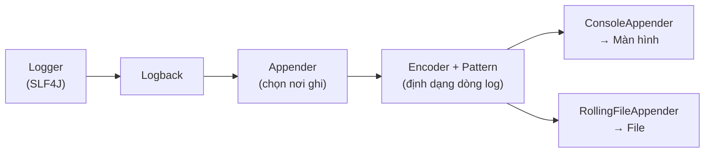

# 3. Logback

Logback là một implementation ghi log thật và là lựa chọn mặc định trong Spring Boot, đóng vai trò "nhà máy điện" thực sự ghi log ra màn hình hoặc file. Bài này hướng dẫn cấu hình Logback qua file `logback.xml`: khai báo appender để chọn nơi ghi log, định dạng dòng log bằng pattern, xoay file theo ngày và kích thước với RollingFile, cùng cách đặt level riêng cho từng package.

[](pathname:///img/java/logback.webp)

---

:::note[Ghi nhớ nhanh]

- ⭐ **Logback là implementation mặc định của Spring Boot** — cấu hình qua `logback.xml` hoặc `logback-spring.xml` trong `src/main/resources/`.
- **`Appender` quyết định ghi log đi đâu** — `ConsoleAppender` (màn hình), `RollingFileAppender` (file).
- **`Pattern` định dạng dòng log** — với các ký hiệu `%d`, `%level`, `%logger`, `%msg`, `%n`.
- **`RollingFileAppender` xoay file** — theo ngày/kích thước và tự xóa file cũ nhờ `maxHistory`.
- **Đặt level theo package** — qua `<logger>` và `<root>` để xem chi tiết code mình mà ẩn log thư viện.

:::

---

## Mục lục

- [Vì sao Logback ra đời?](#vì-sao-logback-ra-đời)
- [Logback là gì?](#logback-là-gì)
- [Logback là mặc định của Spring Boot](#logback-là-mặc-định-của-spring-boot)
- [File cấu hình logback.xml](#file-cấu-hình-logbackxml)
- [Appender: ghi log đi đâu?](#appender-ghi-log-đi-đâu)
- [Pattern: định dạng dòng log](#pattern-định-dạng-dòng-log)
- [Rolling File: xoay file theo ngày và kích thước](#rolling-file-xoay-file-theo-ngày-và-kích-thước)
- [Đặt level theo từng package](#đặt-level-theo-từng-package)
- [Một file logback.xml hoàn chỉnh](#một-file-logbackxml-hoàn-chỉnh)
- [Lỗi thường gặp](#lỗi-thường-gặp)
- [Tóm tắt](#tóm-tắt)
- [Câu hỏi phỏng vấn](#câu-hỏi-phỏng-vấn)

---

## Vì sao Logback ra đời?

**Vấn đề:** Log4j 1.x (ra đời năm 1999) đã phục vụ tốt trong nhiều năm, nhưng dần bộc lộ những điểm yếu khó vá: kiến trúc cũ khiến hiệu năng hạn chế, không hỗ trợ tự reload cấu hình khi file thay đổi, và không có tích hợp native với SLF4J — nghĩa là mọi dự án cần thêm một adapter ở giữa để dùng API chuẩn:

```java
// Log4j 1.x: không triển khai SLF4J natively
// Cần thêm bridge jar "slf4j-log4j12" mới dùng được Logger của SLF4J
import org.apache.log4j.Logger; // API riêng của Log4j, không chuẩn SLF4J
Logger logger = Logger.getLogger(MyApp.class);
logger.info("Log4j 1.x — cần adapter thêm để dùng cùng SLF4J");
```

**Giải pháp:** Chính tác giả của Log4j — Ceki Gülcü — viết lại từ đầu và tạo ra **Logback** (2006) để khắc phục toàn bộ những hạn chế trên: nhanh hơn đáng kể, footprint nhỏ, tự reload cấu hình khi file `logback.xml` thay đổi mà không cần khởi động lại, và quan trọng nhất — **native triển khai SLF4J** nên không cần adapter:

```xml
<!-- pom.xml: Spring Boot kéo logback-classic tự động, không cần thêm gì -->
<dependency>
    <groupId>org.springframework.boot</groupId>
    <artifactId>spring-boot-starter</artifactId>
    <!-- logback-classic đã được kéo vào, SLF4J hoạt động ngay -->
</dependency>
```

```java
// Logback native SLF4J: dùng thẳng Logger của SLF4J, không cần adapter
import org.slf4j.Logger;
import org.slf4j.LoggerFactory;

Logger logger = LoggerFactory.getLogger(MyApp.class); // SLF4J API thuần
logger.info("Logback xử lý log này trực tiếp — không cần bridge jar");
```

:::tip[Dùng thực tế]
- **Spring Boot** chọn Logback làm engine logging mặc định vì tích hợp sẵn, không cần cấu hình thêm.
- **Tự reload cấu hình** cho phép thay đổi log level trên production mà không cần restart ứng dụng.
- **Dự án cần ghi log vào nhiều đích** (console + file + database) cùng lúc nhờ hệ thống Appender linh hoạt.
- **Giảm dung lượng ổ đĩa** với RollingFileAppender tự xoay và xóa file log cũ theo chính sách định sẵn.
:::

---

## Logback là gì?

**Logback** là một **implementation** (bản cài đặt thật) của logging, do chính tác giả của Log4j viết lại để nhanh và ổn định hơn. Nó là "nhà máy điện" thực sự ghi log ra màn hình hoặc file, còn SLF4J chỉ là "ổ cắm" chuẩn.

Logback hoạt động ăn khớp hoàn hảo với SLF4J: bạn gọi `logger.info(...)` qua SLF4J, và Logback lo phần ghi thật.

---

## Logback là mặc định của Spring Boot

Nếu bạn tạo một dự án **Spring Boot**, Logback đã được thêm sẵn. Bạn không cần thêm thư viện gì cả — chỉ cần tạo logger và ghi log là chạy ngay:

```java
private static final Logger logger = LoggerFactory.getLogger(MyApp.class);

logger.info("Ứng dụng đã khởi động");
```

Spring Boot có sẵn cấu hình mặc định in log ra màn hình rất đẹp. Bạn chỉ cần tùy chỉnh khi muốn ghi vào file hoặc đổi định dạng.

---

## File cấu hình logback.xml

Để tùy chỉnh Logback, bạn tạo file `logback.xml` (hoặc `logback-spring.xml` nếu dùng Spring Boot) trong thư mục `src/main/resources/`. Cấu trúc cơ bản:

```xml
<?xml version="1.0" encoding="UTF-8"?>
<configuration>
    <!-- Khai báo các appender (nơi ghi log) ở đây -->

    <!-- Khai báo level (ngưỡng ghi log) ở đây -->
</configuration>
```

`<configuration>` là thẻ gốc, mọi cấu hình nằm bên trong nó.

> Với Spring Boot nên đặt tên `logback-spring.xml` thay vì `logback.xml`, vì tên này cho phép dùng thêm các tính năng riêng của Spring.

---

## Appender: ghi log đi đâu?

**Appender** (bộ ghi đích) quyết định log được ghi vào ĐÂU. Có nhiều loại; hai loại hay dùng nhất:

- **ConsoleAppender:** ghi ra **màn hình** (console).
- **FileAppender / RollingFileAppender:** ghi vào **file**.

Ví dụ ghi ra màn hình:

```xml
<!-- Appender ghi log ra màn hình (console) -->
<appender name="CONSOLE" class="ch.qos.logback.core.ConsoleAppender">
    <encoder>
        <!-- Định dạng mỗi dòng log -->
        <pattern>%d{HH:mm:ss} %-5level %logger{36} - %msg%n</pattern>
    </encoder>
</appender>
```

Ví dụ ghi vào file:

```xml
<!-- Appender ghi log vào file app.log -->
<appender name="FILE" class="ch.qos.logback.core.FileAppender">
    <file>logs/app.log</file>  <!-- Đường dẫn file log -->
    <encoder>
        <pattern>%d{yyyy-MM-dd HH:mm:ss} %-5level %logger{36} - %msg%n</pattern>
    </encoder>
</appender>
```

Sơ đồ dưới minh hoạ luồng một dòng log đi qua Logback trước khi tới đích cuối cùng:



---

## Pattern: định dạng dòng log

**Pattern** (khuôn mẫu) quy định mỗi dòng log trông như thế nào. Các ký hiệu hay dùng:

| Ký hiệu | Ý nghĩa |
|---------|---------|
| `%d{...}` | **date** — thời gian, ví dụ `%d{yyyy-MM-dd HH:mm:ss}` |
| `%level` hoặc `%-5level` | **level** — mức log (số 5 căn lề cho thẳng cột) |
| `%logger{36}` | tên lớp ghi log (36 = số ký tự tối đa) |
| `%msg` | **message** — nội dung thông điệp |
| `%n` | xuống dòng (newline) |
| `%thread` | tên luồng đang chạy |

Ví dụ pattern và kết quả:

```text
Pattern: %d{HH:mm:ss} %-5level %logger{36} - %msg%n
Kết quả: 08:30:15 INFO  c.example.OrderService - Đơn hàng 1234 đã tạo
```

---

## Rolling File: xoay file theo ngày và kích thước

Nếu ghi mãi vào một file, file sẽ phình to vô tận (vài GB) và không thể mở nổi. **RollingFileAppender** giải quyết bằng cách **xoay file** (rolling): tự tạo file mới khi qua ngày hoặc khi file quá lớn, và xóa file cũ.

Tưởng tượng cuốn lịch để bàn: mỗi ngày bạn xé một tờ. RollingFileAppender cũng "xé" file log mỗi ngày, tạo file mới cho ngày hôm nay.

```xml
<!-- Appender xoay file: mỗi ngày một file, giữ tối đa 30 ngày -->
<appender name="ROLLING" class="ch.qos.logback.core.rolling.RollingFileAppender">
    <file>logs/app.log</file>  <!-- File log hiện tại -->

    <rollingPolicy class="ch.qos.logback.core.rolling.SizeAndTimeBasedRollingPolicy">
        <!-- Tên file cũ: thêm ngày tháng và số thứ tự -->
        <fileNamePattern>logs/app-%d{yyyy-MM-dd}.%i.log</fileNamePattern>

        <!-- Mỗi file tối đa 10MB, vượt thì tạo file mới (%i tăng dần) -->
        <maxFileSize>10MB</maxFileSize>

        <!-- Giữ log của 30 ngày gần nhất, cũ hơn thì tự xóa -->
        <maxHistory>30</maxHistory>

        <!-- Tổng dung lượng tất cả file log tối đa 1GB -->
        <totalSizeCap>1GB</totalSizeCap>
    </rollingPolicy>

    <encoder>
        <pattern>%d{yyyy-MM-dd HH:mm:ss} %-5level %logger{36} - %msg%n</pattern>
    </encoder>
</appender>
```

Với cấu hình trên: log hôm nay ghi vào `app.log`; sang ngày mới, file hôm qua được đổi tên thành `app-2026-06-03.0.log`; nếu file một ngày quá 10MB thì cắt thành nhiều phần `.0`, `.1`...; và tự xóa file cũ hơn 30 ngày.

---

## Đặt level theo từng package

Bạn có thể đặt **ngưỡng level** khác nhau cho từng phần code. Hai khái niệm:

- **logger:** đặt level cho một package/lớp cụ thể.
- **root logger:** level mặc định áp dụng cho tất cả phần còn lại.

```xml
<!-- Root logger: mặc định ghi từ INFO trở lên cho TOÀN BỘ ứng dụng -->
<root level="INFO">
    <appender-ref ref="CONSOLE"/>  <!-- Dùng appender CONSOLE đã khai báo -->
    <appender-ref ref="ROLLING"/>  <!-- Và ghi cả vào file -->
</root>

<!-- Riêng package của bạn thì ghi chi tiết hơn (DEBUG) để dễ gỡ lỗi -->
<logger name="com.example.myapp" level="DEBUG"/>

<!-- Thư viện Spring chỉ cần WARN trở lên cho đỡ rối màn hình -->
<logger name="org.springframework" level="WARN"/>
```

Cách này rất hữu ích: bạn xem chi tiết code của mình (DEBUG) nhưng vẫn ẩn bớt log "ồn ào" từ các thư viện bên ngoài (chỉ WARN trở lên).

---

## Một file logback.xml hoàn chỉnh

```xml
<?xml version="1.0" encoding="UTF-8"?>
<configuration>

    <!-- 1) Appender ghi ra màn hình -->
    <appender name="CONSOLE" class="ch.qos.logback.core.ConsoleAppender">
        <encoder>
            <pattern>%d{HH:mm:ss} %-5level %logger{36} - %msg%n</pattern>
        </encoder>
    </appender>

    <!-- 2) Appender xoay file theo ngày và kích thước -->
    <appender name="ROLLING" class="ch.qos.logback.core.rolling.RollingFileAppender">
        <file>logs/app.log</file>
        <rollingPolicy class="ch.qos.logback.core.rolling.SizeAndTimeBasedRollingPolicy">
            <fileNamePattern>logs/app-%d{yyyy-MM-dd}.%i.log</fileNamePattern>
            <maxFileSize>10MB</maxFileSize>
            <maxHistory>30</maxHistory>
        </rollingPolicy>
        <encoder>
            <pattern>%d{yyyy-MM-dd HH:mm:ss} %-5level %logger{36} - %msg%n</pattern>
        </encoder>
    </appender>

    <!-- 3) Đặt level riêng cho code của bạn -->
    <logger name="com.example.myapp" level="DEBUG"/>

    <!-- 4) Level mặc định cho phần còn lại -->
    <root level="INFO">
        <appender-ref ref="CONSOLE"/>
        <appender-ref ref="ROLLING"/>
    </root>

</configuration>
```

---

## Lỗi thường gặp

- **Đặt sai tên file cấu hình.** Phải là `logback.xml` (hoặc `logback-spring.xml`) trong `src/main/resources/`, đặt sai chỗ thì Logback bỏ qua.
- **Quên `<appender-ref>` trong `<root>`.** Khai báo appender mà không "gắn" vào root thì log không được ghi.
- **Đường dẫn file không có quyền ghi.** Logback không tạo được file và báo lỗi. Hãy kiểm tra thư mục `logs/` có quyền ghi không.
- **Quên `maxHistory`.** File log sẽ tích lũy mãi và đầy ổ đĩa. Luôn đặt giới hạn.
- **Sửa XML nhưng không chạy lại.** Cấu hình thường chỉ nạp khi khởi động lại ứng dụng.

---

## Tóm tắt

- **Logback** là implementation ghi log thật, **mặc định trong Spring Boot**.
- Cấu hình qua `logback.xml` (hoặc `logback-spring.xml`) trong `src/main/resources/`.
- **Appender** quyết định ghi log đi đâu: `ConsoleAppender` (màn hình), `RollingFileAppender` (file).
- **Pattern** định dạng dòng log với các ký hiệu `%d`, `%level`, `%logger`, `%msg`, `%n`.
- **RollingFileAppender** xoay file theo ngày/kích thước và tự xóa file cũ.
- Đặt **level theo package** để xem chi tiết code của mình mà ẩn bớt log thư viện.

---

## Câu hỏi phỏng vấn

Những câu thường gặp về chủ đề này. Tự trả lời trước, rồi bấm **Xem đáp án** để đối chiếu.

**1. Logback là gì? Nó liên quan thế nào tới SLF4J?**

<details className="qa">
<summary>Xem đáp án</summary>

**Logback** là một **implementation** (bản cài đặt thật) của logging cho Java — thứ thực sự ghi log ra console, file hoặc đích khác. Nó do chính tác giả của Log4j 1.x (Ceki Gülcü) viết lại từ đầu năm 2006 để khắc phục các hạn chế của Log4j 1.x.

- **SLF4J** là facade (chuẩn API gọi log), còn **Logback** là implementation đứng phía sau thực thi việc ghi.
- Logback triển khai **native** API của SLF4J — nghĩa là code gọi `logger.info(...)` qua `SLF4J` sẽ được Logback xử lý trực tiếp, không cần một adapter/bridge jar trung gian nào, khác với Log4j 1.x.
- Logback là implementation **mặc định** đi kèm khi tạo dự án Spring Boot.

</details>

**2. Khác biệt giữa `logback.xml` và `logback-spring.xml`? Vì sao trong dự án Spring Boot nên dùng file thứ hai?**

<details className="qa">
<summary>Xem đáp án</summary>

- `logback.xml` là tên file cấu hình chuẩn của Logback (dùng được cả trong dự án Java thuần lẫn Spring Boot).
- `logback-spring.xml` là tên file dành riêng để Spring Boot xử lý **trước khi** Logback nạp cấu hình, cho phép dùng thêm các phần tử mở rộng riêng của Spring, ví dụ `<springProfile name="...">` để áp dụng cấu hình khác nhau theo profile (`dev`, `prod`...).
- Nếu dùng `logback.xml` thông thường trong dự án Spring Boot, các phần tử mở rộng như `<springProfile>` sẽ **không hoạt động** vì Logback không hiểu cú pháp riêng của Spring — đây là lý do tài liệu Spring Boot khuyến nghị đặt tên `logback-spring.xml`.

</details>

**3. Appender trong Logback là gì? So sánh `ConsoleAppender` và `RollingFileAppender`.**

<details className="qa">
<summary>Xem đáp án</summary>

**Appender** (bộ ghi đích) là thành phần quyết định một dòng log được ghi ra **đâu**.

| | `ConsoleAppender` | `RollingFileAppender` |
|---|---|---|
| Đích ghi | Màn hình (console/stdout) | File, có xoay vòng (rolling) |
| Dùng khi | Development, xem log trực tiếp khi chạy | Production, cần lưu trữ lâu dài |
| Quản lý dung lượng | Không áp dụng (không lưu trữ) | Có, qua `rollingPolicy` (`maxFileSize`, `maxHistory`, `totalSizeCap`) |

- Một cấu hình Logback thường dùng **cả hai cùng lúc**: `ConsoleAppender` để xem log ngay khi phát triển, `RollingFileAppender` để lưu lại phục vụ tra cứu sau này — cả hai được gắn vào cùng một `<root>` hoặc `<logger>`.

</details>

**4. Cho pattern `%d{HH:mm:ss} %-5level %logger{36} - %msg%n`, hãy giải thích từng ký hiệu và dự đoán output cho một log `logger.warn("Ổ đĩa gần đầy")` phát ra lúc 09:15:42 từ class `com.example.DiskMonitor`.**

<details className="qa">
<summary>Xem đáp án</summary>

- `%d{HH:mm:ss}`: thời gian theo định dạng giờ:phút:giây.
- `%-5level`: level, căn trái (`-`) và chiếm tối thiểu 5 ký tự để các dòng log thẳng cột.
- `%logger{36}`: tên class phát log, rút gọn tối đa 36 ký tự.
- `%msg`: nội dung message.
- `%n`: xuống dòng.

Output dự kiến:

```text
09:15:42 WARN  com.example.DiskMonitor - Ổ đĩa gần đầy
```

(Lưu ý `WARN ` có khoảng trắng đệm thêm phía sau để đủ 5 ký tự căn lề, đúng với `%-5level`.)

</details>

**5. `RollingFileAppender` với `SizeAndTimeBasedRollingPolicy` giải quyết vấn đề gì? Giải thích ý nghĩa của `maxFileSize`, `maxHistory`, và `totalSizeCap`.**

<details className="qa">
<summary>Xem đáp án</summary>

Vấn đề: nếu ghi log mãi vào một file duy nhất, file sẽ phình to vô hạn, khó mở và có thể làm đầy ổ đĩa.

- **`maxFileSize`**: giới hạn kích thước tối đa của **mỗi** file log; khi vượt quá, Logback tự tạo file mới (tăng số thứ tự `%i`) dù vẫn trong cùng một ngày.
- **`maxHistory`**: số ngày lịch sử log được **giữ lại**; file cũ hơn con số này sẽ tự động bị xóa.
- **`totalSizeCap`**: giới hạn **tổng dung lượng** của toàn bộ các file log lịch sử cộng lại; khi vượt quá, Logback xóa bớt file cũ nhất cho tới khi tổng dung lượng nằm dưới ngưỡng, kể cả khi chưa hết `maxHistory` ngày.

Ba cơ chế này phối hợp để vừa xoay file theo thời gian, vừa giới hạn dung lượng ổ đĩa tiêu tốn, phù hợp cho hệ thống chạy liên tục nhiều tháng/năm.

</details>

**6. `logger` và `root` trong file cấu hình Logback khác nhau thế nào? Cho ví dụ cấu hình để package `com.example.myapp` log ở `DEBUG` nhưng `org.springframework` chỉ log `WARN` trở lên.**

<details className="qa">
<summary>Xem đáp án</summary>

- **`<root>`**: định nghĩa level và appender **mặc định** áp dụng cho toàn bộ ứng dụng, khi không có `<logger>` riêng nào khớp cụ thể hơn.
- **`<logger name="...">`**: ghi đè level cho một package/class **cụ thể**, có độ ưu tiên cao hơn `<root>` — Logback chọn logger có tên khớp gần nhất với class đang log.

```xml
<logger name="com.example.myapp" level="DEBUG"/>
<logger name="org.springframework" level="WARN"/>

<root level="INFO">
    <appender-ref ref="CONSOLE"/>
</root>
```

- Nhờ vậy, code của bạn (`com.example.myapp`) log chi tiết ở `DEBUG` để dễ gỡ lỗi, trong khi log "ồn ào" từ Spring framework bị hạn chế chỉ còn `WARN` trở lên, và mọi package khác không được khai báo riêng sẽ dùng mặc định `INFO` từ `root`.

</details>

**7. Đoạn cấu hình sau có bug gì? Vì sao log không xuất hiện dù chương trình chạy không lỗi?**

```xml
<configuration>
    <appender name="CONSOLE" class="ch.qos.logback.core.ConsoleAppender">
        <encoder>
            <pattern>%d{HH:mm:ss} %-5level %logger{36} - %msg%n</pattern>
        </encoder>
    </appender>

    <root level="INFO">
    </root>
</configuration>
```

<details className="qa">
<summary>Xem đáp án</summary>

**Bug**: `<root>` **thiếu `<appender-ref ref="CONSOLE"/>`** bên trong.

- Khai báo một `<appender>` chỉ **định nghĩa** appender đó tồn tại và cấu hình ra sao — nó chưa tự động được dùng ở đâu cả.
- Phải **gắn** appender vào một `<logger>` hoặc `<root>` cụ thể thông qua `<appender-ref ref="TÊN_APPENDER"/>` thì log mới thực sự được ghi qua appender đó.
- Trong ví dụ trên, dù `root` có level `INFO` hợp lệ, nhưng vì không tham chiếu tới appender nào, **không có nơi nào để ghi log ra** — chương trình vẫn chạy bình thường (không lỗi), chỉ đơn giản là không log gì cả.

Sửa lại:

```xml
<root level="INFO">
    <appender-ref ref="CONSOLE"/>
</root>
```

</details>

**8. Một hệ thống production cần thay đổi log level tạm thời để điều tra sự cố, nhưng không muốn restart ứng dụng (vì ảnh hưởng người dùng đang online). Logback hỗ trợ việc này như thế nào?**

<details className="qa">
<summary>Xem đáp án</summary>

Logback hỗ trợ **tự động quét lại (scan) file cấu hình** mà không cần khởi động lại ứng dụng, bằng cách thêm thuộc tính `scan` và `scanPeriod` vào thẻ gốc:

```xml
<configuration scan="true" scanPeriod="30 seconds">
    ...
</configuration>
```

- Với cấu hình này, Logback tự kiểm tra file `logback.xml`/`logback-spring.xml` mỗi 30 giây; nếu phát hiện thay đổi, nó **nạp lại cấu hình ngay lập tức** mà không cần restart JVM.
- Trong hệ sinh thái Spring Boot, một cách khác phổ biến hơn là dùng **Spring Boot Actuator** với endpoint `/actuator/loggers`, cho phép đổi log level của một package cụ thể qua HTTP request (`POST`) ngay khi ứng dụng đang chạy, không cần sửa file XML.
- Cả hai cách đều rất hữu ích để tạm thời hạ level xuống `DEBUG` khi điều tra sự cố, rồi trả lại `INFO` sau khi xong mà không gây gián đoạn dịch vụ.

</details>

**9. So sánh Logback và Log4j2 về mặt hiệu năng và kiến trúc. Vì sao nhiều hệ thống có traffic rất lớn lại chọn Log4j2 thay vì Logback mặc định của Spring Boot?**

<details className="qa">
<summary>Xem đáp án</summary>

- **Log4j2** được thiết kế với kiến trúc hỗ trợ **ghi log bất đồng bộ (async logging)** hiệu quả hơn, dựa trên thư viện **LMAX Disruptor** — một cấu trúc hàng đợi (queue) không khóa (lock-free) hiệu năng rất cao, giúp giảm độ trễ (latency) khi ghi log ở mức thông lượng lớn.
- **Logback** cũng hỗ trợ ghi log bất đồng bộ qua `AsyncAppender`, nhưng theo nhiều benchmark công khai, Log4j2 ở chế độ async thường cho thông lượng (throughput) cao hơn và độ trễ ổn định hơn khi tải lớn.
- Với đa số ứng dụng thông thường, sự khác biệt hiệu năng giữa hai thư viện **không đáng kể** và không phải yếu tố quyết định — Logback vẫn là lựa chọn mặc định hợp lý nhờ tích hợp sẵn trong Spring Boot. Chỉ những hệ thống có khối lượng log cực lớn (ví dụ hàng chục nghìn dòng log/giây) mới cần cân nhắc chuyển sang Log4j2 để tối ưu thêm.

</details>

**10. Thuộc tính `additivity` của thẻ `<logger>` trong Logback dùng để làm gì? Cho ví dụ tình huống nếu không hiểu rõ thuộc tính này sẽ gây ra log bị in trùng lặp.**

<details className="qa">
<summary>Xem đáp án</summary>

Mặc định, một `<logger>` **kế thừa** (propagate) sự kiện log của nó lên các appender của logger cha (bao gồm cả `root`), ngoài các appender được gắn trực tiếp cho chính nó — hành vi này gọi là **additivity**, mặc định là `true`.

```xml
<logger name="com.example.myapp" level="DEBUG" additivity="true">
    <appender-ref ref="FILE_RIENG"/>
</logger>

<root level="INFO">
    <appender-ref ref="CONSOLE"/>
</root>
```

- Với cấu hình trên, một log từ `com.example.myapp` sẽ được ghi **cả vào** `FILE_RIENG` (appender riêng) **lẫn** `CONSOLE` (appender của `root`, do additivity mặc định là `true` khiến sự kiện log "chảy" tiếp lên root) — nếu vô tình dùng chung một appender ở cả hai chỗ, log có thể bị **in trùng lặp hai lần**.
- Để tránh trùng lặp, đặt `additivity="false"` cho logger riêng, khi đó log của package này **chỉ** đi qua appender được gắn trực tiếp cho nó, không "chảy tiếp" lên `root` nữa:

```xml
<logger name="com.example.myapp" level="DEBUG" additivity="false">
    <appender-ref ref="FILE_RIENG"/>
</logger>
```

</details>

**11. Nếu file `logback-spring.xml` được đặt sai vị trí (ví dụ trong `src/main/java/` thay vì `src/main/resources/`), điều gì xảy ra khi chạy ứng dụng?**

<details className="qa">
<summary>Xem đáp án</summary>

- Logback (và Spring Boot) chỉ tìm file cấu hình trong **classpath**, mà khi build, chỉ nội dung của `src/main/resources/` mới được copy vào classpath (thư mục `target/classes` hoặc tương đương) — code Java trong `src/main/java/` được biên dịch thành `.class`, không mang theo file XML đặt sai chỗ vào cùng vị trí mong đợi.
- Kết quả: Logback **không tìm thấy** file cấu hình tùy chỉnh, và **âm thầm dùng cấu hình mặc định** (ví dụ cấu hình console mặc định của Spring Boot) — không có exception nào được ném ra, khiến lỗi này rất dễ bị bỏ sót khi debug ("tại sao cấu hình của tôi không có tác dụng?").
- Cách khắc phục: đảm bảo file cấu hình luôn nằm trong `src/main/resources/` để được đóng gói đúng vào classpath.

</details>
