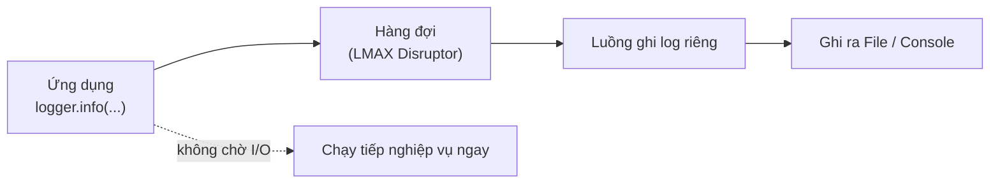

# 4. Log4j2

Log4j2 là một implementation ghi log của Apache, nổi bật ở hiệu năng cao, đặc biệt khi dùng async logger để ghi log bất đồng bộ. Bài này hướng dẫn cách cài đặt và thay thế Logback trong Spring Boot, cấu hình qua file `log4j2.xml`, bật async logger, so sánh với Logback, và nhắc lại bài học bảo mật quan trọng từ lỗ hổng Log4Shell.

[](pathname:///img/java/log4j2.webp)

---

:::note[Ghi nhớ nhanh]

- ⭐ **Log4j2 mạnh ở hiệu năng cao** — đặc biệt nhờ async logger (dùng thư viện LMAX Disruptor) ghi log bất đồng bộ.
- **Trong Spring Boot phải gỡ Logback** — rồi thêm `spring-boot-starter-log4j2`; không để cả hai cùng tồn tại.
- **Cấu hình bằng `log4j2.xml`** — cú pháp thẻ viết hoa chữ đầu, ý tưởng giống Logback.
- ⭐ **Nhớ lỗ hổng Log4Shell (CVE-2021-44228)** — luôn dùng phiên bản đã vá (từ 2.17.1 trở lên).
- **`additivity="false"`** — tránh log bị in trùng khi logger và root cùng gắn một appender.

:::

---

## Mục lục

- [Vì sao Log4j 2 ra đời?](#vì-sao-log4j-2-ra-đời)
- [Log4j2 là gì?](#log4j2-là-gì)
- [Cài đặt Log4j2](#cài-đặt-log4j2)
- [File cấu hình log4j2.xml](#file-cấu-hình-log4j2xml)
- [Async Logger: ghi log bất đồng bộ, hiệu năng cao](#async-logger-ghi-log-bất-đồng-bộ-hiệu-năng-cao)
- [So sánh Log4j2 với Logback](#so-sánh-log4j2-với-logback)
- [Lỗ hổng Log4Shell và việc cập nhật phiên bản](#lỗ-hổng-log4shell-và-việc-cập-nhật-phiên-bản)
- [Lỗi thường gặp](#lỗi-thường-gặp)
- [Tóm tắt](#tóm-tắt)
- [Câu hỏi phỏng vấn](#câu-hỏi-phỏng-vấn)

---

## Vì sao Log4j 2 ra đời?

**Vấn đề:** Log4j 1.x — thư viện logging lâu đời của Apache — đã ngừng phát triển từ năm 2015 và có nhiều hạn chế nghiêm trọng. Lớn nhất là logging **đồng bộ**: mỗi lần ghi log, luồng ứng dụng phải đứng chờ cho đến khi dữ liệu được ghi xong mới tiếp tục xử lý nghiệp vụ. Khi hệ thống ghi hàng triệu dòng log mỗi giây, điều này trở thành nút cổ chai rõ rệt:

```java
// Log4j 1.x — ghi log đồng bộ, luồng chính bị chặn cho đến khi ghi xong
logger.info("Xử lý đơn hàng #" + orderId + " cho khách " + customerName);
// ↑ Nối chuỗi tốn kém được thực hiện NGAY CẢ KHI level INFO bị tắt!
// ↑ Luồng phải CHỜ I/O ghi file xong mới chạy tiếp
```

**Giải pháp:** Log4j 2 thiết kế lại hoàn toàn với hai cải tiến cốt lõi:

1. **Async Loggers dùng LMAX Disruptor** — ứng dụng chỉ đẩy sự kiện log vào một hàng đợi tốc độ cao, luồng riêng biệt lo việc ghi file; luồng chính không bị chặn.
2. **Lazy evaluation qua lambda** — chuỗi log chỉ được tạo khi level thật sự được bật, tránh lãng phí CPU:

```java
// Log4j 2 — lazy evaluation: chuỗi chỉ được tạo khi DEBUG đang bật
logger.debug(() -> "Chi tiết đơn hàng: " + buildExpensiveDetail(order));

// Async logger: ứng dụng trả về ngay, Disruptor ghi file ở nền
logger.info("Đã xử lý đơn hàng #{}", orderId); // không chờ I/O
```

:::tip[Dùng thực tế]
- **Hệ thống tải cao** (e-commerce, fintech) cần ghi hàng triệu log/giây mà không làm chậm API.
- **Microservices** với nhiều luồng xử lý song song, cần logging không gây tranh chấp tài nguyên.
- **Batch processing** ghi log dày đặc theo từng bản ghi — async giúp throughput không sụt giảm.
- **Ứng dụng real-time** (trading, game server) nơi mỗi mili-giây độ trễ đều quan trọng.
:::

---

## Log4j2 là gì?

**Log4j2** (Apache Log4j 2) là một **implementation** ghi log của tổ chức Apache, thế hệ thứ hai của thư viện Log4j nổi tiếng. Giống Logback, nó là "nhà máy điện" ghi log thật, và cũng làm việc qua facade SLF4J.

Điểm nổi bật nhất của Log4j2 là **hiệu năng cao**, đặc biệt khi dùng **async logger** (ghi log bất đồng bộ). Vì vậy nó thường được chọn cho các hệ thống ghi RẤT NHIỀU log và cần tốc độ tối đa.

---

## Cài đặt Log4j2

Trong Spring Boot, mặc định là Logback. Muốn dùng Log4j2, bạn phải **gỡ Logback ra** rồi thêm Log4j2 vào:

```xml
<!-- pom.xml -->

<!-- 1) Gỡ Logback mặc định khỏi spring-boot-starter -->
<dependency>
    <groupId>org.springframework.boot</groupId>
    <artifactId>spring-boot-starter</artifactId>
    <exclusions>
        <exclusion>
            <groupId>org.springframework.boot</groupId>
            <artifactId>spring-boot-starter-logging</artifactId>
        </exclusion>
    </exclusions>
</dependency>

<!-- 2) Thêm starter Log4j2 thay thế -->
<dependency>
    <groupId>org.springframework.boot</groupId>
    <artifactId>spring-boot-starter-log4j2</artifactId>
</dependency>
```

Lưu ý quan trọng: không bao giờ để CẢ Logback lẫn Log4j2 cùng tồn tại — sẽ xung đột.

---

## File cấu hình log4j2.xml

Tạo file `log4j2.xml` (hoặc `log4j2-spring.xml`) trong `src/main/resources/`. Cấu trúc hơi khác Logback nhưng ý tưởng giống nhau:

```xml
<?xml version="1.0" encoding="UTF-8"?>
<Configuration status="WARN">

    <Appenders>
        <!-- Ghi log ra màn hình -->
        <Console name="Console" target="SYSTEM_OUT">
            <PatternLayout pattern="%d{HH:mm:ss} %-5level %logger{36} - %msg%n"/>
        </Console>

        <!-- Ghi log xoay file theo ngày và kích thước -->
        <RollingFile name="RollingFile"
                     fileName="logs/app.log"
                     filePattern="logs/app-%d{yyyy-MM-dd}-%i.log">
            <PatternLayout pattern="%d{yyyy-MM-dd HH:mm:ss} %-5level %logger{36} - %msg%n"/>
            <Policies>
                <!-- Xoay file mỗi ngày -->
                <TimeBasedTriggeringPolicy/>
                <!-- Xoay file khi vượt 10MB -->
                <SizeBasedTriggeringPolicy size="10MB"/>
            </Policies>
            <!-- Giữ tối đa 30 file cũ -->
            <DefaultRolloverStrategy max="30"/>
        </RollingFile>
    </Appenders>

    <Loggers>
        <!-- Level riêng cho code của bạn -->
        <Logger name="com.example.myapp" level="debug" additivity="false">
            <AppenderRef ref="Console"/>
            <AppenderRef ref="RollingFile"/>
        </Logger>

        <!-- Level mặc định cho phần còn lại -->
        <Root level="info">
            <AppenderRef ref="Console"/>
            <AppenderRef ref="RollingFile"/>
        </Root>
    </Loggers>

</Configuration>
```

So với Logback: thẻ viết hoa chữ cái đầu (`<Appenders>`, `<Console>`, `<Root>`), và appender file được gọi là `<RollingFile>`. Còn lại pattern, level, rolling đều cùng ý tưởng như bài Logback.

---

## Async Logger: ghi log bất đồng bộ, hiệu năng cao

Đây là "vũ khí" mạnh nhất của Log4j2.

- **Synchronous** (đồng bộ): chương trình phải ĐỢI ghi log xong mới chạy tiếp. Giống như bạn gọi món rồi đứng đợi bếp nấu xong mới rời quầy.
- **Asynchronous** (bất đồng bộ): chương trình ĐƯA log cho một luồng khác ghi giúp, rồi chạy tiếp ngay. Giống như bạn gọi món, lấy số rồi về bàn ngồi, bếp tự mang ra sau.

Async logger giúp chương trình KHÔNG bị chậm lại vì phải đợi ghi log, đặc biệt hữu ích khi ghi cực nhiều log. Cách bật đơn giản nhất: thêm thư viện **LMAX Disruptor** rồi đặt một thuộc tính hệ thống:

```xml
<!-- pom.xml: thư viện Disruptor để Log4j2 chạy async hiệu năng cao -->
<dependency>
    <groupId>com.lmax</groupId>
    <artifactId>disruptor</artifactId>
    <version>3.4.4</version>
</dependency>
```

```properties
# Đặt thuộc tính hệ thống để dùng async cho TẤT CẢ logger
# (truyền qua tham số -D khi chạy ứng dụng)
-Dlog4j2.contextSelector=org.apache.logging.log4j.core.async.AsyncLoggerContextSelector
```

Lưu ý: code ghi log vẫn y nguyên (`logger.info(...)`) — bạn chỉ đổi cấu hình, không sửa code nghiệp vụ.

Sơ đồ dưới minh hoạ vì sao async logger không làm chậm luồng chính: ứng dụng chỉ đẩy log vào hàng đợi rồi chạy tiếp ngay:



---

## So sánh Log4j2 với Logback

| Tiêu chí | Logback | Log4j2 |
|----------|---------|--------|
| Mặc định Spring Boot | Có (dùng ngay) | Không (phải thay thủ công) |
| Hiệu năng async | Tốt | **Rất tốt** (nhờ Disruptor) |
| Tên file cấu hình | `logback.xml` | `log4j2.xml` |
| Cú pháp XML | thẻ chữ thường | thẻ viết hoa chữ đầu |
| Độ phổ biến | Rất phổ biến | Phổ biến |

Lời khuyên cho người mới: nếu chưa có nhu cầu đặc biệt về hiệu năng, cứ dùng **Logback** mặc định. Chỉ chuyển sang Log4j2 khi bạn thật sự cần async logger tốc độ cao.

---

## Lỗ hổng Log4Shell và việc cập nhật phiên bản

Cuối năm 2021, Log4j2 dính một lỗ hổng bảo mật cực kỳ nghiêm trọng có tên **Log4Shell** (mã CVE-2021-44228). Lỗ hổng này nằm ở tính năng JNDI Lookup: kẻ tấn công chỉ cần gửi một chuỗi đặc biệt vào nội dung được log (ví dụ tên đăng nhập), Log4j2 sẽ "vô tình" tải và chạy mã độc từ máy chủ của kẻ tấn công.

Mức độ nguy hiểm: kẻ tấn công có thể chiếm quyền điều khiển máy chủ từ xa, chỉ qua một dòng log. Hàng triệu hệ thống trên thế giới bị ảnh hưởng.

Bài học và cách phòng tránh:

1. **Luôn dùng phiên bản Log4j2 mới và đã vá lỗi** (từ 2.17.1 trở lên, càng mới càng tốt). Đừng bao giờ dùng các phiên bản cũ dính lỗ hổng.

2. **Cập nhật thư viện thường xuyên.** Lỗ hổng bảo mật được phát hiện liên tục; cập nhật giúp bạn được vá kịp thời.

```xml
<!-- Luôn dùng phiên bản Log4j2 mới đã vá lỗ hổng -->
<dependency>
    <groupId>org.apache.logging.log4j</groupId>
    <artifactId>log4j-core</artifactId>
    <version>2.23.1</version>  <!-- dùng bản mới nhất ổn định -->
</dependency>
```

> Log4Shell là lời nhắc rằng: ngay cả một thư viện logging tưởng "vô hại" cũng có thể là cửa ngõ cho tấn công. Giữ thư viện luôn mới là một thói quen bảo mật quan trọng.

---

## Lỗi thường gặp

- **Để cả Logback lẫn Log4j2 trong dự án.** Gây xung đột, log có thể không chạy. Phải gỡ Logback trước khi thêm Log4j2.
- **Dùng phiên bản Log4j2 cũ dính Log4Shell.** Rủi ro bảo mật nghiêm trọng. Luôn dùng bản mới đã vá.
- **Quên thư viện Disruptor khi muốn async.** Không có Disruptor thì async không hoạt động tối ưu.
- **Đặt sai tên/đường dẫn file cấu hình.** Phải là `log4j2.xml` trong `src/main/resources/`.
- **Quên `additivity="false"`.** Nếu một logger và root cùng gắn một appender mà không đặt `additivity="false"`, log sẽ bị in TRÙNG hai lần.

---

## Tóm tắt

- **Log4j2** là implementation ghi log của Apache, nổi bật ở **hiệu năng cao**.
- Trong Spring Boot phải **gỡ Logback** rồi thêm `spring-boot-starter-log4j2`.
- Cấu hình qua `log4j2.xml`; cú pháp viết hoa chữ đầu, ý tưởng giống Logback.
- **Async logger** (cần thư viện Disruptor) giúp ghi log bất đồng bộ, không làm chậm chương trình.
- Nhớ vụ **Log4Shell**: luôn dùng phiên bản mới đã vá lỗi và cập nhật thư viện thường xuyên.
- Người mới chưa cần hiệu năng đặc biệt thì cứ dùng Logback mặc định.

---

## Câu hỏi phỏng vấn

Những câu thường gặp về chủ đề này. Tự trả lời trước, rồi bấm **Xem đáp án** để đối chiếu.

**1. Log4j2 là gì? Nó khác Log4j 1.x ở những điểm cốt lõi nào?**

<details className="qa">
<summary>Xem đáp án</summary>

**Log4j2** (Apache Log4j 2) là implementation ghi log của Apache, thế hệ thứ hai của Log4j, được viết lại hoàn toàn (không phải nâng cấp dần) từ Log4j 1.x.

Khác biệt cốt lõi:

- **Ghi log bất đồng bộ (async logging)**: Log4j 1.x ghi đồng bộ, luồng chính phải chờ I/O ghi xong; Log4j2 hỗ trợ **Async Loggers** dựa trên LMAX Disruptor, đẩy sự kiện log vào hàng đợi rồi trả quyền điều khiển ngay cho luồng chính.
- **Lazy evaluation qua lambda**: cho phép trì hoãn việc tạo chuỗi log tốn kém cho tới khi chắc chắn level đang được bật.
- **Tích hợp SLF4J tốt hơn** và kiến trúc plugin linh hoạt hơn cho appender/layout/filter.
- Log4j 1.x đã ngừng phát triển (end-of-life) từ 2015, không còn được vá lỗi bảo mật mới.

</details>

**2. Muốn dùng Log4j2 thay Logback trong dự án Spring Boot, cần làm những bước nào? Vì sao không được để cả hai cùng tồn tại?**

<details className="qa">
<summary>Xem đáp án</summary>

Hai bước bắt buộc:

1. **Loại trừ (`exclude`)** `spring-boot-starter-logging` khỏi `spring-boot-starter` (hoặc bất kỳ starter nào khác đang kéo theo nó) — starter này chứa Logback mặc định.
2. **Thêm** `spring-boot-starter-log4j2` để thay thế.

```xml
<dependency>
    <groupId>org.springframework.boot</groupId>
    <artifactId>spring-boot-starter</artifactId>
    <exclusions>
        <exclusion>
            <groupId>org.springframework.boot</groupId>
            <artifactId>spring-boot-starter-logging</artifactId>
        </exclusion>
    </exclusions>
</dependency>
<dependency>
    <groupId>org.springframework.boot</groupId>
    <artifactId>spring-boot-starter-log4j2</artifactId>
</dependency>
```

- Cả hai đều đăng ký làm **SLF4J provider** (implementation). Nếu để cả hai cùng tồn tại trong classpath, `SLF4J` sẽ báo cảnh báo "multiple SLF4J providers" và tự chọn một cái để dùng theo thứ tự nạp classpath — hành vi khó đoán trước, có thể khiến cấu hình bạn viết cho Log4j2 hoàn toàn không có tác dụng vì Logback lại được chọn.

</details>

**3. So sánh cấu trúc file cấu hình `log4j2.xml` với `logback.xml` — điểm giống và khác nhau về cú pháp?**

<details className="qa">
<summary>Xem đáp án</summary>

Giống nhau về ý tưởng: đều có phần khai báo appender (nơi ghi log) và phần khai báo logger/level.

Khác nhau về cú pháp:

| | Logback (`logback.xml`) | Log4j2 (`log4j2.xml`) |
|---|---|---|
| Tên thẻ | chữ thường (`<appender>`, `<root>`) | viết hoa chữ đầu (`<Appenders>`, `<Root>`) |
| Appender ghi màn hình | `ConsoleAppender` | `<Console>` |
| Appender xoay file | `RollingFileAppender` | `<RollingFile>` |
| Định dạng pattern | `<pattern>...</pattern>` trong `<encoder>` | `<PatternLayout pattern="..."/>` |
| Gắn appender vào logger | `<appender-ref ref="..."/>` | `<AppenderRef ref="..."/>` |

- Cả hai đều dùng chung ký hiệu pattern tương tự (`%d`, `%level`, `%logger`, `%msg`, `%n`) vì cùng kế thừa ý tưởng định dạng dòng log từ Log4j gốc.

</details>

**4. Async Logger trong Log4j2 hoạt động dựa trên cơ chế gì? Tại sao nó giúp ứng dụng không bị chậm lại khi ghi rất nhiều log?**

<details className="qa">
<summary>Xem đáp án</summary>

Async Logger dựa trên thư viện **LMAX Disruptor** — một cấu trúc hàng đợi vòng (ring buffer) hiệu năng cực cao, hầu như không cần khóa (lock-free).

- Ở chế độ **đồng bộ (synchronous)**: luồng ứng dụng gọi `logger.info(...)` phải **chờ** cho tới khi dữ liệu được ghi xong ra đích (file/console) mới được chạy tiếp code nghiệp vụ.
- Ở chế độ **bất đồng bộ (asynchronous)**: luồng ứng dụng chỉ cần đẩy sự kiện log vào hàng đợi Disruptor rồi **trả quyền điều khiển ngay lập tức**; một luồng riêng biệt khác đảm nhận việc lấy sự kiện ra khỏi hàng đợi và ghi thật ra đích.
- Nhờ vậy, chi phí I/O (ghi file, gửi qua mạng...) không còn nằm trên đường xử lý chính (critical path) của request, giúp giảm độ trễ và tăng thông lượng đáng kể cho hệ thống ghi log dày đặc.

</details>

**5. Giải thích vì sao cách viết log sau tối ưu hơn cách nối chuỗi truyền thống, đặc biệt khi `buildExpensiveDetail(order)` tốn nhiều tài nguyên để chạy.**

```java
logger.debug(() -> "Chi tiết đơn hàng: " + buildExpensiveDetail(order));
```

<details className="qa">
<summary>Xem đáp án</summary>

Đây là kỹ thuật **lazy evaluation** (tính toán trễ) bằng cách truyền vào một **lambda / `Supplier`** thay vì một `String` đã tính sẵn.

- Nếu viết `logger.debug("Chi tiết đơn hàng: " + buildExpensiveDetail(order))` như thông thường, Java **luôn phải chạy** `buildExpensiveDetail(order)` trước khi gọi `debug(...)`, bất kể level `DEBUG` có đang bật hay không.
- Với cách dùng lambda, Log4j2 chỉ **gọi hàm bên trong lambda** (tức mới chạy `buildExpensiveDetail(order)`) khi nó đã xác nhận level `DEBUG` đang được bật. Nếu `DEBUG` bị tắt, lambda **không bao giờ được thực thi**, tránh lãng phí tài nguyên cho phần tính toán tốn kém mà kết quả sẽ bị bỏ đi ngay.
- Đây là ưu điểm hơn cả cách dùng placeholder `{}` thông thường của SLF4J trong trường hợp tham số cần một phép tính phức tạp, chứ không chỉ là một biến có sẵn.

</details>

**6. Nêu ít nhất ba tiêu chí để quyết định chọn Log4j2 thay vì giữ Logback mặc định của Spring Boot trong một dự án thực tế.**

<details className="qa">
<summary>Xem đáp án</summary>

- **Yêu cầu thông lượng ghi log cực lớn**: hệ thống ghi hàng chục nghìn dòng log/giây trở lên (ví dụ hệ thống giao dịch tài chính tốc độ cao, hệ thống game server thời gian thực) — Async Logger của Log4j2 với Disruptor thường cho độ trễ ổn định và thông lượng cao hơn.
- **Độ nhạy cảm với độ trễ (latency)**: ứng dụng mà mỗi mili-giây đều quan trọng, không chấp nhận được việc luồng chính bị chặn bởi I/O ghi log.
- **Đã có kinh nghiệm/hạ tầng sẵn với Log4j2**: đội ngũ vận hành đã quen thuộc với cấu hình, công cụ giám sát cho Log4j2 từ trước.
- Ngược lại, nếu ứng dụng không có yêu cầu hiệu năng đặc biệt, nên **giữ Logback mặc định** để tận dụng tích hợp sẵn có của Spring Boot, giảm rủi ro cấu hình sai khi phải tự thay thế thủ công.

</details>

**7. Log4Shell (CVE-2021-44228) là gì? Lỗ hổng này khai thác cơ chế nào của Log4j2, và vì sao mức độ nguy hiểm được đánh giá cực kỳ nghiêm trọng?**

<details className="qa">
<summary>Xem đáp án</summary>

**Log4Shell** là lỗ hổng bảo mật nghiêm trọng (CVE-2021-44228, điểm CVSS gần tối đa 10.0) được công bố cuối năm 2021, ảnh hưởng các phiên bản Log4j2 từ 2.0-beta9 đến 2.14.1.

- Cơ chế: Log4j2 có tính năng **JNDI Lookup** — cho phép cú pháp đặc biệt trong message log (ví dụ `${jndi:ldap://...}`) tự động **tra cứu và tải tài nguyên từ xa** qua JNDI (Java Naming and Directory Interface).
- Nếu một chuỗi do người dùng nhập (ví dụ tên đăng nhập, User-Agent header, tên file upload) bị ghi thẳng vào log mà chứa cú pháp JNDI Lookup độc hại, Log4j2 sẽ **tự động kết nối tới máy chủ của kẻ tấn công** và **tải, thực thi mã Java độc hại** — dẫn tới remote code execution (thực thi mã từ xa) ngay trên máy chủ nạn nhân.
- Mức độ nguy hiểm cực cao vì: (1) khai thác rất đơn giản, chỉ cần gửi một chuỗi trong bất kỳ input nào bị log lại; (2) Log4j2 được dùng trong hàng triệu ứng dụng Java trên thế giới, kể cả gián tiếp qua các thư viện phụ thuộc; (3) hậu quả là chiếm quyền điều khiển hoàn toàn máy chủ.

</details>

**8. Ngoài việc nâng cấp lên phiên bản đã vá, còn cách nào khác để giảm thiểu rủi ro Log4Shell nếu vì lý do nào đó chưa thể nâng cấp ngay?**

<details className="qa">
<summary>Xem đáp án</summary>

- **Nâng cấp lên phiên bản đã vá** vẫn là giải pháp triệt để nhất — từ **2.17.1 trở lên** đã khắc phục đầy đủ cả Log4Shell (CVE-2021-44228) lẫn các lỗ hổng liên quan phát hiện sau đó (ví dụ CVE-2021-45105 về DoS, CVE-2021-44832).
- Nếu chưa thể nâng cấp ngay (ví dụ hệ thống legacy khó thay đổi), các biện pháp giảm thiểu tạm thời từng được khuyến nghị:
  - Đặt system property `log4j2.formatMsgNoLookups=true` để tắt tính năng lookup trong message (hiệu quả với một số phiên bản trung gian).
  - **Xóa thủ công class `JndiLookup.class`** khỏi file `log4j-core-*.jar` để vô hiệu hóa hoàn toàn tính năng JNDI Lookup.
  - Chặn kết nối mạng ra ngoài (outbound) từ máy chủ ứng dụng tới các giao thức LDAP/RMI không cần thiết, hạn chế khả năng khai thác dù lỗ hổng còn tồn tại.
- Các biện pháp giảm thiểu chỉ nên là **giải pháp tạm thời**, nâng cấp phiên bản vẫn là ưu tiên hàng đầu.

</details>

**9. Thuộc tính `additivity="false"` trong `<Logger>` của Log4j2 có tác dụng gì? Vì sao thiếu nó có thể gây log bị in trùng?**

<details className="qa">
<summary>Xem đáp án</summary>

Mặc định, một `<Logger>` không chỉ ghi log qua các `<AppenderRef>` của chính nó, mà còn **truyền tiếp (propagate)** sự kiện log lên `<Root>` (và các logger cha khác nếu có) — hành vi này gọi là **additivity**, mặc định `true`.

```xml
<Logger name="com.example.myapp" level="debug">
    <AppenderRef ref="Console"/>
</Logger>

<Root level="info">
    <AppenderRef ref="Console"/>
</Root>
```

- Với cấu hình trên (thiếu `additivity="false"`), một log từ `com.example.myapp` sẽ được ghi ra `Console` **hai lần**: một lần qua `AppenderRef` của chính `Logger`, một lần nữa vì sự kiện tiếp tục "chảy" lên `Root` và được ghi qua `AppenderRef` của `Root`.
- Đặt `additivity="false"` để log chỉ đi qua đúng appender được khai báo cho logger đó, không lan tiếp lên logger cha, tránh bị in trùng.

</details>

**10. Với đoạn cấu hình sau, một log `logger.debug(...)` phát ra từ class `com.example.myapp.OrderService` có được ghi ra không? Còn từ class `com.example.other.Utils` thì sao?**

```xml
<Loggers>
    <Logger name="com.example.myapp" level="debug" additivity="false">
        <AppenderRef ref="Console"/>
    </Logger>
    <Root level="info">
        <AppenderRef ref="Console"/>
    </Root>
</Loggers>
```

<details className="qa">
<summary>Xem đáp án</summary>

- **`com.example.myapp.OrderService`**: log `DEBUG` sẽ **được ghi ra**. Log4j2 chọn logger có tên khớp **gần nhất** (theo package) với class đang log; `com.example.myapp.OrderService` khớp với `<Logger name="com.example.myapp">` (khớp theo tiền tố package), nên áp dụng level `debug` của logger này, thấp hơn ngưỡng nên vẫn được ghi.
- **`com.example.other.Utils`**: log `DEBUG` sẽ **KHÔNG được ghi**. Class này không khớp với logger `com.example.myapp` nào, nên rơi về `<Root level="info">` — mà `DEBUG` thấp hơn ngưỡng `INFO` của root, nên bị lọc bỏ.
- Đây là ví dụ điển hình cho việc log level được áp dụng theo package cụ thể, ưu tiên logger khớp gần nhất trước khi rơi về `Root`.

</details>

**11. Vì sao nói Log4Shell không chỉ là lỗi của riêng Log4j2, mà còn là bài học chung về rủi ro bảo mật khi dùng thư viện bên thứ ba trong dự án Java?**

<details className="qa">
<summary>Xem đáp án</summary>

- Rất nhiều dự án **không trực tiếp** khai báo Log4j2, mà nó bị kéo vào **gián tiếp** qua một thư viện phụ thuộc khác (transitive dependency) — nhiều đội phát triển thậm chí không biết mình đang dùng Log4j2 cho tới khi lỗ hổng được công bố.
- Bài học rút ra:
  - Cần công cụ quét dependency (SCA — software composition analysis, ví dụ OWASP Dependency-Check) để phát hiện thư viện có lỗ hổng đã biết, kể cả dependency gián tiếp.
  - Nguyên tắc **"không tin dữ liệu đầu vào"** áp dụng cả cho những nơi tưởng chừng vô hại như logging — dữ liệu người dùng nhập vào không nên được xử lý bằng các tính năng "thông minh" tự động (như JNDI Lookup) mà không kiểm soát chặt.
  - Luôn có quy trình **cập nhật bản vá bảo mật nhanh** cho mọi dependency, không chỉ dependency chính của dự án mà cả các thư viện logging, utility tưởng chừng không quan trọng.

</details>
