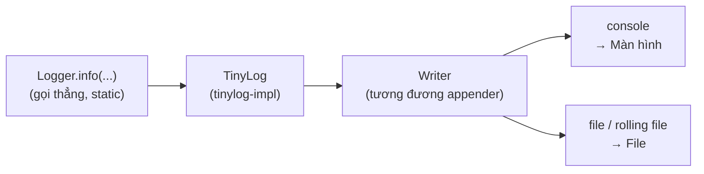

# 5. TinyLog

TinyLog là một thư viện logging siêu nhẹ cho Java với triết lý đơn giản tối đa: gọi thẳng `Logger.info(...)` mà không cần tạo logger riêng cho từng lớp, cấu hình chỉ bằng một file `.properties` ngắn gọn. Bài này hướng dẫn cách cài đặt, ghi log, cấu hình ghi ra màn hình và file, đồng thời so sánh với Logback/Log4j2 để bạn biết khi nào nên chọn TinyLog cho ứng dụng nhỏ, CLI hay demo.

---

## Mục lục

- [Vì sao TinyLog ra đời?](#vì-sao-tinylog-ra-đời)
- [TinyLog là gì?](#tinylog-là-gì)
- [Cài đặt TinyLog](#cài-đặt-tinylog)
- [Ghi log với Logger.info](#ghi-log-với-loggerinfo)
- [Cấu hình tối giản với tinylog.properties](#cấu-hình-tối-giản-với-tinylogproperties)
- [Ghi log ra file](#ghi-log-ra-file)
- [Khi nào nên dùng TinyLog?](#khi-nào-nên-dùng-tinylog)
- [So sánh nhanh TinyLog với Logback/Log4j2](#so-sánh-nhanh-tinylog-với-logbacklog4j2)
- [Lỗi thường gặp](#lỗi-thường-gặp)
- [Tóm tắt](#tóm-tắt)

---

## Vì sao TinyLog ra đời?

**Vấn đề:** Các framework logging phổ biến như Log4j2 hay Logback rất mạnh, nhưng đòi hỏi nhiều dependency và cấu hình XML dài dòng. Với mỗi lớp, lập trình viên phải khai báo một logger riêng — lặp đi lặp lại và dễ quên. Ứng dụng nhỏ, công cụ CLI hay bài demo không cần đến sức mạnh đó nhưng vẫn phải gánh toàn bộ sự phức tạp:

```java
// Logback / Log4j2: mỗi lớp phải khai báo logger riêng
import org.slf4j.Logger;
import org.slf4j.LoggerFactory;

public class OrderService {
    // Phải lặp lại dòng này ở TỪNG lớp
    private static final Logger log = LoggerFactory.getLogger(OrderService.class);

    public void taoDonHang(String maDon) {
        log.info("Đang tạo đơn hàng: {}", maDon);
    }
}
```

Chưa kể file cấu hình XML có thể dài hàng chục dòng ngay cả khi chỉ cần ghi log ra console.

**Giải pháp:** TinyLog loại bỏ hoàn toàn boilerplate trên. Một JAR nhỏ, API tĩnh đơn giản, cấu hình chỉ vài dòng `.properties` — gọi thẳng `Logger.info(...)` từ bất kỳ lớp nào mà không cần khai báo gì thêm:

```java
// TinyLog: gọi thẳng, không cần khai báo logger cho từng lớp
import org.tinylog.Logger;

public class OrderService {
    public void taoDonHang(String maDon) {
        Logger.info("Đang tạo đơn hàng: {}", maDon); // sạch, gọn
    }
}
```

:::tip[Dùng thực tế]
- Viết công cụ dòng lệnh (CLI) hoặc script Java cần log nhanh mà không muốn cấu hình XML.
- Tạo bài demo, bài tập học tập, prototype khi tốc độ khởi động và sự đơn giản là ưu tiên hàng đầu.
- Phát triển ứng dụng Android hoặc môi trường nhúng nơi dung lượng thư viện cần giữ nhỏ nhất.
- Dự án cá nhân nhỏ không cần hệ sinh thái logging đầy đủ của Logback hay Log4j2.
:::

---

## TinyLog là gì?

**TinyLog** (cái tên đã nói lên tất cả: "tiny" nghĩa là tí hon) là một thư viện logging
**siêu nhẹ** cho Java. Toàn bộ thư viện chỉ vài trăm KB, rất gọn so với Logback hay Log4j2.

Điểm hấp dẫn nhất của TinyLog là **đơn giản tối đa**:

- Không cần tạo đối tượng `Logger` cho từng lớp — gọi thẳng `Logger.info(...)`.
- Cấu hình chỉ là một file `tinylog.properties` ngắn gọn vài dòng.
- Tự động kèm tên lớp, tên hàm, số dòng vào log mà không cần khai báo gì.

Nếu Logback/Log4j2 là "nhà máy điện" lớn với nhiều van điều khiển, thì TinyLog là một
"viên pin nhỏ" — gọn nhẹ, cắm vào là chạy.

---

## Cài đặt TinyLog

TinyLog gồm hai phần: phần API (để gọi log) và phần implementation (để ghi log thật).
Thêm cả hai vào Maven:

```xml
<!-- pom.xml -->

<!-- Phần API: cung cấp lớp Logger để gọi log -->
<dependency>
    <groupId>org.tinylog</groupId>
    <artifactId>tinylog-api</artifactId>
    <version>2.7.0</version>
</dependency>

<!-- Phần implementation: thực sự ghi log ra màn hình/file -->
<dependency>
    <groupId>org.tinylog</groupId>
    <artifactId>tinylog-impl</artifactId>
    <version>2.7.0</version>
</dependency>
```

---

## Ghi log với Logger.info

Khác với SLF4J (phải tạo logger riêng cho mỗi lớp), TinyLog cho phép gọi thẳng các phương
thức **static** trên lớp `Logger`:

```java
import org.tinylog.Logger;

public class OrderService {

    public void taoDonHang(String maDon) {
        // Gọi thẳng Logger.info, KHÔNG cần tạo logger riêng cho lớp.
        // TinyLog tự biết log này phát ra từ lớp OrderService.
        Logger.info("Đang tạo đơn hàng: {}", maDon);
    }
}
```

TinyLog cũng hỗ trợ đầy đủ các mức log và dùng placeholder `{}` giống SLF4J:

```java
Logger.trace("Bắt đầu xử lý");                 // chi tiết nhất
Logger.debug("Giá trị tổng = {}", tong);        // để gỡ lỗi
Logger.info("Người dùng {} đăng nhập", email);  // thông tin bình thường
Logger.warn("Sắp hết bộ nhớ: {}%", phanTram);   // cảnh báo
Logger.error("Lỗi thanh toán đơn {}", maDon);   // lỗi

// Ghi log lỗi kèm exception: truyền exception làm tham số ĐẦU TIÊN
try {
    thanhToan(maDon);
} catch (Exception e) {
    Logger.error(e, "Thanh toán thất bại cho đơn {}", maDon);
}
```

> Lưu ý nhỏ: ở TinyLog, exception đứng ở vị trí **đầu** (`Logger.error(e, "...")`), khác
> với SLF4J để exception ở **cuối**.

---

## Cấu hình tối giản với tinylog.properties

TinyLog cấu hình bằng file `tinylog.properties` đặt trong `src/main/resources/`. Cú pháp
là dạng `khóa = giá trị`, rất dễ đọc:

```properties
# Mức log tối thiểu sẽ được ghi (INFO trở lên).
# Thấp hơn INFO như DEBUG, TRACE sẽ bị bỏ qua.
level = info

# Khai báo một writer (bộ ghi) tên "console" ghi ra màn hình.
writer        = console

# Định dạng mỗi dòng log:
# {date} = thời gian, {level} = mức, {class} = tên lớp, {message} = nội dung
writer.format = {date: yyyy-MM-dd HH:mm:ss} {level}: {class}.{method}() - {message}
```

Trong TinyLog, **writer** chính là khái niệm tương đương với "appender" của Logback —
nó quyết định log được ghi ra đâu (console, file...).

Sơ đồ dưới minh hoạ luồng ghi log tối giản của TinyLog: gọi thẳng `Logger.info` rồi writer đưa log tới đích:



Các trường định dạng hay dùng:

| Trường | Ý nghĩa |
|--------|---------|
| `{date}` | thời gian (có thể kèm định dạng) |
| `{level}` | mức log |
| `{class}` | tên lớp ghi log |
| `{method}` | tên phương thức |
| `{line}` | số dòng code |
| `{message}` | nội dung thông điệp |

---

## Ghi log ra file

Để ghi vào file, chỉ cần đổi `writer` thành `file` và thêm đường dẫn:

```properties
level = info

# Ghi log vào file thay vì console
writer      = file
writer.file = logs/app.log
writer.format = {date: yyyy-MM-dd HH:mm:ss} {level}: {class} - {message}
```

TinyLog cũng hỗ trợ xoay file (rolling) qua writer tên `rolling file`:

```properties
# Writer xoay file: tạo file mới khi vượt 10MB, giữ tối đa 5 file cũ
writer            = rolling file
writer.file       = logs/app_{count}.log
writer.policies   = size: 10mb
writer.backups    = 5
writer.format     = {date: yyyy-MM-dd HH:mm:ss} {level}: {class} - {message}
```

Bạn cũng có thể khai báo NHIỀU writer cùng lúc (vừa console vừa file) bằng cách đánh số:

```properties
# Writer thứ nhất: ra màn hình
writer1        = console
writer1.format = {level}: {message}

# Writer thứ hai: ra file
writer2        = file
writer2.file   = logs/app.log
writer2.format = {date} {level}: {class} - {message}
```

---

## Khi nào nên dùng TinyLog?

TinyLog phù hợp khi:

- **Ứng dụng nhỏ, công cụ dòng lệnh (CLI), bài tập, demo.** Bạn muốn log nhanh gọn mà
  không phải viết file XML dài.
- **Cần thư viện nhẹ.** Dung lượng nhỏ, ít phụ thuộc, khởi động nhanh — hợp cho ứng dụng
  cần gọn nhẹ.
- **Muốn cấu hình tối giản.** Một file `.properties` vài dòng là đủ, không cần XML phức
  tạp.

KHÔNG nên dùng TinyLog khi:

- Dự án lớn dùng Spring Boot (đã có sẵn Logback, tích hợp tốt hơn).
- Cần cấu hình logging cực kỳ phức tạp, nhiều quy tắc đặc thù.
- Cần hệ sinh thái lớn với nhiều appender/plugin (Logback và Log4j2 mạnh hơn ở điểm này).

---

## So sánh nhanh TinyLog với Logback/Log4j2

| Tiêu chí | TinyLog | Logback / Log4j2 |
|----------|---------|------------------|
| Dung lượng | Rất nhỏ | Lớn hơn |
| Cấu hình | `.properties` vài dòng | XML dài hơn |
| Cách gọi | `Logger.info(...)` trực tiếp | Tạo logger riêng mỗi lớp |
| Tính linh hoạt | Vừa đủ | Rất cao |
| Phù hợp | Ứng dụng nhỏ, CLI, demo | Dự án lớn, doanh nghiệp |

---

## Lỗi thường gặp

- **Quên thêm `tinylog-impl`.** Chỉ có `tinylog-api` thì log không xuất hiện (giống SLF4J
  thiếu implementation).
- **Đặt sai vị trí `tinylog.properties`.** Phải nằm trong `src/main/resources/` để có mặt
  trong classpath.
- **Nhầm vị trí exception.** Ở TinyLog, exception đứng ĐẦU `Logger.error(e, "...")`, không
  phải cuối như SLF4J.
- **Dùng TinyLog trong dự án Spring Boot lớn.** Có thể chạy nhưng kém tích hợp; nên dùng
  Logback mặc định.
- **Đặt `level` quá cao.** Nếu để `level = error`, các log INFO/DEBUG sẽ biến mất khiến
  bạn tưởng log "không chạy".

---

## Tóm tắt

- **TinyLog** là thư viện logging **siêu nhẹ**, cấu hình tối giản.
- Cần cả `tinylog-api` (gọi log) lẫn `tinylog-impl` (ghi log thật).
- Gọi thẳng `Logger.info(...)` mà không cần tạo logger riêng cho từng lớp.
- Cấu hình bằng `tinylog.properties` vài dòng; **writer** đóng vai trò như appender.
- Hợp với **ứng dụng nhỏ, CLI, demo**; dự án lớn nên dùng Logback/Log4j2.
- Lưu ý exception đứng ở vị trí **đầu** trong `Logger.error(e, "...")`.
