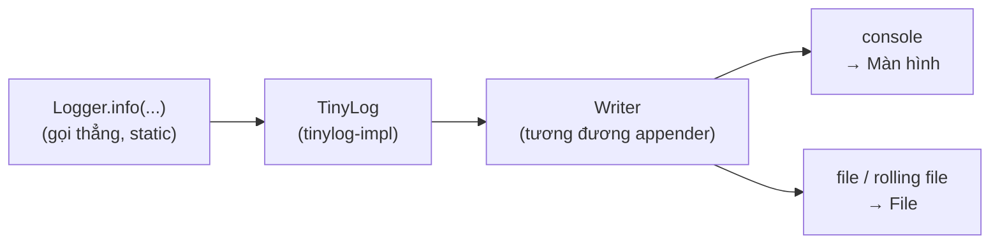

# 5. TinyLog

TinyLog là một thư viện logging siêu nhẹ cho Java với triết lý đơn giản tối đa: gọi thẳng `Logger.info(...)` mà không cần tạo logger riêng cho từng lớp, cấu hình chỉ bằng một file `.properties` ngắn gọn. Bài này hướng dẫn cách cài đặt, ghi log, cấu hình ghi ra màn hình và file, đồng thời so sánh với Logback/Log4j2 để bạn biết khi nào nên chọn TinyLog cho ứng dụng nhỏ, CLI hay demo.

[](pathname:///img/java/tinylog.webp)

---

:::note[Ghi nhớ nhanh]

- ⭐ **TinyLog siêu nhẹ, đơn giản tối đa** — gọi thẳng `Logger.info(...)` mà không cần tạo logger riêng cho từng lớp.
- **Cần cả hai phần** — `tinylog-api` (gọi log) lẫn `tinylog-impl` (ghi log thật).
- **Cấu hình tối giản** — một file `tinylog.properties` vài dòng; `writer` đóng vai trò như appender.
- ⭐ **Exception đứng ĐẦU** — `Logger.error(e, "...")`, ngược với SLF4J đặt exception ở cuối.
- **Phù hợp ứng dụng nhỏ/CLI/demo** — dự án lớn dùng Spring Boot nên chọn Logback/Log4j2.

:::

---

## Mục lục

- [Vì sao TinyLog ra đời?](#vì-sao-tinylog-ra-đời)
- [TinyLog là gì?](#tinylog-là-gì)
- [Cài đặt TinyLog](#cài-đặt-tinylog)
- [Ghi log với Logger.info](#ghi-log-với-loggerinfo)
- [Cấu hình tối giản với tinylog.properties](#cấu-hình-tối-giản-với-tinylogproperties)
- [Ghi log ra file](#ghi-log-ra-file)
- [Khi nào nên dùng TinyLog?](#khi-nào-nên-dùng-tinylog)
- [So sánh nhanh TinyLog với Logback/Log4j2](#so-sánh-nhanh-tinylog-với-logbacklog4j2)
- [Lỗi thường gặp](#lỗi-thường-gặp)
- [Tóm tắt](#tóm-tắt)
- [Câu hỏi phỏng vấn](#câu-hỏi-phỏng-vấn)

---

## Vì sao TinyLog ra đời?

**Vấn đề:** Các framework logging phổ biến như Log4j2 hay Logback rất mạnh, nhưng đòi hỏi nhiều dependency và cấu hình XML dài dòng. Với mỗi lớp, lập trình viên phải khai báo một logger riêng — lặp đi lặp lại và dễ quên. Ứng dụng nhỏ, công cụ CLI hay bài demo không cần đến sức mạnh đó nhưng vẫn phải gánh toàn bộ sự phức tạp:

```java
// Logback / Log4j2: mỗi lớp phải khai báo logger riêng
import org.slf4j.Logger;
import org.slf4j.LoggerFactory;

public class OrderService {
    // Phải lặp lại dòng này ở TỪNG lớp
    private static final Logger log = LoggerFactory.getLogger(OrderService.class);

    public void taoDonHang(String maDon) {
        log.info("Đang tạo đơn hàng: {}", maDon);
    }
}
```

Chưa kể file cấu hình XML có thể dài hàng chục dòng ngay cả khi chỉ cần ghi log ra console.

**Giải pháp:** TinyLog loại bỏ hoàn toàn boilerplate trên. Một JAR nhỏ, API tĩnh đơn giản, cấu hình chỉ vài dòng `.properties` — gọi thẳng `Logger.info(...)` từ bất kỳ lớp nào mà không cần khai báo gì thêm:

```java
// TinyLog: gọi thẳng, không cần khai báo logger cho từng lớp
import org.tinylog.Logger;

public class OrderService {
    public void taoDonHang(String maDon) {
        Logger.info("Đang tạo đơn hàng: {}", maDon); // sạch, gọn
    }
}
```

:::tip[Dùng thực tế]
- Viết công cụ dòng lệnh (CLI) hoặc script Java cần log nhanh mà không muốn cấu hình XML.
- Tạo bài demo, bài tập học tập, prototype khi tốc độ khởi động và sự đơn giản là ưu tiên hàng đầu.
- Phát triển ứng dụng Android hoặc môi trường nhúng nơi dung lượng thư viện cần giữ nhỏ nhất.
- Dự án cá nhân nhỏ không cần hệ sinh thái logging đầy đủ của Logback hay Log4j2.
:::

---

## TinyLog là gì?

**TinyLog** (cái tên đã nói lên tất cả: "tiny" nghĩa là tí hon) là một thư viện logging **siêu nhẹ** cho Java. Toàn bộ thư viện chỉ vài trăm KB, rất gọn so với Logback hay Log4j2.

Điểm hấp dẫn nhất của TinyLog là **đơn giản tối đa**:

- Không cần tạo đối tượng `Logger` cho từng lớp — gọi thẳng `Logger.info(...)`.
- Cấu hình chỉ là một file `tinylog.properties` ngắn gọn vài dòng.
- Tự động kèm tên lớp, tên hàm, số dòng vào log mà không cần khai báo gì.

Nếu Logback/Log4j2 là "nhà máy điện" lớn với nhiều van điều khiển, thì TinyLog là một "viên pin nhỏ" — gọn nhẹ, cắm vào là chạy.

---

## Cài đặt TinyLog

TinyLog gồm hai phần: phần API (để gọi log) và phần implementation (để ghi log thật). Thêm cả hai vào Maven:

```xml
<!-- pom.xml -->

<!-- Phần API: cung cấp lớp Logger để gọi log -->
<dependency>
    <groupId>org.tinylog</groupId>
    <artifactId>tinylog-api</artifactId>
    <version>2.7.0</version>
</dependency>

<!-- Phần implementation: thực sự ghi log ra màn hình/file -->
<dependency>
    <groupId>org.tinylog</groupId>
    <artifactId>tinylog-impl</artifactId>
    <version>2.7.0</version>
</dependency>
```

---

## Ghi log với Logger.info

Khác với SLF4J (phải tạo logger riêng cho mỗi lớp), TinyLog cho phép gọi thẳng các phương thức **static** trên lớp `Logger`:

```java
import org.tinylog.Logger;

public class OrderService {

    public void taoDonHang(String maDon) {
        // Gọi thẳng Logger.info, KHÔNG cần tạo logger riêng cho lớp.
        // TinyLog tự biết log này phát ra từ lớp OrderService.
        Logger.info("Đang tạo đơn hàng: {}", maDon);
    }
}
```

TinyLog cũng hỗ trợ đầy đủ các mức log và dùng placeholder `{}` giống SLF4J:

```java
Logger.trace("Bắt đầu xử lý");                 // chi tiết nhất
Logger.debug("Giá trị tổng = {}", tong);        // để gỡ lỗi
Logger.info("Người dùng {} đăng nhập", email);  // thông tin bình thường
Logger.warn("Sắp hết bộ nhớ: {}%", phanTram);   // cảnh báo
Logger.error("Lỗi thanh toán đơn {}", maDon);   // lỗi

// Ghi log lỗi kèm exception: truyền exception làm tham số ĐẦU TIÊN
try {
    thanhToan(maDon);
} catch (Exception e) {
    Logger.error(e, "Thanh toán thất bại cho đơn {}", maDon);
}
```

> Lưu ý nhỏ: ở TinyLog, exception đứng ở vị trí **đầu** (`Logger.error(e, "...")`), khác với SLF4J để exception ở **cuối**.

---

## Cấu hình tối giản với tinylog.properties

TinyLog cấu hình bằng file `tinylog.properties` đặt trong `src/main/resources/`. Cú pháp là dạng `khóa = giá trị`, rất dễ đọc:

```properties
# Mức log tối thiểu sẽ được ghi (INFO trở lên).
# Thấp hơn INFO như DEBUG, TRACE sẽ bị bỏ qua.
level = info

# Khai báo một writer (bộ ghi) tên "console" ghi ra màn hình.
writer        = console

# Định dạng mỗi dòng log:
# {date} = thời gian, {level} = mức, {class} = tên lớp, {message} = nội dung
writer.format = {date: yyyy-MM-dd HH:mm:ss} {level}: {class}.{method}() - {message}
```

Trong TinyLog, **writer** chính là khái niệm tương đương với "appender" của Logback — nó quyết định log được ghi ra đâu (console, file...).

Sơ đồ dưới minh hoạ luồng ghi log tối giản của TinyLog: gọi thẳng `Logger.info` rồi writer đưa log tới đích:


```mermaid
flowchart LR
    A["Logger.info(...)<br/>(gọi thẳng, static)"] --> B["TinyLog<br/>(tinylog-impl)"]
    B --> C["Writer<br/>(tương đương appender)"]
    C --> D["console<br/>→ Màn hình"]
    C --> E["file / rolling file<br/>→ File"]
```

Các trường định dạng hay dùng:

| Trường | Ý nghĩa |
|--------|---------|
| `{date}` | thời gian (có thể kèm định dạng) |
| `{level}` | mức log |
| `{class}` | tên lớp ghi log |
| `{method}` | tên phương thức |
| `{line}` | số dòng code |
| `{message}` | nội dung thông điệp |

---

## Ghi log ra file

Để ghi vào file, chỉ cần đổi `writer` thành `file` và thêm đường dẫn:

```properties
level = info

# Ghi log vào file thay vì console
writer      = file
writer.file = logs/app.log
writer.format = {date: yyyy-MM-dd HH:mm:ss} {level}: {class} - {message}
```

TinyLog cũng hỗ trợ xoay file (rolling) qua writer tên `rolling file`:

```properties
# Writer xoay file: tạo file mới khi vượt 10MB, giữ tối đa 5 file cũ
writer            = rolling file
writer.file       = logs/app_{count}.log
writer.policies   = size: 10mb
writer.backups    = 5
writer.format     = {date: yyyy-MM-dd HH:mm:ss} {level}: {class} - {message}
```

Bạn cũng có thể khai báo NHIỀU writer cùng lúc (vừa console vừa file) bằng cách đánh số:

```properties
# Writer thứ nhất: ra màn hình
writer1        = console
writer1.format = {level}: {message}

# Writer thứ hai: ra file
writer2        = file
writer2.file   = logs/app.log
writer2.format = {date} {level}: {class} - {message}
```

---

## Khi nào nên dùng TinyLog?

TinyLog phù hợp khi:

- **Ứng dụng nhỏ, công cụ dòng lệnh (CLI), bài tập, demo.** Bạn muốn log nhanh gọn mà không phải viết file XML dài.
- **Cần thư viện nhẹ.** Dung lượng nhỏ, ít phụ thuộc, khởi động nhanh — hợp cho ứng dụng cần gọn nhẹ.
- **Muốn cấu hình tối giản.** Một file `.properties` vài dòng là đủ, không cần XML phức tạp.

KHÔNG nên dùng TinyLog khi:

- Dự án lớn dùng Spring Boot (đã có sẵn Logback, tích hợp tốt hơn).
- Cần cấu hình logging cực kỳ phức tạp, nhiều quy tắc đặc thù.
- Cần hệ sinh thái lớn với nhiều appender/plugin (Logback và Log4j2 mạnh hơn ở điểm này).

---

## So sánh nhanh TinyLog với Logback/Log4j2

| Tiêu chí | TinyLog | Logback / Log4j2 |
|----------|---------|------------------|
| Dung lượng | Rất nhỏ | Lớn hơn |
| Cấu hình | `.properties` vài dòng | XML dài hơn |
| Cách gọi | `Logger.info(...)` trực tiếp | Tạo logger riêng mỗi lớp |
| Tính linh hoạt | Vừa đủ | Rất cao |
| Phù hợp | Ứng dụng nhỏ, CLI, demo | Dự án lớn, doanh nghiệp |

---

## Lỗi thường gặp

- **Quên thêm `tinylog-impl`.** Chỉ có `tinylog-api` thì log không xuất hiện (giống SLF4J thiếu implementation).
- **Đặt sai vị trí `tinylog.properties`.** Phải nằm trong `src/main/resources/` để có mặt trong classpath.
- **Nhầm vị trí exception.** Ở TinyLog, exception đứng ĐẦU `Logger.error(e, "...")`, không phải cuối như SLF4J.
- **Dùng TinyLog trong dự án Spring Boot lớn.** Có thể chạy nhưng kém tích hợp; nên dùng Logback mặc định.
- **Đặt `level` quá cao.** Nếu để `level = error`, các log INFO/DEBUG sẽ biến mất khiến bạn tưởng log "không chạy".

---

## Tóm tắt

- **TinyLog** là thư viện logging **siêu nhẹ**, cấu hình tối giản.
- Cần cả `tinylog-api` (gọi log) lẫn `tinylog-impl` (ghi log thật).
- Gọi thẳng `Logger.info(...)` mà không cần tạo logger riêng cho từng lớp.
- Cấu hình bằng `tinylog.properties` vài dòng; **writer** đóng vai trò như appender.
- Hợp với **ứng dụng nhỏ, CLI, demo**; dự án lớn nên dùng Logback/Log4j2.
- Lưu ý exception đứng ở vị trí **đầu** trong `Logger.error(e, "...")`.

---

## Câu hỏi phỏng vấn

Những câu thường gặp về chủ đề này. Tự trả lời trước, rồi bấm **Xem đáp án** để đối chiếu.

**1. TinyLog khác gì so với cách dùng SLF4J trong việc tạo logger cho mỗi lớp?**

<details className="qa">
<summary>Xem đáp án</summary>

- Với **SLF4J**, mỗi lớp phải tự khai báo một logger riêng: `private static final Logger log = LoggerFactory.getLogger(TenLop.class);`, rồi mới gọi `log.info(...)`.
- Với **TinyLog**, bạn gọi thẳng phương thức **static** trên lớp `Logger`: `Logger.info(...)`, không cần khai báo hay tạo instance gì trong từng lớp. TinyLog tự nhận diện lớp/phương thức/dòng code phát ra log dựa trên stack trace tại thời điểm gọi.
- Đánh đổi: cách gọi thẳng của TinyLog tiện lợi hơn nhưng phải trả giá bằng việc phân tích stack trace mỗi lần log, có thể chậm hơn một chút so với việc đã biết sẵn context qua đối tượng logger tạo trước.

</details>

**2. TinyLog gồm những thành phần dependency nào? Nếu chỉ thêm `tinylog-api` mà quên `tinylog-impl` thì xảy ra chuyện gì?**

<details className="qa">
<summary>Xem đáp án</summary>

TinyLog gồm hai phần tách biệt, giống mô hình facade/implementation:

- **`tinylog-api`**: cung cấp lớp `Logger` để gọi log trong code.
- **`tinylog-impl`**: implementation thực sự xử lý và ghi log ra đích (console/file).

Nếu chỉ thêm `tinylog-api` mà quên `tinylog-impl`, chương trình vẫn biên dịch và chạy được (không lỗi), nhưng **log sẽ không xuất hiện ở đâu cả** vì thiếu phần thực thi việc ghi — tương tự tình huống dùng `SLF4J` mà quên thêm implementation như Logback.

</details>

**3. Trong TinyLog, vị trí tham số exception khi ghi log lỗi khác gì so với SLF4J? Cho ví dụ minh họa.**

<details className="qa">
<summary>Xem đáp án</summary>

- Ở **SLF4J**, exception được truyền làm tham số **cuối cùng**:

```java
logger.error("Thanh toán thất bại cho đơn {}", maDon, e);
```

- Ở **TinyLog**, exception được truyền làm tham số **đầu tiên**:

```java
Logger.error(e, "Thanh toán thất bại cho đơn {}", maDon);
```

- Đây là điểm khác biệt dễ gây nhầm lẫn nhất khi chuyển đổi qua lại giữa hai thư viện, cần đặc biệt lưu ý khi review code hoặc migrate giữa các dự án dùng logging khác nhau.

</details>

**4. `writer` trong file `tinylog.properties` tương đương với khái niệm nào trong Logback? Viết một cấu hình có cả writer ghi ra console lẫn writer ghi ra file cùng lúc.**

<details className="qa">
<summary>Xem đáp án</summary>

`writer` trong TinyLog tương đương với **appender** trong Logback — cả hai đều quyết định log được ghi ra đích nào (console, file...).

Cấu hình nhiều writer cùng lúc bằng cách đánh số:

```properties
level = info

writer1        = console
writer1.format = {level}: {message}

writer2        = file
writer2.file   = logs/app.log
writer2.format = {date: yyyy-MM-dd HH:mm:ss} {level}: {class} - {message}
```

- Với cấu hình này, mỗi dòng log sẽ được ghi đồng thời ra cả console lẫn file `logs/app.log`, mỗi writer có định dạng (`format`) riêng độc lập với nhau.

</details>

**5. So sánh dung lượng, độ phức tạp cấu hình, và mức độ phù hợp của TinyLog so với Logback/Log4j2. Khi nào nên chọn TinyLog, khi nào tuyệt đối không nên?**

<details className="qa">
<summary>Xem đáp án</summary>

| Tiêu chí | TinyLog | Logback / Log4j2 |
|---|---|---|
| Dung lượng thư viện | Vài trăm KB, rất nhỏ | Lớn hơn đáng kể |
| Cấu hình | File `.properties` vài dòng | File XML dài, nhiều thành phần |
| Hệ sinh thái/tính linh hoạt | Vừa đủ cho nhu cầu cơ bản | Rất phong phú (nhiều appender, filter, layout, tích hợp) |

- **Nên chọn TinyLog** khi: viết công cụ CLI, script nhỏ, bài demo/học tập, ứng dụng Android hoặc môi trường nhúng cần giữ dung lượng tối thiểu.
- **Không nên dùng TinyLog** khi: dự án Spring Boot lớn (đã có sẵn Logback tích hợp tốt hơn), hoặc hệ thống cần cấu hình logging phức tạp — nhiều đích ghi log khác nhau, nhiều quy tắc lọc, tích hợp với hệ thống giám sát tập trung — nơi hệ sinh thái đầy đủ của Logback/Log4j2 phù hợp hơn nhiều.

</details>

**6. Đoạn cấu hình sau có vấn đề gì khiến lập trình viên tưởng rằng "logging không hoạt động", dù thực chất code hoàn toàn đúng?**

```properties
level = error

writer        = console
writer.format = {level}: {message}
```

```java
Logger.info("Đơn hàng {} đã tạo", maDon);
Logger.debug("Chi tiết xử lý: {}", chiTiet);
```

<details className="qa">
<summary>Xem đáp án</summary>

**Không có bug trong code** — nguyên nhân là **`level = error`** đặt ngưỡng quá cao.

- Với ngưỡng `error`, chỉ log ở mức `ERROR` mới được ghi ra; cả `Logger.info(...)` lẫn `Logger.debug(...)` đều **thấp hơn** ngưỡng này nên bị bỏ qua hoàn toàn, không xuất hiện ở console.
- Đây là lỗi cấu hình rất dễ mắc phải: người mới thường để `level` mặc định hoặc copy nhầm từ một cấu hình khác, rồi tưởng rằng logging "không chạy" trong khi thực chất code log vẫn đúng, chỉ là bị lọc bởi ngưỡng level quá cao.
- Cách sửa: hạ `level` xuống `info` hoặc `debug` tùy nhu cầu quan sát.

</details>

**7. Bạn cần viết một công cụ CLI nhỏ chuyển đổi định dạng file, chạy độc lập (không phải Spring Boot), muốn có log ra cả console và file mà không muốn viết cấu hình XML phức tạp. Bạn sẽ chọn thư viện logging nào và vì sao?**

<details className="qa">
<summary>Xem đáp án</summary>

**TinyLog** là lựa chọn phù hợp nhất cho tình huống này.

- Không cần khai báo logger riêng cho từng lớp — chỉ cần `import org.tinylog.Logger;` rồi gọi thẳng `Logger.info(...)` ở bất cứ đâu.
- Cấu hình chỉ cần một file `tinylog.properties` vài dòng để khai báo hai writer (console + file), thay vì phải viết `logback.xml`/`log4j2.xml` với appender, encoder, pattern layout dài dòng.
- Dung lượng thư viện nhỏ giúp công cụ CLI khởi động nhanh, phù hợp với những công cụ chạy ngắn hạn không cần một hệ sinh thái logging đầy đủ như Logback/Log4j2 vốn hướng tới ứng dụng server chạy dài hạn, phức tạp hơn.

</details>

**8. Nếu một dự án Spring Boot đã dùng sẵn Logback, có nên thêm TinyLog vào để dùng cho một module riêng biệt trong cùng dự án không? Vì sao?**

<details className="qa">
<summary>Xem đáp án</summary>

**Không nên.** Dù về mặt kỹ thuật TinyLog và Logback có thể cùng tồn tại trong classpath (chúng không cạnh tranh vai trò SLF4J provider như Logback với Log4j2, vì TinyLog dùng API riêng `org.tinylog.Logger` chứ không qua SLF4J), việc trộn hai hệ thống logging trong cùng một dự án gây ra:

- **Log không đồng nhất định dạng**: log từ Logback và log từ TinyLog có thể xuất hiện với format khác nhau, khó đọc và khó tổng hợp khi tra cứu sự cố.
- **Khó quản lý cấu hình tập trung**: phải duy trì cả `logback-spring.xml` lẫn `tinylog.properties`, tăng chi phí bảo trì và dễ gây nhầm lẫn cho thành viên mới trong đội.
- **Không tận dụng được các tính năng tích hợp** như đổi level runtime qua Spring Boot Actuator, vốn chỉ hoạt động với hệ thống logging chính thức của Spring Boot.
- Nguyên tắc chung: một dự án nên **thống nhất một implementation logging duy nhất** trong toàn bộ codebase để dễ vận hành và giám sát.

</details>
