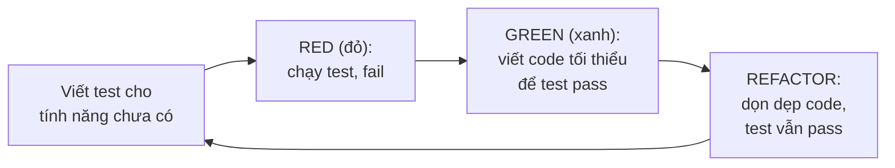

# 1. Unit Testing (Kiểm thử đơn vị)

Unit testing là việc viết code để tự động kiểm tra xem từng phần nhỏ trong chương trình (như một phương thức hay một lớp) có chạy đúng không. Nó giúp bạn phát hiện lỗi sớm, tự tin sửa code mà không sợ làm hỏng chỗ khác. Bài này giới thiệu khái niệm test, mô hình AAA, tiêu chí test tốt và TDD; chi tiết nằm bên dưới.

---

## Mục lục

- [Test (kiểm thử) là gì?](#test-kiểm-thử-là-gì)
- [Vì sao cần viết test?](#vì-sao-cần-viết-test)
- [Unit Test là gì?](#unit-test-là-gì)
- [Mô hình AAA (Arrange - Act - Assert)](#mô-hình-aaa-arrange---act---assert)
- [Thế nào là một test tốt?](#thế-nào-là-một-test-tốt)
- [TDD (Test-Driven Development) là gì?](#tdd-test-driven-development-là-gì)
- [Lỗi thường gặp](#lỗi-thường-gặp)
- [Tóm tắt](#tóm-tắt)

---

## Test (kiểm thử) là gì?

**Test (kiểm thử)** là việc viết code để **kiểm tra xem code khác có chạy đúng hay không**.

Hãy tưởng tượng bạn làm bánh. Sau khi nướng xong, bạn nếm thử một miếng để chắc chắn bánh ngon, đủ ngọt, không bị cháy. Việc "nếm thử" đó chính là **test** trong lập trình: bạn cho code chạy thử với dữ liệu đầu vào đã biết, rồi kiểm tra kết quả có đúng như mong đợi không.

Trước đây, lập trình viên thường kiểm tra bằng cách... chạy chương trình rồi tự nhìn màn hình (gọi là **manual testing** — kiểm thử thủ công). Cách này chậm và dễ sai. Thay vào đó, ta viết **automated test (kiểm thử tự động)**: máy tự chạy và tự báo đúng/sai.

## Vì sao cần viết test?

Nhiều người mới học nghĩ: "Code chạy được rồi, cần gì test?". Nhưng test mang lại rất nhiều lợi ích:

1. **Phát hiện lỗi sớm**: Tìm ra lỗi ngay khi viết code, thay vì để khách hàng phát hiện.
2. **Tự tin khi sửa code**: Khi bạn sửa một chỗ, test sẽ báo ngay nếu bạn vô tình làm hỏng chỗ khác (gọi là **regression** — lỗi tái phát).
3. **Tài liệu sống**: Test mô tả rõ code nên hoạt động như thế nào. Người mới đọc test sẽ hiểu được ý đồ của hàm.
4. **Tiết kiệm thời gian về lâu dài**: Mất công viết test lúc đầu, nhưng tránh được hàng giờ "dò lỗi bằng tay" sau này.

> Ví dụ đời thường: Nhà máy sản xuất bóng đèn có dây chuyền kiểm tra tự động — mỗi bóng đèn đi qua máy đo, máy bật sáng thử. Bóng nào hỏng bị loại ngay. Đó chính là tinh thần của automated test.

## Unit Test là gì?

**Unit Test (kiểm thử đơn vị)** là loại test **kiểm tra từng phần nhỏ nhất** của chương trình một cách độc lập. Trong Java, "đơn vị" thường là **một phương thức (method)** hoặc **một lớp (class)**.

Đặc điểm của unit test:

- **Nhỏ**: Chỉ test một hàm hoặc một hành vi cụ thể.
- **Nhanh**: Chạy trong vài mili-giây vì không gọi database, mạng, file...
- **Độc lập**: Không phụ thuộc vào test khác, chạy theo thứ tự nào cũng được.

```java
// Lớp cần test: một máy tính đơn giản
public class Calculator {
    // Phương thức cộng hai số
    public int add(int a, int b) {
        return a + b;
    }
}
```

Một unit test sẽ kiểm tra riêng phương thức `add`:

```java
// Test kiểm tra: 2 + 3 phải bằng 5
public void testAdd() {
    Calculator calc = new Calculator();   // tạo đối tượng cần test
    int ketQua = calc.add(2, 3);          // gọi phương thức
    if (ketQua != 5) {                    // so sánh với giá trị mong đợi
        throw new RuntimeException("Sai rồi! Mong đợi 5 nhưng nhận " + ketQua);
    }
}
```

Trong thực tế ta dùng **framework (bộ khung) test** như JUnit để viết test gọn hơn (sẽ học ở bài sau). Ở đây ta viết "thủ công" để bạn hiểu bản chất.

## Mô hình AAA (Arrange - Act - Assert)

Hầu hết unit test đều theo một cấu trúc 3 bước rất dễ nhớ, gọi là **AAA**:

| Bước | Tên | Ý nghĩa |
|------|-----|---------|
| **A**rrange | Chuẩn bị | Tạo đối tượng, chuẩn bị dữ liệu đầu vào |
| **A**ct | Hành động | Gọi phương thức cần test |
| **A**ssert | Khẳng định | Kiểm tra kết quả có đúng như mong đợi không |

```java
public void testAddTheoAAA() {
    // 1. Arrange (chuẩn bị): tạo đối tượng và dữ liệu
    Calculator calc = new Calculator();
    int a = 10;
    int b = 5;

    // 2. Act (hành động): gọi phương thức cần kiểm tra
    int ketQua = calc.add(a, b);

    // 3. Assert (khẳng định): so sánh kết quả thực tế với mong đợi
    int mongDoi = 15;
    if (ketQua != mongDoi) {
        throw new RuntimeException("Mong đợi " + mongDoi + " nhưng nhận " + ketQua);
    }
}
```

> Ví dụ đời thường: Pha một cốc cà phê. **Arrange**: chuẩn bị cốc, cà phê, nước nóng. **Act**: rót nước vào pha. **Assert**: nếm thử xem có đúng vị mong muốn không.

Việc tách rõ 3 bước giúp test **dễ đọc** — ai nhìn vào cũng biết test đang chuẩn bị gì, làm gì, và kiểm tra gì.

## Thế nào là một test tốt?

Người ta hay dùng từ viết tắt **FIRST** để mô tả test tốt:

- **F**ast (nhanh): Chạy nhanh để có thể chạy thường xuyên.
- **I**ndependent (độc lập): Không phụ thuộc test khác.
- **R**epeatable (lặp lại được): Chạy bao nhiêu lần kết quả cũng giống nhau.
- **S**elf-validating (tự kiểm tra): Tự báo pass/fail, không cần con người nhìn.
- **T**imely (đúng lúc): Viết test gần với lúc viết code.

Ngoài ra, mỗi test nên kiểm tra **một thứ duy nhất**. Nếu một test kiểm tra quá nhiều thứ, khi fail bạn sẽ khó biết lỗi nằm ở đâu.

```java
// KHÔNG TỐT: một test kiểm tra cả cộng và trừ
public void testTatCa() {
    Calculator calc = new Calculator();
    // nếu fail, không biết lỗi ở add hay subtract
}

// TỐT: tách thành hai test riêng
public void testAdd() { /* chỉ test cộng */ }
public void testSubtract() { /* chỉ test trừ */ }
```

## TDD (Test-Driven Development) là gì?

**TDD (Test-Driven Development — phát triển hướng kiểm thử)** là cách viết code **đảo ngược**: viết test **TRƯỚC**, viết code **SAU**.

Quy trình TDD gồm 3 bước, gọi là vòng lặp **Red - Green - Refactor**:

1. **Red (đỏ)**: Viết một test cho tính năng chưa có. Chạy test → **fail** (đỏ), vì code chưa tồn tại.
2. **Green (xanh)**: Viết code **tối thiểu** để test pass (xanh).
3. **Refactor (cải tiến)**: Dọn dẹp, làm code đẹp hơn mà test vẫn pass.

Sau đó lặp lại cho tính năng tiếp theo.

Sơ đồ dưới đây minh hoạ vòng lặp **Red - Green - Refactor** của TDD:



```java
// Bước 1 - RED: viết test trước (Calculator chưa có hàm multiply)
public void testMultiply() {
    Calculator calc = new Calculator();
    int ketQua = calc.multiply(4, 3);  // hàm này CHƯA tồn tại -> không biên dịch được
    // mong đợi 12
}

// Bước 2 - GREEN: viết code tối thiểu để pass
public int multiply(int a, int b) {
    return a * b;   // chỉ cần đủ làm test xanh
}

// Bước 3 - REFACTOR: ở đây code đã đơn giản, không cần sửa thêm
```

> Lợi ích của TDD: bạn luôn có test bao phủ code, và bạn buộc phải suy nghĩ "code này nên làm gì" trước khi viết. Người mới có thể chưa cần làm TDD ngay, nhưng nên hiểu khái niệm này.

## Lỗi thường gặp

1. **Không viết test vì "code đã chạy được"**: Code chạy được hôm nay không có nghĩa nó vẫn đúng sau khi bạn sửa đổi tuần sau.
2. **Test phụ thuộc lẫn nhau**: Test B chỉ chạy đúng nếu test A đã chạy trước. Điều này vi phạm tính độc lập và gây lỗi khó hiểu.
3. **Test quá nhiều thứ trong một hàm**: Khi fail rất khó tìm nguyên nhân. Mỗi test chỉ nên kiểm tra một hành vi.
4. **Quên bước Assert**: Viết test gọi hàm nhưng không kiểm tra kết quả — test này luôn pass dù code sai.
5. **Test phụ thuộc thời gian/ngẫu nhiên**: Dùng `new Date()` hay số ngẫu nhiên khiến test lúc pass lúc fail (gọi là **flaky test** — test chập chờn).

## Tóm tắt

- **Test** là code dùng để kiểm tra code khác chạy đúng hay không, tự động và lặp lại được.
- **Unit Test** kiểm tra từng đơn vị nhỏ (một method/class) một cách độc lập, nhanh chóng.
- Viết test giúp **phát hiện lỗi sớm**, **tự tin sửa code**, và làm **tài liệu sống**.
- Mô hình **AAA** (Arrange - Act - Assert) giúp test rõ ràng, dễ đọc.
- Test tốt theo nguyên tắc **FIRST** và chỉ kiểm tra một thứ.
- **TDD** là viết test trước, code sau, theo vòng lặp **Red - Green - Refactor**.
- Ở bài tiếp theo, ta sẽ dùng **JUnit** — framework test phổ biến nhất của Java.
