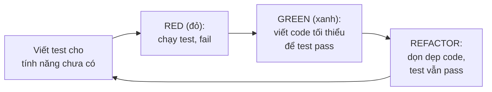

# 1. Unit Testing (Kiểm thử đơn vị)

Unit testing là việc viết code để tự động kiểm tra xem từng phần nhỏ trong chương trình (như một phương thức hay một lớp) có chạy đúng không. Nó giúp bạn phát hiện lỗi sớm, tự tin sửa code mà không sợ làm hỏng chỗ khác. Bài này giới thiệu khái niệm test, mô hình AAA, tiêu chí test tốt và TDD; chi tiết nằm bên dưới.

[](pathname:///img/java/unit-testing.webp)

---

:::note[Ghi nhớ nhanh]

- ⭐ **Unit test kiểm tra từng đơn vị nhỏ** — một method/class, chạy độc lập và rất nhanh.
- **Mô hình AAA** — Arrange (chuẩn bị) - Act (hành động) - Assert (khẳng định) giúp test rõ ràng, dễ đọc.
- **Test tốt theo FIRST** — Fast, Independent, Repeatable, Self-validating, Timely; mỗi test chỉ kiểm tra một thứ.
- ⭐ **TDD: viết test trước, code sau** — theo vòng lặp Red - Green - Refactor.
- **Đừng quên bước Assert** — và tránh flaky test (phụ thuộc thời gian/số ngẫu nhiên).

:::

---

## Mục lục

- [Test (kiểm thử) là gì?](#test-kiểm-thử-là-gì)
- [Vì sao cần viết test?](#vì-sao-cần-viết-test)
- [Unit Test là gì?](#unit-test-là-gì)
- [Mô hình AAA (Arrange - Act - Assert)](#mô-hình-aaa-arrange---act---assert)
- [Thế nào là một test tốt?](#thế-nào-là-một-test-tốt)
- [TDD (Test-Driven Development) là gì?](#tdd-test-driven-development-là-gì)
- [Lỗi thường gặp](#lỗi-thường-gặp)
- [Tóm tắt](#tóm-tắt)
- [Câu hỏi phỏng vấn](#câu-hỏi-phỏng-vấn)

---

## Test (kiểm thử) là gì?

**Test (kiểm thử)** là việc viết code để **kiểm tra xem code khác có chạy đúng hay không**.

Hãy tưởng tượng bạn làm bánh. Sau khi nướng xong, bạn nếm thử một miếng để chắc chắn bánh ngon, đủ ngọt, không bị cháy. Việc "nếm thử" đó chính là **test** trong lập trình: bạn cho code chạy thử với dữ liệu đầu vào đã biết, rồi kiểm tra kết quả có đúng như mong đợi không.

Trước đây, lập trình viên thường kiểm tra bằng cách... chạy chương trình rồi tự nhìn màn hình (gọi là **manual testing** — kiểm thử thủ công). Cách này chậm và dễ sai. Thay vào đó, ta viết **automated test (kiểm thử tự động)**: máy tự chạy và tự báo đúng/sai.

## Vì sao cần viết test?

Nhiều người mới học nghĩ: "Code chạy được rồi, cần gì test?". Nhưng test mang lại rất nhiều lợi ích:

1. **Phát hiện lỗi sớm**: Tìm ra lỗi ngay khi viết code, thay vì để khách hàng phát hiện.
2. **Tự tin khi sửa code**: Khi bạn sửa một chỗ, test sẽ báo ngay nếu bạn vô tình làm hỏng chỗ khác (gọi là **regression** — lỗi tái phát).
3. **Tài liệu sống**: Test mô tả rõ code nên hoạt động như thế nào. Người mới đọc test sẽ hiểu được ý đồ của hàm.
4. **Tiết kiệm thời gian về lâu dài**: Mất công viết test lúc đầu, nhưng tránh được hàng giờ "dò lỗi bằng tay" sau này.

> Ví dụ đời thường: Nhà máy sản xuất bóng đèn có dây chuyền kiểm tra tự động — mỗi bóng đèn đi qua máy đo, máy bật sáng thử. Bóng nào hỏng bị loại ngay. Đó chính là tinh thần của automated test.

## Unit Test là gì?

**Unit Test (kiểm thử đơn vị)** là loại test **kiểm tra từng phần nhỏ nhất** của chương trình một cách độc lập. Trong Java, "đơn vị" thường là **một phương thức (method)** hoặc **một lớp (class)**.

Đặc điểm của unit test:

- **Nhỏ**: Chỉ test một hàm hoặc một hành vi cụ thể.
- **Nhanh**: Chạy trong vài mili-giây vì không gọi database, mạng, file...
- **Độc lập**: Không phụ thuộc vào test khác, chạy theo thứ tự nào cũng được.

```java
// Lớp cần test: một máy tính đơn giản
public class Calculator {
    // Phương thức cộng hai số
    public int add(int a, int b) {
        return a + b;
    }
}
```

Một unit test sẽ kiểm tra riêng phương thức `add`:

```java
// Test kiểm tra: 2 + 3 phải bằng 5
public void testAdd() {
    Calculator calc = new Calculator();   // tạo đối tượng cần test
    int ketQua = calc.add(2, 3);          // gọi phương thức
    if (ketQua != 5) {                    // so sánh với giá trị mong đợi
        throw new RuntimeException("Sai rồi! Mong đợi 5 nhưng nhận " + ketQua);
    }
}
```

Trong thực tế ta dùng **framework (bộ khung) test** như JUnit để viết test gọn hơn (sẽ học ở bài sau). Ở đây ta viết "thủ công" để bạn hiểu bản chất.

## Mô hình AAA (Arrange - Act - Assert)

Hầu hết unit test đều theo một cấu trúc 3 bước rất dễ nhớ, gọi là **AAA**:

| Bước | Tên | Ý nghĩa |
|------|-----|---------|
| **A**rrange | Chuẩn bị | Tạo đối tượng, chuẩn bị dữ liệu đầu vào |
| **A**ct | Hành động | Gọi phương thức cần test |
| **A**ssert | Khẳng định | Kiểm tra kết quả có đúng như mong đợi không |

```java
public void testAddTheoAAA() {
    // 1. Arrange (chuẩn bị): tạo đối tượng và dữ liệu
    Calculator calc = new Calculator();
    int a = 10;
    int b = 5;

    // 2. Act (hành động): gọi phương thức cần kiểm tra
    int ketQua = calc.add(a, b);

    // 3. Assert (khẳng định): so sánh kết quả thực tế với mong đợi
    int mongDoi = 15;
    if (ketQua != mongDoi) {
        throw new RuntimeException("Mong đợi " + mongDoi + " nhưng nhận " + ketQua);
    }
}
```

> Ví dụ đời thường: Pha một cốc cà phê. **Arrange**: chuẩn bị cốc, cà phê, nước nóng. **Act**: rót nước vào pha. **Assert**: nếm thử xem có đúng vị mong muốn không.

Việc tách rõ 3 bước giúp test **dễ đọc** — ai nhìn vào cũng biết test đang chuẩn bị gì, làm gì, và kiểm tra gì.

## Thế nào là một test tốt?

Người ta hay dùng từ viết tắt **FIRST** để mô tả test tốt:

- **F**ast (nhanh): Chạy nhanh để có thể chạy thường xuyên.
- **I**ndependent (độc lập): Không phụ thuộc test khác.
- **R**epeatable (lặp lại được): Chạy bao nhiêu lần kết quả cũng giống nhau.
- **S**elf-validating (tự kiểm tra): Tự báo pass/fail, không cần con người nhìn.
- **T**imely (đúng lúc): Viết test gần với lúc viết code.

Ngoài ra, mỗi test nên kiểm tra **một thứ duy nhất**. Nếu một test kiểm tra quá nhiều thứ, khi fail bạn sẽ khó biết lỗi nằm ở đâu.

```java
// KHÔNG TỐT: một test kiểm tra cả cộng và trừ
public void testTatCa() {
    Calculator calc = new Calculator();
    // nếu fail, không biết lỗi ở add hay subtract
}

// TỐT: tách thành hai test riêng
public void testAdd() { /* chỉ test cộng */ }
public void testSubtract() { /* chỉ test trừ */ }
```

## TDD (Test-Driven Development) là gì?

**TDD (Test-Driven Development — phát triển hướng kiểm thử)** là cách viết code **đảo ngược**: viết test **TRƯỚC**, viết code **SAU**.

Quy trình TDD gồm 3 bước, gọi là vòng lặp **Red - Green - Refactor**:

1. **Red (đỏ)**: Viết một test cho tính năng chưa có. Chạy test → **fail** (đỏ), vì code chưa tồn tại.
2. **Green (xanh)**: Viết code **tối thiểu** để test pass (xanh).
3. **Refactor (cải tiến)**: Dọn dẹp, làm code đẹp hơn mà test vẫn pass.

Sau đó lặp lại cho tính năng tiếp theo.

Sơ đồ dưới đây minh hoạ vòng lặp **Red - Green - Refactor** của TDD:


```mermaid
flowchart LR
    A["Viết test cho<br/>tính năng chưa có"] --> B["RED (đỏ):<br/>chạy test, fail"]
    B --> C["GREEN (xanh):<br/>viết code tối thiểu<br/>để test pass"]
    C --> D["REFACTOR:<br/>dọn dẹp code,<br/>test vẫn pass"]
    D --> A
```

```java
// Bước 1 - RED: viết test trước (Calculator chưa có hàm multiply)
public void testMultiply() {
    Calculator calc = new Calculator();
    int ketQua = calc.multiply(4, 3);  // hàm này CHƯA tồn tại -> không biên dịch được
    // mong đợi 12
}

// Bước 2 - GREEN: viết code tối thiểu để pass
public int multiply(int a, int b) {
    return a * b;   // chỉ cần đủ làm test xanh
}

// Bước 3 - REFACTOR: ở đây code đã đơn giản, không cần sửa thêm
```

> Lợi ích của TDD: bạn luôn có test bao phủ code, và bạn buộc phải suy nghĩ "code này nên làm gì" trước khi viết. Người mới có thể chưa cần làm TDD ngay, nhưng nên hiểu khái niệm này.

## Lỗi thường gặp

1. **Không viết test vì "code đã chạy được"**: Code chạy được hôm nay không có nghĩa nó vẫn đúng sau khi bạn sửa đổi tuần sau.
2. **Test phụ thuộc lẫn nhau**: Test B chỉ chạy đúng nếu test A đã chạy trước. Điều này vi phạm tính độc lập và gây lỗi khó hiểu.
3. **Test quá nhiều thứ trong một hàm**: Khi fail rất khó tìm nguyên nhân. Mỗi test chỉ nên kiểm tra một hành vi.
4. **Quên bước Assert**: Viết test gọi hàm nhưng không kiểm tra kết quả — test này luôn pass dù code sai.
5. **Test phụ thuộc thời gian/ngẫu nhiên**: Dùng `new Date()` hay số ngẫu nhiên khiến test lúc pass lúc fail (gọi là **flaky test** — test chập chờn).

## Tóm tắt

- **Test** là code dùng để kiểm tra code khác chạy đúng hay không, tự động và lặp lại được.
- **Unit Test** kiểm tra từng đơn vị nhỏ (một method/class) một cách độc lập, nhanh chóng.
- Viết test giúp **phát hiện lỗi sớm**, **tự tin sửa code**, và làm **tài liệu sống**.
- Mô hình **AAA** (Arrange - Act - Assert) giúp test rõ ràng, dễ đọc.
- Test tốt theo nguyên tắc **FIRST** và chỉ kiểm tra một thứ.
- **TDD** là viết test trước, code sau, theo vòng lặp **Red - Green - Refactor**.
- Ở bài tiếp theo, ta sẽ dùng **JUnit** — framework test phổ biến nhất của Java.

---

## Câu hỏi phỏng vấn

Những câu thường gặp về chủ đề này. Tự trả lời trước, rồi bấm **Xem đáp án** để đối chiếu.

**1. Unit test là gì? Nêu ba đặc điểm chính phân biệt nó với các loại test khác (ví dụ integration test).**

<details className="qa">
<summary>Xem đáp án</summary>

**Unit test** (kiểm thử đơn vị) là loại test kiểm tra từng phần **nhỏ nhất** của chương trình một cách **độc lập** — trong Java thường là một method hoặc một class.

Ba đặc điểm chính:

- **Nhỏ**: chỉ test một hàm hoặc một hành vi cụ thể, không kiểm tra cả một luồng nghiệp vụ lớn.
- **Nhanh**: chạy trong vài mili-giây vì không gọi database, mạng, file hệ thống — mọi phụ thuộc bên ngoài thường được thay thế bằng mock/stub.
- **Độc lập**: không phụ thuộc vào test khác hay thứ tự chạy, mỗi test có thể chạy riêng lẻ và cho kết quả giống nhau mỗi lần.

Khác với integration test (kiểm thử tích hợp) — vốn kiểm tra sự phối hợp giữa nhiều thành phần thật (database, API, service khác), unit test cô lập hoàn toàn đơn vị đang test khỏi các phụ thuộc bên ngoài.

</details>

**2. Mô hình AAA trong việc viết test là gì? Vì sao việc tách rõ ba bước này lại giúp test dễ đọc hơn?**

<details className="qa">
<summary>Xem đáp án</summary>

**AAA** gồm ba bước:

- **Arrange** (chuẩn bị): tạo đối tượng, chuẩn bị dữ liệu đầu vào.
- **Act** (hành động): gọi phương thức/hành vi cần test.
- **Assert** (khẳng định): so sánh kết quả thực tế với kết quả mong đợi.

```java
// Arrange
Calculator calc = new Calculator();
int a = 10, b = 5;

// Act
int ketQua = calc.add(a, b);

// Assert
assertEquals(15, ketQua);
```

- Tách rõ ba bước giúp bất kỳ ai đọc test cũng nhanh chóng nhận ra: dữ liệu đầu vào là gì, hành động nào đang được kiểm tra, và kỳ vọng kết quả ra sao — mà không cần đọc kỹ toàn bộ logic. Đây cũng là cấu trúc chuẩn được hầu hết framework test (JUnit, TestNG) và tài liệu ngành khuyến nghị.

</details>

**3. Nguyên tắc FIRST trong thiết kế unit test tốt bao gồm những gì? Giải thích ý nghĩa từng chữ cái.**

<details className="qa">
<summary>Xem đáp án</summary>

| Chữ | Ý nghĩa | Giải thích |
|---|---|---|
| **F**ast | Nhanh | Test phải chạy rất nhanh để có thể chạy thường xuyên (mỗi lần lưu code, mỗi lần build) |
| **I**ndependent | Độc lập | Không phụ thuộc test khác, chạy theo bất kỳ thứ tự nào cũng ra kết quả đúng |
| **R**epeatable | Lặp lại được | Chạy bao nhiêu lần, trên máy nào, kết quả cũng phải giống nhau |
| **S**elf-validating | Tự kiểm tra | Test tự báo pass/fail rõ ràng (qua assertion), không cần con người tự nhìn output để phán đoán |
| **T**imely | Đúng lúc | Viết test gần thời điểm viết code, không để dồn lại viết sau cùng |

Ngoài FIRST, một nguyên tắc quan trọng khác là mỗi test chỉ nên kiểm tra **một hành vi duy nhất**, giúp dễ xác định nguyên nhân khi test fail.

</details>

**4. Đoạn test sau có vấn đề gì? Vì sao nó luôn pass dù code có lỗi?**

```java
@Test
void testTinhTong() {
    Calculator calc = new Calculator();
    calc.add(2, 3);
}
```

<details className="qa">
<summary>Xem đáp án</summary>

**Vấn đề**: test **thiếu bước Assert** — chỉ gọi `calc.add(2, 3)` (bước Act) rồi kết thúc, không hề kiểm tra kết quả trả về có đúng bằng `5` hay không.

- Vì không có assertion nào, test này sẽ **luôn pass** miễn là `add(...)` không ném exception — dù giá trị trả về có sai (ví dụ hàm bị lỗi trả về `0` hoặc `-1`), test vẫn báo xanh, tạo cảm giác an toàn giả (false sense of security).
- Sửa lại: thêm assertion để thực sự kiểm tra kết quả.

```java
@Test
void testTinhTong() {
    Calculator calc = new Calculator();
    int ketQua = calc.add(2, 3);
    assertEquals(5, ketQua);
}
```

</details>

**5. Test sau vi phạm nguyên tắc nào của một test tốt? Vì sao nó gây khó khăn khi cần xác định lỗi?**

```java
@Test
void testTatCaPhepTinh() {
    Calculator calc = new Calculator();
    assertEquals(5, calc.add(2, 3));
    assertEquals(6, calc.subtract(10, 4));
    assertEquals(20, calc.multiply(4, 5));
}
```

<details className="qa">
<summary>Xem đáp án</summary>

Test này vi phạm nguyên tắc **"mỗi test chỉ nên kiểm tra một hành vi duy nhất"** — nó gộp cả ba phép tính (`add`, `subtract`, `multiply`) vào một test.

- Nếu `subtract` bị lỗi (giả sử `assertEquals(6, calc.subtract(10, 4))` fail), JUnit sẽ dừng ngay tại assertion đó và báo test `testTatCaPhepTinh` fail — nhưng **không rõ ràng** liệu `multiply` phía sau có đúng hay không, vì nó chưa kịp chạy tới.
- Việc gộp nhiều hành vi vào một test khiến tên test (`testTatCaPhepTinh`) không mô tả chính xác lỗi gì đang xảy ra, và khi báo cáo test fail, người đọc phải mở code test ra xem chi tiết mới biết assertion nào fail.
- Cách sửa: tách thành ba test riêng biệt (`testAdd`, `testSubtract`, `testMultiply`), mỗi test chỉ kiểm tra một phép tính.

</details>

**6. TDD (Test-Driven Development) là gì? Trình bày vòng lặp Red - Green - Refactor.**

<details className="qa">
<summary>Xem đáp án</summary>

**TDD** là cách phát triển phần mềm theo hướng viết **test trước, code sau** — đảo ngược thứ tự thông thường.

Vòng lặp gồm ba bước:

1. **Red (đỏ)**: viết một test cho tính năng chưa tồn tại, chạy test → **fail** (vì code chưa được viết, thậm chí có thể chưa biên dịch được).
2. **Green (xanh)**: viết code **tối thiểu** đủ để test pass, không cần tối ưu hay đẹp đẽ ngay.
3. **Refactor (cải tiến)**: dọn dẹp, cải thiện chất lượng code trong khi vẫn đảm bảo tất cả test vẫn pass (xanh).

Sau đó lặp lại chu trình cho tính năng tiếp theo. Lợi ích: code luôn có test bao phủ ngay từ đầu, và người viết bị "ép" phải suy nghĩ rõ ràng về hành vi mong đợi trước khi bắt tay viết logic.

</details>

**7. Vì sao đoạn test sau được xem là "flaky test" (test chập chờn)? Cách khắc phục?**

```java
@Test
void testTaoThongBao() {
    Notification n = new Notification();
    String ketQua = n.taoThongDiep();
    assertEquals("Thông báo lúc " + LocalDateTime.now(), ketQua);
}
```

<details className="qa">
<summary>Xem đáp án</summary>

**Vấn đề**: test phụ thuộc vào `LocalDateTime.now()` — giá trị này **thay đổi liên tục theo từng mili-giây**, nên gần như chắc chắn thời điểm gọi `LocalDateTime.now()` trong assertion sẽ **khác** với thời điểm được dùng bên trong `taoThongDiep()`, dù chỉ lệch vài mili-giây.

- Đây là ví dụ điển hình của **flaky test**: test có thể pass hoặc fail một cách ngẫu nhiên/không nhất quán dù code không hề thay đổi, phá vỡ nguyên tắc **Repeatable** trong FIRST.
- Cách khắc phục phổ biến:
  - **Tiêm (inject) một `Clock` hoặc nguồn thời gian giả (fake)** vào class cần test, thay vì gọi trực tiếp `LocalDateTime.now()` — khi test, truyền vào một `Clock` cố định để kiểm soát được giá trị thời gian.
  - Hoặc chỉ assert **một phần** không phụ thuộc thời gian chính xác tuyệt đối, ví dụ kiểm tra định dạng chuỗi hoặc dùng khoảng dung sai (tolerance) khi so sánh thời gian.

</details>

**8. Trong thực tế, việc viết unit test mang lại lợi ích gì ngoài việc "bắt lỗi"? Giải thích khái niệm "tài liệu sống" (living documentation) trong ngữ cảnh test.**

<details className="qa">
<summary>Xem đáp án</summary>

Ngoài phát hiện lỗi, unit test còn mang lại:

- **Tự tin khi refactor/sửa code**: khi thay đổi logic, bộ test chạy lại ngay lập tức báo cho biết có làm hỏng hành vi cũ (regression) hay không, giúp lập trình viên mạnh dạn cải tiến code mà không sợ "đụng vào đâu hỏng đó".
- **Tài liệu sống (living documentation)**: tên test và nội dung assertion mô tả rõ ràng **hành vi mong đợi** của một method trong các tình huống khác nhau. Một lập trình viên mới đọc bộ test của một class có thể hiểu được class đó nên hoạt động ra sao mà không cần đọc hết code triển khai — và khác với comment/document thông thường, test "sống" theo nghĩa nó **tự động được xác minh lại** mỗi lần chạy, nên không bao giờ bị lỗi thời (out-of-date) so với hành vi thực tế của code.

</details>

**9. Vì sao unit test nên tránh phụ thuộc vào database thật, gọi API mạng thật, hay đọc/ghi file hệ thống thật?**

<details className="qa">
<summary>Xem đáp án</summary>

- **Vi phạm tính chất Fast**: gọi database/mạng/file thật luôn chậm hơn nhiều lần so với xử lý thuần túy trong bộ nhớ, khiến bộ test chạy chậm, giảm động lực chạy test thường xuyên.
- **Vi phạm tính chất Independent/Repeatable**: dữ liệu trong database thật có thể thay đổi giữa các lần chạy (ai đó xóa/sửa dữ liệu), kết nối mạng có thể gián đoạn, file hệ thống có thể bị khóa bởi tiến trình khác — khiến test lúc pass lúc fail dù code không đổi.
- **Khó tái tạo môi trường**: mỗi máy chạy test (máy dev, CI server) cần có cùng database/API/file để test chạy đúng, gây phức tạp khi thiết lập môi trường CI/CD.
- Giải pháp: dùng **mock/stub/fake** để giả lập các phụ thuộc bên ngoài trong unit test (sẽ học kỹ ở bài Mockito), giữ database/API/file thật cho **integration test** — loại test dành riêng để kiểm tra sự phối hợp thật giữa các thành phần.

</details>
