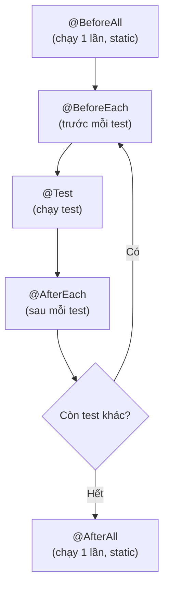

# 2. JUnit

JUnit là framework test phổ biến nhất trong thế giới Java, gần như dự án nào cũng dùng để viết unit test. Nó cung cấp các annotation như `@Test` và các phương thức assert giúp viết test gọn gàng, tự động chạy và báo pass/fail. Bài này hướng dẫn cách cài đặt và dùng JUnit 5 qua các ví dụ; chi tiết nằm bên dưới.

[](pathname:///img/java/junit.webp)

---

:::note[Ghi nhớ nhanh]

- ⭐ **JUnit 5 (Jupiter) là framework test phổ biến nhất** — dùng `@Test` để đánh dấu một phương thức là test.
- **`assertEquals(mongDoi, thucTe)`** — tham số mong đợi đứng trước, thực tế đứng sau (đừng viết ngược).
- **`@BeforeEach`/`@AfterEach`** — chạy trước/sau MỖI test; `@BeforeAll`/`@AfterAll` chạy một lần và phải `static`.
- **`assertThrows` và `@ParameterizedTest`** — kiểm tra ngoại lệ và chạy cùng một test với nhiều bộ dữ liệu.
- ⭐ **Import đúng `org.junit.jupiter.api.*`** — đừng trộn lẫn với JUnit 4 (`org.junit.*`).

:::

---

## Mục lục

- [Vì sao JUnit ra đời?](#vì-sao-junit-ra-đời)
- [JUnit là gì?](#junit-là-gì)
- [Cài đặt JUnit 5](#cài-đặt-junit-5)
- [Viết test đầu tiên với @Test](#viết-test-đầu-tiên-với-test)
- [Các phương thức Assertions](#các-phương-thức-assertions)
- [Vòng đời test: @BeforeEach, @AfterEach](#vòng-đời-test-beforeeach-aftereach)
- [Kiểm tra ngoại lệ với assertThrows](#kiểm-tra-ngoại-lệ-với-assertthrows)
- [Test với nhiều dữ liệu: @ParameterizedTest](#test-với-nhiều-dữ-liệu-parameterizedtest)
- [Ví dụ đầy đủ: test lớp Calculator](#ví-dụ-đầy-đủ-test-lớp-calculator)
- [Lỗi thường gặp](#lỗi-thường-gặp)
- [Tóm tắt](#tóm-tắt)
- [Câu hỏi phỏng vấn](#câu-hỏi-phỏng-vấn)

---

## Vì sao JUnit ra đời?

**Vấn đề:** Trước khi có JUnit, lập trình viên Java phải test thủ công bằng cách viết hàm `main()`, in kết quả ra console rồi tự mắt so sánh. Cách này không lặp lại được tự động, không phân biệt pass/fail rõ ràng, và không tích hợp được vào CI/CD.

```java
// Cách cũ: test thủ công, dễ bỏ sót lỗi
public class Main {
    public static void main(String[] args) {
        Calculator calc = new Calculator();
        int ketQua = calc.add(2, 3);
        // Phải tự nhìn console và so sánh bằng mắt!
        System.out.println("Kết quả: " + ketQua);  // in ra 5 -> tự kiểm tra
        // Nếu có 100 hàm cần test -> mệt mỏi, dễ nhầm, không tự động hóa được
    }
}
```

**Giải pháp:** JUnit chuẩn hóa việc viết test bằng annotation `@Test`, dùng assertion để máy tự kiểm tra pass/fail, chạy hàng loạt test cùng lúc và báo cáo tổng kết, tích hợp trực tiếp vào Maven/Gradle/CI.

```java
// Cách mới với JUnit: máy tự kiểm tra, không cần nhìn console
import org.junit.jupiter.api.Test;
import static org.junit.jupiter.api.Assertions.assertEquals;

class CalculatorTest {
    @Test
    void testAdd() {
        Calculator calc = new Calculator();
        assertEquals(5, calc.add(2, 3));  // máy tự so sánh, tự báo pass/fail
    }
}
// Chạy `mvn test` -> JUnit tự tìm và chạy tất cả @Test, in báo cáo xanh/đỏ
```

:::tip[Dùng thực tế]
- Chạy toàn bộ test suite bằng một lệnh (`mvn test` hoặc `gradle test`) trước khi commit code.
- Tích hợp vào pipeline CI/CD (GitHub Actions, Jenkins) để test tự động mỗi khi push code.
- Phát hiện regression (hỏng tính năng cũ) ngay khi thêm tính năng mới.
- Viết test trước khi code (TDD) để thiết kế API rõ ràng hơn ngay từ đầu.
:::

## JUnit là gì?

**JUnit** là **framework (bộ khung) test phổ biến nhất** trong thế giới Java. Gần như mọi dự án Java đều dùng JUnit để viết unit test.

Thay vì tự viết các câu lệnh `if`/`throw` để kiểm tra như ở bài trước, JUnit cung cấp:

- Các **annotation (chú thích)** như `@Test` để đánh dấu phương thức nào là test.
- Các phương thức **assertion (khẳng định)** như `assertEquals` để so sánh kết quả gọn gàng.
- Một **test runner (trình chạy test)** tự động tìm và chạy tất cả test, rồi báo cáo pass/fail.

Phiên bản hiện đại là **JUnit 5** (còn gọi là **JUnit Jupiter**). Tài liệu này dùng JUnit 5.

## Cài đặt JUnit 5

Nếu dùng **Maven**, thêm vào file `pom.xml`:

```xml
<!-- Thư viện JUnit 5 dùng cho test -->
<dependency>
    <groupId>org.junit.jupiter</groupId>
    <artifactId>junit-jupiter</artifactId>
    <version>5.10.0</version>
    <scope>test</scope>  <!-- chỉ dùng khi test, không đóng gói vào sản phẩm -->
</dependency>
```

Nếu dùng **Gradle**, thêm vào `build.gradle`:

```groovy
dependencies {
    // JUnit 5 cho phần test
    testImplementation 'org.junit.jupiter:junit-jupiter:5.10.0'
}
test {
    useJUnitPlatform()  // báo Gradle dùng nền tảng JUnit 5
}
```

Theo quy ước, code test đặt trong thư mục `src/test/java`, còn code chính nằm ở `src/main/java`.

## Viết test đầu tiên với @Test

Annotation **`@Test`** đánh dấu một phương thức là test. JUnit sẽ tự gọi mọi phương thức có `@Test`.

```java
import org.junit.jupiter.api.Test;            // annotation @Test
import static org.junit.jupiter.api.Assertions.assertEquals; // hàm so sánh

class CalculatorTest {

    @Test  // đánh dấu đây là một test
    void testAdd() {
        Calculator calc = new Calculator();    // Arrange
        int ketQua = calc.add(2, 3);           // Act
        assertEquals(5, ketQua);               // Assert: mong đợi 5
    }
}
```

`assertEquals(5, ketQua)` nghĩa là: "Tôi mong đợi giá trị là `5`. Nếu `ketQua` khác `5`, hãy báo test fail."

> Lưu ý: tham số đầu là **giá trị mong đợi (expected)**, tham số sau là **giá trị thực tế (actual)**. Đừng viết ngược!

## Các phương thức Assertions

JUnit cung cấp nhiều phương thức `assert...` để kiểm tra. Tất cả nằm trong lớp `Assertions`:

```java
import static org.junit.jupiter.api.Assertions.*;

@Test
void viDuCacAssertion() {
    // So sánh hai giá trị bằng nhau
    assertEquals(10, 5 + 5);

    // Kiểm tra điều kiện đúng (true)
    assertTrue(5 > 3);

    // Kiểm tra điều kiện sai (false)
    assertFalse(5 < 3);

    // Kiểm tra một giá trị là null
    assertNull(null);

    // Kiểm tra một giá trị KHÔNG null
    assertNotNull("xin chào");

    // So sánh hai mảng có phần tử giống nhau
    assertArrayEquals(new int[]{1, 2}, new int[]{1, 2});
}
```

Bạn có thể thêm **thông báo lỗi** ở tham số cuối để dễ debug khi fail:

```java
// Nếu fail, JUnit in ra dòng chữ này -> dễ hiểu nguyên nhân
assertEquals(5, calc.add(2, 3), "Phép cộng 2 + 3 phải bằng 5");
```

## Vòng đời test: @BeforeEach, @AfterEach

Thường nhiều test cần chuẩn bị giống nhau (ví dụ: tạo đối tượng `Calculator`). Thay vì lặp lại, ta dùng:

- **`@BeforeEach`**: chạy **trước MỖI** test. Dùng để chuẩn bị (Arrange chung).
- **`@AfterEach`**: chạy **sau MỖI** test. Dùng để dọn dẹp (đóng file, xóa dữ liệu tạm...).

Ngoài ra còn có `@BeforeAll`/`@AfterAll` (chạy **một lần** trước/sau tất cả test, phải là `static`).

Sơ đồ vòng đời một lớp test JUnit 5:



```java
import org.junit.jupiter.api.BeforeEach;
import org.junit.jupiter.api.AfterEach;
import org.junit.jupiter.api.Test;
import static org.junit.jupiter.api.Assertions.assertEquals;

class CalculatorTest {

    private Calculator calc;  // dùng chung cho mọi test

    @BeforeEach  // chạy trước mỗi test -> tạo đối tượng mới, sạch sẽ
    void setUp() {
        calc = new Calculator();
        System.out.println("Chuẩn bị: tạo Calculator mới");
    }

    @AfterEach  // chạy sau mỗi test -> dọn dẹp nếu cần
    void tearDown() {
        System.out.println("Dọn dẹp sau test");
    }

    @Test
    void testAdd() {
        assertEquals(7, calc.add(3, 4));  // không cần tạo lại calc
    }

    @Test
    void testSubtract() {
        assertEquals(1, calc.subtract(4, 3));  // calc đã được tạo mới ở @BeforeEach
    }
}
```

> Vì sao tạo mới mỗi lần? Để các test **độc lập** — test này không làm bẩn dữ liệu của test kia.

## Kiểm tra ngoại lệ với assertThrows

Đôi khi code **nên** ném ra **exception (ngoại lệ)** trong tình huống lỗi (ví dụ chia cho 0). Ta dùng `assertThrows` để kiểm tra điều đó:

```java
import static org.junit.jupiter.api.Assertions.assertThrows;

@Test
void testChiaChoKhongPhaiNemLoi() {
    Calculator calc = new Calculator();

    // Mong đợi: gọi divide(10, 0) sẽ ném ra ArithmeticException
    assertThrows(ArithmeticException.class, () -> {
        calc.divide(10, 0);  // chia cho 0
    });
}
```

Nếu code **không** ném ngoại lệ như mong đợi, test sẽ fail. Đây là cách kiểm tra "đường đi lỗi" (error path), không chỉ "đường đi đúng".

## Test với nhiều dữ liệu: @ParameterizedTest

Nếu muốn chạy **cùng một test với nhiều bộ dữ liệu** khác nhau, dùng **`@ParameterizedTest`** thay cho `@Test`. Điều này tránh phải copy-paste nhiều test gần giống nhau.

```java
import org.junit.jupiter.params.ParameterizedTest;
import org.junit.jupiter.params.provider.CsvSource;
import static org.junit.jupiter.api.Assertions.assertEquals;

class CalculatorParamTest {

    // Mỗi dòng trong CsvSource là một lần chạy test:
    // a, b, ketQuaMongDoi
    @ParameterizedTest
    @CsvSource({
        "1, 1, 2",
        "2, 3, 5",
        "10, 20, 30",
        "-1, 1, 0"
    })
    void testAddNhieuTruongHop(int a, int b, int mongDoi) {
        Calculator calc = new Calculator();
        assertEquals(mongDoi, calc.add(a, b));  // chạy 4 lần với 4 bộ số
    }
}
```

Ngoài `@CsvSource`, còn có `@ValueSource` (một danh sách giá trị đơn) và `@MethodSource` (lấy dữ liệu từ một phương thức).

## Ví dụ đầy đủ: test lớp Calculator

Lớp cần test:

```java
public class Calculator {
    public int add(int a, int b) { return a + b; }
    public int subtract(int a, int b) { return a - b; }
    public int multiply(int a, int b) { return a * b; }

    public int divide(int a, int b) {
        if (b == 0) {
            // Ném ngoại lệ khi chia cho 0
            throw new ArithmeticException("Không thể chia cho 0");
        }
        return a / b;
    }
}
```

Lớp test đầy đủ:

```java
import org.junit.jupiter.api.BeforeEach;
import org.junit.jupiter.api.Test;
import static org.junit.jupiter.api.Assertions.*;

class CalculatorTest {

    private Calculator calc;

    @BeforeEach
    void setUp() {
        calc = new Calculator();  // tạo mới trước mỗi test
    }

    @Test
    void testAdd() {
        assertEquals(5, calc.add(2, 3), "2 + 3 phải bằng 5");
    }

    @Test
    void testSubtract() {
        assertEquals(1, calc.subtract(4, 3), "4 - 3 phải bằng 1");
    }

    @Test
    void testMultiply() {
        assertEquals(12, calc.multiply(4, 3), "4 * 3 phải bằng 12");
    }

    @Test
    void testDivide() {
        assertEquals(5, calc.divide(10, 2), "10 / 2 phải bằng 5");
    }

    @Test
    void testDivideByZeroThrows() {
        // Kiểm tra chia cho 0 sẽ ném ngoại lệ
        assertThrows(ArithmeticException.class, () -> calc.divide(10, 0));
    }
}
```

Chạy test: trong IDE (IntelliJ/Eclipse) bấm nút "Run", hoặc dùng lệnh `mvn test` (Maven) / `gradle test` (Gradle). Test pass hiện màu xanh, fail hiện màu đỏ kèm lý do.

## Lỗi thường gặp

1. **Viết ngược tham số `assertEquals`**: Phải là `assertEquals(mongDoi, thucTe)`. Viết ngược thì thông báo lỗi sẽ gây hiểu nhầm.
2. **Quên annotation `@Test`**: Phương thức không có `@Test` sẽ không được JUnit chạy — bạn tưởng test pass nhưng thực ra nó chưa chạy.
3. **Nhầm import của JUnit 4 và 5**: JUnit 5 dùng `org.junit.jupiter.api.*`, JUnit 4 dùng `org.junit.*`. Trộn lẫn gây lỗi.
4. **So sánh số thực bằng `assertEquals` không có delta**: Với `double`/`float` phải dùng `assertEquals(0.3, ketQua, 0.0001)` (tham số thứ ba là sai số cho phép) vì số thực có sai số làm tròn.
5. **Để test phụ thuộc trạng thái chung**: Dùng biến `static` chia sẻ giữa các test khiến test này ảnh hưởng test kia. Hãy dùng `@BeforeEach` để reset.

## Tóm tắt

- **JUnit** là framework test phổ biến nhất của Java; phiên bản hiện đại là **JUnit 5**.
- **`@Test`** đánh dấu một phương thức là test.
- Các **assertion** như `assertEquals`, `assertTrue`, `assertFalse`, `assertNull`, `assertThrows` dùng để kiểm tra kết quả.
- **`@BeforeEach`/`@AfterEach`** chạy trước/sau mỗi test để chuẩn bị và dọn dẹp.
- **`assertThrows`** kiểm tra code có ném đúng ngoại lệ mong đợi không.
- **`@ParameterizedTest`** chạy cùng một test với nhiều bộ dữ liệu khác nhau.
- Bài tiếp theo sẽ giới thiệu **TestNG** — một framework test thay thế JUnit.

---

## Câu hỏi phỏng vấn

Những câu thường gặp về chủ đề này. Tự trả lời trước, rồi bấm **Xem đáp án** để đối chiếu.

**1. JUnit 5 (Jupiter) khác gì so với JUnit 4 ở mức cơ bản? Vì sao không nên trộn lẫn import của hai phiên bản trong cùng một class?**

<details className="qa">
<summary>Xem đáp án</summary>

- **JUnit 5** (còn gọi **JUnit Jupiter**) là bản viết lại kiến trúc so với JUnit 4, tách thành ba module: **JUnit Platform** (nền tảng chạy test), **Jupiter** (API và engine test mới), và **Vintage** (engine cho phép chạy lại test viết bằng JUnit 3/4 cũ).
- Package import cũng đổi: JUnit 5 dùng `org.junit.jupiter.api.*` (ví dụ `org.junit.jupiter.api.Test`), còn JUnit 4 dùng `org.junit.*` (ví dụ `org.junit.Test`).
- Nếu vô tình trộn lẫn (ví dụ import `@Test` từ `org.junit.jupiter.api` nhưng lại import `assertEquals` từ `org.junit.Assert` của JUnit 4), code có thể biên dịch nhưng annotation sẽ không được engine tương ứng nhận diện đúng cách, hoặc test không chạy như mong đợi, thậm chí bị bỏ qua âm thầm mà không báo lỗi rõ ràng.

</details>

**2. Annotation `@Test` có tác dụng gì? Điều gì xảy ra nếu bạn viết một phương thức test đầy đủ logic nhưng quên thêm `@Test`?**

<details className="qa">
<summary>Xem đáp án</summary>

`@Test` đánh dấu một phương thức là một **test case** để JUnit tự động phát hiện và chạy khi thực thi test suite.

- Nếu quên `@Test`, phương thức đó vẫn biên dịch bình thường (nó chỉ là một method Java thông thường), nhưng **JUnit sẽ hoàn toàn bỏ qua nó** — không chạy, không báo pass, không báo fail.
- Đây là lỗi nguy hiểm vì âm thầm: khi xem báo cáo test, bạn sẽ thấy tổng số test ít hơn dự kiến (thiếu mất test đó), nhưng dễ nhầm tưởng "mọi test đều pass" nếu không để ý kỹ số lượng test đã chạy — tạo cảm giác an toàn giả trong khi thực chất một hành vi quan trọng chưa hề được kiểm tra.

</details>

**3. `assertEquals(mongDoi, thucTe)` — thứ tự hai tham số này quan trọng như thế nào? Cho ví dụ về thông báo lỗi khi viết ngược.**

<details className="qa">
<summary>Xem đáp án</summary>

Quy ước của JUnit: `assertEquals(expected, actual)` — tham số **đầu tiên** là giá trị **mong đợi (expected)**, tham số **thứ hai** là giá trị **thực tế (actual)** mà code trả về.

- Việc này không ảnh hưởng đến kết quả pass/fail (vì so sánh bằng nhau có tính đối xứng), nhưng ảnh hưởng trực tiếp tới **nội dung thông báo lỗi** khi test fail.
- Ví dụ nếu viết đúng và test fail:

```text
expected: <5> but was: <6>
```

- Nếu viết ngược `assertEquals(ketQua, 5)` (tức truyền giá trị thực tế làm "expected"), khi fail thông báo sẽ hiển thị ngược, gây hiểu nhầm khi debug:

```text
expected: <6> but was: <5>
```

- Dù cùng một lỗi, thông báo ngược khiến người đọc mất thời gian hiểu sai vấn đề — vì vậy luôn giữ đúng thứ tự "mong đợi trước, thực tế sau".

</details>

**4. Phân biệt `@BeforeEach`, `@AfterEach`, `@BeforeAll`, `@AfterAll`. Vì sao `@BeforeAll`/`@AfterAll` bắt buộc phải là phương thức `static` (theo lifecycle mặc định)?**

<details className="qa">
<summary>Xem đáp án</summary>

| Annotation | Chạy khi nào |
|---|---|
| `@BeforeEach` | Trước **mỗi** phương thức `@Test` |
| `@AfterEach` | Sau **mỗi** phương thức `@Test` |
| `@BeforeAll` | **Một lần duy nhất** trước tất cả test trong class |
| `@AfterAll` | **Một lần duy nhất** sau tất cả test trong class |

- Theo lifecycle **mặc định** của JUnit 5 (`PER_METHOD`), JUnit tạo một **instance mới** của lớp test cho **mỗi** phương thức `@Test` (để đảm bảo test độc lập, không chia sẻ trạng thái ngoài ý muốn). Vì vậy `@BeforeAll`/`@AfterAll` — chỉ chạy một lần cho cả class — không thể là phương thức instance (vì không gắn với một instance cụ thể nào cố định); chúng buộc phải là `static` để tồn tại độc lập với các instance được tạo/hủy liên tục.
- Ngoại lệ: nếu đổi lifecycle sang `@TestInstance(Lifecycle.PER_CLASS)` (chỉ tạo một instance dùng chung cho cả class), `@BeforeAll`/`@AfterAll` **không cần** `static` nữa.

</details>

**5. Vì sao mỗi phương thức `@Test` trong JUnit 5 (mặc định) chạy trên một instance riêng của class test, thay vì dùng chung một instance cho cả class?**

<details className="qa">
<summary>Xem đáp án</summary>

- Lifecycle mặc định của JUnit 5 là `PER_METHOD`: mỗi khi chạy một phương thức `@Test`, JUnit tạo **một instance hoàn toàn mới** của class test.
- Mục đích: đảm bảo các test **độc lập (Independent)** với nhau — field instance được set trong test này (hoặc trong `@BeforeEach`) không thể vô tình "rò rỉ" sang test khác, vì mỗi test có bộ field riêng, khởi tạo lại từ đầu.
- Nếu dùng chung một instance cho cả class (như `PER_CLASS`), lập trình viên phải tự cẩn thận reset trạng thái trong `@BeforeEach`, nếu không dữ liệu để lại từ test trước có thể ảnh hưởng ngầm tới test sau — vi phạm nguyên tắc Independent và Repeatable trong FIRST.

</details>

**6. `assertThrows` dùng để làm gì? Viết một test kiểm tra rằng `calc.divide(10, 0)` ném ra `ArithmeticException`, và giải thích vì sao cách viết bằng lambda lại cần thiết (thay vì gọi trực tiếp `calc.divide(10, 0)` trong `assertThrows`).**

<details className="qa">
<summary>Xem đáp án</summary>

`assertThrows` dùng để kiểm tra rằng một đoạn code **thực sự ném ra đúng loại exception mong đợi** — kiểm tra "đường đi lỗi" (error path), không chỉ đường đi thành công.

```java
assertThrows(ArithmeticException.class, () -> {
    calc.divide(10, 0);
});
```

- Phải bọc lời gọi `calc.divide(10, 0)` trong một **lambda** (`() -> ...`, kiểu `Executable`) vì nếu gọi trực tiếp `calc.divide(10, 0)` như một tham số bình thường, exception sẽ được ném ra **ngay khi Java đánh giá tham số** đó — tức là trước khi lời gọi `assertThrows(...)` thực sự bắt đầu chạy logic kiểm tra của nó, khiến test bị crash bởi exception không được xử lý thay vì được `assertThrows` bắt và xác nhận đúng loại.
- Lambda trì hoãn việc thực thi `calc.divide(10, 0)` cho tới khi `assertThrows` chủ động gọi nó bên trong một khối `try-catch` nội bộ, từ đó bắt được exception và so sánh với class mong đợi.

</details>

**7. `@ParameterizedTest` giải quyết vấn đề gì so với việc viết nhiều `@Test` riêng lẻ? Với đoạn `@CsvSource` sau, test sẽ chạy bao nhiêu lần và với bộ giá trị nào?**

```java
@ParameterizedTest
@CsvSource({
    "1, 1, 2",
    "2, 3, 5",
    "10, 20, 30",
    "-1, 1, 0"
})
void testAddNhieuTruongHop(int a, int b, int mongDoi) {
    assertEquals(mongDoi, calc.add(a, b));
}
```

<details className="qa">
<summary>Xem đáp án</summary>

`@ParameterizedTest` cho phép chạy **cùng một logic test** với **nhiều bộ dữ liệu đầu vào** khác nhau, tránh phải copy-paste nhiều phương thức test gần giống hệt nhau (chỉ khác số liệu).

- Với `@CsvSource` gồm 4 dòng, test `testAddNhieuTruongHop` sẽ chạy **4 lần độc lập**, mỗi lần với một bộ `(a, b, mongDoi)` tương ứng:
  1. `a=1, b=1, mongDoi=2`
  2. `a=2, b=3, mongDoi=5`
  3. `a=10, b=20, mongDoi=30`
  4. `a=-1, b=1, mongDoi=0`
- Nếu một trong bốn lần fail (ví dụ dòng thứ 3), JUnit vẫn báo cáo riêng biệt lần chạy đó là fail, các lần khác vẫn hiển thị pass — giúp xác định chính xác bộ dữ liệu nào gây lỗi.

</details>

**8. Ngoài `@CsvSource`, JUnit 5 còn hỗ trợ những nguồn dữ liệu nào khác cho `@ParameterizedTest`? Khi nào nên dùng `@MethodSource` thay vì `@CsvSource`?**

<details className="qa">
<summary>Xem đáp án</summary>

Các nguồn dữ liệu phổ biến khác:

- **`@ValueSource`**: cung cấp một danh sách giá trị đơn giản cùng kiểu (ví dụ danh sách `int`, `String`), dùng khi test chỉ cần **một** tham số đầu vào.
- **`@MethodSource`**: lấy dữ liệu test từ một phương thức trả về `Stream`/`List` các đối tượng phức tạp hơn (ví dụ đối tượng tùy chỉnh, hoặc bộ dữ liệu cần logic tính toán để tạo ra).
- **`@EnumSource`**: cung cấp dữ liệu test từ các giá trị của một `enum`.

Nên dùng `@MethodSource` khi:

- Dữ liệu test **quá phức tạp** để viết gọn trong một chuỗi CSV (ví dụ cần truyền đối tượng, danh sách lồng nhau).
- Dữ liệu test cần được **tính toán động** (ví dụ sinh ngẫu nhiên có kiểm soát seed, hoặc đọc từ một cấu trúc dữ liệu có sẵn trong code) thay vì viết cứng.

</details>

**9. Vì sao khi so sánh số thực (`double`/`float`), không nên dùng `assertEquals(0.3, ketQua)` mà cần dùng `assertEquals(0.3, ketQua, delta)`?**

<details className="qa">
<summary>Xem đáp án</summary>

- Số thực (`double`/`float`) trong Java được biểu diễn theo chuẩn dấu phẩy động (floating-point, IEEE 754), vốn **không thể biểu diễn chính xác tuyệt đối** hầu hết các số thập phân — dẫn tới sai số làm tròn (rounding error) rất nhỏ trong tính toán. Ví dụ `0.1 + 0.2` trong Java thường không cho ra chính xác `0.3` mà là `0.30000000000000004`.
- Nếu dùng `assertEquals(0.3, ketQua)` để so sánh **chính xác tuyệt đối**, test có thể fail dù về mặt toán học hai giá trị "coi như bằng nhau", chỉ vì lệch nhau ở phần thập phân rất nhỏ do sai số làm tròn.
- Cách đúng: truyền thêm tham số thứ ba là **delta** (sai số cho phép), ví dụ `assertEquals(0.3, ketQua, 0.0001)` — test chỉ fail nếu độ chênh lệch giữa hai giá trị **vượt quá** delta này, phù hợp với bản chất không chính xác tuyệt đối của số thực.

</details>

**10. `@Nested` và `assertAll` trong JUnit 5 dùng để giải quyết vấn đề gì?**

<details className="qa">
<summary>Xem đáp án</summary>

- **`@Nested`**: cho phép định nghĩa các class test **lồng nhau** bên trong một class test chính, giúp nhóm các test liên quan theo ngữ cảnh (ví dụ nhóm test cho "khi tài khoản có số dư dương" tách biệt với "khi tài khoản âm"), làm báo cáo test có cấu trúc rõ ràng và dễ đọc hơn khi số lượng test case lớn.
- **`assertAll`**: cho phép nhóm **nhiều assertion độc lập** vào một khối, sao cho nếu một assertion fail, các assertion còn lại **vẫn được chạy và báo cáo đầy đủ**, thay vì dừng ngay ở assertion đầu tiên fail như cách gọi `assertEquals` liên tiếp thông thường.

```java
@Test
void testThongTinNguoiDung() {
    User user = getUser();
    assertAll(
        () -> assertEquals("An", user.getTen()),
        () -> assertEquals("an@gmail.com", user.getEmail()),
        () -> assertTrue(user.getTuoi() > 0)
    );
}
```

- Với `assertAll`, nếu cả `getTen()` và `getEmail()` đều sai, báo cáo test sẽ liệt kê **cả hai** lỗi cùng lúc, giúp sửa nhanh hơn thay vì phải sửa từng lỗi rồi chạy lại nhiều lần mới thấy lỗi tiếp theo.

</details>

**11. Trong một dự án CI/CD, nếu một test bị lỗi không ổn định (flaky) do phụ thuộc vào thứ tự chạy giữa các test trong cùng một class, nguyên nhân thường gặp nhất là gì và JUnit 5 có đảm bảo thứ tự chạy test theo thứ tự khai báo trong code không?**

<details className="qa">
<summary>Xem đáp án</summary>

- **Không**, theo mặc định JUnit 5 **không đảm bảo** thứ tự chạy các phương thức `@Test` trong cùng một class theo đúng thứ tự khai báo trong source code — thứ tự thực thi có thể khác nhau giữa các lần chạy hoặc giữa các phiên bản JUnit.
- Nguyên nhân phổ biến nhất gây flaky do phụ thuộc thứ tự: dùng **biến `static` hoặc trạng thái chia sẻ** giữa các test (ví dụ một danh sách static được test A thêm phần tử, rồi test B kỳ vọng danh sách đó đã có sẵn dữ liệu) — vi phạm nguyên tắc **Independent** của FIRST.
- Nếu thực sự cần một thứ tự chạy cụ thể (trường hợp hiếm, thường không khuyến khích vì phá vỡ tính độc lập), JUnit 5 cung cấp `@TestMethodOrder` kèm một `MethodOrderer` cụ thể (ví dụ `OrderAnnotation` kết hợp `@Order(n)`) để ép thứ tự chạy tường minh.
- Giải pháp bền vững hơn: thiết kế lại test để mỗi test tự chuẩn bị đầy đủ dữ liệu nó cần trong `@BeforeEach`, không phụ thuộc vào "tàn dư" trạng thái từ test chạy trước.

</details>
