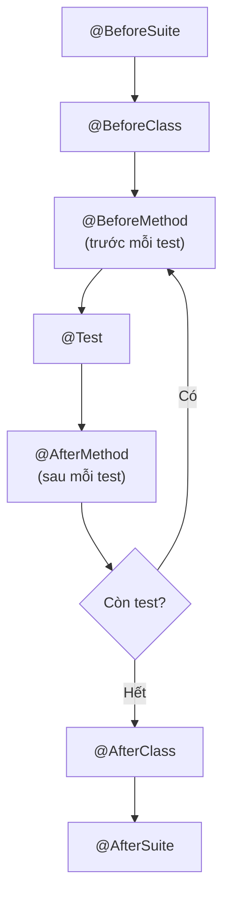

# 3. TestNG

TestNG là một framework test cho Java, ra đời như lựa chọn thay thế JUnit và mạnh hơn ở việc quản lý nhóm test, chạy test song song và cung cấp dữ liệu linh hoạt. Nó rất được ưa chuộng trong kiểm thử tự động (ví dụ dùng cùng Selenium). Bài này giới thiệu cách dùng TestNG và so sánh với JUnit; chi tiết nằm bên dưới.

[](pathname:///img/java/testng.webp)

---

:::note[Ghi nhớ nhanh]

- ⭐ **TestNG mạnh về `groups`, chạy song song và `@DataProvider`** — được ưa chuộng cho automation testing (Selenium).
- ⭐ **`assertEquals(thucTe, mongDoi)`** — thứ tự NGƯỢC với JUnit, rất dễ nhầm khi chuyển framework.
- **`priority` và `groups`** — `priority` chỉ định thứ tự chạy; `groups` gắn nhãn để chạy chọn lọc qua `testng.xml`.
- **Vòng đời phong phú** — `@BeforeSuite`/`@BeforeClass`/`@BeforeMethod` và các `@After...` tương ứng.
- **Gradle cần `useTestNG()`** — nếu không, Gradle vẫn chạy bằng JUnit và không thấy test TestNG.

:::

---

## Mục lục

- [Vì sao TestNG ra đời?](#vì-sao-testng-ra-đời)
- [TestNG là gì?](#testng-là-gì)
- [Cài đặt TestNG](#cài-đặt-testng)
- [Viết test với @Test](#viết-test-với-test)
- [Priority: thứ tự chạy test](#priority-thứ-tự-chạy-test)
- [Groups: nhóm test theo loại](#groups-nhóm-test-theo-loại)
- [@DataProvider: cung cấp nhiều bộ dữ liệu](#dataprovider-cung-cấp-nhiều-bộ-dữ-liệu)
- [Các annotation vòng đời](#các-annotation-vòng-đời)
- [So sánh TestNG với JUnit](#so-sánh-testng-với-junit)
- [Lỗi thường gặp](#lỗi-thường-gặp)
- [Tóm tắt](#tóm-tắt)
- [Câu hỏi phỏng vấn](#câu-hỏi-phỏng-vấn)

---

## Vì sao TestNG ra đời?

**Vấn đề:** JUnit (phiên bản 3 và 4) đủ dùng cho unit test đơn giản, nhưng khi dự án lớn hơn, nhóm test phức tạp hơn, JUnit bộc lộ nhiều hạn chế:

```java
// JUnit 4: không có cách nhóm test — muốn chạy riêng "smoke test"
// thì phải tạo class riêng hoặc dùng runner phức tạp
@Test
public void testDangNhap() { ... }

@Test
public void testMuaHang() { ... }  // không có nhãn, không thể lọc nhóm

// JUnit 4: @Parameterized cồng kềnh, phải dùng constructor riêng
@RunWith(Parameterized.class)
public class AddTest {
    private int a, b, expected;
    public AddTest(int a, int b, int expected) { ... }  // boilerplate nhiều

    @Parameters
    public static Collection<Object[]> data() { ... }
}
```

Thêm vào đó: chạy test song song (parallel) với JUnit 4 rất khó cấu hình, và không có cơ chế khai báo phụ thuộc giữa các test (`testB` chỉ chạy nếu `testA` đã pass).

**Giải pháp:** TestNG (Next Generation) ra đời năm 2004 để bổ sung đúng những điểm thiếu đó:

```java
// TestNG: nhóm test bằng groups — chạy chọn lọc dễ dàng
@Test(groups = "smoke")
public void testDangNhap() { ... }

@Test(groups = "regression", dependsOnMethods = "testDangNhap")
public void testMuaHang() { ... }  // chỉ chạy nếu testDangNhap pass

// TestNG: @DataProvider gọn hơn nhiều
@DataProvider(name = "boSoHanh")
public Object[][] data() {
    return new Object[][] { {1, 2, 3}, {10, 20, 30} };
}

@Test(dataProvider = "boSoHanh")
public void testCong(int a, int b, int expected) {
    Assert.assertEquals(a + b, expected);  // chạy 2 lần tự động
}
```

:::tip[Dùng thực tế]
- **Automation testing với Selenium/Appium**: TestNG là lựa chọn mặc định vì quản lý nhóm test (smoke, regression) và chạy song song rất mạnh.
- **Integration test / E2E test quy mô lớn**: Dùng `testng.xml` để cấu hình suite, chạy từng nhóm test theo môi trường (dev, staging, prod).
- **Data-driven testing**: `@DataProvider` đọc dữ liệu từ file Excel, database, hoặc API để chạy cùng 1 test với hàng trăm bộ dữ liệu.
- **CI/CD pipeline**: Cấu hình chạy song song nhiều test class giúp rút ngắn thời gian build đáng kể.
:::

## TestNG là gì?

**TestNG** (chữ NG là viết tắt của **Next Generation** — thế hệ tiếp theo) là một **framework test** cho Java, ra đời như một lựa chọn **thay thế JUnit**.

TestNG được tạo ra để bổ sung những tính năng mà JUnit (phiên bản cũ) còn thiếu, đặc biệt hữu ích cho:

- **Integration test (kiểm thử tích hợp)** và **end-to-end test (kiểm thử toàn luồng)**.
- **Quản lý nhóm test (groups)** — chạy chọn lọc nhóm test nào.
- **Test song song (parallel)** — chạy nhiều test cùng lúc cho nhanh.
- **Cung cấp dữ liệu linh hoạt** qua `@DataProvider`.

TestNG rất được ưa chuộng trong giới **automation testing (kiểm thử tự động)** như khi dùng cùng Selenium để test web.

## Cài đặt TestNG

Với **Maven**, thêm vào `pom.xml`:

```xml
<!-- Thư viện TestNG -->
<dependency>
    <groupId>org.testng</groupId>
    <artifactId>testng</artifactId>
    <version>7.9.0</version>
    <scope>test</scope>
</dependency>
```

Với **Gradle**, thêm vào `build.gradle`:

```groovy
dependencies {
    testImplementation 'org.testng:testng:7.9.0'
}
test {
    useTestNG()  // báo Gradle dùng TestNG thay vì JUnit
}
```

## Viết test với @Test

Giống JUnit, TestNG cũng dùng annotation **`@Test`**, nhưng import từ gói khác (`org.testng.annotations.Test`). Các phương thức assert nằm trong lớp `Assert`.

```java
import org.testng.annotations.Test;
import org.testng.Assert;   // chú ý: Assert (số ít), không phải Assertions

public class CalculatorTest {

    @Test  // đánh dấu phương thức là test
    void testAdd() {
        Calculator calc = new Calculator();
        int ketQua = calc.add(2, 3);
        // Chú ý: TestNG đặt giá trị THỰC TẾ trước, MONG ĐỢI sau (NGƯỢC với JUnit!)
        Assert.assertEquals(ketQua, 5);
    }
}
```

> Cẩn thận: Trong TestNG, `assertEquals(thucTe, mongDoi)` — thứ tự **ngược** với JUnit. Đây là điểm hay gây nhầm khi chuyển qua lại giữa hai framework.

## Priority: thứ tự chạy test

Mặc định TestNG chạy test theo thứ tự bảng chữ cái của tên. Nếu muốn chỉ định thứ tự, dùng thuộc tính **`priority`** (ưu tiên). Số càng nhỏ chạy càng sớm.

```java
public class OrderTest {

    @Test(priority = 1)  // chạy đầu tiên
    void dangNhap() {
        System.out.println("1. Đăng nhập");
    }

    @Test(priority = 2)  // chạy thứ hai
    void themSanPhamVaoGio() {
        System.out.println("2. Thêm sản phẩm vào giỏ");
    }

    @Test(priority = 3)  // chạy cuối
    void thanhToan() {
        System.out.println("3. Thanh toán");
    }
}
```

> Lưu ý: Unit test tốt nên **độc lập với thứ tự**. `priority` chủ yếu hữu ích cho test luồng (như mô phỏng hành vi người dùng theo các bước).

## Groups: nhóm test theo loại

**`groups`** cho phép gắn "nhãn" cho test, rồi chạy chọn lọc theo nhãn. Ví dụ chia test thành nhóm "nhanh" (smoke) và "chậm" (regression).

```java
public class GroupTest {

    @Test(groups = "smoke")  // nhóm test nhanh, chạy thường xuyên
    void kiemTraTrangChu() {
        System.out.println("Kiểm tra trang chủ tải được");
    }

    @Test(groups = "regression")  // nhóm test đầy đủ, chạy ít hơn
    void kiemTraToanBoLuong() {
        System.out.println("Kiểm tra toàn bộ luồng mua hàng");
    }

    @Test(groups = {"smoke", "regression"})  // thuộc cả hai nhóm
    void kiemTraDangNhap() {
        System.out.println("Kiểm tra đăng nhập");
    }
}
```

Sau đó cấu hình file `testng.xml` để chỉ chạy nhóm mong muốn:

```xml
<!-- Chỉ chạy các test thuộc nhóm "smoke" -->
<suite name="BoTestCuaToi">
    <test name="ChiChaySmoke">
        <groups>
            <run>
                <include name="smoke"/>  <!-- chỉ chạy nhóm smoke -->
            </run>
        </groups>
        <classes>
            <class name="GroupTest"/>
        </classes>
    </test>
</suite>
```

## @DataProvider: cung cấp nhiều bộ dữ liệu

**`@DataProvider`** là cách TestNG chạy cùng một test với **nhiều bộ dữ liệu** (tương tự `@ParameterizedTest` của JUnit, nhưng linh hoạt hơn).

```java
import org.testng.annotations.DataProvider;
import org.testng.annotations.Test;
import org.testng.Assert;

public class DataProviderTest {

    // Phương thức cung cấp dữ liệu: trả về mảng các bộ {a, b, mongDoi}
    @DataProvider(name = "duLieuPhepCong")
    public Object[][] cungCapDuLieu() {
        return new Object[][] {
            {1, 1, 2},
            {2, 3, 5},
            {10, 20, 30},
            {-5, 5, 0}
        };
    }

    // Test dùng dữ liệu từ provider ở trên -> chạy 4 lần
    @Test(dataProvider = "duLieuPhepCong")
    void testAdd(int a, int b, int mongDoi) {
        Calculator calc = new Calculator();
        Assert.assertEquals(calc.add(a, b), mongDoi);
    }
}
```

Điểm mạnh của `@DataProvider`: vì nó là **một phương thức Java**, bạn có thể đọc dữ liệu từ file, database, hay tính toán động — linh hoạt hơn nhiều so với việc viết cứng dữ liệu.

## Các annotation vòng đời

TestNG có hệ thống annotation vòng đời phong phú hơn JUnit:

```java
import org.testng.annotations.*;

public class LifecycleTest {

    @BeforeSuite  // chạy 1 lần trước toàn bộ suite (tập hợp test)
    void beforeSuite() { System.out.println("Trước suite"); }

    @BeforeClass  // chạy 1 lần trước tất cả test trong class
    void beforeClass() { System.out.println("Trước class"); }

    @BeforeMethod // chạy trước MỖI test (giống @BeforeEach của JUnit)
    void beforeMethod() { System.out.println("Trước mỗi test"); }

    @Test
    void test1() { System.out.println("Test 1"); }

    @AfterMethod  // chạy sau MỖI test
    void afterMethod() { System.out.println("Sau mỗi test"); }

    @AfterClass   // chạy 1 lần sau tất cả test trong class
    void afterClass() { System.out.println("Sau class"); }

    @AfterSuite   // chạy 1 lần sau toàn bộ suite
    void afterSuite() { System.out.println("Sau suite"); }
}
```

Sơ đồ thứ tự chạy các annotation vòng đời trong TestNG:



## So sánh TestNG với JUnit

| Tiêu chí | JUnit 5 | TestNG |
|----------|---------|--------|
| Annotation test | `@Test` | `@Test` |
| Trước mỗi test | `@BeforeEach` | `@BeforeMethod` |
| Sau mỗi test | `@AfterEach` | `@AfterMethod` |
| Thứ tự `assertEquals` | (mongDoi, thucTe) | (thucTe, mongDoi) |
| Test theo dữ liệu | `@ParameterizedTest` | `@DataProvider` |
| Nhóm test | `@Tag` | `groups` (mạnh hơn) |
| Cấu hình bằng XML | Không phổ biến | `testng.xml` (mạnh) |
| Test song song | Có (cấu hình) | Có (dễ cấu hình) |
| Phổ biến cho | Unit test | Integration/E2E, automation |

**Nên chọn cái nào?** Với người mới và unit test thông thường, **JUnit 5** là lựa chọn phổ biến và đủ dùng. **TestNG** mạnh hơn khi cần quản lý nhóm test phức tạp, test song song, hay làm automation testing (ví dụ với Selenium). Cả hai đều tốt — quan trọng là chọn một và dùng nhất quán trong dự án.

## Lỗi thường gặp

1. **Nhầm thứ tự `assertEquals`**: TestNG là `(thucTe, mongDoi)`, ngược với JUnit. Ghi nhớ kỹ khi chuyển framework.
2. **Import nhầm annotation**: TestNG dùng `org.testng.annotations.Test`, không phải `org.junit...`.
3. **Lạm dụng `priority`**: Khiến test phụ thuộc thứ tự, vi phạm tính độc lập. Chỉ dùng khi thực sự cần luồng tuần tự.
4. **Tên `@DataProvider` không khớp**: Tên trong `@Test(dataProvider = "...")` phải trùng đúng với `@DataProvider(name = "...")`.
5. **Quên cấu hình `useTestNG()` trong Gradle**: Nếu không, Gradle vẫn chạy bằng JUnit và không thấy test TestNG.

## Tóm tắt

- **TestNG** (Next Generation) là framework test thay thế JUnit, mạnh về quản lý nhóm và test song song.
- Dùng **`@Test`** giống JUnit nhưng `assertEquals` có **thứ tự ngược** (thực tế trước, mong đợi sau).
- **`priority`** chỉ định thứ tự chạy; **`groups`** gắn nhãn để chạy chọn lọc.
- **`@DataProvider`** cung cấp nhiều bộ dữ liệu linh hoạt cho cùng một test.
- TestNG có hệ thống annotation vòng đời phong phú: `@BeforeSuite/@BeforeClass/@BeforeMethod`...
- Với unit test thông thường, JUnit 5 đủ dùng; TestNG mạnh hơn cho integration/E2E và automation.
- Bài tiếp theo: **Mockito** — công cụ tạo đối tượng giả lập (mock) khi test.

---

## Câu hỏi phỏng vấn

Những câu thường gặp về chủ đề này. Tự trả lời trước, rồi bấm **Xem đáp án** để đối chiếu.

**1. TestNG ra đời để giải quyết những hạn chế nào của JUnit (đặc biệt là JUnit 3/4)?**

<details className="qa">
<summary>Xem đáp án</summary>

- **Không có cơ chế nhóm test (groups)** built-in: JUnit 3/4 khó chạy chọn lọc một tập con test (ví dụ chỉ chạy "smoke test") mà không tách thành class/package riêng.
- **`@Parameterized` của JUnit 4 cồng kềnh**: phải viết constructor riêng và một phương thức static trả về `Collection<Object[]>`, nhiều boilerplate hơn `@DataProvider` của TestNG.
- **Khó cấu hình chạy song song (parallel)**: JUnit 4 không hỗ trợ tốt việc chạy nhiều test cùng lúc để rút ngắn thời gian.
- **Không có cơ chế khai báo phụ thuộc giữa các test**: JUnit 4 không có cách chuẩn để nói "testB chỉ nên chạy nếu testA đã pass", trong khi TestNG hỗ trợ qua `dependsOnMethods`.
- TestNG (ra đời 2004) bổ sung `groups`, `@DataProvider`, `priority`, và hệ thống vòng đời phong phú hơn để giải quyết các hạn chế này.

</details>

**2. Cho đoạn code sau, đâu là lỗi phổ biến khi lập trình viên quen JUnit chuyển sang viết test bằng TestNG?**

```java
import org.testng.Assert;

@Test
void testAdd() {
    Calculator calc = new Calculator();
    int ketQua = calc.add(2, 3);
    Assert.assertEquals(5, ketQua);
}
```

<details className="qa">
<summary>Xem đáp án</summary>

**Lỗi**: viết `Assert.assertEquals(5, ketQua)` theo thói quen JUnit (mong đợi trước, thực tế sau), nhưng **TestNG quy ước ngược lại**: `assertEquals(thucTe, mongDoi)` — tham số đầu là giá trị **thực tế**, tham số sau mới là giá trị **mong đợi**.

- Về mặt kết quả pass/fail, thứ tự này **không ảnh hưởng** vì so sánh bằng nhau có tính đối xứng — test vẫn pass nếu `ketQua == 5`.
- Nhưng nếu test fail, **thông báo lỗi sẽ bị đọc ngược**: TestNG sẽ hiển thị dạng `expected [ketQua_value] but found [5]`, gây hiểu nhầm khi debug vì "expected" và "actual" bị hoán đổi vai trò so với những gì lập trình viên quen với JUnit mong đợi.
- Cách viết đúng theo quy ước TestNG: `Assert.assertEquals(ketQua, 5)` — thực tế trước, mong đợi sau.

</details>

**3. `priority` trong TestNG dùng để làm gì? Vì sao tài liệu khuyến cáo không nên lạm dụng thuộc tính này cho unit test thông thường?**

<details className="qa">
<summary>Xem đáp án</summary>

`priority` chỉ định **thứ tự chạy** các phương thức `@Test` — số càng nhỏ chạy càng sớm (mặc định TestNG chạy theo thứ tự bảng chữ cái tên phương thức nếu không đặt `priority`).

```java
@Test(priority = 1) void dangNhap() { ... }
@Test(priority = 2) void themSanPhamVaoGio() { ... }
@Test(priority = 3) void thanhToan() { ... }
```

- Không nên lạm dụng cho **unit test** vì unit test tốt phải **độc lập (Independent)** — không phụ thuộc thứ tự chạy, có thể chạy riêng lẻ hoặc song song mà vẫn ra kết quả đúng.
- `priority` chỉ thực sự hữu ích khi mô phỏng một **luồng nghiệp vụ tuần tự** có thật (ví dụ test kịch bản E2E: đăng nhập → thêm giỏ hàng → thanh toán, nơi các bước phụ thuộc lẫn nhau một cách tự nhiên), chứ không nên dùng để "vá" cho một unit test thiết kế sai khiến nó phụ thuộc trạng thái từ test khác.

</details>

**4. `groups` trong TestNG giải quyết vấn đề gì trong CI/CD? Cho ví dụ cấu hình `testng.xml` chỉ chạy nhóm `smoke`.**

<details className="qa">
<summary>Xem đáp án</summary>

`groups` cho phép gắn "nhãn" lên từng test, sau đó **chạy chọn lọc** theo nhãn thay vì phải chạy toàn bộ test suite mỗi lần.

- Trong CI/CD, điều này rất hữu ích: pipeline có thể chạy nhóm **`smoke`** (test nhanh, kiểm tra các chức năng cốt lõi) ngay sau mỗi lần commit để phản hồi nhanh, còn nhóm **`regression`** (test đầy đủ, chạy lâu hơn) chỉ chạy định kỳ hoặc trước khi release.

```xml
<suite name="BoTestCuaToi">
    <test name="ChiChaySmoke">
        <groups>
            <run>
                <include name="smoke"/>
            </run>
        </groups>
        <classes>
            <class name="GroupTest"/>
        </classes>
    </test>
</suite>
```

- Một test có thể thuộc **nhiều nhóm cùng lúc** (`@Test(groups = {"smoke", "regression"})`), giúp linh hoạt tổ chức nhiều chiến lược chạy test khác nhau từ cùng một bộ test case.

</details>

**5. So sánh `@DataProvider` của TestNG với `@ParameterizedTest` + `@CsvSource` của JUnit 5. Vì sao `@DataProvider` được xem là linh hoạt hơn trong một số trường hợp?**

<details className="qa">
<summary>Xem đáp án</summary>

Cả hai đều giải quyết cùng vấn đề: chạy một logic test với nhiều bộ dữ liệu, tránh copy-paste.

```java
@DataProvider(name = "duLieuPhepCong")
public Object[][] cungCapDuLieu() {
    return new Object[][] { {1, 1, 2}, {2, 3, 5} };
}

@Test(dataProvider = "duLieuPhepCong")
void testAdd(int a, int b, int mongDoi) {
    Assert.assertEquals(calc.add(a, b), mongDoi);
}
```

- `@DataProvider` là **một phương thức Java bình thường** trả về `Object[][]` — có thể chứa **logic tùy ý**: đọc từ file Excel, gọi database, gọi API, tính toán động dữ liệu test.
- `@CsvSource` của JUnit 5 chỉ nhận **chuỗi tĩnh viết cứng** trong annotation, phù hợp với dữ liệu đơn giản; khi cần dữ liệu phức tạp hoặc động, JUnit 5 phải chuyển sang dùng `@MethodSource` (tương tự về bản chất với `@DataProvider`, nhưng cú pháp khai báo khác).
- Nhìn chung, `@DataProvider` của TestNG có phần **gọn và mạnh hơn ngay từ đầu** cho các trường hợp dữ liệu phức tạp, không cần "chuyển đổi" sang một annotation khác như JUnit 5.

</details>

**6. Trình bày đầy đủ thứ tự chạy các annotation vòng đời trong TestNG khi một class có nhiều `@Test`, gồm `@BeforeSuite`, `@BeforeClass`, `@BeforeMethod`, `@AfterMethod`, `@AfterClass`, `@AfterSuite`.**

<details className="qa">
<summary>Xem đáp án</summary>

Thứ tự chạy:

1. **`@BeforeSuite`** — chạy **một lần duy nhất** trước toàn bộ suite (tập hợp nhiều test class).
2. **`@BeforeClass`** — chạy **một lần** trước tất cả test trong class.
3. Với **mỗi** phương thức `@Test`:
   - **`@BeforeMethod`** chạy trước.
   - **`@Test`** chạy.
   - **`@AfterMethod`** chạy sau.
4. **`@AfterClass`** — chạy **một lần** sau khi tất cả test trong class đã chạy xong.
5. **`@AfterSuite`** — chạy **một lần duy nhất** sau toàn bộ suite.

- Đây là hệ thống vòng đời **phong phú hơn** JUnit 5 (chỉ có `@BeforeAll`/`@BeforeEach`/`@AfterEach`/`@AfterAll` ở cấp class), vì TestNG có thêm cấp độ **suite** — hữu ích khi tổ chức nhiều class test thành một bộ suite lớn qua `testng.xml`.

</details>

**7. So sánh `@BeforeEach`/`@AfterEach` của JUnit 5 với `@BeforeMethod`/`@AfterMethod` của TestNG — chúng có tương đương hoàn toàn không?**

<details className="qa">
<summary>Xem đáp án</summary>

Về mặt **thời điểm chạy**, chúng tương đương: cả hai đều chạy **trước/sau mỗi phương thức test**.

Khác biệt:

- **Import**: JUnit dùng `org.junit.jupiter.api.BeforeEach`/`AfterEach`; TestNG dùng `org.testng.annotations.BeforeMethod`/`AfterMethod`.
- **Cấp độ vòng đời**: TestNG có thêm các cấp **suite** (`@BeforeSuite`/`@AfterSuite`) mà JUnit 5 không có khái niệm tương đương trực tiếp ở cấp class đơn lẻ (JUnit 5 quản lý việc gom nhiều class qua cấu hình runner/IDE/build tool, không qua annotation trong code).
- **Instance lifecycle**: JUnit 5 mặc định tạo instance mới cho mỗi test method (`PER_METHOD`), còn TestNG theo mặc định dùng **chung một instance** cho tất cả test method trong class — đây là khác biệt quan trọng ảnh hưởng tới cách quản lý state giữa các test.

</details>

**8. Vì sao trong một dự án dùng Gradle, nếu quên cấu hình `useTestNG()` trong khối `test { ... }`, các test viết bằng TestNG có thể hoàn toàn không được chạy dù không báo lỗi biên dịch?**

<details className="qa">
<summary>Xem đáp án</summary>

- Gradle mặc định dùng **JUnit Platform** để chạy test, nên nếu không khai báo rõ `useTestNG()`, Gradle sẽ cố tìm và chạy test theo cơ chế nhận diện của JUnit — mà annotation `@Test` của TestNG (`org.testng.annotations.Test`) **không được JUnit engine nhận diện**.
- Kết quả: các test class dùng TestNG **âm thầm không được chạy** — Gradle không báo lỗi (vì code biên dịch bình thường), báo cáo test có thể hiển thị "0 test" hoặc bỏ qua hoàn toàn các class đó, dễ khiến lập trình viên tưởng nhầm là "không có test nào cần chạy" hoặc mọi thứ đều ổn.
- Cách khắc phục: thêm `useTestNG()` vào khối `test { ... }` trong `build.gradle` để báo Gradle chuyển sang dùng TestNG engine.

```groovy
test {
    useTestNG()
}
```

</details>

**9. Trong tình huống nào nên chọn TestNG thay vì JUnit 5 cho một dự án mới? Nêu ít nhất hai lý do cụ thể.**

<details className="qa">
<summary>Xem đáp án</summary>

Nên cân nhắc TestNG khi:

- **Automation testing với Selenium/Appium**: TestNG là lựa chọn phổ biến nhất trong cộng đồng automation testing nhờ khả năng quản lý nhóm test (`groups`) tách biệt smoke/regression, và tích hợp `testng.xml` mạnh để cấu hình chạy theo môi trường (dev/staging/prod).
- **Cần khai báo phụ thuộc rõ ràng giữa các test**: ví dụ test kịch bản E2E nhiều bước, nơi bước sau chỉ có ý nghĩa khi bước trước đã pass (`dependsOnMethods`), mà JUnit 5 không có cơ chế tương đương trực tiếp trong core.
- **Cần chạy test song song ở nhiều cấp độ** (method, class, suite) với cấu hình linh hoạt qua XML, phù hợp cho bộ test E2E lớn cần tối ưu thời gian chạy trong CI/CD.
- Ngược lại, nếu chỉ cần **unit test thông thường** cho logic nghiệp vụ, JUnit 5 vẫn là lựa chọn phổ biến, đơn giản và đủ dùng hơn cho đa số dự án.

</details>

**10. Một team đang có sẵn hàng trăm unit test viết bằng JUnit 5, giờ muốn thêm bộ test automation bằng Selenium dùng TestNG trong cùng dự án. Điều này có khả thi không, và cần lưu ý gì?**

<details className="qa">
<summary>Xem đáp án</summary>

**Khả thi**, và trên thực tế khá phổ biến — nhiều dự án dùng JUnit 5 cho unit test và TestNG riêng cho automation/E2E test, vì hai framework không nhất thiết loại trừ lẫn nhau trong cùng một dự án (miễn có đủ dependency cho cả hai).

Lưu ý quan trọng:

- **Tách rõ thư mục/package** giữa hai loại test để tránh nhầm lẫn khi maintain, ví dụ `src/test/java/unit/` (JUnit 5) và `src/test/java/e2e/` (TestNG).
- **Cấu hình build tool đúng cách**: với Maven, Surefire plugin cần được cấu hình để nhận diện cả hai loại test engine (JUnit Platform và TestNG); với Gradle, cần tách task test riêng cho từng loại nếu muốn chạy độc lập, vì mặc định một khối `test { }` chỉ dùng một engine tại một thời điểm.
- **Nhất quán trong team**: cần thống nhất rõ ràng khi nào dùng framework nào (ví dụ "TestNG chỉ dùng cho automation, JUnit 5 dùng cho mọi unit test khác") để tránh tình trạng lẫn lộn, mỗi người viết theo một kiểu khác nhau không có lý do rõ ràng.

</details>

**11. Đoạn code TestNG sau minh họa cơ chế `dependsOnMethods`. Nếu `testDangNhap()` fail, điều gì xảy ra với `testMuaHang()`?**

```java
@Test(groups = "smoke")
public void testDangNhap() {
    Assert.assertTrue(dangNhapThanhCong());
}

@Test(groups = "regression", dependsOnMethods = "testDangNhap")
public void testMuaHang() {
    Assert.assertTrue(muaHangThanhCong());
}
```

<details className="qa">
<summary>Xem đáp án</summary>

Nếu `testDangNhap()` **fail** (hoặc ném exception), `testMuaHang()` sẽ **không được thực thi** mà tự động được đánh dấu là **`SKIPPED`** (bị bỏ qua), chứ không phải chạy bình thường rồi fail theo.

- Đây chính là cơ chế **khai báo phụ thuộc giữa các test** mà TestNG hỗ trợ qua `dependsOnMethods` — đảm bảo logic: nếu bước trước (`đăng nhập`) đã thất bại, việc chạy tiếp bước sau (`mua hàng`) là vô nghĩa vì chắc chắn cũng sẽ fail (do phụ thuộc trạng thái từ bước trước), gây lãng phí thời gian chạy test và làm nhiễu báo cáo với nhiều lỗi cùng một nguyên nhân gốc.
- Trong báo cáo test, `testMuaHang` sẽ hiển thị trạng thái riêng biệt là **SKIP**, giúp phân biệt rõ với trạng thái **FAIL** thực sự — người xem báo cáo biết ngay cần tập trung điều tra `testDangNhap` trước.

</details>
