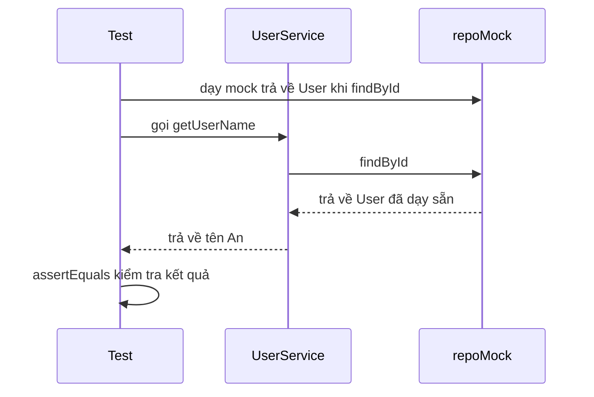

# 4. Mockito (Mocking)

Mockito là thư viện giúp tạo các đối tượng giả lập (mock) để thay thế những phụ thuộc thật như database, API hay email khi viết test. Nhờ vậy bạn test được riêng logic của một lớp mà test vẫn nhanh, ổn định và an toàn. Bài này hướng dẫn tạo mock, dạy mock trả về giá trị và kiểm tra hành vi; chi tiết nằm bên dưới.

[](pathname:///img/java/mockito.webp)

---

:::note[Ghi nhớ nhanh]

- ⭐ **Mock là đối tượng giả lập** — đóng thế database/API/email để test riêng logic một lớp, nhanh và ổn định.
- **`mock(...)` và `when(...).thenReturn(...)`** — tạo mock rồi "dạy" mock trả về giá trị (stubbing).
- **`verify(...)`** — kiểm tra một phương thức đã (hoặc chưa) được gọi, kèm `times(n)`, `never()`.
- ⭐ **`@Mock` + `@InjectMocks` + `@ExtendWith(MockitoExtension.class)`** — cách viết test gọn khi có nhiều phụ thuộc.
- **Chỉ stub/verify điều cần** — stub thừa gây `UnnecessaryStubbingException`, verify quá chi tiết làm test giòn.

:::

---

## Mục lục

- [Mock (đối tượng giả lập) là gì?](#mock-đối-tượng-giả-lập-là-gì)
- [Vì sao cần mock khi test?](#vì-sao-cần-mock-khi-test)
- [Mockito là gì và cài đặt](#mockito-là-gì-và-cài-đặt)
- [Tạo mock và when().thenReturn()](#tạo-mock-và-whenthenreturn)
- [verify(): kiểm tra hành vi đã được gọi](#verify-kiểm-tra-hành-vi-đã-được-gọi)
- [@Mock và @InjectMocks](#mock-và-injectmocks)
- [Ví dụ đầy đủ: test một Service](#ví-dụ-đầy-đủ-test-một-service)
- [Lỗi thường gặp](#lỗi-thường-gặp)
- [Tóm tắt](#tóm-tắt)
- [Câu hỏi phỏng vấn](#câu-hỏi-phỏng-vấn)

---

## Mock (đối tượng giả lập) là gì?

**Mock (đối tượng giả lập)** là một đối tượng "đóng giả" một đối tượng thật, dùng riêng cho việc test. Bạn ra lệnh cho mock: "Khi ai đó gọi phương thức này với tham số kia, hãy trả về kết quả này" — mà không cần chạy code thật bên trong.

> Ví dụ đời thường: Khi quay phim, người ta dùng **diễn viên đóng thế (stunt double)** cho các pha nguy hiểm thay vì diễn viên chính. Mock cũng giống vậy: nó đóng thế cho đối tượng thật trong những tình huống mà dùng đồ thật thì khó, chậm, hoặc nguy hiểm.

## Vì sao cần mock khi test?

Trong thực tế, một lớp thường **phụ thuộc (depend on)** vào lớp khác. Ví dụ một `UserService` (dịch vụ người dùng) cần một `UserRepository` (kho dữ liệu) để truy vấn database.

Nếu test thật, ta gặp vấn đề:

- **Chậm**: Gọi database/API thật mất thời gian.
- **Khó kiểm soát**: Database thật có thể thay đổi, mạng có thể lỗi → test lúc pass lúc fail.
- **Tốn kém / nguy hiểm**: Gọi API gửi email thật, trừ tiền thật trong khi test thì rất tệ.

Giải pháp: thay các phụ thuộc đó bằng **mock**. Như vậy ta chỉ test **riêng logic của lớp đang quan tâm**, không bị ảnh hưởng bởi database hay mạng.

```java
// UserService phụ thuộc vào UserRepository (để lấy dữ liệu)
public class UserService {
    private final UserRepository repository;

    public UserService(UserRepository repository) {
        this.repository = repository;  // nhận phụ thuộc từ bên ngoài
    }

    public String getUserName(int id) {
        User user = repository.findById(id);  // gọi database -> ta sẽ mock chỗ này
        if (user == null) {
            return "Không tìm thấy";
        }
        return user.getName();
    }
}
```

## Mockito là gì và cài đặt

**Mockito** là thư viện **mocking (giả lập)** phổ biến nhất trong Java. Nó giúp tạo mock và kiểm tra hành vi một cách gọn gàng.

Cài đặt với **Maven**:

```xml
<dependency>
    <groupId>org.mockito</groupId>
    <artifactId>mockito-core</artifactId>
    <version>5.11.0</version>
    <scope>test</scope>
</dependency>
<!-- Tích hợp Mockito với JUnit 5 -->
<dependency>
    <groupId>org.mockito</groupId>
    <artifactId>mockito-junit-jupiter</artifactId>
    <version>5.11.0</version>
    <scope>test</scope>
</dependency>
```

Cài đặt với **Gradle**:

```groovy
testImplementation 'org.mockito:mockito-core:5.11.0'
testImplementation 'org.mockito:mockito-junit-jupiter:5.11.0'
```

## Tạo mock và when().thenReturn()

Hai bước cơ bản khi dùng Mockito:

1. **`mock(...)`**: tạo một đối tượng giả.
2. **`when(...).thenReturn(...)`**: dạy cho mock biết trả về gì khi được gọi (gọi là **stubbing** — gắn hành vi giả).

```java
import static org.mockito.Mockito.*;
import static org.junit.jupiter.api.Assertions.assertEquals;
import org.junit.jupiter.api.Test;

class UserServiceTest {

    @Test
    void testGetUserName() {
        // 1. Arrange: tạo mock cho UserRepository (không cần database thật)
        UserRepository repoMock = mock(UserRepository.class);

        // Dạy mock: khi gọi findById(1) thì trả về một User tên "An"
        when(repoMock.findById(1)).thenReturn(new User(1, "An"));

        // Đưa mock vào service cần test
        UserService service = new UserService(repoMock);

        // 2. Act: gọi phương thức cần kiểm tra
        String ten = service.getUserName(1);

        // 3. Assert: kiểm tra kết quả
        assertEquals("An", ten);
    }
}
```

Lưu ý: mock **không chạy** code thật của `UserRepository`. Nó chỉ làm đúng những gì ta "dạy" qua `when().thenReturn()`. Nhờ vậy test rất nhanh và ổn định.

Sơ đồ tuần tự dưới đây minh hoạ luồng test khi dùng mock thay cho database thật:



Ta cũng có thể dạy mock **ném ngoại lệ**:

```java
// Khi gọi findById(999), mock sẽ ném ra ngoại lệ (mô phỏng lỗi database)
when(repoMock.findById(999)).thenThrow(new RuntimeException("Lỗi DB"));
```

## verify(): kiểm tra hành vi đã được gọi

Đôi khi ta không chỉ quan tâm **kết quả trả về**, mà còn muốn chắc chắn rằng **một phương thức đã được gọi** (hoặc không được gọi). Dùng **`verify(...)`**.

```java
@Test
void testGoiSave() {
    UserRepository repoMock = mock(UserRepository.class);
    UserService service = new UserService(repoMock);

    // Act: tạo người dùng mới
    service.createUser("Bình");

    // Verify: kiểm tra repository.save(...) đã được gọi đúng 1 lần
    verify(repoMock, times(1)).save(any(User.class));

    // Có thể kiểm tra KHÔNG được gọi:
    verify(repoMock, never()).delete(anyInt());
}
```

Một vài "matcher" (bộ so khớp tham số) hữu ích: `any()` (bất kỳ giá trị nào), `anyInt()`, `eq(value)` (đúng giá trị này). Đây gọi là **behavior verification** (kiểm tra hành vi) — khác với **state verification** (kiểm tra trạng thái/kết quả).

## @Mock và @InjectMocks

Thay vì gọi `mock(...)` thủ công, ta có thể dùng annotation cho gọn:

- **`@Mock`**: tự tạo một mock cho biến đó.
- **`@InjectMocks`**: tạo đối tượng thật và **tự động nhét (inject)** các mock vào.

Để annotation hoạt động với JUnit 5, thêm `@ExtendWith(MockitoExtension.class)` lên lớp test.

```java
import org.junit.jupiter.api.Test;
import org.junit.jupiter.api.extension.ExtendWith;
import org.mockito.InjectMocks;
import org.mockito.Mock;
import org.mockito.junit.jupiter.MockitoExtension;
import static org.mockito.Mockito.*;
import static org.junit.jupiter.api.Assertions.assertEquals;

@ExtendWith(MockitoExtension.class)  // kích hoạt @Mock, @InjectMocks
class UserServiceTest {

    @Mock                       // tạo mock cho repository
    private UserRepository repository;

    @InjectMocks                // tạo UserService và nhét repository mock vào
    private UserService service;

    @Test
    void testGetUserName() {
        // Dạy mock trả về User tên "An" khi tìm id = 1
        when(repository.findById(1)).thenReturn(new User(1, "An"));

        String ten = service.getUserName(1);

        assertEquals("An", ten);
    }
}
```

Cách này gọn hơn nhiều khi service có nhiều phụ thuộc.

## Ví dụ đầy đủ: test một Service

Giả sử có lớp `OrderService` (dịch vụ đơn hàng) phụ thuộc vào hai thành phần: kho đơn hàng và dịch vụ gửi email.

```java
public class OrderService {
    private final OrderRepository orderRepo;   // lưu đơn hàng
    private final EmailService emailService;   // gửi email xác nhận

    public OrderService(OrderRepository orderRepo, EmailService emailService) {
        this.orderRepo = orderRepo;
        this.emailService = emailService;
    }

    public boolean placeOrder(Order order) {
        if (order.getAmount() <= 0) {
            return false;  // đơn hàng không hợp lệ
        }
        orderRepo.save(order);                       // lưu vào DB
        emailService.send(order.getEmail(), "Đặt hàng thành công"); // gửi mail
        return true;
    }
}
```

Test với Mockito:

```java
@ExtendWith(MockitoExtension.class)
class OrderServiceTest {

    @Mock private OrderRepository orderRepo;   // mock kho đơn hàng
    @Mock private EmailService emailService;   // mock dịch vụ email (không gửi mail thật)
    @InjectMocks private OrderService service; // tự nhét 2 mock vào service

    @Test
    void datHangThanhCong() {
        Order order = new Order(100, "an@example.com");  // đơn hàng hợp lệ

        boolean ketQua = service.placeOrder(order);

        assertTrue(ketQua);                              // phải thành công
        verify(orderRepo).save(order);                   // đã lưu đơn hàng
        verify(emailService).send("an@example.com", "Đặt hàng thành công"); // đã gửi mail
    }

    @Test
    void datHangThatBaiKhiSoTienAm() {
        Order order = new Order(-5, "an@example.com");   // số tiền âm -> không hợp lệ

        boolean ketQua = service.placeOrder(order);

        assertFalse(ketQua);                             // phải thất bại
        verify(orderRepo, never()).save(any());          // KHÔNG được lưu
        verify(emailService, never()).send(any(), any()); // KHÔNG gửi mail
    }
}
```

Nhờ mock, ta test được logic của `OrderService` mà **không cần database thật và không gửi email thật**.

## Lỗi thường gặp

1. **Quên `@ExtendWith(MockitoExtension.class)`**: Khi đó `@Mock`/`@InjectMocks` không được khởi tạo, biến mock sẽ là `null`.
2. **Stub thừa không dùng đến**: Mockito (strict mode) báo lỗi `UnnecessaryStubbingException` khi bạn `when(...)` nhưng không dùng. Chỉ stub những gì test cần.
3. **Cố mock final class/method (phiên bản cũ)**: Một số phiên bản Mockito cũ không mock được lớp/phương thức `final`. Mockito mới đã hỗ trợ tốt hơn.
4. **Lẫn lộn mock và đối tượng thật**: Quên đưa mock vào service (vẫn dùng repository thật) khiến test gọi database thật.
5. **Verify quá nhiều chi tiết**: Kiểm tra mọi lời gọi nhỏ khiến test "giòn" (dễ vỡ khi refactor). Chỉ verify những hành vi quan trọng.

## Tóm tắt

- **Mock** là đối tượng giả lập, đóng thế đối tượng thật khi test.
- Mock giúp test **nhanh, ổn định, an toàn** khi lớp có phụ thuộc vào database, API, email...
- **Mockito** là thư viện mocking phổ biến nhất của Java.
- **`mock(...)`** tạo mock; **`when(...).thenReturn(...)`** dạy mock trả về giá trị.
- **`verify(...)`** kiểm tra một phương thức đã (hoặc chưa) được gọi.
- **`@Mock`** + **`@InjectMocks`** (kèm `@ExtendWith(MockitoExtension.class)`) giúp viết test gọn hơn.
- Bài tiếp theo: **Integration Testing** — kiểm thử nhiều thành phần phối hợp với nhau.

---

## Câu hỏi phỏng vấn

Những câu thường gặp về chủ đề này. Tự trả lời trước, rồi bấm **Xem đáp án** để đối chiếu.

**1. Mock là gì? Nêu ít nhất ba lý do nên dùng mock thay vì gọi trực tiếp phụ thuộc thật khi viết unit test.**

<details className="qa">
<summary>Xem đáp án</summary>

**Mock** là một đối tượng giả lập, "đóng thế" cho một đối tượng thật (database, API, service khác) trong lúc test, cho phép bạn khai báo trước hành vi mong muốn ("khi gọi phương thức X với tham số Y, hãy trả về Z") mà không chạy code thật bên trong.

Lý do nên dùng mock:

- **Tốc độ**: không cần gọi database/API/mạng thật, test chạy trong mili-giây thay vì giây.
- **Ổn định (Repeatable)**: kết quả mock luôn cố định theo những gì đã "dạy", không bị ảnh hưởng bởi dữ liệu thật thay đổi hay mạng chập chờn.
- **An toàn**: tránh việc test vô tình gửi email thật, trừ tiền thật, hay ghi đè dữ liệu thật trong hệ thống production/staging.
- **Cô lập (Independent)**: chỉ kiểm tra đúng logic của lớp đang test, không bị "nhiễu" bởi lỗi từ các thành phần phụ thuộc khác.

</details>

**2. Giải thích ý nghĩa của đoạn code sau. "Stubbing" trong Mockito nghĩa là gì?**

```java
UserRepository repoMock = mock(UserRepository.class);
when(repoMock.findById(1)).thenReturn(new User(1, "An"));
```

<details className="qa">
<summary>Xem đáp án</summary>

- `mock(UserRepository.class)` tạo ra một **đối tượng giả lập** của `UserRepository` — một implementation "rỗng" tự động sinh ra, mọi phương thức khi gọi mặc định trả về giá trị rỗng/null (chưa được dạy gì).
- `when(repoMock.findById(1)).thenReturn(new User(1, "An"))` là **stubbing** — hành động "dạy" cho mock: khi phương thức `findById(1)` được gọi (đúng với tham số `1`), hãy trả về đối tượng `User(1, "An")` thay vì chạy logic thật (vì mock không có logic thật nào để chạy).
- Nếu gọi `findById` với một tham số khác (ví dụ `findById(2)`) mà chưa được stub riêng, mock sẽ trả về giá trị mặc định (thường là `null` với kiểu tham chiếu).

</details>

**3. `verify()` trong Mockito dùng để làm gì? Phân biệt "behavior verification" (kiểm tra hành vi) với "state verification" (kiểm tra trạng thái/kết quả).**

<details className="qa">
<summary>Xem đáp án</summary>

`verify(mock).phuongThuc(...)` dùng để **xác nhận một phương thức đã được gọi** trên mock, với đúng số lần và đúng tham số mong đợi (hoặc chưa từng được gọi, qua `never()`).

```java
verify(repoMock, times(1)).save(any(User.class));
verify(repoMock, never()).delete(anyInt());
```

- **State verification** (kiểm tra trạng thái): kiểm tra **kết quả trả về** hoặc trạng thái cuối cùng của đối tượng sau khi hành động, ví dụ `assertEquals("An", ten)`.
- **Behavior verification** (kiểm tra hành vi): kiểm tra **tương tác** giữa đối tượng đang test và các phụ thuộc của nó — ví dụ xác nhận `repository.save(...)` đã thực sự được gọi, dù kết quả trả về của phương thức chính không trực tiếp phản ánh điều đó.
- Cả hai loại kiểm tra bổ trợ cho nhau: state verification trả lời "kết quả có đúng không", behavior verification trả lời "code có tương tác đúng cách với phụ thuộc không" (ví dụ có thực sự lưu vào DB, có thực sự gửi email hay không).

</details>

**4. `@Mock`, `@InjectMocks` và `@ExtendWith(MockitoExtension.class)` phối hợp với nhau như thế nào? Điều gì xảy ra nếu quên `@ExtendWith(MockitoExtension.class)`?**

<details className="qa">
<summary>Xem đáp án</summary>

```java
@ExtendWith(MockitoExtension.class)
class UserServiceTest {
    @Mock
    private UserRepository repository;

    @InjectMocks
    private UserService service;
}
```

- **`@Mock`**: đánh dấu một field cần được Mockito tự động khởi tạo thành mock (tương đương gọi `mock(UserRepository.class)` thủ công).
- **`@InjectMocks`**: tạo một instance **thật** của class được đánh dấu (ở đây là `UserService`), rồi tự động "nhét" (inject) các field `@Mock` đã tạo vào instance đó — thường qua constructor injection nếu có constructor phù hợp.
- **`@ExtendWith(MockitoExtension.class)`**: extension của JUnit 5 chịu trách nhiệm **xử lý các annotation** `@Mock`/`@InjectMocks` — nó "quét" class test trước khi chạy để khởi tạo các field này.
- Nếu **quên** `@ExtendWith(MockitoExtension.class)`, không có gì xử lý các annotation `@Mock`/`@InjectMocks` — mọi field được đánh dấu sẽ giữ nguyên giá trị mặc định là **`null`**, dẫn tới `NullPointerException` ngay khi test cố gọi phương thức trên chúng.

</details>

**5. Nếu gọi một phương thức trên mock mà chưa được stub (chưa dùng `when(...)`), phương thức đó trả về gì? Cho ví dụ với kiểu trả về là `int`, `boolean`, và `List<String>`.**

<details className="qa">
<summary>Xem đáp án</summary>

Mặc định, Mockito trả về **giá trị mặc định "an toàn"** (smart null / default value) tùy theo kiểu trả về khai báo, chứ **không** ném exception hay trả về giá trị ngẫu nhiên:

- Kiểu đối tượng tham chiếu (`User`, `String`...): trả về **`null`**.
- Kiểu số nguyên (`int`, `long`...): trả về **`0`**.
- Kiểu `boolean`: trả về **`false`**.
- Kiểu `List`, `Map`, `Set`...: trả về một **collection rỗng** (ví dụ `List<String>` trả về danh sách rỗng, không phải `null`), giúp tránh `NullPointerException` khi code gọi `.size()` hay lặp qua collection ngay cả khi chưa stub.

Đây là lý do một mock chưa stub gì vẫn có thể dùng an toàn trong nhiều trường hợp — nhưng nếu logic cần một giá trị cụ thể để test đúng, bắt buộc phải stub rõ ràng qua `when(...).thenReturn(...)`.

</details>

**6. `UnnecessaryStubbingException` là gì? Vì sao Mockito (ở chế độ mặc định) lại chủ động báo lỗi này thay vì im lặng bỏ qua?**

<details className="qa">
<summary>Xem đáp án</summary>

`UnnecessaryStubbingException` xảy ra khi bạn dùng `when(...).thenReturn(...)` để stub một phương thức, nhưng **trong quá trình chạy test, phương thức đó không hề được gọi tới** — nghĩa là có một stub "thừa", không được dùng đến.

```java
when(repository.findById(1)).thenReturn(new User(1, "An")); // stub này
service.createUser("Bình"); // nhưng logic này không hề gọi findById(1)!
```

- Mockito (từ phiên bản 2 trở đi, với "strict stubbing" là mặc định) chủ động báo lỗi này thay vì im lặng, vì stub thừa thường là **dấu hiệu của một lỗi tiềm ẩn**: có thể lập trình viên hiểu sai luồng logic thực tế của code, hoặc test đã lỗi thời sau khi code được refactor mà quên dọn dẹp stub không còn cần thiết — giữ test sạch sẽ giúp dễ bảo trì hơn về lâu dài.
- Nếu thực sự cần một stub "có thể dùng hoặc không" (tùy nhánh logic), có thể dùng `lenient().when(...)` để tắt kiểm tra nghiêm ngặt cho riêng stub đó.

</details>

**7. Phân biệt `@Mock` và `@Spy` trong Mockito. Cho ví dụ tình huống nên dùng `@Spy` thay vì `@Mock`.**

<details className="qa">
<summary>Xem đáp án</summary>

- **`@Mock`**: tạo một đối tượng **hoàn toàn giả**, mọi phương thức mặc định trả về giá trị rỗng/null cho tới khi được stub — không có phương thức nào chạy logic thật.
- **`@Spy`**: tạo một **"mock bán phần" (partial mock)** bọc quanh một **đối tượng thật** — mọi phương thức mặc định vẫn **chạy logic thật** của đối tượng gốc, trừ những phương thức bạn chủ động stub lại bằng `when(...)`/`doReturn(...)`.

```java
@Spy
private List<String> danhSachThat = new ArrayList<>();

@Test
void viDuSpy() {
    danhSachThat.add("A"); // chạy logic ArrayList thật -> thêm thành công
    assertEquals(1, danhSachThat.size()); // size() cũng chạy thật, trả về 1
}
```

- Nên dùng `@Spy` khi bạn muốn giữ **hầu hết hành vi thật** của đối tượng, chỉ cần "ghi đè" một vài phương thức cụ thể (ví dụ một phương thức gọi mạng bên trong một class tiện ích lớn), thay vì phải giả lập toàn bộ hành vi của nó như `@Mock`.

</details>

**8. `ArgumentCaptor` trong Mockito dùng để giải quyết vấn đề gì? Cho ví dụ dùng nó để kiểm tra chi tiết đối tượng `Order` được truyền vào `orderRepo.save(...)`.**

<details className="qa">
<summary>Xem đáp án</summary>

`ArgumentCaptor` cho phép **"bắt" (capture) lại giá trị tham số thực tế** đã được truyền vào một lời gọi phương thức trên mock, để sau đó kiểm tra chi tiết giá trị đó — hữu ích khi `verify(mock).method(any())` không đủ chi tiết (chỉ xác nhận có gọi, không xác nhận nội dung tham số).

```java
@Test
void datHangLuuDungThongTin() {
    Order order = new Order(100, "an@example.com");
    service.placeOrder(order);

    ArgumentCaptor<Order> captor = ArgumentCaptor.forClass(Order.class);
    verify(orderRepo).save(captor.capture());

    Order daLuu = captor.getValue();
    assertEquals(100, daLuu.getAmount());
    assertEquals("an@example.com", daLuu.getEmail());
}
```

- Rất hữu ích khi đối tượng truyền vào được **tạo/biến đổi bên trong** phương thức đang test (ví dụ service tự sinh thêm `orderId`, `timestamp` trước khi lưu) — bạn không có sẵn đối tượng đó ở bên ngoài để so sánh trực tiếp bằng `verify(orderRepo).save(order)`, nên cần "bắt" lại đúng đối tượng thực sự được truyền vào lúc chạy.

</details>

**9. Vì sao việc `verify()` quá nhiều chi tiết (ví dụ verify thứ tự gọi, verify từng tham số nhỏ nhặt) lại khiến test trở nên "giòn" (fragile) khi refactor code?**

<details className="qa">
<summary>Xem đáp án</summary>

- Test "giòn" là test **fail không phải vì hành vi thực sự sai**, mà chỉ vì cách triển khai nội bộ thay đổi (dù kết quả cuối cùng vẫn đúng) — verify quá chi tiết khiến test gắn chặt vào **cách** code hoạt động bên trong, thay vì **cái gì** code tạo ra.
- Ví dụ: nếu verify nghiêm ngặt thứ tự gọi `orderRepo.save()` phải xảy ra **trước** `emailService.send()`, thì khi lập trình viên sau này đảo thứ tự hai dòng code (mà không ảnh hưởng gì tới kết quả nghiệp vụ), test sẽ fail dù hành vi cuối cùng vẫn hoàn toàn đúng — buộc phải sửa lại test dù chẳng có bug nào thực sự.
- Nguyên tắc thực hành tốt: chỉ `verify()` những tương tác **thực sự quan trọng về mặt nghiệp vụ** (ví dụ "email xác nhận phải được gửi khi đặt hàng thành công"), tránh verify những chi tiết triển khai không ảnh hưởng tới hành vi bên ngoài mà người dùng/hệ thống khác quan sát được.

</details>

**10. Với `OrderService.placeOrder(order)` (đơn hàng có `amount <= 0` sẽ trả về `false` mà không lưu và không gửi email), viết test xác nhận rằng khi số tiền âm, cả `orderRepo.save()` lẫn `emailService.send()` đều KHÔNG được gọi. Vì sao cả hai lời `verify` này đều cần thiết, không thể chỉ kiểm tra `assertFalse(ketQua)` là đủ?**

<details className="qa">
<summary>Xem đáp án</summary>

```java
@Test
void datHangThatBaiKhiSoTienAm() {
    Order order = new Order(-5, "an@example.com");
    boolean ketQua = service.placeOrder(order);

    assertFalse(ketQua);
    verify(orderRepo, never()).save(any());
    verify(emailService, never()).send(any(), any());
}
```

- `assertFalse(ketQua)` chỉ xác nhận **giá trị trả về** đúng như mong đợi (state verification) — nhưng **không đảm bảo** rằng code bên trong không vô tình vẫn gọi `save()` hoặc `send()` trước khi trả về `false` (ví dụ một lỗi logic khiến đơn hàng vẫn bị lưu dù hàm trả về `false`).
- Hai lời `verify(..., never())` bổ sung phần **behavior verification** — đảm bảo rằng không có **tác dụng phụ (side effect)** nguy hiểm nào xảy ra (lưu dữ liệu rác vào DB, gửi email sai cho khách hàng) dù giá trị trả về có vẻ đúng.
- Kết hợp cả hai loại kiểm tra giúp test toàn diện hơn: vừa đúng "output", vừa đúng "hành vi tương tác" với các phụ thuộc bên ngoài.

</details>

**11. Trước đây (các phiên bản Mockito cũ hơn), việc mock một `final class` hoặc `final method` gặp hạn chế gì? Mockito hiện đại (Mockito 5) đã khắc phục ra sao?**

<details className="qa">
<summary>Xem đáp án</summary>

- Cơ chế mock mặc định trước đây của Mockito dựa trên việc **tạo subclass động (dynamic subclassing)** của class cần mock để ghi đè hành vi — nhưng Java **không cho phép override một class hoặc method `final`**, nên các phiên bản Mockito cũ **không thể mock được** `final class`/`final method` theo cách này.
- Từ Mockito 2 trở đi, thư viện giới thiệu **"inline mock maker"** — sử dụng cơ chế thao tác bytecode ở mức thấp hơn (dựa trên Java Instrumentation API) thay vì subclassing, cho phép mock được cả `final class` lẫn `final method`, `static method`, và `private method` trong một số trường hợp.
- Từ **Mockito 5**, inline mock maker đã trở thành **cơ chế mặc định** (không cần cấu hình thêm file `org.mockito.plugins.MockMaker` như các phiên bản Mockito 2/3/4 yêu cầu), giúp việc mock các class `final` hoạt động "ngay khi cài đặt" mà không cần bước thiết lập bổ sung.

</details>
